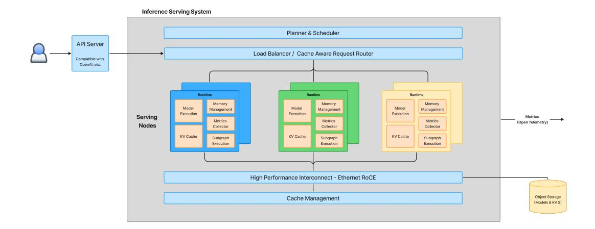

# 4 System Design

Building upon the cost optimization insights derived from our earlier framework in Section [3.1,](#page-8-0) we propose a comprehensive system architecture designed to facilitate flexible, efficient, and dynamic inference across heterogeneous hardware. The system takes as input a dataflow graph, dynamically schedules its execution according to optimal cost configurations computed via our convex optimization approach, and supports diverse AI agent workloads, including dynamic control flows, chained models, and external tool invocations. Moreover, it remains adaptable to evolving hardware landscapes comprising both high and low-end accelerators from vendors such as NVIDIA, Intel, and AMD.

#### 4.1 Orchestration and Serving System

> **[图片提取文字 (无描述)]:**
> Inference Serving System Planner & Scheduler API Server Load Balancer / Cache Aware Request Router Compatible with OpenAl, etc. Runtime Runtime Runtime Memory Memory Memory. Model Model Model Management Management Management Execution Execution Execution Serving Metrics Metrics Metrics (Open Telemetry) Nodes Collector Collector Collector KV Cache KV Cache KV Cache Subgraph Subgraph Subgraph Execution Execution Execution High Performance Interconnect - Ethernet RoCE Object Storage Cache Management (Models & KV S)

Figure 5: High-level orchestration and serving system architecture

Figure [5](#page-12-0) illustrates the high-level design of our orchestration and serving system. The architecture prioritizes several key objectives:

- 1. Scalability: Automatically scales agentic workloads across heterogeneous hardware resources based on load and utilization.
- 2. Flexibility: Supports both synchronous workloads activated externally via APIs and asynchronous workloads operating autonomously.
- 3. Composability: Facilitates multi-turn interactions activated through repeated API calls or system state changes.

The core functionality of our orchestration system involves dynamically planning and placing fine-grained computational components onto a distributed fleet of hardware. It continuously monitors node availability, workload characteristics, and resource utilization to inform placement decisions. This dynamic allocation helps prevent resource contention and optimizes both throughput and cost efficiency.

At a system level, the orchestration is designed to be deployed within distributed cluster environments, such as Kubernetes, employing a separation between a slow-path responsible for planning and resource allocation, and a fast-path for immediate execution.

The orchestration architecture includes the following primary components:

- Planner & Scheduler (Slow Path): Continuously monitors hardware resources and workloads, dynamically allocating tasks based on the optimization strategies outlined in Section [3.1.](#page-8-0) This component handles workload migration, resource allocation, and planning.
- Load Balancer / Request Router (Fast Path): Routes requests based on cache locality and model availability, optimizing resource utilization and request aggregation for performance.
- Runtime: Deployed to each accelerator node, the runtime encapsulates the core execution environment responsible for handling workloads from the scheduler. It implements mechanisms for model and subgraph execution, KV cache and memory management, and metrics collection. It is designed to run across heterogeneous environments by providing an abstraction to device specific capabilities.
- RDMA Transport Layer: Utilizes a high-performance Ethernet fabric with RDMA over Converged Ethernet (RoCE) to facilitate efficient transfer of models and caches. Abstraction layers and open standards ensure interoperability and optimal performance.
- Cache Manager: Manages distributed key-value (KV) caches, graph databases, and agent memory storage, employing strategies for offloading less frequently accessed data to slower storage mediums such as secondary memory tiers, disks, or object storage.

For efficient execution across nodes, our system explicitly accounts for network topology and interconnect performance metrics, including latency, bandwidth, and potential contention. The orchestration system optimizes data communication patterns, particularly leveraging RoCE for workloads that require minimal latency between computational stages. Since KV cache placement significantly influences data movement, the cache management system actively coordinates distributed KV cache locations to minimize overheads associated with data transfers.

Running agentic graphs across heterogeneous environments presents unique challenges. These graphs are often not constructed with hardware diversity in mind, and naïvely executing them on heterogeneous systems can lead to inefficiencies or execution failures. To support intelligent scheduling and robust execution across varied accelerators, we must rethink how these workloads are represented and structured.

We propose the following components to address these requirements, as depicted in Figure [6:](#page-13-0)

- Dataflow representation using MLIR dialect: A MLIR dialect to represent the various components of an agentic AI graph to enable a systematic HW agnostic representation and enable planning.
- Dataflow orchestration system: A scheduler that can analyze the workload, available hardware, and dynamically decide how to allocate granular fragments across hardware nodes.
- Dataflow compiler: A flexible compiler capable of taking high level workloads, partitioning and translating nodes and operations into optimized kernels for different hardware backends.

#### 4.2 MLIR as a Foundation for Heterogeneous Agent Execution

To support fine-grained analysis and optimization of agentic workloads across heterogeneous systems, we represent each workload as a program graph encoded in an intermediate representation. Specifically, we adopt the *Multi-Level Intermediate Representation (MLIR)* framework [\[31\]](#page-23-14), which provides a rich, extensible infrastructure for expressing and transforming computations across abstraction levels.

> **[图片提取文字 (无描述)]:**
> Device Compiler Deployment Scheduler Specific Assets Task Planner / **Profile Information** Resource Optimizer (Performance & Usage) Information Compute MLIR Representation Graph

Figure 6: System design stack from MLIR representation through task planning and compilation to deployment

Figure [6](#page-13-0) shows how MLIR acts as a bridge between the raw compute graph and deployment. Workloads are transformed through dialect-based intermediate representations, optimized using both static analysis and runtime resource feedback, and ultimately compiled and scheduled for execution across a heterogeneous set of backends.

Each task in the agent workload graph, ranging from LLM execution and memory access to tool calls and control logic, is assigned to an MLIR operation or subgraph. These operations are structured into dialects, which can be tailored to specific semantics (e.g., LLM inference, key-value caching, external tool APIs), enabling both domain-specific reasoning and cross-layer optimization.

#### MLIR for Agentic Workload Planning

The use of MLIR brings several benefits to system design and execution planning:

- 1. Compositional Representation: Tasks can be hierarchically composed, allowing for encapsulation of complex behavior (e.g., an agent that delegates to sub-agents or models).
- 2. Fusion and Decomposition: Using MLIR transformations, adjacent or dependent operations can be fused to reduce communication overhead, or decomposed to enable distributed execution.
- 3. Static Analysis for Scheduling: MLIR supports passes for bufferization, shape inference, cost estimation, and dependency analysis. These passes enable extraction of resource usage vectors θ (r) ij and latency terms tij , which feed directly into the convex optimization framework and scheduler.
- 4. Extensibility Across Modalities: New dialects can capture novel task types (e.g., retrieval-augmented generation, multi-modal decoding), making the framework future-proof and adaptable to evolving agent designs.
- 5. Target-Aware Lowering: Once optimized, MLIR graphs can be lowered into device-specific IRs such as LLVM IR [\[32\]](#page-23-15), TensorRT [\[33\]](#page-23-16), or XLA HLO [\[34\]](#page-23-17), or alternate backends such as TVM [\[35\]](#page-23-18), IREE [\[36\]](#page-23-19), or Glow [\[37\]](#page-23-20), facilitating backend compilation for CPUs, GPUs, NPUs, and other accelerators.

#### Agent frameworks to MLIR

Modern agent frameworks such as LangChain allow users to express complex workflows using a high-level orchestration interface. These workflows typically compose memory, tool invocations, and language model calls in an imperative style. To optimize and schedule such workflows over heterogeneous hardware, we require a structured representation that exposes task boundaries, data dependencies, and operation semantics.

To optimize high-level agent workflows over heterogeneous infrastructure, the system must first lower these workflows into structured, semantically rich intermediate representations. Figure [7](#page-15-0) illustrates this process. At the top, a LangChainstyle orchestration defines an agent with memory and two tools—Search() and Calculator()—invoked in response to a user query. While simple to author, such imperative code lacks the structural annotations required for effective scheduling and device mapping.

The high-level MLIR representation (bottom left) introduces a typed dataflow graph over operations such as memory access, LLM invocation, and tool usage. On the bottom right, we show a decomposed variant that exposes internal parallelism within the model execution, enabling hardware-aware optimization. Specifically, we model a hybrid parallelism strategy that combines expert parallelism—where only a sparse subset of experts are activated per token—with tensor parallelism within each expert.

This is made explicit via a gate.select operation that routes input tokens to top-k experts. Each expert is then executed in parallel using expert.tp.prefill and expert.tp.decode, indicating a tensor-parallel subgraph per expert.

The MLIR representations below illustrate how such a workflow can be lowered into a structured, graph-based intermediate form. On the left, a high-level MLIR encoding captures typed operations such as memory load/store, LLM invocation, and tool usage. On the right, the same graph is decomposed into finer-grained operations: the LLM call is split into prefill and decode, and each tool invocation is separated into a lookup and a compute stage. This transformation reveals internal parallelism and resource requirements, enabling the compiler to reason about scheduling, placement, and pipelining across a heterogeneous system.

Each operation can be annotated with profiling metadata, resource usage estimates, or placement hints. A system pass then transforms this high-level IR into an annotated task graph ready for convex optimization.

#### Towards Heterogeneous-Aware Compilers

The MLIR-based representation serves as a bridge between high-level workload semantics and low-level scheduling decisions. Just as traditional compilers optimize instruction placement and register allocation, this system-level compiler optimizes task placement and inter-device orchestration.

Crucially, such transformations are not limited to static programs. With extensions to support dynamic execution, asynchronous control flow, and runtime cost feedback, MLIR provides a foundation for compiling not just neural networks but distributed agentic systems that interact with tools, memory, and other agents in real time.

> **[图片提取文字 (无描述)]:**
> (c) MLIR Representation (Decomposed + Hy-(a) LangChain Orchestration (High-Level) brid Parallelism) response = Agent( agent.graph { tools=[Search(), Calculator()], %0 = input.query("Summarize the memory=ConversationBuffer() compute needs of AI over the ).run("Summarize the compute needs of next 5 years.") AI over the next 5 years.") %1 = memory.load(%0)// Expert routing and tensorparallel prefill %2 = gate.select(%1) %3 = expert.tp.prefill(%1, %2) %4 = merge.expert\_outputs(%3) (b) MLIR Representation (High-Level) %5 = allreduce(%4)// Expert routing and tensoragent.graph { parallel decode %0 = input.query("Summarize the %6 = gate.select(%5)compute needs of AI over the %7 = expert.tp.decode(%5, %6) next 5 years.") %8 = merge.expert\_outputs(%7) %1 = memory.load(%0) %9 = allreduce(%8) %2 = 11m.call(%1)%3 = tool.invoke(search, %2) %10 = tool.lookup(search, %9) %4 = tool.invoke(calculator, %3) %11 = tool.compute(calculator, %10) %5 = memory.store(%4) %12 = memory.store(%11) return %5 return %12

Figure 7: Transformation of a LangChain-style agent program into progressively lower-level MLIR representations. Panel (a) shows the original orchestration logic, while panels (b) and (c) illustrate how a compiler can lower this workflow into high-level and decomposed MLIR forms, enabling hybrid parallelism and heterogeneous hardware scheduling.

In this section, we have shown how we can start with a high-level agent definition that a developer might interact with, transform that into MLIR, and then use that MLIR to perform high-level optimizations. This optmized graph can then be scheduled using resource and run-time information across distributed infrastructure. Further, there is a compiler system that can take these MLIR operators and lower them to hardware-specific frameworks. Overall, this system allows for optimized deployment of entire agent workloads across a diverse set of hardware.

