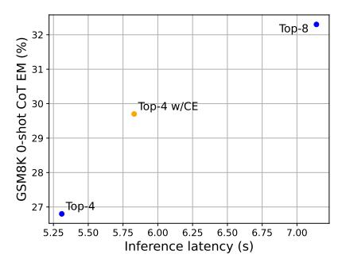

# MoE w/ CE params = 
$$3 \times (1024 \times 2048 \times 4 +$$
 
$$\frac{2 \times 2048 + 1024}{2 \times 203M} \times 16$$

In total, the number of active parameters for the original configuration is 1.28B, while the one with compressed experts is only 878M, resulting in a saving of 31.4%.

#### **B** Performance-Latency Trade-off

> **[图片提取文字 (无描述)]:**
> Top-8 GSM8K 0-shot CoT EM (%) 33 30 58 58 Top-4 w/CE Top-4 5.75 6.75 7.00 5.25 5.50 6.00 6.25 6.50 Inference latency (s)

Figure 5: The performance of OLMoE versus the inference latency, each point representing a different expert configuration. The Top-4 w/ CE configuration performs closely to the Top-8 configuration while achieving low inference latency close to Top-4.

We produce a similar plot as Figure 4 for OL-MoE. Similar to our observations with Phi-MoE, incorporating compressed experts into the Top-4 configuration strikes a favorable balance between efficiency and performance. Specifically, It only adds a minimal overhead on the inference latency compared with top-4, but noticeably closes the performance gap to top-8. This consistent trend across different models further validates the effectiveness of our approach.

|                       | Top-1 | Top-1 W/CE | Top-1-W/LoRA | Top-2 |
|-----------------------|-------|------------|--------------|-------|
| Inference latency (s) | 4.01  | 4.35       | 5.42         | 5.59  |

Table 7: Inference latency for alternative CE construction.

## C Alternative Compressed Experts Construction

During the development of our compressed expert design, we have explored alternatives such as autoencoder reductions or LoRA. However, we find that those approaches do not noticeably decrease the inference time. While these methods reduce the parameter count, they still require the execution of full forward passes through MLPs layers, similar to the full experts, thereby retaining much of the original computational overhead. For instance, we compare the inference latency of a LoRA-based implementation with rank 16 for Phi-MoE against our compressed expert approach in Table 7. As shown, LoRA still introduces a noticeable increase in inference time.

In contrast, our element-wise multiplication approach requires only a simple, low-cost operation to incorporate compressed experts into the model. Empirically, we found that this approach retains sufficient expressive power to capture the critical information from auxiliary experts while substantially lowering inference costs. We will include this discussion in our final manuscript.

#### D Training details

All experiments are conducted on NVIDIA A100 GPUs. Both models are optimized using the AdamW optimizer (Loshchilov et al., 2017) with a cosine learning rate scheduler. To accommodate differences in model scale, the initial learning rate for Phi-MoE is set to 1e-5, while for OLMoE, it is set to 2e-5. The sequence length is fixed at 4096, and the global batch size is 128.

#### **E** Dataset Details

The TÜLU 3 dataset is under the ODC-BY-1.0 license. The MathInstruct dataset is under MIT license. The Magicoder dataset is under Apache-2.0 license.

The data does not contain information that can be used to uniquely identify individual people or offensive content.

## F Potential Risks

This paper presents work whose goal is to advance the field of NLP. There are many potential societal consequences of our work, none which we feel must be specifically highlighted here.