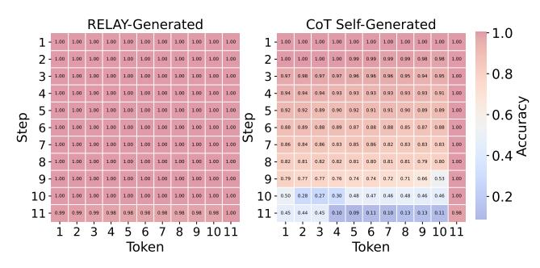
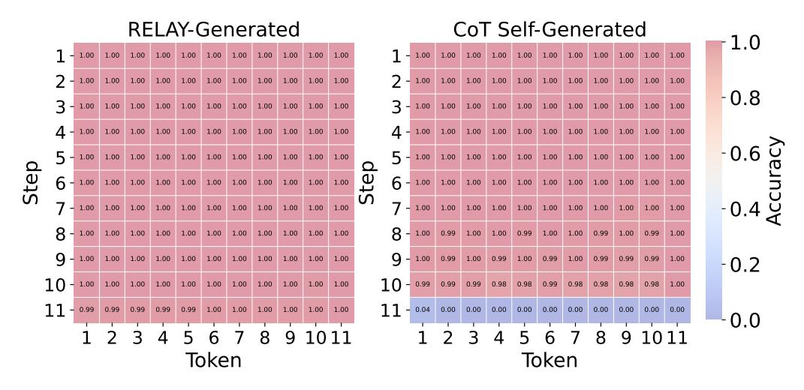

# **4.3.** Evaluating the Reliability of RELAY-Generated Intermediate Reasoning Steps

This section aims to demonstrate the reliability of CoT chains generated by the looped model with explicit CoT alignment compared to the auto-regressive CoT model's self-generated data. Specifically, we highlight that the generated data from the auto-regressive CoT model, even when the final result is correct, often contains incorrect intermediate steps, which is why utilizing these data fails to improve

> **[图片提取文字 (无描述)]:**
> RELAY-Generated CoT Self-Generated 1.0 1.00 1.00 1.00 1.00 Step Ste 1.00 1.00 1.00 1.00 Token Token

Figure 5. Hit accuracy matrices for the LIS task with a problem length of 105 (T = 11 steps).

the model's performance in complex problems with longer lengths. In contrast, data generated by the looped model with explicit CoT alignment avoids these issues by ensuring both accurate intermediate reasoning steps and the final answer, enabling effective fine-tuning of the auto-regressive model and significantly enhancing its performance.

**Experimental Setup.** We evaluate the effectiveness of two types of generated data: by the looped model with explicit CoT alignment and the auto-regressive CoT model. This evaluation focuses on two metrics: (1) hit matrix and (2) bit accuracy, which provides a detailed perspective on reasoning steps reliability.

For the hit matrix, we select the LIS task as an example due to the structured nature of its reasoning steps. The intermediate reasoning steps of LIS tasks follows a  $T \times 11$  matrix format, where T corresponds to the number of CoT steps as well as the iteration number of the looped model, and 11 represents the number of tokens per step (10 numbers as prescribed in our dataset, along with one delimeter <sep>). This structured format makes the LIS task particularly suitable for evaluating and visualizing reasoning step reliability, offering an intuitive representation of the proportion of tokens at each position that match the ground truth reasoning steps.

Bit accuracy is provided across all three tasks of varying lengths, evaluating token-wise counted accuracy for the whole reasoning step. Comparisons are made between the auto-regressive CoT models fine-tuned by the two types of generated data respectively.

For the auto-regressive CoT model self-generated data, we conduct the following experiment under two parallel settings, using either a vanilla looped model or ground-truth answers as verifiers. The experiment consists of the following steps: (1) Use the auto-regressive CoT model to generate CoT chains for long problem lengths. (2) Filter these data by the looped model or ground-truth, retaining only those where the final answers match. (3) The filtered data are then used to fine-tune the auto-regressive CoT model. The fine-tuning process aims to improve the model's ability to

generate reasoning trajectories and reach the correct final answer for longer problems.

Meanwhile, data generated by the looped model with explicit CoT alignment is employed as the fine-tuning dataset for the same initial auto-regressive CoT model checkpoint, under the same fine-tuning parameters and controlled ratio of samples with different lengths. Both approaches are evaluated across three tasks with varying lengths to assess performance improvements.

Results. We evaluate the hit accuracy matrix for the LIS task with a problem length of 105, which corresponds to  $T = \lceil 105/10 \rceil = 11$  steps, resulting in an  $11 \times 11$  matrix (We also provide results for problem length of 101 in Appendix B). As shown in Figure 5, data generated by the looped model with explicit CoT alignment achieves consistently high token accuracy across all positions, with most values approaching 100 %, demonstrating its ability to produce high-quality and reliable data. (Q4) In contrast, the data generated by the auto-regressive CoT model exhibits high token accuracy only in the first few positions, while the accuracy steadily decreases in later steps. Although the delimiter tokens <sep> at the end of each step achieve high accuracy, this simply implies that the auto-regressive CoT model has only captured the basic format of the reasoning process but fails to predict accurate tokens, which indicates its limited capability to maintain accurate prediction throughout the reasoning process for longer problems.

The bit accuracy results for the models fine-tuned with different datasets across the three tasks (Arithmetic, ED, LIS) and varying problem lengths are provided in Appendix C.

We additionally provide the accuracy of the final answer for the auto-regressive CoT model fine-tuned with self-generated data in Figure 4, noted as "AR-CoT + Self Chains & Loop/GT Answers", corresponding to data filtered by the looped model or ground-truth answers, respectively, which only shows a slight improvement over the baseline model.

#### 5. Conclusion

This paper introduces **RELAY** (**RE**asoning through **L**oop **A**lignment iterativel **Y**), a framework enhancing Chain-of-Thought reasoning by combining looped and auto-regressive Transformers. Our contributions show that (1) a looped Transformer can serve as a general-purpose reasoner with strong length generalization, (2) iteration-wise alignment enables accurate reasoning chain generation beyond training length, and (3) RELAY improves auto-regressive models through high-quality generated reasoning chains. Future work could explore the theoretical foundations of looped Transformers' length generalization and extend RELAY to broader language tasks.

## Impact Statement

This paper presents work whose goal is to advance the field of Machine Learning. There are many potential societal consequences of our work, none which we feel must be specifically highlighted here.

## References

- Chen, B., Li, X., Liang, Y., Shi, Z., and Song, Z. Bypassing the exponential dependency: Looped transformers efficiently learn in-context by multi-step gradient descent. *arXiv preprint arXiv:2410.11268*, 2024.
- Chen, S., Wong, S., Chen, L., and Tian, Y. Extending context window of large language models via positional interpolation. *arXiv preprint arXiv:2306.15595*, 2023.
- Chi, T.-C., Fan, T.-H., Ramadge, P. J., and Rudnicky, A. Kerple: Kernelized relative positional embedding for length extrapolation. *Advances in Neural Information Processing Systems*, 35:8386–8399, 2022.
- Chi, T.-C., Fan, T.-H., Rudnicky, A., and Ramadge, P. Dissecting transformer length extrapolation via the lens of receptive field analysis. In *Proceedings of the 61st Annual Meeting of the Association for Computational Linguistics (Volume 1: Long Papers)*, pp. 13522–13537, 2023.
- de Luca, A. B. and Fountoulakis, K. Simulation of graph algorithms with looped transformers. In *Fortyfirst International Conference on Machine Learning*, 2024. URL [https://openreview.net/forum?](https://openreview.net/forum?id=aA2326y3hf) [id=aA2326y3hf](https://openreview.net/forum?id=aA2326y3hf).
- DeepSeek-AI, Guo, D., Yang, D., Zhang, H., Song, J., Zhang, R., Xu, R., Zhu, Q., Ma, S., Wang, P., Bi, X., Zhang, X., Yu, X., Wu, Y., Wu, Z. F., Gou, Z., Shao, Z., Li, Z., Gao, Z., Liu, A., Xue, B., Wang, B., Wu, B., Feng, B., Lu, C., Zhao, C., Deng, C., Zhang, C., Ruan, C., Dai, D., Chen, D., Ji, D., Li, E., Lin, F., Dai, F., Luo, F., Hao, G., Chen, G., Li, G., Zhang, H., Bao, H., Xu, H., Wang, H., Ding, H., Xin, H., Gao, H., Qu, H., Li, H., Guo, J., Li, J., Wang, J., Chen, J., Yuan, J., Qiu, J., Li, J., Cai, J. L., Ni, J., Liang, J., Chen, J., Dong, K., Hu, K., Gao, K., Guan, K., Huang, K., Yu, K., Wang, L., Zhang, L., Zhao, L., Wang, L., Zhang, L., Xu, L., Xia, L., Zhang, M., Zhang, M., Tang, M., Li, M., Wang, M., Li, M., Tian, N., Huang, P., Zhang, P., Wang, Q., Chen, Q., Du, Q., Ge, R., Zhang, R., Pan, R., Wang, R., Chen, R. J., Jin, R. L., Chen, R., Lu, S., Zhou, S., Chen, S., Ye, S., Wang, S., Yu, S., Zhou, S., Pan, S., Li, S. S., Zhou, S., Wu, S., Ye, S., Yun, T., Pei, T., Sun, T., Wang, T., Zeng, W., Zhao, W., Liu, W., Liang, W., Gao, W., Yu, W., Zhang, W., Xiao, W. L., An, W., Liu, X., Wang, X., Chen, X., Nie, X., Cheng, X., Liu, X., Xie, X., Liu, X., Yang,

- X., Li, X., Su, X., Lin, X., Li, X. Q., Jin, X., Shen, X., Chen, X., Sun, X., Wang, X., Song, X., Zhou, X., Wang, X., Shan, X., Li, Y. K., Wang, Y. Q., Wei, Y. X., Zhang, Y., Xu, Y., Li, Y., Zhao, Y., Sun, Y., Wang, Y., Yu, Y., Zhang, Y., Shi, Y., Xiong, Y., He, Y., Piao, Y., Wang, Y., Tan, Y., Ma, Y., Liu, Y., Guo, Y., Ou, Y., Wang, Y., Gong, Y., Zou, Y., He, Y., Xiong, Y., Luo, Y., You, Y., Liu, Y., Zhou, Y., Zhu, Y. X., Xu, Y., Huang, Y., Li, Y., Zheng, Y., Zhu, Y., Ma, Y., Tang, Y., Zha, Y., Yan, Y., Ren, Z. Z., Ren, Z., Sha, Z., Fu, Z., Xu, Z., Xie, Z., Zhang, Z., Hao, Z., Ma, Z., Yan, Z., Wu, Z., Gu, Z., Zhu, Z., Liu, Z., Li, Z., Xie, Z., Song, Z., Pan, Z., Huang, Z., Xu, Z., Zhang, Z., and Zhang, Z. Deepseek-r1: Incentivizing reasoning capability in llms via reinforcement learning, 2025. URL <https://arxiv.org/abs/2501.12948>.
- Dehghani, M., Gouws, S., Vinyals, O., Uszkoreit, J., and Kaiser, L. Universal transformers. In *International Conference on Learning Representations*, 2019. URL [https://openreview.net/forum?](https://openreview.net/forum?id=HyzdRiR9Y7) [id=HyzdRiR9Y7](https://openreview.net/forum?id=HyzdRiR9Y7).
- Fan, Y., Du, Y., Ramchandran, K., and Lee, K. Looped transformers for length generalization. *arXiv preprint arXiv:2409.15647*, 2024.
- Feng, G., Zhang, B., Gu, Y., Ye, H., He, D., and Wang, L. Towards revealing the mystery behind chain of thought: a theoretical perspective. *Advances in Neural Information Processing Systems*, 36, 2024.
- Gao, Y., Zheng, C., Xie, E., Shi, H., Hu, T., Li, Y., Ng, M. K., Li, Z., and Liu, Z. On the expressive power of a variant of the looped transformer. *arXiv preprint arXiv:2402.13572*, 2024.
- Gatmiry, K., Saunshi, N., Reddi, S. J., Jegelka, S., and Kumar, S. Can looped transformers learn to implement multi-step gradient descent for in-context learning? *arXiv preprint arXiv:2410.08292*, 2024.
- Giannou, A., Rajput, S., Sohn, J.-Y., Lee, K., Lee, J. D., and Papailiopoulos, D. Looped transformers as programmable computers. In *Proceedings of the 40th International Conference on Machine Learning*, volume 202 of *Proceedings of Machine Learning Research*, pp. 11398–11442. PMLR, 23–29 Jul 2023. URL [https://proceedings.mlr.press/](https://proceedings.mlr.press/v202/giannou23a.html) [v202/giannou23a.html](https://proceedings.mlr.press/v202/giannou23a.html).
- Hendrycks, D., Burns, C., Kadavath, S., Arora, A., Basart, S., Tang, E., Song, D., and Steinhardt, J. Measuring mathematical problem solving with the MATH dataset. In *Thirty-fifth Conference on Neural Information Processing Systems Datasets and Benchmarks Track (Round 2)*, 2021. URL [https://openreview.net/forum?](https://openreview.net/forum?id=7Bywt2mQsCe) [id=7Bywt2mQsCe](https://openreview.net/forum?id=7Bywt2mQsCe).

- Hosseini, A., Yuan, X., Malkin, N., Courville, A., Sordoni, A., and Agarwal, R. V-STar: Training verifiers for self-taught reasoners. In *First Conference on Language Modeling*, 2024. URL [https://openreview.net/](https://openreview.net/forum?id=stmqBSW2dV) [forum?id=stmqBSW2dV](https://openreview.net/forum?id=stmqBSW2dV).
- Jin, M., Yu, Q., Shu, D., Zhao, H., Hua, W., Meng, Y., Zhang, Y., and Du, M. The impact of reasoning step length on large language models. In *Findings of the Association for Computational Linguistics: ACL 2024*, pp. 1830–1842. Association for Computational Linguistics, August 2024. URL [https://aclanthology.org/](https://aclanthology.org/2024.findings-acl.108/) [2024.findings-acl.108/](https://aclanthology.org/2024.findings-acl.108/).
- Khot, T., Trivedi, H., Finlayson, M., Fu, Y., Richardson, K., Clark, P., and Sabharwal, A. Decomposed prompting: A modular approach for solving complex tasks. *arXiv preprint arXiv:2210.02406*, 2022.
- Lan, Z., Chen, M., Goodman, S., Gimpel, K., Sharma, P., and Soricut, R. Albert: A lite bert for selfsupervised learning of language representations. In *International Conference on Learning Representations*, 2020. URL [https://openreview.net/forum?](https://openreview.net/forum?id=H1eA7AEtvS) [id=H1eA7AEtvS](https://openreview.net/forum?id=H1eA7AEtvS).
- Li, S., You, C., Guruganesh, G., Ainslie, J., Ontanon, S., Zaheer, M., Sanghai, S., Yang, Y., Kumar, S., and Bhojanapalli, S. Functional interpolation for relative positions improves long context transformers. In *The Twelfth International Conference on Learning Representations*, 2024. URL [https://openreview.net/forum?](https://openreview.net/forum?id=rR03qFesqk) [id=rR03qFesqk](https://openreview.net/forum?id=rR03qFesqk).
- Lightman, H., Kosaraju, V., Burda, Y., Edwards, H., Baker, B., Lee, T., Leike, J., Schulman, J., Sutskever, I., and Cobbe, K. Let's verify step by step. In *The Twelfth International Conference on Learning Representations*, 2024. URL [https://openreview.net/forum?](https://openreview.net/forum?id=v8L0pN6EOi) [id=v8L0pN6EOi](https://openreview.net/forum?id=v8L0pN6EOi).
- Mao, Y., Li, J., Meng, F., Xiong, J., Zheng, Z., and Zhang, M. Lift: Improving long context understanding through long input fine-tuning. *arXiv preprint arXiv:2412.13626*, 2024.
- Merrill, W. and Sabharwal, A. The expressive power of transformers with chain of thought. In *The Twelfth International Conference on Learning Representations*, 2024. URL [https://openreview.net/forum?](https://openreview.net/forum?id=NjNGlPh8Wh) [id=NjNGlPh8Wh](https://openreview.net/forum?id=NjNGlPh8Wh).
- Paul, D., West, R., Bosselut, A., and Faltings, B. Making reasoning matter: Measuring and improving faithfulness of chain-of-thought reasoning. In *Findings of the Association for Computational Linguistics: EMNLP 2024*, pp. 15012–15032, Miami, Florida, USA,

- November 2024. Association for Computational Linguistics. URL [https://aclanthology.org/2024.](https://aclanthology.org/2024.findings-emnlp.882/) [findings-emnlp.882/](https://aclanthology.org/2024.findings-emnlp.882/).
- Peng, B., Quesnelle, J., Fan, H., and Shippole, E. YaRN: Efficient context window extension of large language models. In *The Twelfth International Conference on Learning Representations*, 2024. URL [https://openreview.](https://openreview.net/forum?id=wHBfxhZu1u) [net/forum?id=wHBfxhZu1u](https://openreview.net/forum?id=wHBfxhZu1u).
- Press, O., Smith, N., and Lewis, M. Train short, test long: Attention with linear biases enables input length extrapolation. 2022.
- Raffel, C., Shazeer, N., Roberts, A., Lee, K., Narang, S., Matena, M., Zhou, Y., Li, W., and Liu, P. J. Exploring the limits of transfer learning with a unified text-to-text transformer. *The Journal of Machine Learning Research*, 21(1):5485–5551, 2020.
- Ruoss, A., Deletang, G., Genewein, T., Grau-Moya, J., ´ Csordas, R., Bennani, M., Legg, S., and Veness, J. Ran- ´ domized positional encodings boost length generalization of transformers. pp. 1889–1903, Toronto, Canada, July 2023. Association for Computational Linguistics. doi: 10.18653/v1/2023.acl-short.161. URL [https://](https://aclanthology.org/2023.acl-short.161/) [aclanthology.org/2023.acl-short.161/](https://aclanthology.org/2023.acl-short.161/).
- Singh, A., Co-Reyes, J. D., Agarwal, R., Anand, A., Patil, P., Garcia, X., Liu, P. J., Harrison, J., Lee, J., Xu, K., Parisi, A. T., Kumar, A., Alemi, A. A., Rizkowsky, A., Nova, A., Adlam, B., Bohnet, B., Elsayed, G. F., Sedghi, H., Mordatch, I., Simpson, I., Gur, I., Snoek, J., Pennington, J., Hron, J., Kenealy, K., Swersky, K., Mahajan, K., Culp, L. A., Xiao, L., Bileschi, M., Constant, N., Novak, R., Liu, R., Warkentin, T., Bansal, Y., Dyer, E., Neyshabur, B., Sohl-Dickstein, J., and Fiedel, N. Beyond human data: Scaling self-training for problem-solving with language models. *Transactions on Machine Learning Research*, 2024. ISSN 2835-8856. URL [https://](https://openreview.net/forum?id=lNAyUngGFK) [openreview.net/forum?id=lNAyUngGFK](https://openreview.net/forum?id=lNAyUngGFK). Expert Certification.
- Su, J., Ahmed, M., Lu, Y., Pan, S., Bo, W., and Liu, Y. Roformer: Enhanced transformer with rotary position embedding. *Neurocomput.*, 568(C), March 2024.
- Sun, Y., Dong, L., Patra, B., Ma, S., Huang, S., Benhaim, A., Chaudhary, V., Song, X., and Wei, F. A lengthextrapolatable transformer. In *Proceedings of the 61st Annual Meeting of the Association for Computational Linguistics (Volume 1: Long Papers)*. Association for Computational Linguistics, July 2023.
- Wei, J., Wang, X., Schuurmans, D., Bosma, M., Xia, F., Chi, E., Le, Q. V., Zhou, D., et al. Chain-of-thought prompting elicits reasoning in large language models. *Advances in*

- *neural information processing systems*, 35:24824–24837, 2022.
- Xia, M., Malladi, S., Gururangan, S., Arora, S., and Chen, D. LESS: Selecting influential data for targeted instruction tuning. In *International Conference on Machine Learning (ICML)*, 2024.
- Xiao, C. and Liu, B. Conditions for length generalization in learning reasoning skills. *arXiv preprint arXiv:2311.16173*, 2023.
- Xu, K. and Sato, I. On expressive power of looped transformers: Theoretical analysis and enhancement via timestep encoding. *arXiv preprint arXiv:2410.01405*, 2024.
- Yang, L., Lee, K., Nowak, R. D., and Papailiopoulos, D. Looped transformers are better at learning learning algorithms. In *The Twelfth International Conference on Learning Representations*, 2024. URL [https:](https://openreview.net/forum?id=HHbRxoDTxE) [//openreview.net/forum?id=HHbRxoDTxE](https://openreview.net/forum?id=HHbRxoDTxE).
- Yuan, Z., Yuan, H., Li, C., Dong, G., Lu, K., Tan, C., Zhou, C., and Zhou, J. Scaling relationship on learning mathematical reasoning with large language models, 2024. URL [https://openreview.net/forum?](https://openreview.net/forum?id=cijO0f8u35) [id=cijO0f8u35](https://openreview.net/forum?id=cijO0f8u35).
- Zelikman, E., Wu, Y., Mu, J., and Goodman, N. STar: Bootstrapping reasoning with reasoning. In Oh, A. H., Agarwal, A., Belgrave, D., and Cho, K. (eds.), *Advances in Neural Information Processing Systems*, 2022. URL [https://openreview.net/forum?](https://openreview.net/forum?id=_3ELRdg2sgI) [id=\\_3ELRdg2sgI](https://openreview.net/forum?id=_3ELRdg2sgI).
- Zhou, C., Liu, P., Xu, P., Iyer, S., Sun, J., Mao, Y., Ma, X., Efrat, A., Yu, P., YU, L., Zhang, S., Ghosh, G., Lewis, M., Zettlemoyer, L., and Levy, O. LIMA: Less is more for alignment. In *Thirty-seventh Conference on Neural Information Processing Systems*, 2023. URL [https:](https://openreview.net/forum?id=KBMOKmX2he) [//openreview.net/forum?id=KBMOKmX2he](https://openreview.net/forum?id=KBMOKmX2he).
- Zhu, D., Yang, N., Wang, L., Song, Y., Wu, W., Wei, F., and Li, S. PoSE: Efficient context window extension of LLMs via positional skip-wise training. In *The Twelfth International Conference on Learning Representations*, 2024. URL [https://openreview.net/forum?](https://openreview.net/forum?id=3Z1gxuAQrA) [id=3Z1gxuAQrA](https://openreview.net/forum?id=3Z1gxuAQrA).

## A. Task Descriptions

Below, we present the detailed descriptions of each task from [Feng et al.](#page-8-0) [\(2024\)](#page-8-0), including examples of inputs, expected answers, and the corresponding Chain-of-Thought (CoT) reasoning steps used to derive the final answers.

- 1. Arithmetic. This task involves computing the answer of arithmetic expressions containing numbers, basic operations (+, −, ×, ÷, =), and brackets. For example:
  - Input: (6 + 9) ÷ (7 + 2 × 5 − 4 × 3) =
  - CoT Steps:

$$15 \div (7 + 2 \times 5 - 4 \times 3) =$$

$$15 \div (7 + 10 - 4 \times 3) =$$

$$15 \div (17 - 4 \times 3) =$$

$$15 \div (17 - 12) =$$

$$15 \div 5 =$$

- Answer: 3
- 2. Edit Distance (ED). This task requires computing the minimum number of operations (insert, delete, or replace) needed to transform one sequence into another. The input consists of two sequences separated by a delimiter |:
  - Input: o t m l | o t t m l <sep> • CoT Steps: 0 2 4 6 7 , 2 0 2 4 6 , 4 2 3 2 4 ,

6 4 5 4 2 ,

• Answer: 2

Each row corresponds to the edit distance matrix, and the final answer is the edit distance.

- 3. Longest Increasing Subsequence (LIS). This task identifies the length of longest strictly increasing subsequence in a numerical sequence. The input is a sequence of integers followed by a delimiter <sep>:
  - Input: 103 110 145 217 233 18 30 82 141 150 159 161 167 239 <sep>
  - CoT Steps:

1 2 3 4 5 1 2 3 4 5 <sep> 6 7 8 9 9 9 9 9 9 9 <sep>

• Answer: 9

Here, each CoT step represents an intermediate computation in the dynamic programming process, folded into fixed-size groups (10 numbers per step in our setting) to align with the model structure. If the last group has fewer than 10 numbers, the last number is repeated until the group size reaches 10.

## B. Hit Matrix for LIS Task with Length 101

We also analyze the hit accuracy matrix for the LIS task with a problem length of 101, corresponding to T = ⌈101/10⌉ = 11 reasoning steps, as shown in Figure [6.](#page-12-1) The results exhibit a similar trend to those observed for length 105, with a notable decline in accuracy in the later reasoning steps for data generated by the auto-regressive CoT model, while RELAY-generated data consistently maintains high accuracy. Specifically, while the initial steps maintain relatively high token accuracy, the accuracy deteriorates significantly in later steps, failing to achieve accurate final answers. This highlights a key limitation of using CoT self-generated data for supervision: even when the problem length is only slightly beyond the training length, the CoT model struggles to generate accurate reasoning steps towards the end, making it infeasible to fine-tune the model using only the final answer as supervision, as the lack of intermediate reasoning accuracy prevents meaningful improvements in model's performance of handling longer problems.

> **[图片提取文字 (无描述)]:**
> RELAY-Generated CoT Self-Generated 1.0 1.00 1.00 1.00 1.00 1.00 1.00 1.00 1.00 1.00 1.00 1.00 1.00 1.00 1.00 1.00 1.00 1.00 1.00 1.00 1.00 1.00 - 0.8 1.00 1.00 1.00 1.00 1.00 1.00 1.00 1.00 1.00 1.00 1.00 1.00 1.00 1.00 1.00 1.00 1.00 1.00 1.00 1.00 1.00 1.00 1.00 1.00 1.00 1.00 1.00 1.00 1.00 1.00 1.00 Step 1.00 1.00 1.00 1.00 1.00 1.00 1.00 1.00 1.00 1.00 1.00 1.00 1.00 0.99 1.00 1.00 0.99 0.99 1.00 1.00 1.00 1.00 1.00 - 0.2 1.00 1.00 1.00 1.00 1.00 1.00 1.00 1.00 1.00 0.98 0.98 0.99 0.99 0.99 1.00 0.00 0.00 0.00 0.00 0.00 0.00 0.00 0.99 1.00 1.00 1.00 0.00 0.00 0.00 8 Token Token

Figure 6. Hit accuracy matrices for the LIS task with a problem length of 101 (T = 11 steps).

## C. Bit Accuracy

The bit accuracy results for the models fine-tuned with different datasets across the three tasks (Arithmetic, ED, LIS) and varying problem lengths are shown in Figure 7. Each subfigure corresponds to one task and includes curves showing the bit accuracy of five models over varying problem lengths: (1) **RELAY-enhanced CoT:** the auto-regressive CoT model fine-tuned with data generated by RELAY, (2) **Looped with Explicit CoT Alignment**, (3) **AR-CoT + Self Chains & Loop Answers:** the auto-regressive CoT model fine-tuned with its self-generated data using looped model answers as labels, (4) **AR-CoT + Self Chains & GT Answers:** the auto-regressive CoT model fine-tuned with its self-generated data using ground-truth answers as labels, and (5) **AR-CoT Baseline:** the baseline auto-regressive CoT model as a reference, also as the initial auto-regressive CoT model before fine-tuned.

As illustrated in Figure 7, both the looped model with CoT alignment and the auto-regressive CoT model fine-tuned with data generated by it consistently achieve high bit accuracy across all tasks and problem lengths. Notably, they maintain over 90% bit accuracy even at lengths extending beyond the training data (up to +10 for Arithmetic and ED tasks, and +20 for the LIS task in our setting). This highlights not only the robustness and reliability of the looped model with CoT alignment in length extrapolation scenarios but also the effectiveness of its generated data in significantly enhancing the performance of the auto-regressive CoT model.

In contrast, the auto-regressive CoT model fine-tuned with its own self-generated data shows limited improvement over the baseline model. This is consistent across all tasks and highlights a critical limitation: the self-generated data often contain incorrect intermediate steps, even when the final results are correct. These inaccuracies hinder the model's ability to generalize and perform well on longer problem lengths, reinforcing the importance of reliable intermediate reasoning steps for effective fine-tuning.

> **[图片提取文字 (无描述)]:**
> Task: Arithmetic Task: ED Task: LIS Models --- RELAY-enhanced CoT Looped with Explicit
> CoT Alignment AR-CoT + Self Chains & Loop Answers AR-CoT + Self Chains & GT Answers AR-CoT Baseline 15 16 17 18 19 20 21 22 23 24 25 30 31 32 33 34 35 36 37 38 116 120 Problem Length Problem Length Problem Length

Figure 7. Bit accuracy over varying problem lengths for three tasks: Arithmetic, ED, and LIS.

## D. Details for training and fine-tuning

## D.1. Hyper-parameters

In our experiments, we trained three different models: (1) the looped model with CoT alignment, (2) the auto-regressive CoT model, and (3) the vanilla looped model. All models were trained from scratch on the same dataset, which consists of 1 million samples for each of the three tasks. The task-specific training weights and training hyper-parameters are provided in Table [1.](#page-13-1)

| Training Hyper-parameters | Looped Model with CoT Alignment | CoT Model | Vanilla Looped Model |
|---------------------------|---------------------------------|-----------|----------------------|
| Epoch                     | 500                             | 500       | 500                  |
| Batch Size                | 512                             | 512       | 512                  |
| Learning Rate             | 5e-4                            | 5e-4      | 1e-3                 |
| Learning Rate Schedule    | linear                          | linear    | linear               |
| Warmup Ratio              | 0.01                            | 0.01      | 0.01                 |
| Optimizer                 | AdamW                           | AdamW     | AdamW                |
| Weight Decay              | 0.01                            | 0.01      | 0.01                 |
| Drop out                  | 0.1                             | 0.1       | 0.1                  |
| Weight of ARI             | 1                               | 1         | 1                    |
| Weight of ED              | 1                               | 10        | 10                   |
| Weight of LIS             | 1                               | 5         | 5                    |

Table 1. Training Hyper-parameters of Different Models

For fine-tuning, we used data generated by RELAY and CoT model self-generated data to fine-tune the auto-regressive CoT model. The fine-tuning process followed a similar setup, as detailed in Table [2.](#page-13-2)

| Fine-tuning Hyper-parameters | RELAY-Generated Data | Self-Generated Data |  |
|------------------------------|----------------------|---------------------|--|
| Epoch                        | 500                  | 100 (per phase)     |  |
| Batch Size                   | 512                  | 512                 |  |
| Learning Rate                | 1e-4                 | 5e-5                |  |
| Learning Rate Schedule       | linear               | linear              |  |
| Warmup Ratio                 | 0.01 0.01         |                     |  |
| Optimizer                    | AdamW                | AdamW               |  |
| Weight Decay                 | 0.01                 | 0.01                |  |
| Drop out                     | 0.1                  | 0.1                 |  |
| Weight of ARI                | 1                    | 1                   |  |
| Weight of ED                 | 10                   | 1                   |  |
| Weight of LIS                | 5                    | 1                   |  |

Table 2. Fine-tuning Hyper-parameters

### D.2. Sample Length Distribution of Datasets

The original training dataset for training the three models consists of 1 million samples for each task, following a distribution where the number of samples is proportional to problem length.

The merged dataset used for fine-tuning consists of 100 k samples for each of the three tasks, incorporating both the original training data and newly generated samples from extended problem lengths.

For the looped model with explicit CoT alignment, we introduce additional data covering problem lengths of [16, 25] for Arithmetic, [31, 40] for ED, and [101, 120] for LIS. These newly generated samples are merged with the original dataset while maintaining a balanced proportion across different length ranges to ensure effective training. The specific numbers of

#### Enhancing Auto-regressive Chain-of-Thought through Loop-Aligned Reasoning

samples for different problem lengths in the final merged dataset are provided in Table [3.](#page-15-0)

For the self-generated dataset, we adopt an incremental approach, since the accuracy of original CoT model diminishes rapidly as the problem length increases. Specifically, we maintain a total dataset size of 100 k samples for each task. The initial dataset consists of problems with lengths ≤ 15, 30, and 100 for Arithmetic, ED, and LIS, respectively. The CoT model is progressively fine-tuned over five phases, each including self-generation on slightly longer problems and followed by 100 epochs of fine-tuning. After each phase, a subset of the current dataset is randomly combined with the newly generated reasoning steps to form an updated synthetic dataset. The maximum number of samples selected for each problem length is detailed in Table [4.](#page-16-0)

Table 3. Number of Samples for Different Problem Lengths in Merged Dataset

| Task                        | Arithmetic | ED         | LIS         |
|-----------------------------|------------|------------|-------------|
| Length                      | ≤ 15       | ≤ 30       | ≤ 100       |
| Number of Samples           | 42515      | 60844      | 73235       |
| Length                      | 16         | 31         | 101         |
| Number of Samples           | 6477       | 4195       | 1479        |
| Length                      | 17         | 32         | 102         |
| Number of Samples           | 6882       | 4195       | 1464        |
| Length                      | 18         | 33         | 103         |
| Number of Samples           | 7287       | 4055       | 1449        |
| Length                      | 19         | 34         | 104         |
| Number of Samples           | 6477       | 4055       | 1434        |
| Length                      | 20         | 35         | 105         |
| Number of Samples           | 6072       | 3916       | 1420        |
| Length                      | 21         | 36         | 106         |
| Number of Samples           | 5668       | 3916       | 1405        |
| Length                      | 22         | 37         | 107         |
| Number of Samples           | 5263       | 3776       | 1390        |
| Length                      | 23         | 38         | 108         |
| Number of Samples           | 4858       | 3776       | 1375        |
| Length                      | 24         | 39         | 109         |
| Number of Samples           | 4453       | 3636       | 1360        |
| Length Number of Samples | 25 4048 | 40 3636 | 110 1346 |
|                             |            |            |             |
| Length Number of Samples |            |            | 111 1331 |
| Length                      |            |            | 112         |
| Number of Samples           |            |            | 1316        |
| Length                      |            |            | 113         |
| Number of Samples           |            |            | 1301        |
| Length                      |            |            | 114         |
| Number of Samples           |            |            | 1286        |
| Length                      |            |            | 115         |
| Number of Samples           |            |            | 1272        |
| Length                      |            |            | 116         |
| Number of Samples           |            |            | 1257        |
| Length Number of Samples |            |            | 117 1242 |
| Length                      |            |            | 118         |
| Number of Samples           |            |            | 1227        |
| Length                      |            |            | 119         |
| Number of Samples           |            |            | 1213        |
| Length                      |            |            | 120         |
| Number of Samples           |            |            | 1198        |

Table 4. Number of Samples Generated for Different Lengths

| Properties |                | ARI   | ED    | LIS   |
|------------|----------------|-------|-------|-------|
| Phase I    | Length         | 16    | 31    | 101   |
|            | Data Generated | 15000 | 15000 | 15000 |
| Phase II   | Length         | 17    | 32    | 102   |
|            | Data Generated | 10000 | 10000 | 10000 |
| Phase III  | Length         | 18    | 33    | 103   |
|            | Data Generated | 7500  | 7500  | 7500  |
| Phase IV   | Length         | 19    | 34    | 104   |
|            | Data Generated | 6000  | 3000  | 3000  |
| Phase V    | Length         | 20    | 35    | 105   |
|            | Data Generated | 5000  | 3000  | 3000  |