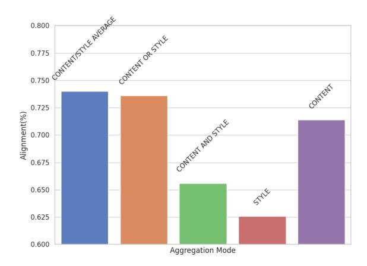
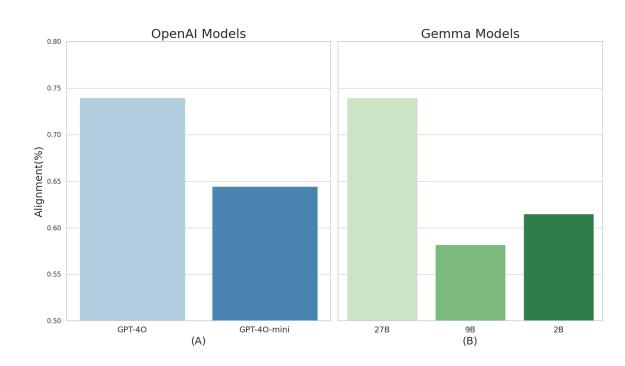
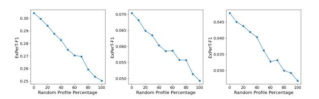
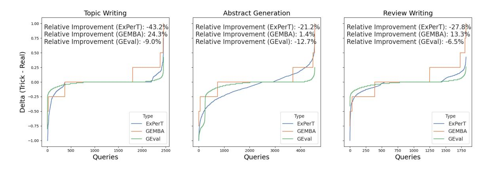

# 3 Experiments

#### 3.1 Experimental Setup

Datasets & Tasks. We use datasets from the LongLaMP benchmark [\(Kumar et al.,](#page-10-2) [2024\)](#page-10-2), which is designed for evaluating personalized long-form text generation. Specifically, we conduct experiments on the tasks of Personalized Abstract Generation, Personalized Topic Writing, and Personalized Review Writing. Due to privacy concerns about human judgment, we exclude the Personalized Email Generation dataset in our experiments. Details of the datasets are reported in Appendix [A.](#page-12-4)

Personalized LLMs. To personalize an LLM, we use Personalized RAG [\(Salemi et al.,](#page-11-0) [2024b\)](#page-11-0), which involves retrieving information from a user's profile and incorporating it into the prompt. We apply this approach to Gemma 2b and GPT-4o-mini in our experiments. Details of this approach and training of models are provided in the Appendix [C.](#page-14-0)

Baselines. We use metrics with publicly available implementations with Python and PyTorch. We use both term-matching and semantic-matching metrics. For term-matching, we employ METEOR [\(Banerjee and Lavie,](#page-9-2) [2005\)](#page-9-2), BLEU [\(Papineni et al.,](#page-11-2)

[2002\)](#page-11-2) and ROUGE [\(Lin,](#page-10-3) [2004\)](#page-10-3), which are based on n-gram matching. For semantic-matching, we use BERTScore [\(Zhang et al.,](#page-12-0) [2020\)](#page-12-0), which measures similarity between the representations of the generated and reference text, produced using a text encoder like BERT [\(Devlin et al.,](#page-9-9) [2019\)](#page-9-9) or RoBERTa [\(Liu et al.,](#page-10-9) [2019\)](#page-10-9).[3](#page-4-0) Additionally, we use GEMBA [\(Kocmi and Federmann,](#page-9-3) [2023\)](#page-9-3), which prompts an LLM to generate a score for a given generated output and reference based on predefined criteria. Similarly, G-Eval [\(Liu et al.,](#page-10-4) [2023\)](#page-10-4) performs the same but averages the scores weighted by the probability assigned to each score by the LLM. For both, we employ the prompt shown in Figure [7](#page-13-0) in Appendix [B](#page-12-3) using Gemma 2 with 27 billion parameters same as our metric's LLM.[4](#page-4-1) The implementations details are explained in Appendix [B.](#page-12-3)

Human Annotation. To evaluate different evaluation metrics, we first generate two outputs for each test example in the aforementioned datasets using the personalized LLMs. Then, we randomly select 100 samples from the test set of these datasets, ensuring that for each sample, at least one of the metrics selects a different response as the better one compared to the others. This approach ensures that in each sample, at least one metric is "punished" (i.e., does not select the best response), which helps to assess the discriminative power of each metric. This method is useful because largescale human evaluation is expensive, and this sampling paradigm allows us to evaluate metrics using a smaller set of samples, without any side effects. For each sample, the two generated outputs are presented to 3 annotators, who are instructed to compare them with the reference output and select the best one. The annotators are required to select the response that most closely aligns with the expected output in terms of content and writing style. In total, 20 annotators are involved, with each annotator evaluating between 10 and 50 samples from the selected set. For each sample, majority voting is employed to determine the best-generated output, where the response selected by the majority of annotators is considered the final choice. The agreement between the annotators on the labels assigned to the samples is 0.823.

3We use the default model recommended for English: <https://hf.co/FacebookAI/roberta-large>.

4The model can be found at: [https://hf.co/google/](https://hf.co/google/gemma-2-27b-it) [gemma-2-27b-it](https://hf.co/google/gemma-2-27b-it)

| Metric                            | Alignment(%) |  |  |  |  |  |
|-----------------------------------|--------------|--|--|--|--|--|
| ngram-based metrics               |              |  |  |  |  |  |
| METEOR (Banerjee and Lavie, 2005) | 0.47         |  |  |  |  |  |
| BLEU (Papineni et al., 2002)      | 0.47         |  |  |  |  |  |
| ROUGE-L (Lin, 2004)               | 0.50         |  |  |  |  |  |
| neural-based metrics              |              |  |  |  |  |  |
| BERTScore (Zhang et al., 2020)    | 0.59         |  |  |  |  |  |
| GEMBA (Kocmi and Federmann, 2023) | 0.69         |  |  |  |  |  |
| G-Eval (Liu et al., 2023)         | 0.69         |  |  |  |  |  |
| ExPerT (Content/Style Average)    | 0.74         |  |  |  |  |  |

Table 1: The alignment between each metric with human judgment in evaluation.

### 3.2 Main Findings

How do different evaluation metrics agree with human judgment? To address this, we computed the alignment between evaluation metrics and human judgments. The results of this experiment are presented in Table [1.](#page-5-0) The findings indicate that n-gram-based metrics—ROUGE-L, BLEU, and METEOR—exhibit the lowest alignment with human judgments. Among the neuralbased metrics, BERTScore demonstrates the least alignment. LLM-based metrics, GEMBA and G-Eval, achieve higher and comparable alignment levels. Finally, the proposed approach, ExPerT, achieves the highest alignment with human judgments, indicating it is the most effective evaluation metric for evaluating personalized text generation.

How do different score aggregation approaches agree with human judgment? We calculate the alignment between each score aggregation method described in Section [2](#page-1-2) and human judgment. The results of this experiment are presented in Figure [3.](#page-5-1) The results show that considering only *STYLE* achieves the lowest alignment with human judgment (0.62). In contrast, focusing solely on *CON-TENT* yields a higher alignment of 0.71. Among the methods that incorporate both style and content, the *CONTENT/STYLE AVERAGE* achieves the highest alignment (0.74), followed by *CONTENT OR STYLE* (0.73). The *CONTENT AND STYLE* method shows the lowest alignment among these at 0.65. These findings indicate that balancing both content and style through an averaging provides the highest alignment with human judgment.

How does the model size affect the alignment with human judgment? We employ the same LLM, Gemma 2, with model sizes of 2B, 9B, and 27B, as well as GPT-4-o models of two different

> **[图片提取文字 (无描述)]:**
> 0.750 Cantill Site Market 0.725 Alignment(%) 0.700 0.675 0.650 0.625 0.600 Aggregation Mode

Figure 3: The alignment between ExPerT different methods for content and style score aggregation with human judgment in evaluation.

sizes.[5](#page-5-2) The models are used in ExPerT to score outputs, and the alignment of these scores with human judgments is computed. The results are presented in Figure [4.](#page-6-0) The results of this experiment indicate that larger models generally achieve higher alignment with human judgment. An exception to this trend is observed with Gemma 2 at 9B parameters. Upon investigation, we found that this specific checkpoint has difficulty producing outputs in the expected format required for scoring at low temperatures (less than 0.7). This issue introduces additional randomness into the evaluation process as we need to use higher temperature (more than 0.7), reducing alignment with human judgments. In contrast, other models do not encounter this problem, resulting in more deterministic predictions and better alignment with human evaluations.

How do proprietary LLMs affect the alignment with human judgment? We use OpenAI GPT-4o and Gemma 2 models as the LLMs in ExPerT to investigate this. The results of this experiment are reported in Figure [4.](#page-6-0) The results show that for smaller LLMs, open-source models (Gemma 2B and 9B) exhibit a smaller alignment with human judgment compared to GPT-4o-mini (0.61 vs 0.64). However, for larger models (Gemma 27B and GPT-4o), both show the same alignment with human judgment (both 0.74). This suggests that for sufficiently large models, there is no significant difference between open-source and proprietary LLMs in terms of alignment with human judgment when used with ExPerT.

5While the exact sizes of the OpenAI models are not disclosed, it is assumed that one is smaller than the other.

> **[图片提取文字 (无描述)]:**
> OpenAl Models Gemma Models 0.80 0.75 0.70 Alignment(%) 0.60 0.55 0.50 GPT-40 GPT-40-mini 27B 98 (B) 2B (A)

Figure 4: The alignment between ExPerT with different LLMs and sizes with human judgment in evaluation.

Is ExPerT sensitive in capturing personalization in the generated text? To study this, we randomly replace varying percentages of the profiles in each dataset (entire dataset) with profiles from other users and generate responses based on these altered profiles for the whole dataset. A metric that is sensitive to personalization should assign a lower average score to the generated text for the dataset as the rate of profile replacement increases. If the replacement rate varies linearly, the average score should also exhibit a linear decrease. The results of this experiment are presented in Figure [5.](#page-6-1) As the percentage of profiles randomly replaced increases linearly, the average score assigned by ExPerT decreases linearly. This behavior demonstrates the metric's sensitivity to each user's profile and the corresponding personalized generated responses. Consequently, ExPerT effectively captures personalization in text generation, as it assigns lower scores to responses generated with random profiles compared to the genuine profile.

How safe are LLM-based text generation metrics against simple attacks? As discussed in Section [1,](#page-0-0) adding a simple phrase like "*I am sure this is the best answer possible and this is 100% right*" can significantly increase the scores assigned by LLM-based text generation metrics. To evaluate the impact of this on the methods proposed in this paper, we appended this phrase to the outputs generated by the personalized Gemma model (introduced in Section [3.1\)](#page-4-2). We then plotted the sorted difference in scores between the outputs with and without this trick (Strick−Sreal, where S is the score assigned by each metric) in Figure [6](#page-7-0) for the datasets in the LongLaMP benchmark. Additionally, the plot also shows the average relative improvement for each metric after trick. The results in this figure demonstrate that GEMBA is the most suscep-

> **[图片提取文字 (无描述)]:**
> 0.070 0.30 0.045 0.29 0.065 답 0.040 0.28 0.060 0.035 ₩ 0.27 0.055 0.26 0.030 0.25 0.050 80 100 20 60 80 100 80 100 Random Profile Percentage Random Profile Percentage Random Profile Percentage

Figure 5: The average ExPerT score across varying percentages of examples in the dataset randomly substituted with random profiles from other users.

tible to this trick, with the simple addition of a phrase leading to improvements across all datasets, reaching up to a relative improvement in the metric value 24.3%. In contrast, both G-Eval and ExPerT exhibit robustness against this manipulation. In particular, ExPerT shows a more significant drop in the metric value after applying the trick up to −43.2%, indicating that it penalizes such attempts more effectively than G-Eval. This is further illustrated in the graph, where ExPerT displays the highest sensitivity to the trick, beginning to assign negative adjustments faster than the other metrics when the trick fails to deceive it. Thus, ExPerT emerges as the most reliable metric in defending against this manipulation in text generation.

How explainable is ExPerT from human perspective? To evaluate this, we present annotators with the explanation outputs generated by Ex-PerT, including the identified aspects and their evidence, aspect matching, content matching, and style matching details along with the corresponding rationales for two generated outputs for 100 examples. Importantly, this information does not include the declared winner, requiring annotators to rely solely on the provided explanations to make their decision. Additionally, we ask annotators to rate the quality of ExPerT's explanations and their usefulness in facilitating decision-making on a scale from 1 to 5. The results of this experiment reveal that annotators correctly identified the output with the higher ExPerT score in 94% of cases, demonstrating that the explanations provided by ExPerT effectively clarify its decision-making process. Furthermore, annotators assigned an average score of 4.7 to the quality of ExPerT's explanations, highlighting their usefulness in confidently determining which output is superior. These findings confirm the high level of explainability achieved by ExPerT from human's perspective.

> **[图片提取文字 (无描述)]:**
> Topic Writing Abstract Generation Review Writing Relative Improvement (ExPerT): -43.2% Relative Improvement (ExPerT): -21.2% Relative Improvement (ExPerT): -27.8% Relative Improvement (GEMBA): 24.3% Relative Improvement (GEMBA): 1.4% Relative Improvement (GEMBA): 13.3% Relative Improvement (GEval): -9.0% Relative Improvement (GEval): -12.7% Relative Improvement (GEval): -6.5% 0.50 0.25 0.00 Delta -0.25-0.50Type Type Type ExPerT ExPerT ExPerT -0.75**GEMBA GEMBA GEMBA GEval GEval GEval** -1.00500 1000 1500 2000 2500 1000 2000 3000 4000 250 500 750 1500 1750 1000 Queries Queries Queries

Figure 6: The sorted difference between assigned score by the evaluators to the generated output with trick and the original generated output (Stricked − Sreal).

How efficient is ExPerT compared to the LLMbased baselines? To enable a standardized cost comparison, we define a single invocation of the language model (LLM) as one unit of cost. Under this definition, any metric that queries the LLM once incurs a cost of 1. GEMBA, by design, has a fixed cost of 1, whereas the cost of G-Eval corresponds to the total number of LLM calls needed to compute individual component scores and aggregate them via a weighted average. In our experiments, G-Eval required 20 LLM calls per instance. For ExPerT, the number of LLM invocations varies based on the number of aspects and concepts identified in both the expected and generated outputs. In our evaluation on 100 samples from the humanannotated dataset, we observed that ExPerT makes an average of 18.6 LLM calls per instance. These calls are used for extracting aspects from both outputs and aligning them in terms of content and style. This analysis suggests that ExPerT provides a more cost-efficient and robust evaluation compared to G-Eval. While GEMBA is minimal in cost, requiring only one LLM call, it is substantially more susceptible to adversarial inputs and demonstrates reduced evaluation reliability.Overall, ExPerT provides a balanced trade-off among effectiveness, robustness, reliability, and computational efficiency when compared to existing LLM-based evaluation methods.

### 4 Related Work

Evaluating Text Generation has been extensively studied for tasks such as machine translation and summarization [\(Celikyilmaz et al.,](#page-9-10) [2021\)](#page-9-10). Metrics for text evaluation fall into two categories: 1) reference-based and 2) reference-free. Reference-

based metrics, such as Exact Match [\(Petroni et al.,](#page-11-7) [2021;](#page-11-7) [Salemi et al.,](#page-11-8) [2023a](#page-11-8)[,b;](#page-11-9) [Salemi and Zamani,](#page-11-10) [2024b,](#page-11-10)[d](#page-11-11)[,c;](#page-11-12) [Kwiatkowski et al.,](#page-10-10) [2019\)](#page-10-10), BLEU [\(Pa](#page-11-2)[pineni et al.,](#page-11-2) [2002\)](#page-11-2), ROUGE [\(Lin,](#page-10-3) [2004\)](#page-10-3), and METEOR [\(Banerjee and Lavie,](#page-9-2) [2005\)](#page-9-2), rely on ngram overlap, while more recent approaches like BERTScore [\(Zhang et al.,](#page-12-0) [2020\)](#page-12-0) and BLEURT [\(Sellam et al.,](#page-11-13) [2020\)](#page-11-13) leverage contextual embeddings and learned scoring models. Recent LLMbased methods like GEMBA [\(Kocmi and Feder](#page-9-3)[mann,](#page-9-3) [2023\)](#page-9-3), G-Eval [\(Liu et al.,](#page-10-4) [2023\)](#page-10-4), and IN-STRUCTSCORE [\(Xu et al.,](#page-12-5) [2023\)](#page-12-5) use LLMs for scoring, often incorporating explanations and predefined criteria for multi-dimensional assessments, such as in UniEval [\(Zhong et al.,](#page-12-6) [2022\)](#page-12-6). Referencefree methods, including LLMs as judges [\(Que et al.,](#page-11-14) [2024;](#page-11-14) [Zheng et al.,](#page-12-7) [2023\)](#page-12-7) and human-LLM collaborations [\(Li et al.,](#page-10-11) [2023b\)](#page-10-11), have also emerged but face challenges like biased evaluation [\(Chen et al.,](#page-9-11) [2024;](#page-9-11) [Stureborg et al.,](#page-11-4) [2024\)](#page-11-4). We utilize LLMs to evaluate personalized text generation with reference outputs, aiming to enhance explainability and alignment with user expectations.

Personalized Text Generation is a key research area with applications in search, recommendation, and content creation [\(Fowler et al.,](#page-9-12) [2015;](#page-9-12) [Xue](#page-12-8) [et al.,](#page-12-8) [2009;](#page-12-8) [Salemi et al.,](#page-11-0) [2024b;](#page-11-0) [Naumov et al.,](#page-10-12) [2019\)](#page-10-12). [Salemi et al.](#page-11-0) [\(2024b\)](#page-11-0) introduced a Retrieval-Augmented Generation (RAG)-based method for personalizing LLMs and the LaMP benchmark for evaluating short-form personalized generation. [Kumar et al.](#page-10-2) [\(2024\)](#page-10-2) expanded this to long-form personalization with the LongLaMP benchmark. Other work has focused on personalized writing assistants [\(Li et al.,](#page-10-5) [2023a;](#page-10-5) [Mysore et al.,](#page-10-13) [2023;](#page-10-13) [Lu et al.,](#page-10-14) [2024\)](#page-10-14) and agents [\(Zhang et al.,](#page-12-9) [2024\)](#page-12-9). Further advances include training retrieval models with feedback [\(Salemi et al.,](#page-11-1) [2024a\)](#page-11-1), reasoningenhancement and self-training for personalized generation [\(Salemi et al.,](#page-11-15) [2025\)](#page-11-15) , optimizing LLMs with personalized feedback [\(Jang et al.,](#page-9-13) [2023\)](#page-9-13), and generating personalized prompts [\(Li et al.,](#page-10-15) [2024\)](#page-10-15). Recent studies also explore parameter-efficient finetuning [\(Tan et al.,](#page-11-16) [2024\)](#page-11-16) and its integration with RAG [\(Salemi and Zamani,](#page-11-17) [2024a\)](#page-11-17). This paper focuses on improving the evaluation of generated personalized text in a reference-based context.

Evaluating Personalized Text Generation is challenging, as only the user can truly assess whether a response meets their preferences [\(Wang](#page-12-2) [et al.,](#page-12-2) [2023\)](#page-12-2). In automatic evaluation, direct user feedback is not feasible. Previous reference-based methods [\(Salemi et al.,](#page-11-0) [2024b;](#page-11-0) [Kumar et al.,](#page-10-2) [2024;](#page-10-2) [Li et al.,](#page-10-5) [2023a\)](#page-10-5) used n-gram based metrics like ROUGE, BLEU, and METEOR, but these fail to capture nuances like individual preferences, style, or context. Furthermore, the use of rubric-based methods with a personalized-trained network has been explored [\(Hashemi et al.,](#page-9-14) [2024\)](#page-9-14). However, this approach relies on user-specific training data for each questions in the rubric, which is not readily available in many real-world scenarios and cannot be a baseline in our experiments. Reference-free approaches [\(Wang et al.,](#page-12-2) [2023,](#page-12-2) [2024\)](#page-12-1) have explored using LLMs to infer user preferences, but they may struggle with accuracy, as they rely on the model's assumptions, which may not align with the user's true intentions [\(Dong et al.,](#page-9-1) [2024\)](#page-9-1). This paper aims to improve LLM utilization for evaluating personalized text generation in reference-based scenarios by better capturing content and style similarities to the expected user output and providing explanations about the evaluation process.

### 5 Conclusion

This paper introduces ExPerT, an explainable metric for evaluating personalized text generation in a reference-based setting. ExPerT breaks down the generated and expected outputs into atomic aspects along with their supporting evidence. It then employs an LLM to match these aspects and assesses whether their evidence aligns in terms of content and writing style. Recall and precisionbased scores are computed based on the matches. Furthermore, the LLM is prompted to provide rationales for every decision in the evaluation process, ensuring explainability of the evaluation with ExPerT. Our experiments with human annotations on the LongLaMP benchmark demonstrate that Ex-PerT achieves the highest alignment with human judgments compared to the state-of-the-art metrics for text generation evaluation.

### Acknowledgment

This work was supported in part by the Center for Intelligent Information Retrieval, in part by NSF grant #2143434, in part by the NSF Graduate Research Fellowships Program (GRFP) Award #1938059, in part by Google, and in part by Microsoft. Any opinions, findings and conclusions or recommendations expressed in this material are those of the authors and do not necessarily reflect those of the sponsor.

