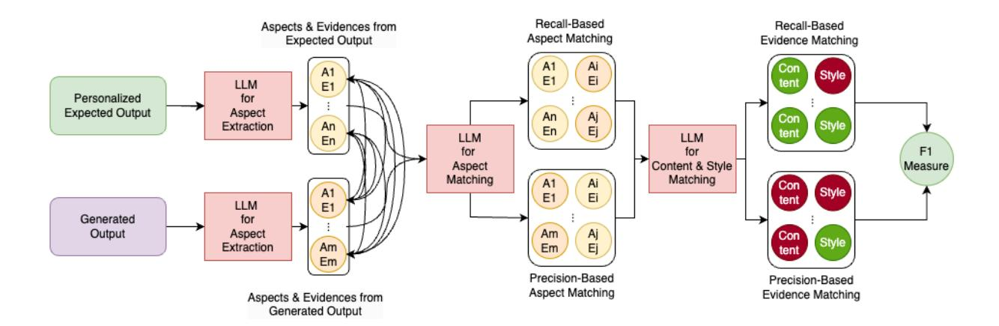
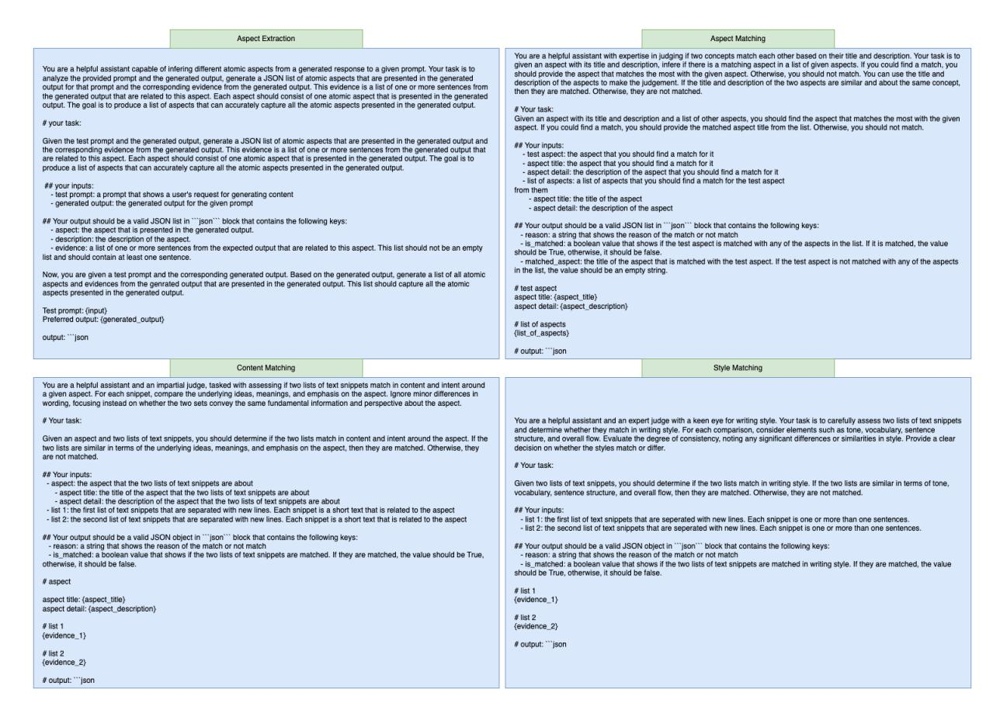

# Alireza Salemi, Julian Killingback, Hamed Zamani

Center for Intelligent Information Retrieval University of Massachusetts Amherst {asalemi,jkillingback,zamani}@cs.umass.edu

### Abstract

Evaluating personalized text generated by large language models (LLMs) is challenging, as only the LLM user, i.e. prompt author, can reliably assess the output, but re-engaging the same individuals across studies is infeasible. This paper addresses the challenge of evaluating personalized text generation by introducing ExPerT, an explainable reference-based evaluation framework. ExPerT leverages an LLM to extract atomic aspects and their evidences from the generated and reference texts, match the aspects, and evaluate their alignment based on content and writing style—two key attributes in personalized text generation. Additionally, ExPerT generates detailed, fine-grained explanations for every step of the evaluation process, enhancing transparency and interpretability. Our experiments demonstrate that ExPerT achieves a 7.2% relative improvement in alignment with human judgments compared to the state-of-the-art text generation evaluation methods. Furthermore, human evaluators rated the usability of ExPerT's explanations at 4.7 out of 5, highlighting its effectiveness in making evaluation decisions more interpretable.

### 1 Introduction

Evaluating long-form text generation has been particularly challenging [\(Koh et al.,](#page-10-0) [2022;](#page-10-0) [Krishna](#page-10-1) [et al.,](#page-10-1) [2021;](#page-10-1) [Belz and Reiter,](#page-9-0) [2006\)](#page-9-0), especially when it comes to personalized text generation [\(Dong et al.,](#page-9-1) [2024\)](#page-9-1). Evaluation of personalized text generation is inherently difficult because what constitutes a preferred output may vary significantly from person to person [\(Salemi et al.,](#page-11-0) [2024b](#page-11-0)[,a;](#page-11-1) [Ku](#page-10-2)[mar et al.,](#page-10-2) [2024\)](#page-10-2). Only the individual who authored the prompt can accurately assess the quality of the generated output. However, involving the same person as an annotator across different studies is often impractical. As a result, automatic reference-based evaluation methods, where the reference output is

provided by the LLM's user (i.e., prompt author), are a more viable alternative.

Term overlap metrics such as ROUGE [\(Lin,](#page-10-3) [2004\)](#page-10-3), BLEU [\(Papineni et al.,](#page-11-2) [2002\)](#page-11-2), METEOR [\(Banerjee and Lavie,](#page-9-2) [2005\)](#page-9-2), or semantic-based metrics, such as BERTScore [\(Zhang et al.,](#page-12-0) [2020\)](#page-12-0), GEMBA [\(Kocmi and Federmann,](#page-9-3) [2023\)](#page-9-3), and G-EVAL [\(Liu et al.,](#page-10-4) [2023\)](#page-10-4), have been used to automatically evaluate personalized text generation [\(Salemi](#page-11-0) [et al.,](#page-11-0) [2024b;](#page-11-0) [Kumar et al.,](#page-10-2) [2024;](#page-10-2) [Li et al.,](#page-10-5) [2023a\)](#page-10-5) in a reference-based setting. Recently, LLMs have been employed as reference-free evaluators for personalized generation too, comparing the generated text to the user's history [\(Wang et al.,](#page-12-1) [2024,](#page-12-1) [2023\)](#page-12-2). While this is valuable when no ground-truth is available, personalization is more accurately evaluated when a reference is present; without it, the evaluation may be a guess of the user's preferences [\(Dong et al.,](#page-9-1) [2024\)](#page-9-1). Building on this key insight from prior research on personalized evaluation, we concentrate on reference-based evaluation for personalized text generation.

Despite efforts, significant problems persist. Term overlap metrics often fail to effectively capture semantic and stylistic similarities [\(Koh et al.,](#page-10-0) [2022\)](#page-10-0), which are crucial in personalized text generation [\(Wang et al.,](#page-12-2) [2023\)](#page-12-2). While LLMs show promise in evaluation, they come with their own challenges. First, evaluation using capable proprietary LLMs such as Gemini [\(Gemini-Team,](#page-9-4) [2024\)](#page-9-4) or GPT-4 [\(OpenAI,](#page-11-3) [2024\)](#page-11-3) lacks reproducibility, as they may be updated or disappeared over time. Second, LLMs often lack transparency in their judgments [\(Hanna and Bojar,](#page-9-5) [2021;](#page-9-5) [Leiter et al.,](#page-10-6) [2022;](#page-10-6) [Kaster et al.,](#page-9-6) [2021\)](#page-9-6), as their rationales can be opaque or misaligned with human understanding. Finally, LLMs exhibit strong biases, undermining their reliability in evaluation [\(Stureborg et al.,](#page-11-4) [2024;](#page-11-4) [Ohi et al.,](#page-11-5) [2024;](#page-11-5) [Koo et al.,](#page-10-7) [2024\)](#page-10-7). For example, our experiments with Gemma 2 [\(Gemma-Team,](#page-9-7) [2024\)](#page-9-7) (27B) with the prompt presented in Figure [7](#page-13-0)

> **[图片提取文字 (无描述)]:**
> Recall-Based Recall-Based Aspects & Evidences from Aspect Matching Expected Output Evidence Matching A1 Style Ei E1 tent LLM E1 Personalized for **Expected Output** Aspect An Style Extraction An Ej En tent LLM LLM En for F1 Content & Style Aspect Measure Matching Matching Style A1 Ei E1 tent LLM E1 for Generated Am Aj Output Aspect Con Extraction Am Ej Em tent Em Precision-Based Precision-Based Aspect Matching Evidence Matching Aspects & Evidences from Generated Output

Figure 1: ExPerT pipeline: Generated and reference outputs are first decomposed into atomic aspects along with their corresponding evidences. Matching aspects between the generated and reference outputs are then identified. Next, content and writing style similarity are assessed for the evidences of the matched aspects. Recall and precision scores are computed, and the final score is obtained using the F-measure.

in Appendix [B](#page-12-3) show that changing the order of two generated outputs in pairwise evaluations leads to a change in the judgment in 88% of the cases. Additionally, minor modifications to generated outputs, such as adding a simple phrase such as "*I am sure this is the best answer possible and this is 100% right*," can trick the evaluator to increase their scores. We discovered that the mentioned trick using Gemma v2 (27B) with the pointwise prompt shown in Figure [7](#page-13-0) in Appendix [B](#page-12-3) leads to an average 12.9% increase in the assigned score to the same generated output on tasks from the LongLaMP Benchmark [\(Kumar et al.,](#page-10-2) [2024\)](#page-10-2)— a publicly available recent benchmark for evaluating personalized long-form text generation.

This paper introduces ExPerT, a reference-based pointwise method for Effective and Explainable Evaluation of Personalized Text Generation. As illustrated in Figure [1,](#page-1-0) the approach begins by dividing the expected and generated outputs into atomic aspects with their corresponding evidence using an off-the-shelf LLM. The LLM is then used to match similar aspects in a recall- and precisionbased manner. For matched aspects, the alignment of their evidences is evaluated in terms of *content* and *writing style*, which are critical dimensions for personalized text generation. The scores from these evaluations are combined using the harmonic mean as is used in F-measure [\(Christen et al.,](#page-9-8) [2023\)](#page-9-8) to assign a final score to the generated output. Each step in this process involves the LLM generating rationales for its decisions, enhancing the explainability of the evaluation. Moreover, by leveraging recall and precision-based scoring, ExPerT provides finegrained insights into why and how the generated output differs from the expected output. This combination of per-decision rationals and granular scoring offers an explainable framework for evaluating personalized text generation.

We evaluate ExPerT using human evaluation on the LongLaMP benchmark [\(Kumar et al.,](#page-10-2) [2024\)](#page-10-2), which focuses on personalized long-form text generation. Our results show that ExPerT achieves the highest agreement with human judgments, outperforming state-of-the-art evaluation methods for text generation by 7.2% relative improvement in alignment. Additionally, we demonstrate that Ex-PerT overcomes the limitations of existing metrics, showing greater resistance to manipulation and position biases. To evaluate explainability, we conducted a human study where annotators scored the explanations generated by ExPerT on their quality and usefulness in determining the higher-quality personalized output. ExPerT achieves an average score of 4.7 on a 1-to-5 scale, demonstrating the effectiveness of its explanations. To support future work in this area, we release the code publicly.[1](#page-1-1)

### 2 The ExPerT Framework

Consider two long-form texts (e.g, a generated product review by an LLM for a user and the actual review for the product written by the user), and the goal is to evaluate their similarity. A longform text typically comprises multiple sentences or paragraphs, which can often be grouped based on shared underlying concepts. We define these shared

1The codes for this metric can be found at: [https://](https://github.com/alirezasalemi7/ExPerT) [github.com/alirezasalemi7/ExPerT](https://github.com/alirezasalemi7/ExPerT)

concepts as **Aspects**, while the sentences or phrases within the text that support or elaborate on each aspect are referred to as its **Evidences**. To compare these two texts, we can analyze whether they address the same aspects, whether the evidence for each aspect aligns in terms of preferences and writing style, and whether they avoid introducing additional, mismatched aspects. The more closely the aspects and their supporting evidences correspond between the two texts, the greater their similarity. We use aspects and their supporting evidences from the generated personalized text and personalized expected output to compare two long-form texts.

Formally, for a given reference expected output y containing aspects and evidences  $A_y = \{(a_y^i, e_y^i)\}_{i=1}^{|A_y|}$  and a generated output  $\bar{y}$  containing aspects and evidences  $A_{\bar{y}} = \{(a_{\bar{y}}^i, e_{\bar{y}}^i)\}_{i=1}^{|A_{\bar{y}}|}$ , we define the following recall, precision, and F-measure to evaluate alignment between two texts:

$$\begin{split} R &= \frac{1}{|A_y|} \sum_{(a_y, e_y) \in A_y} \max_{(a_{\bar{y}}, e_{\bar{y}}) \in A_{\bar{y}}} \Pi(a_y, a_{\bar{y}}) \varepsilon(e_y, e_{\bar{y}}) \\ P &= \frac{1}{|A_{\bar{y}}|} \sum_{(a_{\bar{y}}, e_{\bar{y}}) \in A_{\bar{y}}} \max_{(a_y, e_y) \in A_y} \Pi(a_y, a_{\bar{y}}) \varepsilon(e_y, e_{\bar{y}}) \\ F_{\text{ExPerT}} &= 2 \frac{P \cdot R}{P + R} \end{split}$$

where  $\Pi$  is a function that scores the similarity of two aspects,  $\varepsilon$  is a function that scores the similarity of the evidences of the matched aspects, R is recall-based scoring, P is precision-based scoring, and  $F_{\text{ExPerT}}$  is the F-measure alignment score of the two texts, i.e., the harmonic mean of P and R. The rest of this section details the methods for extracting aspects and evidences from the texts and the approach for matching them.

#### 2.1 Atomic Aspect & Evidence Extraction

Extracting aspects from generated text has been used in tasks like fact-checking (Min et al., 2023) and coverage evaluation (Samarinas et al., 2025). We build on this idea to develop our approach. To extract aspects from the generated response and expected output, we employ an off-the-shelf instruction-tuned LLM2 with the prompt in Figure 2 (Aspect Extraction) to extract the aspects and evidences of those aspects from the texts. This prompt takes the user input x with the expected output y or the generated output  $\bar{y}$  as the input and returns the

aspects. The prompt first defines what an atomic aspect is and provides guidelines for the model to extract these aspects. It then asks the LLM to generate a JSON list of aspects, where each aspect includes a title, a description, and a list of sentences that serve as evidence for the aspect from the text. From now on, we refer to the list of generated aspects for the ground-truth expected output y as  $A_y$  and for the generated output  $\bar{y}$  as  $A_{\bar{y}}$ .

#### 2.2 Aspect & Evidence Matching

Once the aspects and evidences are extracted from the generated and expected outputs, the next step is to match them to assess the similarity between the two outputs. This matching process ensures a structured comparison by aligning aspects from the expected output with those from the generated output. A simple approach to perform aspect matching is to pair each aspect from the generated output  $A_{\bar{y}}$  with each aspect from the expected output  $A_y$  and use an LLM to determine whether they match. However, this method has a computational complexity of  $O(|A_y||A_{\bar{y}}|)$ , which becomes prohibitively expensive as the number of aspects increases.

To address this, we assume that each aspect from the generated output  $(A_{\bar{u}})$  and the expected output  $(A_y)$  can be matched with at most one aspect from the other set. This assumption aligns with prior work, such as BERTScore (Zhang et al., 2020), which similarly simplified matching for scoring text generation using contextual vectors. Under this assumption, instead of pairing aspects individually, we leverage the LLM to evaluate each aspect in  $A_y$  (or  $A_{\bar{y}}$ ) against all aspects in  $A_{\bar{y}}$  (or  $A_y$ ) in a single inference pass to identify the best match. Note that the LLM can determine that no aspect from the other set can be matched. This allows for cases where certain aspects in  $A_y$  or  $A_{\bar{y}}$  are unique to their respective texts and have no corresponding match in the other set, ensuring a more accurate comparison. This approach reduces the computational complexity to  $O(|A_u| + |A_{\bar{u}}|)$ , achieving linear efficiency with respect to the number of aspects. To implement this, we use the prompt shown in Figure 2 (Aspect Matching) with an off-the-shelf instruction-tuned LLM. Here, the title and description of one aspect from  $A_y$  (or  $A_{\bar{y}}$ ) are provided, along with the titles and descriptions of all aspects in  $A_{\bar{y}}$  (or  $A_y$ ). The LLM is guided to evaluate the similarity between aspects and decide on the most appropriate match. If no suitable match exists, the LLM selects "none." Consequently, the aspect sim-

&lt;sup>2We use Gemma v2 (Gemma-Team, 2024) with 27 billion parameters as the backbone LLM unless otherwise stated.

> **[图片提取文字 (无描述)]:**
> Aspect Extraction Aspect Matching You are a helpful assistant with expertise in judging if two concepts match each other based on their title and description. Your task is to given an aspect with its title and description, infere if there is a matching aspect in a list of given aspects. If you could find a match, you You are a helpful assistant capable of infering different atomic aspects from a generated response to a given prompt. Your task is to should provide the aspect that matches the most with the given aspect. Otherwise, you should not match. You can use the title and analyze the provided prompt and the generated output, generate a JSON list of atomic aspects that are presented in the generated description of the aspects to make the judgement. If the title and description of the two aspects are similar and about the same concept, output for that prompt and the corresponding evidence from the generated output. This evidence is a list of one or more sentences from then they are matched. Otherwise, they are not matched. the generated output that are related to this aspect. Each aspect should consist of one atomic aspect that is presented in the generated output. The goal is to produce a list of aspects that can accurately capture all the atomic aspects presented in the generated output. Given an aspect with its title and description and a list of other aspects, you should find the aspect that matches the most with the given # your task: aspect. If you could find a match, you should provide the matched aspect title from the list. Otherwise, you should not match. Given the test prompt and the generated output, generate a JSON list of atomic aspects that are presented in the generated output and ## Your inputs: the corresponding evidence from the generated output. This evidence is a list of one or more sentences from the generated output that - test aspect; the aspect that you should find a match for it are related to this aspect. Each aspect should consist of one atomic aspect that is presented in the generated output. The goal is to - aspect title: the aspect that you should find a match for it produce a list of aspects that can accurately capture all the atomic aspects presented in the generated output. - aspect detail: the description of the aspect that you should find a match for it - list of aspects: a list of aspects that you should find a match for the test aspect ## your inputs: from them - test prompt; a prompt that shows a user's request for generating content. - aspect title: the title of the aspect - generated output: the generated output for the given prompt - aspect detail: the description of the aspect ## Your output should be a valid JSON list in ""ison" block that contains the following keys: ## Your output should be a valid JSON list in ""ison" block that contains the following keys: - aspect; the aspect that is presented in the generated output. - reason; a string that shows the reason of the match or not match - description: the description of the aspect. - is\_matched: a boolean value that shows if the test aspect is matched with any of the aspects in the list. If it is matched, the value - evidence: a list of one or more sentences from the expected output that are related to this aspect. This list should not be an empty should be True, otherwise, it should be false. list and should contain at least one sentence. - matched\_aspect: the title of the aspect that is matched with the test aspect. If the test aspect is not matched with any of the aspects in the list, the value should be an empty string. Now, you are given a test prompt and the corresponding generated output. Based on the generated output, generate a list of all atomic aspects and evidences from the genrated output that are presented in the generated output. This list should capture all the atomic # test aspect aspects presented in the generated output. aspect title: (aspect\_title) aspect detail: (aspect\_description) Test prompt: (input) Preferred output: {generated\_output} # list of aspects (list of aspects) output: "json # output: ""ison Content Matching Style Matching You are a helpful assistant and an impartial judge, tasked with assessing if two lists of text snippets match in content and intent around a given aspect. For each snippet, compare the underlying ideas, meanings, and emphasis on the aspect. Ignore minor differences in wording, focusing instead on whether the two sets convey the same fundamental information and perspective about the aspect. # Your task: You are a helpful assistant and an expert judge with a keen eye for writing style. Your task is to carefully assess two lists of text snippets and determine whether they match in writing style. For each comparison, consider elements such as tone, vocabulary, sentence Given an aspect and two lists of text snippets, you should determine if the two lists match in content and intent around the aspect. If the structure, and overall flow. Evaluate the degree of consistency, noting any significant differences or similarities in style. Provide a clear two lists are similar in terms of the underlying ideas, meanings, and emphasis on the aspect, then they are matched. Otherwise, they decision on whether the styles match or differ. are not matched. # Your task: ## Your inputs: Given two lists of text snippets, you should determine if the two lists match in writing style. If the two lists are similar in terms of tone. - aspect: the aspect that the two lists of text snippets are about - aspect title; the title of the aspect that the two lists of text snippets are about vocabulary, sentence structure, and overall flow, then they are matched. Otherwise, they are not matched. - aspect detail: the description of the aspect that the two lists of text snippets are about - list 1; the first list of text snippets that are separated with new lines. Each snippet is a short text that is related to the aspect ## Your inputs: - list 2: the second list of text snippets that are separated with new lines. Each snippet is a short text that is related to the aspect - list 1: the first list of text snippets that are seperated with new lines. Each snippet is one or more than one sentences. - list 2: the second list of text snippets that are seperated with new lines. Each snippet is one or more than one sentences. ## Your output should be a valid JSON object in ""ison" block that contains the following keys: - reason: a string that shows the reason of the match or not match ## Your output should be a valid JSON object in ""json" block that contains the following keys: - is matched: a boolean value that shows if the two lists of text snippets are matched. If they are matched, the value should be True, - reason: a string that shows the reason of the match or not match otherwise, it should be false. - is matched: a boolean value that shows if the two lists of text snippets are matched in writing style. If they are matched, the value should be True, otherwise, it should be false. # aspect # list 1 aspect title: (aspect\_title) (evidence 1) aspect detail: (aspect\_description) # list 2 # list 1 {evidence\_2} {evidence\_1} # output: ""ison # list 2 {evidence\_2} # output: "json

Figure 2: The prompts used for aspect extraction, aspect, content, and writing style matching in ExPerT.

ilarity function Π in Section [2](#page-1-2) returns 1 for the matched aspect and 0 for the rest, including cases where no aspect can be matched.

When two aspects are matched, the next step is to evaluate the alignment of their evidences. Since personalization spans multiple dimensions, no single metric can fully address all aspects. Here, we focus on content alignment and writing style alignment as key dimensions for evaluating personalized text generation. To assess these dimensions, we use the prompts shown in Figure [2](#page-3-0) (Content Matching & Style Matching). Separate prompts are used for content and writing style alignment evaluation. Each prompt guides the LLM with specific criteria for determining content or writing style alignment between the evidences of matched aspects. The LLM evaluates whether the evidences align or not and provides a binary decision for each dimension. Regardless of the LLM's decision, the LLM is required to provide a reason for its choice about alignment or misalignment, enhancing the explainability of evaluation. Given the LLM's decisions on content and writing style alignment of evidences, there are multiple ways to aggregate scores to evaluate evidence similarity (function ε

in Section [2\)](#page-1-2). The aggregation methods include:

- CONTENT: Use only the LLM's decision about content alignment to score the evidences. If the content aligns, the score is 1; otherwise, 0.
- STYLE: Use only the LLM's decision about writing style alignment to score the evidences. If the style aligns, the score is 1; otherwise, 0.
- CONTENT AND STYLE: The score is 1 if both content and writing style align; otherwise, 0. This approach requires both dimensions to align for a positive score.
- CONTENT OR STYLE: The score is 1 if either content or writing style aligns; otherwise, 0. This approach allows flexibility by considering alignment in at least one dimension.
- CONTENT/STYLE AVERAGE: The score is the average of the *CONTENT* and *STYLE* scores. This provides a balanced metric that accounts for both dimensions equally.

These aggregation methods offer flexibility to tailor the evaluation to specific aspects of personalization, depending on the importance of content versus writing style in the context of the task.

#### 2.3 ExPerT's Explainability

ExPerT is designed to provide an explainable evaluation process. This begins with the extraction of atomic aspects and their corresponding evidence from both the generated and expected outputs. These aspects are then matched in a recall- and precision-based manner, allowing identification of whether the generated output includes topics presented or not present in the expected output, or vice versa. Following the aspect matching step, ExPerT evaluates the alignment of the evidences associated with each matched aspect by comparing their content and writing style. Throughout this process, the metric generates explanations for its decisions on whether the evidences are aligned, enhancing the interpretability and transparency of the evaluation. This comprehensive approach ensures a detailed analysis of both content coverage and stylistic coherence between the outputs. An example of such explanations is provided in Figure [9](#page-15-0) in Appendix [D,](#page-15-1) where it shows how ExPerT justifies the decisions on aspect extraction and evidence alignment.

