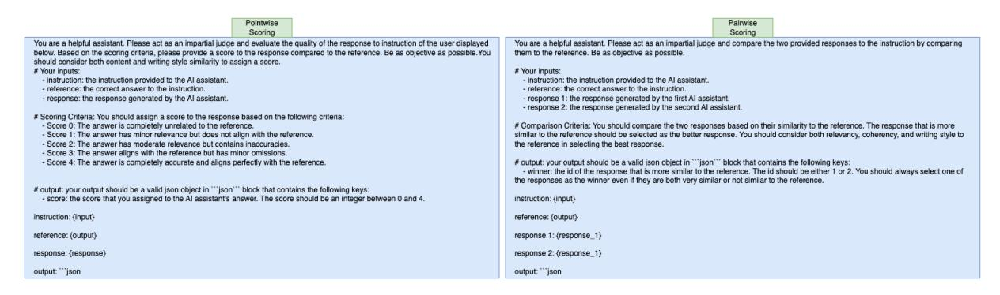
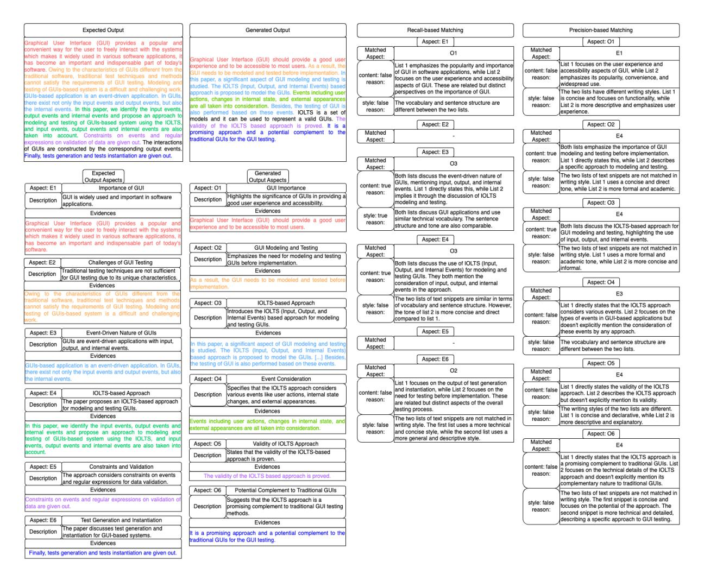

# B Baselines Details

In this paper, we employ the following text generation evaluation metrics as baselines:

BLEU [\(Papineni et al.,](#page-11-2) [2002\)](#page-11-2) is a widely used metric for evaluating the quality of machinegenerated text. It measures the overlap between n-grams of the generated text and one or more reference texts, focusing on precision to determine how much of the generated output matches the references. BLEU employs a brevity penalty to discourage excessively short translations and calculates a geometric mean of precision scores across

6This benchmark does not specify any licensing restrictions, so we utilized it solely for research purposes in accordance with its intended use.

7The LongLaMP benchmark originally consists of four personalized generation tasks. However, due to privacy concerns regarding the email dataset and licensing issues for human annotation, we exclude that task.

| Task                             | #train | #validation | #test | Input Length   | Output Length   | Profile Size    |
|----------------------------------|--------|-------------|-------|----------------|-----------------|-----------------|
| Personalized Abstract Generation | 13693  | 4560        | 4560  | 33.82 ± 5.71   | 144.28 ± 68.40  | 120.30 ± 118.81 |
| Personalized Review Writing      | 14745  | 1826        | 1822  | 119.39 ± 73.06 | 304.54 ± 228.61 | 34.39 ± 57.31   |
| Personalized Topic Writing       | 11442  | 2452        | 2453  | 28.36 ± 36.08  | 263.03 ± 243.34 | 50.39 ± 2898.60 |

Table 2: The statistics of the datasets in the LongLaMP benchmark on user-based setting.

> **[图片提取文字 (无描述)]:**
> Pointwise Pairwise Scoring Scoring You are a helpful assistant. Please act as an impartial judge and evaluate the quality of the response to instruction of the user displayed You are a helpful assistant. Please act as an impartial judge and compare the two provided responses to the instruction by comparing below. Based on the scoring criteria, please provide a score to the response compared to the reference. Be as objective as possible. You them to the reference. Be as objective as possible. should consider both content and writing style similarity to assign a score. # Your inputs: # Your inputs: - instruction; the instruction provided to the Al assistant. - instruction; the instruction provided to the Al assistant. - reference: the correct answer to the instruction. - reference: the correct answer to the instruction. - response: the response generated by the Al assistant. - response 1: the response generated by the first Al assistant. - response 2: the response generated by the second AI assistant. # Scoring Criteria: You should assign a score to the response based on the following criteria: - Score 0: The answer is completely unrelated to the reference. # Comparison Criteria: You should compare the two responses based on their similarity to the reference. The response that is more Score 1: The answer has minor relevance but does not align with the reference. similar to the reference should be selected as the better response. You should consider both relevancy, coherency, and writing style to - Score 2: The answer has moderate relevance but contains inaccuracies. the reference in selecting the best response. - Score 3: The answer aligns with the reference but has minor omissions. Score 4: The answer is completely accurate and aligns perfectly with the reference. # output: your output should be a valid ison object in ""json" block that contains the following keys: - winner; the id of the response that is more similar to the reference. The id should be either 1 or 2. You should always select one of the responses as the winner even if they are both very similar or not similar to the reference. # output: your output should be a valid json object in ""json" block that contains the following keys: score: the score that you assigned to the Al assistant's answer. The score should be an integer between 0 and 4. instruction: (input) instruction: (input) reference: (output) reference: (output) response 1: (response 1) response: {response} response 2: {response 1} output: "json output: "ison

Figure 7: The evaluation prompts used for LLM-based baselines.

different n-gram sizes. We utilize the HuggingFace implementation of this metric.[8](#page-13-2)

ROUGE-L [\(Lin,](#page-10-3) [2004\)](#page-10-3) is a metric designed to evaluate text generation tasks by comparing the overlap of the longest common subsequences between a generated text and reference. ROUGE-L emphasizes on sequential relationship of words, capturing structural similarity. We utilize the HuggingFace implementation of this metric.[9](#page-13-3)

METEOR [\(Banerjee and Lavie,](#page-9-2) [2005\)](#page-9-2) is a widely used automatic evaluation metric designed to assess the quality of a generated output by comparing them to a reference. Instead of relying primarily on exact n-gram matches, METEOR incorporates stemming, synonym matching, and a flexible alignment approach to capture variations in word usage and sentence structure. We utilize the HuggingFace implementation of this metric.[10](#page-13-4)

BERTScore [\(Zhang et al.,](#page-12-0) [2020\)](#page-12-0) is a metric for evaluating text generation tasks that leverages contextualized embeddings from pre-trained models like BERT. Unlike traditional n-gram-based metrics, BERTScore computes similarity based on the cosine similarity of word embeddings, capturing semantic meaning rather than exact word matches.

It uses token-level embeddings to compare each word in the generated text with its corresponding word in the reference, considering both precision and recall. This allows BERTScore to assess the quality of generated texts more effectively, especially when dealing with synonyms. We utilize the HuggingFace implementation of this metric.[11](#page-13-5)

GEMBA [\(Kocmi and Federmann,](#page-9-3) [2023\)](#page-9-3) is a metric for evaluating text generation tasks that utilizes LLMs with predefined evaluation criteria. It compares the generated text in response to a prompt with a reference output for the same prompt to assess the quality of the generated text. In this approach, the prompt, generated text, expected output, and a predefined evaluation criterion are provided to an LLM. The model is then asked to generate a score for the generated output by comparing it to the reference, taking the specified criteria into account. In this paper, we utilize the pointwise scoring prompt shown in Figure [7](#page-13-0) to generate the scores. We set the model's temperature to zero to obtain more deterministic results. Additionally, we limit the consideration to a maximum of 512 tokens from both the generated output and the expected output. For backbone LLM, we utilize an instruction-tuned Gemma 2 [\(Gemma-Team,](#page-9-7) [2024\)](#page-9-7) with 27 billion parameters[12](#page-13-6) using the VLLM li-

8This metric can be found at: [https://hf.co/spaces/](https://hf.co/spaces/evaluate-metric/bleu) [evaluate-metric/bleu](https://hf.co/spaces/evaluate-metric/bleu)

9This metric can be found at: [https://hf.co/spaces/](https://hf.co/spaces/evaluate-metric/rouge) [evaluate-metric/rouge](https://hf.co/spaces/evaluate-metric/rouge)

10This metric can be found at: [https://hf.co/spaces/](https://hf.co/spaces/evaluate-metric/meteor) [evaluate-metric/meteor](https://hf.co/spaces/evaluate-metric/meteor)

11This metric can be found at : [https://hf.co/spaces/](https://hf.co/spaces/evaluate-metric/bertscore) [evaluate-metric/bertscore](https://hf.co/spaces/evaluate-metric/bertscore)

12The model can be found at: [https://hf.co/google/](https://hf.co/google/gemma-2-27b-it) [gemma-2-27b-it](https://hf.co/google/gemma-2-27b-it)

Figure 8: The prompt used for personalizing LLMs by providing personalized context. The input is the *input* to the task, the *personalized\_context* is the retrieved information from the user profile.

brary [\(Kwon et al.,](#page-10-16) [2023\)](#page-10-16).[13](#page-14-1)

G-Eval [\(Liu et al.,](#page-10-4) [2023\)](#page-10-4) is another LLM-based metric for text generation evaluation, similar to GEMBA, which takes an input prompt, generated output, and reference output along with predefined criteria to score the generated output. However, G-Eval considers the probability of each score in the final score calculation. Specifically, the model multiplies each score in the predefined criteria by the probability that the model assigns to that score, then calculates a weighted average of the scores as the final score. To implement this, following the original paper, we generate 20 scores using the LLM with a high temperature of 1. Based on the count of each score, we calculate the probabilities for each score. We then average the scores based on these probabilities to obtain the final score. In this paper, we utilize the pointwise scoring prompt shown in Figure [7](#page-13-0) to generate the scores. Additionally, we limit the consideration to a maximum of 512 tokens from both the generated output and the expected output. For the backbone LLM, we use an instruction-tuned Gemma 2 [\(Gemma-Team,](#page-9-7) [2024\)](#page-9-7) with 27 billion parameters[14](#page-14-2) with the VLLM library [\(Kwon et al.,](#page-10-16) [2023\)](#page-10-16).[15](#page-14-3)

### C Personalizing LLMs through RAG

To personalize an LLM, we utilize the Retrieval-Augmented Generation (RAG) approach introduced by [Salemi et al.](#page-11-0) [\(2024b\)](#page-11-0). This approach enhances the model's performance by incorporating personalized data retrieved from the user's profile into the generation process, thereby enabling the

LLM to tailor its responses based on the specific preferences and historical context of the user.

In this approach, given a prompt x for a user u with expected output y, we first apply a retrieval model R to retrieve k relevant documents from the user's profile Pu. This begins with generating a query q = ϕq(x) using a query generation function ϕq. The query q is then used to retrieve the top k documents from the user's profile Pu. The retrieved documents, along with the original prompt x, are passed through a prompt generation function ϕp, which creates a personalized prompt xu = ϕp(x, R(ϕq(x), Pu, k)). This personalized prompt is then fed into the LLM M to generate a personalized response yu = M(xu). For the query generation function, we employ the identity function, ϕq(x) = x, meaning the prompt x is used directly as the query. For the prompt generation function ϕp, we use the personalized prompt structure shown in Figure [8,](#page-14-4) which integrates the retrieved documents and the input prompt to tailor the response to the user's context. We also retrieve k = 3 documents in all experiments.

In this paper, we personalize both GPT-4omini[16](#page-14-5) and Gemma 1.1[17](#page-14-6). For GPT-4o-mini, we apply the method described earlier to generate personalized responses. In contrast, for Gemma 1.1, we fine-tune the model on the LongLaMP benchmark to adapt it to personalized text generation tasks. For fine-tuning, we use a sequence-to-sequence loss function [\(Sutskever et al.,](#page-11-18) [2014\)](#page-11-18). Given the personalized prompt xu produced using the method described earlier, the model is trained to generate the expected output y. This ensures that the model learns to generate personalized responses based on the input prompt tailored to the user's profile. We train the model for 5000 steps using a multi-tasking approach across all datasets in the LongLaMP benchmark. The training is conducted with a learning rate of 5 × 10−5 , using the Adam optimizer [\(Kingma and Ba,](#page-9-15) [2015\)](#page-9-15) with a weight decay of 10−4 , and a batch size of 64. We perform 250 warmup steps to stabilize training. The model's context length is set to 2048 tokens, and we limit each retrieved document to the first 400 tokens when generating the personalized prompt. For inference, we set the temperature to 0.1 to ensure

13This framework can be found at: [https://github.com/](https://github.com/vllm-project/vllm) [vllm-project/vllm](https://github.com/vllm-project/vllm)

14The model can be found at: [https://hf.co/google/](https://hf.co/google/gemma-2-27b-it) [gemma-2-27b-it](https://hf.co/google/gemma-2-27b-it)

15This framework can be found at: [https://github.com/](https://github.com/vllm-project/vllm) [vllm-project/vllm](https://github.com/vllm-project/vllm)

16This model is not open source and is served by OpenAI and described at: [https://openai.com/index/](https://openai.com/index/gpt-4o-mini-advancing-cost-efficient-intelligence/) [gpt-4o-mini-advancing-cost-efficient-intelligence/](https://openai.com/index/gpt-4o-mini-advancing-cost-efficient-intelligence/)

17The checkpoint can be found at: [google/gemma-1.](google/gemma-1.1-2b-it) [1-2b-it](google/gemma-1.1-2b-it)

> **[图片提取文字 (无描述)]:**
> Recall-based Matching Expected Output Generated Output Precision-based Matching Aspect: E1 Aspect: O1 Graphical User Interface (GUI) provides a popular an onvenient way for the user to freely interact with the system Matched Matched 01 E1 which makes it widely used in various software applications, Aspect: Aspect: Graphical User Interface (GUI) should provide a good use has become an important and indispensable part of today List 1 focuses on the user experience and experience and to be accessible to most users. As a result, the List 1 emphasizes the popularity and importance oftware. Owing to the characteristics of GUIs different from th content: false accessibility aspects of GUI, while List 2 of GUI in software applications, while List 2 All needs to be modeled and tested before impli content: false aditional software, traditional test techniques and method emphasizes its popularity, convenience, and focuses on the user experience and accessibility reason: his paper, a significant aspect of GUI modeling and testing annot satisfy the requirements of GUI testing. Modeling an widespread use. aspects of GUI. These are related but distinct udied. The IOLTS (Input, Output, and Internal Events) base esting of GUIs-based system is a difficult and challenging work pproach is proposed to model the GUIs. Events including use perspectives on the importance of GUI. The two lists have different writing styles. List 1 SUIs-based application is an event-driven application, in GUIs is concise and focuses on functionality, while style: false ctions, changes in internal state, and external appearance here exist not only the input events and output events, but als style: false The vocabulary and sentence structure are reason: List 2 is more descriptive and emphasizes user are all taken into consideration. Besides, the testing of GUI i ne internal events. In this paper, we identify the input events different between the two lists. reason: experience. so performed based on these events. IOLTS is a set of output events and internal events and propose an approach to models and it can be used to represent a valid GUIs. The nodeling and testing of GUIs-based system using the IOLTS Aspect: E2 Aspect: O2 alidity of the IOLTS based approach is proved. It is a and input events, output events and internal events are also promising approach and a potential complement to the Matched Matched aken into account. Constraints on events and regula F4 raditional GUIs for the GUI testing. Aspect: Aspect: xoressions on validation of data are given out. The interactions Both lists emphasize the importance of GUI of GUIs are constructed by the corresponding output events Aspect: E3 modeling and testing before implementation. content: true Finally, tests generation and tests instantiation are given out. List 1 directly states this, while List 2 describes Matched reason: a specific approach to modeling and testing. Aspect: Expected Generated The two lists of text snippets are not matched in Both lists discuss the event-driven nature of style: false Output Aspects Output Aspects GUIs, mentioning input, output, and internal writing style. List 1 uses a concise and direct content: true reason: Aspect: E1 Importance of GUI Aspect: O1 **GUI Importance** events. List 1 directly states this, while List 2 tone, while List 2 is more formal and academic. reason: Highlights the significance of GUIs in providing a implies it through the discussion of IOLTS GUI is widely used and important in software Description Description applications. good user experience and accessibility. modeling and testing Aspect: O3 Matched Evidences Both lists discuss GUI applications and use Evidences style: true Aspect: similar technical vocabulary. The sentence raphical User Interface (GUI) should provide a good use reason: Graphical User Interface (GUI) provides a popular and structure and tone are also comparable. Both lists discuss the IOLTS-based approach for xperience and to be accessible to most users. convenient way for the user to freely interact with the systems content: true GUI modeling and testing, highlighting the use which makes it widely used in various software applications, reason: Aspect: E4 of input, output, and internal events. has become an important and indispensable part of today's Aspect: O2 **GUI Modeling and Testing** Matched The two lists of text snippets are not matched in oftware 03 Aspect: style: false writing style. List 1 uses a more formal and Emphasizes the need for modeling and testing Description academic tone, while List 2 is more concise and Challenges of GUI Testing reason: Aspect: E2 GUIs before implementation. Both lists discuss the use of IOLTS (Input, Output, and Internal Events) for modeling and Traditional testing techniques are not sufficient Evidences Description content: true testing GUIs. They both mention the for GUI testing due to its unique characteristics. s a result, the GUI needs to be modeled and tested before reason: Aspect: O4 consideration of input, output, and internal Evidences events in the approach. Matched owing to the characteristics of GUIs different from the The two lists of text snippets are similar in terms Aspect: aditional software, traditional test techniques and method Aspect: O3 IOLTS-based Approach of vocabulary and sentence structure. However, List 1 directly states that the IOLTS approach style: false annot satisfy the requirements of GUI testing. Modeling and ntroduces the IOLTS (Input, Output, and reason: the tone of list 2 is more concise and direct considers various events. List 2 focuses on the isting of GUIs-based system is a difficult and challer content: false Description Internal Events) based approach for modeling types of events in GUI-based applications but compared to list 1. reason: and testing GUIs. doesn't explicitly mention the consideration of Aspect: E5 these events by any approach. Aspect: E3 Event-Driven Nature of GUIs Evidences Matched GUIs are event-driven applications with input. The vocabulary and sentence structure are style: false Description this paper, a significant aspect of GUI modeling and testin Aspect: output, and internal events. different between the two lists. reason: s studied. The IOLTS (Input, Output, and Internal Events Evidences ased approach is proposed to model the GUIs. [...] Besides Aspect: E6 ne testing of GUI is also performed based on these events. Aspect: O5 BUIs-based application is an event-driven application. In GUIs Matched 02 here exist not only the input events and output events, but als Matched Aspect: E4 ne internal events Aspect: O4 **Event Consideration** Aspect: List 1 focuses on the output of test generation List 1 directly states the validity of the IOLTS Specifies that the IOLTS approach considers and instantiation, while List 2 focuses on the content: false Aspect: E4 IOLTS-based Approach content: false approach. List 2 describes the IOLTS approach Description various events like user actions, internal state need for testing before implementation. These reason: reason: but doesn't explicitly mention its validity. The paper proposes an IOLTS-based approach changes, and external appearances. are related but distinct aspects of the overall Description The writing styles of the two lists are different. for modeling and testing GUIs. testing process. Evidences style: false List 1 is concise and declarative, while List 2 is **Evidences** The two lists of text snippets are not matched in reason: vents including user actions, changes in internal state, and more descriptive and explanatory. style: false writing style. The first list uses a more technical In this paper, we identify the input events, output events and ternal appearances are all taken into consideration. and concise style, while the second list uses a nternal events and propose an approach to modeling and reason: Aspect: O6 more general and descriptive style. esting of GUIs-based system using the IOLTS, and input Matched Aspect: O5 Validity of IOLTS Approach F4 events, output events and internal events are also taken into Aspect: states that the validity of the IOLTS-based account. Description ist 1 directly states that the IOLTS approach is pproach is proven. a promising complement to traditional GUIs. List Aspect: E5 Constraints and Validation Evidences content: false 2 focuses on the technical details of the IOLTS he approach considers constraints on events reason: The validity of the IOLTS based approach is proved. approach and doesn't explicitly mention its Description and regular expressions for data validation complementary nature to traditional GUIs. Evidences Aspect: 06 Potential Complement to Traditional GUIs The two lists of text snippets are not matched in Constraints on events and regular expressions on validation of Suggests that the IOLTS approach is a writing style. The first snippet is concise and style: false focuses on the potential of the approach. The Description promising complement to traditional GUI testing data are given out. reason: methods. second snippet is more technical and detailed, describing a specific approach to GUI testing. Aspect: E6 Test Generation and Instantiation Evidences The paper discusses test generation and Description is a promising approach and a potential complement to the nstantiation for GUI-based systems. raditional GUIs for the GUI testing. Evidences Finally, tests generation and tests instantiation are given out.

Figure 9: A case study of aspect and evidence extraction, as well as aspect, content, and writing style matching in the ExPerT framework.

more deterministic output generation.

### D Case Study & Evaluation Example

As a case study, Figure [9](#page-15-0) illustrates the evaluation process of ExPerT for an example from the LongLaMP benchmark. In this process, ExPerT first tokenizes the expected and generated outputs into atomic aspects. In this example, both outputs are divided into six atomic aspects, each linked to corresponding evidence from the respective outputs. Notably, while most sentences serve as evidence, both the expected and generated outputs contain sentences that are not linked to any evidence. This demonstrates ExPerT's ability to disregard sentences and phrases that do not contribute meaningfully to the identified aspects. Additionally, ExPerT demonstrates flexibility in selecting evidence for the same aspect, as it does not limit evidence to consecutive sentences. Instead, it can extract evidence from different parts of the text

and associate them with the same aspect, showcasing its ability to understand and connect related information across the text.

The next step in this process involves matching aspects between the expected and generated outputs using a recall- and precision-based approach. As shown in Figure [9,](#page-15-0) an aspect from the generated output or the expected output can be matched to multiple aspects from the other set when one aspect relates to multiple others. Furthermore, some aspects may remain unmatched if no corresponding aspect exists in the other set. When two aspects are matched, the next step is to compare the content and writing style of their corresponding evidences from the expected and generated outputs. As illustrated in Figure [9,](#page-15-0) the model provides reasoning for why the evidences are matched. The explanations for content matching primarily highlight the semantic and contextual similarities between the evidences. In contrast, the explanations for writing

style focus on aspects like vocabulary and structural similarities between the two evidences. These two matching dimensions—content match and writing style match—capture the most critical aspects of personalized text generation.