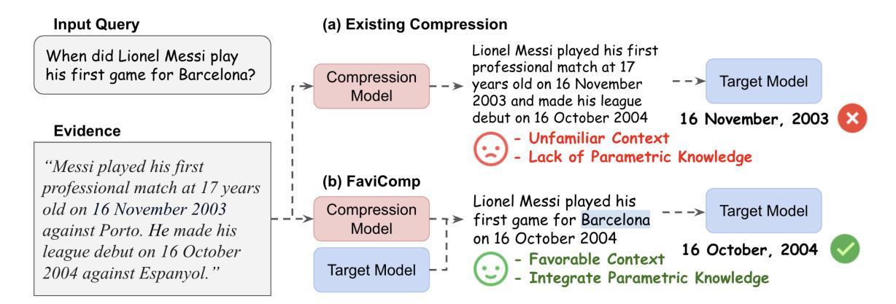
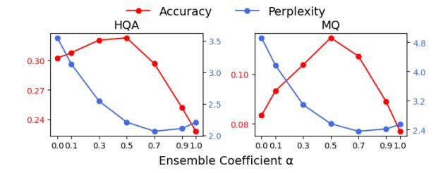

## Familiarity-Aware Evidence Compression for Retrieval-Augmented Generation

Dongwon Jung1 Qin Liu1 Tenghao Huang2 Ben Zhou3 Muhao Chen1 1University of California, Davis, 2University of Southern California, 3Arizona State University {dwojung,qinli,muhchen}@ucdavis.edu tenghaoh@usc.edu benzhou@asu.edu

### Abstract

Retrieval-augmented generation (RAG) improves large language models (LMs) by incorporating non-parametric knowledge through evidence retrieved from external sources. However, it often struggles to cope with inconsistent and irrelevant information that can distract the LM from its tasks, especially when multiple evidence pieces are required. While compressing the retrieved evidence with a compression model aims to address this issue, the compressed evidence may still be unfamiliar to the target model used for downstream tasks, potentially failing to utilize the evidence effectively. We propose FAVICOMP (FAmiliarity-aware EVIdence COMPression), a novel inference-time evidence compression technique that makes retrieved evidence more familiar to the target model, while seamlessly integrating parametric knowledge from the model. Experimental results show that FAVICOMP consistently outperforms the most recent evidence compression baselines across multiple open-domain QA datasets, improving accuracy by up to 28.1% while achieving high compression rates. Additionally, we demonstrate the effective integration of both parametric and non-parametric knowledge during evidence compression. [1](#page-0-0)

### 1 Introduction

Retrieval-augmented generation (RAG) has become a common paradigm for large language models (LMs) to leverage external knowledge beyond their inherent knowledge boundaries to perform better in knowledge-intensive tasks such as opendomain question answering (QA) [\(Lewis et al.,](#page-9-0) [2020;](#page-9-0) [Izacard and Grave,](#page-8-0) [2021;](#page-8-0) [Guu et al.,](#page-8-1) [2020\)](#page-8-1) and fact-checking [\(Pan et al.,](#page-9-1) [2023;](#page-9-1) [Li et al.,](#page-9-2) [2024c\)](#page-9-2). In particular, incorporating multiple evidence pieces is crucial in solving complicated tasks

such as multi-hop and complex reasoning [\(Trivedi](#page-10-0) [et al.,](#page-10-0) [2023;](#page-10-0) [Jiang et al.,](#page-8-2) [2023b;](#page-8-2) [Li et al.,](#page-9-3) [2024b;](#page-9-3) [Lu et al.,](#page-9-4) [2023\)](#page-9-4), which require various sources of information to solve the questions.

Nevertheless, RAG often struggles to cope with inconsistent and irrelevant information from the multiple evidence pieces, which can interfere with downstream tasks [\(Shi et al.,](#page-9-5) [2023\)](#page-9-5). This highlights the need for evidence compression to identify and retain only the essential information for LMs to utilize effectively. Traditionally, evidence compression has focused on reranking documents or sentences by relevance and then incorporating a top-ranked subset [\(Nogueira et al.,](#page-9-6) [2020;](#page-9-6) [Zhuang](#page-10-1) [et al.,](#page-10-1) [2023;](#page-10-1) [Wang et al.,](#page-10-2) [2023c\)](#page-10-2) or compressing the documents into a compact form that retains only essential context [\(Jiang et al.,](#page-8-3) [2023a;](#page-8-3) [Xu et al.,](#page-10-3) [2024;](#page-10-3) [Yoon et al.,](#page-10-4) [2024\)](#page-10-4). However, the compressed evidence might be unfamiliar to the LM employed for the downstream task (referred to as the target model), particularly due to discrepancies in the internal knowledge and prompt preferences between the compression model and the target model [\(Go](#page-8-4)[nen et al.,](#page-8-4) [2023;](#page-8-4) [Lee et al.,](#page-9-7) [2024;](#page-9-7) [Li et al.,](#page-9-8) [2024a;](#page-9-8) [Mallen et al.,](#page-9-9) [2023\)](#page-9-9). When LMs encounter unfamiliar contextual information, they often fail in balancing parametric and non-parametric knowledge, either by overly relying on their parametric knowledge [\(Longpre et al.,](#page-9-10) [2021;](#page-9-10) [Wang et al.,](#page-10-5) [2023a;](#page-10-5) [Zhou et al.,](#page-10-6) [2023\)](#page-10-6) or by utilizing retrieved evidence without considering its relevance to the input [\(Wu](#page-10-7) [et al.,](#page-10-7) [2024\)](#page-10-7).

To address these challenges, we propose FAmiliarity-aware EVIdence COMPression (FAVICOMP), an inference-time evidence compression method that consolidates multiple evidence into an abstractive summary that is more familiar to the target model, while seamlessly integrating parametric knowledge from the model. Inspired by the prior findings that an LM's familiarity with a prompt is generally reflected by low perplexity

1Code and data are available at [https://github.com/](https://github.com/luka-group/FaviComp) [luka-group/FaviComp](https://github.com/luka-group/FaviComp)

> **[图片提取文字 (无描述)]:**
> Input Query (a) Existing Compression Lionel Messi played his first When did Lionel Messi play professional match at 17 his first game for Barcelona? Compression --> years old on 16 November Target Model Model 2003 and made his league 16 November, 2003 debut on 16 October 2004 Evidence - Unfamiliar Context - Lack of Parametric Knowledge "Messi played his first (b) FaviComp professional match at 17 years Lionel Messi played his old on 16 November 2003 Compression Target Model - ¬ > first game for Barcelona Model against Porto. He made his on 16 October 2004 16 October, 2004 league debut on 16 October - Favorable Context Target Model 2004 against Espanyol." - Integrate Parametric Knowledge

Figure 1: An overview of FAVICOMP. Instead of relying solely on compressed evidence from the compression model (upper), FAVICOMP familiarizes the compressed evidence to the target model while integrating parametric knowledge through ensemble decoding, resulting in improved downstream performance (lower).

[\(Liu et al.,](#page-9-11) [2024;](#page-9-11) [Gonen et al.,](#page-8-4) [2023;](#page-8-4) [Wang](#page-10-8) [et al.,](#page-10-8) [2023b\)](#page-10-8), FAVICOMP proactively composes the compressed evidence in a way to lower the perplexity of the target model. Specifically, instead of directly selecting the highest probability token from the compression model at each decoding step, FAVICOMP selects the token from the ensemble of the token probabilities from both the compression and target models. This ensemble decoding therefore constrains the token search space of the compression model to those with lower perplexity for the target model, making the context more familiar to the target model [\(Liu et al.,](#page-9-11) [2024\)](#page-9-11).

Furthermore, FAVICOMP potentially synergizes the retrieved knowledge with the target model's parametric knowledge introduced during ensemble decoding. It can effectively discern when to leverage internal or external knowledge, which is particularly beneficial in the presence of noisy contextual evidence in complex tasks such as multi-document or multi-hop QA [\(Wang et al.,](#page-10-9) [2024\)](#page-10-9).

Our experiments show that FAVICOMP outperforms most recent evidence compression baselines in five open-domain QA datasets, improving accuracy by up to 28.1% while maintaining high compression rates. Additionally, we conduct ablation studies by varying the degree of decoding ensemble and analyzing its impact on performance and context perplexity. Moreover, we investigate how FAVICOMP effectively integrates parametric and non-parametric knowledge during evidence compression.

## 2 Method

We present FAVICOMP, a inference-time evidence compression method that familiarizes retrieved evi-

dence with the target model while synergizing them with the model's parametric knowledge. We first illustrate the motivation for FAVICOMP in [§2.1](#page-1-0) and provide the preliminaries of evidence compression in RAG [§2.2,](#page-1-1) followed by a detailed definition of our proposed framework in [§2.3.](#page-2-0)

#### 2.1 Motivation and Method Overview

[Figure 1](#page-1-2) illustrates the overview of FAVICOMP. Existing evidence compression methods employ the compression model to filter out irrelevant information from the retrieved documents. However, since the compression model and the target model are different, the target model might not be familiar to the compressed evidence due to the difference in internal knowledge and prompt preferences between the two models [\(Gonen et al.,](#page-8-4) [2023;](#page-8-4) [Lee et al.,](#page-9-7) [2024;](#page-9-7) [Mallen et al.,](#page-9-9) [2023\)](#page-9-9). In addition, the compressed evidence cannot be supplemented with the rich parametric knowledge from the target model. In the example, even though the compression model successfully summarizes the essential information, the target model produces an inaccurate answer due to the unfamiliarity with the target model and the lack of integration of the parametric knowledge. On the other hand, FAVICOMP compresses the given evidence more favorable to the target model by using a novel ensemble decoding technique and leverages its parametric knowledge to supplement the missing evidence (*"Lionel Messi made his league debut in Barcelona"*), effectively combining evidential and parametric knowledge.

#### 2.2 RAG with Evidence Compression

Given a set of k retrieved evidence snippets D = {d1, d2, . . . , dk} and a textual input sequence x, RAG aims to generate an output sequence y, conditioned on both D and x. However, RAG directly utilizes D which often contains irrelevant information to x, potentially confusing the target model in downstream tasks (Shi et al., 2023). Thus, we use an additional compression model to condense D into a concise and input-relevant context c, which is then used in place of D during the downstream generation process. Thus, the RAG with evidence compression is formalized as:

$$y^* = \arg\max_{y} P_{tar}(y \mid x, \hat{c}),$$
$$\hat{c} = P_{comp}(c \mid x, [d_1, d_2, \dots, d_k]),$$

where  $y^*$  is the final output sequence,  $[\cdot,\cdot]$  denotes concatenation, and  $P_{\text{tar}}$  and  $P_{\text{comp}}$  represent the probability distributions of the target and compression models, respectively. In this work, we consider any natural language prompting tasks, such as open-domain QA tasks, where x represents the input prompt (also known as the query in QA tasks) and  $y^*$  denotes the output sequence.

The compression model's objective is to produce a concise yet informative summary c of the evidential documents D that captures the essential information relevant to the input query x. We use an unsupervised approach, where the model is instructed to generate a query-relevant summary of D in a zero-shot manner using an evidence compression instruction prompt, denoted as  $I_{comp}$ , such as the one below:

#### **Evidence Compression Instruction**

Given a question and multiple document snippets, generate one summarized context that is helpful to answer the question.

Specifically, the evidence compression is done in an auto-regressive way formalized as,

$$P_{\text{comp}}(c \mid \mathcal{C}_{\text{comp}}) = \prod_{i=1}^{|c|} P_{\text{comp}}(c_i \mid \mathcal{C}_{\text{comp}}, c_{< i}),$$

where  $\mathcal C$  denotes the input prompt, constructed by stringifying  $\{I_{\mathrm{comp}}, x, D\}$  using a predefined prompt template and |c| is the length of the summary c.

#### 2.3 Ensemble Decoding for FAVICOMP

Simple compression techniques might lead to subpar performance in downstream tasks because the compressed evidence may not be familiar to the target model. To better align the context to the target model, FAVICOMP proactively composes it to lower the target model's perplexity by introducing a constraint in decoding space from the target model during the evidence compression. FAVICOMP achieves this goal through ensemble decoding, which involves a multiplicative ensemble of two LMs—compression model and target model—at each decoding step.

Specifically, the target model is instructed to generate a context c that would be helpful in answering the question x without referencing the evidence set. This is also done in zero-shot using a context generation instruction prompt  $I_{qen}$  such as:

#### Context Generation Instruction

Given a question, generate a context that is helpful to answer the question.

The context generation is also performed in an auto-regressive fashion, represented as:

$$P_{\text{tar}}(c \mid \mathcal{C}_{\text{gen}}) = \prod_{i=1}^{|c|} P_{\text{tar}}(c_i | \mathcal{C}_{\text{gen}}, c_{< i}),$$

where  $\mathcal{C}_{\text{gen}}$  denotes the input prompt constructed using  $\{I_{\text{gen}},x\}^2$  and |c| denotes the length of the generated context c.

Once the compression model and the target model generate their respective probability distributions for the next token, the subsequent token is chosen by maximizing the weighted sum of the log probabilities from both models. The selected token is the continuation of the previously generated text aligned with their objectives. This process is formalized as follows:

$$\begin{aligned} c_i &= \arg\max_{c_i', c_i'' \in V} (\alpha \cdot \log P_{\text{tar}}(c_i' \mid \mathcal{C}_{\text{gen}}, c_{< i}) \\ &+ (1 - \alpha) \cdot \log P_{\text{comp}}(c_i'' \mid \mathcal{C}_{\text{comp}}, c_{< i})), \end{aligned}$$

where  $c_i$  is the subsequent token, and  $\alpha$  is the ensemble coefficient that weighs between the two probability distributions. We demonstrate how the coefficient  $\alpha$  impacts both the perplexity and the downstream performance in §4.2.

Ensemble decoding proactively shifts the token search space in evidence compression by upweighting those tokens with lower perplexity from the target model's perspective, resulting in a compressed evidence that is more familiar to the target model. Note that since both objectives ultimately share the

&lt;sup>2We provide the prompt templates for evidence compression and context generation in Table 10.

goal of generating context relevant to the question, combining the logits ensures alignment with this ultimate goal.

In addition, ensemble decoding enables FAVICOMP to seamlessly integrate both retrieval knowledge from the external evidence set and the target model's parametric knowledge. Specifically, FAVICOMP selects the arg max token from the target model only when the token's probability is higher than that of the compression model, demonstrating that FAVICOMP draws on parametric knowledge only when necessary—potentially when the compression model is uncertain about the next token. This is particularly beneficial for complex tasks like multi-document QA, where the evidence set may not include all the necessary information [\(Mallen et al.,](#page-9-9) [2023\)](#page-9-9). In such cases, the missing information in compressed evidence can be supplemented by tokens generated from context generation by the target model, which is entirely based on parametric knowledge. We demonstrate in [§4.3](#page-5-1) and [§5](#page-6-0) that FAVICOMP can incorporate knowledge from both sources effectively, leading to a performance boost compared to compression methods that solely focus on distilling knowledge from the evidence set.

### 3 Experimental Settings

We assess the effectiveness of FAVICOMP on knowledge-intensive QA tasks. In this section, we delve into the details of the experimental settings.

### 3.1 Datasets

We evaluate FAVICOMP on five open-domain QA datasets, including two single-document QA datasets, Natural Questions (NQ; [Kwiatkowski](#page-9-12) [et al.](#page-9-12) [2019\)](#page-9-12) and TriviaQA (TQA; [Joshi et al.](#page-8-5) [2017\)](#page-8-5), and three multi-document QA datasets, HotpotQA (HQA; [Yang et al.](#page-10-10) [2018\)](#page-10-10), 2WikiMultiHopQA (Wiki; [Ho et al.](#page-8-6) [2020\)](#page-8-6), and MuSiQue (MQ; [Trivedi et al.](#page-10-11) [2022\)](#page-10-11). Following prior studies [\(Asai et al.,](#page-8-7) [2023;](#page-8-7) [Xu et al.,](#page-10-3) [2024\)](#page-10-3), we evaluate the performance on the development set of each dataset using two evaluation metrics, Accuracy (Acc) and token-level F1.

#### 3.2 Implementation Details

For all the comparison methods, we utilize Llama3-8B-Instruct and Mixtral-8x7B-Instruct as the target model to tackle downstream QA tasks with RAG. For FAVICOMP

and Zero-shot Summarization, we employ two compression models, one for each target model: **Llama3.2-3B-Instruct** for Llama3- 8B-Instruct target model and **Mistral-7B-Instruct** for Mixtral-8x7B-Instruct target model. For each question, we retrieve five documents from 2018 Wikipedia corpus [\(Karpukhin](#page-9-13) [et al.,](#page-9-13) [2020\)](#page-9-13) using Contriever-MSMARCO [\(Izacard et al.,](#page-8-8) [2021\)](#page-8-8), so as to be consistent with previous studies [\(Xu et al.,](#page-10-3) [2024;](#page-10-3) [Yoon et al.,](#page-10-4) [2024\)](#page-10-4). We set ensemble coefficient α of FAVICOMP to 0.5 by default, for which more analyses are given in [§4.2.](#page-5-0) The prompts used in the experiment are presented in [§C.](#page-12-0)

#### 3.3 Baselines

We consider the following categories of baselines. (1) No Context: RAG without any context. (2) Gold Compression: RAG using directly relevant evidence from the retrieved documents if they exist. (3) Raw Document: RAG with raw documents that have not undergone any compression. (4) Generated Context [\(Yu et al.,](#page-10-12) [2023\)](#page-10-12): RAG with context generated by the same LM as the target model. This is equivalent to FAVICOMP with α = 1, as we rely solely on the target model to generate context when α = 1. (5) Reranking-based Methods: We rerank sentences in the evidence set and choose top-ranked sentences as the context. We utilize two rerankers—Sentence-BERT [\(Reimers](#page-9-14) [and Gurevych,](#page-9-14) [2020\)](#page-9-14) and RECOMP-extractive [\(Xu](#page-10-3) [et al.,](#page-10-3) [2024\)](#page-10-3). (6) Compression-based Methods: We employ four compressors—LongLLMLingua [\(Jiang et al.,](#page-8-3) [2023a\)](#page-8-3), RECOMP-abstractive [\(Xu](#page-10-3) [et al.,](#page-10-3) [2024\)](#page-10-3), CompAct [\(Yoon et al.,](#page-10-4) [2024\)](#page-10-4), and Zero-shot Summarization. For Zero-shot Summarization, we use the same evidence compression instruction prompt of FAVICOMP to summarize multiple evidence using the same LM as the target model. This is equivalent to FAVICOMP with α = 0, as we depend entirely on the compression model without any intervention from the target model.[3](#page-3-0)

### 4 Experimental Results

In this section, we compare the overall performance of FAVICOMP with other baselines across the five datasets ([§4.1\)](#page-4-0), explore the impact of ensemble coefficient α on performance and perplexity ([§4.2\)](#page-5-0),

3A more detailed explanation of the implementation of the baselines is provided in [§A.](#page-10-13)

| Methods                 | Size  |      | NQ   |                       | TQA  |      | HQA  |      | Wiki | MQ   |      |
|-------------------------|-------|------|------|-----------------------|------|------|------|------|------|------|------|
|                         |       | Acc  | F1   | Acc                   | F1   | Acc  | F1   | Acc  | F1   | Acc  | F1   |
| Llama3-8B-Instruct      |       |      |      |                       |      |      |      |      |      |      |      |
| Gold Compression        | -     | -    | -    | -                     | -    | 42.3 | 51.3 | 35.7 | 40.0 | 10.2 | 17.7 |
| No Context              | -     | 26.9 | 31.9 | 57.2                  | 61.2 | 19.1 | 25.5 | 20.5 | 25.0 | 5.4  | 13.0 |
| Raw Document            | -     | 42.6 | 47.1 | 67.6                  | 70.8 | 30.3 | 38.7 | 22.0 | 26.8 | 8.2  | 15.0 |
| Generated Context       | -     | 32.3 | 36.6 | 59.7                  | 62.4 | 22.7 | 29.7 | 24.8 | 28.7 | 7.6  | 14.8 |
| Sentence-BERT           | 110M  | 30.3 | 35.4 | 59.2                  | 62.9 | 22.4 | 29.6 | 18.1 | 22.9 | 7.7  | 14.8 |
| RECOMP-extractive       | 110M† | 33.7 | 38.1 | 59.4                  | 62.8 | 22.5 | 29.8 | 18.0 | 22.4 | 8.1  | 15.5 |
| LongLLMLingua           | 7B†   | 35.4 | 40.9 | 64.8                  | 67.6 | 25.9 | 34.7 | 19.2 | 24.2 | 7.7  | 14.4 |
| RECOMP-abstractive      | 775M† | 39.3 | 43.3 | 62.9                  | 66.1 | 27.0 | 34.8 | 20.5 | 25.0 | 7.3  | 14.8 |
| CompAct                 | 7B†   | 42.3 | 46.1 | 67.0                  | 69.7 | 29.8 | 37.5 | 21.4 | 26.6 | 9.2  | 16.9 |
| Zero-shot Summarization | 3B    | 39.4 | 43.2 | 64.2                  | 67.1 | 30.1 | 38.5 | 25.7 | 31.1 | 7.7  | 15.3 |
| FAVICOMP                | 3B    | 42.8 | 46.8 | 68.0                  | 70.9 | 33.0 | 41.6 | 29.6 | 35.2 | 10.8 | 19.9 |
|                         |       |      |      | Mixtral-8x7B-Instruct |      |      |      |      |      |      |      |
| Gold Compression        | -     | -    | -    | -                     | -    | 48.2 | 55.1 | 49.9 | 51.9 | 12.9 | 18.6 |
| No Context              | -     | 36.7 | 38.4 | 68.9                  | 72.0 | 25.1 | 31.6 | 32.5 | 35.9 | 6.4  | 11.8 |
| Raw Document            | -     | 46.3 | 42.1 | 72.1                  | 71.1 | 34.0 | 39.0 | 32.9 | 36.3 | 10.1 | 15.6 |
| Generated Context       | -     | 33.6 | 33.9 | 61.4                  | 62.9 | 26.5 | 32.9 | 30.2 | 34.3 | 7.2  | 13.4 |
| Sentence-BERT           | 110M  | 36.8 | 36.8 | 67.0                  | 68.7 | 28.3 | 34.5 | 32.5 | 36.2 | 9.9  | 15.2 |
| RECOMP-extractive       | 110M† | 38.0 | 37.9 | 66.7                  | 68.0 | 28.7 | 34.3 | 31.8 | 34.9 | 9.4  | 15.6 |
| LongLLMLingua           | 7B†   | 40.1 | 39.4 | 70.5                  | 71.0 | 32.0 | 38.3 | 31.9 | 36.1 | 9.7  | 15.9 |
| RECOMP-abstractive      | 775M† | 42.1 | 41.3 | 68.4                  | 69.4 | 32.3 | 38.5 | 32.2 | 36.2 | 7.9  | 13.6 |
| CompAct                 | 7B†   | 44.1 | 43.4 | 70.3                  | 71.4 | 35.2 | 41.6 | 35.9 | 39.5 | 11.2 | 16.9 |
| Zero-shot Summarization | 7B    | 42.1 | 40.6 | 65.9                  | 67.0 | 31.4 | 38.1 | 28.5 | 32.8 | 8.4  | 13.8 |
| FAVICOMP                | 7B    | 43.6 | 44.5 | 72.6                  | 73.9 | 36.3 | 44.4 | 40.5 | 45.2 | 13.4 | 19.9 |

Table 1: Experimental results on five open-domain QA datasets. Size column represents the size of the compression model used for each method. † indicates a fully-supervised compression model, where the compressor is trained.

investigate how effectively FAVICOMP incorporate parametric and non-parametric knowledge ([§4.3\)](#page-5-1), and compare the compression rates with other baselines ([§4.4\)](#page-6-1).

#### 4.1 Main Results

The overall performance of FAVICOMP and the baselines across the five datasets are presented in [Table 1.](#page-4-1) [4](#page-4-2) To start with, the compression-based methods consistently outperform the rerankingbased methods, due to the fact that the rerankingbased methods are prone to losing more questionrelevant information by discarding lower-ranked sentences.

Next, FAVICOMP outperforms all other baselines across all the datasets, except for the Gold Compression which is regarded as the upper bound of the performance. It is noteworthy that FAVICOMP, as a training-free strategy, outperforms all the supervised compression-based baselines that use similar or larger compression models[5](#page-4-3) . This result suggests that knowledge distillation from a larger teacher LM to a smaller compression model may not generalize well, as the context preferences and prior knowledge of the target model and the teacher model are likely to differ. In contrast, the superior performance of FAVICOMP is attributed to its ability to familiarize evidence with the target model and its effective incorporation of parametric knowledge from ensemble decoding. Moreover, for the MQ dataset, FAVICOMP even outperforms Gold Compression baseline which can be viewed as a perfect compressor. This demonstrates that explicitly incorporating parametric knowledge from the target model can significantly enhance performance in multidocument QA, even when the context is imperfect.

Finally, given that Zero-shot Summarization corresponds to FAVICOMP with α = 0 and Generated Context corresponds to FAVICOMP with α = 1,

4We present additional experimental results using other combinations of compression and target model at [§B.1.](#page-11-0)

5We conduct a fair comparison with RECOMP-abstractive by using the same base compression model in [§B.2.](#page-11-1)

> **[图片提取文字 (无描述)]:**
> Accuracy Perplexity HQA MQ 3.5 4.8 0.30 -4.0 3.0 0.10 0.27 3.2 - 2.5 0.24 -0.08 0.91.0 0.00.1 0.5 0.7 0.0 0.1 0.7 0.91.0 0.3 0.3 0.5 Ensemble Coefficient a

Figure 2: Impact of coefficient  $\alpha$  on performance and perplexity when using Llama3.2-3B-Instruct and Llama3-8B-Instruct compression-target pairs.

| Methods                 | NQ   | TQA  | HQA  | Wiki | MQ   |
|-------------------------|------|------|------|------|------|
| Generated Context       | 36.6 | 62.4 | 29.7 | 28.7 | 14.8 |
| Zero-shot Summarization | 43.2 | 67.1 | 38.5 | 31.1 | 15.3 |
| Concatenation           | 42.5 | 66.7 | 36.5 | 29.0 | 15.6 |
| FAVICOMP                | 46.8 | 70.9 | 41.6 | 35.2 | 19.9 |

Table 2: Performance (F1) comparison against concatenation of parametric and non-parametric knowledge.

the fact that FAVICOMP outperforms both baselines highlights its ability to effectively incorporate tokens from both sources—evidence summary and generated context. This results in superior performance compared to relying on one source alone.

