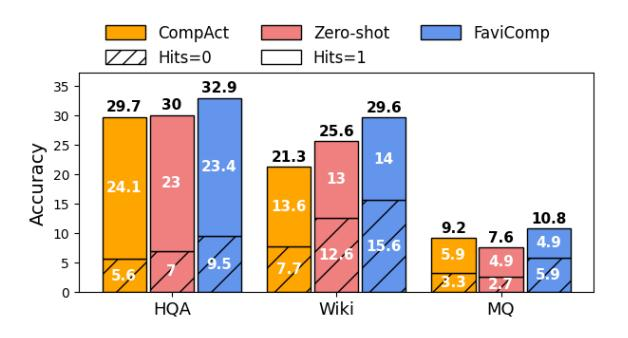

# **4.2** Impact of Ensemble Coefficient on Performance and Perplexity

Figure 2 illustrates how performance and perplexity change as the ensemble coefficient  $\alpha$  is varied across the values when using Llama3.2-3B-Instruct and Llama3-8B-Instruct compression-target pairs on HQA and MQ datasets6. We calculate the perplexity of the compressed evidence conditioned on the preceding inputs, i.e. instruction, demonstrations, and the question. For all the datasets, performance is the highest when  $\alpha = 0.5$ , indicating that proactively lowering perplexity by equally weighting both input sources yields the best results. When  $\alpha$  is below 0.5, performance improves as the perplexity of compressed evidence decreases, which aligns with the previous works (Liu et al., 2024; Gonen et al., 2023). However, when  $\alpha$  exceeds 0.5, performance declines as perplexity decreases due to the lack of evidential knowledge during evidence compression. Additionally, when  $\alpha$ reaches 0.9 or 1.0, there is a slight rise in the perplexity due to LM's increased uncertainty with limited evidential knowledge.

> **[图片提取文字 (无描述)]:**
> CompAct Zero-shot FaviComp Hits=0 Hits=1 35 32.9 30 29.7 29.6 30 25.6 25 Accuracy 21.3 14 23.4 20 13 23 24.1 15 13.6 10.8 9.2 10 7.6 4.9 15.6 5.9 4.9 5 Wiki HQA MQ

Figure 3: Accuracy of baselines methods on Hits = 0 and Hits = 1 subset of multi-document OA datasets.

