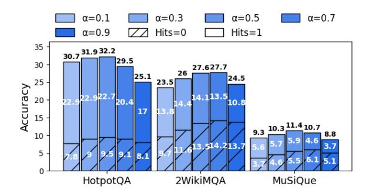
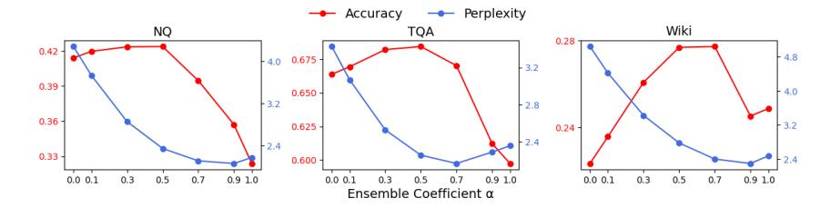

# 4.3 Integration of Parametric and Non-parametric Knowledge

The effective integration of parametric and nonparametric knowledge is crucial for complex tasks such as multi-document OA, where the evidence set may not contain all the necessary information. To this end, we evaluate how effectively FAVICOMP incorporates parametric knowledge from the target model and non-parametric knowledge from the compression model on the multi-document OA datasets. We begin by dividing the test samples of each dataset into evidence-relevant and evidenceirrelevant subsets, using the Hits metric. The Hits metric is set to 1 (evidence-relevant) if the retrieved evidence set contains the correct answer, and 0 (evidence-irrelevant) if it does not. We then assess the downstream performance of each subset. The underlying intuition is that if a method performs better on the evidence-relevant subset, it suggests that the method is more effectively utilizing the provided evidential knowledge. Conversely, if a method excels on the evidence-irrelevant subset, it indicates that the method is more effectively leveraging parametric knowledge without relying on potentially irrelevant evidence.

As shown in Figure 3, we compare the accuracy of FAVICOMP with Llama3.2-3B-Instruct and Llama3-8B-Instruct compression-target pairs on Hits = 0 and Hits = 1 subsets with the topperforming baselines, Zero-shot Summarization and CompAct7. FAVICOMP outperforms other baselines in the Hits = 0 subset while performing comparably with others in the Hits = 1 subset. This proves that FAVICOMP effectively relies on parametric knowledge rather than evidential knowledge when faced with irrelevant evidence, while maintaining similar effectiveness in utilizing

&lt;sup>6Results for other datasets are included in Figure 6.

 $^7\mbox{We}$  provide results of FAVICOMP on various alpha values in \$B.3

evidential knowledge when relevant evidence is present.

In addition, we conduct another experiment to demonstrate FAVICOMP's superior ability to synergize two sources of knowledge. We compare it against a straightforward approach that concatenates parametric and non-parametric knowledge as context for downstream generation. Specifically, we concatenate the compressed evidence from the Zero-shot Summarization with the generated context from the Generated Context and use this concatenated context for evaluation. The results, shown in Table 2, reveal that simple concatenation underperforms compared to the Zeroshot Summarization baseline. This suggests that naively merging non-parametric and parametric knowledge in-context can be less effective than relying solely on non-parametric knowledge. In contrast, FAVICOMP effectively integrates both knowledge sources during compression, leveraging their synergy to achieve superior performance.

#### 4.4 Compression Rate Comparisons

Since one of the functionalities of evidence compression in RAG is to reduce the number of tokens from the evidence set, we report the compression rate of FAVICOMP with Llama3.2-3B-Instruct and Llama3-8B-Instruct compression-target pairs in Table 3. We compute the compression rate as # of tokens in retrieved documents # of tokens in compressed documents. Overall, RECOMP-abstractive and FAVICOMP consistently score the highest compression rates. RECOMPabstractive exhibits high compression rates because the compression model is trained to output an empty string when no relevant evidence is found, which is often the case in multi-document OA datasets. FAVICOMP compresses the evidence to make it familiar to the target model by lowering its perplexity at each decoding step, typically resulting in a shorter context. Notably, when compared to Zero-shot Summarization, which is equivalent to FAVICOMP with  $\alpha = 0$ , FAVICOMP consistently achieves higher compression rates. This demonstrates that the ensemble decoding strategy, combining token logits from both evidence compression and context generation, leads to greater compression efficiency.

#### 5 Case Study

Table 4 presents two examples from HQA to illustrate how FAVICOMP effectively familiarizes evi-

| Methods                 | NQ    | TQA   | HQA   | Wiki  | MQ           |
|-------------------------|-------|-------|-------|-------|--------------|
| LongLLMlingua           | 1.87  | 1.84  | 1.83  | 1.83  | 1.83         |
| RECOMP-abstractive      | 17.96 | 17.79 | 19.72 | 32.06 | 32.05        |
| CompAct                 | 8.85  | 8.92  | 9.45  | 10.71 | 8.96         |
| Zero-shot Summarization | 14.12 | 17.12 | 18.75 | 21.39 | 16.19        |
| FAVICOMP                | 16.43 | 22.40 | 22.55 | 23.10 | <u>18.95</u> |

Table 3: Compression rates of the baselines and FAVICOMP.

dence while seamlessly integrating both parametric and non-parametric knowledge during evidence compression. We compare its output with Raw Document, which does not apply any compression, and Zero-shot Summarization.

In both examples, Raw Document fails to produce the correct answer, even though the evidence contains the necessary information, highlighting the need for effective evidence compression. In the first example, while the difference between the compressed evidence from Zero-shot Summarization and FAVICOMP appears subtle, FAVICOMP delivers the correct answer with a lower perplexity in compression, underscoring the significance of evidence familiarization. The second example highlights the importance of parametric knowledge when the retrieved evidence set lacks complete information. Since the evidence set does not mention "Skeptic", Zero-shot Summarization introduces irrelevant information ("Philanthropy magazine"), ultimately leading to an incorrect answer. In contrast, FAVICOMP integrates parametric knowledge about "Skeptic" and incorporates it into the evidence compression. Notably, FAVICOMP selects the arg max token from the target model only when the token's probability is higher than that of the compression model, demonstrating that FAVICOMP draws on parametric knowledge only when necessary—potentially when the compression model is uncertain about the next token.

#### 6 Related Works

Evidence Compression for RAG. Recent efforts on evidence compression seek to compress retrieved evidence pieces to filter out unnecessary information and retain only the essential context (Wang et al., 2023c; Li et al., 2024d; Ke et al., 2024; Xu et al., 2024; Yoon et al., 2024). Most recently, Xu et al. (2024) and Yoon et al. (2024) train a compression model to generate an abstractive summary of the documents by distilling knowledge from larger language models.

While these methods are successful to some ex-

| Question:                                                                                                                                                                                                   | Question: This film is an adaption of a Jacques Offenbach's opera that was written by a Hungarian British screenwriter?                                                                                       |                                 |            |  |  |  |  |
|-------------------------------------------------------------------------------------------------------------------------------------------------------------------------------------------------------------|---------------------------------------------------------------------------------------------------------------------------------------------------------------------------------------------------------------|---------------------------------|------------|--|--|--|--|
| Methods                                                                                                                                                                                                     | (Compressed) Evidence                                                                                                                                                                                         | Prediction                      | Perplexity |  |  |  |  |
| Raw Document                                                                                                                                                                                                | The Tales of Hoffmann is a 1951 British Technicolor film adaptation of Jacques Offenbach's opera "The Tales of Hoffmann", written, produced and directed by the team of Michael Powell and Emeric Pressburger | Emeric Pressburger X            | 12.429     |  |  |  |  |
| Zero-shot Summarization                                                                                                                                                                                  | The 1951 film "The Tales of Hoffmann" is an adaptation of Jacques Offenbach's opera, written, produced, and directed by Michael Powell and Emeric Pressburger.   2                                            |                                 |            |  |  |  |  |
| FAVICOMP                                                                                                                                                                                                    | The 1951 film "The Tales of Hoffmann" is an adaptation of Jacques Offenbach's opera, written by Emeric Pressburger, a Hungarian-British screenwriter, and directed by Michael Powell and Emeric Pressburger.  | The Tales of Hoffmann ✓         | 1.959      |  |  |  |  |
|                                                                                                                                                                                                             | Question: Which magazine was first published earlier, The Chronicle of F                                                                                                                                      | Philanthropy or Skeptic?        |            |  |  |  |  |
| The Chronicle of Philanthropy is a magazine that covers the nonprofit world It was founded in 1988 by editor Phil First published as a newsletter in 1987, "Philanthropy" became a glossy magazine in 1996. |                                                                                                                                                                                                               |                                 |            |  |  |  |  |
| Zero-shot Summarization                                                                                                                                                                                  | throny magazine was first nublished as a newsletter in 1987 and became                                                                                                                                        |                                 | 3.196      |  |  |  |  |
| FAVICOMP                                                                                                                                                                                                    | The Chronicle of Philanthropy was first published in 1988, while Skeptic was first published in 1992.                                                                                                         | The Chronicle of Philanthropy ✓ | 1.345      |  |  |  |  |

Table 4: Case study of evidence compression: FAVICOMP vs. Raw Document and Zero-shot Summarization. For FAVICOMP, the colors red and blue highlight tokens that are the arg max of the compression model and the target model, respectively. Purple indicates a token that is the arg max of neither model. Tokens with no coloring represent those that are the arg max of both models.

tent, they often achieve suboptimal performance because of the discrepancy between the compression model and the target model, leading unfamiliarity of the context. In contrast, FAVICOMP proactively compresses the evidence pieces in a way to lower the target model's perplexity using an ensemble decoding technique without any training, thereby improving the downstream performance.

Parametric and Non-parametric Knowledge in RAG. There has been a lack of research focused on effectively combining both sources. A few of these efforts introduce counterfactual augmentation (Longpre et al., 2021; Fang et al., 2024; Zhang et al., 2024) and causal intervention (Zhou et al., 2023; Wang et al., 2023a) to mitigate knowledge conflict, which, however, requires explicitly knowing the features of the input that causes such conflict. Zhang et al. (2023) seek to address this issue by incorporating LM-generated context into the LM's input along with the retrieved documents, thereby integrating both sources of knowledge. However, merely concatenating both contexts is a suboptimal solution, as LMs may still show bias toward one source over the other when generating responses (Longpre et al., 2021; Wu et al., 2024). To address this, FAVICOMP employs ensemble decoding during the evidence compression, ensuring that both types of knowledge are seamlessly fused together to create a consistent context.

Constrained Decoding. Constrained decoding has been previously proposed in text generation tasks for various purposes, including optimizing prompts (Liu et al., 2024), enhancing plausibility (Li et al., 2023) or controllability (Meng et al., 2022; Huang et al., 2023), and reducing hallucination (Shi et al., 2024). Our work is closely connected with the method by Liu et al. (2024) which employs ensemble decoding to paraphrase prompts to enhance zero-shot LM prompting and generalization. Their approach focuses on the robustness and generalizability of instruction prompts for tasks without retrieval augmentation. In contrast, our approach compresses externally retrieved evidence while integrating parametric knowledge during compression, specifically targeting knowledge-intensive tasks that require balancing both evidential and parametric knowledge.

#### 7 Conclusion

In this study, we introduce FAVICOMP, a training-free, inference-time evidence compression method designed to enhance RAG performance by consolidating retrieved evidence set to be more familiar to the target model, while seamlessly integrating parametric knowledge. Our extensive experiments validate the effectiveness of FAVICOMP on opendomain QA tasks, showing significant improvements over recent evidence compression baselines

in multiple datasets. Additionally, FAVICOMP's model-agnostic nature allows it to be incorporated into various RAG workflows at inference time, making it a versatile tool for enhancing LMs in complex tasks.

## Acknowledgment

We appreciate the reviewers for their insightful comments and suggestions. This work was partly supported by the Amazon Nova Trusted AI Prize, the NSF of the United States Grants ITE 2333736 and OAC 2531126, and the DARPA FoundSci Grant HR00112490370.

## Limitations

Although FAVICOMP exhibits superior performance in RAG compared to the recent evidence compression baselines, it has some limitations. (1) FAVICOMP consumes approximately twice as much computation compared to methods that only use a compression model since it needs two inferences (compression and target model) during the ensemble decoding. However, it is a trainingfree strategy that can be easily plugged into any RAG application. We provide insights on the tradeoff between latency and performance in [§B.4.](#page-12-1) (2) Ensemble decoding requires the compression and target model to share the same vocabulary and tokenizer, which can limit the range of compatible models. Nonetheless, recent studies, such as [Gu](#page-8-11) [et al.](#page-8-11) [\(2024\)](#page-8-11), have introduced techniques to enable model-agnostic ensemble decoding. This implies that there will be a potential direction of incorporating model-agnostic ensemble decoding with our framework to enable more flexible integration of various models, which we leave as future work.

### Ethics Statement

This work follows the ACL Code of Ethics. We believe no potential risk is directly associated with the presented work.

## References

- Akari Asai, Zeqiu Wu, Yizhong Wang, Avirup Sil, and Hannaneh Hajishirzi. 2023. Self-rag: Learning to retrieve, generate, and critique through self-reflection. In *The Twelfth International Conference on Learning Representations*.
- Tianqing Fang, Zhaowei Wang, Wenxuan Zhou, Hongming Zhang, Yangqiu Song, and Muhao Chen. 2024. Getting sick after seeing a doctor? diagnosing and

- mitigating knowledge conflicts in event temporal reasoning. In *Findings of the Association for Computational Linguistics: NAACL 2024*, pages 3846–3868.
- Hila Gonen, Srini Iyer, Terra Blevins, Noah A Smith, and Luke Zettlemoyer. 2023. Demystifying prompts in language models via perplexity estimation. In *Findings of the Association for Computational Linguistics: EMNLP 2023*, pages 10136–10148.
- Kevin Gu, Eva Tuecke, Dmitriy Katz, Raya Horesh, David Alvarez-Melis, and Mikhail Yurochkin. 2024. Chared: Character-wise ensemble decoding for large language models. *arXiv preprint arXiv:2407.11009*.
- Kelvin Guu, Kenton Lee, Zora Tung, Panupong Pasupat, and Mingwei Chang. 2020. Retrieval augmented language model pre-training. In *International conference on machine learning*, pages 3929–3938. PMLR.
- Xanh Ho, Anh-Khoa Duong Nguyen, Saku Sugawara, and Akiko Aizawa. 2020. Constructing a multi-hop qa dataset for comprehensive evaluation of reasoning steps. In *Proceedings of the 28th International Conference on Computational Linguistics*, pages 6609– 6625.
- Tenghao Huang, Ehsan Qasemi, Bangzheng Li, He Wang, Faeze Brahman, Muhao Chen, and Snigdha Chaturvedi. 2023. Affective and dynamic beam search for story generation. In *Findings of the Association for Computational Linguistics: EMNLP 2023*, pages 11792–11806.
- Gautier Izacard, Mathilde Caron, Lucas Hosseini, Sebastian Riedel, Piotr Bojanowski, Armand Joulin, and Edouard Grave. 2021. Unsupervised dense information retrieval with contrastive learning. *arXiv preprint arXiv:2112.09118*.
- Gautier Izacard and Edouard Grave. 2021. Leveraging passage retrieval with generative models for open domain question answering. In *Proceedings of the 16th Conference of the European Chapter of the Association for Computational Linguistics: Main Volume*, pages 874–880. Association for Computational Linguistics.
- Huiqiang Jiang, Qianhui Wu, Xufang Luo, Dongsheng Li, Chin-Yew Lin, Yuqing Yang, and Lili Qiu. 2023a. Longllmlingua: Accelerating and enhancing llms in long context scenarios via prompt compression. *arXiv preprint arXiv:2310.06839*.
- Zhengbao Jiang, Frank F Xu, Luyu Gao, Zhiqing Sun, Qian Liu, Jane Dwivedi-Yu, Yiming Yang, Jamie Callan, and Graham Neubig. 2023b. Active retrieval augmented generation. In *Proceedings of the 2023 Conference on Empirical Methods in Natural Language Processing*, pages 7969–7992.
- Mandar Joshi, Eunsol Choi, Daniel S Weld, and Luke Zettlemoyer. 2017. Triviaqa: A large scale distantly supervised challenge dataset for reading comprehension. In *Proceedings of the 55th Annual Meeting of the Association for Computational Linguistics (Volume 1: Long Papers)*, pages 1601–1611.

- Vladimir Karpukhin, Barlas Oguz, Sewon Min, Patrick Lewis, Ledell Wu, Sergey Edunov, Danqi Chen, and Wen-tau Yih. 2020. Dense passage retrieval for opendomain question answering. In *Proceedings of the 2020 Conference on Empirical Methods in Natural Language Processing (EMNLP)*, pages 6769–6781.
- Zixuan Ke, Weize Kong, Cheng Li, Mingyang Zhang, Qiaozhu Mei, and Michael Bendersky. 2024. Bridging the preference gap between retrievers and llms. *arXiv preprint arXiv:2401.06954*.
- Tom Kwiatkowski, Jennimaria Palomaki, Olivia Redfield, Michael Collins, Ankur Parikh, Chris Alberti, Danielle Epstein, Illia Polosukhin, Jacob Devlin, Kenton Lee, et al. 2019. Natural questions: A benchmark for question answering research. *Transactions of the Association for Computational Linguistics*, 7:452– 466.
- Yoonsang Lee, Pranav Atreya, Xi Ye, and Eunsol Choi. 2024. Crafting in-context examples according to lms' parametric knowledge. In *Findings of the Association for Computational Linguistics: NAACL 2024*, pages 2069–2085.
- Patrick Lewis, Ethan Perez, Aleksandra Piktus, Fabio Petroni, Vladimir Karpukhin, Naman Goyal, Heinrich Küttler, Mike Lewis, Wen-tau Yih, Tim Rocktäschel, et al. 2020. Retrieval-augmented generation for knowledge-intensive nlp tasks. *Advances in Neural Information Processing Systems*, 33:9459–9474.
- Bangzheng Li, Ben Zhou, Xingyu Fu, Fei Wang, Dan Roth, and Muhao Chen. 2024a. Famicom: Further demystifying prompts for language models with taskagnostic performance estimation. *arXiv preprint arXiv:2406.11243*.
- Bangzheng Li, Ben Zhou, Fei Wang, Xingyu Fu, Dan Roth, and Muhao Chen. 2024b. Deceptive semantic shortcuts on reasoning chains: How far can models go without hallucination? In *Proceedings of the 2024 Conference of the North American Chapter of the Association for Computational Linguistics: Human Language Technologies (Volume 1: Long Papers)*, pages 7668–7681.
- Miaoran Li, Baolin Peng, Michel Galley, Jianfeng Gao, and Zhu Zhang. 2024c. Self-checker: Plug-and-play modules for fact-checking with large language models. In *Findings of the Association for Computational Linguistics: NAACL 2024*, pages 163–181.
- Xiang Lisa Li, Ari Holtzman, Daniel Fried, Percy Liang, Jason Eisner, Tatsunori B Hashimoto, Luke Zettlemoyer, and Mike Lewis. 2023. Contrastive decoding: Open-ended text generation as optimization. In *Proceedings of the 61st Annual Meeting of the Association for Computational Linguistics (Volume 1: Long Papers)*, pages 12286–12312.
- Zhonghao Li, Xuming Hu, Aiwei Liu, Kening Zheng, Sirui Huang, and Hui Xiong. 2024d. Refiner: Restructure retrieval content efficiently to advance question-answering capabilities. *arXiv preprint arXiv:2406.11357*.

- Qin Liu, Fei Wang, Nan Xu, Tianyi Yan, Tao Meng, and Muhao Chen. 2024. Monotonic paraphrasing improves generalization of language model prompting. *arXiv preprint arXiv:2403.16038*.
- Shayne Longpre, Kartik Perisetla, Anthony Chen, Nikhil Ramesh, Chris DuBois, and Sameer Singh. 2021. Entity-based knowledge conflicts in question answering. In *Proceedings of the 2021 Conference on Empirical Methods in Natural Language Processing*.
- Keming Lu, I-Hung Hsu, Wenxuan Zhou, Mingyu Derek Ma, and Muhao Chen. 2023. Multi-hop evidence retrieval for cross-document relation extraction. In *The 61st Annual Meeting Of The Association For Computational Linguistics*.
- Alex Mallen, Akari Asai, Victor Zhong, Rajarshi Das, Daniel Khashabi, and Hannaneh Hajishirzi. 2023. When not to trust language models: Investigating effectiveness of parametric and non-parametric memories. In *Proceedings of the 61st Annual Meeting of the Association for Computational Linguistics (Volume 1: Long Papers)*, pages 9802–9822.
- Tao Meng, Sidi Lu, Nanyun Peng, and Kai-Wei Chang. 2022. Controllable text generation with neurallydecomposed oracle. *Advances in Neural Information Processing Systems*, 35:28125–28139.
- Rodrigo Nogueira, Zhiying Jiang, Ronak Pradeep, and Jimmy Lin. 2020. Document ranking with a pretrained sequence-to-sequence model. In *Findings of the Association for Computational Linguistics: EMNLP 2020*, pages 708–718.
- Liangming Pan, Xiaobao Wu, Xinyuan Lu, Anh Tuan Luu, William Yang Wang, Min-Yen Kan, and Preslav Nakov. 2023. Fact-checking complex claims with program-guided reasoning. In *Proceedings of the 61st Annual Meeting of the Association for Computational Linguistics (Volume 1: Long Papers)*, pages 6981–7004.
- Nils Reimers and Iryna Gurevych. 2020. Making monolingual sentence embeddings multilingual using knowledge distillation. In *Proceedings of the 2020 Conference on Empirical Methods in Natural Language Processing (EMNLP)*. Association for Computational Linguistics.
- Freda Shi, Xinyun Chen, Kanishka Misra, Nathan Scales, David Dohan, Ed H Chi, Nathanael Schärli, and Denny Zhou. 2023. Large language models can be easily distracted by irrelevant context. In *International Conference on Machine Learning*, pages 31210–31227. PMLR.
- Weijia Shi, Xiaochuang Han, Mike Lewis, Yulia Tsvetkov, Luke Zettlemoyer, and Wen-tau Yih. 2024. Trusting your evidence: Hallucinate less with contextaware decoding. In *Proceedings of the 2024 Conference of the North American Chapter of the Association for Computational Linguistics: Human Language Technologies (Volume 2: Short Papers)*, pages 783–791.

- Harsh Trivedi, Niranjan Balasubramanian, Tushar Khot, and Ashish Sabharwal. 2022. Musique: Multihop questions via single-hop question composition. *Transactions of the Association for Computational Linguistics*, 10:539–554.
- Harsh Trivedi, Niranjan Balasubramanian, Tushar Khot, and Ashish Sabharwal. 2023. Interleaving retrieval with chain-of-thought reasoning for knowledgeintensive multi-step questions. In *Proceedings of the 61st Annual Meeting of the Association for Computational Linguistics (Volume 1: Long Papers)*, pages 10014–10037.
- Fei Wang, Wenjie Mo, Yiwei Wang, Wenxuan Zhou, and Muhao Chen. 2023a. A causal view of entity bias in (large) language models. In *Findings of the Association for Computational Linguistics: EMNLP 2023*, pages 15173–15184.
- Yu Wang, Nedim Lipka, Ryan A Rossi, Alexa Siu, Ruiyi Zhang, and Tyler Derr. 2024. Knowledge graph prompting for multi-document question answering. In *Proceedings of the AAAI Conference on Artificial Intelligence*, pages 19206–19214.
- Zezhong Wang, Luyao Ye, Hongru Wang, Wai Chung Kwan, David Ho, and Kam-Fai Wong. 2023b. Readprompt: A readable prompting method for reliable knowledge probing. In *Findings of the Association for Computational Linguistics: EMNLP 2023*, pages 7468–7479.
- Zhiruo Wang, Jun Araki, Zhengbao Jiang, Md Rizwan Parvez, and Graham Neubig. 2023c. Learning to filter context for retrieval-augmented generation. *arXiv preprint arXiv:2311.08377*.
- Kevin Wu, Eric Wu, and James Zou. 2024. Clasheval: Quantifying the tug-of-war between an llm's internal prior and external evidence. *Preprint*.
- Fangyuan Xu, Weijia Shi, and Eunsol Choi. 2024. Recomp: Improving retrieval-augmented lms with context compression and selective augmentation. In *The Twelfth International Conference on Learning Representations*.
- Zhilin Yang, Peng Qi, Saizheng Zhang, Yoshua Bengio, William Cohen, Ruslan Salakhutdinov, and Christopher D Manning. 2018. Hotpotqa: A dataset for diverse, explainable multi-hop question answering. In *Proceedings of the 2018 Conference on Empirical Methods in Natural Language Processing*, pages 2369–2380.
- Chanwoong Yoon, Taewhoo Lee, Hyeon Hwang, Minbyul Jeong, and Jaewoo Kang. 2024. Compact: Compressing retrieved documents actively for question answering. *arXiv preprint arXiv:2407.09014*.
- Wenhao Yu, Dan Iter, Shuohang Wang, Yichong Xu, Mingxuan Ju, S Sanyal, Chenguang Zhu, Michael Zeng, and Meng Jiang. 2023. Generate rather than retrieve: Large language models are strong context generators. In *International Conference on Learning Representations*.

- Hao Zhang, Yuyang Zhang, Xiaoguang Li, Wenxuan Shi, Haonan Xu, Huanshuo Liu, Yasheng Wang, Lifeng Shang, Qun Liu, Yong Liu, et al. 2024. Evaluating the external and parametric knowledge fusion of large language models. *arXiv preprint arXiv:2405.19010*.
- Yunxiang Zhang, Muhammad Khalifa, Lajanugen Logeswaran, Moontae Lee, Honglak Lee, and Lu Wang. 2023. Merging generated and retrieved knowledge for open-domain qa. In *Proceedings of the 2023 Conference on Empirical Methods in Natural Language Processing*, pages 4710–4728.
- Wenxuan Zhou, Sheng Zhang, Hoifung Poon, and Muhao Chen. 2023. Context-faithful prompting for large language models. In *Findings of the Association for Computational Linguistics: EMNLP 2023*, pages 14544–14556.
- Honglei Zhuang, Zhen Qin, Rolf Jagerman, Kai Hui, Ji Ma, Jing Lu, Jianmo Ni, Xuanhui Wang, and Michael Bendersky. 2023. Rankt5: Fine-tuning t5 for text ranking with ranking losses. In *Proceedings of the 46th International ACM SIGIR Conference on Research and Development in Information Retrieval*, pages 2308–2313.

## A Implementation Details

#### A.1 Generation Configuration

For all the baselines and FAVICOMP, we use default temperature and top-p values of the compression model during evidence compression and fix the temperature of the target model to 1.0 during evaluation.

## A.2 Dataset Statistics

We provide the statistics of the evaluation dataset utilized in our experiments in [Table 6.](#page-11-3)

#### A.3 Implementation Details of Baselines

(1) Gold Compression: We implement the Gold Compression baseline following the approach outlined by [\(Yoon et al.,](#page-10-4) [2024\)](#page-10-4). We evaluate only on HQA, Wiki, and MQ, as these datasets contain gold documents. We first identify the presence of any gold documents in the retrieved documents. If found, we use the documents as the context. If none of the retrieved documents are identified as gold, we utilize the entire set of retrieved documents as the context for the evaluation. To identify the gold documents within the retrieved documents, we compare each gold document with the retrieved ones. If 50% or more of the content matches, we classify it as a gold document. This approach is necessary because the documents are chunked, and

| Methods            | Train | Compression Model        | NQ   |      | TQA  |      | HQA  |      |
|--------------------|-------|--------------------------|------|------|------|------|------|------|
|                    |       |                          | Acc  | F1   | Acc  | F1   | Acc  | F1   |
| RECOMP-abstractive | O     | T5-large                 | 38.0 | 37.8 | 62.1 | 65.0 | 27.4 | 34.3 |
| RECOMP-abstractive | O     | Mistral-7B-Instruct-v0.3 | 38.3 | 38.2 | 63.0 | 65.4 | 29.5 | 36.6 |
| FaviComp           | X     | Mistral-7B-Instruct-v0.3 | 40.3 | 40.4 | 65.9 | 68.9 | 32.0 | 40.5 |

Table 5: Head-to-head comparison results with RECOMP

| Dataset      | NQ   | TQA   | HQA  | Wiki  | MQ   |
|--------------|------|-------|------|-------|------|
| # of Samples | 3610 | 11313 | 7405 | 12576 | 4834 |

Table 6: Number of samples in each dataset.

the retrieved documents may not exactly match the gold documents.

- (2) Generated Context: We use the context generation prompt in [Table 10](#page-14-0) to generate the context.
- (3) Zero-shot Summarization: We use the evidence compression prompt in [Table 10](#page-14-0) to compress the retrieved documents.
- (4) RECOMP-extractive: We utilize the same Contriever models trained by the authors for each dataset, to encode both the question and the sentences in the evidence set. For Wiki and MQ, since there are no fine-tuned models available, we use the Contriever fine-tuned on HQA. Following the original paper, we select one sentence as the context for NQ and TQA, whereas for the other datasets, we utilize two sentences.
- (5) RECOMP-abstractive: Similar to RECOMPextractive, we use the same T5-large models trained by the authors for each dataset to compress the retrieved evidence. For the Wiki and MQ, we employ the T5-large model fine-tuned on HQA.
- (6) LongLLMLingua: We use Llama2-7B[8](#page-11-4) trained by the authors as the prompt compressor model. We use the default hyperparameters in the original paper, where the dynamic context compression rate is set to 0.3, and the maximum compression rate is set to 0.5.
- (7) CompAct: We use the same Mistral-7B-Instruct[9](#page-11-5) model instruction-tuned by the authors for evidence compression. The number of documents per segment is set to 5 with 1 iteration.

## B Additional Experiment Results

#### B.1 Other Compression and Target Models

We conduct an experiment where we use Llama3 -8B-Instruct and Mistral-7B-Instruct for both compression and target models. The result in [Table 8](#page-13-1) demonstrates that FAVICOMP outperforms all other baselines, supplementing the effectiveness shown in [§4.1.](#page-4-0)

## B.2 Head-to-Head Comparison with RECOMP-abstractive

Since the lower performance of RECOMPabstractive might possibly be due to the use of smaller base model for compression (T5-large), we conduct a head-to-head experiment on FAVICOMP and RECOMP-abstractive by using the same base compression model. We construct training data on NQ, TQA, and HQA according to [Xu](#page-10-3) [et al.](#page-10-3) [\(2024\)](#page-10-3) and finetune Mistral-7B-Instruct on each of the training data. We train for 7 epochs using LoRA with Adam optimizer with a learning rate of 2e-6 and a batch size of 64. We present the evaluation results in [Table 5.](#page-11-6) Even though using larger base model for compression enhances the performance of RECOMP-abstractive to some extent, it still underperforms compared to trainingfree FAVICOMP. This underscores that the familiarization during evidence compression and integration of parametric and non-parametric knowledge are more helpful to the downstream generation than relying on a trained model for evidence compression.

## B.3 Performance of Hits = 0 and Hits = 1 on Varying Alpha Values

We evaluate FAVICOMP's performance on evidence-relevant (Hits = 1) and evidenceirrelevant (Hits = 0) subsets by varying α values. [Figure 4](#page-12-2) shows that α = 0.5 or α = 0.7 performs the best on the Hits = 0 subset, while performance declines as α deviates further from the value. This pattern in the Hits = 0 subset mirrors the overall performance trend, suggesting that appropriately

8 https://huggingface.co/NousResearch/Llama-2-7b-hf

9 https://huggingface.co/cwyoon99/CompAct-7b

> **[图片提取文字 (无描述)]:**
> $\alpha = 0.1$  $\alpha = 0.3$  $\alpha = 0.5$  $\alpha = 0.7$ Hits=0  $\alpha = 0.9$ Hits=1 35 -30.7 31.9 32.2 29.5 30 27.627.7 26 25.1 24.5 Accuracy 1. 23.5 4.113.5 20.4 10.8 17 9.3 10.3 11.4 10.7 8.8 10 3.7 3.514.213.7 5 HotpotQA 2WikiMQA MuSiQue

Figure 4: Accuracy of FAVICOMP with various α values on Hits = 0 and Hits = 1 subset of multi-document QA datasets.

utilizing parametric knowledge when the evidence is irrelevant is crucial to the overall performance. In the Hits = 1 subset, performance remains consistent for α values up to 0.5 but decreases significantly when α exceeds 0.5 due to the diminished utilization of the relevant evidential context.

#### B.4 Latency Ablation Study

[Table 7](#page-13-2) shows the latency of our method along with other major baselines to provide insights on the trade-offs between accuracy and latency. We used Llama-3-8B-Instruct as the target model and tested on NQ dataset for the experiment. Although there are trade-offs between latency and accuracy across all methods, training-free FaviComp demonstrates lower latency while achieving higher accuracy than CompAct, which is the supervised baseline that previously achieved SOTA performance.

### C Prompt Templates

## Evaluation Prompt Template {System Prompt} {Demonstrations} Question: {Question} Context: {Context} Answer:

Figure 5: Evaluation Prompt Template.

#### C.1 Evaluation

The evaluation prompt template is shown in [Fig](#page-12-3)[ure 5.](#page-12-3) For all the evaluations throughout the experiment, we switch the positions of the Question and

Context if doing so results in better performance. System prompts and demonstrations used in the evaluations are presented in [Table 9](#page-14-1) and [Table 11,](#page-15-0) respectively.

## C.2 FAVICOMP

The prompt templates for evidence compression and context generation of FAVICOMP are presented in [Table 10.](#page-14-0)

## D Licenses

We include the licenses of datasets and models we used in this work.

Dataset Licenses:

• NQ: Apache-2.0

• TQA: Apache-2.0

• HQA: CC BY-SA 4.0

• Wiki: Apache-2.0

• MQ: CC-BY-4.0

Model Licenses:

• Llama3: Custom License [https://www.](https://www.llama.com/llama3/license/) [llama.com/llama3/license/](https://www.llama.com/llama3/license/)

• Mistral & Mixtral: Apache-2.0

| Methods                 | Compression Model        | Avg latency per sample (s) | Performance |      |  |
|-------------------------|--------------------------|----------------------------|-------------|------|--|
|                         |                          |                            | Acc         | F1   |  |
| RECOMP-abstractive      | T5-large                 | 0.22                       | 39.3        | 43.3 |  |
| CompAct                 | Mistral-7B-Instruct-v0.2 | 8.72                       | 42.3        | 46.1 |  |
| Zero-shot Summarization | Llama-3.2-3B-Instruct    | 3.99                       | 39.4        | 43.2 |  |
| FAVICOMP                | Llama-3.2-3B-Instruct    | 6.43                       | 42.8        | 46.8 |  |

Table 7: Latency and of the baselines and FAVICOMP

> **[图片提取文字 (无描述)]:**
> Accuracy Perplexity NQ Wiki TQA 0.28 0.42 -F 4.0 0.675 † 4.8 - 3.2 0.39 0.650 -3.2 2.8 0.36 -0.625 0.24 -2.4 0.33 -0.600 -0.0 0.1 0.9 1.0 0.0 0.1 0.9 1.0 0.0 0.1 0.7 0.9 1.0 0.3 0.5 0.7 0.3 0.5 0.3 0.5 Ensemble Coefficient a

Figure 6: Impact of coefficient α on performance and perplexity for NQ, TQA and Wiki.

| Methods                 |      | NQ   |                     | TQA  |      | HQA  |      | Wiki | MQ   |      |
|-------------------------|------|------|---------------------|------|------|------|------|------|------|------|
|                         | Acc  | F1   | Acc                 | F1   | Acc  | F1   | Acc  | F1   | Acc  | F1   |
|                         |      |      | Llama3-8B-Instruct  |      |      |      |      |      |      |      |
| Gold Compression        | -    | -    | -                   | -    | 42.3 | 51.3 | 35.7 | 40.0 | 10.2 | 17.7 |
| No Context              | 26.9 | 31.9 | 57.2                | 61.2 | 19.1 | 25.5 | 20.5 | 25.0 | 5.4  | 13.0 |
| Raw Document            | 42.6 | 47.1 | 67.6                | 70.8 | 30.3 | 38.7 | 22.0 | 26.8 | 8.2  | 15.0 |
| Generated Context       | 32.3 | 36.6 | 59.7                | 62.4 | 22.7 | 29.7 | 24.8 | 28.7 | 7.6  | 14.8 |
| Sentence-BERT           | 30.3 | 35.4 | 59.2                | 62.9 | 22.4 | 29.6 | 18.1 | 22.9 | 7.7  | 14.8 |
| RECOMP-extractive†      | 33.7 | 38.1 | 59.4                | 62.8 | 22.5 | 29.8 | 18.0 | 22.4 | 8.1  | 15.5 |
| LongLLMLingua†          | 35.4 | 40.9 | 64.8                | 67.6 | 25.9 | 34.7 | 19.2 | 24.2 | 7.7  | 14.4 |
| RECOMP-abstractive†     | 39.3 | 43.3 | 62.9                | 66.1 | 27.0 | 34.8 | 20.5 | 25.0 | 7.3  | 14.8 |
| CompAct†                | 42.3 | 46.1 | 67.0                | 69.7 | 29.8 | 37.5 | 21.4 | 26.6 | 9.2  | 16.9 |
| Zero-shot Summarization | 41.3 | 45.1 | 66.3                | 69.5 | 30.2 | 38.6 | 22.3 | 28.1 | 8.3  | 16.3 |
| FAVICOMP                | 42.3 | 46.6 | 68.4                | 71.5 | 32.3 | 41.0 | 27.6 | 33.6 | 11.4 | 20.1 |
|                         |      |      | Mistral-7B-Instruct |      |      |      |      |      |      |      |
| Gold Document           | -    | -    | -                   | -    | 41.0 | 50.5 | 38.1 | 40.3 | 9.6  | 15.2 |
| No Context              | 28.1 | 27.5 | 58.8                | 60.9 | 19.7 | 24.8 | 21.9 | 22.8 | 5.2  | 9.7  |
| Raw Document            | 40.2 | 39.3 | 66.2                | 68.6 | 30.3 | 37.2 | 26.6 | 28.5 | 7.5  | 13.1 |
| Generated Context       | 30.1 | 31.7 | 57.3                | 60.7 | 23.7 | 30.6 | 25.1 | 29.5 | 7.1  | 12.8 |
| Sentence-BERT           | 29.8 | 30.1 | 57.8                | 60.7 | 23.8 | 30.3 | 22.9 | 24.7 | 7.5  | 12.3 |
| RECOMP-extractive†      | 31.7 | 32.2 | 57.2                | 60.0 | 24.1 | 30.2 | 23.2 | 24.4 | 7.4  | 12.5 |
| LongLLMLingua†          | 34.3 | 36.4 | 63.8                | 66.9 | 27.0 | 34.7 | 25.5 | 28.0 | 7.1  | 13.0 |
| RECOMP-abstractive†     | 38.0 | 37.8 | 62.1                | 65.0 | 27.4 | 34.3 | 25.1 | 27.4 | 6.4  | 12.0 |
| CompAct†                | 38.8 | 38.9 | 65.1                | 67.1 | 30.2 | 37.1 | 24.9 | 27.6 | 8.2  | 13.6 |
| Zero-shot Summarization | 38.4 | 38.2 | 62.3                | 64.8 | 28.2 | 35.2 | 23.2 | 27.1 | 6.8  | 11.8 |
| FAVICOMP                | 40.3 | 40.4 | 65.9                | 68.9 | 32.0 | 40.5 | 29.7 | 35.1 | 9.2  | 15.2 |

Table 8: Additional experimental results. Llama3-8B-Instruct and Mistral-7B-Instruct are used for both compression and target models.

| Target Models         | System Prompt                                                                                                                                                                              |
|-----------------------|--------------------------------------------------------------------------------------------------------------------------------------------------------------------------------------------|
| Llama-3-8B-Instruct   | You are an expert in Question Answering. Your job is to answer questions in 1 to 5 words based on the given context.                                                                    |
| Mixtral-8x7B-Instruct | You are an expert in Question Answering. Your job is to answer questions in 1 to 5 words based on the given context. Just output the answer as concisely as possible, no other words |
| Mistral-7B-Instruct   | You are an expert in Question Answering. Your job is to answer questions in 1 to 5 words based on the given context. Just output the answer as concisely as possible, no other words |

Table 9: System prompts used in evaluation

| Instruction          | Prompt Template                                                                                                                                                                                                                                                            |
|----------------------|----------------------------------------------------------------------------------------------------------------------------------------------------------------------------------------------------------------------------------------------------------------------------|
| Evidence Compression | You are an expert in summarization. Given a question and multiple document snippets, generate one summarized context that is helpful to answer the question. Just summarize, no other words. Question: {Question} Documents: {Evidence} Summarized Context: |
| Context Generation   | You are an expert in context generation. Given a question, generate a context that is helpful to answer the question. Just generate the context, no other words. Question: {Question} Context:                                                                    |

Table 10: Prompt Templates for FAVICOMP

| Dataset | Demonstrations                                                                                                                                                                                                                                                                                                                                                                                                                                                                                                                                                                                                            |
|---------|---------------------------------------------------------------------------------------------------------------------------------------------------------------------------------------------------------------------------------------------------------------------------------------------------------------------------------------------------------------------------------------------------------------------------------------------------------------------------------------------------------------------------------------------------------------------------------------------------------------------------|
| NQ      | Question: who sings i've got to be me Answer: Sammy Davis, Jr Question: who wrote i will follow you into the dark Answer: Ben Gibbard Question: who won season 2 of total drama island Answer: Owen (Scott McCord) Question: what part of the mammary gland produces milk Answer: cuboidal cells Question: when did the golden compass book come out Answer: 1995                                                                                                                                                                                                                              |
| TQA     | Question: Who sang the theme for the James Bond film 'Thunderball'? Answer: Tom Jones Question: A hendecagon has how many sides? Answer: Eleven Question: In the 1968 feature film Chitty Chitty Bang Bang, of what country is Baron Bomburst the tyrant ruler? Answer: Vulgaria Question: Artists Chuck Close, Henri-Edmond Cross, John Roy, Georges-Pierre Seurat, Paul Signac, Maximilien Luce and Vincent van Gogh painted in what style? Answer: Pointillism Question: What is the study of the relation between the motion of a body and the forces acting on it? Answer: Dynamics |
| HQA     | Question: Which magazine was started first Arthur's Magazine or First for Women? Answer: Arthur's Magazine Question: The Oberoi family is part of a hotel company that has a head office in what city? Answer: Delhi Question: Musician and satirist Allie Goertz wrote a song about the "The Simpsons" character Milhouse, who Matt Groening named after who? Answer: President Richard Nixon Question: Are Jane and First for Women both women's magazines? Answer: Yes Question: Were Pavel Urysohn and Leonid Levin known for the same type of work? Answer: No                         |
| Wiki    | Question: Where was the place of death of Marie Thérèse Of France (1667–1672)'s father? Answer: Palace of Versailles Question: Who is the paternal grandmother of Przemysław Potocki? Answer: Ludwika Lubomirska Question: Who lived longer, Herbert Findeisen or Léonie Humbert-Vignot? Answer: Léonie Humbert-Vignot Question: Are Alison Skipper and Diane Gilliam Fisher from the same country? Answer: Yes Question: Are director of film Move (1970 Film) and director of film Méditerranée (1963 Film) from the same country? Answer: No                                             |
| MQ      | Question: Who is the child of the director and star of Awwal Number? Answer: Suneil Anand Question: What county shares a border with the county where Black Hawk Township is located? Answer: Dodge County Question: Who is the sibling of the person credited with the reinvention and popularization of oil paints? Answer: Hubert Van Eyck Question: Who heads the Catholic Church, in the country that a harp is associated with, as a lion is associated with the country that Queen Margaret and her son traveled to? Answer: Eamon Martin                                               |

Table 11: Demonstrations used in evaluation for each dataset