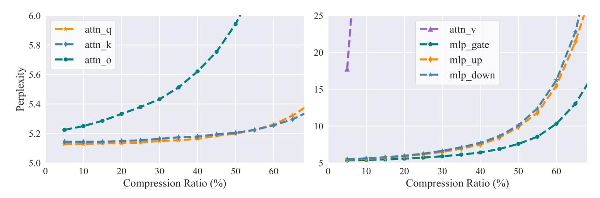

# 2.1 Weight-based and Feature-based Low-rank Decomposition

The low-rank decomposition reduces the number of parameters by decomposing the linear layer weights into two low-rank matrices. based factorization is one naive method. For a linear layer  $\mathbf{W} \in \mathbb{R}^{d_2 \times d_1}$ , according to the Eckart-Young-Mirsky theorem, the trunced singular value decomposition (SVD) provides the optimal solution:  $\bm{W} = \bm{U} \bm{\Sigma} \bm{V}^T, \bm{A} = \bm{V}_r^T, \bm{B} = \bm{U}_r \bm{\Sigma}_r$ , where  $\bm{A} \in \mathbb{R}^{r \times d_1}, \bm{B} \in \mathbb{R}^{d_2 \times r}, \, \bm{\Sigma}_r$  is the top-r largest singular values,  $U_r$  and  $V_r$  are the corresponding singular vectors. If  $r < d_1 d_2/(d_1 +$  $d_2$ ), the factorization can reduce the total parameter amount. However, in the vast majority of cases, the weights of PLMs have a high rank, and a direct truncated SVD decomposition on the weights would lead to significant reconstruction errors (Chen et al., 2021). In comparison, the representation space of PLMs exhibits a clear low-rank property (Yu and Wu, 2023). Therefore, another line of work has considered feature-based factorization:

$$\min_{B,A} ||WX - BAX||_F$$
s.t. rank $(BA) = r$ . (1)

For the linear layer Y = WX, Chen et al. (2021) obtain the optimal solution to Eq. 1 by simultaneously performing the SVD decomposition of the weight and features. Yu and Wu (2023) propose a more efficient Atomic Feature Mimicking (AFM) method, which utilizes the PCA decomposition to find the projection matrices:

$$Cov(\mathbf{Y}) = \mathbf{U}\Sigma\mathbf{U}^{T}$$
$$\mathbf{Y} - E[\mathbf{Y}] = \mathbf{U}_{r}\mathbf{U}_{r}^{T}(\mathbf{W}\mathbf{X} - E[\mathbf{Y}]),$$
 (2)

where  $Cov(\boldsymbol{Y}) \in \mathbb{R}^{d_2 \times n}$ ,  $E[\boldsymbol{Y}] \in \mathbb{R}^{d_2}$  is the covariance and mean of features. Thus, the original linear layer can be replaced by  $\boldsymbol{B} = \boldsymbol{U}_r \in \mathbb{R}^{d_2 \times r}$ ,  $\boldsymbol{A} = \boldsymbol{U}_r^T \boldsymbol{W} \in \mathbb{R}^{r \times d_1}$  and the bias compensation  $\boldsymbol{b} = (\boldsymbol{I} - \boldsymbol{U}_r \boldsymbol{U}_r^T) E[\boldsymbol{Y}]$ . We have observed that the

> **[图片提取文字 (无描述)]:**
> 6.0 25 attn\_q attn v mlp\_gate attn\_k 5.8 20 mlp\_up attn\_o Perplexity 2.9 mlp\_down 15 10 5.2 5.0 40 50 60 50 60 10 20 30 10 20 30 40 Compression Ratio (%) Compression Ratio (%)

Figure 1: Sensitivity of different types of layers to low-rank compression. Each curve represents the compression of only that parameter type, with the horizontal axis indicating the compression ratio for that specific parameter type.

current mainstream LLMs also exhibit characteristics of high-rank weights and low-rank features. Therefore, in this paper, we focus on the feature-based low-rank factorization.

