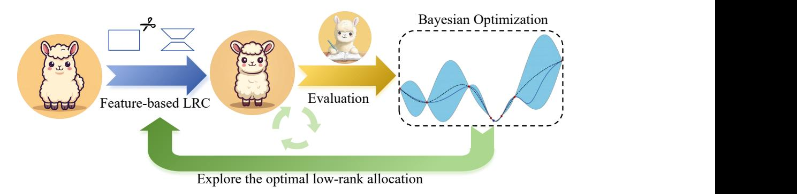
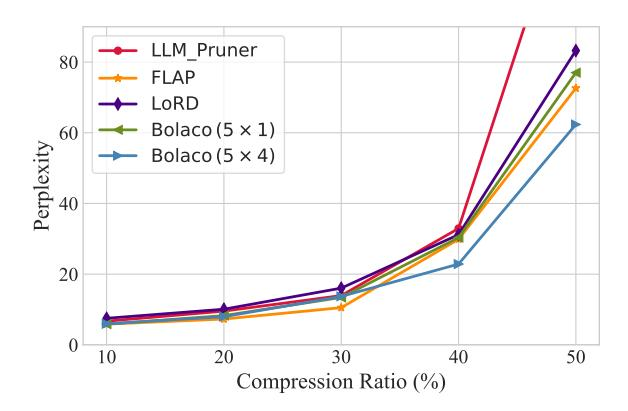

# 3.2 Low-Rank Allocation Based on Bayesian Optimization

As investigated in Section 2.2, different types of layers, and even each individual layer, exhibit varying sensitivities to low-rank compression. Therefore, allocating distinct compression ratios to different layers is crucial to achieve the desired compression rate with minimal performance degradation. For a LLM  $f(\cdot; \theta)$ , we compress it with the set of low-rank compression ratios  $\lambda = \{\lambda_i\}_{i=1}^k$ . We use a task-agnostic evaluation dataset  $\mathcal{D}$  to evaluate performance of the compressed model  $f(\cdot; \theta, \lambda)$ , such as the perplexity on a subset of pretraining data. Therefore, the optimization objective of low-rank allocation can be formulated as:

$$\min_{\lambda \in \mathcal{V}} H(\lambda) = \mathbb{E}_{(x,y) \sim \mathcal{D}} h(f(x; \boldsymbol{\theta}, \lambda), y)$$

$$s.t. \Sigma \lambda < \rho,$$
(5)

where  $h(\cdot, \cdot)$  is the evaluation metric,  $\rho$  is model's overall compression ratio. For LLMs, searching the optimal low-rank allocation is a challenging optimization problem. First, the impact of the low-rank count allocated to different layers on the performance of the compressed model is combinatorial, and optimizing any one component independently may lead to a locally optimal solution. Then, due to LLMs' vast number of parameters, evaluating  $H(\lambda)$  is very time-consuming. Therefore, we leverage sample-efficient Bayesian optimization (BO) (Xu et al., 2022) to optimize Eq 5. BO estimates the objective  $H(\lambda)$  with a stochastic surrogate model and updates the posterior estimation of  $H(\lambda)$  based on the results of each search step. We utilize the Gaussian process  $\mathcal{N}(\mu(\cdot), \sigma^2(\cdot))$  as the surrogate model. Given the previous t-1 search steps  $\{\lambda_1, \cdots, \lambda_{t-1}\}$  and

their evaluation  $H_{t-1} = [H(\lambda_1), \cdots, H(\lambda_{t-1})]$ , the surrogate model is updated as:

$$\mu(\lambda) = \mathbf{k}(\mathbf{K} + \eta^2 \mathbf{I})^{-1} H_{t-1}$$

$$\sigma^2(\lambda) = k(\lambda, \lambda) - \mathbf{k}^T (\mathbf{K} + \eta^2 \mathbf{I})^{-1} \mathbf{k},$$
(6)

where  $k(\cdot, \cdot)$  is a kernel function,  $\boldsymbol{k} = (k(\boldsymbol{\lambda}, \boldsymbol{\lambda}_i))_{i \in [t-1]}$ ,  $\boldsymbol{K} = (k(\boldsymbol{\lambda}_i, \boldsymbol{\lambda}_j))_{i,j \in [t-1]}$ , and  $\eta^2 \boldsymbol{I}$  is the white kernel to model observation noise.

After obtaining the posterior estimation of  $H(\lambda)$  (i.e.,  $H(\lambda) \sim \mathcal{N}(\mu(\lambda), \sigma^2(\lambda))$ ), BO determines the next compression rate allocation state through the acquisition function. Expected improvement (EI) is a popular and effective acquisition function:

$$\alpha(\lambda) = \mathbb{E}_{H(\lambda)} \left[ \max \left\{ 0, H' - H(\lambda) \right\} \right]$$

$$\lambda_t = \underset{\lambda}{\operatorname{argmax}} \alpha(\lambda),$$
(7)

where  $H'=\min_{i\in[t-1]}H(\lambda_i)$ , it means the minimal value observed so far. Then, BO chooses the point with the greatest EI to explore. After obtaining the optimal ratio  $\lambda^*$ , we can determine the allocated rank:  $r_i=(1-\lambda_i)d_1d_2/(d_1+d_2)$ . To fully leverage the acceleration effect of GPU matrix multiplication, we adhere to Nvidia's user guidelines by rounding the low-rank dimensions to the nearest multiple of eight.

The evaluation metric and validation data play a significant role in the optimization performance of BO. They must meet two criteria: effectiveness and accurately reflect actual changes in performance. To this end, we propose a sensitivebased sampling method. This method randomly samples n allocation schemes, calculates the variance of the perplexity of each sample under different allocations, and selects the top-k samples as validation data. In addition, considering the smaller validation set may not comprehensively reflect the LLM's performance, potentially leading to over-fitting in the validation set. To prevent BO from blindly improving the compressed model's language modeling performance on the validation set, we aim to make the compressed model have a prediction distribution for the next word close to the original model. Hence, we employ the reverse KL divergence to quantify the difference:

$$\mathcal{L}(\boldsymbol{\theta}, \boldsymbol{\lambda}) = D_{KL}(f(x; \boldsymbol{\theta}) || f(x; \boldsymbol{\theta}, \boldsymbol{\lambda})).$$
 (8)

&lt;sup>2https://docs.nvidia.com/deeplearning/performance/dl-performance-matrix-multiplication/index.html#gpu-imple

> **[图片提取文字 (无描述)]:**
> **Bayesian Optimization** Evaluation Feature-based LRC Explore the optimal low-rank allocation

Figure 2: Illustration of our Bolaco. It initializes a low-rank dimension allocation and compresses the model via feature-based low-rank compression. Then, it evaluates the compression performance and optimizes the low-rank dimension allocation through Gaussian process-based Bayesian optimization.

#### 3.3 Post-training

After low-rank compression, there remains a noticeable performance gap between the compressed model and the original LLM. To further bridge this gap, following [Ma et al.](#page-9-4) [\(2023\)](#page-9-4), we perform efficient low-rank subspace post-training on the compressed model. However, if we apply the original LoRA [\(Hu et al.,](#page-9-16) [2022\)](#page-9-16) to the low-rank compressed model, the tunable low-rank parameters may not be in the same subspace as the low-rank compressed model parameters, leading to an increase of the parameters' rank after merging. Therefore, inspired by the ELoRA [\(Kopiczko et al.,](#page-9-17) [2024\)](#page-9-17), we select the subspace of compressed model parameters as fixed low-rank matrices and adjust the subspace by trainable vectors:

$$Y = (BA + \Lambda_b B_{r'} \Lambda_d A_{r'}) X, \qquad (9)$$

where Br ′ ∈ R d2×r ′ and Ar ′ ∈ R r ′×d1 are fixed subspace of B and A, Λb and Λd are diagonal matrices. During the post-training, we only tune elements on the diagonal of Λb and Λd.

#### 4 Experiments

#### 4.1 Baseline and Datasets

We compare our method with the competitive structured pruning and low-rank compression methods in LLMs: LLM-Pruner [\(Ma et al.,](#page-9-4) [2023\)](#page-9-4), FLAP [\(An et al.,](#page-8-7) [2023\)](#page-8-7), SliceGPT [\(Ashkboos et al.,](#page-8-8) [2024\)](#page-8-8), LoRD [\(Kaushal et al.,](#page-9-12) [2023\)](#page-9-12), ASVD [\(Yuan et al.,](#page-10-6) [2023\)](#page-10-6). We provide the detailed description of baseline methods in Appendix [B.](#page-11-1)

To evaluate the effectiveness of our proposed low-rank compression method in the task-agnostic setting, we conduct experiments in seven zero-shot common sense reasoning datasets: BoolQ [\(Clark](#page-8-9)

[et al.,](#page-8-9) [2019\)](#page-8-9), PIQA [\(Bisk et al.,](#page-8-10) [2020\)](#page-8-10), HellaSwag [\(Zellers et al.,](#page-10-7) [2019\)](#page-10-7), WinoGrande [\(Sakaguchi et al.,](#page-9-18) [2021\)](#page-9-18), ARC-easy/challenge [\(Clark et al.,](#page-8-11) [2018\)](#page-8-11) and OpenbookQA [\(Mihaylov et al.,](#page-9-19) [2018\)](#page-9-19). We also report the perplexity of the compressed model on the WikiText2 [\(Merity et al.,](#page-9-14) [2016\)](#page-9-14), PTB [\(Marcus](#page-9-20) [et al.,](#page-9-20) [1993\)](#page-9-20), and C4 [\(Raffel et al.,](#page-9-21) [2020\)](#page-9-21) datasets to evaluate its language modeling capabilities.

### 4.2 Experimental Details

In our main experiments, we apply our method to LLaMA-v2-7b and LLaMA-v2-13b. We randomly select 1,024 samples from the training set of C4 as the calibration data. Each sample has a sequence length of 4,096. To estimate the covariance matrix while saving memory usage, we employ the Welford's online algorithm [\(Welford,](#page-10-8) [1962\)](#page-10-8). For the pooled covariance matrix, we partition the calibrated data into 32 groups. During the Bayesian optimization, we utilize the Matern kernel as the covariance function.We randomly sample 20 low-rank allocation schemes and select the top-100 samples with greatest perplexity variance of Wikipedia as the evaluation data. Each sample has a sequence length of 4,096 (4k tokens). Considering that Bayesian optimization is not well-suited for high-dimensional scenarios, we conduct experiments with two settings based on the observations in Section [2.2:](#page-2-1) (a) 5 × 1: We allow attn\_q and attn\_k to share a low-rank dimension, and the same type of parameters across different layers to also share a low-rank dimension, thus BO only optimizes 5 parameters; (b) 5 × 4: Building on the setup of (a), we divide the model's layers into 4 groups in sequence, with no parameter sharing between different groups, resulting in BO needing to optimize 20 parameters. Moreover, given that the parameters of the FFN module are more sensitive

> **[图片提取文字 (无描述)]:**
> LLM\_Pruner 80 FLAP LoRD Perplexity 99 Bolaco  $(5 \times 1)$ Bolaco  $(5 \times 4)$ 20 0 10 20 30 40 50 Compression Ratio (%)

Figure 3: The perplexity of WikiText2 on LLaMA 2-7b with different compression ratios.

to low-rank compression than those of the attention module, we set the length scale for the attention and FFN parameters in the Matern kernel to 1.0 and 0.8, respectively, to emphasize the more significant impact of FFN parameters' rank changes on model performance. We run 50 epochs BO to search the optimal low-rank allocation. At the post-training stage, following LLM-Pruner, we use the Alpaca dataset (Taori et al., 2023) and train 2 epochs. More details can be found in the Appendix C.

#### 4.3 Main Results

We report the perplexity of language modeling for various compression methods at different compression ratios in Figure 3 and 6, and the zero-shot common sense reasoning results in Table 1 and 5 (in Appendix). In terms of language modeling capabilities, FLAP demonstrates strong competitiveness, particularly when the compression rate exceeds 30%, where FLAP's perplexity is slightly better than our Bolaco (5  $\times$  1). However, in the 7b model, Bolaco ( $5 \times 4$ ) achieves the best language modeling performance at high compression rates. Nevertheless, in the 13b model, despite Bolaco  $(5 \times 4)$  still leading other compression techniques, it maintains a certain gap from FLAP. For zeroshot tasks, our method significantly outperforms all baselines without any further post-training, achieving an average performance increase of 1.5-2% across seven datasets. After post-training with only about 1% parameters and 3 hours, our method further narrows down the performance difference between the compressed model and the original model. It retains 96%-98% of the original model's performance at the 20% compression ratio, and at a 30% compression ratio, it maintains 91%-95% of the performance. Comparing the  $5 \times 1$  and  $5 \times 4$ 

setting, we find that the performance difference between the two is not significant. At the 20% compression ratio, simply allocating different low-rank dimensions to different types of parameters suffices to achieve the best current performance. However, at the 30% compression rate, the  $5\times 4$  setting outperforms the  $5\times 1$ , indicating that more granular low-rank assignments contribute to enhanced performance in compressed models at higher compression rates.

#### 5 Analysis and Discussion

