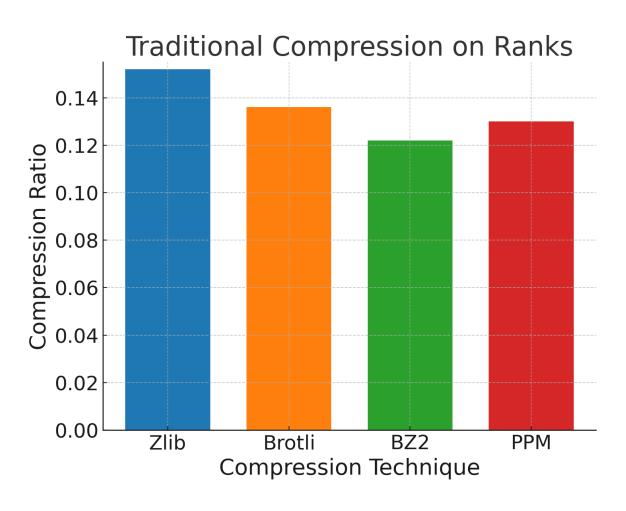
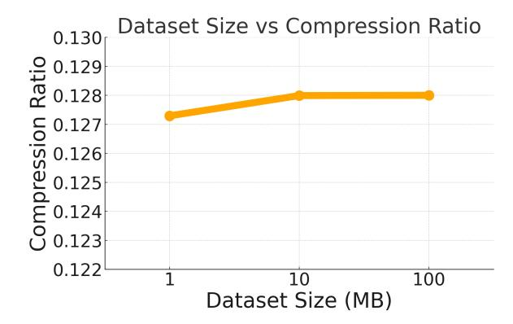

# 4 Conclusion

In this paper we explore the possibility of using LLMs for lossless text compression. We show that while using neural network and LLM based text compression systems lead to significantly better compression rates, they also require impractical amounts of compression time. To alleviate this, we introduce FineZip - an LLM-based lossless text compression system which compresses text 54 times faster than LLMZip with a minor loss in compression performance. FineZip also improves on the compression ratio of traditional text compression systems by approximately 50%. We also show that while FineZip presents a significant step in making practical text compression systems using LLMs, much still needs to be done. We hope our work can serve as a stepping stone in that direction.

## 5 Limitations

LLM-based text compression systems assume a GPU being available in the host machine for local compression. While this is not true for every personal computer, the landscape is rapidly changing. Many personal laptops are now equipped with GPUs and as compute becomes cheaper and the power of LLMs grow, we envision a future where every personal computer will be equipped with an LLM running locally and performing various tasks.

### References

- Fabrice Bellard. 2019. [Lossless data compression with](https://api.semanticscholar.org/CorpusID:211241644) [neural networks.](https://api.semanticscholar.org/CorpusID:211241644)
- Fabrice Bellard. 2021. [Nncp v2: Lossless data compres](https://api.semanticscholar.org/CorpusID:231917764)[sion with transformer.](https://api.semanticscholar.org/CorpusID:231917764)
- J. Cleary and I. Witten. 1984. [Data compression using](https://doi.org/10.1109/TCOM.1984.1096090) [adaptive coding and partial string matching.](https://doi.org/10.1109/TCOM.1984.1096090) *IEEE Transactions on Communications*, 32(4):396–402.
- Grégoire Delétang, Anian Ruoss, Paul-Ambroise Duquenne, Elliot Catt, Tim Genewein, Christopher Mattern, Jordi Grau-Moya, Li Kevin Wenliang, Matthew Aitchison, Laurent Orseau, Marcus Hutter, and Joel Veness. 2024. [Language modeling is](https://arxiv.org/abs/2309.10668) [compression.](https://arxiv.org/abs/2309.10668) *Preprint*, arXiv:2309.10668.
- Tim Dettmers, Artidoro Pagnoni, Ari Holtzman, and Luke Zettlemoyer. 2023. [Qlora: Efficient finetuning](https://arxiv.org/abs/2305.14314) [of quantized llms.](https://arxiv.org/abs/2305.14314) *Preprint*, arXiv:2305.14314.
- Abhimanyu Dubey, Abhinav Jauhri, Abhinav Pandey, Abhishek Kadian, Ahmad Al-Dahle, Aiesha Letman, Akhil Mathur, Alan Schelten, Amy Yang, Angela Fan, et al. 2024. The llama 3 herd of models. *arXiv preprint arXiv:2407.21783*.
- Google. 2024. [Brotli compression algorithm.](https://www.brotli.org) Accessed: 2024-06-01.
- Mohit Goyal, Kedar Tatwawadi, Shubham Chandak, and Idoia Ochoa. 2018. [Deepzip: Lossless data com](https://arxiv.org/abs/1811.08162)[pression using recurrent neural networks.](https://arxiv.org/abs/1811.08162) *Preprint*, arXiv:1811.08162.
- Edward J. Hu, Yelong Shen, Phillip Wallis, Zeyuan Allen-Zhu, Yuanzhi Li, Shean Wang, Lu Wang, and Weizhu Chen. 2021. [Lora: Low-rank adaptation of](https://arxiv.org/abs/2106.09685) [large language models.](https://arxiv.org/abs/2106.09685) *Preprint*, arXiv:2106.09685.
- Yuzhen Huang, Jinghan Zhang, Zifei Shan, and Junxian He. 2024. [Compression represents intelligence](https://arxiv.org/abs/2404.09937) [linearly.](https://arxiv.org/abs/2404.09937) *Preprint*, arXiv:2404.09937.
- Jean-loup Gailly. 1992. Gzip. <http://www.gzip.org>. Accessed: 2024-08-15.
- Jean-loup Gailly. 2024. Zlib: A massively spiffy yet delicately unobtrusive compression library. [http:](http://www.zlib.net) [//www.zlib.net](http://www.zlib.net). Accessed: 2024-08-15.

- Julian Seward. 2024. [bzip2 - a free and open-source file](https://sourceware.org/bzip2/) [compression program.](https://sourceware.org/bzip2/) Accessed: 2024-06-01.
- Matthew V. Mahoney. 2000. Fast text compression with neural networks. In *Proceedings of the Thirteenth International Florida Artificial Intelligence Research Society Conference*, pages 230–234. AAAI Press.
- Sourab Mangrulkar, Sylvain Gugger, Lysandre Debut, Younes Belkada, Sayak Paul, and Benjamin Bossan. 2022. Peft: State-of-the-art parameterefficient fine-tuning methods. [https://github.](https://github.com/huggingface/peft) [com/huggingface/peft](https://github.com/huggingface/peft).
- Marcus Hutter. 2006. enwik8. [http://prize.](http://prize.hutter1.net/index.htm) [hutter1.net/index.htm](http://prize.hutter1.net/index.htm). Accessed: 2024-08-15.
- Alec Radford, Jeffrey Wu, Rewon Child, David Luan, Dario Amodei, Ilya Sutskever, et al. 2019. Language models are unsupervised multitask learners. *OpenAI blog*, 1(8):9.
- J. Schmidhuber and S. Heil. 1996. [Sequential neural](https://doi.org/10.1109/72.478398) [text compression.](https://doi.org/10.1109/72.478398) *IEEE Transactions on Neural Networks*, 7(1):142–146.
- Hugo Touvron, Thibaut Lavril, Gautier Izacard, Xavier Martinet, Marie-Anne Lachaux, Timothée Lacroix, Baptiste Rozière, Naman Goyal, Eric Hambro, Faisal Azhar, et al. 2023a. Llama: Open and efficient foundation language models. *arXiv preprint arXiv:2302.13971*.
- Hugo Touvron, Louis Martin, Kevin Stone, Peter Albert, Amjad Almahairi, Yasmine Babaei, Nikolay Bashlykov, Soumya Batra, Prajjwal Bhargava, Shruti Bhosale, et al. 2023b. Llama 2: Open foundation and fine-tuned chat models, 2023. *URL https://arxiv. org/abs/2307.09288*.
- Chandra Shekhara Kaushik Valmeekam, Krishna Narayanan, Dileep Kalathil, Jean-Francois Chamberland, and Srinivas Shakkottai. 2023. [Llmzip: Loss](https://arxiv.org/abs/2306.04050)[less text compression using large language models.](https://arxiv.org/abs/2306.04050) *Preprint*, arXiv:2306.04050.

### A Appendix

### A.1 Evaluating Traditional Compression Methods

We first experimented with three traditional compression methods - Brotli [\(Google,](#page-4-19) [2024\)](#page-4-19), BZ2 [\(Julian Seward,](#page-4-11) [2024\)](#page-4-11), and PPM [\(Cleary and Wit](#page-4-20)[ten,](#page-4-20) [1984\)](#page-4-20) - for text compression as a function of increasing dataset size. We find that PPM performs best for text compression, and that the performance remains relatively constant with respect to dataset size. The results can be seen in Figure [4.](#page-5-1)

> **[图片提取文字 (无描述)]:**
> Baseline Compression Techniques 0.29 Compression Ratio 82.0 92.0 Brotli BZ2 **PPMD** 0.25 enwik4mb.txt enwik16mb.txt enwik64mb.txt enwik8.txt Dataset

Figure 4: Evaluating Baseline Compression Techniques Brotli, BZ2, and PPM on enwik8

We then use these algorithms to compress the ranks generated by LLMs in FineZip. We see that BZ2 has the best performance so we chose it as the traditional compression method for FineZip.

> **[图片提取文字 (无描述)]:**
> Traditional Compression on Ranks 0.14 Compression Ratio 0.00 80.0 80.0 80.0 0.12 0.02 0.00 Zlib Brotli BZ2 PPM Compression Technique

Figure 5: Testing Traditional Compression Techniques Brotli, BZ2, and PPM on the ranks produced by compressing enwik8 with LLama2-7B finetuned for 64 epochs with r=16

### A.2 Double Compression Benchmark

Prior to testing FineZip, we compressed the enwik8 [\(Marcus Hutter,](#page-4-16) [2006\)](#page-4-16) dataset using traditional compression techniques (Brotli, BZ2, PPM) to create a benchmark for ourselves. Figure 3 shows that Brotli, BZ2, and PPM perform consistently across varying input file sizes and that PPM performs the best on textual data, reaching a compression ratio of approximately 0.25. Figure 4 measures the compression ratio when two compression techniques are stacked and serves as a more accurate benchmark for FineZip as it also employs two step compression. Through these set of baseline experiments, we can see that a compression ratio of 0.25 is the value to beat.

> **[图片提取文字 (无描述)]:**
> Double Compression Ratios for enwik8.txt 0.30 single brotli bz2 0.25 Compression Ratio ppmd 0.05 0.00 brotli ppmd bz2 First Compression Method

Figure 6: Evaluating Stacked Compression with Brotli, BZ2, and PPM on enwik8

#### A.3 Context Size

To determine the best context window size to use, we ran experiments with the LLama2-7B base model (LLMZip) and discovered that a larger context size results in a better compression ratio. The compression ratio began to plateau as the context window reached 512 so we decided to use that for all of our experimentation.

> **[图片提取文字 (无描述)]:**
> Context Size vs Compression Ratio 0.20 Llama2-7b BASE 0.19 Compression Ratio 0.17 0.16 0.15 0.14 0.13 0.12 32 64 128 256 512 Context Size (Tokens)

Figure 7: Evaluating Best Context Window for Compression

> **[图片提取文字 (无描述)]:**
> Dataset Size vs Compression Ratio 0.130 0.129 0.128 0.1270.126 0.125 0.124 0.122 10 100 Dataset Size (MB)

Figure 8: Compressing input files of size 1, 10, and 100 megabytes with LLama-3 8B finetuned for 256 epochs.

### A.4 **FineZip** and Dataset Size

The previous experiments were only using a dataset size of 10mb and for this to be a viable compression technique, it has to scale well for much smaller and larger file sizes. Figure [8](#page-6-0) shows that LLama-3 8B [\(Dubey et al.,](#page-4-14) [2024\)](#page-4-14) fine-tuned for 256 epochs maintains a consistent compression ratio on dataset sizes of 1, 10, and 100mb. This verifies that FineZip remains viable regardless of dataset size.