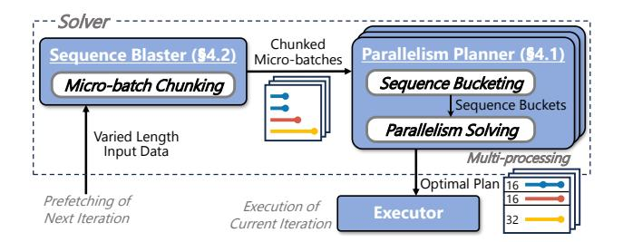
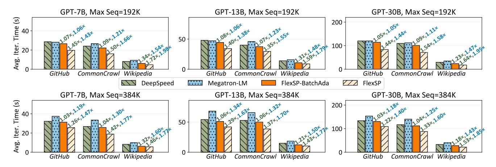
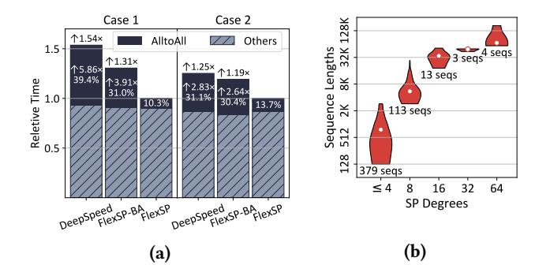
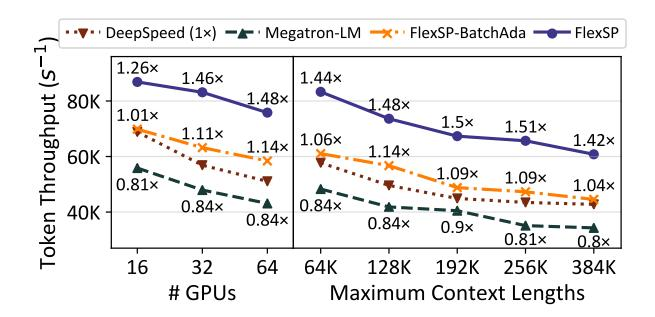
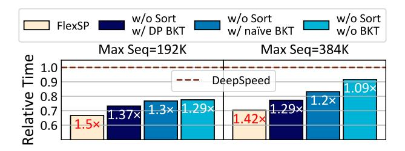

# Optimization Opportunity: Matching heterogeneous parallelism groups with heterogeneous sequence lengths.

Current systems are tailored for homogeneous sequence lengths and employ single, static parallelism strategies throughout the training process. However, dealing with sequences of long-tail distribution in lengths requires large parallelism groups to accommodate the excessively long sequences, which diminishes efficiency for shorter sequences. For instance, when a sequence of 128K exists in the dataset, all sequences of 8K are forced to use SP groups of size at least 32, failing to enjoy the efficient smaller groups. Furthermore, given that short sequences are more common in skewed distributions, this inefficiency is pronounced. Therefore, we propose to adapting appropriate parallelism strategies, crafting heterogeneous parallelism groups to match the heterogeneous workloads caused by varied-length sequences. Specifically, we wish to form small groups for short sequences to improve efficiency, while retaining large groups for long sequences to avoid out-of-memory errors. Additionally, we need to properly control the assignment of sequences to balance the execution time among all parallelism groups. Such flexible, heterogeneity-adaptive strategies will improve communication efficacy and overall system performance.

<span id="page-4-1"></span>> **[图片提取文字 (无描述)]:**
> -Solver Chunked Sequence Blaster (§4.2) Parallelism Planner (§4.1) Micro-batches Sequence Bucketing Micro-batch Chunking Sequence Buckets Parallelism Solving Varied Length Input Data Multi-processing Optimal Plan 16 Prefetching of Execution of Executor Next Iteration Current Iteration


Figure 3. FlexSP system overview.

## 4 FlexSP

Fig. 3 outlines the system overview of FlexSP, which consists of the solver and the executor. Given a batch of sequences with diverse lengths, the solver deduces the optimal plan of heterogeneous parallelism groups and sequence assignment. In particular, there are two major steps in the solver. Firstly, the sequence blaster chunks the sequences into microbatches, ensuring that each micro-batch will not be too large to accommodate. Secondly, the parallelism planner is responsible for solving the optimal plan for each micro-batch to minimize its execution time. Following the optimal plan, the executor carries out the training of one iteration.

In this section, we focus on the details of FlexSP's solver. Frequently used notations are listed in Tab. 2.

## <span id="page-4-4"></span>4.1 Parallelism Planner

We first introduce FlexSP parallelism planner, which deduces the optimal sequence parallelism (SP) strategies and sequence assignment, maximizing training efficiency.

<span id="page-4-3"></span>**4.1.1 Problem Formulation.** We first formulate the optimization problem of FlexSP parallelism planner. Given a data batch containing K sequences  $\{S_k\}$  that vary in lengths, and N devices with device memory budget E, the factors that we need to determine are: (1) the number of SP groups, (2) the parallel degree of each SP group, and (3) which SP group should each sequence be assigned to. Meanwhile, as sequences within different SP groups are processed concurrently, the optimization target is to minimize the maximum execution time of all SP groups.

Since the candidate set of SP degrees is very small<sup>3</sup>, and each sequence can only be assigned to one SP group, we transform all decision variables into 0-1 integer variables. In particular, we assume there are P virtual SP groups, where the  $p^{th}$  SP group  $\mathcal{G}_p$  has an SP degree of  $d_p$ . For instance, if there are 2 GPUs, we have three virtual groups with SP degrees of 1, 1, and 2, respectively. Then, we define the group selection vector  $\mathbf{m} = \langle m_1, m_2, ..., m_P \rangle \in \{0, 1\}^P$ , where  $m_p = 1$  indicates that  $\mathcal{G}_p$  is selected while  $m_p = 0$  means the opposite. By doing so, the number of SP groups and the parallel

<span id="page-4-2"></span><sup>&</sup>lt;sup>3</sup>In common, SP degrees are set as powers of 2 to fit the "binary structure" of chips and networks. Besides, the highest SP degree is restricted by the number of GPUs and the context length.

**Table 2.** Notations used in this work.

- <span id="page-5-0"></span>The number of available GPUs
- *P* The number of virtual sequence parallel (SP) groups
- $G_p$  The  $p^{th}$  group
- $d_p$  The SP degree of  $\mathcal{G}_p$
- $\hat{K}$  The number of sequences
- $S_k$  The  $k^{th}$  sequence
- $s_k$  The sequence length of  $S_k$
- Q The number of buckets after sequence bucketing
- $\mathcal{B}_q$  The  $q^{th}$  bucket
- $\hat{s}_q$  The upper limit of sequence length of  $\mathcal{B}_q$
- $\vec{b}_a$  The number of sequences in  $\mathcal{B}_a$

degree of each SP group can be easily described via m. Subsequently, we further define the sequence assignment matrix  $A \in \{0, 1\}^{K \times P}$ , where  $A_{k,p} = 1$  represents that  $S_k$  is assigned to  $G_p$ . Based on this, we can formulate a joint-optimization problem of the SP group selection and sequence assignment:

$$\underset{\boldsymbol{m} \in \{0,1\}^{P}; \boldsymbol{A} \in \{0,1\}^{K \times P}}{\operatorname{arg\,min}} C \tag{5}$$

s.t. 
$$\text{Time}(\{s_k, A_{k,p}\}; d_p) \le C, \ \forall p \in [1, P]$$
 (6)

$$Memory(\{s_k, A_{k,p}\}; d_p) \le E, \forall p \in [1, P]$$
 (7)

$$\sum_{p} d_p \times m_p \le N \tag{8}$$

$$\sum_{k} A_{k,p} \le m_p \times K, \ \forall p \in [1, P]$$
 (9)

$$\sum_{p} A_{k,p} = 1, \ \forall k \in [1, K]$$
 (10)

Here, Time( $\{s_k, A_{k,p}\}; d_p$ ) and Memory( $\{s_k, A_{k,p}\}; d_p$ ) denotes the execution time and the memory consumption on each device in SP group  $\mathcal{G}_p$ , which will be illustrated in §4.1.2 in detail. The optimization target is to minimize the maximum execution time among all SP groups (Cond. (6)). Cond. (7) represents the memory constraint of each device in each SP group. Cond. (8) denotes that the total parallelism degrees of all selected SP groups should not be larger than the cluster device number N. Cond. (9) ensures that no sequences will be assigned a virtual SP group that is not selected. Cond. (10) requires that each sequence must be assigned to one and only one group.

<span id="page-5-1"></span>**4.1.2 Cost Estimation.** To solve the optimization problem (5), it is necessary to estimate Time( $\{s_k, A_{k,p}\}; d_p$ ) and Memory( $\{s_k, A_{k,p}\}; d_p$ ) accurately. Next, we then analyze the memory consumption and execution time of sequence parallelism with input sequences of variant lengths.

Memory consumption has two components: model states and forward activations. Firstly, given a model, in Ulyssesstyle SP, the memory consumption of model states depends only on the ZeRO-stage applied and the number of available devices N. For instance, when ZeRO-3 is applied, the model states are evenly sharded over N devices, unaffected by SP group selection or sequence assignment. Secondly, for a device SP group  $\mathcal{G}_p$  with an SP degree of  $d_p$ , the activation

memory cost is proportional to the total number of tokens (i.e., the summed lengths of sequences) assigned to  $\mathcal{G}_p$ , and inversely proportional to the SP degree  $d_p$ . This is because sequence parallelism scatters the tokens evenly across the devices within the SP group. Therefore, for each device in SP group  $\mathcal{G}_p$ , its memory consumption can be estimated as:

<span id="page-5-8"></span>
$$Memory(\lbrace s_k, A_{k,p} \rbrace; d_p) = \sum_{k} \frac{A_{k,p} s_k}{d_p} M_{token} + M_{ms}, \quad (11)$$

where  $M_{ms}$  denotes the memory consumption of model states memory that is fixed across all devices,  $M_{token}$  represents the activation memory cost of each token, and  $A_{k,p}$  denotes whether  $S_k$  is assigned to  $G_p$ .

<span id="page-5-7"></span><span id="page-5-5"></span><span id="page-5-4"></span><span id="page-5-3"></span><span id="page-5-2"></span>Previous works [30, 46, 53] have proposed an effective execution cost model for distributed training of LLMs with fixedlength sequences, commonly utilizing the  $\alpha$ - $\beta$  model [17]  $T = \alpha W + \beta$  to estimate the communication and the computation overhead, where W represents the workload (e.g., the computation FLOPs or communication volumes),  $\alpha$  reflects the execution rate (e.g., the per-FLOP computation time or the per-byte communication time), and  $\beta$  denotes the fixed overhead (e.g., kernel launch latencies). However, existing works assume homogeneous sequence lengths and fail to accurately estimate costs for varied sequence lengths. Therefore, FlexSP extends the  $\alpha$ - $\beta$  model, making sequence length the independent variable to handle real-world training corpora. Specifically, to adapt to Transformer models, we model the computation cost of the attention mechanism and the other modules separately. The reason is that the computation cost of attention mechanism is positively correlated with the quadratic of sequence length, while the other modules like linear projection have a linear computation cost w.r.t. the sequence length. Besides, sequence parallelism scatters the computation across the devices within an SP group  $\mathcal{G}_p$ , thus the per-device computation volume is inversely proportional to SP degree  $d_p$ . Therefore, by summing the computation cost of all assigned sequences, we estimate the computation overhead as follows:

<span id="page-5-9"></span><span id="page-5-6"></span>
$$T_{comp}(\{s_k, A_{k,p}\}; d_p) = \frac{1}{d_p} \sum_{k} A_{k,p}(\alpha_1 s_k^2 + \alpha_2 s_k) + \beta_1, \quad (12)$$

where  $\alpha_1$ ,  $\alpha_2$ ,  $\beta_1$  denote the coefficients of the  $\alpha$ - $\beta$  model for computation cost, which are obtained through profiling.

The communication volume of Ulysses-style SP mainly comes from the All-to-All communication, whose volume is proportional to the sequence length  $s_k$  and inversely proportional to SP degree  $d_p$  [19]. Hence, FlexSP estimate the All-to-All communication cost as follows:

$$T_{comm}(\{s_k, A_{k,p}\}; d_p) = \frac{1}{d_p v_p} \sum_k A_{k,p} \alpha_3 s_k + \beta_2,$$
 (13)

where  $\alpha_3$ ,  $\beta_2$  are coefficients given by profiling, and  $v_p$  represents the interconnect bandwidth of the devices within  $\mathcal{G}_p$ , which can also be profiled out.

As can be seen, FlexSP draws inspiration from the  $\alpha$ - $\beta$  model, using  $\beta$ . to represent the data-independent startup latency, while utilizing the  $\alpha$ . to fit the time cost for both communication and computation process according to their respective behaviors. Then, we combine them to estimate the overall execution time of sequence parallelism with varied-length sequences as follows:

$$Time(\{s_k, A_{k,p}\}; d_p) = T_{comp} + T_{comm}.$$
 (14)

Furthermore, when combining sequence parallelism with ZeRO (especially ZeRO-3), we also estimate the overhead of parameter gathering and gradient synchronization, and also consider the overlapping of computation and communication like previous works [30, 46]. As ZeRO is orthogonal to our work, and its overhead is unrelated with the sequence parallelism nor the sequence lengths, we omit such details in this paper for clarity. Experiments show that the overall cost estimation error is below 6%, detailed in Appendix C.

**4.1.3 Problem Solving.** According to the problem formulation in §4.1.1 and the overhead estimation in §4.1.2, we can find that all the constraints and the optimization target is linear with respect to the decision variables  $m_p$  and  $A_{k,p}$ . Therefore, the optimization problem (5) turns out a Mixed-Integer Linear Programming (MILP) problem. Although existing advanced MILP solvers like SCIP [5] are capable of solving MILP problems, the number of decision variables in problem (5) is too large and uncontrollable, making it too complex to derive feasible solutions within a reasonable time. To tackle this obstacle, we need to simplify the problem to decrease the number of decision variables.

In particular, since the number of decision variables is proportional to the number of sequences, and sequences with similar lengths should incur similar overhead, we opt to group the sequences into a small number of buckets. In other words, given the sequences with various lengths, we group the sequences with similar lengths in the same bucket and represented by a unified sequence length (typically, the maximum sequence length within the bucket). Although this will introduce certain estimation biases, it can significantly reduce the number of unique sequence lengths and thereby lower the problem complexity. Below, we introduce our sequence bucketing algorithm.

A naïve method for sequence bucketing is to set a fixed length interval for each bucket and use its upper limit to represent the length of sequences within the bucket. For instance, the upper limit of sequence length can be set as multiples of 2K, that is, 0-2K, 2K-4K, 4K-6K, and so on, forming several buckets. However, as discussed in §3, the sequence lengths in real-world datasets exhibit a complex long-tail distribution rather than a uniform distribution. Besides, different datasets exhibit distinct distributions. Consequently, such a naïve bucketing method would inevitably introduce large estimation biases and cannot be generalized.

To reduce the estimation biases caused by bucketing, we adopt an adaptive sequence bucketing mechanism and propose a dynamic programming algorithm to minimize the bucketing deviation. Specifically, given K sequences  $\{S_k\}$ , we group them into Q buckets, where the  $q^{th}$  bucket  $\mathcal{B}_q$  has the upper limit of sequence length  $\hat{s}_q$ , and containing all sequences satisfying  $\hat{s}_{q-1} < s_k \le \hat{s}_q$ . The bucketing error can be measured as the total deviation of the sequence length to the upper limit of the bucket it belongs to, and the optimization target of sequence bucketing can be defined as:

$$\underset{\{\hat{s}_q\}}{\arg\min} \sum_{q} \sum_{k} I[\hat{s}_{q-1} < s_k \le \hat{s}_q] (\hat{s}_q - s_k). \tag{15}$$

We solve this bucketing problem via a dynamic programming algorithm. We first sort sequences in ascending order of sequence lengths, i.e.,  $s_1 \le s_2 \le ... \le s_K$ , and then define err[k][q] as the minimized error of bucketing the first k sequences into q buckets. Then, starting with err[0][0] = 0, we can derive the following state transition formula of dynamic programming:

$$err[k][q] = \min_{j \in [0,k-1]} \{err[j][q-1] + \sum_{i=j+1}^{k} (s_k - s_i)\}.$$
 (16)

Here,  $\sum_{i=j+1}^k (s_k - s_i)$  denotes the bucketing error of the  $q^{th}$  bucket when selecting  $\hat{s}_{q-1} = s_j$  as the upper limit of the  $(q-1)^{th}$  bucket  $\mathcal{B}_{q-1}$ . Through this dynamic programming algorithm, we determine the bucket boundaries that minimizes the bucketing error adaptively to the data, and group the sequences  $\{S_k\}$  into Q buckets  $\{\mathcal{B}_q = \{S_{k_q}\}\}$ . In practice, we set bucket number Q as 16 by default.

We now re-formulate the optimization problem based on the bucketed sequences. Given the number of available GPUs N, the device memory capacity E, and K sequences  $\{\mathcal{S}_k\}$  as well as Q sequence buckets  $\{\mathcal{B}_q = \{\mathcal{S}_{k_q}\}\}$ , where bucket  $\mathcal{B}_q$  has  $\hat{b}_q$  sequences and upper length limit  $\hat{s}_q$ , we keep the definition of SP groups as problem (5), and re-define the sequence assignment matrix  $\hat{A} \in \mathbb{N}_{\geq 0}^{Q \times P}$  such that  $\hat{A}_{q,p}$  represents the number of the sequences in the  $q^{th}$  bucket  $\mathcal{B}_q$  assigned to the  $p^{th}$  SP group  $\mathcal{G}_p$ . Then, we can re-formulate the optimization problem as follows:

<span id="page-6-2"></span><span id="page-6-1"></span><span id="page-6-0"></span>
$$\underset{\boldsymbol{m} \in \{0,1\}^{P}; \hat{A} \in \mathbb{N}_{\geq 0}^{Q \times P}}{\operatorname{arg \, min}} \quad C \tag{17}$$

s.t. 
$$\text{Time}(\{\hat{s}_q, \hat{A}_{q,p}\}; d_p) \le C, \ \forall p \in [1, P]$$
 (18)

Memory
$$(\{\hat{s}_q, A_{q,p}\}; d_p) \le E, \ \forall p \in [1, P]$$
 (19)

$$\sum_{p} d_p \times m_p \le N \tag{20}$$

$$\sum_{q} \hat{A}_{q,p} \le m_p \times K, \ \forall p \in [1, P]$$
 (21)

$$\sum_{p} \hat{A}_{q,p} = \hat{b}_q, \ \forall q \in [1, Q]$$
 (22)

where Cond. (22) ensures that all the sequences in bucket  $B_q$  are assigned. It is obvious that the re-formulated optimization problem (17) is also a MILP problem. In practice, FlexSP

utilizes SCIP, an advanced MILP solver library, to solve the problem (17). After obtaining the optimal group selection vector  $\mathbf{m}^*$  and the optimal sequence assignment matrix  $\hat{\mathbf{A}}^*$ , we can derive the optimal parallelism plan according to  $\mathbf{m}^*$  and dispatch the training sequences across the SP groups according to  $\hat{\mathbf{A}}^*$ . The solving time of problem (17) is typically within 5-15 seconds, which can be overlapped with the training time of one batch (§5).

## <span id="page-7-0"></span>4.2 Sequence Blaster

When the input batch contains too many sequences, they cannot be processed together due to the limited memory capacity, and therefore the optimization problem (17) will have no feasible solutions due to memory constraint (19). Gradient accumulation is the common technique for such cases, which splits the global data batch into several microbatches, executes each micro-batch sequentially and accumulates the model gradients for parameter update. For training systems intended for homogeneous sequence lengths, microbatch chunking is straightforward — we can simply fix the number of sequences in each micro-batch. However, in our scenario where input sequences are associated with heterogeneous lengths, micro-batch chunking is non-trivial. Therefore, FlexSP designs a sequence blaster to blast the sequences into micro-batches for parallelism planner to determine the optimal sequence parallelism strategies.

Given input data batch  $\mathcal{B} = \{S_k\}$  with K sequences, the sequence blaster blasts the sequences into M disjoint microbatches  $\{\mathcal{M}_i\}$ , satisfying  $\bigcup_{i=1}^M \mathcal{M}_i = \mathcal{B}$ . In the following, we summarize several propositions based on theoretical analysis and empirical observations, and introduce our designs of sequence blaster motivated by these propositions.

Takeaway #1: In most cases, having fewer micro-batches is likely to be more efficient.

This takeaway can be deduced from the cost estimation in §4.1.2. Either in computation or communication, there is a fixed overhead term denoted as  $\beta$  that exists for each micro-batch execution, so having more micro-batches introduces more additional overhead. Besides, if we have many micro-batches, which implies that each micro-batch only consists of very few tokens, then the workload distributed to each micro-batch may not be sufficient to fully utilize either the computation capacity or the communication bandwidth. Therefore, a smaller number of micro-batch number M usually gives better efficiency.

However, this does not mean that the smallest M always achieves the best performance. Hence, our sequence blaster first calculates the smallest feasible micro-batch number  $M_{min} = \begin{bmatrix} \frac{Batch\_Total\_Token}{Cluster\_Token\_Capacity} \end{bmatrix}$ . Then, it traverses the micro-batch number in range  $[M_{min}, M_{min} + M')$  to find the best one, where M' is the number of trails (5 by default).

Takeaway #2: A smaller variance of sequence lengths within a micro-batch is likely to be more efficient.

This takeaway is based on both the theoretical analysis of execution overhead (§4.1.2) and empirical observations derived by solving the optimization problem (17). Specifically, the memory consumption (Eq. (11)) is linear to the sequence length, while the computation time (Eq. (12)) is quadratic to sequence length. Consequently, as the sequence length  $s_k$  increases, the computation overhead increases faster than the memory consumption, leading to imbalance between computation and memory cost. For instance, for two sequences  $S_1$ ,  $S_2$  with length  $s_1 = 4K$ ,  $s_2 = 16K$  within one micro-batch,  $S_1$ is assigned to SP group  $G_1$  with  $d_p = 8$ , while  $S_2$  is assigned to  $\mathcal{G}_2$  with  $d_p = 32$ . Although the memory consumption of  $\mathcal{G}_1, \mathcal{G}_2$  is the same, the computation cost of  $\mathcal{G}_2$  is larger than that of  $\mathcal{G}_1$  due to the quadratic computation volume of long sequence  $S_2$ , which requires  $G_1$  to wait for  $G_2$  to finish and causes computation resource wastage. On the other hand, if we try to align the computation time of sequences with diverse lengths, their memory consumption will be distinct, leading to memory under-utilization. To conclude, larger variance of sequence lengths within a micro-batch leads to resource under-utilization of either computation or memory.

Motivated by this, FlexSP sequence blaster first sorts the input sequences according to their lengths, and ensures that sequences with smaller variance of lengths are blasted into one micro-batch.

<u>Takeaway #3:</u> The total token number of each micro-batch should be made as evenly distributed as possible.

This takeaway focuses on striking a balance in memory consumption across micro-batches, which is proportional to the total token number. It is designed to prevent potential out-of-memory (OOM) situations when splitting micro-batches and also to avoid under-utilization of device memory. This guidance also contributes to takeaway #1, as imbalanced token blasting leads to more micro-batches. Therefore, we design a memory-balanced micro-batch chunking algorithm based on dynamic programming, detailed in Appendix A.

#### 4.3 Overall Workflow of FlexSP Solver

We now introduce the overall workflow of FlexSP solver, as illustrated in Alg. 1. Given the data batch  $\mathcal{B}$ , we first calculate the minimum feasible micro-batch number  $M_{min}$  in Line 2 based on cluster memory capacity, as discussed in §4.2, and then traverse micro-batch number M starting from  $M_{min}$  in Line 3. For each traversed M, the sequence blaster (§4.2) is invoked to blast the sequences into M micro-batches  $\{\mathcal{M}_i\}$ ,  $i \in [1, M]$  (Line 5). Subsequently, for each micro-batch  $\mathcal{M}_i$ , we first group sequences into Q buckets (Line 7) and then utilize the parallelism planner (Line 8) to optimize the sequence parallelism strategies for the current micro-batch data, which solves the MILP problem as discussed in §4.1. Line 9 gathers the optimal time and strategy of each micro-batch to form the results for the whole data batch  $\mathcal{B}$ , and Line 11 finds the

## Algorithm 1: FlexSP Solver Workflow

```
Input: Data Batch \mathcal{B} = \{S_k\} with K sequences, # Buckets Q
     # Devices N, Device Memory Capacity E, # Trails M'
     Output: Minimized time T^*, Parallelism Plan \mathcal{P}^*
 1 T^*, \mathcal{P}^* \leftarrow \infty, None;
 2 M_{min} ← get_min_microbatch_num(\mathcal{B}, N, E);
 3 for M in M_{min}, M_{min} + 1, ..., M_{min} + M' - 1 in parallel do
           T_{\mathcal{B}}, \mathcal{P}_{\mathcal{B}} \leftarrow 0, [];
           \{\mathcal{M}_i\} \leftarrow \text{Sequence\_Blaster}(\mathcal{B}, M);
 5
           for \mathcal{M} in \mathcal{M}_1, \mathcal{M}_2, \dots, \mathcal{M}_M in parallel do
 6
 7
                  \{B_q\} \leftarrow \text{Sequence\_Bucketing}(\mathcal{M}, Q);
                  T_{\mathcal{M}}, \mathcal{P}_{\mathcal{M}} \leftarrow \text{Parallelism\_Planner}(\{B_q\}, N, E);
              T_{\mathcal{B}} \leftarrow T_{\mathcal{B}} + T_{\mathcal{M}}; \mathcal{P}_{\mathcal{B}}.extend(\mathcal{P}_{\mathcal{M}});
           if T_{\mathcal{B}} < T^* then
10
             T^*, \mathcal{P}^* \leftarrow T_{\mathcal{B}}, \mathcal{P}_{\mathcal{B}};
12 return T^*, \mathcal{P}^*;
```

<span id="page-8-8"></span><span id="page-8-7"></span><span id="page-8-6"></span>best parallelism plan  $\mathcal{P}^*$  with minimum execution time  $T^*$  across various tries of micro-batch number.

To improve the efficiency of the solver, FlexSP employs a two-level multi-process solving technique to parallelize the solving process. Specifically, FlexSP explores various microbatch numbers in parallel (Line 3) with multiple processes, and optimizes the parallelism strategies of each micro-batch in parallel (Line 6) as well. Through this technique, the solving overhead of the FlexSP solver is close to the overhead of solving one round of the MILP problem in §4.1, typically within 5-15 seconds, and is independent of the number of sequences nor the number of micro-batches. Therefore, the solving efficiency of FlexSP solver is guaranteed.

## <span id="page-8-0"></span>5 Implementation

We build the proposed method as an efficient LLM training system, FlexSP. We implement the FlexSP solver with Python and C++, leveraging the SCIP [5] library for solving the MILP problem. We then develop the FlexSP runtime engine on top of PyTorch for executing the training process based on the strategies optimized by the solver. In our implementation, we use NCCL [1] as the communication backend. As for the attention kernel, we utilize the state-of-the-art flash-attn [9, 10] library's interface for varied-length sequence packing to perform attention computation. As for parallelisms, we implement the Ulysses-style SP similar to DeepSpeed-Ulysses [19] and implement ZeRO with PyTorch FSDP [52]. We now introduce several key points in our implementation of FlexSP for efficient training.

Hot Switching and Group Management. FlexSP implements sequence parallelism in a hot switching manner to deal with the varied parallelism strategies for the distinct input data. Given each micro-batch as well as the corresponding

parallelism strategies, FlexSP generates the SP communication groups dynamically and scatters the data into the corresponding group. In order to avoid redundant creation and storage overhead of communication groups, FlexSP maintains a NCCL group pool to manage the complicated SP groups. Specifically, FlexSP generates communication groups on the fly, and new groups are created only when necessary, while existing ones are reused to optimize resource usage. Therefore, in FlexSP, dynamically adjusting the SP groups does not incur any overhead if the groups are cached. The number of communication groups needed for each GPU is up to  $\log N$ , where N is the number of GPUs. In our evaluation, creating  $\log 64 = 6$  communication groups takes under 10 seconds, negligible compared to the overall training time.

Disaggregating Solving and Training. For each training data batch, there are two phases, i.e., the solver deduces the optimal plan (i.e., a combination of parallelism strategies and sequence assignment) and the executor carries out the training. Since the problem solving is on CPUs while the training is on GPUs, we disaggregate the two phases to facilitate overlapping. In particular, on each GPU node (machine), we establish a service of the solver, which takes as input the lengths of one data batch, and runs Alg. 1 to deduce the optimal plan. Subsequently, we manage a distributed storage to gather the plans, and the executor sequentially reads one plan per iteration to train. By doing so, FlexSP solves the problem for multiple data batches concurrently, and the problem solving is also overlapped with the training process.

## 6 Experiments

## 6.1 Experimental Setups

Baseline Systems. We compare our system with the state-of-the-art (SOTA) distributed LLM training systems, i.e., Megatron-LM [33] and DeepSpeed [39]. Megatron-LM supports 4D-parallelism, including TP (with Megatron-style SP), PP, DP (ZeRO-1), and CP. DeepSpeed supports DeepSpeed-ZeRO and Ulysses-style SP. Both these systems are tailored for homogeneous sequence lengths and only support training LLMs with a single, static parallelism strategy. Our system, namely FlexSP, is adaptive to the heterogeneous workloads of varied-length sequences, and is capable to generate the optimal sequence parallelism strategies adaptively.

For further evaluation of our adaptive feature, we also introduce a variant of FlexSP as a baseline, FlexSP-BatchAda. Unlike DeepSpeed which employs one static strategy along the whole training process, FlexSP-BatchAda adaptively applies the most efficient homogeneous SP strategy for each data batch, e.g., two SP=32 groups for the first batch and

<span id="page-8-10"></span><sup>&</sup>lt;sup>4</sup>Because the sizes of SP groups are always powers of 2, we let each GPU to always pair with its neighbors. For example, with N=4 GPUs, there are at most 3 communication groups, i.e., [0,1], [2,3], and [0,1,2,3], with each GPU associated with 2 (=  $\log N$ ) groups.

<span id="page-9-0"></span>> **[图片提取文字 (无描述)]:**
> GPT-13B, Max Seq=192K GPT-7B, Max Seq=192K GPT-30B, Max Seq=192K (s) 200 Time 40 50 100 Avg. Wikipedia Wikipedia CommonCrawl Wikipedia GitHub CommonCrawl CommonCrawl GitHub FlexSP-BatchAda DeepSpeed Megatron-LM FlexSP GPT-13B, Max Seq=384K GPT-30B, Max Seq=384K GPT-7B, Max Seq=384K (s) 200 Time 50 Iter. 100 -Avg. GitHub CommonCrawl Wikipedia Wikipedia GitHub GitHub CommonCrawl CommonCrawl Wikipedia


**Figure 4.** End-to-end evaluation (in seconds per iteration) for specific model sizes and maximum context lengths (Max Seq) across three datasets, shown in each sub-figure. Speedup ratios compared to DeepSpeed (green, left) and Megatron-LM (blue, right) are indicated.

eight SP=8 groups for the second batch. Compared to FlexSP-BatchAda, FlexSP not only allows adaptive strategies across data batches, but also supports heterogeneous SP strategies within each data batch, e.g., mixing and executing one SP=32 group and four SP=8 groups concurrently.

Hardware Environments. We conduct all the experiments on a GPU cluster with 8 nodes, with each node consisting of 8 NVIDIA A100 40GB GPUs equipped with NVLink. All nodes are interconnected by 400Gbps InfiniBand network.

**Experimental Workloads.** We conduct experiments on GPT-series LLMs of three different sizes, GPT-7B, GPT-13B, GPT-30B. Refer to Appendix B.1 for more details. We choose three different datasets, including *GitHub*, *CommonCrawl*, and *Wikipedia*. Fig. 2 displays the distribution of sequence lengths of these datasets. We also evaluate each system on these datasets under different maximum context length limits, i.e., 384K and 192K. The sequences exceed the maximum context length limit will be eliminated during training.

**Protocols.** We apply sequence packing for all systems. Specifically, for baseline systems Megatron-LM, DeepSpeed and FlexSP-BatchAda, we use the *Best-fit Packing* [13] as introduced in §2. For FlexSP, the solver will automatically determine the sequence packing. As for the parallelism strategy, we manually tune the most efficient strategy for baseline systems under different workloads, including parallelism degrees of DP, TP, PP, CP, SP. We also apply activation checkpointing strategies for each system to accommodate model training with a context length of 384K. We fix the global batch size of each training step as 512 for all workloads, and record the average iteration time over 40 iterations after 10-iteration's warm-up. Refer to Appendix B.2 for details.

#### 6.2 End-to-End Performance

We compare the end-to-end performance of each system in Fig. 4, which shows the average iteration time of each system across different workloads. The results demonstrate that across all the model sizes, datasets, and context lengths, FlexSP consistently outperforms all baseline systems, achieving a maximum speedup of 1.72× compared to DeepSpeed and 1.98× compared to Megatron-LM.

We first analyze the performance gain of FlexSP compared to SOTA systems. The advantages of FlexSP primarily arise from the communication gains achieved by its flexible sequence parallelism strategy. As mentioned in §3, the parallelism group needs to be large enough to shard excessively long sequences to fit the model into device memory. For instance, under 384K maximum context length, DeepSpeed requires SP=64 while Megatron requires TP=16, CP=4 or TP=8, CP=8. Such large parallelism groups must communicate with slow inter-node network bandwidth, thus leading to inefficient communication. SOTA systems maintain a homogeneous and static parallelism strategy along the training process, forcing all sequences in the dataset to utilize the large groups with slow inter-node bandwidth, which is inefficient for shorter sequences. On the contrary, FlexSP allows shorter sequences to enjoy the higher communication efficiency within smaller parallelism groups, while maintaining larger groups for long sequences to satisfy the memory constraint. For instance, FlexSP may assign a sequence with 100K into a group with SP=32 to avoid OOM errors, while scattering sequences with 16K into a group with SP=8 to enjoy the fast intra-node connection. Such flexible strategy effectively reduces the communication overhead and contributes to the system efficiency of FlexSP.

Furthermore, the strength of FlexSP is correlated with the long-tail distribution of sequence lengths — a more pronounced long-tail leads to greater communication benefits,

<span id="page-10-0"></span>**Table 3.** Details of heterogeneous SP groups employed in each micro-batch of each case. Each  $d \times m$  indicates we form m SP=d groups, and each  $\langle \cdots \rangle \times x$  indicates the set of heterogeneous SP groups is employed for x micro-batches (×1 is omitted).

|                 | Case 1                                                                                                                                            | Case 2                                                                                                                                                                                                  |
|-----------------|---------------------------------------------------------------------------------------------------------------------------------------------------|---------------------------------------------------------------------------------------------------------------------------------------------------------------------------------------------------------|
| DeepSpeed       | $\langle 64 \rangle \times 5$                                                                                                                     | $\langle 64 \rangle \times 7$                                                                                                                                                                           |
| FlexSP-BatchAda | $\langle 16 \times 4 \rangle \times 5$                                                                                                            | $\langle 32 \times 2 \rangle \times 7$                                                                                                                                                                  |
| FlexSP          | $\langle 32, 16, 8 \times 2 \rangle$ $\langle 8 \times 8 \rangle \times 2$ $\langle 8 \times 7, 4 \times 2 \rangle$ $\langle 1 \times 64 \rangle$ | $ \begin{array}{c} \langle 64 \rangle \\ \langle 32, 16 \times 2 \rangle \\ \langle 16 \times 3, 8 \times 2 \rangle \\ \langle 8 \times 8 \rangle \times 2 \\ \langle 1 \times 64 \rangle \end{array} $ |

resulting in a more significant speedup. As shown in Fig. 2, the *Wikipedia* dataset has the greatest skewness in three datasets. Over 96% of the sequences in *Wikipedia* are below 8K, considerably greater than those in *GitHub* and *Common-Crawl*, and the proportion of sequences exceeding 32K is much smaller than those in the other datasets. Compared to SOTA systems, such great skewness benefits FlexSP to achieve speedup of up to 1.98× on *Wikipedia*, while the speedups on *CommonCrawl* and *GitHub* are slightly lower, up to 1.77× and 1.63×, respectively.

Then, we analyze the performance of FlexSP-BatchAda, which employs homogeneous strategy within each data batch but allows adaptive strategies across data batches. It also gains benefits from communication and achieves speedup ratio up to 1.34× and 1.60× compared to DeepSpeed and Megatron-LM, respectively. However, due to its homogeneous strategy within each batch, its performance gain on *GitHub* and *CommonCrawl* is relatively low, as these datasets possess long sequences in many data batches, forcing these batches to use large and inefficient parallelism groups. In comparison, FlexSP allows heterogeneous and adaptive strategies at a nuanced granularity, both among and within data batches, further increasing the potential for reducing communication overhead and achieving acceleration up to 1.42× compared to FlexSP-BatchAda.

## 6.3 Case Study

To analyze the performance gains of FlexSP more clearly, we conduct an in-depth case study on two iterations of GPT-7B on *CommonCrawl* with a maximum context length of 384K.

We present the parallelism strategies, i.e., details of the employed SP groups, in Tab 3. We also break down the end-to-end time and highlight the portion of All-to-All communication in Fig 5a. It can be seen that the major difference lies in the All-to-All communication overhead, which is the source of FlexSP's performance gain. For DeepSpeed, its All-to-All communication accounts for up to 40% of the total runtime,

<span id="page-10-1"></span>> **[图片提取文字 (无描述)]:**
> Case 1 Case 2 128K ↑1.54× AlltoAll Others 1.5 -3 seqs 4 seqs Sequence Lengths 32K ↑1.31× 个1.25× 个5.86× ↑1.19× 13 segs 39.4% Reletive Time \* 个3.91× ↑2.83× 31.1% 31.0% 个2.64× 1.0 30.4% 10.3% 13.7% **2K** 113 seqs 512 0.5 -128 379 segs 64  $\leq 4$ 16 32 DeepSpeed FlexSP-BAFlexSP DeepSpeed Sp.B.FlexSP SP Degrees (b) (a)


**Figure 5.** (5a) Breakdown of end-to-end time (All-to-All+Others) in case study (BA is short for BatchAda). (5b) Distribution of sequence lengths assigned to different SP degrees in Case 2, visualized as a violin plot. The white circle indicates the median.

which is due to the large SP group (SP=64) and the limited inter-node bandwidth across 8 nodes. FlexSP-BatchAda adapts the SP strategies for batches (four SP=16 groups for Case 1 and two SP=32 groups for Case 2), and reduces communication cost compared to DeepSpeed, especially in Case 1 where SP=16 cuts down the communication to 31%. FlexSP further optimizes communication through adaptive strategies at a finer granularity, leveraging smaller SP groups (e.g., SP=1, 4, 8) to process shorter sequences, which significantly reduces communication over low-bandwidth inter-node connections, cuts down the All-to-All time to around 10%, and achieves a reduction of up to 5.86× in All-to-All time and a 1.54× speedup in overall end-to-end time.

To further explore FlexSP's flexible strategy, we present the distribution of sequence lengths assigned to different SP degrees in Case 2, as shown in Fig. 5b. In FlexSP, sequences of diverse lengths are assigned to appropriate SP degree groups, with shorter sequences showing a clear preference to lower SP degrees so that the All-to-All communication cost can be minimized. Meanwhile, due to the long-tail property of the datasets, (relatively) short sequences may be routed to SP groups with (relatively) higher parallel degree, striking a good balance across all SP groups. This highlights the effectiveness of FlexSP solver in optimizing the flexible parallelism strategies for sequences with varied lengths.

## 6.4 Scalability Study

To evaluate the scalability of each system, we conduct experiments on *CommonCrawl*, varying both cluster size and maximum context length. The results, measured as token throughput per GPU, are presented in Fig. 6.

**Scalability w.r.t. # GPUs.** We begin by evaluating performance across GPU clusters with 16, 32, and 64 GPUs, with a maximum context length of 128K. The results indicate that FlexSP consistently outperforms other systems, achieving a maximum speedup of 1.48× compared to DeepSpeed.

<span id="page-11-0"></span>> **[图片提取文字 (无描述)]:**
> • ▼ · · DeepSpeed (1×) - Language - · · · · · · · · · · · · · · · · · · 1.26× Token Throughput (S 1.46× 1.44× .48× 80K .48× 1.01× 1.5× 1.51× 1.06× 1.42× 1.14× 1.14× 60K -1.09× 1.09× 0.81× 1.04× 0.84× 0.84× 40K 0.84× 0.84×  $0.9 \times$ 0.81× 0.8× 16 32 64 64K 128K 192K 256K 384K # GPUs Maximum Context Lengths


**Figure 6.** Scalability study measured as token throughput per GPU. The speedup rates are measured w.r.t. DeepSpeed.

<span id="page-11-2"></span>**Table 4.** Token estimation bias of bucketing methods.

| Token Error     | Github CommonCrawl |      | Wikipedia |
|-----------------|--------------------|------|-----------|
| DP Bucketing    | 0.7%               | 0.5% | 2.3%      |
| Naïve Bucketing | 13.4%              | 8.8% | 22.1%     |

Furthermore, we find that as the cluster size increases, the reduced inter-node bandwidth brings negative impact on training throughput. For instance, when scaling from 16 to 32 GPUs, DeepSpeed and Megatron-LM only achieve sublinear speedup of 1.65× and 1.71×, respectively. This is because the bandwidths of 32 and 64 GPUs on our cluster are lower than that of 16 GPUs, which leads to poor scalability of SOTA systems. However, FlexSP is much more robust to such bandwidth decrease, achieving 1.91× when scaling from 16 to 32 GPUs and 1.82× from 32 to 64 GPUs. FlexSP's sound scalability attributes to the adaptive strategies and the utilization of the high bandwidth of intra-node NVLink.

Scalability w.r.t. maximum context length. We extend the evaluation on 64 GPUs with maximum context lengths ranging from 64K to 384K. The token throughput of all systems tends to decrease due to the increased computational FLOPs associated with longer sequences. FlexSP consistently maintains its optimal performance under different context length limit, achieving a speedup ratio between 1.42× and 1.51×. Furthermore, we find the speedup ratio for 64K and 384K is slightly lower than that for 256K, which is reasonable. For a shorter context length limit, such as 64K, the long-tail property of the dataset is weakened, resulting in fewer opportunities for adaptive optimization. On the other hand, for a longer context length, like 384K, the computation overhead of extremely long sequences consumes a significant amount of time, which also reduces the speedup.

## 6.5 Ablation Study

To evaluate the efficacy of key components within the FlexSP solver, i.e., the dynamic programming (DP) sequence bucketing in parallelism planner (§4.1), and the sequence sorting

<span id="page-11-1"></span>> **[图片提取文字 (无描述)]:**
> w/o Sort w/ DP BKT w/o Sort w/o BKT w/o Sort FlexSP w/ naïve BKT Max Seg=192K Max Seq=384K DeepSpeed Relative 9.0 8.0 8.0 1.2× 1.37×


**Figure 7.** Ablation studies. FlexSP adopts sequence sorting (Sort) in sequence blaster and DP bucketing (BKT) algorithm.

mechanism in sequence blaster (§4.2), we compare the performance of complete version of FlexSP against various ablated versions on *CommonCrawl*, as shown in Fig. 7. Sequence sorting in sequence blaster helps reduce sequence length variance within each micro-batch. Disabling this mechanism negatively impacts overall performance. Additionally, replacing the DP sequence bucketing with a naïve even-sized bucketing introduces more biases into the bucketing estimation, leading to worse performance. Finally, removing the bucketing mechanism entirely increases the complexity of the MILP problem, causing the solver to fail in producing a satisfactory solution within limited time.

We also evaluate the token estimation bias of the naïve bucketing and our dynamic-programming-based (DP) optimal sequence bucketing in parallelism planner (§4.1). We show the maximum token error ratio, i.e., error token number divided by total token number, on different datasets in Tab. 4. We find that our optimal bucketing algorithm effectively reduces the estimation error to lower than 2.3%, while naïve bucketing introduces error up to 22%.

