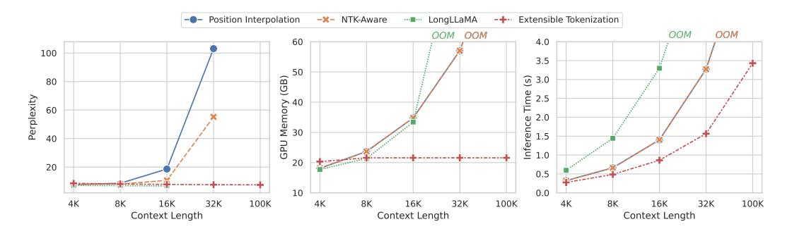

# 1 Introduction

Large language models (LLMs) need to process long-sequence data in order to accomplish many critical tasks, like retrieval augmented generation and in-context learning. Unfortunately, the existing LLMs are constrained by the sizes of their context windows, which are far from enough to fully cover the input data in the corresponding scenarios. Although the LLM's context window can be extended by fine-tuning [\[6;](#page-9-0) [11;](#page-9-1) [25\]](#page-10-0), it will lead to a considerable cost at both training and inference time. Besides, the continual fine-tuning over long-sequence data is likely to impair the LLM's original capability on shorter contexts, which is unfavorable to its practical usage. Alternatively, the LLMs can be also modified by many other techniques to establish longer context windows, such as sparse attention [\[9;](#page-9-2) [3;](#page-9-3) [36;](#page-11-0) [15\]](#page-9-4), stream processing [\[33;](#page-10-1) [18\]](#page-10-2), compressed memory [\[4;](#page-9-5) [8;](#page-9-6) [24;](#page-10-3) [27;](#page-10-4) [20\]](#page-10-5), etc. However, the existing methods are still limited by manifold problems. For example, the sparse attention calls for customized GPU kernels which are not supported by the standard infrastructures; the stream processing ignores the information beyond the context window instead of making effective

∗Ninglu Shao (ninglu\_shao@ruc.edu.cn), Shitao Xiao, and Zheng Liu are the co-first authors.

†Zheng Liu (zhengliu1026@gmail.com) is the correponding author.

> **[图片提取文字 (无描述)]:**
> --- Position Interpolation ...... LongLLaMA -+ Extensible Tokenization -x- NTK-Aware OOM OOM OOM OOM 60 4.0 100 3.5 50 80 (GB) (s) 3.0 Perplexity Memory 30 1.5 1.0 GPU +----20 20 0.5 0.0 10 4K 8K 100K 8K 16K 32K 100K 4K 8K 16K 32K 100K 4K 16K 32K Context Length Context Length Context Length

Figure 1: Comparison between Extensible Tokenization and other context extension methods, including 1) Position Interpolation [5], 2) NTK-Aware Scaled RoPE [1], 3) LongLLaMA [31]. Extensible Tokenization presents a superior long-context language modeling capability, along with better efficiency in terms of memory and time. PPL is measured on PG19 [26] following the method in [7]

use of it; the compressed memory are still limited by the substantial loss of contextual information and the incompatibility with the existing LLMs.

In fact, the LLM's context capacity, i.e. the contextual information that the LLM is able to perceive, is jointly determined by two critical factors. One is the *size of context window*, which regulates the amount of input units the LLM can intake. The other one is the *information density*, which reflects the information encoded by each input unit. Currently, the typical input unit to LLM is token embedding, which is relatively information sparse because it only encodes the information about each individual token. Once with more compact and informative input units, the LLM will be able to perceive more information with the same context window.

Based on this fundamental principle, we propose **Extensible Tokenization** as a new method to extend the LLM's context. Extensible Tokenization stands as a midware in between of the input context and the LLM, which transforms raw token embeddings into *extensible embeddings* for the compact representation of the input context. Extensible Tokenization shares a common high-level spirit as the previous methods on context compression [7; 24; 8; 12]. However, it enjoys a substantially improved performance on context extension, a high flexibility of usage, and a high compatibility with the downstream LLM thanks to a series of characters about its architecture and training.

Instead of modifying the original model architecture, we employ another pre-trained language model as the stand-alone module for Extensible Tokenization. It transforms the raw input into its output embeddings, and then performs down-scaling by the scaling factor k (e.g., k=32) for the extensible embeddings. Given the dramatic scale of compression, the learning process must be properly designed such that the contextual information can be fully preserved. In our work, we propose to learn the extensible embeddings through auto-regression (AR), where the compressed context can well assist the downstream LLM for the prediction of the next tokens. Besides, we further optimize the sample efficiency of training through the two-stream processing. With merely two passes of feed-forward, it will let the training loss to be derived from every single token of one training sample. By minimizing the comprehensive prediction losses from the data, the extensible embeddings can be effectively learned as compact but equally informative representations of the context.

Extensible Tokenization presents a highly flexible solution to extend the LLM's context. In particular, the scaling factor k can be freely specified at the inference time, leading to the flexible extension for diverse context lengths. Besides, the extensible embeddings and the raw token embeddings can be seamlessly blended with each other, with the extensible embeddings applied for the verbose part of the input (e.g., the retrieved documents) and the raw token embeddings used for the concise part of the input (e.g., questions or instructions). The collaborative play of both types of embeddings contributes to a superior quality for the LLM's utilization of the extended context.

The extensible tokenizer is learned with the downstream LLM's parameters fixed all the time. Therefore, it can work as a compatible plug-and-play component, introducing the extended context as extensible embeddings without compromising the LLM's original performance with the raw token embeddings. Notably, beyond the LLM where the training is conducted, it is empirically observed that the extensible tokenizer also exhibits a strong compatibility with various fine-tuned derivatives

> **[图片提取文字 (无描述)]:**
> unalienable Rights that among these are life, liberty and the pursuit of happiness chunk 1 Downstream LLM 🦀 chunk 2 chunk 3 [ET1] [ET2] [ET3] [ET5] [ET6] unalienable Rights that among these are life, liberty and the pursuit of Down Scaling (\*k) Down Scaling (\*k) Down Scaling (\*k) Extensible Tokenizer Extensible Tokenizer Extensible Tokenizer endowed by their Creator with certain We hold these truths to be self-evident, that all men are created equal, that they are chunk 1 chunk 2 chunk 3

Figure 2: Extensible Tokenization. The input data is chunked into equal-sized sub-sequences. Each sub-sequence is transformed and compressed as the extensible embeddings. The new tokens are predicted based on the extensible embeddings from the preceding chunks and the token embeddings in the same chunk. The extensible tokenizer is learned with a fixed downstream LLM.

of the LLM. Such a property indicates the potential of Extensible Tokenization as a versatile module for the extension of the context across a family of closely related LLMs.

With Extensible Tokenization, the inference can be streamingly conducted by sessions. In each session, a new token is predicted based on the extensible embeddings from previous sessions and the preceding raw tokens in the same session. The stream processing leads to a linear time complexity and a substantial reduction of memory usage, which benefits the efficiency of processing long-sequence data. For many real-world scenarios, e.g., retrieval-augmented generation, the extensible embeddings can be pre-computed and cached, which will further save the computation cost of online inference.

We apply the first 8 layers of LLaMA-2-7B (chat) model [\[30\]](#page-10-8) as the extensible tokenizer's backbone, where it is used for the context extension for another downstream LLaMA-2-7B (chat) model. The training is performed on top of the sampled data from RedPajama [\[10\]](#page-9-11) and LongAlpaca [\[6\]](#page-9-0). So far, Extensible Tokenization is trained with a maximum scaling factor of 32, enabling the context length of LLaMA-2-7B to be extended over 100K. In our experiment, Extensible Tokenization achieves superior performances on both long-context language modeling and understanding tasks. Besides, the context extension capability can be well transferred to the fine-tuned derivatives of LLaMA-2-7B, like LongChat [\[11\]](#page-9-1) and LongAlpaca [\[6\]](#page-9-0). Therefore, the Extensible Tokenization is verified as an effective, efficient, flexible, and compatible method for the extension of LLM's context.

