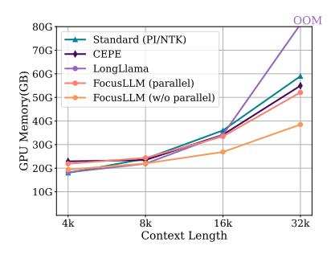
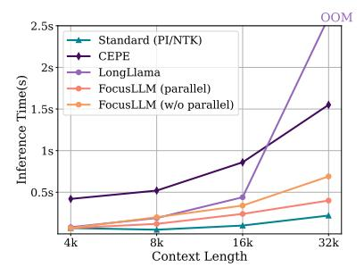
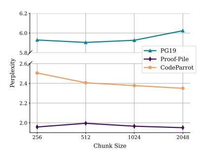

# 5.2 Scaling to 400K Context

We contend that FocusLLM is capable of processing extremely long sequences. To validate this, we first conduct experiments on the passkey retrieval task [\(Mohtashami and Jaggi,](#page-8-7) [2024\)](#page-8-7). The results, as illustrated in Figure [1,](#page-0-0) demonstrate that FocusLLM maintains nearly 100% effectiveness at lengths of up to 400K[3](#page-5-1) , outperforming all other models. We also extended the language modeling experiments introduced in Section [4.1](#page-3-1) to 400K, a length at which most models fail to manage effectively. The result is presented in the Appendix [G.](#page-10-2)

3Constrained by hardware, the maximum length we are able to test is 400k tokens.

> **[图片提取文字 (无描述)]:**
> OOM 80G Standard (PI/NTK) 70G CEPE LongLlama GPU Memory(GB) 200 300 200 60G FocusLLM (parallel) FocusLLM (w/o parallel) 20G 10G 4k 8k 16k 32k Context Length

> **[图片提取文字 (无描述)]:**
> 2.5sStandard (PI/NTK) CEPE 2sLongLlama Inference Time(s) FocusLLM (parallel) FocusLLM (w/o parallel) 1.5s 1s 0.5s8k 16k 32k 4kContext Length

> **[图片提取文字 (无描述)]:**
> 6.2 6.0 - PG19 5.8 Proof-Pile Perplexity 2.64 CodeParrot 2.4 2.2 2.0 256 512 1024 2048 Chunk Size

efficient growth pattern in memory usage compared to previous methods.

Figure 3: FocusLLM exhibits a more Figure 4: Comparison of inference time. The time taken by FocusLLM is superior to previous methods.

Figure 5: Perplexity under different chunk size with the total sequence length fixed as 8K on three datasets.

|              |          |       | na-7B-ch | at (4K) |          |
|--------------|----------|-------|----------|---------|----------|
|              | Original | CEPE  | L_L      | A_B     | FocusLLM |
| NarrativeQA  | 18.70    | 22.14 | -        | -       | 20.38    |
| Qasper       | 19.20    | 26.34 | -        | -       | 21.73    |
| MultiFieldQA | 36.80    | 31.56 | -        | -       | 36.91    |
| -Average     | 24.90    | 26.68 | 30.12    | 27.14   | 26.34    |
| HotpotQA     | 25.40    | 34.95 | -        | -       | 38.95    |
| 2WikiMQA     | 32.80    | 32.39 | -        | -       | 32.95    |
| Musique      | 9.40     | 9.76  | -        | -       | 15.39    |
| -Average     | 22.60    | 25.70 | 16.37    | 28.28   | 29.10    |
| GovReport    | 27.30    | 13.90 | -        | -       | 25.54    |
| QMSum        | 20.80    | 20.30 | -        | -       | 21.86    |
| MultiNews    | 25.80    | 3.10  | -        | -       | 26.35    |
| -Average     | 24.70    | 12.43 | 24.19    | 25.15   | 24.55    |
| TREC         | 61.50    | 68.50 |          | -       | 68.00    |
| TriviaQA     | 77.80    | 87.90 | -        | -       | 85.08    |
| SAMSum       | 40.70    | 32.38 | -        | -       | 41.63    |
| -Average     | 60.00    | 62.92 | 60.31    | 60.72   | 64.81    |
| LCC          | 52.40    | 66.21 | -        | -       | 58.42    |
| RepoBench-P  | 43.80    | 58.94 | -        | -       | 54.27    |
| -Average     | 48.10    | 62.57 | 66.05    | 57.83   | 56.35    |
| Average      | 35.20    | 36.31 | 37.50    | 38.54   | 39.01    |

Table 3: The results of LLaMA2-based models on tasks of LongBench. L\_L represents Long Llama and A\_B represents Activation Beacon. FocusLLM outperforms memory-based and compression-based methods, and maintains attention to all tokens of context.

