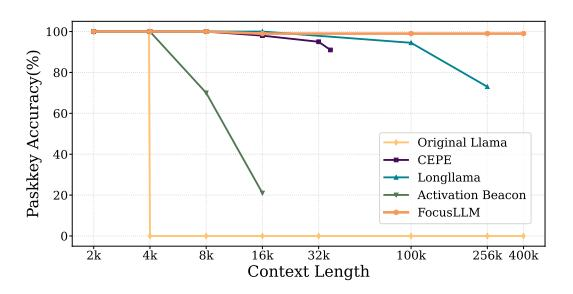

# FocusLLM: Precise Understanding of Long Context by Dynamic Condensing

Zhenyu Li, Yike Zhang, Tengyu Pan, Yutao Sun, Zhichao Duan, Junjie Fang, Rong Han, Zixuan Wang, Jianyong Wang\*

Tsinghua University

#### Abstract

Empowering LLMs with the ability to precisely understand long contexts is crucial for many downstream applications. However, handling long contexts with conventional transformer architecture requires substantial training and inference resources. Existing context condensing methods cannot accurately understand the full context, as there is a considerable amount of information loss in the condensing process. To address these issues, we present FocusLLM, a framework designed to extend the fixed context length of any decoder-only LLM, allowing the model to focus on relevant information from very long sequences. Focus-LLM first divides long text input into chunks based on the model's original context length. It then employs the dynamic condensing process to distill crucial information from each chunk. Ultimately, through the novel parallel decoding mechanism, FocusLLM can integrate the extracted information into its local context. FocusLLM stands out for great training efficiency and versatility: trained with an 8K input length and with much less training cost than previous methods, FocusLLM exhibits superior performance across downstream tasks and maintains strong language modeling ability when handling extensive long texts, even up to 400K tokens. Our code is available at https://github.com/leezythu/focusllm.

#### 1 Introduction

The importance of extending the context length of large language models (LLMs) cannot be over-stated. In numerous applications, ranging from complex document analysis to generating coherent long-form text, the ability to effectively utilize extended context is critical. For instance, in tasks such as document summarization and question answering over lengthy articles, a more extensive context allows for a more comprehensive

> **[图片提取文字 (无描述)]:**
> 100 Paskkey Accuracy(%) 80-60-Original Llama 40-CEPE Longllama 20-Activation Beacon FocusLLM 0 256k 400k 2k 4k 8k 16k 32k 100k Context Length

Figure 1: A comparison between FocusLLM and previous context scaling methods on the passkey retrieval task, including CEPE, LongLLaMA and Activation Beacon. Our method extrapolates beyond the original context length of LLaMA, achieving 99% accuracy at a context length of 400K, with less training cost.

understanding and accurate responses. However, leveraging long contexts in LLMs presents several formidable challenges. (1) The computational complexity of transformers (Vaswani et al., 2017) grows quadratically with the sequence length, rendering the training process prohibitively expensive. (2) LLMs exhibit poor extrapolation performance for longer sequences, even after additional fine-tuning (Chen et al., 2023a; Peng et al., 2023). (3) Acquiring high-quality long-text datasets, which are essential for training and fine-tuning, is exceedingly difficult (Xiong et al., 2023; Wang et al., 2022).

To circumvent the substantial costs of directly scaling the window length by continual training on longer inputs, recent work has proposed to drop unimportant tokens and retain important tokens, either by modifying the attention mechanism (Xiao et al., 2023; Han et al., 2023) or by compressing the context into some specialized tokens (Zhang et al., 2024a; Chevalier et al., 2023; Ge et al., 2023), in order to effectively condense long textual information. However, these methods overlook the fact that token importance changes dynamically during the decoding process: tokens previously considered unimportant may become crucial in later decoding steps. As a result, they share a common drawback,

\*Corresponding author

which we refer to as *information loss*: some tokens that will be needed in the future have already been discarded. For example, in Passkey Retrieval task [\(Mohtashami and Jaggi,](#page-8-7) [2024\)](#page-8-7) illustrated in Figure [1,](#page-0-0) as the context length increases, the compression method Activation Beacon fails to retrieve passkey pairs that appeared in the earlier context.

Considering the above issues, the question arises: *can we extend the context length of an existing LLM at a low cost without any information loss?* In this paper, we propose a training efficient and effective solution *FocusLLM*, which can maintain a precise understanding of the whole long context. Specifically, FocusLLM first divides a long text into chunks based on the model's original context length. Then, the *dynamic condensing* process is applied, which appends dynamic prompts to each chunk to extract crucial information, ensuring no information loss. Finally, we use *parallel decoding* mechanism to aggregate information from different chunks and generate the next token. The original model parameters are kept frozen to maintain generalization capabilities, with only a small number of trainable parameters introduced for dynamic condensing.

We employ the FocusLLM framework to the widely used LLaMA-2-7B model [\(Touvron et al.,](#page-8-8) [2023b\)](#page-8-8), which has a default context length of 4K. In terms of efficiency, FocusLLM is trained on sequences shorter than 8K tokens and only requires a training budget of *0.5B tokens*. To validate the effectiveness of FocusLLM, we evaluate it across a variety of tasks. Initially, we assessed FocusLLM's language modeling capability. Focus-LLM maintains low perplexity on documents comprising 128K tokens and even longer sequences. Subsequently, to comprehensively evaluate the applicability of FocusLLM in real-world scenarios, we utilized two widely used benchmarks: Longbench [\(Bai et al.,](#page-8-9) [2023\)](#page-8-9) and ∞-Bench [\(Zhang et al.,](#page-9-3) [2024b\)](#page-9-3). Experimental results demonstrate that FocusLLM has achieved superior performance on both benchmarks, surpassing all baselines including length extrapolation models, continual training models, and similar models designed for extreme long sequences. The main contributions of this paper can be summarized as follows:

• We propose the FocusLLM framework, which leverages novel *dynamic condensing* and *parallel decoding* mechanisms to avoid information loss and achieve precise understanding of

long contexts, as shown in Figure [1.](#page-0-0)

- Compared to previous context-scaling methods, FocusLLM achieves remarkable results with *high training efficiency* by introducing only a small set of trainable parameters and utilizing a training budget of 0.5B tokens.
- Through comprehensive evaluation, Focus-LLM outperforms all baselines on downstream tasks while maintaining low perplexity, demonstrating that it can seamlessly serve as a general-purpose language model.

