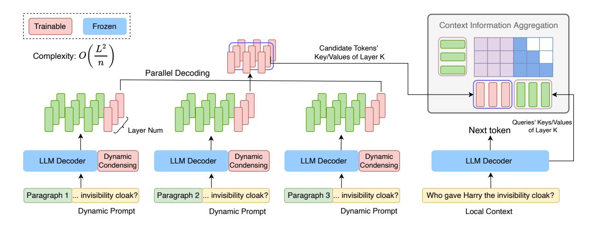

# 2 Architecture

The overall framework of FocusLLM is presented in Figure [2.](#page-2-0) Each decoder in the figure shares the same model (e.g. LLaMA-2).

#### 2.1 Notations

Given a long sequence with S tokens {x1, ..., xS}, we segment them into memory tokens {x1, ..., xm} and local context {xm+1, ..., xS}, with the length of local context not exceeding the model's default context length, denoted as L. Concurrently, we divide the memory tokens into chunks, labeled as C1, C2, ..., Ck, with each chunk's size also not exceeding L. These chunks can represent distinct documents or a single long document. We define the original decoder model as Fdec and its hidden dimension ddec. To endow the model with the capability for dynamic condensing, we introduce a small set of new parameters, resulting in the modified model F ′ dec.

#### 2.2 Dynamic Condensing

As highlighted in the introduction, the importance of tokens in the context dynamically changes at each decoding step. Previous work that condenses context using a fixed pattern suffers from the drawback of *information loss*. To address this issue, we propose the dynamic condensing mechanism, which consists of two key steps: dynamic prompt injection and candidate token generation.

Dynamic Prompt Injection. We append a small fragment of local context (we refer to it as the *dynamic prompt* in Figure [2\)](#page-2-0) behind each chunk. The motivation is to aggregate the most critical information from each chunk for the current decoding step. We can formally define this process as follows:

$$\hat{C}_i \leftarrow \{C_i; x_{m+j}, ..., x_S\} \ i = 1, ..., k; 1 \le j \le S - m \ (1)$$

> **[图片提取文字 (无描述)]:**
> Context Information Aggregation Trainable Frozen Candidate Tokens' Complexity: O Key/Values of Layer K Parallel Decoding Queries' Keys/Values Layer Num Next token of Layer K Dynamic Dynamic Dynamic **LLM Decoder** LLM Decoder LLM Decoder LLM Decoder Condensing Condensing Condensing ... invisibility cloak? Paragraph 2 ... invisibility cloak? Paragraph 3 Paragraph 1 . invisibility cloak? Who gave Harry the invisibility cloak? Dynamic Prompt Dynamic Prompt Dynamic Prompt Local Context

Figure 2: One decoding step of the FocusLLM framework. A small fragment of the local context (denoted as the dynamic prompt) is appended to each chunk. The representations of the candidate tokens, obtained through dynamic condensing and parallel decoding, are then concatenated and integrated back into the local context.

Here j is a hyperparameter that determines the number of local tokens appended to each chunk. We adopt a default length of 512 tokens for inference, which is sufficient to encapsulate the necessary local contextual information.

The last token of the dynamic prompt is used to generate candidate tokens, which we will explain in detail later. After each decoding step, when FocusLLM generates the next token, this token will be appended to the dynamic prompt 1. This updated dynamic prompt is then used to generate new candidate tokens in the next decoding step.

The dynamic prompt evolves with each decoding step, ensuring that the model always has access to the most relevant information for the current step. Candidate Token Generation. Building on the dynamic prompt injection described above, we introduce candidate tokens to condense the information from each chunk that is crucial for the current decoding step. The *candidate token* is denoted as the trainable hidden states corresponding to the last local token  $x_S$  in each chunk  $\hat{C}_i$ . To obtain the representations of candidate tokens, motivated by (Zhang et al., 2024a), we add a new set of trainable parameters to the linear projection matrices of each layer, while keeping the original model parameters frozen to preserve its original decoding ability. Formally, the trainable parameters for dynamic condensing are:

$$\{W_{O}^{c}, W_{K}^{c}, W_{V}^{c}, W_{O}^{c}\}_{l}$$
 (2)

where  $W_Q^c$ ,  $W_K^c$ ,  $W_V^c$ , and  $W_O^c$  represent the new linear projections for the query, key, value, and

output matrices associated with the candidate token, and l denotes the layer number. The output of the candidate token in the self-attention module can be calculated as:

$$Q_c \leftarrow H_c W_Q^c \quad K_c \leftarrow H_c W_K^c \quad V_c \leftarrow H_c W_V^c$$
 (3)

$$A_c \leftarrow \operatorname{softmax} \left( Q_c \left( K \oplus K_c \right)^T \right)$$
 (4)

$$O_c \leftarrow V_c W_O^{cT} \quad V_c \leftarrow A_c \left( V \oplus V_c \right)^T$$
 (5)

where  $H_c \in \mathbb{R}^{d_{dec}}$  is the input hidden state of the candidate token,  $\oplus$  represents the concatenation of matrices, and K,V correspond to the representations of the normal tokens in one chunk.

#### 2.3 Parallel Decoding

Through the dynamic condensing process described above, we obtain one candidate token for each chunk. Notably, the process of obtaining the candidate token from each chunk is independent, enabling *parallel forwarding* for all chunks. Then the key/value representations of the candidate tokens are concatenated with the tokens in the local context layer by layer, as shown in Figure 2, and are finally processed by a frozen decoder to generate the next token.

We formally define the process of simultaneously generating candidate tokens from different chunks and then aggregating these candidate tokens to produce the final token as *parallel decoding*. This mechanism not only enables precise understanding of long contexts but also reduces the Transformer's original  $O(L^2)$  computational complexity to  $O((L/n)^2)$ . A detailed efficiency analysis is provided in Appendix A.

&lt;sup>1The first token of the dynamic prompt can be dropped to maintain its fixed length.

#### 3 Training

Regarding training data, to ensure the generalizability of our method and maintain fairness in comparison with the baselines, we leverage RedPajama (Together, 2023b) as the training corpus and sample examples with sequence lengths varying between 3K and 8K tokens from it. RedPajama is an opensource pre-training dataset for LLaMA-1 (Touvron et al., 2023a), which is widely utilized in previous work (Zhang et al., 2024a; Yen et al., 2024). Detailed statistics are reported in Appendix B.

**Auto-Regressive Loss.** Specifically, we train the model to predict the next token, and the loss is only applied to tokens in the local context, which encourages the candidate token to aggregate useful information from each chunk.

$$\min_{F'_{\text{dec}}} - \sum_{i=2}^{S-m} \log(p(x_{m+i} \mid c_1, \dots, c_k, x_{m+1}, \dots, x_{m+i-1}))$$
(6)

Here,  $c_i$  represents the candidate token generated by the i-th chunk. Specifically, based on the relationship between the *memory tokens*  $\{x_1,...,x_m\}$  and the *local context*  $\{x_{m+1},...,x_S\}$ , we design two loss functions for joint training. i) If the local context is a continuation of the memory tokens, we term this loss the *Continuation Loss*, as it trains the model to naturally generate new tokens that follow the given context. ii) Alternatively, if we randomly select L consecutive memory tokens as local context, we define this loss as the *Reconstruction Loss*, as it trains the model to reconstruct tokens when clear contextual information is available. Subsequent experiments demonstrate that both types of loss are essential.

#### 4 Experiments

In this section, we will conduct a comprehensive evaluation of the effectiveness of FocusLLM, spanning both language modeling and a variety of downstream tasks. We refer readers to Appendix C for detailed experimental settings including hyperparameters due to space constraints.

#### 4.1 Long-context Language Modeling

In this section, we evaluate FocusLLM on long-context language modeling benchmarks, with text lengths ranging from 4K to 128K tokens.

**Datasets.** We perform the evaluation on three datasets: PG19 (Rae et al., 2019), Proof-Pile (Azerbayev et al., 2023), and CodeParrot (Tunstall et al., 2022). These three datasets encompass 100 long

test cases related to books, arXiv papers, and code repositories, respectively. The results of baseline models are token from (Zhang et al., 2024a) for comparison. Following the setting of (Yen et al., 2024), as FocusLLM relies on the last decoder to perform generation, we calculate the perplexity on the last 256 tokens of each sequence, and for the 128K length, we filter out documents exceeding 128K tokens and evaluate 10 samples due to data scarcity and computational cost.

Model. FocusLLM is based on LLaMA-2-7B (chat), hence the models for comparison are all on the same scale, 7B. The baseline models can be categorized into the following types: i) Methods focusing on the modification of positional encoding, including Positional Interpolation (Chen et al., 2023a), the NTK-Aware Scale ROPE2, and the training-free method StreamingLLM (Xiao et al., 2023), which is based on attention sinks. ii) Fine-tuned methods trained on long inputs, such as LongAlpaca-16K (Chen et al., 2023b), LongChat-32K (Li et al., 2023), and YaRN-128K (Peng et al., 2023). iii) Methods with designed structures specifically for long contexts, including AutoCompressor-6K (Chevalier et al., 2023), LongLlama (Tworkowski et al., 2024) and Activation Beacon (Zhang et al., 2024a). For instance, Activation Beacon achieves compression of long texts by training the model to represent the information of a regular text segment with a small number of beacon tokens.

**Analysis.** The results are presented in Table 1. Here are several observations we can make: (1) Compared to the basic LLaMA-2-7B model and some fine-tuning free methods, our model demonstrates superior performance. When extending the context length from 4K to longer, the perplexity becomes lower, indicating that information from a longer context can be effectively utilized. (2) FocusLLM achieves comparable performance to fine-tuned full-attention methods. This result is notable because our model operates with significantly higher training efficiency. For instance, LongLlama is fine-tuned using 7B tokens with all parameters being trainable. In contrast, FocusLLM uses 1/10 of the training budget and 1/3 of the parameters. (3) FocusLLM can maintain language modeling capabilities at lengths much longer than other models while retaining precise comprehension of the

&lt;sup>2https://www.reddit.com/r/LocalLLaMA/comments/14lz7j5/ntkaware\_scaled\_rope\_allows\_llama\_models\_to\_have/

|                   |      |      | PG19 |       |      |      | Proof-Pile |      |      |      | CodeParrot |      |
|-------------------|------|------|------|-------|------|------|------------|------|------|------|------------|------|
| Method            | 4K   | 16K  | 32K  | 100K  | 4K   | 16K  | 32K        | 100K | 4K   | 16K  | 32K        | 100K |
| Llama-2-7B        | 9.21 | >103 | >103 | OOM   | 3.47 | >103 | >103       | OOM  | 2.55 | >103 | >103       | OOM  |
| PI                | 9.21 | 19.5 | >102 | OOM   | 3.47 | 5.94 | 33.7       | OOM  | 2.55 | 4.57 | 29.33      | OOM  |
| NTK               | 9.21 | 11.5 | 37.8 | OOM   | 3.47 | 3.65 | 7.67       | OOM  | 2.55 | 2.86 | 7.68       | OOM  |
| StreamingLLM      | 9.21 | 9.25 | 9.24 | 9.32  | 3.47 | 3.51 | 3.50       | 3.55 | 2.55 | 2.60 | 2.54       | 2.56 |
| AutoCompre6K      | 11.8 | >102 | >103 | OOM   | 4.55 | >102 | >103       | OOM  | 5.43 | >102 | >103       | OOM  |
| YaRN-128K         | 6.68 | 6.44 | 6.38 | OOM   | 2.70 | 2.47 | 2.41       | OOM  | 2.17 | 2.04 | 2.00       | OOM  |
| LongChat-32K      | 9.47 | 8.85 | 8.81 | OOM   | 3.07 | 2.70 | 2.65       | OOM  | 2.36 | 2.16 | 2.13       | OOM  |
| LongAlpaca-16K    | 9.96 | 9.83 | >102 | OOM   | 3.82 | 3.37 | >103       | OOM  | 2.81 | 2.54 | >103       | OOM  |
| LongLlama         | 9.06 | 8.83 | OOM  | OOM   | 2.61 | 2.41 | OOM        | OOM  | 1.95 | 1.90 | OOM        | OOM  |
| Activation Beacon | 9.21 | 8.54 | 8.56 | 8.68  | 3.47 | 3.42 | 3.39       | 3.35 | 2.55 | 2.54 | 2.53       | 2.55 |
| FocusLLM          | 9.21 | 9.19 | 9.17 | 10.59 | 3.47 | 3.17 | 3.43       | 2.57 | 2.55 | 2.01 | 2.27       | 3.02 |

Table 1: Language Modeling Assessment: perplexity analysis of various context scaling methods on the PG19, Proof-Pile, and CodeParrot. FocusLLM successfully maintains low perplexity on extremely long sequences.

entire text. Although models like StreamingLLM and Activation Beacon can still achieve lower perplexity by compressing tokens, they are unable to recover the previous context information, which severely affects their capabilities in downstream tasks. In summary, FocusLLM achieves comparable language modeling performance with a small training cost.

## 4.2 Downstream Tasks

Datasets. To assess the capabilities of FocusLLM in real-world scenarios, we select two widely used datasets: Longbench [\(Bai et al.,](#page-8-9) [2023\)](#page-8-9) and ∞- Bench [\(Zhang et al.,](#page-9-3) [2024b\)](#page-9-3). Longbench offers an evaluation on a variety of tasks including question answering, summarization, few-shot learning, mathematical counting, and code completion. ∞- Bench is designed to test a model's ability to understand and reason over super long contexts, with an average length of 145.1K tokens. Thus, the tasks in ∞-Bench are well-suited to test whether the model has a precise understanding of long contexts without *information loss*. For more detailed statistics, please refer to Appendix [D.](#page-9-8) We believe that these two benchmarks can comprehensively reflect the capabilities of the model on downstream tasks.

Models. We select representative models from the three types of baselines mentioned in Section [4.1](#page-3-1) for comparison. Additionally, we focus on comparing FocusLLM with recently proposed models capable of processing extremely long streaming inputs. Specifically, StreamingLLM utilizes a sliding window mechanism; InfLLM [\(Xiao et al.,](#page-9-9) [2024\)](#page-9-9) stores processed context into memory units and retrieves it using attention scores; Activation Beacon compresses the preceding text to maintain a

smaller context length. CEPE [\(Yen et al.,](#page-9-5) [2024\)](#page-9-5) adopts a small encoder to process long inputs chunk by chunk and feeds the memory to a decoder by cross-attention.

Main Results. The experimental results are displayed in Table [2](#page-5-0) and [3.](#page-6-0) We reference some baseline results from [\(Xiao et al.,](#page-9-9) [2024\)](#page-9-9), which are based on the Vicuna-7B-v1.5 model. Vicuna-7Bv1.5 is based on LLaMA-2-7B but fine-tuned on conversational data. For a fair comparison, we also train a Vicuna version of FocusLLM. For YaRN-128K, we select the version based on Mistral-7Binst-v0.2, which is stronger than Vicuna. For LongLlama, as they do not have a version based on the Llama2, we directly utilize the officially released model. CEPE and LongLLaMA will experience *OOM* on ∞-Bench due to their substantial memory usage, so we only report their results on LongBench. Since not all models are inherently capable of processing infinite text lengths, we also elaborate the effective lengths for each method presented in Tables [2](#page-5-0) and [3](#page-6-0) in Appendix [E.](#page-10-0)

From the experimental results, we can make the following comparisons between FocusLLM and previous methods: (1) FocusLLM outperforms all baseline models, achieving *the best results* on both the relatively shorter benchmark Longbench and the extremely long benchmark ∞-Bench. This demonstrates FocusLLM's capability for effective understanding and reasoning on long sequences and its broad applicability. (2) Different types of baseline models exhibit various shortcomings. For training-free models like PI and NTK, extending the length to 128K comes with a significant sacrifice in performance. Due to the lack of precise understanding of the full context, models that

|           |                  |          |       |         |           | Vicuna-7B-v1.5 (4K) |       |        |        |          |
|-----------|------------------|----------|-------|---------|-----------|---------------------|-------|--------|--------|----------|
|           |                  | Original | LChat | Vic-16K | Yarn-128K | PI                  | NTK   | Stream | InfLLM | FocusLLM |
|           | Math.Find        | 11.71    | 9.43  | 13.43   | 17.14     | OOM                 | OOM   | 6.00   | 11.14  | 11.71    |
|           | En.MC            | 30.13    | 24.45 | 34.06   | 27.95     | OOM                 | OOM   | 32.31  | 31.44  | 32.31    |
|           | Code.Debug       | 38.83    | 27.66 | 35.03   | 22.59     | OOM                 | OOM   | 46.19  | 34.26  | 28.43    |
| ∞-Bench   | Retrieve.KV      | 1.40     | 1.40  | 1.00    | 0.00      | OOM                 | OOM   | 0.00   | 0.60   | 12.40    |
|           | Retrieve.Number  | 4.41     | 23.90 | 10.34   | 56.61     | OOM                 | OOM   | 4.41   | 81.69  | 83.56    |
|           | Retrieve.PassKey | 5.08     | 28.64 | 15.25   | 92.71     | OOM                 | OOM   | 4.92   | 99.15  | 95.76    |
|           | Average          | 15.26    | 19.25 | 18.19   | 36.17     | –                   | –     | 15.64  | 43.05  | 44.03    |
|           | NarrativeQA      | 11.19    | 20.35 | 17.85   | 19.67     | 0.78                | 5.66  | 15.61  | 15.53  | 21.14    |
|           | Qasper           | 13.79    | 29.35 | 25.85   | 11.10     | 2.71                | 21.17 | 23.84  | 23.57  | 31.07    |
|           | MultiFieldQA     | 22.08    | 42.55 | 37.15   | 35.06     | 1.01                | 36.76 | 32.80  | 37.14  | 36.73    |
|           | HotpotQA         | 12.71    | 33.19 | 24.72   | 11.94     | 1.35                | 19.54 | 22.17  | 22.53  | 40.65    |
|           | 2WikiMQA         | 13.99    | 24.33 | 21.41   | 12.02     | 1.17                | 14.51 | 18.38  | 18.82  | 20.30    |
|           | Musique          | 4.81     | 14.71 | 8.44    | 7.52      | 0.71                | 4.30  | 6.30   | 5.24   | 14.20    |
|           | GovReport        | 27.67    | 30.83 | 27.62   | 29.46     | 1.9                 | 25.26 | 23.18  | 26.79  | 26.66    |
|           | QMSum            | 19.72    | 22.93 | 22.63   | 21.53     | 1.29                | 19.48 | 20.09  | 20.91  | 20.50    |
| LongBench | MultiNews        | 26.61    | 26.63 | 27.88   | 16.04     | 1.16                | 25.88 | 26.19  | 26.43  | 27.45    |
|           | TREC             | 69.00    | 66.50 | 69.00   | 68.50     | 4.50                | 59.00 | 61.00  | 67.50  | 68.00    |
|           | TriviaQA         | 81.94    | 83.99 | 85.63   | 88.21     | 0.90                | 25.85 | 78.81  | 84.36  | 81.63    |
|           | SAMSum           | 35.12    | 12.83 | 9.15    | 26.52     | 0.12                | 5.05  | 32.46  | 31.89  | 35.36    |
|           | PassageRetrieval | 9.00     | 30.50 | 4.00    | 16.25     | 0.62                | 5.00  | 6.00   | 9.00   | 15.67    |
|           | LCC              | 64.53    | 54.79 | 50.64   | 66.39     | 21.54               | 53.65 | 63.70  | 61.41  | 62.79    |
|           | RepoBench-P      | 50.17    | 58.99 | 44.94   | 55.82     | 19.36               | 44.58 | 48.26  | 47.52  | 53.72    |
|           | Average          | 30.82    | 34.70 | 31.79   | 32.40     | 3.94                | 24.38 | 31.92  | 33.24  | 36.17    |

Table 2: The results on ∞-Bench and LongBench. The models on the right part can process extremely long inputs. On both benchmarks, FocusLLM achieves significant improvements compared to strong baselines.

employ sliding window or condensing techniques, such as StreamingLLM and Activation Beacon perform poorly on ∞-Bench (see also Appendix [F\)](#page-10-1), with performance nearly approaching zero on some tasks. This indicates that *they suffer from severe information loss*. As for fine-tuned models like LongChat and CEPE, their limitation is the restricted supported length. For example, CEPE struggles to handle lengths beyond 128K effectively [\(Yen et al.,](#page-9-5) [2024\)](#page-9-5). (3) The approaches of length extrapolation and continual training on long inputs, while capable of scaling context, introduce substantial computational and memory costs. In contrast, FocusLLM processes the text in chunks and utilizes parallel decoding, which significantly conserves both the memory and time for inference.

