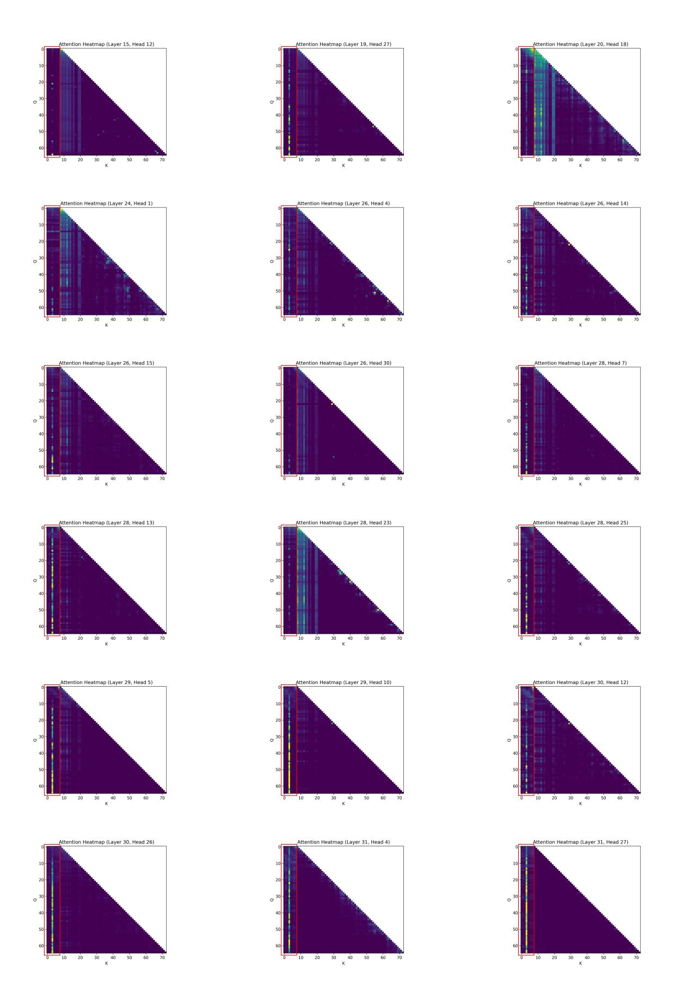
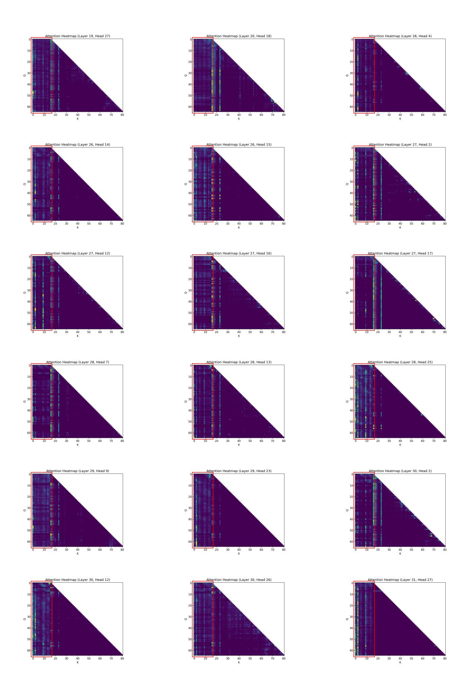

# H Visualization of Attention Heatmap

We visualized the information carried by candidate tokens when their Key/Value representations are concatenated with the tokens in the local context, and select a few representative heads in Figure [7](#page-12-0) and Figure [8.](#page-13-0) We found that different patterns emerge in Passkey Retrieval and NarrativeQA tasks. The y-axis corresponds to the query representations of tokens in the local context, and the x-axis corresponds to the key representations of candidate tokens combined with the local context tokens. Therefore, the first few columns of the heatmap represent the contribution of candidate tokens to the local context. We made the following interesting observations: i) Not all heads in all layers attend to candidate tokens, and higher layers attend to candidate tokens more frequently than lower layers. This is likely because higher layers are more critical for the final representation. ii) In Passkey Retrieval task, only one chunk contains passkey information, while the others are noises. As a result, we observe that a single candidate token receives high attention (a single column is highlighted), while other candidate tokens are ignored. iii) In NarrativeQA task, the final answer may rely on information from multiple chunks, so we see that many candidate tokens are assigned higher attention weights. In summary, the result indicates that FocusLLM effectively ignores noise and aggregates information from multiple chunks.

> **[图片提取文字 (无描述)]:**
> Attention Heatmap (Layer 15, Head 12) Attention Heatmap (Layer 19, Head 27) Attention Heatmap (Layer 20, Head 18) 20 20 20 Attention Heatmap (Layer 26, Head 14) Attention Heatmap (Layer 24, Head 1) Attention Heatmap (Layer 26, Head 4) 40 50 60 70 K 10 20 30 40 50 60 K 40 50 60 10 20 30 10 20 30 Attention Heatmap (Layer 26, Head 15) Attention Heatmap (Layer 26, Head 30) Attention Heatmap (Layer 28, Head 7) 10 20 30 40 50 60 70 K 10 20 30 40 50 60 70 K 10 20 30 40 50 60 K Attention Heatmap (Layer 28, Head 13) Attention Heatmap (Layer 28, Head 23) Attention Heatmap (Layer 28, Head 25) Attention Heatmap (Layer 30, Head 12) Attention Heatmap (Layer 29, Head 5) Attention Heatmap (Layer 29, Head 10) 20 30 30 Attention Heatmap (Layer 30, Head 26) Attention Heatmap (Layer 31, Head 4) Attention Heatmap (Layer 31, Head 27) 40 K 10 20 10 20 50 60 10 20 30 30

Figure 7: Attention Heamap of Passkey Retrieval task. The first 8 columns, marked by red rectangule lines, represent the attention weights corresponding to 8 candidate tokens. Since only one chunk contains the important passkey information while the others are merely noises, we observe that only a single candidate token receives high attention score (with a single column highlighted). This suggests that FocusLLM can effectively extract important information while discarding irrelevant texts.

13

> **[图片提取文字 (无描述)]:**
> Attention Heatmap (Layer 19, Head 27) Attention Heatmap (Layer 20, Head 18) Attention Heatmap (Layer 26, Head 4) 20 30 Attention Heatmap (Layer 26, Head 14) Attention Heatmap (Layer 27, Head 2) Attention Heatmap (Layer 26, Head 15) K K K 50 60 70 80 50 60 70 80 10 20 30 50 60 70 20 30 20 30 Attention Heatmap (Layer 27, Head 16) Attention Heatmap (Layer 27, Head 17) Attention Heatmap (Layer 27, Head 12) K K K 60 70 20 30 Attention Heatmap (Layer 28, Head 7) Attention Heatmap (Layer 28, Head 13) Attention Heatmap (Layer 28, Head 25) 10 20 30 20 30 40 50 10 20 30 Attention Heatmap (Layer 29, Head 9) Attention Heatmap (Layer 29, Head 23) Attention Heatmap (Layer 30, Head 2) Attention Heatmap (Layer 30, Head 12) Attention Heatmap (Layer 30, Head 26) Attention Heatmap (Layer 31, Head 27)

Figure 8: Attention heamap of NarrativeQA in LongBench. The first 15 columns, marked by red rectangle lines, represent the attention weights corresponding to 15 candidate tokens. Since the final answer may rely on information from multiple chunks, we observe that many candidate tokens are assigned high attention weights. This suggests that FocusLLM effectively aggregates information from multiple chunks.