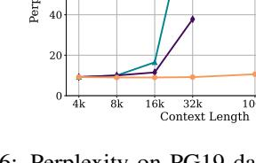

# D Details of Benchmarks

## D.1 LongBench

LongBench[\(Bai et al.,](#page-8-9) [2023\)](#page-8-9) includes 14 English tasks, 5 Chinese tasks, and 2 code tasks, with the average length of most tasks ranging from 5K to 15K. In experiments, we only utilize the English tasks. Detailed statistics of the tasks used in our paper are shown in Table [6.](#page-10-3)

#### D.2 ∞-Bench

The benchmark [\(Zhang et al.,](#page-9-3) [2024b\)](#page-9-3) comprises 12 unique tasks, each crafted to assess different aspects of language processing and comprehension in extended contexts. Detailed statistics of the tasks used in our paper are shown in Table [7.](#page-10-4)

| Task                | Task Type     | Eval metric | Avg len | Language       | Sample |
|---------------------|---------------|-------------|---------|----------------|--------|
| HotpotQA            | Multi-doc QA  | F1          | 9,151   | EN             | 200    |
| 2WikiMultihopQA     | Multi-doc QA  | F1          | 4,887   | EN             | 200    |
| MuSiQue             | Multi-doc QA  | F1          | 11,214  | EN             | 200    |
| MultiFieldQA-en     | Single-doc QA | F1          | 4,559   | EN             | 150    |
| NarrativeQA         | Single-doc QA | F1          | 18,409  | EN             | 200    |
| Qasper              | Single-doc QA | F1          | 3,619   | EN             | 200    |
| GovReport           | Summarization | Rouge-L     | 8,734   | EN             | 200    |
| QMSum               | Summarization | Rouge-L     | 10,614  | EN             | 200    |
| MultiNews           | Summarization | Rouge-L     | 2,113   | EN             | 200    |
| TriviaQA            | Few shot      | F1          | 8,209   | EN             | 200    |
| SAMSum              | Few shot      | Rouge-L     | 6,258   | EN             | 200    |
| TREC                | Few shot      | Accuracy    | 5,177   | EN             | 200    |
| PassageRetrieval-en | Synthetic     | Accuracy    | 9,289   | EN             | 200    |
| LCC                 | Code          | Edit Sim    | 1,235   | Python/C#/Java | 500    |
| RepoBench-P         | Code          | Edit Sim    | 4,206   | Python/Java    | 500    |

Table 6: Detailed statistics of the tasks used in our paper of LongBench.

| Task Name        | Context       | Examples | Avg Input Tokens | Avg Output Tokens |
|------------------|---------------|----------|------------------|-------------------|
| En.MC            | Fake Book     | 229      | 184.4k           | 5.3               |
| Code.Debug       | Code Document | 394      | 114.7k           | 4.8               |
| Code.Run         | Synthetic     | 400      | 75.2k            | 1.3               |
| Math.Find        | Synthetic     | 350      | 87.9k            | 1.3               |
| Retrieve.PassKey | Synthetic     | 590      | 122.4k           | 2.0               |
| Retrieve.Number  | Synthetic     | 590      | 122.4k           | 4.0               |
| Retrieve.KV[2]   | Synthetic     | 500      | 89.9k            | 22.7              |

Table 7: Detailed statistics of the tasks used in our paper of  $\infty$ -Bench.

|               | Activation Beacon |
|---------------|-------------------|
| Code Debug    | 21.32             |
| Math Find     | 11.71             |
| Math Calc     | 0.00              |
| Passkey       | 1.69              |
| Number String | 1.69              |
| KV Retrieval  | 0.00              |

Table 8: The accuracy of Activation Beacon on  $\infty$ -Bench.

> **[图片提取文字 (无描述)]:**
> Per 40 20 8k 16k 32k Context Length

Figure 6: Perplexity on PG19 dataset of FocusLLM compared to methods PI and NTK. FocusLLM can maintain low perplexity even at token counts up to 400K tokens.

FocusLLM

