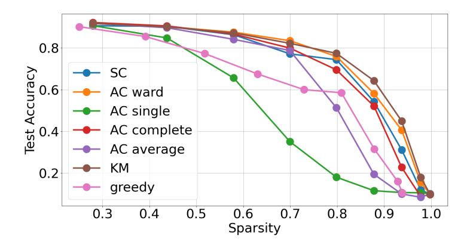
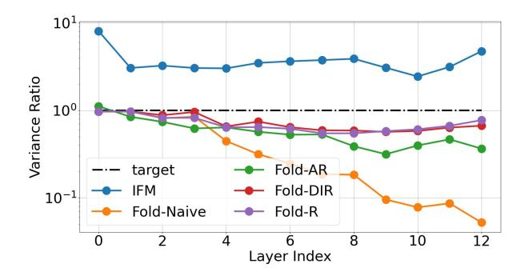
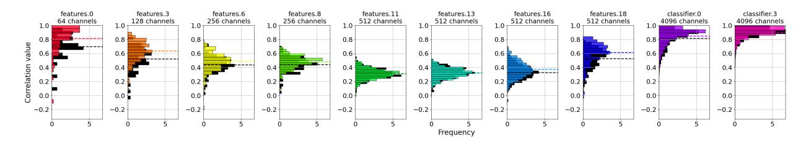

# 3 Model Folding

In this section, we introduce model folding, a novel compression technique that reduces the computational complexity and size of neural networks by merging similar neurons in each layer without requiring training data. As illustrated in Fig. [1](#page-1-0) (left), model folding processes the network layer by layer, involving filter clustering, merging, and correcting data statistics. Below, we present a theoretical analysis of our approach, supported by empirical results on ResNet18 using CIFAR10.

#### 3.1 Channel clustering

Channel similarity. Neural networks trained with stochastic gradient descent (SGD) tend to have many correlated hidden units, as illustrated in Fig. 2. Model folding exploits this observation, which is related to the implicit bias of SGD. As discussed in [\(Gunasekar et al.,](#page-14-0) [2017\)](#page-14-0), SGD exhibits a minimum norm bias, which can be viewed as a form of regularization when no explicit regularization is used. In contrast to L1 regularization, which promotes sparsity, the minimum Euclidean norm solution ( $L_2$  norm) penalizes large weights, encouraging smaller, more regular weights. This not only prevents overfitting but also results in smoother decision boundaries (Bishop, 2006). While the minimum norm solution does not directly enforce weight similarity, we empirically demonstrate in Appendix C that it leads to effective model compression when applying similarity-based methods. Recently published methods (Chen et al., 2023; Stoica et al., 2024) leverage the same observation.

Folding as a clustering problem. This work extends weight matching (Ainsworth et al., 2023), which minimizes the  $L_2$  distance between weight vectors and operates without requiring training data. Instead of finding pairs of similar neurons by solving the linear sum assignment problem (LSAP) with a Hungarian algorithm (Kuhn, 1955) as done in (Ainsworth et al., 2023; Jordan et al., 2022), we achieve channel matching using k-means clustering. In the following, we justify this approach as it provides an optimal weight matrix approximation.

Given a neural network layer l with a weight matrix  $\mathbf{W}_l \in \mathbb{R}^{n \times m}$ , we define the output of this layer as  $\mathbf{y}_l = \sigma(\mathbf{W}_l \mathbf{x}_l)$ , where  $\mathbf{x}_l \in \mathbb{R}^m$  is the input vector to this layer,  $\mathbf{y}_l \in \mathbb{R}^n$  is the output vector, and  $\sigma(\cdot)$  is a non-linear activation function applied element-wise.

To reduce the number of outputs of layer l we cluster (fold) rows of  $\mathbf{W}_l$ , i.e., k cluster centroids are determined which serve as a prototype of the respective cluster of rows. All rows of a cluster are replaced by their cluster centroid. This can be formulated as

$$\mathbf{W}_l \approx \mathbf{UM}$$

where  $\mathbf{M} \in \mathbb{R}^{k \times m}$  contains the k < n cluster centroids and the cluster matrix  $\mathbf{U} \in \{0,1\}^{n \times k}$  determines the membership of a row: u(i,j) = 1 if the *i*-th row of  $\mathbf{W}_l$  belongs to the *j*-th cluster, and u(i,j) = 0 otherwise.

As a measure of the approximation error when replacing the rows of  $\mathbf{W}_l$  by k < n prototypes, we use the Frobenius norm  $\|\cdot\|_F^2$  of the difference between  $\mathbf{W}_l$  and the low-rank factorization  $\mathbf{U}\mathbf{M}$ :

$$J = \|\mathbf{W}_l - \mathbf{U}\mathbf{M}\|_F^2 = \operatorname{tr}(\mathbf{W}_l \mathbf{W}_l^T) + \operatorname{tr}(\mathbf{U}\mathbf{M}\mathbf{M}^T \mathbf{U}^T) - 2\operatorname{tr}(\mathbf{U}\mathbf{M}\mathbf{W}_l^T).$$

We determine the optimal matrix of cluster centroids by setting the derivative of J with respect to M to zero:

$$\mathbf{M} = (\mathbf{U}^T \mathbf{U})^{-1} \mathbf{U}^T \mathbf{W}_l.$$

As a result, we can write

$$\mathbf{W}_{l} \approx \mathbf{U}\mathbf{M} = \mathbf{C}\mathbf{W}_{l} \text{ with } \mathbf{C} = \mathbf{U}(\mathbf{U}^{T}\mathbf{U})^{-1}\mathbf{U}^{T}.$$

As mentioned above, we use k-means clustering for folding as this minimizes J by determining the optimal clustering matrix U and the corresponding cluster centroids M, also see (Bauckhage, 2015).

**Interdependence between layers**. We will expand the above result to successive layers l and l+1. For simplicity of notation, we neglect the bias and get

$$\mathbf{y}_{l+1} = \sigma(\mathbf{W}_{l+1}\sigma(\mathbf{W}_{l}\mathbf{x}_{l})).$$

Following the above notation, we describe the folding of activations by some clustering matrix  $\mathbf{U}$  and  $\mathbf{C} = \mathbf{U}(\mathbf{U}^T\mathbf{U})^{-1}\mathbf{U}^T$ . It is shown in Appendix B that the corresponding approximation satisfies

$$\tilde{\mathbf{v}}_{l+1} = \sigma(\mathbf{W}_{l+1}\sigma((\mathbf{C}\mathbf{W}_l)\mathbf{x}_l) = \sigma((\mathbf{W}_{l+1}\mathbf{C}^T)\sigma((\mathbf{C}\mathbf{W}_l)\mathbf{x}_l).$$

Adding up the individual folding costs  $J_{l+1} = \|\mathbf{W}_{l+1}^T - \mathbf{C}\mathbf{W}_{l+1}^T\|_F^2$  and  $J_l = \|\mathbf{W}_l - \mathbf{C}\mathbf{W}_l\|_F^2$  yields the combined approximation error  $J_{l,l+1} = J_{l+1} + J_l$  for folding layer l which can be rewritten as

$$J_{l,l+1} = \|\mathbf{W}_{l,l+1} - \mathbf{C}\mathbf{W}_{l,l+1}\|_F^2 \quad \text{with} \quad \mathbf{W}_{l,l+1} = \left[\mathbf{W}_l \mid \mathbf{W}_{l+1}^T\right].$$

If we perform k-means clustering on  $\mathbf{W}_{l,l+1}$  and use the resulting clustering matrix  $\mathbf{U}$  in  $\mathbf{C} = \mathbf{U}(\mathbf{U}^T\mathbf{U})^{-1}\mathbf{U}^T$ , then the combined approximation error  $J_{l,l+1}$  is minimized. This approach accounts for the impact of

compressing one layer on the next, leading to more efficient compression that balances the process and preserves learned representations while reducing model size. Our folding methods outperforms other methods experimentally, see Fig. 3 for a comparison to other clustering methods and Iterative Greedy (greedy) adopted in SOTA.

**Batch Normalization**. Now, let us consider batch normalization in layer l represented by two diagonal matrices  $\Sigma_s$  (scaling) and  $\Sigma_n$  (normalization), again neglecting the bias to reduce notation. In this case, we get

$$\mathbf{y}_{l+1} = \sigma(\mathbf{W}_{l+1}\sigma(\mathbf{\Sigma}_s\mathbf{\Sigma}_n\mathbf{W}_l\mathbf{x}_l)).$$

The folding of layer l can be distributed to the matrices  $\Sigma_s$ ,  $\Sigma_n$ , and  $\mathbf{W}_l$  in various ways, depending on the chosen correction of the variance, see Sec. 3.2. For example, one can cluster each matrix separately, leading to

$$\tilde{\mathbf{y}}_{l+1} = \sigma((\mathbf{W}_{l+1}\mathbf{C}^T)\sigma((\mathbf{C}\boldsymbol{\Sigma}_s)(\mathbf{C}\boldsymbol{\Sigma}_n)(\mathbf{C}\mathbf{W}_l)\mathbf{x}_l)).$$

Adding up the individual folding costs  $J_{l+1}$ ,  $J_s$ ,  $J_n$ , and  $J_l$  for each of the matrices  $\mathbf{W}_{l+1}$ ,  $\mathbf{\Sigma}_s$ ,  $\mathbf{\Sigma}_n$  and  $\mathbf{W}_l$ , respectively, yields the total approximation error  $J_{\text{tot}} = J_{l+1} + J_s + J_n + J_l$  for folding layer l

$$J_{\text{tot}} = \|\mathbf{W}_{\text{tot}} - \mathbf{C}\mathbf{W}_{\text{tot}}\|_F^2 \quad \text{with} \quad \mathbf{W}_{\text{tot}} = [\mathbf{W}_{l+1}^T \mid \mathbf{W}_l \mid \text{diag}(\mathbf{\Sigma}_s) \mid \text{diag}(\mathbf{\Sigma}_n)]$$

If we perform k-means clustering on  $\mathbf{W}_{\text{tot}}$  then the total approximation error  $J_{\text{tot}}$  is minimized. This approach is used in the Deep Inversion (DI) REPAIR, see next section.

Instead, if we decompose the folding of layer l according to

$$\tilde{\mathbf{y}}_{l+1} = \sigma((\mathbf{W}_{l+1}\mathbf{C}^T)\sigma((\mathbf{C}\boldsymbol{\Sigma}_s)(\mathbf{C}\boldsymbol{\Sigma}_n\mathbf{W}_l)\mathbf{x}_l)).$$

then the individual folding costs of  $\mathbf{W}_{l+1}$ ,  $\Sigma_s$  and the normalized weight matrix  $\Sigma_n \mathbf{W}_l$  add up to

$$J_{\text{tot}} = \|\mathbf{W}_{\text{tot}} - \mathbf{C}\mathbf{W}_{\text{tot}}\|_F^2 \quad \text{with} \quad \mathbf{W}_{\text{tot}} = \left[\mathbf{\Sigma}_n \mathbf{W}_l \mid \text{diag}(\mathbf{\Sigma}_s) \mid \mathbf{W}_{l+1}^T\right].$$

Again, if we perform k-means clustering on this combined matrix  $\mathbf{W}_{\text{tot}}$  then the corresponding total approximation error  $J_{\text{tot}}$  is minimized. This approach is used in the approximate REPAIR, see Sec. 3.2. For completeness, we present in Appendix E how we handle residual connections.

Merging similar channels in each cluster. To fuse similar channels, various approaches have been proposed in the literature, such as fusing weights for multitasking, which involves Hessian calculations (He et al., 2018), or by combining the matched weights into a single channel (Chen et al., 2023). (Matena and Raffel, 2022) introduces Fisher-weighted averaging based on the Laplace approximation for merging weights, while (Jin et al., 2023) suggests computing a regression mean, which is both computationally efficient and scalable for merging multiple models. In our approach, we use above formulation of the optimization problem as k-means clustering and use a simple mean to compute the cluster centroids.

#### 3.2 Maintaining data statistics in a compressed model

Variance collapse and variance overshooting. We use the conceptual framework in (Jordan et al., 2022) to analyze the performance of model compression methods. We use the following definition.

**Definition 3.1** (Variance ratio). Consider a neural network  $f(\mathbf{x}, \mathbf{\Theta})$  with layer activations  $\{\mathbf{x}_l\}_1^L$  and its compressed version  $\tilde{f}(\mathbf{x}, \mathbf{\Theta})$  with activations  $\{\tilde{\mathbf{x}}_l\}_1^L$ .

The variance ratio of the l-the layer is:

$$\mu\left[\frac{\operatorname{Var}(\tilde{\mathbf{x}}_{l})}{\operatorname{Var}(\mathbf{x}_{l})}\right] = \frac{1}{|\mathbf{x}_{l}|} \sum_{k=1}^{|\mathbf{x}_{l}|} \frac{\operatorname{Var}(\tilde{\mathbf{x}}_{l,k})}{\operatorname{Var}(\mathbf{x}_{l,k})}.$$

We observe not only variance collapse but also variance overshooting phenomena. Specifically, when data statistics are not accurately corrected after channel merging, as in IFM, variance overshooting can occur,

> **[图片提取文字 (无描述)]:**
> 0.8 Test Accuracy 0 0 9.0 SC AC ward AC single AC complete AC average KM 0.2 greedy 0.3 0.4 0.5 0.6 0.7 0.8 0.9 1.0 Sparsity

Figure 3: k-means (KM) outperforms other clustering methods: Spectral Clustering (SC), Agglomerative Clustering (AC) with different linkage criteria and Iterative Greedy (greedy) used to compress ResNet18 trained on CIFAR10. Data-based REPAIR was used to restore data statistics after clustering for all methods.

leading to network performance decline. Fig. 4 shows layerwise variance ratio between the compressed and uncompressed networks. Staying close to 1 is essential to mitigate both phenomena. This highlights the critical need for precise statistical corrections during model merging.

Fold-AR: Folding with approximate REPAIR. In the context of model compression, particularly when using folding as a clustering method, it is crucial to ensure that the compressed model maintains accurate data statistics. This is especially important for layers involving operations like BatchNorm, where maintaining the correct statistical properties of activations is vital for model performance (Jordan et al., 2022; Yamada et al., 2023).

In the following explanation of the data-free approximate REPAIR, we neglect biases for ease of notation. Following the previous section, we consider folding of the normalized weight matrix with

$$\mathbf{z}_l = \mathbf{C} \mathbf{\Sigma}_n \mathbf{W}_l \mathbf{x}_l$$

using the post-activation output  $\mathbf{x}_l$  of the previous layer and the input  $\mathbf{z}_l$  to the scaling matrix  $\Sigma_s$ . A cluster c is defined by the column of the clustering matrix U, i.e., all values  $z_l(i)$  with u(i,c)=1 belong to cluster c. Moreover, by definition of  $\mathbf{C}$ , all values  $z_l(i)$  belonging to a single cluster c equal the centroid  $\hat{z}_l(c)$  of the cluster, i.e., the average of all values  $\Sigma_n \mathbf{W}_l \mathbf{x}_l$  belonging to this cluster. More formally,

$$\forall u(i,c) == 1 : z_l(i) = \hat{z}_l(c)$$
 
$$\forall 1 \le c \le k : \hat{z}_l(c) = \frac{1}{N_c} \sum_{i \in I_c} \tilde{x}_l(i),$$

where  $I_c = \{i : u(i, c) = 1\}$  denotes the indices of all values belonging to cluster c,  $N_c = |I_c|$  denotes the number of values in the cluster, and  $\tilde{\mathbf{x}}_l = \boldsymbol{\Sigma}_n \mathbf{W}_l \mathbf{x}_l$ . The batch normalization using  $\boldsymbol{\Sigma}_n$  ensures that the variances of all  $\tilde{x}_l(i)$  equal 1. The averaging over all  $\tilde{x}_l(i)$  belonging to a single cluster destroys this property and leads to the observed variance collapse. We will describe various methods to compensate this loss in variance, at first the data-free approximate REPAIR (Fold-AR).

The variance of the cluster centroid  $\hat{z}_l(c)$  of cluster c is given by

$$\operatorname{Var}(\hat{z}_l(c)) = \frac{1}{N_c^2} \left[ \sum_{i \in I_c} \operatorname{Var}(\tilde{x}_l(i)) + \sum_{i,j \in I_c; i \neq j} \operatorname{Cov}(\tilde{x}_l(i), \tilde{x}_l(j)) \right],$$

which further simplifies to  $\operatorname{Var}(\hat{z}_l(c)) = \frac{1}{N_c^2} \left[ N_c + (N_c^2 - N_c) E[c] \right]$ , where E[c] is the mean correlation within the cluster. To prevent variance collapse, we aim for  $\operatorname{Var}(\hat{z}_l(c)) = 1$ , which would occur if E[c] = 1, meaning

> **[图片提取文字 (无描述)]:**
> 101 Variance Ratio 10° Fold-AR target **IFM** Fold-DIR  $10^{-1}$ Fold-Naive - Fold-R 8 10 12 Layer Index

> **[图片提取文字 (无描述)]:**
> 0.8 Test Accuracy **IFM** Fold-Naive Fold-AR Fold-DIR 0.2 Fold-R 0.9 0.3 0.4 0.5 0.6 0.7 0.8 1.0 Sparsity

Figure 4: Variance collapse and overshooting on ResNet18 with CIFAR10. The goal is to align the layer-wise variance in the compressed network to that of the uncompressed model. Naive averaging of statistics (Fold-Naive) leads to variance collapse (Jordan et al., 2022), while IFM overshoots. Fold-AR and Fold-DIR closely match the performance of the data-driven REPAIR (Fold-R). Layer-wise sparsity is 0.5.

Figure 5: Data-free folding methods with approximate REPAIR (Fold-AR) and Deep Inversion (Yin et al., 2020) (Fold-DIR) and on ResNet18 with CI-FAR10 at various weight sparsity levels, uniformly distributed across layers. Fold-DIR performs similarly to the data-based REPAIR (Fold-R). Both Fold-AR and Fold-DIR surpass IFM (Chen et al., 2023) by a significant margin.

all channels in the cluster are fully correlated. However, as E[c] < 1 typically, we multiply each cluster centroid by a scaling parameter assuming an average cluster correlation E[c]

$$\hat{z}_l(c) \leftarrow \hat{z}_l(c) \frac{N_c}{\sqrt{N_c + (N_c^2 - N_c)E[c]}}.$$

Suppose now that the covariance matrix  $\Sigma_{x_l}$  of the output  $\mathbf{x}_l$  of the previous layer is available and that we define the normalized weight matrix  $\tilde{\mathbf{W}}_l = \Sigma_n \mathbf{W}_l$  with rows  $\tilde{\mathbf{w}}_l(i)$ . Then the correlation E[c] can be computed as:

$$E[c] = \frac{1}{N_c^2 - N_c} \sum_{i,j \in I_c; i \neq j} \frac{\tilde{\mathbf{w}}_l(i) \mathbf{\Sigma}_{x_l} \tilde{\mathbf{w}}_l^T(j)}{\sqrt{(\tilde{\mathbf{w}}_l(i) \mathbf{\Sigma}_{x_l} \tilde{\mathbf{w}}_l^T(i))(\tilde{\mathbf{w}}_l(j) \mathbf{\Sigma}_{x_l} \tilde{\mathbf{w}}_l^T(j))}}.$$

In the absence of data, E[c] can be estimated by assuming that the output values  $\mathbf{x}_l$  of the previous layer are uncorrelated. As the individual variances of  $\tilde{x}_l(i)$  equal 1 we obtain

$$E[c] = \frac{1}{N_c^2 - N_c} \sum_{i,j \in I_c; i \neq j} \frac{\tilde{\mathbf{w}}_l(i) \tilde{\mathbf{w}}_l^T(j)}{\sqrt{(\tilde{\mathbf{w}}_l(i) \tilde{\mathbf{w}}_l^T(i))(\tilde{\mathbf{w}}_l(j) \tilde{\mathbf{w}}_l^T(j))}}.$$

We term this approach to maintain the data statistics within the model folding with approximate REPAIR (Fold-AR). This approach helps to ensure that the statistical properties of the data are preserved even after model compression, maintaining the performance of the network while reducing its size. Fig. 5 shows how the performance of Fold-AR compares to the data-driven REPAIR (Fold-R) and surpasses the SOTA data-free methods.

Fold-DIR: Correcting data statistics with deep inversion. Deep Inversion (DI) (Yin et al., 2020) is a technique that synthesizes realistic images directly from a pre-trained neural network without requiring access to the original data. The process involves inverting the model by optimizing random noise to produce class-conditional images that match the statistics of the data the model was trained on (Mordvintsev et al., 2015). DI leverages the BatchNorm layers within the network, which store the running mean and variance of activations during training. By using these stored statistics as a regularization term in

$$\mathcal{R}(\hat{\mathbf{x}}) = \mathcal{L}_{class}(\hat{\mathbf{x}}, t) + \sum_{l} \|\mu(\hat{\mathbf{x}}_{l}) - \mu(\mathbf{x}_{l})\|_{2}^{2} + \sum_{l} \|\operatorname{Var}(\hat{\mathbf{x}}_{l}) - \operatorname{Var}(\mathbf{x}_{l})\|_{2}^{2} + \|\hat{\mathbf{x}}\|_{2}^{2} + \|\hat{\mathbf{x}}\|_{TV},$$

> **[图片提取文字 (无描述)]:**
> 0.7 Fold-Naive 0.9 0.6 Fold-AR 0.8 Fold-DIR Test Accuracy 2.0 5.0 5.0 5.0 5.0 1.0 Accuracy 4.0 4.0 4.0 Fold-Naive Fold-R Fold-AR IFM Fold-DIR SP L1 Fold-R → SP L2 IFM 0.3 - SP L1 0.1 0.2 SP L2 0.0 0.0 0.1 0.2 0.3 0.4 0.5 0.6 0.7 0.0 0.1 0.2 0.3 0.4 0.5 0.6 0.7 Sparsity Sparsity 0.7 Fold-Naive 0.9 0.6 Fold-AR 0.8 Fold-DIR Test Accuracy 8.0 2.0 2.0 2.0 2.0 2.0 2.0 2.0 2.0 2.0 2 Test Accuracy 6.0 4.0 4.0 Fold-Naive → Fold-R Fold-AR IFM Fold-DIR SP L1 Fold-R SP L2 ── IFM 0.3 ► SP L1 0.1 SP L2 0.2 0.0 0.3 0. Sparsity 0.0 0.1 0.2 0.3 0.4 0.5 0.6 0.7 0.0 0.1 0.2 0.4 0.5 0.6 0.7 Sparsity

Figure 6: Comparison with IFM (Chen et al., 2023) and structured magnitude pruning (Cai et al., 2020; Yin et al., 2022). Model folding, when tested on ResNet18 (top row) and VGG11-BN (bottom row) trained on CIFAR10 (left column) and ImageNet (right column), outperforms IFM with higher sparsity and increasing dataset difficulty.

DI ensures that the generated images have similar statistical properties to the original training data, thus producing high-fidelity images. Here,  $\mu(\hat{\mathbf{x}}_l)$  and  $\operatorname{Var}(\hat{\mathbf{x}}_l)$  are the mean and variance of the feature map  $\hat{\mathbf{x}}_l$  in the synthesized data, and  $\mu(\mathbf{x}_l)$  and  $\operatorname{Var}(\mathbf{x}_l)$  are the expected mean and variance of the feature map in the original data. The term  $\mathcal{L}_{class}(\hat{\mathbf{x}},t)$  denotes classification loss of the synthetic sample, while  $\|\hat{\mathbf{x}}\|_2^2$  and  $\|\hat{\mathbf{x}}\|_{TV}$  denote the  $L_2$  and Total Variation regularization terms over the synthetic sample  $\mathbf{x}$ . Finally t denotes the desired class of the synthetic sample  $\hat{\mathbf{x}}$ . Sample images extracted from a pre-trained ResNet18 model on CIFAR100 with DI are shown in Appendix L.

We leverage a *single batch* of DI-synthesized data within model folding to preserve data statistics after channel merging, eliminating the need for training data. By generating synthetic images aligned with the network's internal statistics, DI recalibrates the folded model's parameters, ensuring that activation variance and mean are maintained. This helps the model retain its performance post-folding, mitigating issues such as variance collapse or explosion without requiring the original dataset. Notably, updating BatchNorm statistics requires only a forward pass, with no backpropagation needed. Thus, Fold-DIR offers a data-free and fine-tuning-free solution for maintaining data statistics. Fig. 5 shows that Fold-DIR closely follows the performance of the data-driven REPAIR (Fold-R), effectively maintaining the data statistics within the model. Fold-DIR ourperforms Fold-AR as the cost of generating a batch of synthetic images and a forward pass through the network.

#### 3.3 Relationship Between Weight Matching and Model Folding

Weight Matching (Ainsworth et al., 2023) fuses two models into one, whereas Model Folding compresses the weight tensors/matrices of a single network. While inspired by Weight Matching, Model Folding addresses a distinct use case, leading to different optimization problems (K-Means vs. LAP). Notably, the Linear Sum Assignment Problem (LAP) can be framed as a constrained K-Means variant, where each cluster contains

exactly two vectors: one from network A and one from network B.

As an example for this discussion, consider a simple feedforward network. The steps of our proposed compression algorithm involve iteratively solving the following:

$$\mathbf{C}_{l} = \underset{\mathbf{C}_{l}}{\operatorname{arg\,min}} \|\mathbf{W}_{l} - \mathbf{C}_{l}\mathbf{W}_{l}\|_{F}^{2} + \|\mathbf{W}_{l+1}^{T} - \mathbf{C}_{l}\mathbf{W}_{l+1}^{T}\|_{F}^{2},$$

such that

$$\mathbf{C}_l = \mathbf{U}_l(\mathbf{U}_l^T \mathbf{U}_l) \mathbf{U}_l^T,$$

where  $\mathbf{U}_{l}^{T}$  is a clustering matrix.

Weight Matching merges two feedforward networks by iteratively optimizing:

$$\mathbf{P}_{l} = \arg\min_{\mathbf{P}_{l}} \|\mathbf{W}_{A,l} - \mathbf{P}_{l}\mathbf{W}_{B,l}\|_{F}^{2} + \|\mathbf{W}_{A,l+1}^{T} - \mathbf{P}_{l}\mathbf{W}_{B,l+1}^{T}\|_{F}^{2},$$

where  $\mathbf{P}_l$  is a permutation matrix. To connect Weight Matching with our method, we frame our approach within the model merging domain. This begins by establishing a relationship between K-Means and the Linear Sum Assignment (LAP) problem.

**K-Means and LAP Connection**. In the standard K-Means formulation, given a dataset represented as rows of a matrix  $\mathbf{X} \in \mathbb{R}^{n \times d}$ , the objective is to cluster these rows into k groups. This can be represented as:

$$\mathbf{C} = \underset{\mathbf{C}}{\operatorname{arg\,min}} \|\mathbf{X} - \mathbf{C}\mathbf{X}\|_F^2,\tag{1}$$

where  $\mathbf{C} \in \mathbb{R}^{n \times n}$  is a clustering matrix satisfying: (1) each row of  $\mathbf{C}$  corresponds to a single cluster assignment; and (2)  $\mathbf{C}$  has a block-diagonal structure that assigns each row of  $\mathbf{X}$  to a single cluster centroid.

The clustering matrix  $\mathbf{C}$  can be explicitly written in terms of a matrix  $\mathbf{U} \in \mathbb{R}^{n \times k}$  as:

$$\mathbf{C} = \mathbf{U}(\mathbf{U}^T \mathbf{U})^{-1} \mathbf{U}^T,$$

where U encodes the cluster assignments and centroids.

To connect this with LAP, let **X** be the concatenation of rows from two matrices  $\mathbf{W}_A$  and  $\mathbf{W}_B$  (e.g., weights from two neural networks):

$$\mathbf{X} = \begin{bmatrix} \mathbf{W}_A \\ \mathbf{W}_B \end{bmatrix}, \quad \text{such that} \quad \mathbf{C} = \begin{bmatrix} \mathbf{P} & \mathbf{I} \end{bmatrix},$$

where (1)  $\mathbf{P}$  is a permutation matrix representing a one-to-one mapping between rows of  $\mathbf{W}_A$  and  $\mathbf{W}_B$ ; and (2)  $\mathbf{I}$  is the identity matrix, allowing for exact cluster assignments during merging.

Under this constraint, C enforces a specific structure, aligning rows of  $W_A$  and  $W_B$  pairwise. Substituting C into Equation 1, we get:

$$\mathbf{P} = \operatorname*{arg\,min}_{\mathbf{P}} \| \begin{bmatrix} \mathbf{W}_A \\ \mathbf{W}_B \end{bmatrix} - \mathbf{P} \begin{bmatrix} \mathbf{W}_A \\ \mathbf{W}_B \end{bmatrix} \|_F^2.$$

This is an instance of the Linear Sum Assignment Problem. Minimizing the cost:

$$J = \| \begin{bmatrix} \mathbf{W}_A \\ \mathbf{W}_B \end{bmatrix} - \mathbf{P} \begin{bmatrix} \mathbf{W}_A \\ \mathbf{W}_B \end{bmatrix} \|_F^2,$$

is equivalent to maximizing:

$$J^{+} = \operatorname{tr}\left(\mathbf{P}\begin{bmatrix}\mathbf{W}_{A}\\\mathbf{W}_{B}\end{bmatrix}\begin{bmatrix}\mathbf{W}_{A}\\\mathbf{W}_{B}\end{bmatrix}^{T}\right).$$

Model Folding. Building on these results, we define Model Folding for merging networks as follows:

$$J_{l} = \left\| \begin{bmatrix} \mathbf{W}_{l,A} \\ \mathbf{W}_{l,B} \end{bmatrix} - \mathbf{C}_{l} \begin{bmatrix} \mathbf{W}_{l,A} \\ \mathbf{W}_{l,B} \end{bmatrix} \right\|_{F}^{2} + \left\| \begin{bmatrix} \mathbf{W}_{l+1,A} & \mathbf{W}_{l+1,B} \end{bmatrix} - \begin{bmatrix} \mathbf{W}_{l+1,A} & \mathbf{W}_{l+1,B} \end{bmatrix} \mathbf{C}_{l}^{T} \right\|_{F}^{2}.$$

Constraining  $C_l$  to  $C_l = [P \ I]$ , where P is a permutation matrix, yields the Weight Matching (Ainsworth et al., 2023) coordinate descent cost:

$$J_{l} = \frac{1}{2} \|\mathbf{W}_{l,A} - \mathbf{P}_{l} \mathbf{W}_{l,B}\|_{F}^{2} + \frac{1}{2} \|\mathbf{W}_{l+1,A}^{T} - \mathbf{P}_{l} \mathbf{W}_{l+1,B}^{T}\|_{F}^{2}.$$

Model Folding for Connecting Models. We provide a small experimental setup comparing WM (Ainsworth et al., 2023), ZipIt! (Stoica et al., 2024), and our proposed method for merging networks trained on the same task and networks trained on separate tasks. For the experiments involving merging networks trained on disjoint tasks (see Table 1), we used instances of VGG11 and ResNet18 trained on CIFAR10 with a 5+5 label split. All experiments were performed with REPAIR.

| Model    | WM   | ZipIt! | Model Folding (Ours) |
|----------|------|--------|----------------------|
| VGG11    |      | 0.69   | 0.71                 |
| ResNet18 | 0.48 | 0.74   | 0.75                 |

Table 1: Performance comparison for merging networks trained on separate tasks.

For the experiments involving merging networks trained on the same task (see Table 2), we used instances of VGG11 and ResNet18, both trained on CIFAR10. All experiments were performed with REPAIR.

| Model             | $\mid \mathbf{W}\mathbf{M}$ | ZipIt!         | Model Folding (Ours) |
|-------------------|-----------------------------|----------------|----------------------|
| VGG11 ResNet18 | 0.89                        | $0.87 \\ 0.91$ | $0.92 \\ 0.93$       |

Table 2: Performance comparison for merging networks trained on the same task.

### 4 Experiments

Following related works on model merging (Ainsworth et al., 2023; Chen et al., 2023; Jordan et al., 2022), we evaluate folding on convolutional architectures, including ResNets (He et al., 2016) and VGGs (Simonyan and Zisserman, 2014) of varying sizes on CIFAR10, CIFAR100 (Krizhevsky et al., 2009b) and ImageNet (Deng et al., 2009). For models trained on the CIFAR10 and CIFAR100 datasets, we used the hyperparameters available from online benchmarks23. For models trained on ImageNet, the pre-trained weights were taken from torchvision. For large language models (LLMs), we evaluate model folding on LLaMA-7B (Touvron et al., 2023a) with pre-trained weights from Hugging Face Hub. In all experiments, model sparsity denotes the proportion of weights that have been removed as a result of model compression. Experimental setup is detailed in Appendix A. Further evaluation results are in Appendix J and K.

Model folding mitigates variance collapse. Fig. 6 compares model folding with IFM (Chen et al., 2023), a recently introduced data-free, fine-tuning-free method that combines aspects of folding and pruning. Unlike model folding, which accurately corrects the data statistics in the compressed model, IFM merges matched input channels by summing one and zeroing the other, followed by a weighted average of output channels. In contrast to the original paper, Fig. 6 applies the same sparsity ratio across all layers for every method. We find that model folding significantly outperforms IFM, particularly at higher sparsity levels and for larger networks. Additionally, Fig. 7 (left) replicates the experiment from (Chen et al., 2023) on ResNet18 with CIFAR10, using the same per-layer sparsity pattern where only the last two blocks are sparsified. In this scenario, IFM offers a slight performance edge over our method for low sparsity, but struggles with higher sparsity.

2https://github.com/huyvnphan/PyTorch\_CIFAR10

3https://github.com/weiaicunzai/pytorch-cifar100/

> **[图片提取文字 (无描述)]:**
> 0.9 0.9 8.0 7.0 8.0 6.0 t Accuracy 0.5 Test Fold-AR Fold-AR Fold-DIR Fold-DIR Fold-R ─ Fold-R 0.4 0.4 **──** IFM INN 0.3 0.3 Sparsity 0.0 0.5 0.6 0.7 0.0 0.1 0.5 0.1 0.2 0.3 0.4 0.2 0.4 Sparsity

Figure 7: Comparison of model folding with IFM [\(Chen et al.,](#page-13-0) [2023\)](#page-13-0), and INN [\(Solodskikh](#page-16-0) [et al.,](#page-16-0) [2023\)](#page-16-0) using ResNet18 on CIFAR10. In the original experiment defined in the IFM and INN papers, where only the last two blocks of a ResNet18 are pruned, folding is significantly better than INN while it matches the performance of IFM for lower sparsities and becomes significantly better for higher sparsities. Note, the maximum sparsity achievable by INN is 54% [\(Solodskikh et al.,](#page-16-0) [2023\)](#page-16-0).

> **[图片提取文字 (无描述)]:**
> features.0 classifier.3 features.3 features.6 features.8 features.11 features.13 features.18 classifier.0 features.16 64 channels 128 channels 256 channels 256 channels 512 channels 512 channels 512 channels 512 channels 4096 channels 4096 channels 1.0 ⊤ 1.0 T 1.0 T 1.0 1.0 1.0 ----0.8 0.8 0.8 0.8 0.8 0.6 0.6 0.6 0.6 0.6 0.6 0.6 0.6 \_\_\_\_\_ 0.4 0.4 0.4 0.4 0.4 0.4 0.4 0.2 0.2 0.0 0.0 0.0 0.0 0.0 0.0 0.0 -0.2-0.2-0.2-0.2-0.2-0.2-0.2-0.2-0.2-0.2Frequency

Figure 8: Layer-wise correlation among matched channels in VGG11 and its wider variants on CIFAR10. This figure shows correlation matrices for each layer of VGG11 and its 1x and 3x wider variants, derived from activation matching. Opaque black represents the 1x wider model, while vibrant colors indicate the 3x wider model, highlighting differences in correlation strength.

Comparison to structured pruning. We compare model folding with the structured magnitude pruning (SP) method used in [\(Cai et al.,](#page-13-0) [2020;](#page-13-0) [Yin et al.,](#page-17-0) [2022\)](#page-17-0), based on L1 and L2 norms, without fine-tuning. Fig. [6](#page-8-0) demonstrates that model folding significantly outperforms magnitude pruning, with the performance gap widening as sparsity increases. At 70% sparsity, the folded ResNet18 on CIFAR10 maintains over 80% accuracy, while pruned networks barely surpass random chance. On ImageNet, the performance collapse is even more pronounced across all methods due to the dataset's higher complexity, yet model folding consistently performs well across both datasets. Following [\(Chen et al.,](#page-13-0) [2023\)](#page-13-0), Fig. 7 (right) compares model folding with the SOTA data-free pruning method INN [\(Solodskikh et al.,](#page-16-0) [2023\)](#page-16-0), which struggles to manage even moderate sparsity.

Folding LLMs. LLMs are built with a large number of parameters, achieving strong performance across various tasks. However, structurally compressing these deep and large models remains a challenge. LLM-Pruner [\(Ma et al.,](#page-16-0) [2023\)](#page-16-0) performs structured pruning using gradient calculations, while Wanda [\(Sun et al.,](#page-17-0) [2023\)](#page-17-0) leverages an importance score by multiplying weights with their corresponding input activations. FLAP [\(An et al.,](#page-13-0) [2023\)](#page-13-0) dynamically computes a fluctuation pruning metric using calibration data. In Tab. [3,](#page-12-0) we compare model folding with these methods on LLaMA-7B [\(Touvron et al.,](#page-17-0) [2023a\)](#page-17-0), focusing on perplexity on the WikiText2 [\(Merity et al.,](#page-16-0) [2016\)](#page-16-0) validation set and zero-shot performance across four tasks using the EleutherAI LM Harness [\(Gao et al.,](#page-14-0) [2024\)](#page-14-0). The folded model performs only very slightly worse than models compressed with data-driven methods. Following SOTA, the clustering phase of model folding was applied to LLaMA-7B, introducing 20% and 50% sparsity in the attention and feed-forward layers of decoder blocks 22-29, and 10% and 40% sparsity in the attention and feed-forward layers of decoder blocks 11-21, respectively. As there is no batchnorm layer in LLaMA-like LLMs, we just applied clustering in LLMs without

| Prune ratio | Method                           | Data usage  | WikiText2↓ | BoolQ | WinoGrande | ARC-e | ARC-c | Average↑ |
|-------------|----------------------------------|-------------|------------|-------|------------|-------|-------|----------|
| 0%          | LLaMA-7B (Touvron et al., 2023a) | /           | 5.68       | 75.05 | 69.93      | 75.34 | 41.89 | 65.55    |
| 20%         | Magnitude Pruning                | /           | 36136      | 43.21 | 49.40      | 27.23 | 21.59 | 35.36    |
| 20%         | LLM-Pruner (Ma et al., 2023)     | Gradients   | 10.53      | 59.39 | 61.33      | 59.18 | 37.18 | 54.27    |
| 20%         | FLAP (An et al., 2023)           | Calibration | 6.87       | 69.63 | 68.35      | 69.91 | 39.25 | 61.79    |
| 20%         | Wanda_sp (Sun et al., 2023)      | Calibration | 8.22       | 71.25 | 67.09      | 71.09 | 42.58 | 63.00    |
| 20%         | SliceGPT (Ashkboos et al., 2024) | Calibration | 7.00       | 57.80 | 67.96      | 62.67 | 36.01 | 56.11    |
| 20%         | ShortGPT (Men et al., 2024)      | Calibration | 15.48      | 62.17 | 67.40      | 58.88 | 31.91 | 55.09    |
| 20%         | Model Folding                    | /           | 13.33      | 62.29 | 62.19      | 49.83 | 26.37 | 50.17    |
| 20%         | Model Folding + Fine-tune norm   | Fine-tune   | 8.95       | 70.09 | 63.14      | 59.85 | 28.24 | 55.33    |

Table 3: Performance of structured pruning methods on LLaMA-7B without post-tuning, showing perplexity on WikiText2 and zero-shot performance across tasks. The "Average" is computed over four tasks. "Wanda\_sp" represents an adapted Wanda method for structured pruning. Despite not using data or fine-tuning, model folding achieves comparable performance to data-driven methods. By just fine-tuning layernorms in a folded model on wikipedia\_en, the performance can be significantly improved.

REPAIR. Tab. [5](#page-26-0) shows the generated examples of dense and folded LLaMA-7B processed by model folding without REPAIR in Appendix [D.](#page-24-0) Results of folding LLaMA2-7B [\(Touvron et al.,](#page-17-0) [2023b\)](#page-17-0) are also provided in Appendix [D.](#page-24-0) When folding with 20% sparsity, the pruned model continues to perform well.

Fine-Tuning-Free and Data-Free Folding for LLMs. While modern LLMs are trained on extensive datasets, access to such data or related domains is not always feasible in real-world scenarios. In regulated industries such as healthcare, finance, or defense, where data is often sensitive or proprietary, even general public datasets may not be suitable for fine-tuning or compression. Our work specifically addresses data-free settings, offering a robust solution for compressing LLMs without requiring any data or fine-tuning. To illustrate the importance of this setting, we demonstrate that using a suboptimally chosen, out-of-distribution (OOD) calibration dataset can result in worse performance compared to our data-free Model Folding approach. For example, we generated a dataset of random Hungarian words in repeated sequences and applied the Wanda compression method to LLaMA-7B. Although LLaMA-7B was trained on some Hungarian text, the language is underrepresented in its training corpus. Using this OOD calibration dataset, the perplexity on the WikiText2 benchmark increased from 8.22 (with the original C4 dataset) to 13.98. A similar performance drop (perplexity = 13.94) was observed with a Ukrainian dataset, highlighting the sensitivity of data-driven methods like Wanda to the domain alignment of the calibration data. These results highlight the robustness of data-free approaches like Model Folding in scenarios where appropriate calibration data is unavailable. Note that further optimization of these experiments is possible (we explored only a limited set of options), yet they showcase the challenges faced by data-driven methods with OOD calibration data.

### 5 Conclusion

In this paper, we introduce model folding, a novel compression technique that reduces model size by merging similar channels across layers, without requiring fine-tuning or training data. Model folding achieves high sparsity while preserving data statistics, outperforming traditional pruning and data-free compression methods. Our experiments demonstrate that wider networks, such as VGG11 and ResNet50, offer greater opportunities for folding due to increased redundancy, further improving compression efficiency. In LLMs, model folding can prune models while maintaining performance comparable to data-driven methods, but without the need for data access or fine-tuning, which are typically required by most structured pruning techniques.

Limitations and future work. Model folding offers significant compression without data or fine-tuning, but its effectiveness may be limited in networks with low redundancy. Additionally, it does not optimize sparsity levels per layer, leaving this for future work.

### Acknowledgements

We thank Franz Papst and Francesco Corti for their insightful comments on the early draft of the manuscript. This work was partly funded by the Austrian Research Promotion Agency (FFG) and Pro2Future (STRATP II 4.1.4 E-MINDS strategic project). The results presented in this paper were computed using the computational resources of Zentralen Informatikdienstes of Graz University of Technology and Pro2Future GmbH.

## References

- S. K. Ainsworth, J. Hayase, and S. Srinivasa. Git re-basin: Merging models modulo permutation symmetries, 2023. URL <https://arxiv.org/abs/2209.04836>.
- Y. An, X. Zhao, T. Yu, M. Tang, and J. Wang. Fluctuation-based adaptive structured pruning for large language models, 2023. URL <https://arxiv.org/abs/2312.11983>.
- Arduino. Arduino nano 33 ble documentation. <https://docs.arduino.cc/hardware/nano-33-ble/>, 2024. Accessed: 2024-11-19.
- S. Ashkboos, M. L. Croci, M. G. do Nascimento, T. Hoefler, and J. Hensman. Slicegpt: Compress large language models by deleting rows and columns, 2024. URL <https://arxiv.org/abs/2401.15024>.
- C. Bauckhage. k-means clustering is matrix factorization, 2015. URL <https://arxiv.org/abs/1512.07548>.
- C. M. Bishop. Pattern Recognition and Machine Learning (Information Science and Statistics). Springer-Verlag, Berlin, Heidelberg, 2006. ISBN 0387310738.
- R. Bommasani, D. A. Hudson, E. Adeli, R. Altman, S. Arora, S. von Arx, M. S. Bernstein, J. Bohg, A. Bosselut, E. Brunskill, et al. On the opportunities and risks of foundation models. arXiv preprint arXiv:2108.07258, 2021. URL <https://arxiv.org/abs/2108.07258>.
- H. Cai, C. Gan, T. Wang, Z. Zhang, and S. Han. Once-for-all: Train one network and specialize it for efficient deployment, 2020.
- Y. Chang, X. Wang, J. Wang, Y. Wu, L. Yang, K. Zhu, H. Chen, X. Yi, C. Wang, Y. Wang, et al. A survey on evaluation of large language models. ACM Transactions on Intelligent Systems and Technology, 15(3): 1–45, 2024.
- H. Chen, Y. Wang, C. Xu, Z. Yang, C. Liu, B. Shi, C. Xu, C. Xu, and Q. Tian. Data-free learning of student networks, 2019. URL <https://arxiv.org/abs/1904.01186>.
- Y. Chen, B. Zheng, Z. Zhang, Q. Wang, C. Shen, and Q. Zhang. Deep learning on mobile and embedded devices: State-of-the-art, challenges, and future directions. ACM Computing Surveys (CSUR), 53(4):1–37, 2020.
- Y. Chen, Z. Zhou, and J. Yan. Going beyond neural network feature similarity: The network feature complexity and its interpretation using category theory. arXiv preprint arXiv:2310.06756, 2023.
- H. Cheng, M. Zhang, and J. Q. Shi. A survey on deep neural network pruning-taxonomy, comparison, analysis, and recommendations, 2023. URL <https://arxiv.org/abs/2308.06767>.
- F. Corti, B. Maag, J. Schauer, U. Pferschy, and O. Saukh. HADS: Hardware-aware deep subnetworks. In 5th Workshop on practical ML for limited/low resource settings, 2024a. URL [https://openreview.net/forum?](https://openreview.net/forum?id=oDacwa4yb2) [id=oDacwa4yb2](https://openreview.net/forum?id=oDacwa4yb2).
- F. Corti, B. Maag, J. Schauer, U. Pferschy, and O. Saukh. REDS: Resource-efficient deep subnetworks for dynamic resource constraints, 2024b. URL <https://arxiv.org/abs/2311.13349>.

- J. Deng, W. Dong, R. Socher, L.-J. Li, K. Li, and L. Fei-Fei. Imagenet: A large-scale hierarchical image database. In 2009 IEEE conference on computer vision and pattern recognition, pages 248–255. Ieee, 2009.
- R. Entezari and O. Saukh. Class-dependent compression of deep neural networks, 2020. URL [https:](https://arxiv.org/abs/1909.10364) [//arxiv.org/abs/1909.10364](https://arxiv.org/abs/1909.10364).
- R. Entezari, H. Sedghi, O. Saukh, and B. Neyshabur. The role of permutation invariance in linear mode connectivity of neural networks, 2022. URL <https://arxiv.org/abs/2110.06296>.
- Espressif Systems. Esp-eye development board espressif systems. [https://www.espressif.com/en/products/](https://www.espressif.com/en/products/devkits/esp-eye/overview) [devkits/esp-eye/overview](https://www.espressif.com/en/products/devkits/esp-eye/overview), 2024. Accessed: 2024-11-19.
- G. Fang, J. Song, C. Shen, X. Wang, D. Chen, and M. Song. Data-free adversarial distillation, 2020. URL <https://arxiv.org/abs/1912.11006>.
- J. Frankle and M. Carbin. The lottery ticket hypothesis: Finding sparse, trainable neural networks. arXiv preprint arXiv:1803.03635, 2018. URL <https://arxiv.org/abs/1803.03635>.
- E. Frantar and D. Alistarh. Optimal brain compression: A framework for accurate post-training quantization and pruning. Advances in Neural Information Processing Systems, 35:4475–4488, 2022.
- L. Gao, J. Tow, B. Abbasi, S. Biderman, S. Black, A. DiPofi, C. Foster, L. Golding, J. Hsu, A. Le Noac'h, H. Li, K. McDonell, N. Muennighoff, C. Ociepa, J. Phang, L. Reynolds, H. Schoelkopf, A. Skowron, L. Sutawika, E. Tang, A. Thite, B. Wang, K. Wang, and A. Zou. A framework for few-shot language model evaluation, 07 2024. URL <https://zenodo.org/records/12608602>.
- A. Gholami, S. Kim, Z. Dong, Z. Yao, M. W. Mahoney, and K. Keutzer. A survey of quantization methods for efficient neural network inference, 2021. URL <https://arxiv.org/abs/2103.13630>.
- J. Gou, B. Yu, S. J. Maybank, and D. Tao. Knowledge distillation: A survey. International Journal of Computer Vision, 129(6):1789–1819, Mar. 2021. ISSN 1573-1405. doi: 10.1007/s11263-021-01453-z. URL <http://dx.doi.org/10.1007/s11263-021-01453-z>.
- S. Gunasekar, B. Woodworth, S. Bhojanapalli, B. Neyshabur, and N. Srebro. Implicit regularization in matrix factorization, 2017. URL <https://arxiv.org/abs/1705.09280>.
- S. Gupta, A. Agrawal, K. Gopalakrishnan, and P. Narayanan. Deep learning with limited numerical precision. In International conference on machine learning, pages 1737–1746. PMLR, 2015.
- S. Han, J. Pool, J. Tran, and W. Dally. Learning both weights and connections for efficient neural network. Advances in neural information processing systems, 28, 2015.
- B. Hassibi, D. G. Stork, and G. J. Wolff. Optimal brain surgeon and general network pruning. In IEEE international conference on neural networks, pages 293–299. IEEE, 1993.
- K. He, X. Zhang, S. Ren, and J. Sun. Deep residual learning for image recognition. In Proceedings of the IEEE conference on computer vision and pattern recognition, pages 770–778, 2016.
- X. He, Z. Zhou, and L. Thiele. Multi-task zipping via layer-wise neuron sharing. Advances in Neural Information Processing Systems, 31, 2018.
- Y. He, X. Zhang, and J. Sun. Channel pruning for accelerating very deep neural networks. In Proceedings of the IEEE International Conference on Computer Vision (ICCV), Oct 2017.
- G. Hinton, O. Vinyals, and J. Dean. Distilling the knowledge in a neural network, 2015. URL [https:](https://arxiv.org/abs/1503.02531) [//arxiv.org/abs/1503.02531](https://arxiv.org/abs/1503.02531).

- S. Horvath, S. Laskaridis, S. Rajput, and H. Wang. Maestro: Uncovering low-rank structures via trainable decomposition, 2024. URL <https://arxiv.org/abs/2308.14929>.
- H. Hu, R. Peng, Y.-W. Tai, and C.-K. Tang. Network trimming: A data-driven neuron pruning approach towards efficient deep architectures, 2016. URL <https://arxiv.org/abs/1607.03250>.
- S. Ioffe and C. Szegedy. Batch normalization: Accelerating deep network training by reducing internal covariate shift, 2015. URL <https://arxiv.org/abs/1502.03167>.
- R. A. Jacobs, M. I. Jordan, S. J. Nowlan, and G. E. Hinton. Adaptive mixtures of local experts. Neural computation, 3(1):79–87, 1991.
- X. Jin, X. Ren, D. Preotiuc-Pietro, and P. Cheng. Dataless knowledge fusion by merging weights of language models, 2023. URL <https://arxiv.org/abs/2212.09849>.
- A. Jolicoeur-Martineau, E. Gervais, K. Fatras, Y. Zhang, and S. Lacoste-Julien. Population parameter averaging (papa), 2024. URL <https://arxiv.org/abs/2304.03094>.
- K. Jordan, H. Sedghi, O. Saukh, R. Entezari, and B. Neyshabur. Repair: Renormalizing permuted activations for interpolation repair. arXiv preprint arXiv:2211.08403, 2022. URL <https://arxiv.org/abs/2211.08403>.
- L. V. Kantorovich. On the translocation of masses. Journal of mathematical sciences, 133(4):1381–1382, 2006.
- Y.-D. Kim, E. Park, S. Yoo, T. Choi, L. Yang, and D. Shin. Compression of deep convolutional neural networks for fast and low power mobile applications, 2016. URL <https://arxiv.org/abs/1511.06530>.
- A. Krizhevsky, G. Hinton, et al. Learning multiple layers of features from tiny images. 2009a.
- A. Krizhevsky, V. Nair, and G. Hinton. Cifar-100 and cifar-10 (canadian institute for advanced research), 2009b. URL <http://www.cs.toronto.edu/~kriz/cifar.html>. MIT License.
- H. W. Kuhn. The hungarian method for the assignment problem. Naval Research Logistics (NRL), 52, 1955.
- A. Kumar, S. Goyal, and M. Varma. Resource-efficient machine learning in 2 kb ram for the internet of things. In International conference on machine learning, pages 1935–1944. PMLR, 2017.
- V. Lebedev, Y. Ganin, M. Rakhuba, I. Oseledets, and V. Lempitsky. Speeding-up convolutional neural networks using fine-tuned cp-decomposition, 2015. URL <https://arxiv.org/abs/1412.6553>.
- Y. LeCun, J. Denker, and S. Solla. Optimal brain damage. In D. Touretzky, editor, Advances in Neural Information Processing Systems, volume 2. Morgan-Kaufmann, 1989. URL [https://proceedings.neurips.](https://proceedings.neurips.cc/paper_files/paper/1989/file/6c9882bbac1c7093bd25041881277658-Paper.pdf) [cc/paper\\_files/paper/1989/file/6c9882bbac1c7093bd25041881277658-Paper.pdf](https://proceedings.neurips.cc/paper_files/paper/1989/file/6c9882bbac1c7093bd25041881277658-Paper.pdf).
- S. Leitner, M. J. Mirza, W. Lin, J. Micorek, M. Masana, M. Kozinski, H. Possegger, and H. Bischof. Sit back and relax: Learning to drive incrementally in all weather conditions, 2023. URL [https://arxiv.org/abs/](https://arxiv.org/abs/2305.18953) [2305.18953](https://arxiv.org/abs/2305.18953).
- F. Li, B. Liu, X. Wang, B. Zhang, and J. Yan. Ternary weight networks. arXiv preprint arXiv:1605.04711, 2016a. URL <https://arxiv.org/abs/1605.04711>.
- H. Li, A. Kadav, I. Durdanovic, H. Samet, and H. P. Graf. Pruning filters for efficient convnets. arXiv preprint arXiv:1608.08710, 2016b. URL <https://arxiv.org/abs/1608.08710>.
- H. Li, A. Kadav, I. Durdanovic, H. Samet, and H. P. Graf. Pruning filters for efficient convnets, 2017. URL <https://arxiv.org/abs/1608.08710>.

- Y. Li, J. Yosinski, J. Clune, H. Lipson, and J. Hopcroft. Convergent learning: Do different neural networks learn the same representations? arXiv preprint arXiv:1511.07543, 2015. URL [https://arxiv.org/abs/](https://arxiv.org/abs/1511.07543) [1511.07543](https://arxiv.org/abs/1511.07543).
- H.-I. Liu, M. Galindo, H. Xie, L.-K. Wong, H.-H. Shuai, Y.-H. Li, and W.-H. Cheng. Lightweight deep learning for resource-constrained environments: A survey, 2024. URL <https://arxiv.org/abs/2404.07236>.
- J.-H. Luo, J. Wu, and W. Lin. Thinet: A filter level pruning method for deep neural network compression. In Proceedings of the IEEE International Conference on Computer Vision (ICCV), Oct 2017a.
- J.-H. Luo, J. Wu, and W. Lin. Thinet: A filter level pruning method for deep neural network compression. In Proceedings of the IEEE international conference on computer vision, pages 5058–5066, 2017b.
- X. Ma, G. Fang, and X. Wang. Llm-pruner: On the structural pruning of large language models. Advances in neural information processing systems, 36:21702–21720, 2023.
- M. Matena and C. Raffel. Merging models with fisher-weighted averaging, 2022. URL [https://arxiv.org/](https://arxiv.org/abs/2111.09832) [abs/2111.09832](https://arxiv.org/abs/2111.09832).
- X. Men, M. Xu, Q. Zhang, B. Wang, H. Lin, Y. Lu, X. Han, and W. Chen. Shortgpt: Layers in large language models are more redundant than you expect, 2024. URL <https://arxiv.org/abs/2403.03853>.
- S. Merity, C. Xiong, J. Bradbury, and R. Socher. Pointer sentinel mixture models. arXiv preprint arXiv:1609.07843, 2016. URL <https://arxiv.org/abs/1609.07843>.
- P. Micaelli and A. Storkey. Zero-shot knowledge transfer via adversarial belief matching, 2019. URL <https://arxiv.org/abs/1905.09768>.
- G. Monge. Mémoire sur la théorie des déblais et des remblais. Mem. Math. Phys. Acad. Royale Sci., pages 666–704, 1781.
- A. Mordvintsev, C. Olah, and M. Tyka. Inceptionism: Going deeper into neural networks, 2015. URL <https://research.googleblog.com/2015/06/inceptionism-going-deeper-into-neural.html>.
- NVIDIA. Jetson nano nvidia developer. [https://www.nvidia.com/en-us/autonomous-machines/](https://www.nvidia.com/en-us/autonomous-machines/embedded-systems/jetson-nano/product-development/) [embedded-systems/jetson-nano/product-development/](https://www.nvidia.com/en-us/autonomous-machines/embedded-systems/jetson-nano/product-development/), 2024. Accessed: 2024-11-19.
- F. Papst, D. Kraus, M. Rechberger, and O. Saukh. Sensor-guided adaptive machine learning on resourceconstrained devices. In Proceedings of the International Conference on the Internet of Things, 2024.
- S. Ren and K. Q. Zhu. Low-rank prune-and-factorize for language model compression, 2023. URL [https:](https://arxiv.org/abs/2306.14152) [//arxiv.org/abs/2306.14152](https://arxiv.org/abs/2306.14152).
- R. Rombach, A. Blattmann, D. Lorenz, P. Esser, and B. Ommer. High-resolution image synthesis with latent diffusion models. In Proceedings of the IEEE/CVF conference on computer vision and pattern recognition, pages 10684–10695, 2022.
- N. Shazeer, A. Mirhoseini, K. Maziarz, A. Davis, Q. Le, G. Hinton, and J. Dean. Outrageously large neural networks: The sparsely-gated mixture-of-experts layer. arXiv preprint arXiv:1701.06538, 2017.
- K. Simonyan and A. Zisserman. Very deep convolutional networks for large-scale image recognition. arXiv preprint arXiv:1409.1556, 2014. URL <https://arxiv.org/abs/1409.1556>.
- S. P. Singh and M. Jaggi. Model fusion via optimal transport. Advances in Neural Information Processing Systems, 33:22045–22055, 2020.
- K. Solodskikh, A. Kurbanov, R. Aydarkhanov, I. Zhelavskaya, Y. Parfenov, D. Song, and S. Lefkimmiatis. Integral neural networks. In Proceedings of the IEEE/CVF Conference on Computer Vision and Pattern Recognition (CVPR), pages 16113–16122, June 2023.

- G. Stoica, D. Bolya, J. Bjorner, P. Ramesh, T. Hearn, and J. Hoffman. Zipit! merging models from different tasks without training, 2024. URL <https://arxiv.org/abs/2305.03053>.
- M. Sun, Z. Liu, A. Bair, and J. Z. Kolter. A simple and effective pruning approach for large language models. arXiv preprint arXiv:2306.11695, 2023. URL <https://arxiv.org/abs/2306.11695>.
- A. Theus, O. Geimer, F. Wicke, T. Hofmann, S. Anagnostidis, and S. P. Singh. Towards meta-pruning via optimal transport. arXiv preprint arXiv:2402.07839, 2024. URL <https://arxiv.org/abs/2402.07839>.
- H. Touvron, T. Lavril, G. Izacard, X. Martinet, M.-A. Lachaux, T. Lacroix, B. Rozière, N. Goyal, E. Hambro, F. Azhar, A. Rodriguez, A. Joulin, E. Grave, and G. Lample. Llama: Open and efficient foundation language models, 2023a. URL <https://arxiv.org/abs/2302.13971>.
- H. Touvron, L. Martin, K. Stone, P. Albert, A. Almahairi, Y. Babaei, N. Bashlykov, S. Batra, P. Bhargava, S. Bhosale, D. Bikel, L. Blecher, C. C. Ferrer, M. Chen, G. Cucurull, D. Esiobu, J. Fernandes, J. Fu, W. Fu, B. Fuller, C. Gao, V. Goswami, N. Goyal, A. Hartshorn, S. Hosseini, R. Hou, H. Inan, M. Kardas, V. Kerkez, M. Khabsa, I. Kloumann, A. Korenev, P. S. Koura, M.-A. Lachaux, T. Lavril, J. Lee, D. Liskovich, Y. Lu, Y. Mao, X. Martinet, T. Mihaylov, P. Mishra, I. Molybog, Y. Nie, A. Poulton, J. Reizenstein, R. Rungta, K. Saladi, A. Schelten, R. Silva, E. M. Smith, R. Subramanian, X. E. Tan, B. Tang, R. Taylor, A. Williams, J. X. Kuan, P. Xu, Z. Yan, I. Zarov, Y. Zhang, A. Fan, M. Kambadur, S. Narang, A. Rodriguez, R. Stojnic, S. Edunov, and T. Scialom. Llama 2: Open foundation and fine-tuned chat models, 2023b. URL <https://arxiv.org/abs/2307.09288>.
- S. Wan, L. Qi, X. Xu, C. Tong, and Z. Gu. Deep learning models for real-time human activity recognition with smartphones. Mobile Networks and Applications, 25(2):743–755, 2020.
- D. Wang, O. Saukh, X. He, and L. Thiele. Subspace-configurable networks, 2024. URL [https://arxiv.org/](https://arxiv.org/abs/2305.13536) [abs/2305.13536](https://arxiv.org/abs/2305.13536).
- Z. Wang, K. Xu, S. Wu, L. Liu, L. Liu, and D. Wang. Sparse-yolo: Hardware/software co-design of an fpga accelerator for yolov2. IEEE Access, 8:116569–116585, 2020.
- W. Wen, C. Wu, Y. Wang, Y. Chen, and H. Li. Learning structured sparsity in deep neural networks. Advances in neural information processing systems, 29, 2016.
- M. Wortsman, G. Ilharco, S. Y. Gadre, R. Roelofs, R. Gontijo-Lopes, A. S. Morcos, H. Namkoong, A. Farhadi, Y. Carmon, S. Kornblith, and L. Schmidt. Model soups: averaging weights of multiple fine-tuned models improves accuracy without increasing inference time, 2022. URL <https://arxiv.org/abs/2203.05482>.
- M. Yamada, T. Yamashita, S. Yamaguchi, and D. Chijiwa. Revisiting permutation symmetry for merging models between different datasets, 2023. URL <https://arxiv.org/abs/2306.05641>.
- H. Yin, P. Molchanov, Z. Li, J. M. Alvarez, A. Mallya, D. Hoiem, N. K. Jha, and J. Kautz. Dreaming to distill: Data-free knowledge transfer via deepinversion, 2020. URL <https://arxiv.org/abs/1912.08795>.
- S. Yin, C. Li, W. Tan, Y. Bao, Y. Liang, and W. Liu. Exploring structural sparsity in neural image compression, 2022. URL <https://arxiv.org/abs/2202.04595>.
- S. Yu, J. Chen, H. Han, and S. Jiang. Data-free knowledge distillation via feature exchange and activation region constraint. In Proceedings of the IEEE/CVF Conference on Computer Vision and Pattern Recognition, pages 24266–24275, 2023.
- A. Zhou, A. Yao, Y. Guo, L. Xu, and Y. Chen. Incremental network quantization: Towards lossless cnns with low-precision weights. arXiv preprint arXiv:1702.03044, 2017. URL <https://arxiv.org/abs/1702.03044>.

### Appendix

The following sections provide supplementary information omitted from the main text:

- Section A: Implementation Details.
- Section B: Further Theoretical Results to Support Model Folding.
- Section [C:](#page-23-0) Channel Similarity.
- Section [D:](#page-24-0) Model Folding on LLMs.
- Section [E:](#page-25-0) Handling Residual Blocks.
- Section [F:](#page-28-0) Handling Batch Normalization Layers.
- Section [G:](#page-31-0) Folding Similar Channels in MLPs.
- Section [H:](#page-32-0) Folding Similar Channels in Convolutional Layers.
- Section [I:](#page-33-0) Folding Similar Channels in LlamaMLP and LlamaAttention.
- Section [J:](#page-34-0) Comparison with Knowledge Distillation.
- Section [K:](#page-34-0) Inference Speed of Folded Models on Edge Devices.
- Section [L:](#page-34-0) Deep Inversion Sample Images.
- Section [M:](#page-35-0) Further Related Work.

### A Implementation details

We trained over 100 models on a NVIDIA DGX Station A100 featuring eight NVIDIA A100 GPUs (each equipped with 80GB memory) to evaluate the performance of model folding presented in this work. For a folding experiment, we apply the same compression ratio to all layers. Pytorch Hub4 and Huggingface Hub5 are used to load pre-trained checkpoints for complex model-dataset combinations, including ResNet18/ResNet50/VGG11 on ImageNet and LLaMA-7B [\(Touvron et al.,](#page-17-0) [2023a\)](#page-17-0). WandB6 is used to log training history, folding result, and evaluation metrics. The source code of all experiments is available here: [https://github.com/nanguoyu/](https://github.com/nanguoyu/model-folding-universal) [model-folding-universal](https://github.com/nanguoyu/model-folding-universal)

