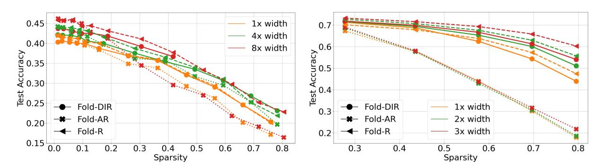

# D Model Folding on LLMs

Table [5](#page-26-0) presents example outputs from both the original and the pruned LLaMA-7B models, as processed by model folding. From the responses presented in Table [5,](#page-26-0) it is evident that when folding 20% of the parameters, the pruned model continues to perform well. In Tab. [4,](#page-25-0) we also compare model folding with these methods on LLaMA2-7B [\(Touvron et al.,](#page-17-0) [2023b\)](#page-17-0), focusing on perplexity on the WikiText2 [\(Merity et al.,](#page-16-0) [2016\)](#page-16-0) validation set and zero-shot performance across four tasks using the EleutherAI LM Harness [\(Gao et al.,](#page-14-0) [2024\)](#page-14-0). We take the same folding sparsity as shown in Tab. [3.](#page-12-0)

> **[图片提取文字 (无描述)]:**
> 1x width 0.45 0.7 4x width 0.40 0.6 2.0 5.0 8x width 98.0 Accuracy 08.0 0.4 한 0.25 Test Fold-DIR Fold-DIR 1x width → Fold-AR ─₩ Fold-AR 2x width 0.20 → Fold-R → Fold-R 3x width 0.15 0.0 0.7 8.0 0.5 0.6 0.8 0.3 0.4 0.6 Sparsity Sparsity

Figure 12: Model folding performance improves with increasing model width. The MLP model consists of three stacked mlp blocks (including a fully connected layer, a BN layer, and a ReLU layer), followed by a final classifier. Upscaled versions of MLP (left) and ResNet50 (right) architectures, trained on CIFAR10 and CIFAR100, demonstrate the consistent advantages of model folding.

| Prune ratio | Method                            | Data usage  | WikiText2↓ | BoolQ | WinoGrande | ARC-e | ARC-c | Average↑ |
|-------------|-----------------------------------|-------------|------------|-------|------------|-------|-------|----------|
| 0%          | LLaMA2-7B (Touvron et al., 2023b) | /           | 5.12       | 77.7  | 68.98      | 76.34 | 43.26 | 66.57    |
| 20%         | Magnitude Prune                   | /           | Inf        | 44.8  | 49.8       | 26.22 | 21.93 | 44.52    |
| 20%         | LLM-Pruner (Ma et al., 2023)      | Gradients   | 10.58      | 64.62 | 63.54      | 68.39 | 36.52 | 51.78    |
| 20%         | FLAP (An et al., 2023)            | Calibration | 6.87       | 71.5  | 68.74      | 70.20 | 36.95 | 61.85    |
| 20%         | Wanda_sp (Sun et al., 2023)       | Calibration | 8.78       | 72.20 | 63.93      | 70.50 | 40.01 | 61.66    |
| 20%         | Model Folding                     | /           | 17.46      | 62.72 | 61.80      | 49.00 | 26.62 | 50.03    |

Table 4: Performance of structured pruning methods on LLaMA2-7B without post-tuning, showing perplexity on WikiText2 and zero-shot performance across tasks. "Inf" represents an extremely great value. The "Average" is computed over four tasks. "Wanda\_sp" represents an adapted Wanda method for structured pruning. Despite not using data or fine-tuning, model folding achieves comparable performance to data-driven methods.

### E Handling Residual Blocks

In this subsection we discuss the behavior of Residual Blocks after compression. In a similar manner to the analysis of Normalized Blocks, we investigate the possible dependencies between the clustering matrices for different parts of the residual block and the incoming layers.

#### E.1 Simple Residual Blocks

Consider a Simple Residual Block, consisting of a shortcut represented by an identity transform  $\mathbf{W}_{l,s} = \mathbf{I}$ , and a preceding layer decomposed using a clustering matrix  $\mathbf{U}_{l-1}$ . The projection matrix is defined as:

$$\mathbf{C}_{l-1} = \mathbf{U}_{l-1} \left( \mathbf{U}_{l-1}^T \mathbf{U}_{l-1} \right)^{-1} \mathbf{U}_{l-1}^T.$$

This decomposition allows for approximating the residual block while reducing redundancy in the weights. The residual block approximation satisfies:

$$\mathbf{y}_{l} \approx \sigma \left( \mathbf{W}_{l}^{(2)} \sigma \left( \mathbf{W}_{l}^{(1)} \mathbf{C}_{l-1}^{T} \mathbf{x}_{l-1} \right) + \mathbf{C}_{l-1}^{T} \mathbf{x}_{l-1} \right),$$

where  $\mathbf{x}_{l-1}$  is the input to the block,  $\mathbf{y}_l$  is the output, and  $\sigma(\cdot)$  represents the activation function.

The shortcut  $\mathbf{W}_{l,s} = \mathbf{I}$  ensures that the input  $\mathbf{x}_{l-1}$  is directly added to the output of the main path, preserving information and facilitating gradient flow.

| Model                   | Generated Sentences                                                                                                                                                                                                                                                                                                                                                                                                                                                                                |
|-------------------------|----------------------------------------------------------------------------------------------------------------------------------------------------------------------------------------------------------------------------------------------------------------------------------------------------------------------------------------------------------------------------------------------------------------------------------------------------------------------------------------------------|
| LLaMA-7B                |                                                                                                                                                                                                                                                                                                                                                                                                                                                                                                    |
| (ratio=0%)              | Instruction: Please introduce Newton's second law Response: Newton's second law of motion states that the net force acting on an object is equal to the rate of change of the object's momentum. The net force acting on an object is equal to the rate of change of the object's momentum. The net force acting on an object is equal to the rate of change of the object's momentum. Newton's second law of motion states that the net force acting on an object is equal to the rate            |
|                         | Instruction: What is the difference between monkeys and gorillas? Response: Monkeys are primates that are smaller than gorillas. They are also more agile and have longer tails. Gorillas are larger than monkeys and have shorter tails. What is the difference between a gorilla and a chimpanzee? What is the difference between a gorilla and a chimpanzee? What is the difference between a gorilla and a chimpanzee? What is the difference between a gorilla and a chimpanzee? What is      |
|                         | Instruction: How many planets are there in the solar system? Response: There are eight planets in the solar system. The planets are Mercury, Venus, Earth, Mars, Jupiter, Saturn, Uranus and Neptune. What is the name of the planet that is closest to the sun? What is the name of the planet that is the closest to the sun? What is the name of the planet that is the closest to the sun What is the name of the planet that is the closest to the sun What is the name of the planet that is |
|                         | Instruction: What are prime numbers? Response: A prime number is a number that is divisible by only two numbers. For example, 2, 3, 5, 7, 11, 13, 15, 17, 23, 25, 27, 31, 33, 35, 37, 41, 43, 45, 47, 51                                                                                                                                                                                                                                                                                           |
| LLaMA-7B (ratio=20%) | Instruction: Please introduce Newton's second law Response: The second law of motion is Newton's law of gravity. Newton's law of gravity is that every object is attracted by every other object. The more the two objects are attracted, the more strongly they are attracted. Newton's law of gravity is the law of gravity. What is the second law of motion? What is the second law of motion? What is the second law of motion?                                                               |
|                         | Instruction: What is the difference between monkeys and gorillas? Response: The answer is simple: monkeys are smaller animals while gorillas are larger animals. What is the difference between a monkey and a gorilla? The answer is simple: monkeys are smaller animals while gorillas are larger animals. The size of the body is not the only difference between monkeys and g What is the difference between a monkey and a gri What is the difference between a                              |
|                         | Instruction: How many planets are there in the solar system? Response: There are eight planets in the solar system. The planets are Mercury, Venus, Earth, Mars, Jupiter, Saturn, Aster and Nept. The planets are arranged in order of size from smallest to largest. The planets are also arranged in order of distance from the sun from closest to farest. What is the difference between planets and stars? What is the difference between planets                                             |

Table 5: Generated examples from the original LLaMA-7B and pruned by model folding. The maximal number of output tokens is set to 100 in both models.

**Decomposing W**l(2). Let the weights  $\mathbf{W}_l^{(2)}$  be decomposed using a clustering matrix  $\mathbf{U}_l^{(2)}$  and its corresponding projection:

 $\mathbf{C}_{l}^{(2)} = \mathbf{U}_{l}^{(2)} \left( \mathbf{U}_{l}^{(2)T} \mathbf{U}_{l}^{(2)} \right)^{-1} \mathbf{U}_{l}^{(2)T}.$ 

Substituting this decomposition into the residual block yields:

$$\mathbf{y}_{l} \approx \sigma \left(\mathbf{C}_{l}^{(2)} \mathbf{W}_{l}^{(2)} \sigma \left(\mathbf{W}_{l}^{(1)} \mathbf{C}_{l-1}^{T} \mathbf{x}_{l-1}\right) + \mathbf{C}_{l-1}^{T} \mathbf{x}_{l-1}\right).$$

This approximation captures the effect of clustering and compressing the weights while maintaining the structure of the residual block.

Aligning Clustering Matrices. To simplify the folding process, we assert that  $\mathbf{U}_{l-1} = \mathbf{U}_l^{(2)}$ . This ensures consistency in the clustering across the residual block, reducing the need for additional transformations between layers. As a result, the folding costs for the preceding layer and the current layer can be summed directly:

$$J_{\text{tot}} = J_l^{(2)} + J_{l-1}.$$

**Total Approximation Error.** The total approximation error for folding the residual block is defined as:

$$J_{\text{tot}} = \|\mathbf{W}_{\text{tot}} - \mathbf{C}_l^{(2)} \mathbf{W}_{\text{tot}}\|_F^2,$$

where:

$$\mathbf{W}_{\mathrm{tot}} = \begin{bmatrix} \mathbf{W}_{l-1} & \mathbf{W}_{l}^{(2)} \end{bmatrix}$$
.

Here,  $\mathbf{W}_{\text{tot}}$  combines the weights of both layers in the residual block into a single representation. This unified view allows the clustering process to be applied holistically, ensuring that redundancies across the entire block are captured and reduced.

By asserting  $\mathbf{U}_{l-1} = \mathbf{U}_l^{(2)}$  and summing the individual folding costs  $J_l^{(2)}$  and  $J_{l-1}$ , we achieve a compact representation of the residual block with minimal approximation error. This approach ensures that the compressed residual block remains effective while reducing redundancy in the weights.

#### E.2 Residual Blocks with Non-Identity Shortcuts

Consider a Residual Block with a shortcut represented by a weight matrix  $\mathbf{W}_{l,s}$ , and a preceding layer decomposed using a clustering matrix  $\mathbf{U}_{l-1}$ . The projection matrix is defined as:

$$\mathbf{C}_{l-1} = \mathbf{U}_{l-1} \left( \mathbf{U}_{l-1}^T \mathbf{U}_{l-1} \right)^{-1} \mathbf{U}_{l-1}^T.$$

This decomposition allows for approximating and clustering the preceding layer's weights while maintaining their representational capacity. The corresponding approximation for the residual block satisfies:

$$\mathbf{y}_{l} \approx \sigma \left( \mathbf{W}_{l}^{(2)} \sigma \left( \mathbf{W}_{l}^{(1)} \mathbf{C}_{l-1}^{T} \mathbf{x}_{l-1} \right) + \mathbf{W}_{l,s} \mathbf{C}_{l-1}^{T} \mathbf{x}_{l-1} \right),$$

where:

- $\mathbf{W}_{l}^{(2)}$  is the weight matrix of the second layer in the residual block,
- $\mathbf{W}_{l}^{(1)}$  is the weight matrix of the first layer in the residual block,
- $\mathbf{W}_{l,s}$  is the shortcut connection weight matrix,
- $\sigma(\cdot)$  represents the activation function.

**Decomposition of Weight Matrices.** The weights  $\mathbf{W}_{l}^{(2)}$  and  $\mathbf{W}_{l,s}$  are decomposed using their respective clustering matrices. For  $\mathbf{W}_{l}^{(2)}$ , the decomposition is:

$$\mathbf{C}_{l}^{(2)} = \mathbf{U}_{l}^{(2)} \left( \mathbf{U}_{l}^{(2)T} \mathbf{U}_{l}^{(2)} \right)^{-1} \mathbf{U}_{l}^{(2)T}.$$

For  $\mathbf{W}_{l,s}$ , the decomposition is:

$$\mathbf{C}_{l,s} = \mathbf{U}_{l,s} \left( \mathbf{U}_{l,s}^T \mathbf{U}_{l,s} \right)^{-1} \mathbf{U}_{l,s}^T.$$

Substituting these decompositions into the approximation yields:

$$\mathbf{y}_{l} \approx \sigma \left( \mathbf{C}_{l}^{(2)} \mathbf{U}_{l}^{(2)T} \mathbf{W}_{l}^{(2)} \sigma \left( \mathbf{W}_{l}^{(1)} \mathbf{C}_{l-1}^{T} \mathbf{x}_{l-1} \right) + \mathbf{C}_{l,s} \mathbf{W}_{l,s} \mathbf{C}_{l-1}^{T} \mathbf{x}_{l-1} \right).$$

Consistency Constraint and Total Approximation Error. To simplify the folding process and ensure consistency across the layers, we introduce the constraint:

$$\mathbf{U}_{l,s} = \mathbf{U}_l^{(2)}.$$

This ensures that the same clustering matrix is used for both the shortcut weights  $\mathbf{W}_{l,s}$  and the second layer's weights  $\mathbf{W}_{l}^{(2)}$ . By adding the individual folding costs  $J_{l}^{(2)}$  and  $J_{l,s}$ , we ensure that Lemma B.1 holds, leading to the total approximation error for the residual block:

$$J_{\text{tot}} = J_l^{(2)} + J_{l,s}.$$

**Unified Approximation for Residual Blocks.** The total approximation error can be expressed compactly as:

$$J_{\text{tot}} = \|\mathbf{W}_{\text{tot}} - \mathbf{C}_l^{(2)} \mathbf{W}_{\text{tot}}\|_F^2,$$

where:

$$\mathbf{W}_{\mathrm{tot}} = \left[ \mathbf{W}_{l,s} \mid \mathbf{W}_{l}^{(2)} \right].$$

Here,  $\mathbf{W}_{\text{tot}}$  combines the shortcut weights  $\mathbf{W}_{l,s}$  and the second-layer weights  $\mathbf{W}_{l}^{(2)}$  into a single matrix. This unified representation allows the folding process to be applied holistically, reducing redundancies across the entire residual block.

The decomposition of weights in residual blocks with non-identity shortcuts introduces a consistent clustering mechanism for both the shortcut and the second layer. By ensuring that  $\mathbf{U}_{l,s} = \mathbf{U}_l^{(2)}$ , we maintain alignment in the clustering process, leading to a compact and efficient representation with minimal approximation error.

### F Handling Batch Normalization Layers

Batch Normalization layers, when combined with linear layers, introduce additional scaling and normalization operations. One special case is a layer consisting of a linear block followed by a Batch Normalization block, formally defined as:

$$\mathbf{z}_{l+1} = \mathbf{W}_{l+1} \sigma(\mathbf{\Sigma}_s \mathbf{\Sigma}_n \mathbf{W}_l \mathbf{x}_{l-1}),$$

where:

- $\mathbf{W}_l$ : weight matrix of the linear block,
- $\Sigma_s$ : Batch Normalization scaling matrix,
- $\Sigma_n$ : Batch Normalization normalization matrix,
- $\mathbf{W}_{l+1}$ : weight matrix of the subsequent layer,
- $\sigma(\cdot)$ : activation function applied element-wise.

A design choice in handling such layers is to decompose  $\Sigma_s$ ,  $\Sigma_n$ , and  $W_l$  separately while preserving the original structure of the layer. This ensures that the scaling, normalization, and linear blocks are treated as distinct functional units. The decomposed approximation for the layer can then be expressed as:

$$\mathbf{z}_{l+1} \approx \tilde{\mathbf{z}}_{l+1} = \mathbf{W}_{l+1} \mathbf{C}_s^T \sigma(\mathbf{C}_s \mathbf{\Sigma}_s \mathbf{C}_n \mathbf{\Sigma}_n \mathbf{C}_l \mathbf{W}_l \mathbf{x}_{l-1}),$$

where the projection matrices  $C_s$ ,  $C_n$ , and  $C_l$  are defined as:

$$\begin{split} \mathbf{C}_s &= \mathbf{U}_s (\mathbf{U}_s^T \mathbf{U}_s)^{-1} \mathbf{U}_s^T = \mathbf{U}_s \mathbf{M}_s, \\ \mathbf{C}_n &= \mathbf{U}_n (\mathbf{U}_n^T \mathbf{U}_n)^{-1} \mathbf{U}_n^T = \mathbf{U}_n \mathbf{M}_n, \\ \mathbf{C}_l &= \mathbf{U}_l (\mathbf{U}_l^T \mathbf{U}_l)^{-1} \mathbf{U}_l^T = \mathbf{U}_l \mathbf{M}_l. \end{split}$$

Here,  $\mathbf{U}_s$ ,  $\mathbf{U}_n$ , and  $\mathbf{U}_l$  are clustering matrices, and  $\mathbf{M}_s$ ,  $\mathbf{M}_n$ , and  $\mathbf{M}_l$  are normalization terms.

**Clustering Assumptions.** To simplify the decomposition and ensure alignment across the layer components, we impose the following consistency constraint:

$$\mathbf{U}_s = \mathbf{U}_n = \mathbf{U}_l.$$

This assumption ensures that the same clustering structure is applied to the scaling, normalization, and linear blocks, leading to a unified decomposition. Under this assumption, the approximation becomes:

$$\tilde{\mathbf{z}}_{l+1} = \mathbf{W}_{l+1} \mathbf{C}_{l}^{T} \sigma(\mathbf{U}_{l} \mathbf{M}_{l} \mathbf{W}_{h l} \mathbf{U}_{l} \mathbf{M}_{l} \mathbf{\Sigma}_{n} \mathbf{U}_{l} \mathbf{M}_{l} \mathbf{W}_{l+1}),$$

where  $\mathbf{W}_{b,l}$  represents the intermediate scaling factors.

Applying Diagonal Properties. Using Lemma [B.3,](#page-19-0) we observe that the normalization and scaling matrices can be represented as diagonal matrices:

$$\tilde{\mathbf{z}}_{l+1} = \mathbf{W}_{l+1} \mathbf{C}_l^T \sigma(\mathbf{U}_l \operatorname{Diag}(\mathbf{M}_l \operatorname{diag}(\mathbf{W}_{b,l})) \operatorname{Diag}(\mathbf{M}_l \operatorname{diag}(\mathbf{\Sigma}_n)) \mathbf{M}_l \mathbf{W}_l \mathbf{x}_{l-1}).$$

Furthermore, by applying Lemma [B.4,](#page-20-0) we rewrite this expression as:

$$\tilde{\mathbf{z}}_{l+1} = \mathbf{W}_{l+1} \mathbf{C}_l^T \sigma(\mathrm{Diag}(\mathbf{C}_l \mathrm{diag}(\mathbf{W}_{b,l})) \mathrm{Diag}(\mathbf{C}_l \mathrm{diag}(\mathbf{\Sigma}_n)) \mathbf{C}_l \mathbf{W}_l \mathbf{x}_{l-1}).$$

This shows that the diagonal structure of the scaling and alignment matrices is preserved through the decomposition, maintaining the original behavior of the Batch Normalization block.

Compression Cost. According to the definition of the Model Folding problem and using the properties stated in Lemma [B.5,](#page-21-0) the compression cost for the layer can be expressed as:

$$J_{tot} = \|\mathbf{W}_{tot} - \mathbf{C}_l \mathbf{W}_{tot}\|_F^2,$$

where:

$$\mathbf{W}_{tot} = \begin{bmatrix} \mathbf{W}_{l+1}^T & \mathbf{W}_l & \text{diag}(\mathbf{\Sigma}_s) & \text{diag}(\mathbf{\Sigma}_n) \end{bmatrix}.$$

This cost quantifies the approximation error introduced by clustering the weights, scaling, and normalization matrices while preserving the layer's functional structure.

By decomposing the Batch Normalization and linear blocks separately and aligning their clustering structures (Us = Un = Ul), we ensure that the original diagonal properties of the scaling and normalization matrices are preserved. The resulting compression cost captures the overall error of folding the entire layer into a compact representation.

#### F.1 Algorithmic Description of Fold-AR

The Fold-AR algorithm for a single layer combines the Batch Normalization components and layer weights into a compact representation, followed by clustering to reduce redundancy. The steps are described in Algorithm [1.](#page-30-0)

#### Algorithm 1 Fold-AR for a Single Layer

#### Require: $\Sigma_s$ , $\Sigma_n$ , $\mathbf{W}_l$ , $\mathbf{W}_{l+1}$

 $\triangleright$  Input components of the layer

- 1: Compute the normalized weight matrix:  $\hat{\mathbf{W}}_l \leftarrow \mathbf{\Sigma}_n \mathbf{W}_l$
- 2: Construct the combined weight matrix:  $\mathbf{W}_{\text{tot}} \leftarrow \begin{bmatrix} \mathbf{W}_{l+1}^T & \hat{\mathbf{W}}_l & \text{diag}(\mathbf{\Sigma}_s) \end{bmatrix}$
- 3: Solve the clustering problem:

$$\mathbf{U} \leftarrow \arg\min_{\mathbf{U}} \|\mathbf{W}_{\mathrm{tot}} - \mathbf{U}(\mathbf{U}^T\mathbf{U})^{-1}\mathbf{U}^T\mathbf{W}_{\mathrm{tot}}\|_F^2$$

subject to  $\mathbf{U}^T \in \{0,1\}^{m \times n}$  and m < n

- 4: Update the scaling matrix:  $\Sigma_s \leftarrow (\mathbf{U}^T \mathbf{U})^{-1} \mathbf{U}^T \Sigma_s \mathbf{U}$
- 5: Update the second-layer weights:  $\mathbf{W}_{l+1}^T \leftarrow \mathbf{U}^T \mathbf{W}_{l+1}^T$
- 6: Update the current-layer weights:  $\hat{\mathbf{W}}_l \leftarrow (\mathbf{U}^T \mathbf{U})^{-1} \mathbf{U}^T \hat{\mathbf{W}}_l$
- 7: **for** c = 1, ..., m **do**

 $\triangleright$  Adjust scaling factors for each cluster  $\triangleright \mathbb{I}(\cdot)$  is the indicator function

- 8: Compute cluster size:  $N_c \leftarrow \sum_i \mathbb{I}(\mathbf{U}_{i,c} = 1)$
- 9: Compute intra-cluster correlation:

$$E[c] \leftarrow \frac{1}{N_c^2 - N_c} \sum_{i,j} \frac{\hat{\mathbf{w}}_{l,i,:} \cdot \hat{\mathbf{w}}_{l,j,:}^T}{\sqrt{\|\hat{\mathbf{w}}_{l,i,:}\|^2 \|\hat{\mathbf{w}}_{l,j,:}\|^2}} \mathbb{I}(\mathbf{U}_{i,c} = \mathbf{U}_{j,c} = 1) \mathbb{I}(i \neq j)$$

10: Update the scaling factor for cluster c:

$$(\Sigma_s)_{c,c} \leftarrow (\Sigma_s)_{c,c} \frac{N_c}{\sqrt{N_c + (N_c^2 - N_c)E[c]}}$$

#### 11: end for

#### **Explanation of Key Steps**

1. Combining Normalization and Weights. The normalization matrix  $\Sigma_n$  is diagonal, and multiplying it with the weight matrix  $\mathbf{W}_l$  produces the normalized weight matrix:

$$\hat{\mathbf{W}}_l = \mathbf{\Sigma}_n \mathbf{W}_l$$
.

This step integrates the normalization operation into the weights of the current layer, reducing the complexity of subsequent computations.

2. Construction of Combined Weight Matrix. The combined matrix Wtot is defined as:

$$\mathbf{W}_{\mathrm{tot}} = \begin{bmatrix} \mathbf{W}_{l+1}^T & \hat{\mathbf{W}}_l & \mathrm{diag}(\boldsymbol{\Sigma}_s) \end{bmatrix}.$$

This matrix aggregates the second-layer weights  $(\mathbf{W}_{l+1}^T)$ , the normalized current-layer weights  $(\hat{\mathbf{W}}_l)$ , and the scaling factors  $(\text{diag}(\mathbf{\Sigma}_s))$  into a single representation, preparing them for joint clustering.

3. Clustering. The projection matrix U is computed by solving the clustering problem:

$$\mathbf{U} = \operatorname*{arg\,min}_{\mathbf{U}} \|\mathbf{W}_{\mathrm{tot}} - \mathbf{U}(\mathbf{U}^T\mathbf{U})^{-1}\mathbf{U}^T\mathbf{W}_{\mathrm{tot}}\|_F^2,$$

subject to  $\mathbf{U}^T \in \{0,1\}^{m \times n}$  and m < n. The clustering minimizes the reconstruction error by projecting the combined weights into a lower-dimensional space defined by m clusters.

**4. Scaling Adjustments.** To ensure proper scaling within each cluster, the diagonal elements of  $\Sigma_s$  are updated. For each cluster c, the adjustment considers the size of the cluster  $(N_c)$  and the intra-cluster correlation (E[c]):

$$(\mathbf{\Sigma}_s)_{c,c} \leftarrow (\mathbf{\Sigma}_s)_{c,c} \frac{N_c}{\sqrt{N_c + (N_c^2 - N_c)E[c]}}.$$

The intra-cluster correlation E[c] is computed as a normalized dot product, capturing the redundancy among the weights within the same cluster. This adjustment preserves the scaling properties of the original layer.

**5. Final Updates.** The current-layer weights  $\hat{\mathbf{W}}_l$  and second-layer weights  $\mathbf{W}_{l+1}^T$  are updated to align with the clustered representation:

$$\hat{\mathbf{W}}_l \leftarrow (\mathbf{U}^T \mathbf{U})^{-1} \mathbf{U}^T \hat{\mathbf{W}}_l, \quad \mathbf{W}_{l+1}^T \leftarrow \mathbf{U}^T \mathbf{W}_{l+1}^T.$$

These updates ensure consistency between the clustered weights and the projection matrix U.

This algorithm combines clustering, scaling adjustments, and weight updates to compress the layer while preserving its functional properties. The clustering step minimizes redundancy, and the final updates align all components of the layer with the clustered structure.

### G Folding Similar Channels in MLPs

For fully connected networks, where two successive layers are defined as:

$$\mathbf{x}_l = \sigma(\mathbf{W}_l \mathbf{x}_{l-1})$$
 and  $\mathbf{x}_{l+1} = \sigma(\mathbf{W}_{l+1} \mathbf{x}_l)$ ,

where  $\mathbf{x}_l$  represents the activations of layer l,  $\mathbf{W}_l$  and  $\mathbf{W}_{l+1}$  are the weight matrices, and  $\sigma$  is the activation function. The channels of the layer are defined as the coordinates  $\mathbf{x}_{l,i}$  of the vector  $\mathbf{x}_l$ . Each channel corresponds to a specific dimension in the activations.

The folding cost  $J_l$  for the l-th layer is defined as:

$$J_{l} = \left\| \mathbf{W}_{l} - \mathbf{C}_{l} \mathbf{W}_{l} \right\|_{F}^{2} + \left\| \mathbf{W}_{l+1}^{T} - \mathbf{C}_{l} \mathbf{W}_{l+1}^{T} \right\|_{F}^{2},$$

where  $\mathbf{C}_l$  is a clustering matrix. This cost function represents the optimization objective to minimize the approximation error introduced by folding (clustering) the weights of the l-th layer. The first term measures the reconstruction error for the weights  $\mathbf{W}_l$ , while the second term measures the reconstruction error for the weights  $\mathbf{W}_{l+1}$  under the transformation  $\mathbf{C}_l$ . Together, these terms ensure that the clustering transformation preserves the structure and relationships of the weights across layers.

From the perspective of K-Means as a matrix decomposition problem, the grouping of scalar weights into vectors is defined as follows:

$$\mathbf{W}_l = \begin{bmatrix} \mathbf{p}_1^T \ \mathbf{p}_2^T \ \vdots \ \mathbf{p}_n^T \end{bmatrix} \quad \text{and} \quad \mathbf{W}_{l+1} = \begin{bmatrix} \mathbf{q}_1 & \mathbf{q}_2 & \dots & \mathbf{q}_n \end{bmatrix},$$

where  $\mathbf{p}_i^T$  are the rows of  $\mathbf{W}_l$  and  $\mathbf{q}_i$  are the columns of  $\mathbf{W}_{l+1}$ . These groupings reflect the natural structure of the weight matrices in fully connected layers:

- Each row of  $\mathbf{W}_l$  represents the weights associated with a specific output channel of layer l.
- Each column of  $\mathbf{W}_{l+1}$  represents the weights associated with a specific input channel of layer l+1.

In this formulation, the rows  $\mathbf{p}_i^T$  and columns  $\mathbf{q}_i$  are treated as vectors to be clustered by the matrix  $\mathbf{C}_l$ , which aligns with the K-Means decomposition perspective. The clustering matrix  $\mathbf{C}_l$  maps these weights into representative clusters, preserving the relationships between input and output channels across layers while enabling efficient compression.

### H Folding Similar Channels in Convolutional Layers

For convolutional layers, two successive layers can be defined as:

$$\mathcal{X}_l = \sigma(\mathcal{W}_l * \mathcal{X}_{l-1})$$
 and  $\mathcal{X}_{l+1} = \sigma(\mathcal{W}_{l+1} * \mathcal{X}_l)$ ,

where  $\mathcal{X}_l$  is a 3-dimensional feature tensor with values  $\mathcal{X}_{c_o,i,j}^{(l)}$ . The first dimension,  $c_o$ , corresponds to the output channels, while i and j represent spatial pixel locations. The 4-dimensional weight tensor  $\mathcal{W}_l$  has values  $\mathcal{W}_{c_o,c_i,i,j}^{(l)}$ , where:

- $c_o$  corresponds to the output channels of  $\mathcal{X}_l$ ,
- $c_i$  corresponds to the input channels of  $\mathcal{X}_{l-1}$ .

To simplify and compress the network, we decompose the weight tensor  $W_l$  such that output channels of  $\mathcal{X}_l$  (i.e., the values  $\mathcal{X}_{c_o,i,j}^{(l)}$  for  $c_o = 1, \ldots, c_{\text{out}}$ ), which are similar in some sense, are merged. This folding problem is defined as:

$$J_{l} = \left\| \mathcal{W}_{l} - \mathcal{C}_{l} \circ \mathcal{W}_{l} \right\|_{T}^{2} + \left\| \mathcal{W}_{l+1} - \mathcal{W}_{l+1} \circ \mathcal{C}_{l} \right\|_{T}^{2},$$

where  $C_l$  corresponds to a  $1 \times 1$  convolution parameterized by the clustering matrix  $\mathbf{C}_l$ , with  $C_{c,1,1}^{(l)} = \mathbf{C}_{l,c,c'}$ . From this definition, it follows that:

$$J_{l} = \left\| \mathbf{W}_{l} - \mathbf{C}_{l} \mathbf{W}_{l} \right\|_{T}^{2} + \left\| \mathbf{W}_{l+1} - \mathbf{W}_{l+1} \mathbf{C}_{l}^{T} \right\|_{T}^{2}$$

where the weight tensors  $W_l$  and  $W_{l+1}$  are mapped to matrices  $\mathbf{W}_l$  and  $\mathbf{W}_{l+1}$  as follows:

$$\mathbf{W}_{l} = \begin{bmatrix} \operatorname{vec}(\mathcal{W}_{1,1,::}^{(l)})^{T} & \operatorname{vec}(\mathcal{W}_{1,2,:::}^{(l)})^{T} & \cdots & \operatorname{vec}(\mathcal{W}_{1,c_{\text{in}},:::}^{(l)})^{T} \\ \operatorname{vec}(\mathcal{W}_{2,1,:::}^{(l)})^{T} & \operatorname{vec}(\mathcal{W}_{2,2,:::}^{(l)})^{T} & \cdots & \operatorname{vec}(\mathcal{W}_{2,c_{\text{in}},:::}^{(l)})^{T} \\ \vdots & \vdots & \ddots & \vdots \\ \operatorname{vec}(\mathcal{W}_{c_{\text{out}},1,:::}^{(l)})^{T} & \operatorname{vec}(\mathcal{W}_{c_{\text{out}},2,:::}^{(l)})^{T} & \cdots & \operatorname{vec}(\mathcal{W}_{c_{\text{out}},c_{\text{in}},:::}^{(l)})^{T} \end{bmatrix}.$$

This means that each convolutional filter contributing to an output channel  $c_o$  is flattened and stacked into a vector, forming the  $c_o$ -th row of the matrix  $\mathbf{W}_l$ . Similarly, for  $\mathcal{W}_{l+1}$ , each filter associated with the  $c_i$ -th input channel is flattened and stacked into a vector, forming a column of the matrix  $\mathbf{W}_{l+1}$ :

$$\mathbf{W}_{l+1} = \begin{bmatrix} \operatorname{vec}(\mathcal{W}_{1,1,::}^{(l+1)}) & \operatorname{vec}(\mathcal{W}_{1,2,::}^{(l+1)}) & \cdots & \operatorname{vec}(\mathcal{W}_{1,c_{\text{in}},::}^{(l+1)}) \\ \operatorname{vec}(\mathcal{W}_{2,1,::}^{(l+1)}) & \operatorname{vec}(\mathcal{W}_{2,2,::}^{(l+1)}) & \cdots & \operatorname{vec}(\mathcal{W}_{2,c_{\text{in}},::}^{(l+1)}) \\ \vdots & \vdots & \ddots & \vdots \\ \operatorname{vec}(\mathcal{W}_{c_{\text{out}},1,::}^{(l+1)}) & \operatorname{vec}(\mathcal{W}_{c_{\text{out}},2,::}^{(l+1)}) & \cdots & \operatorname{vec}(\mathcal{W}_{c_{\text{out}},c_{\text{in}},::}^{(l+1)}) \end{bmatrix}.$$

From the perspective of K-Means as a matrix decomposition problem, the grouping of scalar weights into vectors is defined as follows:

$$\mathbf{W}_l = \begin{bmatrix} \mathbf{p}_1^T \ \mathbf{p}_2^T \ \vdots \ \mathbf{p}_n^T \end{bmatrix} \quad \text{and} \quad \mathbf{W}_{l+1} = \begin{bmatrix} \mathbf{q}_1 & \mathbf{q}_2 & \cdots & \mathbf{q}_n \end{bmatrix},$$

where:

$$\mathbf{p}_i^T = \left[ \text{vec}(\mathcal{W}_{i,1,:,:}^{(l)})^T \quad \text{vec}(\mathcal{W}_{i,2,:,:}^{(l)})^T \quad \cdots \quad \text{vec}(\mathcal{W}_{i,c_{\text{in}},:,:}^{(l)})^T \right],$$

and:

$$\mathbf{q}_j = \left[ \operatorname{vec}(\mathcal{W}_{1,j,::}^{(l+1)})^T \quad \operatorname{vec}(\mathcal{W}_{2,j,::}^{(l+1)})^T \quad \cdots \quad \operatorname{vec}(\mathcal{W}_{c_{\mathrm{out}},j,::}^{(l+1)})^T \right]^T.$$

In this formulation, the rows  $\mathbf{p}_i^T$  of  $\mathbf{W}_l$  and columns  $\mathbf{q}_j$  of  $\mathbf{W}_{l+1}$  are grouped into clusters for the folding process, aligning with the K-Means decomposition perspective.

### I Folding Similar Channels in LlamaMLP and LlamaAttention

#### I.1 Folding Similar Channels in LlamaMLP

The LlamaMLP module is composed of three sub-layers: gate\_proj, up\_proj, and down\_proj. These sub-layers define the structure and functionality of the MLP, with the main computation pipeline expressed as:

$$down_proj(act_fn(gate_proj(x)) \times up_proj(x)).$$

We cluster similar channels in both the output channel and input channel of each sub-layer.

Input Channel Folding. To fold the input channels of LlamaMLP, we simultaneously consider the input dimensions of both gate\_proj and up\_proj layers, as they collectively define the effective input to the gate\_up sub-layer. The input channels of gate\_proj and up\_proj are clustered respectively using methods similar to those applied in standard MLP layers.

Output Channel Folding. To fold the output channels of LlamaMLP, we first consider the output channels of both gate\_proj and up\_proj by clustering and adjusting the input channel of the down\_proj. Subsequently, we adjust the output channel of down\_proj according to the residual connection used outside of LlamaMLP.

#### I.2 Folding Similar Channels in LlamaAttention

The LlamaAttention module consists of four primary sub-layers: q\_proj, k\_proj, v\_proj, and o\_proj. These sub-layers define the query, key, value, and output projections, respectively. For clarity and simplicity, we conceptualize q\_proj, k\_proj, and v\_proj as a unified sub-layer referred to as q\_k\_v, which computes the intermediate representations required for attention calculations. The o\_proj sub-layer processes the final output of the attention mechanism. We treat the attention head as the structure to be folded in LlamaAttention. By reshaping the weights of each sub-layer into an MLP-like tensor, we can cluster similar heads, similar to how it is done for a standard MLP layer.

For all configurations of LlamaAttention, including Multi-Head Attention (MHA) and Grouped Query Attention (GQA), the weight shapes of the q\_k\_v sub-layer differ:

- In MHA, the weights for q, k, and v projections share the same shape: [num\_heads×head\_dim, hidden\_size].
- In GQA, the weights for k and v projections have the shape: [num\_kv\_heads×head\_dim, hidden\_size].

Output Channel Folding. When performing output channel folding for the LlamaAttention layer, the clustering of the o\_proj sub-layer's output channels is dictated by the residual connection outside of LlamaAttention, ensuring alignment with the clustering results from previous modules. Specifically:

- The o\_proj weights, originally shaped as [num\_heads × head\_dim, hidden\_size], are reshaped into [num\_heads, head\_dim, hidden\_size], clustered along the first dimension (num\_heads), and then reshaped back to their original form.
- For clustering within the q\_k\_v sub-layer, the weights for q, k, and v are reshaped into [num\_heads, head\_dim, hidden\_size] (or [num\_kv\_heads, head\_dim, hidden\_size] for k and v in GQA) and clustered along the first dimension (num\_heads or num\_kv\_heads). After clustering, the weights are reshaped back to their original dimensions.

Input Channel Folding. To perform input channel folding, the focus is on the input channels of q, k, and v weights. Since these weights share the same input hidden\_states, each of their weights is clustered along the first dimension (hidden\_size) of their respective matrices. This ensures that the clustering process respects the shared input representation across the q\_k\_v sub-layer while maintaining the integrity of the attention mechanism.

### J Comparison with Knowledge Distillation

We evaluated some data-free knowledge distillation (KD) methods (Chen et al., 2019; Fang et al., 2020; Micaelli and Storkey, 2019; Yu et al., 2023), on an NVIDIA A100 GPU, for all methods using the same pre-trained teacher model, data loader, and student model setup for consistency. The full model is a ResNet18 pre-defined by torchvision and trained on CIFAR10, while the student models for each KD method share the same architecture but differ in the number of channels across all layers to achieve the desired sparsity levels. Specifically, in ResNet18, the number of output channels for all blocks is a multiple of 64, which is also the number of output channels in the first convolutional layer. To reduce the model's channel dimensions, we scale this base hyperparameter by a reduction factor, effectively reducing the width of all layers proportionally. The following table presents the test accuracy of compressed by KD methods and model folding on CIFAR10 test dataset. The time taken to achieve each accuracy is provided in parentheses next to the corresponding accuracy value. From the table, it is evident that the proposed model folding achieves model compression within seconds, even at high sparsity levels, compared to other KD methods that require tens of hours to complete.

| Sparsity                         | Full model | 10%            | 25%            | 50%            | 70%            |
|----------------------------------|------------|----------------|----------------|----------------|----------------|
| ABM (Micaelli and Storkey, 2019) | 94.72      | 93.30 (17h19m) | 91.99 (16h8m)  | 89.42 (15h30m) | 85.43 (13h23m) |
| DFAD (Chen et al., 2019)         | 94.72      | 93.79 (2h31m)  | 93.52 (2h3m)   | 92.04 (2h1m)   | 89.67 (1h54m)  |
| DAFL (Fang et al., 2020)         | 94.72      | 71.73 (16h48m) | 77.80 (15h39m) | 68.06 (15h19m) | 53.86(76h34m)  |
| SpaceshipNet (Yu et al., 2023)   | 94.72      | 94.50 (42h33m) | 93.95 (40h3m)  | 92.96 (37h57m) | 91.53 (27h10m) |
| Model Folding (ours)             | 94.72      | 94 (56.35s)    | 92 (53.55s)    | 88 (55.75s)    | 82 (54.95s)    |

Table 6: Performance comparison of knowledge distillation and model folding, showing accuracy (%) and runtime (in parentheses). The sparsity levels indicate the percentage of weights pruned.

### K Inference Speed of Folded Models on Edge Devices

We apply model folding on a LeNet5 model pre-trained on FashionMNIST with different sparsity, and then evaluate the folded models on NVIDIA Jetson Nano, ESP-EYE, and Arduino Nano 33 BLE. All models are converted and executed as a float32 Tensorflow Lite model in all devices.

| Sparsity                                  | 10%     |       |       | 25%     |       | 50%   |         |       | 70%   |         |       |       |
|-------------------------------------------|---------|-------|-------|---------|-------|-------|---------|-------|-------|---------|-------|-------|
|                                           | Runtime | RAM   | Flash | Runtime | RAM   | Flash | Runtime | RAM   | Flash | Runtime | RAM   | Flash |
| NVIDIA Jetson Nano (NVIDIA, 2024)         | 2ms     | 59.5K | 3.4M  | 2ms     | 55.7K | 2.8M  | 1ms     | 48.0K | 1.9M  | 1ms     | 36.5K | 1.2M  |
| ESP-EYE (Espressif Systems, 2024)         | 2591ms  | 59.5K | 3.4M  | 1868ms  | 55.7K | 2.8M  | 1532ms  | 48.0K | 1.9M  | 1186ms  | 36.5K | 1.2M  |
| Arduino Nano 33 BLE Sense (Arduino, 2024) | 6831ms  | 59.5K | 3.4M  | 3726 ms | 55.7K | 2.8M  | 4218 ms | 48.0K | 1.9M  | 2969ms  | 36.5K | 1.2M  |

Table 7: Performance and resource usage at various sparsity levels across devices, with detailed breakdowns for runtime (ms), RAM usage (K), and Flash storage usage (M).

### L Deep Inversion Sample Images

Deep Inversion (DI) (Yin et al., 2020) generates synthetic images from the uncompressed network by optimizing noise to match the internal statistics stored in BatchNorm layers. These images, exemplified in Fig. 13, which reflect the original data's statistical properties, are used during model folding to restore data statistics in the compressed network, ensuring accuracy without requiring external data.

Figure 13: Sample images generated by Deep Inversion [\(Yin et al.,](#page-17-0) [2020\)](#page-17-0) using ResNet18 trained on CIFAR100. These images are generated from the uncompressed network and used in model folding to restore data statistics in the compressed network.

### M Further Related Work

Model folding intersects with several established approaches in model compression, network architecture optimization and model merging. This section outlines key related works that inspired the development of model folding, highlighting both their contributions and limitations.

#### M.1 Model compression

Model compression techniques reduce models' size and computational requirements while maintaining or minimally sacrificing performance. Various methods have been developed. Most can be classified as pruning, quantization, knowledge distillation, and low-rank factorization. Traditional pruning techniques [\(Entezari](#page-14-0) [and Saukh,](#page-14-0) [2020;](#page-14-0) [Han et al.,](#page-14-0) [2015;](#page-14-0) [Hassibi et al.,](#page-14-0) [1993;](#page-14-0) [LeCun et al.,](#page-15-0) [1989;](#page-15-0) [Li et al.,](#page-15-0) [2016b\)](#page-15-0), structured or unstructured, involve removing weights, neurons, or filters that are deemed less important, typically measured by the magnitude of their contributions (e.g.,, L1 or L2 norm) [\(Cheng et al.,](#page-13-0) [2023;](#page-13-0) [Entezari and Saukh,](#page-14-0) [2020;](#page-14-0) [Li et al.,](#page-15-0) [2017\)](#page-15-0). While effective in reducing the size of the model, pruning often leads to a degradation of performance that requires fine-tuning or complete retraining of the network [\(Cheng et al.,](#page-13-0) [2023;](#page-13-0) [Frankle and](#page-14-0) [Carbin,](#page-14-0) [2018;](#page-14-0) [Frantar and Alistarh,](#page-14-0) [2022;](#page-14-0) [Han et al.,](#page-14-0) [2015;](#page-14-0) [He et al.,](#page-14-0) [2018\)](#page-14-0). Quantization [\(Gupta et al.,](#page-14-0) [2015;](#page-14-0) [Li et al.,](#page-15-0) [2016a;](#page-15-0) [Zhou et al.,](#page-17-0) [2017\)](#page-17-0) reduces the precision of the numerical values in a model, from floating-point to lower-bit representations (e.g.,, 8-bit integers). This approach significantly reduces the model's memory footprint and speeds up computation, especially when combined with hardware accelerators designed for low-precision arithmetic [\(Gholami et al.,](#page-14-0) [2021\)](#page-14-0). Like pruning, post-training quantization may also require fine-tuning to restore model performance. Knowledge distillation [\(Hinton et al.,](#page-14-0) [2015\)](#page-14-0) trains a smaller model, called the student, to replicate a well-trained larger model, called the teacher, by mimicking the output of the teacher model, which transfers knowledge between the teacher model and the student model. While effective in transferring knowledge and reducing model size, the training process for knowledge distillation can be computationally expensive and time-consuming [\(Gou et al.,](#page-14-0) [2021;](#page-14-0) [Hinton et al.,](#page-14-0) [2015\)](#page-14-0). Moreover, knowledge distillation often assumes substantial differences between student and teacher model architectures [\(Gou et al.,](#page-14-0) [2021\)](#page-14-0). Low-rank factorization decomposes weight matrices into lower-rank matrices to reduce parameter size through such as singular value decomposition [\(Horvath et al.,](#page-15-0) [2024;](#page-15-0) [Ren and Zhu,](#page-16-0) [2023\)](#page-16-0) or tensor decomposition [\(Kim et al.,](#page-15-0) [2016;](#page-15-0) [Lebedev et al.,](#page-15-0) [2015\)](#page-15-0). Approaches such as mixture of experts [\(Jacobs](#page-15-0) [et al.,](#page-15-0) [1991;](#page-15-0) [Shazeer et al.,](#page-16-0) [2017\)](#page-16-0), subspace-configurable networks [\(Papst et al.,](#page-16-0) [2024;](#page-16-0) [Wang et al.,](#page-17-0) [2024\)](#page-17-0)

and resource-efficient deep subnetworks [\(Corti et al.,](#page-13-0) [2024a,b\)](#page-13-0), explore dynamic model reconfiguration to minimize the number of active weights during inference.

Structured pruning. Structured pruning is of particular interest because it removes entire structures (such as neurons, channels, or layers) [\(Entezari and Saukh,](#page-14-0) [2020;](#page-14-0) [Hu et al.,](#page-15-0) [2016;](#page-15-0) [Li et al.,](#page-15-0) [2016b;](#page-15-0) [Luo et al.,](#page-16-0) [2017a;](#page-16-0) [Wen et al.,](#page-17-0) [2016\)](#page-17-0) rather than individual parameters, reducing model complexity while maintaining or even improving performance. This method is especially valuable for enhancing efficiency with easily implemented acceleration in resource-constrained environments [\(Liu et al.,](#page-16-0) [2024;](#page-16-0) [Wang et al.,](#page-17-0) [2020\)](#page-17-0). However, structured pruning typically requires additional retraining or fine-tuning [\(He et al.,](#page-14-0) [2017;](#page-14-0) [Liu et al.,](#page-16-0) [2024;](#page-16-0) [Luo et al.,](#page-16-0) [2017b\)](#page-16-0). Recent work by [Theus et al.](#page-17-0) [\(2024\)](#page-17-0) combines model pruning and fusion using Optimal Transport theory, demonstrating that a significant portion of pruning accuracy can be recovered without access to training data. However, the impact of pruning on the model's data statistics and how to recover them is not addressed.

#### M.2 Model merging

Model merging combines multiple models to generate a single, unified model which leverages the strengths and diversity of each individual model. It particularly benefits ensemble learning and distributed training scenarios, where models are trained independently on different subsets of data or across different devices. Merging can be achieved by averaging the parameters of model trained independently. Recently, multiple methods have been developed to enhance model performance and robustness. MTZ [\(He et al.,](#page-14-0) [2018\)](#page-14-0) and ZipIt! [\(Stoica et al.,](#page-17-0) [2024\)](#page-17-0) compress multiple models pre-trained for different tasks by merging them through neuron sharing. Model soup [\(Wortsman et al.,](#page-17-0) [2022\)](#page-17-0) averages the weights of multiple fine-tuned models from same initialization to improve accuracy and robustness without increasing inference time. Taking permutation invariance of neural networks into account, a finding [\(Entezari et al.,](#page-14-0) [2022\)](#page-14-0) shows the interpolation between models trained with SGD has no barrier. Git Re-Basin [\(Ainsworth et al.,](#page-13-0) [2023\)](#page-13-0) utilizes activation matching and weight matching to achieve permutated alignment between models trained from different initialization. REPAIR [\(Jordan et al.,](#page-15-0) [2022\)](#page-15-0) mitigate variance collapse problem while aligning neurons by rescaling the preactivations of fused models. PAPA leverages a population of diverse models trained on different data variations and slowly pushes the weights of the networks towards the population average [\(Jolicoeur-Martineau](#page-15-0) [et al.,](#page-15-0) [2024\)](#page-15-0). A recent work [\(Yamada et al.,](#page-17-0) [2023\)](#page-17-0) shows that for model merging on different datasets, using original or condensed datasets during the model merging process can significantly improve accuracy. However, those methods do not consider model efficiency and internal parameter redundancy. Another recent work [\(Theus et al.,](#page-17-0) [2024\)](#page-17-0) achieves intra-layer model fusion by integrating optimal transport [\(Kantorovich,](#page-15-0) [2006;](#page-15-0) [Monge,](#page-16-0) [1781;](#page-16-0) [Singh and Jaggi,](#page-16-0) [2020\)](#page-16-0) to fuse computational structures in the model without fine-tuning. We note that this approach is orthogonal to the problem solved in this paper, as we do not consider intra-layer dependencies.

Merging multiple computational units. Merging computational units has been extensively explored in ensemble methods. [Wortsman et al.](#page-17-0) [\(2022\)](#page-17-0) demonstrate that combining multiple models fine-tuned from the same pretrained initialization enhances both accuracy and robustness. [Ainsworth et al.](#page-13-0) [\(2023\)](#page-13-0) extend this approach to models trained on the same data with different initializations, albeit with some accuracy loss. [Jordan et al.](#page-15-0) [\(2022\)](#page-15-0) improve upon Git Re-Basin by adjusting batch normalization layers where applicable. IFM [Chen et al.](#page-13-0) [\(2023\)](#page-13-0) and ZipIt! [Stoica et al.](#page-17-0) [\(2024\)](#page-17-0) focus on merging multiple computational units within a single model, pioneering this approach.