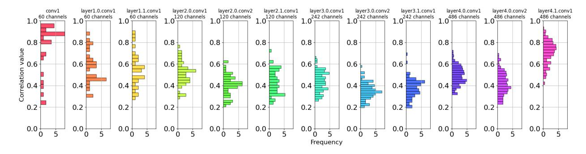

# Forget the Data and Fine-tuning! Just Fold the Network to Compress

Dong Wang∗1 , Haris Šikić∗1 , Lothar Thiele3 , and Olga Saukh1,2

> 1Graz University of Technology, Austria 2Complexity Science Hub Vienna, Austria 3ETH Zurich, Switzerland

{dong.wang@, haris.sikic@student., saukh@}tugraz.at, thiele@tik.ee.ethz.ch

#### Abstract

We introduce model folding, a novel data-free model compression technique that merges structurally similar neurons across layers, significantly reducing the model size without the need for fine-tuning or access to training data. Unlike existing methods, model folding preserves data statistics during compression by leveraging k-means clustering, and using novel data-free techniques to prevent variance collapse or explosion. Our theoretical framework and experiments across standard benchmarks, including ResNet18 and LLaMA-7B, demonstrate that model folding achieves comparable performance to datadriven compression techniques and outperforms recently proposed data-free methods, especially at high sparsity levels. This approach is particularly effective for compressing large-scale models, making it suitable for deployment in resource-constrained environments. Our code is online.¶

### 1 Introduction

Deep neural networks (DNNs) have emerged as a fundamental technology, driving progress across a multitude of applications from natural language processing to computer vision. However, the deployment of these models in real-world settings is often constrained by the computational and memory resources available, particularly on edge devices like smartphones and embedded systems [\(Chen et al.,](#page-13-0) [2020;](#page-13-0) [Kumar et al.,](#page-15-0) [2017;](#page-15-0) [Wan et al.,](#page-17-0) [2020\)](#page-17-0). This limitation poses a significant challenge, as the growing complexity and size of SOTA models demand increasingly substantial resources [\(Bommasani et al.,](#page-13-0) [2021;](#page-13-0) [Chang et al.,](#page-13-0) [2024;](#page-13-0) [Rombach](#page-16-0) [et al.,](#page-16-0) [2022\)](#page-16-0).

Conventional model compression techniques, such as pruning [\(Han et al.,](#page-14-0) [2015;](#page-14-0) [Hassibi et al.,](#page-14-0) [1993;](#page-14-0) [LeCun](#page-15-0) [et al.,](#page-15-0) [1989;](#page-15-0) [Li et al.,](#page-15-0) [2016b\)](#page-15-0) and quantization [\(Gupta et al.,](#page-14-0) [2015;](#page-14-0) [Li et al.,](#page-15-0) [2016a;](#page-15-0) [Zhou et al.,](#page-17-0) [2017\)](#page-17-0), have been developed to mitigate this issue by reducing the model size and computational requirements. These methods usually remove redundant or less critical parameters from the model, thereby reducing the overall size and computational load. For example, pruning eliminates weights that contribute minimally to the model's output [\(Entezari and Saukh,](#page-14-0) [2020;](#page-14-0) [Han et al.,](#page-14-0) [2015;](#page-14-0) [Li et al.,](#page-15-0) [2016b\)](#page-15-0). Quantization reduces the precision of the weights and activations [\(Gupta et al.,](#page-14-0) [2015\)](#page-14-0), which decreases memory usage and speeds up inference [\(Zhou et al.,](#page-17-0) [2017\)](#page-17-0). Despite their effectiveness, these approaches often introduce a degradation in model performance, necessitating a phase of fine-tuning to maintain the internal data statistics within the model [\(Jordan et al.,](#page-15-0) [2022\)](#page-15-0) and restore the original accuracy levels [\(Frankle and Carbin,](#page-14-0) [2018;](#page-14-0) [Frantar and](#page-14-0)

\*[Equal contribution](#page-14-0)

¶[https://github.com/nanguoyu/model-folding-universal](#page-14-0)

> **[图片提取文字 (无描述)]:**
> Weight tensor Weight tensor BatchNorm layer  $\Sigma$   $\Sigma$ W, of layer I ............ 1.CLUSTER target IFM Fold-Naive Fold-AR 2.MERGE Fold-DIR Fold-R 3.REPAIR Variance Collapse Variance Explosion  $10^{2}$ Variance Ratio

Figure 1: Model compression and repair of data statistics. Left: Model folding pipeline is applied layer-wise, consisting of three phases: weight tensor clustering and merging, and data statistics repair. Right: To maintain accuracy, the data variances of compressed and uncompressed models must align (i.e., the variance ratio must be close to 1), as variance collapse or explosion leads to suboptimal performance. Our data-free and fine-tuning-free model folding methods (Fold-AR and Fold-DIR) achieve performance comparable to data-driven statistics repair (Fold-R), while outperforming naive statistics repair (Fold-naive) and the recently proposed IFM [\(Chen et al.,](#page-13-0) [2023\)](#page-13-0). All methods were evaluated on a public ResNet18 checkpoint trained on CIFAR10. Lines connect the performance of different methods at the same weight sparsity level, applied uniformly across all layers. Variance ratio refers to the activation outputs in the last layer. A precise definition and analysis are in Sec. [3.](#page-3-0)

[Alistarh,](#page-14-0) [2022;](#page-14-0) [Hassibi et al.,](#page-14-0) [1993\)](#page-14-0). This requirement can be a significant drawback in scenarios where access to the original training data is limited.

Recent methods have sought to circumvent the need for extensive retraining or fine-tuning by exploring alternatives to traditional approaches. Instead, several recent strategies build on model merging techniques [\(Ainsworth et al.,](#page-13-0) [2023;](#page-13-0) [Entezari et al.,](#page-14-0) [2022;](#page-14-0) [Jordan et al.,](#page-15-0) [2022\)](#page-15-0) and achieve (multi-)model compression by fusing similar computational units. For example, ZipIt! [\(Stoica et al.,](#page-17-0) [2024\)](#page-17-0) merges two models of the same architecture by combining similar features both within and across models. They provide both theoretical and empirical evidence suggesting that features within the same model are more similar than those between models trained on different tasks. This method avoids the need for retraining the compressed model but requires training data to match features based on the similarity of their activations. Similarly, [Yamada et al.](#page-17-0) [\(2023\)](#page-17-0) examine various model merging techniques and conclude that merged models require a dataset—such as a coreset—for effective merging and to achieve high accuracy. This data is essential for adjusting internal data statistics that are disrupted by weight fusion, such as updating the running mean and variance in BatchNorm layers [\(Ioffe and Szegedy,](#page-15-0) [2015\)](#page-15-0). The process involves a simple forward pass through the model and is a well-established method to adapt models in low-resource environments [\(Leitner et al.,](#page-15-0) [2023\)](#page-15-0).

In contrast, IFM [\(Chen et al.,](#page-13-0) [2023\)](#page-13-0) offers a fully data-free and fine-tuning-free approach, utilizing weight matching [\(Ainsworth et al.,](#page-13-0) [2023\)](#page-13-0) to iteratively merge similar hidden units, similar to [Stoica et al.](#page-17-0) [\(2024\)](#page-17-0). However, despite a heuristic for preserving data statistics, we demonstrate that IFM fails to maintain performance across standard architectures and for high sparsity. Other data-free approaches, such as [\(Yin](#page-17-0) [et al.,](#page-17-0) [2020\)](#page-17-0), generate synthetic images directly from the uncompressed model for fine-tuning to restore pruned model accuracy. More related work is covered in Appendix [M.](#page-35-0)

This paper presents a model compression technique, model folding, that exploits weight similarity through three phases: neuron clustering, merging, and data statistics repair, summarized in Fig. 1 (left). We demonstrate that k-means clustering provides a theoretically optimal and data-free method for merging weights. Building on [Jordan et al.](#page-15-0) [\(2022\)](#page-15-0), which addresses variance collapse using REPAIR with training data, we introduce two data-free alternatives: Fold-AR (folding with approximate REPAIR) and Fold-DIR (folding with Deep Inversion-based REPAIR). Fold-AR estimates mean correlations within clusters assuming independent inputs, while Fold-DIR uses Deep Inversion [\(Yin et al.,](#page-17-0) [2020\)](#page-17-0) to synthesize a single batch of images for updating BatchNorm statistics via a forward pass. Both methods maintain data statistics and prevent variance collapse or explosion to avoid suboptimal compression performance, with Fold-AR standing out as a more resource-efficient option while still significantly surpassing existing methods. Fig. [1](#page-1-0) (right) shows that the highest accuracy at any target sparsity is achieved when the mean variance ratio over the last layer between the compressed and uncompressed models stays close to one. Our contributions are:

- We introduce model folding, a novel model compression technique that merges structurally similar neurons within the same network to achieve compression. We provide both theoretical justification and empirical evidence demonstrating that k-means clustering is an optimal and effective method for fusing model weights in a data-free manner.
- To enable data-free model compression, we adapt the REPAIR framework proposed by [Jordan et al.](#page-15-0) [\(2022\)](#page-15-0) to address variance collapse of data statistics within a model after layer compression. We introduce data-free and fine-tuning-free versions of REPAIR, that effectively maintain model statistics and achieve high performance.
- We demonstrate that model folding surpasses the performance of SOTA model compression methods which do not use data or fine-tune the pruned model, including recently proposed IFM [\(Chen et al.,](#page-13-0) [2023\)](#page-13-0), and INN [\(Solodskikh et al.,](#page-16-0) [2023\)](#page-16-0), in particularly at higher levels of sparsity and when applied to more complex datasets.
- We use model folding on LLaMA-7B without utilizing data or post-tuning and achieve comparable results to methods that require data and fine-tuning.

### 2 Preliminaries

Our work is inspired by recent advances in two key areas: neuron alignment algorithms for fusing model pairs in weight space, and data-driven methods for recovering from variance collapse in fused models. Below, we summarize the relevant results from the literature.

Neuron alignment algorithms. Model merging involves combining the parameters of multiple trained models into a single model, with a key challenge being the alignment of neurons across these models, particularly when they are trained on different datasets or tasks. Neuron alignment methods can be classified based on their dependency on the input data. Methods like the Straight Through Estimator (STE) [\(Ainsworth](#page-13-0) [et al.,](#page-13-0) [2023\)](#page-13-0), Optimal Transport (OT) [\(Singh and Jaggi,](#page-16-0) [2020\)](#page-16-0) and correlation-based activation matching [\(Li](#page-16-0) [et al.,](#page-16-0) [2015\)](#page-16-0) require data for effective merging. In contrast, weight matching [\(Ainsworth et al.,](#page-13-0) [2023;](#page-13-0) [Yamada](#page-17-0) [et al.,](#page-17-0) [2023\)](#page-17-0) is a data-free method, making it efficient in scenarios when training data is not available. In weight matching, neurons are aligned by minimizing the L2 distance between the weight vectors of neurons across models. Given two models with weight matrices WA and WB, the goal is to find a permutation P of the weights in WB that minimizes the distance:

$$\min_{\mathbf{P}} \|\mathbf{W}_A - \mathbf{P}\mathbf{W}_B\|_2^2,$$

where PWB denotes the weight matrix WB after applying the permutation P to align it with WA. Once the optimal permutation is found, the models are merged by averaging the aligned weights:

$$\mathbf{W}_{\mathrm{merged}} = \frac{1}{2} \left( \mathbf{W}_A + \mathbf{P}^* \mathbf{W}_B \right),$$

where P∗ is the permutation that minimizes the L2 distance. Weight matching solves an instance of the linear sum assignment problem (LSAP), usually solved by Hungarian algorithm [\(Kuhn,](#page-15-0) [1955\)](#page-15-0) as done in [\(Ainsworth](#page-13-0) [et al.,](#page-13-0) [2023;](#page-13-0) [Jordan et al.,](#page-15-0) [2022\)](#page-15-0), to layer-wise align weight vectors. Unlike merging different models, aligning neurons within a single model requires an acyclic matching graph, a challenge not addressed by LSAP, which

> **[图片提取文字 (无描述)]:**
> conv1 layer1.0.conv1 layer1.1.conv1 layer2.0.conv1 layer2.0.conv2 layer2.1.conv1 layer3.0.conv1 layer3.0.conv2 layer3.1.conv1 layer4.0.conv1 layer4.0.conv2 layer4.1.conv1 60 channels 60 channels 60 channels \_120 channels 120 channels 242 channels \_242 channels 242 channels 486 channels 486 channels 120 channels 486 channels 1.0− 1.0 T 1.0 1.0 − 1.0 -1.0 1.0 -1.0 1.0 1.0 T 1.0 0.8 0.8 0.8 0.8 0.8 0.8 0.8 0.8 0.8 0.8 0.8 0.8 Correlation value 0.6 0.6 0.6 0.6 0.6 0.6 0.6 0.6 0.6 0.6 0.6 0.4 0.4 0.4 0.4 0.4 0.4 0.4 0.4 0.4 0.4 0.4 0.2 0.2 0.2 0.2 0.2 0.2 0.2 0.2 0.2 0.2 0.2 0.2 0.0 0.0 0.0 0.0 0.0 0.0 0.0 0.0 0.0 0.0 0.0 0.0 Frequency

Figure 2: Layer-wise correlation between matched channels in ResNet18 trained on CIFAR10. For each layer, we use activation matching matching with L2 distance measure to greedily pair similar neurons. Each subplot shows the correlation within all matched pairs.

assumes disjoint task and worker sets. To overcome the challenge [Chen et al.](#page-13-0) [\(2023\)](#page-13-0) and [He et al.](#page-14-0) [\(2018\)](#page-14-0) apply iterative approach greedily merging a pair of the most similar neurons in each iteration. This work extends weight matching to align clusters of similar neurons within the same model, remaining data-free. We show that IFM is inferior to clustering utilized by model folding as described in the next section.

Variance collapse and REPAIR. When interpolating between independently trained, neuron-aligned networks, [\(Jordan et al.,](#page-15-0) [2022\)](#page-15-0) observed a phenomenon they termed variance collapse. This occurs when the variance of hidden unit activations in the interpolated network significantly diminishes compared to the original networks, leading to a steep drop in performance. To solve this issue, [Jordan et al.](#page-15-0) [\(2022\)](#page-15-0) introduce the REPAIR method (Renormalizing Permuted Activations for Interpolation Repair) which uses input data to recompute the internal data statistics.

REPAIR works by rescaling the preactivations of the interpolated network to restore the statistical properties of the original networks. Specifically, it adjusts the mean and variance of the activations in each layer of the interpolated network to match those of the corresponding layers in the original networks. This is done by computing affine transformation parameters—rescaling and shifting coefficients—for each neuron, ensuring that the mean and standard deviation of activations in the interpolated network are consistent with those in the original models. REPAIR effectively mitigates the variance collapse, enabling the interpolated network to maintain performance closer to that of the original models. This technique has become essential in recent work to preserve model accuracy after merging [\(Ainsworth et al.,](#page-13-0) [2023;](#page-13-0) [Jolicoeur-Martineau et al.,](#page-15-0) [2024;](#page-15-0) [Yamada et al.,](#page-17-0) [2023\)](#page-17-0). While REPAIR relies on input data to preserve the network's statistical properties, this paper proposes a data-free alternative.

