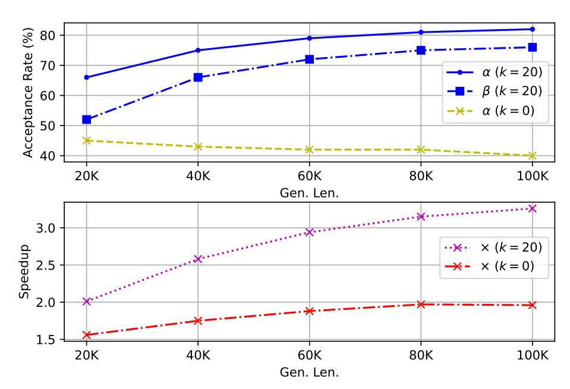

# **3.1. Overview**

The overall framework is depicted in Figure [2.](#page-3-1) TOKENSWIFT generate a sequence of draft tokens with selfdrafting, which are then passed to the target (full) model for validation using a tree-based attention mechanism (See Appendix [E](#page-19-0) for more tree-based attention details). This process ensures that the final generated output aligns with the target model's predictions, effectively achieving lossless acceleration.

TOKENSWIFT is lightweight because the draft model is the target model itself with a partial KV cache. This

> **[图片提取文字 (无描述)]:**
> Multi-token Parallel Self-Drafting Parallel Verification Tree-base Attention Candidates LLM is LLM Sample with the an a FFN is the uncle of [...] He with Partial KV is the uncle \n with ultra long Cache Longest Contex uncle cousin FFN good sequence ... ... Valid tual Penalty is is an good to the Full KV is the father of FFN of father of \n to Cache is the mother of Dynamic KV Budget ... ... Token Reutilization First |S| KV Select |B - S| KV Top-k frequency row id n-gram by Importance 97475 is the father of 5 **\*\*** Frozen 97476 is the mother of Update n-gram Tuned

Figure 2. **Illustration of TokenSwift Framework.** First, target model (LLM) with partial KV cache and three linear layers outputs 4 logits in a single forward pass. Tree-based attention is then applied to construct candidate tokens. Secondly, top-*k* candidate 4-grams are retrieved accordingly. These candidates compose draft tokens, which are fed into the LLM with full KV cache to generate target tokens. The verification is performed by checking if draft tokens match exactly with target tokens (Algorithm 1). Finally, we randomly select one of the longest valid draft tokens, and update *n*-gram table and KV cache accordingly.

eliminates the need to train a separate draft LLM; instead, only  $\gamma$  linear layers need to be trained, where  $\gamma+1^1$  represents the number of logits predicted in a single forward pass. In addition, during the verification process, once we obtain the target tokens from the target model with full KV cache, we directly compare draft tokens with target tokens sequentially to ensure that the process is lossless (He et al., 2024).

## 3.2. Multi-token Generation and Token Reutilization

**Multi-token Self-Drafting** Inspired by Medusa (Cai et al., 2024), we enable the LLM to generate multiple draft tokens in a single forward pass by incorporating  $\gamma$  additional linear layers. However, we empirically note that **the additional linear layers should not be independent of each other**. Specifically, we propose the following structure:

$$h_1 = f_1(h_0) + h_0, \quad h_2 = f_2(h_1) + h_1, \quad h_3 = f_3(h_2) + h_2,$$
  
 $l_0, l_1, l_2, l_3 = g(h_0), g(h_1), g(h_2), g(h_3),$ 

$$(1)$$

where  $h_0$  denotes the last hidden state of LLM,  $f_i(\cdot)$  represents the i-th linear layer,  $h_i$  refers to the i-th hidden representation,  $g(\cdot)$  represents the LM Head of target model, and  $l_i$  denotes output logits. This structure aligns more closely with the AR nature of the model. Moreover, this adjustment incurs no additional computational cost.

**Token Reutilization** Given the relatively low acceptance rate of using linear layers to generate draft tokens, we propose a method named **token reutilization** to further reduce the frequency of model reloads. The idea behind token reutilization is that some phrases could appear frequently, and they are likely to reappear in subsequent generations.

Specifically, we maintain a set of tuples  $\{(\mathcal{G}, \mathcal{F})\}$ , where  $\mathcal{G} = \{x_{i+1}, ..., x_{i+n}\}$  represents an n-gram and  $\mathcal{F}$  denotes its corresponding frequency  $\mathcal{F}$  within the generated token sequence  $S = \{x_0, x_1, ..., x_{t-1}\}$  by time step t ( $t \ge n$ ). After obtaining  $\{p_0, ..., p_3\}$  as described in §3.4, we retrieve the top-k most frequent n-grams beginning with

&lt;sup>1The target model itself can also predict one logit, making the total number of logits  $\gamma + 1$ . We take  $\gamma = 3$ .

token arg max  $p_0$  to serve as additional draft tokens.

Although this method can be applied to tasks with long prefixes, its efficacy is constrained by the limited decoding steps, which reduces the opportunities for accepting *n*-gram candidates. Additionally, since the long prefix text is not generated by the LLM itself, a distributional discrepancy exists between the generated text and the authentic text (Mitchell et al., 2023). As a result, this method is particularly suitable for generating ultra-long sequences.

#### 3.3. Dynamic KV Cache Management

**Dynamic KV Cache Updates** Building upon the findings of Xiao et al. (2024), we preserve the initial |S| KV pairs within the cache during the drafting process, while progressively evicting less important KV pairs. Specifically, we enforce a fixed budget size |B|, ensuring that the KV cache at any given time can be represented as:

$$\mathbf{K}\mathbf{V} = \{(\mathbf{K}_0, \mathbf{V}_0), ..., (\mathbf{K}_{|S|}, \mathbf{V}_{|S|}), (\mathbf{K}_{|S|+1}, \mathbf{V}_{|S|+1}), ..., (\mathbf{K}_{|B|-1}, \mathbf{V}_{|B|-1})\},\$$

where the first |S| pairs remain fixed, and the pairs from position |S| to |B|-1 are ordered by decreasing importance. As new tokens are generated, less important KV pairs are gradually replaced, starting from the least important ones at position |B|-1 and moving towards position |S|. Once replacements extend beyond the |S| position, we recalculate the *importance scores* of all preceding tokens and select the most relevant |B|-|S| pairs to reconstruct the cache. This process consistently preserves the critical information required for ultra-long sequence generation.

**Importance Score of KV pairs** We rank the KV pairs based on the *importance scores* derived from the dot product between the query ( $\mathbf{Q}$ ) and key ( $\mathbf{K}$ ), *i.e.*  $\mathbf{Q}\mathbf{K}^T$ .

In the case of Group Query Attention (GQA), since each **K** corresponds to a group of  $Q = \{\mathbf{Q}_0, ..., \mathbf{Q}_{g-1}\}$ , direct dot-product computation is not feasible. Unlike methods such as SnapKV (Li et al., 2024c), we do not replicate the **K**. Instead, we partition the Q, as shown in Equation (2):

importance scorei = 
$$\sum_{j=i\cdot g}^{((i+1)\cdot g)-1} \mathbf{Q}_j \cdot \mathbf{K}_i,$$
 (2)

where for position i,  $\mathbf{Q}_j$  in the group  $\mathcal{Q}_i$  are dot-product with the same  $\mathbf{K}_i$ , and their results are aggregated to obtain the final *importance score*. This approach enhances memory saving while preserving the quality of the attention mechanism, ensuring that each query is effectively utilized without introducing unnecessary redundancy.

#### 3.4. Contextual Penalty and Random N-gram Selection

**Contextual Penalty** To mitigate repetition in generated text, we have explored various sampling strategies. However, with the significantly larger sequence length, the likelihood of repetition increases significantly (§2). As a result, we decided to apply an additional penalty to the generated tokens to further mitigate repetition.

The penalized sampling approach proposed in (Keskar et al., 2019) suggests applying a penalty to all generated tokens. However, when generating ultra-long sequences, the set of generated tokens may cover nearly all common words, which limits the ability to sample appropriate tokens. Therefore, we propose an improvement to this method.

Specifically, we introduce a fixed *penalty window* W and apply *penalty value*  $\theta$  to the most recent W tokens, denoted as W, generated up to the current position, as illustrated in Equation (3):

$$p_{i} = \frac{\exp\left(l_{i}/(t \cdot I(l_{i}))\right)}{\sum_{j} \exp\left(l_{j}/(t \cdot I(l_{j}))\right)},$$

$$I(l) = \theta \text{ if } l \in \mathbb{W} \text{ else } 1.0, \quad \theta \in (1, \infty),$$

$$(3)$$

where t denotes temperature,  $l_i$  and  $p_i$  represent the logit and probability of i-th token. This adjustment aims to maintain diversity while still mitigating repetitive generation.

#### **Algorithm 1** TOKENSWIFT

**Require:** Prompt p, target model M, decoding tree T, n-gram candidate number k; max budget size |B| of partial cache, cache initial size |S|.

- 1: Prefill target model with KV cache  $C_{full} \leftarrow Prefill_M(\mathbf{p})$ , s.t.  $|C_{full}| = \text{len}(\mathbf{p})$ ;
- 2: Prefill partial KV cache  $C_p \leftarrow \{C_{full}[0:|S|], \text{Top-K}_{|B|-|S|}(C_{full})\}$  w.r.t Equation (2), where  $|C_p| = |B|$ ;
- 3:  $st \leftarrow 0, e \leftarrow \text{len}(\mathbf{p})$ .
- 4: **while**  $st \leq target length$ **do**
- 5: **if**  $(|C_{full}| e) > |B| |S|$  **then**
- 6: **Dynamic KV Cache Update:**  $C_p \leftarrow \{C_{full}[:|S|], \text{Top-}K_{|B|-|S|}(C_{full})\}, e \leftarrow |C_{full}|.$
- 7: end if
- 8: **Multi-token Parallel Generation:** Get penalized probability  $p_{\leq 3}^2$  with partial cache  $C_p$ .
- 9: **Tree-based Attention:** Construct g groups of candidate draft tokens  $\{x_{\leq 3}^i\}_{i=1}^g$  using decoding tree T and  $p_{\leq 3}$ .
- 10: **Token Reutilization:** Select k n-gram candidates  $\{a_{\leqslant 3}^i\}_{i=1}^k$  with highest frequency, where  $a_0 = \arg\max p_0$  (§3.2).
- 11: **Parallel Verification:** Let draft tokens  $\{d^i\}_{i=1}^{k+g} := \{a_{\leqslant 3}^i\}_{i=1}^k \cup \{x_{\leqslant 3}^i\}_{i=1}^g$ , and send  $\{d\}$  to M to get penalized verification probabilities  $\{q^i\}_{i=1}^{k+g}$ .
- 12: Sample target tokens  $\{y^i\}_{i=1}^{k+g} \sim \{q^i\}_{i=1}^{k+g}$ .
- 13: Random select the longest accepted length of draft tokens  $d_{\leq m}^j \in \{d_{\leq m} | d_{\leq m}^i = y_{\leq m}^i\}_{i=1}^{k+g}$  by exactly match.
- 14: Let  $st \leftarrow st + \text{len}(y^i)$ ; yield:  $y^i$
- 15: Evict  $C_p$  to ensure the size of  $C_p$  is |B| and update  $C_{full}$ .
- 16: end while

**Random** *n***-gram Selection** In our experiments, we observe that the draft tokens provided to the target model for parallel validation often yield multiple valid groups. Building on this observation, we randomly select one valid *n*-gram to serve as the final output. By leveraging the fact that multiple valid *n*-grams emerge during verification, we ensure that the final output is both diverse and accurate.

In summary, the overall flow of our framework is presented in Algorithm 1.

## 4. Experiments

In this section, we demonstrate the capability of TOKENSWIFT in accelerating ultra-long sequences generation.

#### 4.1. Setup

We conduct experiments on a variety of models, including YaRN-LLaMA2-7b-128k (Peng et al., 2024), LLaMA3.1-8b (AI@Meta, 2024) and Qwen2.5-(1.5b,7b,14b) (Qwen et al., 2025). For all models, we use the **Base** version, as the output length of Instruct version is limited (Bai et al., 2024). The inference experiments are performed on the test set of PG-19 (Rae et al., 2020).

**Training and Inference Details** We train linear layers in Section 3.2 using the first 8K tokens of training data, for datasets longer than 8K tokens, from PG-19 (Rae et al., 2020). The number of extra decoding heads is set to 3 across all models.

Inference is performed on a single NVIDIA A100-SXM4-80GB. When generating 100K tokens, the models are prefilled with 2K, 4K or 8K tokens as prompt from a random sample of the PG-19 test set (See Appendix F.2 for ablation on prefill length). The maximum budget of the partial cache is determined by the length of the prompt. For further training and inference details, please refer to Appendix B.

**Evaluation Metrics** We evaluate the overall *acceptance rate* and *speedup* for all methods. Unlike Leviathan et al.  $(2023)^3$ , our *acceptance rate*  $\alpha$  is defined as:

&lt;sup>2The subscript  $\leq$  3 here denotes a tuple with indices 0, 1, 2, 3. The notation will be used similarly hereafter.

&lt;sup>3The two can be converted into each other through computation.

*Table 3.* Experimental results for LLaMA2 and LLaMA3.1 under varying prefix lengths, generating sequences from 20K to 100K tokens.  $\alpha$  denotes the *acceptance rate* of all draft tokens (Equation (4)), while  $\times$  represents the *speedup* ratio relative to AR (Equation (5)). TriForce\* refers to our improved version, and Medusa\* indicates the model we retrained (§4.1).

|            |           | Prefill L     | en. 2048          | Prefill L       | en. 4096          | Prefill L       | en. 8192          | Prefill I       | en. 2048          | Prefill I       | en. 4096          | Prefill I       | en. 8192          |
|------------|-----------|---------------|-------------------|-----------------|-------------------|-----------------|-------------------|-----------------|-------------------|-----------------|-------------------|-----------------|-------------------|
| Method     | Gen. Len. |               | YaR               | N-LLaMA2-7      | 7b-128k (MI       | HA)             |                   |                 |                   | LLaMA3.1        | -8ь (GQA)         |                 |                   |
|            |           | α             | ×(>1)             | α               | ×(>1)             | α               | ×(>1)             | α               | ×(>1)             | α               | ×(> 1)            | α               | ×(>1)             |
| Medusa*    |           | 0.43          | 0.96              | 0.39            | 0.85              | 0.40            | 0.83              | 0.35            | 1.20              | 0.39            | 1.29              | 0.34            | 1.21              |
| TriForce*  | 20K       | 0.80          | 1.50              | 0.89            | 1.51              | 0.92            | 1.36              | 0.89            | 1.13              | 0.89            | 1.08              | 0.99            | 1.16              |
| TOKENSWIFT |           | 0.73±0.09     | <b>2.11</b> ±0.14 | $0.68 \pm 0.09$ | <b>2.02</b> ±0.20 | $0.64{\pm}0.08$ | <b>1.91</b> ±0.12 | $0.64\pm0.08$   | <b>1.87</b> ±0.17 | $0.65 \pm 0.07$ | <b>1.93</b> ±0.18 | $0.72\pm0.09$   | <b>1.99</b> ±0.20 |
| Medusa*    |           | 0.52          | 1.08              | 0.42            | 0.86              | 0.43            | 0.88              | 0.35            | 1.26              | 0.40            | 1.39              | 0.34            | 1.26              |
| TriForce*  | 40K       | 0.84          | 1.64              | 0.93            | 1.67              | 0.96            | 1.49              | 0.93            | 1.18              | 0.94            | 0.99              | 0.99            | 1.18              |
| TOKENSWIFT |           | 0.82±0.06     | <b>2.60</b> ±0.05 | $0.79 \pm 0.06$ | <b>2.56</b> ±0.09 | $0.79{\pm0.05}$ | <b>2.50</b> ±0.07 | $0.72 \pm 0.07$ | <b>2.39</b> ±0.16 | $0.73 \pm 0.08$ | <b>2.47</b> ±0.22 | $0.81 \pm 0.10$ | <b>2.54</b> ±0.22 |
| Medusa*    |           | 0.59          | 1.18              | 0.47            | 0.95              | 0.45            | 0.91              | 0.35            | 1.29              | 0.40            | 1.42              | 0.34            | 1.29              |
| TriForce*  | 60K       | 0.85          | 1.76              | 0.95            | 1.83              | 0.97            | 1.62              | 0.94            | 1.21              | 0.95            | 0.96              | 1.00            | 1.19              |
| TOKENSWIFT |           | $0.87\pm0.04$ | <b>2.92</b> ±0.04 | $0.85 \pm 0.04$ | <b>2.89</b> ±0.06 | $0.85 \pm 0.04$ | <b>2.84</b> ±0.05 | $0.75\pm0.06$   | <b>2.73</b> ±0.13 | $0.79 \pm 0.06$ | <b>2.88</b> ±0.17 | $0.85 \pm 0.08$ | <b>2.93</b> ±0.17 |
| Medusa*    |           | 0.61          | 1.17              | 0.51            | 0.99              | 0.47            | 0.93              | 0.35            | 1.30              | 0.40            | 1.43              | 0.34            | 1.29              |
| TriForce*  | 80K       | 0.84          | 1.86              | 0.95            | 1.98              | 0.97            | 1.74              | 0.95            | 1.23              | 0.95            | 0.94              | 1.00            | 1.21              |
| TOKENSWIFT |           | 0.89±0.03     | <b>3.13</b> ±0.04 | $0.88 \pm 0.04$ | <b>3.10</b> ±0.06 | $0.88 \pm 0.03$ | <b>3.05</b> ±0.03 | $0.77 \pm 0.04$ | <b>2.96</b> ±0.07 | $0.82 \pm 0.06$ | <b>3.13</b> ±0.16 | $0.88 \pm 0.07$ | <b>3.19</b> ±0.13 |
| Medusa*    |           | 0.62          | 1.15              | 0.52            | 0.99              | 0.47            | 0.91              | 0.35            | 1.31              | 0.41            | 1.45              | 0.34            | 1.29              |
| TriForce*  | 100K      | 0.82          | 1.94              | 0.96            | 2.14              | 0.97            | 1.86              | 0.95            | 1.25              | 0.96            | 0.92              | 0.99            | 1.22              |
| TokenSwift |           | 0.90±0.02     | <b>3.25</b> ±0.05 | $0.90 \pm 0.03$ | <b>3.23</b> ±0.06 | $0.90 \pm 0.02$ | <b>3.20</b> ±0.02 | 0.79±0.03       | <b>3.13</b> ±0.07 | $0.84 \pm 0.05$ | <b>3.27</b> ±0.19 | $0.90 \pm 0.06$ | <b>3.38</b> ±0.10 |

$$\alpha = \frac{\sum_{i=1}^{T} a_i}{(\gamma + 1) \times T'} \tag{4}$$

where  $a_i$  represents the number of tokens accepted at the i-th time step,  $\gamma + 1$  denotes the number of draft tokens generated at each time step, and T represents the total number of time steps. The *speedup* is denotes as  $\times$ , which is the ratio of AR latency to TOKENSWIFT latency, given by:

$$\times = \frac{\text{latency}_{AR}}{\text{latency}_{\text{TOKENSWIFT}}},$$
(5)

where latency refers to the average time required to generate a single token.

We use *Distinct-n* (Li et al., 2016) to measure the diversity of generated content, *i.e.*, repetition. A higher value indicates greater diversity and lower repetition (Table 6).

**Baselines** We compare TOKENSWIFT with two baselines: **TriForce\***: The original TriForce (Sun et al., 2024a) employs a static KV update strategy, which cannot accelerate the generation of 100K tokens. The results in Table 3 correspond to our improved version of TriForce, which incorporates dynamic KV update 4. **Medusa\***: To ensure losslessness, we adopt the Medusa (Cai et al., 2024) training recipe and incorporate the verification method of TOKENSWIFT. Both Medusa heads and tree structure are consistent with TOKENSWIFT.

The recent released MagicDec (Chen et al., 2024a) primarily focuses on acceleration for large throughput, and when the batch size is 1, LLaMA3.1-8b does not exhibit any acceleration for short text generation, let alone for ultra-long sequences. Therefore, it is excluded from our baseline.

#### 4.2. Main Results

The experimental results are presented in Table 3 and Table 4. We evaluate TokenSwift at different generation lengths of 20K, 40K, 60K, 80K and 100K, reporting  $speedup \times and acceptance \ rate \ \alpha$  by taking the average and standard deviation of 5 experiments to avoid randomness. Notably, the results for TokenSwift and Medusa\* show a balanced trade-off between speed and quality, in contrast to TriForce\*, which suffers from low quality due to the absence of any repetition penalty.

**TOKENSWIFT significantly outperforms all baselines across generation lengths.** As shown in Table 3, across all lengths, TOKENSWIFT demonstrates superior acceleration performance compared to all baselines on models with

&lt;sup>4To compare with LLaMA3.1-8b, we pretrained a draft model based on LLaMA3.1-8b. See Appendix ℂ for details.

*Table 4.* Experimental results of TOKENSWIFT for Qwen2.5 across different scales under prefix length 4096, generating sequences from 20K to 100K tokens.  $T_{AR}$  and  $T_{TOKENSWIFT}$  denote the actual time required (in minutes) for AR and TOKENSWIFT, respectively.  $\Delta_T$  represents the number of minutes saved by TOKENSWIFT compared to AR.

| Gen. Len. |                 | Q                                | wen2.5-  | 1.5B             |            |                 | Ç                            | wen2.5   | -7B              | Qwe        |                 |                              | wen2.5-  | ven2.5-14B       |            |
|-----------|-----------------|----------------------------------|----------|------------------|------------|-----------------|------------------------------|----------|------------------|------------|-----------------|------------------------------|----------|------------------|------------|
| Gen. Len. | α               | $\times (>1)$                    | $T_{AR}$ | $T_{TOKENSWIFT}$ | $\Delta_T$ | α               | ×(>1)                        | $T_{AR}$ | $T_{TOKENSWIFT}$ | $\Delta_T$ | α               | ×(>1)                        | $T_{AR}$ | $T_{TOKENSWIFT}$ | $\Delta_T$ |
| 20K       | $0.69 \pm 0.11$ | $1.69{\scriptstyle\pm0.17}$      | 12.00    | 7.20             | -4.80      | $0.64 \pm 0.07$ | $2.00 \pm 0.16$              | 15.60    | 7.80             | -7.80      | $0.67 \pm 0.06$ | $2.12{\scriptstyle\pm0.13}$  | 29.40    | 13.80            | -15.60     |
| 40K       | $0.80 \pm 0.06$ | $2.31 \!\pm\! 0.09$              | 36.00    | 15.60            | -20.40     | $0.77\pm0.05$   | $2.64{\pm}0.10$              | 47.40    | 18.00            | -29.40     | $0.78\pm0.03$   | $2.68{\pm0.10}$              | 89.40    | 33.60            | -55.80     |
| 60K       | $0.85 \pm 0.04$ | $2.69{\pm0.07}$                  | 73.80    | 27.60            | -46.20     | $0.78\pm0.08$   | $2.86{\scriptstyle\pm0.25}$  | 95.40    | 33.60            | -61.80     | $0.82\pm0.02$   | $3.01{\pm0.13}$              | 184.20   | 61.20            | -123.00    |
| 80K       | $0.87 \pm 0.03$ | $2.95{\pm0.06}$                  | 124.20   | 42.00            | -82.20     | $0.80\pm0.09$   | $3.07{\pm0.30}$              | 161.40   | 52.80            | -108.60    | $0.83\pm0.02$   | $3.20{\pm0.13}$              | 312.60   | 97.80            | -214.80    |
| 100K      | $0.89\pm0.07$   | $\boldsymbol{3.13} \!\pm\! 0.07$ | 187.80   | 60.00            | -127.80    | $0.82\pm0.09$   | $\textbf{3.23} \!\pm\! 0.28$ | 244.20   | 75.60            | -168.60    | $0.84\pm0.02$   | $\textbf{3.34} \!\pm\! 0.10$ | 474.60   | 142.20           | -332.40    |

> **[图片提取文字 (无描述)]:**
> Acceptance Rate (%) 80 70  $\alpha (k = 20)$ -  $\beta$  (k = 20) 60  $-\times$  -  $\alpha$  (k=0)50 40 40K 80K 20K 100K 60K Gen. Len. 3.0  $\cdot \cdot \times \cdot \times (k = 20)$ Speedup 2.5  $\rightarrow$  × (k=0)2.0 1.5 20K 40K 100K 80K 60K Gen. Len.

*Figure 3.* Upper: The *acceptance rate*  $\alpha$  for k = 20 and k = 0, along with the *n-gram acceptance rate*  $\beta$  for k = 20, plotted against varying generation lengths. Lower: The *speedup*  $\times$  achieved at different generation lengths.

different architectures (MHA, GQA). Moreover, TOKENSWIFT demonstrates remarkable robustness, showing virtually no impact when tested with varying prefix lengths.

**Longer generations amplify the speedup benefits.** As the generation length increases, the speed improvement of TOKENSWIFT becomes increasingly evident. Two key factors drive this trend: **Firstly**, AR experiences longer KV cache loading times as the number of tokens grows, whereas TOKENSWIFT mitigates this issue by utilizing dynamic KV pruning. **Secondly**, the acceptance rate improves as the number of tokens increases, primarily due to the higher *n*-grams acceptance rate. As the *n*-grams pool composed of generated tokens grows larger, the candidate *n*-grams become more diverse and accurate (Figure 3).

**Larger models yield greater speedup benefits.** The impact of frequent model reloading varies with model scale, as larger models require more time due to the increased parameters. As shown in Table 4, TOKENSWIFT demonstrates robust performance across models of different scales, with the acceleration advantage becoming more pronounced for larger models. In particular, when generating 100K tokens, TOKENSWIFT saves up to **5.54** hours for 14B model.

#### 4.3. Ablation Studies

We conduct comprehensive ablation studies on TOKENSWIFT using LLaMA3.1-8b. For all experiments, the prefix length is 4096.

#### 4.3.1. TOKEN REUTILIZATION

We define the *n*-gram acceptance rate  $\beta$  similarly to Equation (4). Let  $a'_i$  denote the length of accepted *n*-gram candidate at iteration *i*. Then  $\beta$  is given by:

$$\beta = \frac{\sum_{i=1}^{T} b_i}{(\gamma + 1) \times T'}, \quad \text{where, } b_i = \begin{cases} a'_i, & a'_i = a_i \\ 0, & a'_i < a_i \end{cases}.$$
 (6)

From Figure 3, we observe that removing token reutilization (k=0) leads to a significant decrease in both acceptance rate  $\alpha$  and speedup  $\times$ . Furthermore, as the generation length increases, the acceptance rate  $\alpha$  for k=0 slightly drops. This trend stems from the fact that, in ultra-long sequences, the KV cache cannot be compressed indefinitely. In contrast, TOKENSWIFT (k=20) shows an increasing acceptance rate as the sequence length grows, demonstrating the effectiveness of token reutilization in **reducing the frequency of model reloading**.

*Table 5.* The ablation experiment results on *KV management*.

| Gen. Len. |       | Full Cache | Partial Cache | Dynamic Partial Cache |
|-----------|-------|------------|---------------|-----------------------|
| 20K       | α     | 0.42       | 0.19          | 0.45                  |
| 20K       | ×(>1) | 1.36       | 0.94          | 1.56                  |
| 40K       | α     | 0.42       | 0.16          | 0.43                  |
| 40K       | ×(>1) | 1.42       | 1.03          | 1.75                  |
| 60K       | α     | 0.42       | 0.18          | 0.42                  |
| OUK       | ×(>1) | 1.45       | 1.19          | 1.88                  |
| 80K       | α     | 0.42       | 0.19          | 0.42                  |
| OUK       | ×(>1) | 1.46       | 1.31          | 1.97                  |
| 100K      | α     | 0.42       | 0.21          | 0.40                  |
| 100K      | ×(>1) | 1.47       | 1.44          | 1.96                  |

Table 6. The ablation experiment results on *contextual penalty* using different sampling methods. Light cell represents the settings adopted by TOKENSWIFT. We take  $\theta = 1.2, W = 1024$ .

|                  | Distinct-1 | Distinct-2 | Distinct-3 | Distinct-4 | AVG. | ×    |
|------------------|------------|------------|------------|------------|------|------|
| top-p            | 0.15       | 0.25       | 0.29       | 0.31       | 0.25 | 3.42 |
| w/o. penalty     | 0.09       | 0.15       | 0.18       | 0.20       | 0.16 | 3.53 |
| $\eta$ -sampling | 0.25       | 0.43       | 0.49       | 0.53       | 0.43 | 3.42 |
| w/o. penalty     | 0.06       | 0.10       | 0.12       | 0.13       | 0.11 | 3.57 |
| min-p            | 0.41       | 0.71       | 0.81       | 0.82       | 0.69 | 3.27 |
| w/o. penalty     | 0.07       | 0.11       | 0.14       | 0.15       | 0.12 | 3.58 |

#### 4.3.2. DYNAMIC KV UPDATES

To evaluate the effectiveness of TOKENSWIFT's dynamic KV update policy, we experiment with three different strategies of managing KV cache during drafting:

- Full Cache: Retaining full KV cache throughout drafting.
- Partial Cache: Updating partial KV cache only once during the prefill phase.
- Dynamic Partial Cache: Dynamically updating KV cache as described in §3.3

For a fair comparison, token reutilization is disabled (*i.e.* k = 0). As shown in Table 5, Partial Cache leads to a low acceptance rate, resulting in reduced speedup. While Full Cache achieves a higher acceptance rate, its computational overhead negates the speedup gains. In contrast, Dynamic Partial Cache adopted by TOKENSWIFT strikes a balanced trade-off, achieving both high acceptance rate and significant speedup. As a result, Dynamic Partial Cache can **effectively manage partial KV under ultra-long sequence generation.** 

#### 4.3.3. CONTEXTUAL PENALTY

As an orthogonal method to min-p, top-p, and  $\eta$ -sampling for mitigating the repetition, *contextual penalty* demonstrates effectiveness across different sampling methods.

As shown in Table 6, without *contextual penalty*, the diversity of generated sequences is significantly lower for all sampling methods. The most striking improvement emerges in min-*p* sampling (See Appendix D for more sampling details), where the average Distinct-*n* score surges from 0.12 to 0.69 with only an 8% compromise in speedup. These results clearly highlight the impact of contextual penalty in **mitigating repetitive token generation**. It can seamlessly integrate with existing sampling methods to enhance the quality of ultra-long sequence generation.

In addition, we can find that the higher the diversity, the lower the *speedup*. Therefore, if TriForce is combined with *context penalty*, the *speedup* in Table 3 will drop further.

> **[图片提取文字 (无描述)]:**
> Acceptance Rate (%)  $\alpha$ k 3.5 ··×· × Speedup 3.0 2.5 2.0 k

*Figure 4.* Upper: The *acceptance rate*  $\alpha$  and *n-gram acceptance rate*  $\beta$  versus varying k. Lower: The *speedup*  $\times$  versus varying k.

Table 7. Acceptance rate  $\alpha$  (k = 0) and speedup  $\times$  across different tree configurations. Each configuration is represented by a 4-digit array: they represent the number of candidates for different decoding heads in §3.2.

| Gen. Len. |                                                       | [3,3,3,3]    | [1,9,9,9]    | [1,3,3,3] (Ours) |
|-----------|-------------------------------------------------------|--------------|--------------|---------------------|
| 20K       | $\begin{vmatrix} \alpha \\ \times (>1) \end{vmatrix}$ | 0.44 1.34 | 0.50 0.53 | 0.45 <b>1.56</b> |
| 40K       | $\begin{vmatrix} \alpha \\ \times (>1) \end{vmatrix}$ | 0.43 1.58 | 0.52 0.67 | 0.43 <b>1.75</b> |
| 60K       | α   ×(> 1)                                         | 0.43 1.75 | 0.53 0.78 | 0.42 <b>1.88</b> |
| 80K       | α ×(>1)                                            | 0.43 1.85 | 0.55 0.88 | 0.42 <b>1.97</b> |
| 100K      | $\begin{vmatrix} \alpha \\ \times (>1) \end{vmatrix}$ | 0.42 1.91 | 0.57 0.96 | 0.40 <b>1.96</b> |

*Table 8.* Distinct-n score across different penalty value  $\theta$ . 1.0 indicate that no penalty is applied. We take W = 1024 (See Appendix F.3 for ablation on W).

| θ   | Distinct-1 | Distinct-2 | Distinct-3 | Distinct-4 | AVG. |
|-----|------------|------------|------------|------------|------|
| 1.0 | 0.07       | 0.11       | 0.14       | 0.15       | 0.12 |
| 1.1 | 0.08       | 0.13       | 0.15       | 0.16       | 0.13 |
| 1.2 | 0.41       | 0.71       | 0.81       | 0.82       | 0.69 |
| 1.3 | 0.57       | 0.86       | 0.93       | 0.95       | 0.83 |
| 1.4 | 0.52       | 0.73       | 0.76       | 0.77       | 0.70 |
| 1.5 | 0.74       | 0.96       | 0.98       | 0.99       | 0.92 |

#### 4.4. Discussions

In this section, we explore the effects of different hyperparameters on TOKENSWIFT.

#### 4.4.1. Tree Configuration

Due to the time-consuming nature of finding the optimal tree in Medusa (Cai et al., 2024) and its limited impact on accelerating ultra-long sequences generation, we employ a simple 3-ary tree in tree attention. See Appendix B for the tree structure.

As shown in Table 7, [1,9,9,9] has the highest acceptance rate but the lowest speedup. This is because more candidates increase the acceptance rate, but also increase the verification burden. Similarly, by comparing [1,3,3,3] and [3,3,3,3], we can find that the first head (*i.e.*, the original head of target model) achieves relatively high prediction accuracy when using KV compression, so choosing the top-1 token as candidate is sufficient. To balance the trade-off of acceptance rate and verification efficiency, we adopt [1,3,3,3] as the configuration of TOKENSWIFT.

## 4.4.2. N-GRAM CANDIDATES

As illustrated in Figure [4,](#page-9-1) increasing *k* enhances the *n-gram acceptance rate β* due to a larger pool of *n*-gram candidates. However, an excessive number of candidates can strain the verification process, leading to reduced *speedup* ˆ.

Interestingly, a lower *k* does not always result in a lower *β*. For instance, *k* = 5 achieves a higher *β* than *k* = 20, resulting in both a higher *acceptance rate α* and greater *speedup* ˆ. However, at *k* = 5, the lack of diversity among the candidates leads to increased repetition, which in turn degrades the quality of generation.

## 4.4.3. PENALTY VALUE *θ*

As a key component of TOKENSWIFT, *contextual penalty* significantly reduces repetition in generated text. We examine the effect of two parameters present in contextual penalty, *i.e*. penalty value *θ* and penalty window *W*.

Table [8](#page-9-0) presents the impact of introducing contextual penalty on diversity. Without any penalty (*θ* = 0), the generated sequences exhibit severe repetition, with an average Distinct-*n* score of only **0.12**. As the value of *θ* increases gradually to 1.2, the diversity improves significantly, highlighting the effectiveness of contextual penalty in enhancing the diversity of ultra-long sequence generation.

## 4.4.4. CASE STUDY

Figure [5](#page-11-0) presents a case study on the impact of the *contextual penalty*. Without the Contextual Penalty, repetitions appear at about 5K tokens, compared to 60K with the penalty applied. Additionally, generation without the penalty exhibits word-for-word repetition, whereas generation with the penalty primarily demonstrates semanticlevel repetition, highlighting its effectiveness in mitigating redundancy.

