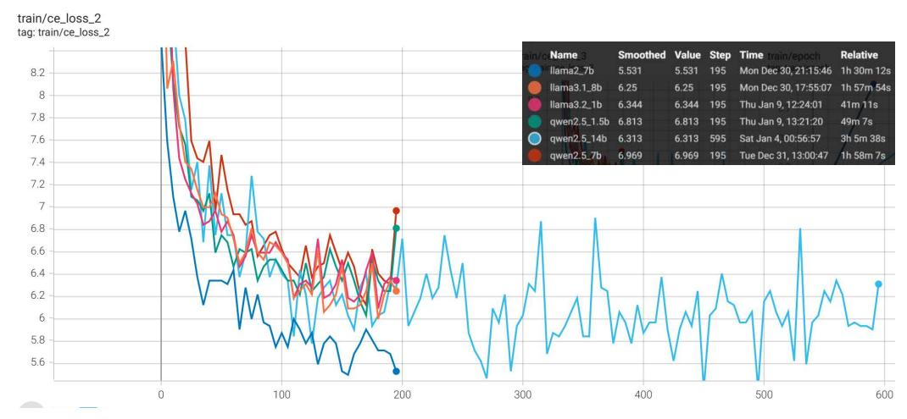

# **D. Different Sampling Method**

## **D.1. Introduction of Different Sampling Algorithms**

Given a probability distribution *P*(*xt* |*x*1, *x*2, . . . , *xt*´1) over the vocabulary V at position *t*, top-*p* sampling [\(Holtz](#page-13-4)[man et al.,](#page-13-4) [2020\)](#page-13-4) first sorts the tokens in descending order of their probabilities. It then selects the smallest set of tokens whose cumulative probability exceeds a predefined threshold *p*, where *p* P (0, 1]. Formally, let V*p* Ă V be the smallest set such that:

$$\sum_{v\in\mathcal{V}_p} P(x_t=v|x_1,x_2,\ldots,x_{t-1}) \geqslant p.$$

The next token *x*ˆ*t* is then randomly sampled from this reduced set V*p* according to the renormalized probabilities:

$$\hat{x}_t \sim \frac{P(x_t = v | x_1, \dots, x_{t-1})}{\sum_{v' \in \mathcal{V}_p} P(x_t = v' | x_1, \dots, x_{t-1})} \text{ for } v \in \mathcal{V}_p.$$

[Nguyen et al.](#page-14-5) [\(2024\)](#page-14-5) introduced min-p sampling, which uses a relative probability threshold *pbase* P (0, 1] to scale the maximum token probability *pmax* to determine the absolute probability threshold *pscaled*. Sampling is then performed on tokens with probability greater than or equal to *pscaled*.

Formally, given the maximum probability over the token distribution *pmax* = max*v*PV *P*(*xt* = *v*|*x*1, *x*2, . . . , *xt*´1), the absolute probability threshold *pscaled* is calculated as:

$$p_{scaled} = p_{base} \times p_{max}.$$

The sampling pool V*min* is then defined as the set of tokens whose probability is greater than or equal to *pscaled*:

$$\mathcal{V}_{min} = \{ v \in \mathcal{V} \mid P(v|x_1, x_2, \dots, x_{t-1}) \geqslant p_{scaled} \}.$$

Finally, the next token *x*ˆ*t* is randomly sampled from the set V*min* according to the normalized probabilities:

$$\hat{x}_t \sim \frac{P(v|x_1,\ldots,x_{t-1})}{\sum_{v' \in \mathcal{V}_{min}} P(v'|x_1,\ldots,x_{t-1})} \text{ for } v \in \mathcal{V}_{min}.$$

The sampling pool of *η*-sampling [\(Hewitt et al.,](#page-13-5) [2022\)](#page-13-5) is defined as

$$V_{\eta} = \{ v \in V \mid P(v|x_1, x_2, \dots, x_{t-1}) \ge \eta \},$$
  

$$\eta = \min \left( \epsilon, \alpha \exp(-h_{\theta, x_{< i}}) \right).$$

where *hθ*,*x*ă*i* is the entropy of *P*(V|*x*1, *x*2, . . . , *xt*´1), *α* and *ϵ* are hyperparameters.

#### **D.2. Impact of Different Sampling Algorithms**

We also explored the impact of different sampling algorithms with disable token reutilization, including top-*p* sampling [\(Holtzman et al.,](#page-13-4) [2020\)](#page-13-4), min-*p* sampling [\(Nguyen et al.,](#page-14-5) [2024\)](#page-14-5), and *η*-sampling [\(Hewitt et al.,](#page-13-5) [2022\)](#page-13-5). As summarized in Table [12,](#page-20-0) TOKENSWIFT consistently demonstrates strong robustness across these methods. This versatility underscores its compatibility with a wide range of decoding strategies, making it suitable for diverse applications and use cases.

## **E. Tree-Based Attention**

Tree attention is a mechanism designed to process multiple candidate continuations during speculative decoding efficiently. Instead of selecting a single continuation as in traditional methods, tree attention leverages multiple candidates to increase the expected acceptance length in each decoding step, balancing computational demands and performance.

| Gen. Len. |        | top-p (p = 0.9) | min-p (p = 0.1) | η-sampling (ϵ =2e-4) |
|-----------|--------|--------------------|--------------------|-------------------------|
| 20K       | α      | 0.68               | 0.66               | 0.56                    |
|           | ˆ(ą 1) | 2.10               | 2.01               | 1.85                    |
| 40K       | α      | 0.81               | 0.75               | 0.71                    |
|           | ˆ(ą 1) | 2.80               | 2.58               | 2.59                    |
| 60K       | α      | 0.84               | 0.79               | 0.78                    |
|           | ˆ(ą 1) | 3.07               | 2.94               | 2.99                    |
| 80K       | α      | 0.86               | 0.81               | 0.81                    |
|           | ˆ(ą 1) | 3.28               | 3.15               | 3.24                    |
| 100K      | α      | 0.87               | 0.82               | 0.84                    |
|           | ˆ(ą 1) | 3.42               | 3.26               | 3.42                    |

Table 12. Ablation results on various sampling methods with disable token reutilization.

The mechanism uses a tree structure where each branch represents a unique candidate continuation. For example, if two heads generate top-2 and top-3 predictions, the Cartesian product of these predictions results in 6 candidates, forming a tree with 6 branches. Each token in the tree attends only to its predecessors, and an attention mask ensures that this constraint is upheld. Positional indices are also adjusted to align with the tree structure.

The tree structure is constructed by taking the Cartesian product of the predictions across all heads. If head *k* has *sk* top predictions, then the tree structure consists of all possible combinations of predictions across the heads. Each combination forms a unique branch in the tree.

Let the total number of candidates (i.e., branches) in the tree be denoted as *C*, which is the product of the number of predictions for each head:

$$C = \prod_{k=1}^{K} s_k.$$

Each candidate is a distinct sequence of tokens formed by selecting one token from each set of predictions from the heads.

To ensure that tokens only attend to their predecessors (tokens generated earlier in the continuation), an attention mask is applied. The attention mask for the tree structure ensures that for each token at level *k*, it can attend only to tokens in levels t0, 1, . . . , *k* ´ 1u. This guarantees that each token's attention is directed solely towards its predecessors in the tree.

Formally, the attention mask *Mk* for each token at level *k* is defined as:

$$M_k(i,j) = \begin{cases} 1 & \text{if token } j \text{ is a predecessor of token } i, \\ 0 & \text{otherwise.} \end{cases}$$

where *Mk* (*i*, *j*) = 1 means that the token at position *j* can attend to the token at position *i*, and *Mk* (*i*, *j*) = 0 means no attention is allowed from *j* to *i*.

## **F. More Ablation Experiments**

## **F.1. Ablation of Temperature**

Table [13](#page-21-1) presents the results of an ablation experiment investigating the effect of varying temperature settings on the generation length, acceptance rate, and speedup during text generation. The experiment uses top-*p* sampling with a fixed *p* of 0.9 and evaluates generation lengths ranging from 20K to 100K tokens, with temperature values spanning from 0.4 to 1.2.

From the results, it is evident that as temperature increases, acceptance rate generally decreases across all generation lengths. Specifically, acceptance rate drops from 0.79 at a temperature of 0.4 to 0.52 at a temperature of 1.2 for 20K-length generation, and a similar trend is observed for longer sequences. This suggests that higher temperatures result in more diverse but less accurate output. On the other hand, speedup tends to remain relatively stable or slightly decrease with higher temperatures. The highest speedups, reaching around 3.4, are observed across all generation lengths with temperatures around 0.6 and 1.0, indicating that moderate temperature settings offer the best balance between speed and quality.

| Gen. Len. |        | 0.4  | 0.6  | 0.8  | 1.0  | 1.2  |
|-----------|--------|------|------|------|------|------|
| 20K       | α      | 0.79 | 0.84 | 0.56 | 0.68 | 0.52 |
|           | ˆ(ą 1) | 2.25 | 2.34 | 1.80 | 2.10 | 1.72 |
| 40K       | α      | 0.85 | 0.88 | 0.73 | 0.81 | 0.69 |
|           | ˆ(ą 1) | 2.76 | 2.80 | 2.60 | 2.80 | 2.52 |
| 60K       | α      | 0.87 | 0.89 | 0.80 | 0.84 | 0.77 |
|           | ˆ(ą 1) | 3.07 | 3.10 | 3.05 | 3.07 | 2.96 |
| 80K       | α      | 0.88 | 0.90 | 0.83 | 0.86 | 0.81 |
|           | ˆ(ą 1) | 3.26 | 3.29 | 3.29 | 3.28 | 3.22 |
| 100K      | α      | 0.89 | 0.90 | 0.85 | 0.87 | 0.83 |
|           | ˆ(ą 1) | 3.39 | 3.41 | 3.45 | 3.42 | 3.42 |

Table 13. Ablation results on varying temperatures. Using top-*p* sampling, with *p* set to 0.9.

## **F.2. Ablation of Prefill Length**

We disable token reutilization and conduct ablation study on the different prefix length, as shown in Table [14.](#page-21-2) The experiment explores the impact of varying prefix lengths on the generation of sequences of different lengths (from 20K to 100K). The results include two key metrics: acceptance rate (*α*) and speedup factor (ˆ).

As the prefix length increases, the acceptance rate tends to stabilize, generally hovering around 0.35 to 0.39 across different sequence lengths, with a slight fluctuation depending on the specific prefix length. This suggests that while the acceptance rate does not dramatically change with longer sequences, it remains relatively consistent.

| Prefill Len. | 20K  |      | 40K  |      | 60K  |      | 80K  |      | 100K |      |
|--------------|------|------|------|------|------|------|------|------|------|------|
|              | α    | ˆ    | α    | ˆ    | α    | ˆ    | α    | ˆ    | α    | ˆ    |
| 2048         | 0.35 | 1.41 | 0.35 | 1.63 | 0.35 | 1.76 | 0.35 | 1.83 | 0.34 | 1.87 |
| 3072         | 0.31 | 1.23 | 0.31 | 1.42 | 0.31 | 1.55 | 0.31 | 1.64 | 0.30 | 1.69 |
| 4096         | 0.35 | 1.32 | 0.35 | 1.54 | 0.35 | 1.69 | 0.35 | 1.76 | 0.35 | 1.85 |
| 5120         | 0.32 | 1.29 | 0.31 | 1.46 | 0.31 | 1.57 | 0.31 | 1.65 | 0.31 | 1.70 |
| 6144         | 0.39 | 1.46 | 0.39 | 1.66 | 0.39 | 1.80 | 0.39 | 1.88 | 0.39 | 1.94 |
| 7168         | 0.36 | 1.42 | 0.37 | 1.62 | 0.36 | 1.74 | 0.36 | 1.82 | 0.36 | 1.88 |
| 8192         | 0.36 | 1.21 | 0.36 | 1.42 | 0.36 | 1.58 | 0.36 | 1.69 | 0.36 | 1.77 |

Table 14. Ablation results on different prefill length disable token reutilization.

In terms of speedup, it shows that with longer prefix lengths, the model achieves progressively higher acceleration. For instance, a prefix length of 2048 achieves a speedup of 1.41 for 20K tokens, but with 8192, the speedup reaches up to 1.77 for 100K tokens. This indicates that increasing the prefix length contributes to better acceleration, especially for longer sequences, while maintaining a relatively stable acceptance rate. The findings demonstrate the tradeoff between prefix length and model efficiency, where larger prefix lengths tend to result in greater speed.

## **F.3. Ablation of Penalty Window**

We investigate the effect of penalty window size (*W*) on the performance of a model generating sequences of varying lengths (from 20K to 100K tokens). For each sequence length, we apply a penalty to generated tokens within a sliding window of size *W*, and evaluate the impact on two key metrics: acceptance rate (*α*) and acceleration factor (ˆ). Additionally, we assess the diversity of the generated sequences using the *Distinct-n* metric, where higher values indicate greater diversity.

| Penalty Len. (W) | 20K  |      | 40K  |      | 60K  |      | 80K  |      | 100K |      |
|------------------|------|------|------|------|------|------|------|------|------|------|
|                  | α    | ˆ    | α    | ˆ    | α    | ˆ    | α    | ˆ    | α    | ˆ    |
| 20               | 0.82 | 2.25 | 0.90 | 2.85 | 0.93 | 3.20 | 0.94 | 3.42 | 0.95 | 3.58 |
| 50               | 0.83 | 2.30 | 0.89 | 2.83 | 0.91 | 3.14 | 0.92 | 3.35 | 0.93 | 3.52 |
| 128              | 0.59 | 1.75 | 0.70 | 2.38 | 0.75 | 2.75 | 0.80 | 3.07 | 0.82 | 3.29 |
| 256              | 0.78 | 2.17 | 0.86 | 2.76 | 0.89 | 3.11 | 0.91 | 3.33 | 0.92 | 3.48 |
| 512              | 0.75 | 2.15 | 0.84 | 2.73 | 0.88 | 3.07 | 0.89 | 3.28 | 0.90 | 3.43 |
| 1024             | 0.66 | 2.01 | 0.75 | 2.58 | 0.79 | 2.94 | 0.81 | 3.15 | 0.82 | 3.26 |
| 2048             | 0.69 | 1.99 | 0.79 | 2.58 | 0.82 | 2.91 | 0.84 | 3.14 | 0.86 | 3.31 |

Table 15. Ablation results on penalty length (*W*).

Table 16. Distinct-*n* score with different penalty length *W*.

| Penalty Len. (W) | Distinct-1 | Distinct-2 | Distinct-3 | Distinct-4 | AVG. |
|------------------|------------|------------|------------|------------|------|
| 20               | 0.85       | 0.86       | 0.73       | 0.70       | 0.79 |
| 50               | 0.91       | 0.91       | 0.85       | 0.77       | 0.86 |
| 128              | 0.95       | 0.77       | 0.57       | 0.48       | 0.69 |
| 256              | 0.83       | 0.91       | 0.88       | 0.83       | 0.86 |
| 512              | 0.90       | 0.86       | 0.74       | 0.65       | 0.79 |
| 1024             | 0.79       | 0.86       | 0.77       | 0.71       | 0.78 |
| 2048             | 0.67       | 0.84       | 0.86       | 0.84       | 0.80 |

The results in Table [15](#page-22-2) and Table [16](#page-22-3) show a clear trade-off between the penalty window size and the model's performance. For smaller penalty window sizes, such as *W* = 20, the model achieves higher acceptance rates and better acceleration, but this comes at the cost of lower diversity in the generated sequences (as indicated by lower *Distinct-n* values). As the penalty window size increases (*e.g*., *W* = 256 or *W* = 2048), the acceptance rate slightly decreases, but the model exhibits better diversity and still maintains a significant speedup relative to the AR baseline. These findings suggest that larger penalty windows can help reduce repetitiveness and improve the diversity of long sequence generation, but they may also slightly reduce the model's efficiency and acceptance rate.

Table [15](#page-22-2) also reveals that for each penalty window size, increasing the sequence length (from 20K to 100K tokens) generally results in higher acceleration and better diversity, with some fluctuations in acceptance rates.

## **G. More Cases**

## **H. Training Loss Curve**

……(prompt)…… of the literature which has been devoted to him.

The Revolutionary Epoch in Europe.

If we examine the last half of the eighteenth century in Europe, we find that it was marked by the most extraordinary commotion

.…..(about 5K words)…… In the eighteenth century, the Revolution was the result of the revolt of the mob, and the Reign of Terror was the result of the revolt of the mob.

The American Revolution was the result of the revolt of the Revolutionary mob, and the Reign of Terror was the result of the revolt of the Revolutionary mob.

……(about 55K words)…… In the eighteenth century, the Revolution was the result of the revolt of the mob, and the Reign of Terror was the result of the revolt of the mob.

……(repeat to 100K)……

……(prompt)…… of biography.

Among the several nations of modern Europe, France stands in a class by herself. She is the great mother of ideas, the molder of the thoughts of men, the very fountain of civilization. France is, or should be, the highest type of culture, the seat of the intellectual, the artistic, the literary, the scientific, and philosophical life of the world.

.…..(about 50K words)…… When Napoleon was a boy, he was a friend of the French people, and of the Corsicans. Though born a Catholic, he became a protestant, and for some time he lived in the neighborhood of the French protestants.

When he was a boy, he was a friend of the French people, and of the Corsicans. .......He was also a friend of Rousseau, and his first publication was a poem on the verses of the great Swiss philosopher.

*Without penalty Penalty = 1.15*

Figure 6. Case Study on YaRN-LLaMA2-7b-128k. Left: fragments of generated text without Contextual Penalty. Right: fragments of generated text with Contextual Penalty. The blue text is repetition part.

> **[图片提取文字 (无描述)]:**
> train/ce\_loss\_1 tag: train/ce\_loss\_1 Value Step Time Name Smoothed Relative llama2\_7b 4.438 4.438 Mon Dec 30, 21:15:46 1h 30m 12s llama3.1\_8b 5.25 5.25 Mon Dec 30, 17:55:07 1h 57m 54s 7.5 llama3.2\_1b 5.469 5.469 Thu Jan 9, 12:24:01 41m 11s 195 qwen2.5\_1.5b 6.125 6.125 195 Thu Jan 9, 13:21:20 49m 7s qwen2.5\_14b 5.563 Sat Jan 4, 00:56:57 3h 5m 38s 5.563 qwen2.5\_7b 6.219 6.219 Tue Dec 31, 13:00:47 1h 58m 7s 6.5 5.5 4.5 500 -100 100 200 300 400 600

(a) Cross Entropy Loss Training Curve of the First Linear Layer

> **[图片提取文字 (无描述)]:**
> train/ce\_loss\_2 tag: train/ce\_loss\_2 Name Smoothed Value Step Time Relative Mon Dec 30, 21:15:46 llama2\_7b 5.531 5.531 1h 30m 12s 8.2 llama3.1\_8b 6.25 6.25 Mon Dec 30, 17:55:07 1h 57m 54s 8 llama3.2\_1b 6.344 6.344 195 Thu Jan 9, 12:24:01 41m 11s 7.8 qwen2.5\_1.5b 6.813 6.813 Thu Jan 9, 13:21:20 49m 7s 7.6 qwen2.5\_14b 6.313 6.313 595 Sat Jan 4, 00:56:57 3h 5m 38s qwen2.5\_7b 6.969 6.969 Tue Dec 31, 13:00:47 1h 58m 7s 7.4 7.2 6.8 6.6 6.4 6.2 6 5.8 5.6 100 200 300 400 500 600

(b) Cross Entropy Loss Training Curve of the Second Linear Layer

> **[图片提取文字 (无描述)]:**
> train/ce\_loss\_3 tag: train/ce\_loss\_3 8.6 Name Smoothed Value Step Time Relative llama2\_7b Mon Dec 30, 21:15:46 1h 30m 12s 5.969 5.969 195 8.4 llama3.1\_8b 6,625 6.625 195 Mon Dec 30, 17:55:07 1h 57m 54s 8.2 llama3.2\_1b 6.688 6.688 Thu Jan 9, 12:24:01 195 41m 11s qwen2.5\_1.5b 7.094 Thu Jan 9, 13:21:20 8 7.094 195 49m 7s qwen2.5\_14b 6.688 6.688 595 Sat Jan 4, 00:56:57 3h 5m 38s 7.8 qwen2.5\_7b 7.188 7.188 Tue Dec 31, 13:00:47 1h 58m 7s 7.6 7.4 7.2 6.8 6.6 6.4 6.2 6 100 200 500 600 300 400

(c) Cross Entropy Loss Training Curve of the Third Linear Layer

Figure 7. Cross Entropy Loss Training Curve of Linear Layers