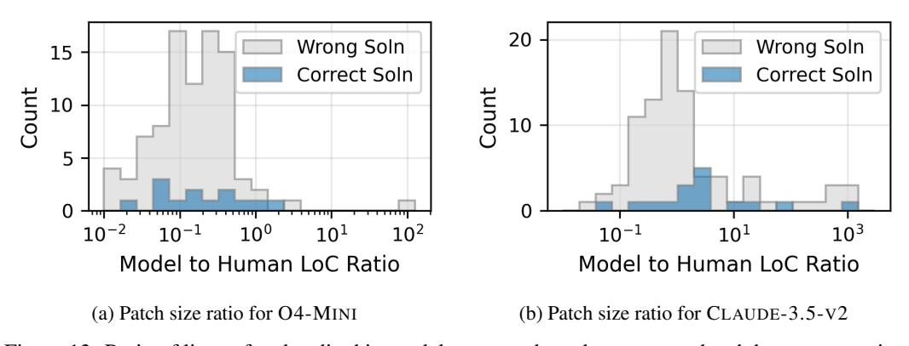
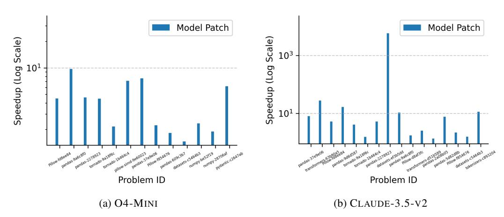

# F Additional Results on Model-Generated Patches

#### F.1 Test Pass Rate

> **[图片提取文字 (无描述)]:**
> 100 + 100 -94.1 93.1 91.8 90.8 83.8 83.4 80 -80 73.1 69.7 65.7 62.3 60 60 % Problems % Problems 54.3 49.0 45.8 44.5 40 40 28.9 20 20 Passed Tests Passed Tests Has Speedup over Base Has Speedup over Base 0 10 10 2 8 8 9 9 # Rollouts (K) # Rollouts (K) (a) O4-MINI (b) CLAUDE-3.5-V2

Figure 12: Test pass rate (% problems where the model's patch passed equivalence checks) and % problems where the model's patch showed *some* performance improvement on the initial codebase during inference-time scaling for O4-MINI and CLAUDE-3.5-V2. These metrics are distinct from and easier to achieve than OPT@K, which requires patches to both pass equivalence checks and show performance improvements that *match or exceed* the target human commit's performance. The disparity between high test pass rates with some speedups versus low OPT@K scores indicates significant headroom for improvement.

## F.2 Patch Size Analysis

> **[图片提取文字 (无描述)]:**
> 20 Wrong Soln Wrong Soln 15 Correct Soln Correct Soln Count Count 10 5  $10^{-2}$  $10^{0}$  $10^{2}$  $10^{-1}$  $10^{3}$ Model to Human LoC Ratio Model to Human LoC Ratio (a) Patch size ratio for O4-MINI (b) Patch size ratio for CLAUDE-3.5-V2

Figure 13: Ratio of lines of code edited in model-generated patches to groundtruth human commits.

#### F.3 Speedups Achieved over Initial Codebase

> **[图片提取文字 (无描述)]:**
> Model Patch Model Patch Speedup (Log Scale) Speedup (Log Scale)  $10^{3}$  $10^{1}$ carrias 609c3b7 Problem ID Problem ID (a) O4-MINI (b) CLAUDE-3.5-V2

Figure 14: Speedups achieved by model-generated patches on the initial codebase for all tasks passed in the OPT@10 evaluation in Section [4.2.](#page-5-0) Left: O4-MINI. Right: CLAUDE-3.5-V2.

