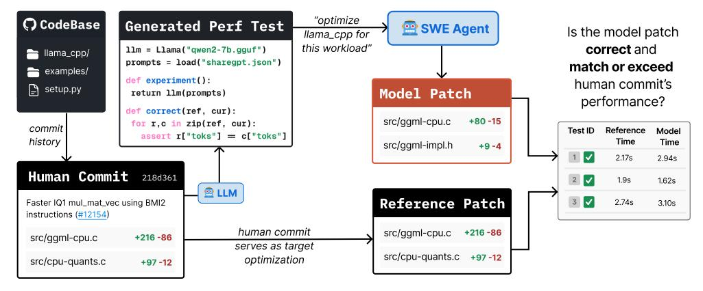

# GSO: Challenging Software Optimization Tasks for Evaluating SWE-Agents

Manish Shetty UC Berkeley Naman Jain UC Berkeley

Jinjian Liu UC Berkeley **Vijay Kethanaboyina** UC Berkeley **Koushik Sen** UC Berkeley

Ion Stoica
UC Berkeley

#### **Abstract**

Developing high-performance software is a complex task that requires specialized expertise. We introduce GSO, a benchmark for evaluating language models' capabilities in developing high-performance software. We develop an automated pipeline that generates and executes performance tests to analyze repository commit histories to identify 102 challenging optimization tasks across 10 codebases, spanning diverse domains and programming languages. An agent is provided with a codebase and performance test as a *precise specification*, and tasked to improve the runtime efficiency, which is measured against the expert developer optimization. Our quantitative evaluation reveals that leading SWE-Agents struggle significantly, achieving less than 5% success rate, with limited improvements even with inference-time scaling. Our qualitative analysis identifies key failure modes, including difficulties with low-level languages, practicing lazy optimization strategies, and challenges in accurately localizing bottlenecks. We release the code and artifacts of our benchmark along with agent trajectories to enable future research.

Website: https://gso-bench.github.io/

## 1 Introduction

> **[图片提取文字 (无描述)]:**
> "optimize C CodeBase **Generated Perf Test** SWE Agent Is the model patch llama\_cpp for this workload" correct and llm = Llama("qwen2-7b.gguf") llama\_cpp/ prompts = load("sharegpt.json") match or exceed examples/ def experiment(): human commit's setup.py Model Patch return llm(prompts) performance? def correct(ref, cur): src/ggml-cpu.c +80 -15 for r,c in zip(ref, cur): commit Reference Test ID Model assert r["toks"] = c["toks"] history Time Time src/ggml-impl.h +9-4 2.17s 2.94s Human Commit 218d361 2 🗸 1.9s 1.62s **⊕** LLM 3 🗸 Reference Patch 2.74s Faster IQ1 mul\_mat\_vec using BMI2 3.10s instructions (#12154) human commit src/ggml-cpu.c +216 -86 +216 -86 src/ggml-cpu.c serves as target src/cpu-quants.c +97 -12 optimization src/cpu-quants.c +97 -12

Figure 1: **An example GSO task.** We develop an automated pipeline that generates performance tests and analyzes repository commit history to identify real-world code optimization tasks. Each task consists of a codebase, performance tests, and the expert developer commit that serves as the performance target for the optimization problem. LLM-based SWE-Agents are then tasked with generating optimization patches using the performance test as a *precise specification* for the optimization problem. We evaluate the patches for both correctness and runtime efficiency, measuring whether they match or exceed the human expert optimization performance while ensuring equivalence.

> **[图片提取文字 (无描述)]:**
> 100 -Repo SWEB Evaluate Multi-Precise Multi Benchmark Lingual Specification Runtime Level 80 -73.3 HUMANEVAL SWEB DOMINIO O EVAL PERF Verified (%) 56.8 60 **ECCO** Score LIVECODEBENCH Multi-SWEB m ececco eso o eso es KERNELBENCH Mini 40 -SWEB-VERIFIED 20 SWEB-MULTI GSO MULTISWE-MINI 3.6 102  $10^{3}$ GSO (Ours) Oracle Patch #LoC (log scale) SWEB-V GSO

Figure 2: **Benchmark Feature Comparison and Performance Gap.** Left: Depicting how GSO improves over existing benchmarks across key dimensions. Middle: Distribution of oracle LoC changes across benchmarks, showing GSO solutions require over 4-15x larger edits than existing benchmarks. Right: Performance comparison of O4-MINI across LCB (algorithmic puzzles), SWEBENCH-VERIFIED (repository-level bug-fixes), and GSO depicting the performance gap on optimization tasks.

High-performance software is critical for modern computing systems, from data analytics frameworks to machine learning infrastructure. Developing such systems demands specialized expertise in algorithmic optimization, hardware-aware programming, performance analysis, and reasoning across multiple layers of the software stack. The complexity of these tasks is evident in production-critical systems like VLLM [Kwon et al., 2023], HPC [Bradski, 2000], and VERL [Sheng et al., 2024], where teams dedicate substantial efforts to iterative and continuous maintenance over long development cycles. Simultaneously, SWE-Agents are gaining rapid traction in software development, demonstrating remarkable results on simple bug-fixing tasks [Jimenez et al., 2024]. This has also spurred excitement in adapting LLMs to aid in automating research tasks themselves, for example improving deep learning kernels [Ouyang et al., 2024]. In this work, we study the question – "Can LLM agents aid in the development of high-performance software?". To answer this, we introduce GSO, a benchmark for evaluating SWE-Agents on challenging software optimization tasks.

To create GSO, we develop an automated pipeline that generates performance tests and runs them across a repository's commit history to identify substantial optimizations discovered by expert developers. After careful manual curation, we extract 102 challenging tasks across 10 codebases, spanning diverse domains and languages including Python, C, and SIMD. Each task consists of a codebase,  $performance\ tests$  exercising real-world workloads, and a target optimization from expert developer commits. SWE-Agents receive a performance test as task specification and must produce an optimization patch that improves runtime efficiency while maintaining correctness. We evaluate these patches using our OPT@K metric, providing reliable assessment in a machine-agnostic manner. Rather than naively measuring machine-dependent speedups, we assess whether model-generated patches can consistently match or exceed the performance of human expert optimizations.

Our benchmark evaluates the capabilities needed for high-impact optimization work, tracking usefulness for real-world high-performance software development. Particularly, problems in GSO evaluate challenging systems engineering tasks, including optimizing Pandas operations, Pillow image or video processing operations (like GIF animation), and LLaMA-CPP model inference runtimes.

Code optimization uniquely bridges algorithmic reasoning and systems engineering, providing a challenging yet well-specified evaluation domain for LLM-based programming agents. Unlike bug-fixing SWE benchmarks that rely on potentially ambiguous natural language specifications [Aleithan et al., 2024], performance tests natively provide precise specifications for correctness and efficiency. Our tasks require substantial code changes, with gold-patches containing 4-15× more lines edited than previous benchmarks (Figure 2-middle). We evaluate leading LLMs on GSO using the state-of-the-art OPENHANDS agent framework [Wang et al., 2024b] (Section 3). Our evaluation reveals that most agents struggle with the benchmark, achieving less than 5% success rate measured by OPT@1, with test-time compute also providing only modest improvements (OPT@10 remaining around 15%).

To understand why SWE-Agents struggle with GSO, we perform a qualitative analysis of agent behavior and failure modes (Section 5). First, agents struggle with low-level languages, often avoiding them entirely or introducing fatal errors. Second, agents resort to superficial optimizations ("lazy optimizations") like compiler flag manipulation or input-specific fast-paths insertion, often making bizarre non-idiomatic code changes. Third, localization remains challenging - agents frequently misdiagnose the root cause of performance issues, leading to ineffective optimization attempts.

> **[图片提取文字 (无描述)]:**
> SIMD / Vectorize -Tasks 102 # Total Caching / Memoise -# Codebases 10 Lazy evaluation -# Languages Memory Layouts # Domains Parallelism -Examples of algorithms: String-search algos -Commit 250 # Lines (avg) Bover-Moore-Horspool search Scatter / Gather -· Crochemore-Perrin Two-Way search # Lines (median) 110 CPU-Ft. dispatch - Aho-Corasick automaton # Lines (max) 2278 Branch-elimination - Quickselect / Introselect Table-driven lookup # Files (avg) 3.9 Monotonic two-pointer merge join Select / Sort kernels -58.8% % Non-Py AP/range detection Binary search - Bitmap direct-address lookup O(n) merge-joins -Tests 12.45 # Per-task (avg) Data-sharding -# Per-task (max) 20 # Commits

Figure 3: Left. Popular optimization concepts and examples of algorithms used in ground-truth human commits for GSO tasks highlighting the algorithmic complexity of the tasks. Right. Summary statistics for GSO tasks, the groundtruth human commits, and the performance tests highlighting the repository-level nature of the tasks spanning diverse domains and languages.

The key contributions of this paper are: 1) An automated pipeline leveraging test-generation and execution information for generating software optimization tasks from real-world codebases, resulting in the GSO benchmark. 2) Evaluation of leading SWE-Agents on GSO, revealing a substantial performance gap in systems engineering tasks. 3) Qualitative analysis of agent behavior and failure modes with directions for future research. Given the substantial performance gap, we believe considerable progress in reasoning capabilities and SWE-Agents will be required to close the gap and hope GSO serves as a valuable resource for future LLM-based programming agent research.

