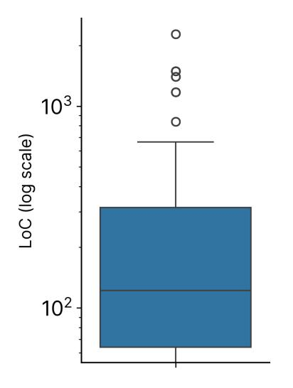

# References

- T. Ahmed, M. Hirzel, R. Pan, A. Shinnar, and S. Sinha. Tdd-bench verified: Can llms generate tests for issues before they get resolved? *arXiv preprint arXiv:2412.02883*, 2024. [10](#page-9-0)
- R. Aleithan, H. Xue, M. M. Mohajer, E. Nnorom, G. Uddin, and S. Wang. Swe-bench+: Enhanced coding benchmark for llms. *arXiv preprint arXiv:2410.06992*, 2024. [2,](#page-1-1) [5](#page-4-3)
- J. Austin, A. Odena, M. Nye, M. Bosma, H. Michalewski, D. Dohan, E. Jiang, C. Cai, M. Terry, Q. Le, et al. Program synthesis with large language models. *arXiv preprint arXiv:2108.07732*, 2021. [9](#page-8-0)
- G. Bradski. The OpenCV Library. *Dr. Dobb's Journal of Software Tools*, 2000. [2](#page-1-1)
- F. Cassano, J. Gouwar, D. Nguyen, S. Nguyen, L. Phipps-Costin, D. Pinckney, M.-H. Yee, Y. Zi, C. J. Anderson, M. Q. Feldman, et al. Multipl-e: A scalable and extensible approach to benchmarking neural code generation. *arXiv preprint arXiv:2208.08227*, 2022. [9](#page-8-0)
- P. Chambon, B. Roziere, B. Sagot, and G. Synnaeve. Bigo (bench)–can llms generate code with controlled time and space complexity? *arXiv preprint arXiv:2503.15242*, 2025. [10](#page-9-0)
- M. Chen, J. Tworek, H. Jun, Q. Yuan, H. P. D. O. Pinto, J. Kaplan, H. Edwards, Y. Burda, N. Joseph, G. Brockman, et al. Evaluating large language models trained on code. *arXiv preprint arXiv:2107.03374*, 2021. [4,](#page-3-0) [9](#page-8-0)
- Z. Chen, X. Tang, G. Deng, F. Wu, J. Wu, Z. Jiang, V. Prasanna, A. Cohan, and X. Wang. Locagent: Graph-guided llm agents for code localization. *arXiv preprint arXiv:2503.09089*, 2025. [10](#page-9-0)
- T. Coignion, C. Quinton, and R. Rouvoy. A performance study of llm-generated code on leetcode. In *Proceedings of the 28th International Conference on Evaluation and Assessment in Software Engineering*, pages 79–89, 2024. [10](#page-9-0)
- A. Gu, N. Jain, W.-D. Li, M. Shetty, Y. Shao, Z. Li, D. Yang, K. Ellis, K. Sen, and A. Solar-Lezama. Challenges and paths towards ai for software engineering. *arXiv preprint arXiv:2503.22625*, 2025. [10](#page-9-0)
- D. Hendrycks, S. Basart, S. Kadavath, M. Mazeika, A. Arora, E. Guo, C. Burns, S. Puranik, H. He, D. Song, and J. Steinhardt. Measuring coding challenge competence with apps. *NeurIPS*, 2021. [9](#page-8-0)
- D. Huang, Y. Qing, W. Shang, H. Cui, and J. Zhang. Effibench: Benchmarking the efficiency of automatically generated code. *Advances in Neural Information Processing Systems*, 37:11506– 11544, 2024. [10](#page-9-0)
- B. Jacob and T. N. Mudge. *Notes on calculating computer performance*. University of Michigan, Computer Science and Engineering Division . . . , 1995. [4](#page-3-0)
- K. Jain, G. Synnaeve, and B. Rozière. Testgeneval: A real world unit test generation and test completion benchmark. *arXiv preprint arXiv:2410.00752*, 2024a. [10](#page-9-0)
- N. Jain, S. Vaidyanath, A. Iyer, N. Natarajan, S. Parthasarathy, S. Rajamani, and R. Sharma. Jigsaw: Large language models meet program synthesis. In *ICSE 2022*. [9](#page-8-0)
- N. Jain, K. Han, A. Gu, W.-D. Li, F. Yan, T. Zhang, S. Wang, A. Solar-Lezama, K. Sen, and I. Stoica. Livecodebench: Holistic and contamination free evaluation of large language models for code. *arXiv preprint arXiv:2403.07974*, 2024b. [9](#page-8-0)

- N. Jain, M. Shetty, T. Zhang, K. Han, K. Sen, and I. Stoica. R2e: Turning any github repository into a programming agent environment. In *ICML 2024*, 2024c. [10](#page-9-0)
- N. Jain, J. Singh, M. Shetty, L. Zheng, K. Sen, and I. Stoica. R2e-gym: Procedural environments and hybrid verifiers for scaling open-weights swe agents, 2025. URL [https://arxiv.org/abs/](https://arxiv.org/abs/2504.07164) [2504.07164](https://arxiv.org/abs/2504.07164). [10](#page-9-0)
- C. E. Jimenez, J. Yang, A. Wettig, S. Yao, K. Pei, O. Press, and K. R. Narasimhan. SWE-bench: Can language models resolve real-world github issues? In *The Twelfth International Conference on Learning Representations*, 2024. URL <https://openreview.net/forum?id=VTF8yNQM66>. [2,](#page-1-1) [10](#page-9-0)
- K. Kabir, J. Yang, C. E. Jimenez, et al. Swe-bench multilingual. [https://kabirk.com/](https://kabirk.com/multilingual) [multilingual](https://kabirk.com/multilingual), 2024. Accessed: May 2024. [10](#page-9-0)
- M. A. M. Khan, M. S. Bari, X. L. Do, W. Wang, M. R. Parvez, and S. Joty. xcodeeval: A large scale multilingual multitask benchmark for code understanding, generation, translation and retrieval. *arXiv preprint arXiv:2303.03004*, 2023. [9](#page-8-0)
- W. Kwon, Z. Li, S. Zhuang, Y. Sheng, L. Zheng, C. H. Yu, J. E. Gonzalez, H. Zhang, and I. Stoica. Efficient memory management for large language model serving with pagedattention. In *Proceedings of the ACM SIGOPS 29th Symposium on Operating Systems Principles*, 2023. [2](#page-1-1)
- Y. Lai, C. Li, Y. Wang, T. Zhang, R. Zhong, L. Zettlemoyer, W.-t. Yih, D. Fried, S. Wang, and T. Yu. Ds-1000: A natural and reliable benchmark for data science code generation. In *International Conference on Machine Learning*, pages 18319–18345. PMLR, 2023. [9](#page-8-0)
- R. T. Lange, A. Prasad, Q. Sun, M. Faldor, Y. Tang, and D. Ha. The ai cuda engineer: Agentic cuda kernel discovery, optimization and composition. 2025. [10](#page-9-0)
- J. Li, S. Tworkowski, Y. Wu, and R. Mooney. Explaining competitive-level programming solutions using llms. *arXiv preprint arXiv:2307.05337*, 2023. [7](#page-6-2)
- Y. Li, D. Choi, J. Chung, N. Kushman, J. Schrittwieser, R. Leblond, T. Eccles, J. Keeling, F. Gimeno, A. D. Lago, T. Hubert, P. Choy, C. de Masson d'Autume, I. Babuschkin, X. Chen, P.-S. Huang, J. Welbl, S. Gowal, A. Cherepanov, J. Molloy, D. J. Mankowitz, E. S. Robson, P. Kohli, N. de Freitas, K. Kavukcuoglu, and O. Vinyals. Competition-level code generation with alphacode. *Science*, 378(6624):1092–1097, 2022. doi: 10.1126/science.abq1158. URL [https://www.science.org/](https://www.science.org/doi/abs/10.1126/science.abq1158) [doi/abs/10.1126/science.abq1158](https://www.science.org/doi/abs/10.1126/science.abq1158). [9](#page-8-0)
- H. Lightman, V. Kosaraju, Y. Burda, H. Edwards, B. Baker, T. Lee, J. Leike, J. Schulman, I. Sutskever, and K. Cobbe. Let's verify step by step. In *The Twelfth International Conference on Learning Representations*, 2023. [4](#page-3-0)
- J. Liu, C. S. Xia, Y. Wang, and L. Zhang. Is your code generated by chatgpt really correct? rigorous evaluation of large language models for code generation. *Advances in Neural Information Processing Systems*, 36:21558–21572, 2023. [9](#page-8-0)
- J. Liu, S. Xie, J. Wang, Y. Wei, Y. Ding, and L. ZHANG. Evaluating language models for efficient code generation. In *First Conference on Language Modeling*, 2024. URL [https://openreview.](https://openreview.net/forum?id=IBCBMeAhmC) [net/forum?id=IBCBMeAhmC](https://openreview.net/forum?id=IBCBMeAhmC). [10](#page-9-0)
- A. Madaan, A. Shypula, U. Alon, M. Hashemi, P. Ranganathan, Y. Yang, G. Neubig, and A. Yazdanbakhsh. Learning performance-improving code edits. *arXiv preprint arXiv:2302.07867*, 8, 2023. [10](#page-9-0)
- METR. Measuring automated kernel engineering. [https://metr.org/blog/](https://metr.org/blog/2025-02-14-measuring-automated-kernel-engineering/) [2025-02-14-measuring-automated-kernel-engineering/](https://metr.org/blog/2025-02-14-measuring-automated-kernel-engineering/), 02 2025. [10](#page-9-0)
- S. Miserendino, M. Wang, T. Patwardhan, and J. Heidecke. Swe-lancer: Can frontier llms earn \$1 million from real-world freelance software engineering?, 2025. URL [https://arxiv.org/abs/](https://arxiv.org/abs/2502.12115) [2502.12115](https://arxiv.org/abs/2502.12115). [10](#page-9-0)

- C. Niu, T. Zhang, C. Li, B. Luo, and V. Ng. On evaluating the efficiency of source code generated by llms. In *Proceedings of the 2024 IEEE/ACM First International Conference on AI Foundation Models and Software Engineering*, pages 103–107, 2024. [10](#page-9-0)
- T. X. Olausson, J. P. Inala, C. Wang, J. Gao, and A. Solar-Lezama. Is self-repair a silver bullet for code generation? *arXiv preprint arXiv:2306.09896*, 2023. [6](#page-5-3)
- A. Ouyang, S. Guo, and A. Mirhoseini. Kernelbench: Can llms write gpu kernels?, 2024. URL <https://scalingintelligence.stanford.edu/blogs/kernelbench/>. [2,](#page-1-1) [10](#page-9-0)
- H. Pham, X. Wang, Y. Yang, and G. Neubig. Meta back-translation. *arXiv preprint arXiv:2102.07847*, 2021. [7](#page-6-2)
- R. Sennrich, B. Haddow, and A. Birch. Improving neural machine translation models with monolingual data. *arXiv preprint arXiv:1511.06709*, 2015. [7](#page-6-2)
- G. Sheng, C. Zhang, Z. Ye, X. Wu, W. Zhang, R. Zhang, Y. Peng, H. Lin, and C. Wu. Hybridflow: A flexible and efficient rlhf framework. *arXiv preprint arXiv: 2409.19256*, 2024. [2](#page-1-1)
- M. Singhal, T. Aggarwal, A. Awasthi, N. Natarajan, and A. Kanade. Nofuneval: Funny how code lms falter on requirements beyond functional correctness. *arXiv preprint arXiv:2401.15963*, 2024. [10](#page-9-0)
- S. Waghjale, V. Veerendranath, Z. Z. Wang, and D. Fried. Ecco: Can we improve model-generated code efficiency without sacrificing functional correctness? *arXiv preprint arXiv:2407.14044*, 2024. [10](#page-9-0)
- E. Wang, F. Cassano, C. Wu, Y. Bai, W. Song, V. Nath, Z. Han, S. Hendryx, S. Yue, and H. Zhang. Planning in natural language improves llm search for code generation. *arXiv preprint arXiv:2409.03733*, 2024a. [7](#page-6-2)
- X. Wang, B. Li, Y. Song, F. F. Xu, X. Tang, M. Zhuge, J. Pan, Y. Song, B. Li, J. Singh, H. H. Tran, F. Li, R. Ma, M. Zheng, B. Qian, Y. Shao, N. Muennighoff, Y. Zhang, B. Hui, J. Lin, R. Brennan, H. Peng, H. Ji, and G. Neubig. OpenHands: An Open Platform for AI Software Developers as Generalist Agents, 2024b. URL <https://arxiv.org/abs/2407.16741>. [2,](#page-1-1) [5](#page-4-3)
- Z. Wang, S. Zhou, D. Fried, and G. Neubig. Execution-based evaluation for open-domain code generation. *arXiv preprint arXiv:2212.10481*, 2022. [9](#page-8-0)
- Y. Xie, A. Xie, D. Sheth, P. Liu, D. Fried, and C. Rose. Codebenchgen: Creating scalable executionbased code generation benchmarks, 2024. [10](#page-9-0)
- Y. Xie, A. Xie, D. Sheth, P. Liu, D. Fried, and C. Rose. Repost: Scalable repository-level coding environment construction with sandbox testing. *arXiv preprint arXiv:2503.07358*, 2025. [10](#page-9-0)
- W. Yan, H. Liu, Y. Wang, Y. Li, Q. Chen, W. Wang, T. Lin, W. Zhao, L. Zhu, H. Sundaram, et al. Codescope: An execution-based multilingual multitask multidimensional benchmark for evaluating llms on code understanding and generation. *arXiv preprint arXiv:2311.08588*, 2023. [9](#page-8-0)
- J. Yang, C. E. Jimenez, A. L. Zhang, K. Lieret, J. Yang, X. Wu, O. Press, N. Muennighoff, G. Synnaeve, K. R. Narasimhan, et al. Swe-bench multimodal: Do ai systems generalize to visual software domains? *arXiv preprint arXiv:2410.03859*, 2024. [10](#page-9-0)
- J. Yang, K. Leret, C. E. Jimenez, A. Wettig, K. Khandpur, Y. Zhang, B. Hui, O. Press, L. Schmidt, and D. Yang. Swe-smith: Scaling data for software engineering agents, 2025. URL [https:](https://arxiv.org/abs/2504.21798) [//arxiv.org/abs/2504.21798](https://arxiv.org/abs/2504.21798). [16](#page-15-3)
- P. Yin, W.-D. Li, K. Xiao, A. Rao, Y. Wen, K. Shi, J. Howland, P. Bailey, M. Catasta, H. Michalewski, et al. Natural language to code generation in interactive data science notebooks. *arXiv preprint arXiv:2212.09248*, 2022. [9](#page-8-0)
- D. Zan, Z. Huang, W. Liu, H. Chen, L. Zhang, S. Xin, L. Chen, Q. Liu, X. Zhong, A. Li, S. Liu, Y. Xiao, L. Chen, Y. Zhang, J. Su, T. Liu, R. Long, K. Shen, and L. Xiang. Multi-swe-bench: A multilingual benchmark for issue resolving, 2025. URL <https://arxiv.org/abs/2504.02605>. [10](#page-9-0)

- W. Zhao, N. Jiang, C. Lee, J. T. Chiu, C. Cardie, M. Gallé, and A. M. Rush. Commit0: Library generation from scratch. *arXiv preprint arXiv:2412.01769*, 2024. [10](#page-9-0)
- T. Y. Zhuo, M. C. Vu, J. Chim, H. Hu, W. Yu, R. Widyasari, I. N. B. Yusuf, H. Zhan, J. He, I. Paul, et al. Bigcodebench: Benchmarking code generation with diverse function calls and complex instructions. *arXiv preprint arXiv:2406.15877*, 2024. [9](#page-8-0)

#### A Code and Dataset

We release our codebase at https://github.com/gso-bench/gso and our datasets at https://huggingface.co/datasets/gso-bench/gso. Note: GSO is collected entirely from public repositories with licenses that permit software usage that our contributions are in accordance with. Details of the licenses are included in Table 1. During the collection or evaluation processes, we do not collect information about GitHub users, and the GSO task instances do not use GitHub data beyond what is offered via the public API and website. Our contributions do not involve any human subject participation; we do not perform crowdsourcing or recruit human task workers for any part of GSO, including its collection and evaluation procedures, along with the experiments. GSO's filtering criteria for GitHub repositories based on popularity do not implicitly or explicitly rely on discriminative or biased heuristics for repository selection.

#### **B** Features of GSO

#### **B.1** Distribution of Codebases and Tasks in GSO

| Codebase     | #Tasks                       | Languages              | Domain               | License            |
|--------------|------------------------------|------------------------|----------------------|--------------------|
| numpy        | 36                           | Py, C, C++             | Scientific Computing | BSD 3-Clause       |
| pandas       | 34                           | Ру, Су                 | Data Analysis        | BSD 3-Clause       |
| pillow-simd  | imd 7 Py, C Image Processing |                        | HPND                 |                    |
| pillow       | 4                            | Py, C Image Processing |                      | HPND               |
| pydantic     | 4                            | Ру                     | Data Validation      | MIT License        |
| tornado      | 4                            | Ру                     | Web & Network        | Apache License 2.0 |
| tokenizers   | 4                            | Py, Rust               | LLM Tokenizers       | Apache License 2.0 |
| transformers | 4                            | Ру                     | ML Inference         | Apache License 2.0 |
| datasets     | 3                            | Ру                     | ML Datasets          | Apache License 2.0 |
| llama-cpp    | 2                            | Py, C, C++             | ML Inference         | MIT License        |
| Total        | 102                          |                        |                      |                    |

Table 1: Distributions of codebases and tasks in GSO.

#### **B.2** Line Changes and Complexity of GSO Tasks

| Benchmark         | Min | Median | Mean  | Max     | Characteristics                              |
|-------------------|-----|--------|-------|---------|----------------------------------------------|
| SWEBENCH-VERIFIED | 0.0 | 6.0    | 12.6  | 215.0   | Bug fixes, small targeted changes            |
| SWEB-MULTI        | 0.0 | 9.5    | 46.6  | 3,178.0 | Multilingual bug fixes, small-moderate scope |
| MULTISWE-MINI     | 0.0 | 24.0   | 135.4 | 5,648.0 | Multilingual bug fixes, small-moderate scope |
| GSO               | 7.0 | 108.0  | 231.5 |         |                                              |

Table 2: Detailed comparison of lines changed across benchmarks. GSO contains significantly larger changes across all statistical measures, reflecting the complexity of performance optimization tasks compared to bug fixes or feature additions.

**Procedure.** For our benchmark comparison analysis, we compute the number of lines changed in each benchmark by parsing the patch files and counting non-test file line modifications. Our parser extracts line additions and deletions while filtering out test files using comprehensive pattern matching heuristics across various programming languages and frameworks. We identify test files through common path patterns (e.g., /tests/, \_\_tests\_\_/), filename conventions (e.g., test\_\*.py, \*\_test.go), and standard test extensions (e.g., .spec.js, Test.java).

**Insights.** The substantially higher line count statistics for GSO underscore a key aspect of performance optimization: these tasks frequently require algorithmic changes, data structure modifications, or architectural adjustments that span multiple files and functions. This contrasts with bug fixes (as in SWEBENCH-VERIFIED), which are often localized to specific functions or methods. The more extensive code changes in GSO create a more challenging environment for testing the capabilities of large language models in software engineering tasks.

Note while our dataset extraction aims to identify optimization-focused commits, these may not always represent minimal changes. Some commits contain peripheral modifications like code formatting, documentation updates, or minor refactorings alongside the core performance improvements. This reflects real-world development practices where optimizations often co-occur with other changes. This might skew the line count statistics but we believe median line counts would remain a good proxy for the complexity avoiding such outliers.

> **[图片提取文字 (无描述)]:**
> 0 0 103 LoC (log scale) 102

> **[图片提取文字 (无描述)]:**
> 105 8  $10^{4}$ 0 Speedup (log scale)  $10^3$   $10^2$ 101 10º

- (a) Lines of Code edited in groundtruth commits (b) Groundtruth commit performance

Figure 9: Distributions of code changes and performance improvements from groundtruth commits.

