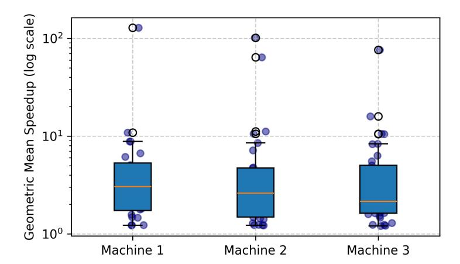

# D Measuring Cross-platform Variability in Speedup

> **[图片提取文字 (无描述)]:**
> Geometric Mean Speedup (log scale)  $10^{2}$ 101 10º Machine 1 Machine 2 Machine 3

Figure 10: Cross platform variation in measured speedups achieved by model patches over the initial codebase. Here we measure speedup on three different machine configurations: Machine 1 (16 cores, 128GB RAM), Machine 2 (32 cores, 256GB RAM), and Machine 3 (64 cores, 512GB RAM).

In Figure [10,](#page-18-2) we show the speedup achieved by model patches over the initial codebase on three different machine configurations. As shown the speedups achieved can be quite different across machines, due to differences in CPUs, cache sizes, memory bandwidth, etc. However, we find that given sufficient compute resources per task in the benchmark, our OPT@K metric is unaffected by the machine configuration. Our metric controls for machine-specific variation by comparing generated optimizations against expert developer implementations in the same environment, rather than measuring absolute speedups, providing a more consistent evaluation.

