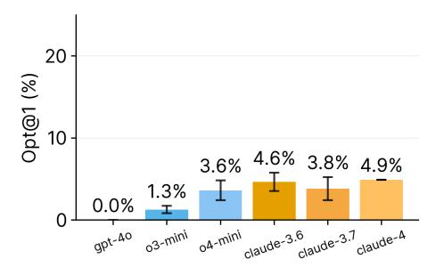
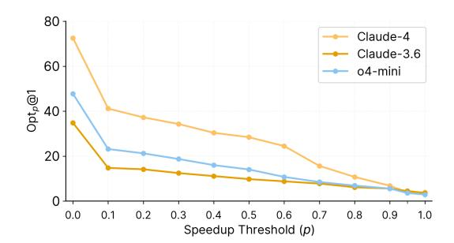
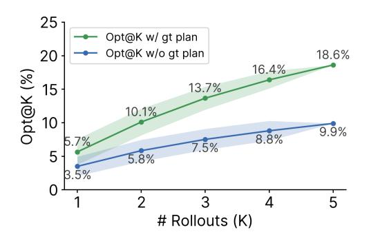

# 4.1 OPT@1

Figure [4-](#page-5-1)left shows consistently poor OPT@1 performance across agents based on all models, confirming software optimization as a significant challenge for current SWE-Agents. Even the best

> **[图片提取文字 (无描述)]:**
> 20 Opt@1 (%) 10 3.6% 4.6% 3.8% 4.9% 1.3% 0.0% claude-3.6 claude-4 gpt-40 o3-mini o4-mini

> **[图片提取文字 (无描述)]:**
> 80 Claude-4 Claude-3.6 60 o4-mini  $\mathsf{Opt}_{\rho}@1$ 40 20 0.0 0.1 0.2 0.3 0.6 0.8 0.9 1.0 0.4 0.5 0.7 Speedup Threshold (p)

Figure 4: OPT@1 performance. (a) Left: OPT@1 (speedup threshold p set to 0.95) across models, with all models achieving less than 5% success (b) Right: OPTp@1 indicating portion of problems where model patches match p fraction of human commit's performance. We find that strongest performing models remain strong throughout, with the success rates reducing as it becomes more challenging to match human-level performance.

> **[图片提取文字 (无描述)]:**
> o4-mini 400 -1.96 25 # Steps (L) o4-mini 200 2.44 4.90 claude-3.6 20 100 -2.12 3.95 6.86 15.7 50 -1.72 3.47 5.80 8.82 14.5 Opt@K (%) 15 2 8 12.6 # Rollouts (K) 10.0 12.7 claude-3.6 12.0 10 10.7 400 -4.95 6.3 8.8 # Steps (L) 2.99 4.90 5 5.8 5.65 3.87 7.84 3.62 0 50 -5.78 8.60 11.76 10 8 9 6 8 2 # Rollouts (K) # Rollouts (K)

Figure 5: Scaling test-time compute for O4-MINI and CLAUDE-3.5-V2. (a) Left: OPT@K performance as a function of inference steps (L) and parallel rollouts (K), showing parallel compute scales more efficiently than serial compute. (b) Right: OPT@K performance with increasing rollouts, improving to 15% with diminishing returns beyond eight rollouts.

performing model, CLAUDE-4.0, achieves less than 5% success, while GPT-4O fails completely at 0.0%. These results demonstrate that success on SWE-Bench-like benchmarks does not transfer to more-challenging real-world tasks like software optimization requiring both algorithmic reasoning and engineering expertise.

We next vary p in OPTp@1 (Figure [4-](#page-5-1)right). Recall that OPTp@1 evaluates whether the agent's patch is able to match p fraction of the human commit's performance. Thus p = 0 evaluates whether the agent's patch is correct, regardless of its performance, while p = 1 evaluates whether the agent's patch is identical to the human commit, increasing in difficulty. We find that OPT0@1 performances shows considerably more variation with CLAUDE-4.0 achieving 70% OPT0@1 while O4-MINI achieves 45%. We also find that the trend stays the strongest performing model, but the gap compresses as p increases, indicating challenges in matching human-level performance.

## 4.2 Scaling Inference-time Compute

Drawing inspiration from [\[Olausson et al.,](#page-12-3) [2023\]](#page-12-3), we examine two dimensions of test-time compute scaling: (1) sampling multiple trajectories and picking the best (referred to as parallel compute) and (2) allowing more steps per trajectory (referred to as serial compute).

Scaling serial vs parallel compute. In Figure [5-](#page-5-2)left, we analyze steps scaling from 50 to 400 with different numbers of rollouts between 1 and 8. Results show parallel compute scales more efficiently than serial compute. With only 50 steps, 8 rollouts yields higher performance (8.82 for O4-MINI

> **[图片提取文字 (无描述)]:**
> Avoid Complexity Mismanage Compute Localization Avoid Complexity Mismanage Compute Localization Less Impactful (10.0%) Misdiagnosed Bottlenecks (6.6%) Misdiagnosed Bottlenecks (13.2%) Less Impactful (6.8%) Explore-Heavy (3.0%) Exploit-Heavy (6.9%) Exploit-Heavy (27.2%) Explore-Heavy (25.7%) Lazy Optimization (16.6%) Wrong Abstraction Level (25.1%) Wrong Abstraction Level (30.1%) Lazy Optimization (29.0%) 10 15 20 25 30 20 25 30 % of Claude-3.6 Trajectories % of O4-mini Trajectories

Figure 7: Qualitative analysis of agents. Model failures are classified into three high-level categories: (1) Localization: misidentifying code regions or opportunities for optimization, (2) Mismanage Compute: battling explore-exploit tradeoffs, and (3) Avoid Complexity: challenges with low-level code changes. Left: CLAUDE-3.5-V2 shows an exploit-heavy behaviour, making massive code changes with lesser exploration of the codebase. It also attempts deeper changes but fails to localize bottlenecks and changes to the right abstraction level. Right: O4-MINI in contrast is explore-heavy, avoids low-level code, and makes "lazy" optimizations like spurious compiler flag modifications.

and 11.76 for CLAUDE-3.5-V2) than 400 steps with a single rollout (1.96 for O4-MINI and 4.95 for CLAUDE-3.5-V2). This indicates increased sample diversity across trajectories can effectively compensate for reduced step counts, providing insights for optimal inference-time compute allocation.

Low OPT@10 performance. Building on these findings, we further examine performance with extended parallel compute. Figure [5-](#page-5-2)right demonstrates both models gain performance with additional rollouts, with OPT@K increasing from under 4% to over 12% with 8 rollouts. Despite these improvements, OPT@10 performance remains modest (under 20%) for both models with diminishing returns, indicating fundamental limitations in current SWE-Agents.

## 4.3 Performance with Ground-Truth Plans

Beyond engineering, solving GSO requires identifying bottlenecks and planning optimization strategies over a long horizon. Inspired by prior work on "backtranslation" guided reasoning [\[Li et al.,](#page-11-3) [2023,](#page-11-3) [Wang et al.,](#page-12-4) [2024a,](#page-12-4) [Pham et al.,](#page-12-5) [2021,](#page-12-5) [Sen](#page-12-6)[nrich et al.,](#page-12-6) [2015\]](#page-12-6), we assess the impact of guided reasoning by prompting O4-MINI with descriptive backtranslated plans of ground-truth optimizations. We provide O4-MINI with the groundtruth diff and sample 5 plans describing the optimization strategy and specific file-localized changes. Section [H](#page-21-1) details the prompt and example plans.

We observe that prompting agents with backtranslated plans improves performance suggesting that high-level plans aid in matching human-level performance. However, OPT@1 only reaches 5.7%

> **[图片提取文字 (无描述)]:**
> 25 Opt@K w/ gt plan 20 Opt@K w/o gt plan 18.6% 16.4% Opt@K (%) 13.7% 15 10.1% 10 9.9% 8.8% 5.7% 7.5% 5 5.8% 3.5% # Rollouts (K)

Figure 6: O4-MINI performance with and without backtranslated ground-truth plans describing the human commit's optimization strategy.

and OPT@5 improves by just 9% with these plans. So while strategic planning and reasoning helps, implementing low-level system changes remains challenging for current models.

