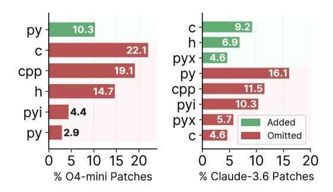

# <span id="page-6-0"></span>5 Qualitative Analysis of Agent Behavior

We use an LLM-aided pipeline (details in Section [I\)](#page-24-0) to qualitatively analyze agent behavior and failure modes. We categorize the failures as (1) challenges with low-level code, (2) compute management issues, and (3) localization errors.

## 5.1 Agents Struggle with Low-Level Code Changes

Poor performance on low-level problems. We identify sharp declines in agent performance as language complexity increases. Models perform best with high-level languages, with O4-MINI achieving 21% on Python tasks. Performance drops drastically to 4% when Cython, C and C++, etc. are involved.

| Subset           | OPT@10 |
|------------------|--------|
| Py only (42)     | 21.4%  |
| non-Py only (60) | 4.0%   |

## Modifications at the wrong abstraction level.

Production codebases have a hierarchy of abstraction levels, from high-level APIs to lowlevel implementations, with each layer encapsulating complexity beneath it. Our analysis reveals that operating at inappropriate abstraction levels contributes to 25-30% of agent failures. However, interestingly, models exhibit opposite but equally problematic approaches. Figure [8](#page-7-0) shows that O4-MINI avoids making changes to the C/C++ files 40% of the times even when it was necessary based on the human optimization commit. CLAUDE-3.5-V2 on the other hand surprisingly makes unnecessary lowlevel C changes (9.2%) when even the human optimization commit was Python-only!

<span id="page-7-0"></span>> **[图片提取文字 (无描述)]:**
> 9.2 10.3 ру 6.9 22.1 4.6 рух 19.1 cpp 16.1 ру 11.5 14.7 cpp h 10.3 pyi 4.4 pyi 5.7 рух Added 2.9 ру Omitted 10 15 20 15 20 % O4-mini Patches % Claude-3.6 Patches


Figure 8: File extensions modified in model patches, indicating additions or omissions relative to the reference human commit.

In Example [F.1,](#page-25-0) O4-MINI attempted to optimize NumPy's np.subtract.at function. NumPy conceptually implements this in a layer below the Python API called ufunc (universal function) written in C. While the model scrolled through these C files, it decided to not make changes there and instead tried to override it with a Python function, completely avoiding the required deeper change.

Fundamental errors in low-level programming. Beyond selecting incorrect abstraction levels, agents also struggle with fundamental low-level programming concepts. In Example [F.2,](#page-26-0) CLAUDE-3.5-V2 incorrectly modified Pillow's SIMD pointer arithmetic, causing segmentation faults.

## 5.2 Agents Favor Lazy Optimizations

Optimization Minimalism: The Path of Least Resistance. Agents consistently favor trivial code changes to meet performance targets rather than investigating and implementing more substantial improvements. O4-MINI exhibits this behavior in nearly 30% of trajectories (Figure [7\)](#page-6-1), with patch sizes significantly smaller than human-written optimizations. In fact, in over 60% of incorrect trajectories, the agent made ≤ 15% of the edits compared to the corresponding human developer commit, as shown in Section [F.2.](#page-19-0)

Spurious compiler-flag twiddling. In Example [F.3,](#page-27-0) CLAUDE-3.5-V2 attempted to optimize Pillow's SIMD implementation by simply adding −O3 compiler flags. This approach is ineffective since the Pillow project already uses optimized builds by default. This pattern appears across many agent trajectories, revealing a fundamental misunderstanding of real-world project configurations.

Input-specific fast paths. Agents frequently implement narrow optimizations targeting only the specific input patterns present in given performance test. In Example [F.4,](#page-28-0) O4-MINI created a specialized fast path for NumPy's ljust API that only handled "matching-shaped" input arrays. Our test suite identifies these narrow optimizations as failures due to their poor generalization properties.

Bizarre overrides in \_\_init\_\_.py. A recurring pattern in O4-MINI trajectories is modifying \_\_init\_\_.py files to override functions instead of making core improvements. These overrides typically implement input-specific optimizations in a non-idiomatic manner, as shown below:

```
# __init__.py
_orig_strftime = _PeriodCls.strftime
def _fast_strftime(self, fmt):
    if fmt is None and getattr(self, "freqstr", None) == "M":
        return f"{y:04d}-{m:02d}" # Fast path for default monthly formatting
    return _orig_strftime(self, fmt)
```

See examples and analysis for this behavioral pattern in Example [F.5](#page-29-0) and Example [F.6.](#page-30-0)

#### <span id="page-8-0"></span>5.3 Agents Mismanage Compute

Underutilize available compute. First, we find that agents often underutilize their available compute budget. We observe this quantitatively in our inference-time scaling experiments (Section [4.2\)](#page-5-0), where we increased the number of available agent steps. Even with larger budgets of 200+ steps, 75% of trajectories terminate before 100 steps! This again underscores the lazy behavior discussed earlier and highlights the need for better agent scaffolding and model improvements to optimally use compute.

Imbalance in exploration and exploitation. Figure [7](#page-6-1) reveals a dichotomy in exploration-exploitation behaviours. O4-MINI trajectories are rated as explore-heavy meaning they spend most of their steps examining the codebase without converging on actionable optimizations. On the other hand, CLAUDE-3.5-V2 trajectories are rated as exploit-heavy, meaning they commit to solutions with insufficient exploration of alternatives, and eagerly make tons of code changes. This also indicates a promising research direction to improve agent performance by leveraging the strengths of the two models.

## 5.4 Agents Misdiagnose Optimizations

Misidentify bottlenecks and solutions. Agents misdiagnose performance bottlenecks, implementing ineffective optimizations. In Example [F.7,](#page-31-0) CLAUDE-3.5-V2 attempted to parallelize NumPy's char.count API, ignoring Python's GIL and process startup overhead, resulting in worse performance. After multiple failures, the model concluded: "*For this specific use case, numpy's string operations are already highly optimized, stick with the original implementation.*"

#### 5.5 Analyzing Model Successes

Section [4.2](#page-5-0) shows the with increasing test-time compute, SWE-Agents can solve a small fraction of the tasks. Here, we analyze the characteristics of the tasks that SWE-Agents can solve. We find that agent solutions vary significantly in sophistication, ranging from simple but effective changes to genuinely impressive algorithmic improvements.

Some successful optimizations are less impressive when compared to what humans achieved on the same problems. In Example [F.8,](#page-32-0) O4-MINI added a fast path for writing data when network streams are idle, avoiding unnecessary buffering. But the human developer completely redesigned the entire buffering system with a much more sophisticated approach. In Example [F.9,](#page-33-0) CLAUDE-3.5-V2 optimized database-style lookups using bit-combining. The human solution was more comprehensive, upgrading the underlying search algorithms across the entire codebase. In Example [F.10,](#page-34-0) O4-MINI improved sorting by working directly with integer codes instead of string values. However, the human approach was cleaner, refactoring shared utilities that benefited multiple sorting operations.

However, agents can also implement sophisticated optimizations that outperform human solutions. O4- MINI completely rewrote image file parsing to read only essential metadata instead of decompressing entire frames, reducing algorithmic complexity from O(n²) to O(n) (Example [F.11\)](#page-35-0). The human developer only made a simple check, while the agent delivered a fundamentally superior approach. CLAUDE-3.5-V2 eliminated memory waste by calculating exact allocation sizes upfront instead of repeatedly resizing arrays (Example [F.12\)](#page-36-0). The human solution still used dynamic resizing, just with better growth patterns, while the agent eliminated resizing entirely.

