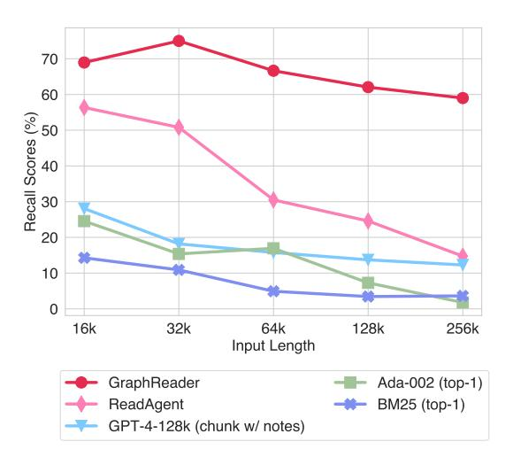

# 4 Experiments

## 4.1 Experimental Settings

Evaluation Benchmarks We conduct experiments on two types of long-context QA benchmarks, including multi-hop long-context QA, *i.e.,* HotpotQA [\(Yang et al.,](#page-10-9) [2018\)](#page-10-9), 2WikiMultihopQA [\(Ho et al.,](#page-8-14) [2020\)](#page-8-14), MuSiQue [\(Trivedi et al.,](#page-10-10) [2022\)](#page-10-10), and a single-hop long-context QA benchmark, *i.e.,* NarrativeQA [\(Kociský et al.,](#page-9-19) [2018\)](#page-9-19) from LongBench [\(Bai et al.,](#page-8-15) [2023\)](#page-8-15). Additionally, we

also incorporate HotpotWikiQA-mixup from LV-Eval (Yuan et al., 2024), a multi-hop benchmark that features five levels of text length: 16k, 32k, 64k, 128k, and 256k. Table 1 presents the statistics about these benchmarks, and detailed information is provided in Appendix C.

Evaluation Metrics We employ several automatic evaluation metrics, *i.e.*,  $F_1$  score, Exact Match (EM) score, and an optimized  $F_1$ \* score, as introduced by LV-Eval (Yuan et al., 2024). Specifically,  $F_1$ \* first computes the recall of golden answer keywords and only calculates the  $F_1$  score if it exceeds a certain threshold. Otherwise, the score defaults to zero. Despite the cost-effectiveness of automatic metrics, their accuracy may be affected by the response format. Hence, we implement LLM Raters for answer correctness evaluation using an LLM, denoted as LLM-Rating-1 (LR-1) and LLM-Rating-1 (LR-2), following ReadAgent (Lee et al., 2024). Details on the evaluation metrics can be found in Appendix B.

**Baseline Methods** We compare our approach with the following baselines: retrieval augmented generation (RAG), long-context LLM, and agentbased methods. (1) RAG: We choose Okapi BM25 (Robertson and Zaragoza, 2009) or OpenAI API embedding model Ada-002 to retrieve the chunks most relevant to the question and employ GPT-4-128k (gpt-4-1106-preview) to read retrieved chunks and answer the question. In addition to traditional RAG methods, we also compared GraphRAG (Edge et al., 2024) and LongRAG (Jiang et al., 2024), which utilize LLM to enhance RAG ability. (2) Long-context LLM: We select GPT-4-128k for directly reading full text when the text content fits within the input window, or for segmenting the text into chunks for sequential reading. (3) Agent-based Method: We select ReadAgent (Lee et al., 2024) and PEARL (Sun et al., 2024), which employ an agent-based system for the execution of retrieval and reading processes for long-context QA. The detailed description of these methods is provided in Appendix D.

**Implementation Details** In our experiments, we employ GPT-4-128k for both our method and baseline approaches, setting the temperature to 0.2. For GraphReader, the input window size is configured to 4k tokens unless stated otherwise. We limit the

| Task          | Dataset            | Avg #Tokens | Max #Tokens | #Samples |
|---------------|--------------------|-------------|-------------|----------|
|               | HotpotQA           | 9.4k        | 15.9k       | 300      |
| Multi-hop QA  | 2WikiMultihopQA    | 8.8k        | 15.9k       | 300      |
| Mulu-nop QA   | MuSiQue            | 15.5k       | 16.0k       | 200      |
|               | HotpotWikiQA-mixup | 142.4k      | 370.8k      | 250      |
| Single-hop QA | NarrativeQA        | 29.7k       | 63.7k       | 200      |

Table 1: The statistics of benchmarks employed in our evaluation. The token number is calculated using the GPT-4 tokenizer from the TikToken. #Samples denote the total number of benchmarks.

maximum chunk size to 2k tokens, initiate searches from 5 initial nodes, and impose a function call limit of 10 for each search path.

#### 4.2 Main Results

The results of three types of methods on four multihop long-context benchmarks and one single-hop long-context benchmark are shown in Table 2 and Table 3. Based on the results, we have the following findings:

Results of RAG methods As the results shown in Table 2, RAG methods based on BM25 and Ada-002 exhibit the worst performance in comparison to long-context LLM and agent-based methods. A possible reason is that text retrieval has difficulty recalling all chunks that contain the supporting facts for answering the input question. Although increasing the number of recalled chunks could improve the performance of text retrieval, the context window will limit the effectiveness of these RAG methods.

Results of Long-Context LLMs From the results shown in Table 2, we can see that employing GPT-4-128k to directly answer the question with long contexts significantly outperforms RAG methods and even outperforms ReadAgent on three long-context benchmarks. This is because of the superior performance of GPT-4-128k in processing long texts and executing multi-hop reasoning tasks. Additionally, the lengths of these four benchmarks are significantly shorter than the 128k context window, thereby mitigating the impact of "lost in the middle" on the model's performance.

Results of Agent-based Methods By comparing our approach with all baselines in Table 2, it is obvious that our approach consistently performs better than them on four long-context benchmarks and demonstrates superior performance in multihop long-context tasks. In our approach, benefiting

https://platform.openai.com/docs/guides/embeddings/embedding-models

| Method                      | Input  |      | Hotpo | tQA  |       | 2V   | VikiMul | tihopQ | )A    |      | MuSi | Que  |       |      | Narrati | veQA |       |
|-----------------------------|--------|------|-------|------|-------|------|---------|--------|-------|------|------|------|-------|------|---------|------|-------|
| Method                      | Window | LR-1 | LR-2  | EM   | $F_1$ | LR-1 | LR-2    | EM     | $F_1$ | LR-1 | LR-2 | EM   | $F_1$ | LR-1 | LR-2    | EM   | $F_1$ |
| BM25 (top-1)                | 4k     | 57.7 | 63.0  | 33.7 | 43.8  | 36.0 | 39.0    | 25.0   | 30.4  | 33.0 | 36.5 | 19.0 | 23.9  | 29.5 | 34.5    | 4.0  | 11.3  |
| BM25 (top-3)                | 4k     | 74.7 | 78.3  | 45.7 | 58.5  | 59.7 | 62.0    | 42.3   | 51.9  | 43.5 | 49.5 | 25.0 | 31.1  | 44.5 | 52.5    | 7.0  | 20.5  |
| Ada-002 (top-1)             | 4k     | 63.0 | 70.7  | 40.0 | 53.2  | 57.0 | 59.3    | 41.0   | 49.4  | 34.5 | 37.0 | 20.0 | 26.6  | 37.5 | 46.5    | 5.0  | 15.5  |
| Ada-002 (top-3)             | 4k     | 72.0 | 77.3  | 45.0 | 58.1  | 65.7 | 66.7    | 44.7   | 55.3  | 40.0 | 45.5 | 24.5 | 32.1  | 45.5 | 53.0    | 7.5  | 19.5  |
| GPT-4-128k                  | 128k   | 83.3 | 88.3  | 53.0 | 68.4  | 77.3 | 80.0    | 58.7   | 70.0  | 52.0 | 59.5 | 33.5 | 42.7  | 63.5 | 77.0    | 11.5 | 29.4  |
| GPT-4-128k (chunk)          | 4k     | 71.3 | 74.7  | 45.7 | 59.5  | 59.3 | 62.3    | 40.7   | 50.5  | 41.0 | 43.0 | 23.0 | 32.1  | 58.0 | 69.5    | 9.50 | 25.5  |
| GPT-4-128k (chunk w/ notes) | 4k     | 72.3 | 76.7  | 45.7 | 59.5  | 65.7 | 68.7    | 46.3   | 56.6  | 39.5 | 43.0 | 25.0 | 32.5  | 56.5 | 65.0    | 8.5  | 24.3  |
| ReadAgent                   | 128k   | 72.3 | 78.7  | 48.0 | 62.0  | 79.0 | 81.0    | 52.7   | 63.7  | 54.5 | 61.0 | 35.0 | 45.1  | 63.0 | 75.5    | 5.0  | 18.9  |
| Pearl                       | 128k   | 74.7 | 79.0  | 46.3 | 60.4  | 70.0 | 71.0    | 46.0   | 57.6  | 45.0 | 51.5 | 23.0 | 33.3  | 43.5 | 48.0    | 7.5  | 16.2  |
| LongRAG                     | 128k   | 75.7 | 78.3  | 48.7 | 63.9  | 73.0 | 75.0    | 51.3   | 63.5  | 49.0 | 54.5 | 31.0 | 40.3  | 60.5 | 69.0    | 15.0 | 27.0  |
| GraphRAG                    | 128k   | 73.7 | 80.3  | 49.7 | 59.7  | 67.7 | 71.3    | 42.3   | 53.9  | 46.5 | 56.0 | 21.5 | 31.2  | 52.0 | 66.5    | 15.0 | 23.1  |
| GraphReader                 | 4k     | 84.3 | 89.7  | 55.0 | 70.0  | 83.7 | 87.0    | 59.3   | 70.1  | 59.0 | 63.5 | 38.0 | 47.4  | 65.0 | 80.0    | 15.5 | 29.8  |
| Golden                      | 4k     | 92.3 | 93.7  | 57.0 | 73.8  | 88.3 | 89.7    | 63.0   | 73.4  | 66.0 | 69.0 | 45.0 | 56.0  | -    | -       | -    | -     |

Table 2: Performance (%) comparison of different baselines on datasets from LongBench. The best performance and the second-best performance are denoted in bold and underlined fonts, respectively. "Golden" denotes the settings in which we add question and its supporting facts to LLM directly.

|                             | Input   | HotpotWikiQA-mixup |      |         |      |      |        |      |             |             |      |             |             |      |      |         |
|-----------------------------|---------|--------------------|------|---------|------|------|--------|------|-------------|-------------|------|-------------|-------------|------|------|---------|
| Method                      | Window  |                    | 16k  |         |      | 32k  |        |      | 64k         |             |      | 128k        |             |      | 256k |         |
|                             | William | LR-1               | LR-2 | $F_1^*$ | LR-1 | LR-2 | $F_1*$ | LR-1 | LR-2        | $F_1*$      | LR-1 | LR-2        | $F_1^*$     | LR-1 | LR-2 | $F_1^*$ |
| BM25 (top-1)                | 4k      | 10.0               | 16.0 | 12.0    | 16.0 | 18.0 | 11.9   | 6.0  | 8.0         | 8.5         | 10.0 | 8.0         | 7.0         | 14.0 | 20.0 | 5.9     |
| BM25 (top-3)                | 4k      | 16.0               | 22.0 | 13.9    | 18.0 | 28.0 | 13.3   | 16.0 | 18.0        | 11.8        | 12.0 | 16.0        | 11.8        | 12.0 | 22.0 | 9.3     |
| Ada-002 (top-1)             | 4k      | 10.0               | 12.0 | 14.5    | 14.0 | 18.0 | 11.3   | 10.0 | 12.0        | 12.5        | 12.0 | 14.0        | 9.4         | 8.0  | 8.0  | 7.0     |
| Ada-002 (top-3)             | 4k      | 24.0               | 28.0 | 21.3    | 20.0 | 30.0 | 19.8   | 14.0 | 20.0        | 12.9        | 16.0 | 20.0        | 12.0        | 14.0 | 18.0 | 10.8    |
| GPT-4-128k                  | 128k    | 38.0               | 38.0 | 35.7    | 26.0 | 30.0 | 26.0   | 22.0 | 24.0        | 20.6        | 16.0 | 16.0        | 14.6        | 14.0 | 16.0 | 10.3    |
| GPT-4-128k (chunk)          | 4k      | 18.0               | 22.0 | 24.6    | 16.0 | 20.0 | 17.7   | 20.0 | 24.0        | 17.0        | 20.0 | 24.0        | 14.7        | 28.0 | 30.0 | 10.7    |
| GPT-4-128k (chunk w/ notes) | 4k      | 22.0               | 32.0 | 24.2    | 26.0 | 30.0 | 21.3   | 28.0 | <u>32.0</u> | <u>22.0</u> | 24.0 | <u>26.0</u> | <u>17.4</u> | 26.0 | 26.0 | 14.8    |
| ReadAgent                   | 128k    | 24.0               | 26.0 | 29.2    | 20.0 | 22.0 | 16.9   | 24.0 | 30.0        | 15.3        | 14.0 | 18.0        | 13.6        | 20.0 | 22.0 | 10.4    |
| GraphReader                 | 4k      | 42.0               | 42.0 | 38.2    | 32.0 | 38.0 | 36.4   | 30.0 | 36.0        | 32.9        | 28.0 | 34.0        | 30.6        | 30.0 | 38.0 | 33.0    |

Table 3: Performance (%) of different baselines on datasets from LV-Eval, where  $F_1^*$  donates LV-Eval's optimized  $F_1$ . The best performance and the second-best performance are denoted in bold and underlined fonts, respectively. We truncate to keep the longest possible initial fragment while preserving paragraph structure, in contexts that exceed the input window (128k and 256k) for GPT-4-128k.

from the graph's ability to capture the relationships between detailed information, our method can identify crucial information and search for the supporting facts for the input question efficiently. This strategy significantly boosts the agent's capability in multi-hop reasoning and capturing long-range dependencies of key information in a long context. Moreover, the results in Table 2 show that ReadAgent, with a 128k context window setup, underperforms GraphReader with a 4k context window and even performs worse than GPT-4-128k full-text reading. We attribute this to ReadAgent's strategy of excessively compressing the original texts into gist memories, and feeding all mixed memories to the model for page number selection. Compared to our GraphReader, the strategy of ReadAgent may restrict the agent's ability to identify specific details and capture intrinsic connections among key elements in a long context, consequently affecting its overall performance. This further indicates that our approach can more efficiently unlock the capabilities of constrained context window LLMs in processing long context. Additionally, we observe that the performance of our method closely matches that achieved by directly supplying supporting facts to the LLM (*i.e.*, Golden in Table 2). This is because our method incorporates not only pre-planning, reflection, and various actions but also the usage of a graph containing key information, facilitating the agent to search for the correct supporting facts.

For additional results on benchmarks relevant to real-world scenarios, please refer to the appendix E.

## **Evaluation on Extremely Long Context Tasks**

As shown in previous experiments, it demonstrates the effectiveness of employing a limited context window LLM for long-context tasks with our GraphReader. Here, we would like to study the im-

| Dataset         | Method             | Results(%) |      |       |  |  |
|-----------------|--------------------|------------|------|-------|--|--|
| Dataset         | Method             | LR-1       | LR-2 | $F_1$ |  |  |
|                 | GraphReader        | 84.3       | 89.7 | 70.0  |  |  |
| HotpotQA        | w/o Rational Plan  | 81.7       | 87.7 | 63.8  |  |  |
|                 | w/o Node Selection | 66.0       | 71.7 | 54.1  |  |  |
|                 | GraphReader        | 83.7       | 87.0 | 70.1  |  |  |
| 2WikiMultihopQA | w/o Rational Plan  | 81.3       | 86.0 | 65.4  |  |  |
|                 | w/o Node Selection | 65.3       | 68.7 | 49.7  |  |  |
|                 | GraphReader        | 59.0       | 63.5 | 47.4  |  |  |
| MuSiQue         | w/o Rational Plan  | 56.0       | 61.0 | 42.4  |  |  |
|                 | w/o Node Selection | 35.0       | 38.5 | 25.2  |  |  |
|                 | GraphReader        | 65.0       | 80.0 | 29.8  |  |  |
| NarrativeQA     | w/o Rational Plan  | 63.0       | 78.5 | 26.6  |  |  |
| _               | w/o Node Selection | 53.0       | 65.5 | 24.0  |  |  |

Table 4: The results of our ablation study. "w/o Rational Plan" refers to removing the rational plan in the agent initialization stage, and "w/o Node Selection" denotes applying the random selection of initial nodes and neighbor nodes in graph exploration.

pact of extremely long context on our GraphReader. As shown in Table 3, compared with all baselines, our GraphReader not only consistently outperforms these methods across text lengths ranging from 16k to 256k tokens but also exhibits robustness with the expansion of context length. It indicates that our method is still effective in handling extremely long texts by graph exploration with limited context window LLMs. With the increase in the length of the input context, the performance of GPT-4-128k full-text reading degrades gradually. As a comparison, our method achieves a performance gain of 10.53% relatively on LR-1 over GPT-4-128k full-text reading under 16k context length. With the context length increasing to 128k, our method achieves a performance gain of 75.00% relatively over GPT-4-128k. This can be attributed to the fact that as the context length increases, the impact of the "lost in the middle" effect on GPT-4-128k becomes progressively more severe. Secondly, we observe that ReadAgent significantly underperforms our method in handling extremely long contexts. This is because the lack of detailed information about the content of each page can make page selection very difficult for ReadAgent, especially when dealing with extremely long contexts. This further demonstrates that our method can effectively address the challenges of processing extremely long context with limited context window LLMs by exploring graphs containing fine-grained information.

#### 4.3 Ablation study

**The Effect of Rational Plan** In the graph exploration stage, we introduce a rational plan to help

the agent analyze complex input questions step by step, guiding the agent in exploring the graph. To verify the effectiveness of the rational plan, we removed it during agent initialization and conducted experiments on four long-context QA benchmarks. Table 4 shows that the rational plan is effective in guiding the agent in node selection and exploration on the graph.

The Effect of Node Selection We conduct randomly selecting initial nodes and neighbor nodes experiments to demonstrate the necessity of our system in selecting which nodes to visit based on reasoning about the required information. As shown in Table 4, random selection results in a significant performance drop, with an average decline of 18%. This demonstrates that GraphReader carefully considers node selection, leading to more reasonable and effective exploration.

Impact of the Number of Initial Nodes We conduct experiments with different initial node counts on multi-hop and single-hop QA datasets to assess the effect of the number of initial nodes on GraphReader's performance. The results are shown in Figure 3. Increasing the number of nodes improves performance up to a certain point, with optimal performance at 5 initial nodes, which we set as the default. However, beyond this threshold, performance declines, especially in single-hop scenarios, likely due to increased noise from too many initial nodes.

Impact of the Chunk Size We investigate the impact of chunk size L on GraphReader's performance. As shown in Figure 4, the best performance is achieved with L=2k. When L exceeds a certain threshold, performance declines because larger chunks cause the model to overlook essential details. Conversely, smaller chunks lead to more semantic truncation, hindering comprehension and accuracy in extracting atomic facts. Thus, we chose L=2k as the default chunk size.

#### 4.4 Further Analysis

Cost Analysis To assess the inference cost of our approach, we compare the average token consumption of ReadAgent and GraphReader for individual questions. As shown in Table 5, GraphReader uses only 1.08 times more tokens than ReadAgent (52.8k / 48.7k), yet achieves more than double the performance improvement, demonstrating its superiority. More importantly, our method has signifi-

> **[图片提取文字 (无描述)]:**
> (a) 2WikiMultihopQA (b) NarrativeQA LR-1 LR-1 Average Scores (%) LR-2 LR-2 Initial Node Numbers Initial Node Numbers

Figure 3: Performance of GraphReader with different initial node numbers on 2WikiMultihopQA and NarrativeQA. Results show the robustness of GraphReader towards different initial node numbers.

> **[图片提取文字 (无描述)]:**
> 40 LR-1 LR-2 35 Average Scores (%) 20 15 1k 2k 6k 4k Chunk Size

Figure 4: The impact of chunk size *L* of GraphReader on the 256k length level of HotpotWikiQA-mixup.

| Method      | Avg. Ctx. #Tokens | Avg. Cost #Tokens |
|-------------|-------------------|-------------------|
| ReadAgent   | 358.3k            | 48.7k             |
| GraphReader | 358.3k            | 52.8k             |

Table 5: Comparison of token consumption per question between ReadAgent and GraphReader on HotpotWikiQA-mixup-256k, where "Avg. Ctx. #Tokens" refers to the average token number of the original dataset. The "Avg. Cost #Tokens" comprise both input tokens and output tokens during exploration.

cant advantages in single-document multiple-query scenarios, where only one graph needs to be constructed. Subsequent QA can be performed on this graph, thereby reducing the overall token consumption.

**Recall Rate Analysis** To evaluate our method's advantages in key information recall, we utilize GPT-4 to assess the recall of supporting facts on the HotpotWikiQA-mixup dataset. As shown in Figure 5, our model consistently outperforms other baseline methods, regardless of the input length. As context length increases from 16k to 256k, re-

> **[图片提取文字 (无描述)]:**
> 70 60 Recall Scores (%) 05 05 05 05 05 05 05 05 05 05 05 05 05 20 10 0 16k 32k 64k 128k 256k Input Length GraphReader Ada-002 (top-1) ReadAgent BM25 (top-1) GPT-4-128k (chunk w/ notes)

Figure 5: Recall of supporting facts by different methods on HotpotWikiQA-mixup.

| Source         | Re      | call(%)     |
|----------------|---------|-------------|
| Source         | SF-wise | Sample-wise |
| Atomic Facts   | 76.4    | 64.7        |
| Final Notebook | 90.5    | 85.3        |

Table 6: GraphReader's recall performance at different granularities on HotpotQA. "SF-wise" refers to the granularity of supporting facts, and "Sample-wise" refers to the granularity of sample evaluation.

call of supporting facts declines across all methods. However, GraphReader maintains around 60% recall at 256k context length, in contrast to the significant degradation in ReadAgent. This demonstrates GraphReader's scalability and effectiveness in processing long contexts. Further details and evaluation prompts can be found in Appendix F.

To further demonstrate the recall rate of GraphReader at different granularities, we calculate the recall rate of *Supporting Facts* and *Sample* granularity respectively using the same method, detailed in the Appendix F. The granularity of supporting facts refers to the recall rate of all supporting facts across the entire dataset. As for sample granularity, a sample is considered to be recalled only if all of its supporting facts are recalled. As shown in the Tabel 6, the recall for the final notebook is slightly higher than the recall of atomic facts, which indicates that our method is capable of extracting more valid information from chunks during the exploration, indirectly reflecting its intelligence and effectiveness in exploration.

