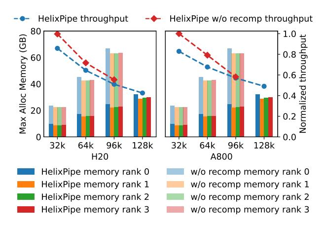

# 5.3 Communication Impact on the Two-fold FILO Schedule

To investigate the performance drop for HelixPipe with short sequence lengths on the A800 cluster and get more insights into the asynchronous two-fold FILO schedule, we present the decoupled computation and the estimated communication time in Figure 9. Specifically, this figure reports the forward execution time for the combined pre-attention and post-attention, and the attention for a layer of the 7B model. It also shows the estimated time for each p2p communication operation between pipeline stages under the two clusters. The overall communication volume is two activations as analyzed in Section 4.2.

This figure indicates that whether the two-fold FILO schedule works depends on if the attention computation can overlap the communication behind for the two-fold FILO schedule. Concretely, for A800 cluster, the attention computation for the sequence length of 32k is faster than the inter-node communication. As a result, the communication introduced by the two-fold FILO schedule cannot be fully overlapped by the attention computation, leading to the delay of following computation. Nevertheless, HelixPipe can still achieve descent speedup for longer sequence lengths on the A800 cluster, because the communication would be fully overlapped by the computation. On the other hand, the communication on H20 cluster is fast, so it can be perfectly overlapped by the attention computation, which means that HelixPipe can scale to any number of nodes on this cluster.

It is noteworthy that the p2p communication is implemented with NCCL [29], which relies on GPU SMs to perform communication. Such implementation may simultaneously delay the asynchronous communication and the computation. However, we observed that there was only a marginal delay in computation time, and the communication was overlapped as expectation. This is because only a small number of SMs is enough to fully exploit the communication bandwidth [22, 41].

## 5.4 Memory Footprint

To demonstrate the memory overhead for different pipeline parallelisms, the memory footprint across eight pipeline stages for

> **[图片提取文字 (无描述)]:**
> HelixPipe throughput HelixPipe w/o recomp throughput 80 Max Alloc Memory (GB) 60 40 20 128k 96k 128k 32k 64k 96k 32k 64k H20 008A HelixPipe memory rank 0 w/o recomp memory rank 0 HelixPipe memory rank 1 w/o recomp memory rank 1 HelixPipe memory rank 2 w/o recomp memory rank 2 HelixPipe memory rank 3 w/o recomp memory rank 3

Figure 11: The memory footprint and normalized throughput with and without the recomputation without attention strategy training the 3B model with 4 pipeline stages.

training the 3B model with 128k sequence length is shown in Figure 10. Note that for the same configuration, the memory overhead is almost the same for the two clusters. Besides, similar observations can be obtained for different number of pipeline stages.

The experiment results reveal that HelixPipe costs the lowest peak memory usage, and it shows the most balanced memory footprint across the eight pipeline stages. 1F1B consumes a skewed amount of memory for different pipeline stages and ZB1P maintains the same peak memory usage for all stages, as we have analyzed in Section 3.1. However, ZB1P incurs extremely high memory usage at the final stage. This is due to the need for stashing the gradients of the word embeddings for next token prediction and loss computation. Such memory is often stashed in fp32 format and ZB1P needs to save multiple micro batches for their backward W. AdaPipe achieves the goal of maximizing the memory utilization for first three stages, but fails for the following stages because the long sequence length makes it difficult to achieve the balance goal for adaptive partition.

#### 5.5 Recomputation Impact

The main benefits of HelixPipe on the memory side is from the recomputation without attention strategy. To reveal its impact on both the computation and memory overhead, we show the experiment results with and without this strategy for training a 3B model with 4 pipeline stages on the two clusters in Figure 11.

The results show that the recomputation without attention strategy would sacrifice the computation efficiency up to 20% for shorter sequence lengths such as 32k or 64k sequence length. However, as the sequence length increases, the throughput gap decreases and even gets near zero for 96k sequence length on the A800 cluster. This is because the execution time for the combined pre-attention and post-attention accounts for a large portion of each layer when compared with the attention for short sequences, but the portion would decrease drastically with longer sequence lengths. Moreover, after removing the recomputation without attention strategy, HelixPipe is unable to train longer sequence lengths beyond 128k.

## 6 Related Work

## 6.1 Long Sequence Transformer Training

Flash attention optimizes the attention computation on a single GPU by reducing the IO between GPU HBM and on-chip memory [\[4\]](#page-10-25). By lowering memory requirements from quadratic to linear scaling, it unlocks the potential for much longer sequence lengths.

Most existing work extends the sequence length with sequence parallelisms which split individual activations to multiple GPUs [\[8,](#page-10-12) [12,](#page-10-4) [15\]](#page-10-8). To partition an activation of shape [, , ℎ], there are two choices for sequence parallelisms. The first one is to partition along sequence () dimension. Ring self-attention [\[17,](#page-10-31) [19,](#page-10-9) [23,](#page-10-10) [25\]](#page-10-36), Megatron context parallelism [\[28\]](#page-10-11) and TeraPipe [\[20\]](#page-10-37) fall into this class. They partition the activations of queries, keys and values along sequence dimension to different GPUs, and use p2p communication to transfer required key and value partitions to compute the attention output. Another class of sequence parallelisms partition activations along the hidden size (ℎ) dimension. Methods including Megatron sequence parallelism [\[15\]](#page-10-8), Deepspeed Ulysses [\[12\]](#page-10-4) compute partial attention output and rely on collective communications to synchronize the final output.

Different from the above methods on the intra-layer level, WeiPipe resolves the long sequence transformer training from the interlayer level with pipeline parallelism [\[21\]](#page-10-14), which is similar to HelixPipe. However, it mainly focuses on reducing communication volume via transferring model weights and their gradients instead of activations. WeiPipe does not address the computation or memory overhead as HelixPipe targets on. Besides, the two-fold FILO schedule validates that the communication introduced by pipeline parallelisms can be effectively overlapped.

## 6.2 Computation-efficient Pipeline Parallelism

The computation dependency between layers and the optimization step in each training iteration leads to pipeline bubble when using pipeline parallelisms. The 1F1B pipeline in Megatron-LM is initially introduced by PipeDream [\[26\]](#page-10-5) and DAPPLE [\[7\]](#page-10-16). It partitions a model into a consecutive layers for each stage, and executes micro batches following one-forward-one-backward schedule. Instead of assigning a single set of consecutive layers to each stage, interleaved 1F1B reduces the pipeline bubble by partitioning the model to multiple chunks of layers, and each stage possesses a subset of chunks [\[27\]](#page-10-20). With more chunks, the pipeline bubble can be further reduced. However, it requires extensive micro batches to saturate the pipeline when attaining to its theoretical minimum pipeline bubble rate, making it less desirable for long sequence training. Chimera optimizes the pipeline bubble by duplicating the model states for each stage, and runs a bidirectional schedule to execute micro batches in two ends of stages [\[18\]](#page-10-33). Hanayo eliminates the need of model state duplication with a wave-like schedule to simulate the execution of duplicated model states [\[24\]](#page-10-38). Zero bubble pipeline decouples the gradient computation for input and parameters in the backward pass, and fills the bubble with the parameter gradient computation [\[31\]](#page-10-18).

GPipe also follows the FILO schedule to execute micro batches, but it simply partitions a model by layers to each stage [\[11\]](#page-10-21). To reduce the pipeline bubble of GPipe, breadth-first pipeline introduces the interleaved model partition like interleaved 1F1B, but it follows

the FILO schedule to achieve high GPU utilization with small batch size. [\[16\]](#page-10-39). Out-of-order backprop adopts the idea of executing non critical operations out of order in single GPU, data parallelism and pipeline parallelism to improve the GPU utilization [\[30\]](#page-10-40). At the pipeline level, its core idea is equivalent to zero bubble pipeline but follows the FILO schedule.

As discussed in Section [3.1,](#page-2-5) the partition strategy of the methods mentioned above is at the layer granularity, which makes the pipeline bubble proportional to the execution time of a layer. With longer sequence length, the bubble time also increases. HelixPipe breaks the boundary of layers with attention parallel partition to further reduce pipeline bubble and improve computation efficiency.

## 6.3 Memory-efficient Pipeline Parallelism

While activation memory imbalance in 1F1B pipelines has been mentioned by various studies [\[18,](#page-10-33) [24,](#page-10-38) [27\]](#page-10-20), few works have addressed this issue. BPipe designs a communication schedule to balance activations across pipeline stages by transferring activations from early to later stages [\[13\]](#page-10-13). However, this introduces additional data movement without computation efficiency benefits and can detrimentally affect communication efficiency when enabling data or tensor parallelism. AdaPipe exploits adaptive activation recomputation to balance both the memory overhead and execution time at every pipeline stage of 1F1B [\[35\]](#page-10-22). However, this work is mainly designed with up to 16k sequence length. As discussed in Section [3.1,](#page-2-5) when the sequence length is extremely long, it will dominate the computation time, leaving marginal space for AdaPipe to meet the balance.

HelixPipe adopts the FILO schedule to balance the memory footprint. Furthermore, it utilizes recomputation without attention along with chunked MLP to relieve the memory pressure.

## 7 Conclusion

We present HelixPipe, a novel pipeline parallelism method for efficient transformer training with long sequences. By introducing attention parallel partition, HelixPipe removes attention computation from pipeline bubbles, improving computation efficiency. The two-fold FILO micro batch schedule balances memory usage across stages while overlapping communication with computation. Further optimizations, such as recomputation without attention and chunked MLP, reduce memory overhead. Experiments demonstrate that HelixPipe outperforms existing methods, achieving up to 26% higher throughput when training a 7B model with 128k sequence length on 64 GPUs. Our work provides an effective solution for scaling transformer training to longer sequences.

## Acknowledgments

We would like to acknowledge that computational work involved in this research work is supported by NUS IT's Research Computing group using grant numbers NUSREC-HPC-00001.

## References

[1] Josh Abramson, Jonas Adler, Jack Dunger, Richard Evans, Tim Green, Alexander Pritzel, Olaf Ronneberger, Lindsay Willmore, Andrew J Ballard, Joshua Bambrick, et al. 2024. Accurate structure prediction of biomolecular interactions with AlphaFold 3. Nature (2024), 1–3.

- [2] Xiao Bi, Deli Chen, Guanting Chen, Shanhuang Chen, Damai Dai, Chengqi Deng, Honghui Ding, Kai Dong, Qiushi Du, Zhe Fu, et al. 2024. Deepseek llm: Scaling open-source language models with longtermism. arXiv preprint arXiv:2401.02954 (2024).
- [3] Tom Brown, Benjamin Mann, Nick Ryder, Melanie Subbiah, Jared D Kaplan, Prafulla Dhariwal, Arvind Neelakantan, Pranav Shyam, Girish Sastry, Amanda Askell, et al. 2020. Language models are few-shot learners. Advances in neural information processing systems 33 (2020), 1877–1901.
- [4] Tri Dao, Dan Fu, Stefano Ermon, Atri Rudra, and Christopher Ré. 2022. Flashattention: Fast and memory-efficient exact attention with io-awareness. Advances in Neural Information Processing Systems 35 (2022), 16344–16359.
- [5] DeepSeek-AI. 2024. DeepSeek-V2: A Strong, Economical, and Efficient Mixtureof-Experts Language Model. arXiv[:2405.04434](https://arxiv.org/abs/2405.04434) [cs.CL]
- [6] Abhimanyu Dubey, Abhinav Jauhri, Abhinav Pandey, Abhishek Kadian, Ahmad Al-Dahle, Aiesha Letman, Akhil Mathur, Alan Schelten, Amy Yang, Angela Fan, et al. 2024. The llama 3 herd of models. arXiv preprint arXiv:2407.21783 (2024).
- [7] Shiqing Fan, Yi Rong, Chen Meng, Zongyan Cao, Siyu Wang, Zhen Zheng, Chuan Wu, Guoping Long, Jun Yang, Lixue Xia, et al. 2021. DAPPLE: A pipelined data parallel approach for training large models. In Proceedings of the 26th ACM SIGPLAN Symposium on Principles and Practice of Parallel Programming. 431–445.
- [8] Jiarui Fang and Shangchun Zhao. 2024. A Unified Sequence Parallelism Approach for Long Context Generative AI. arXiv preprint arXiv:2405.07719 (2024).
- [9] Cong Guo, Rui Zhang, Jiale Xu, Jingwen Leng, Zihan Liu, Ziyu Huang, Minyi Guo, Hao Wu, Shouren Zhao, Junping Zhao, et al. 2024. GMLake: Efficient and Transparent GPU Memory Defragmentation for Large-scale DNN Training with Virtual Memory Stitching. In Proceedings of the 29th ACM International Conference on Architectural Support for Programming Languages and Operating Systems, Volume 2. 450–466.
- [10] Daya Guo, Qihao Zhu, Dejian Yang, Zhenda Xie, Kai Dong, Wentao Zhang, Guanting Chen, Xiao Bi, Yu Wu, YK Li, et al. 2024. DeepSeek-Coder: When the Large Language Model Meets Programming–The Rise of Code Intelligence. arXiv preprint arXiv:2401.14196 (2024).
- [11] Yanping Huang, Youlong Cheng, Ankur Bapna, Orhan Firat, Dehao Chen, Mia Chen, HyoukJoong Lee, Jiquan Ngiam, Quoc V Le, Yonghui Wu, et al. 2019. Gpipe: Efficient training of giant neural networks using pipeline parallelism. Advances in neural information processing systems 32 (2019).
- [12] Sam Ade Jacobs, Masahiro Tanaka, Chengming Zhang, Minjia Zhang, Reza Yazdani Aminadabi, Shuaiwen Leon Song, Samyam Rajbhandari, and Yuxiong He. 2024. System Optimizations for Enabling Training of Extreme Long Sequence Transformer Models. In Proceedings of the 43rd ACM Symposium on Principles of Distributed Computing. 121–130.
- [13] Taebum Kim, Hyoungjoo Kim, Gyeong-In Yu, and Byung-Gon Chun. 2023. Bpipe: Memory-balanced pipeline parallelism for training large language models. In International Conference on Machine Learning. PMLR, 16639–16653.
- [14] Weijie Kong, Qi Tian, Zijian Zhang, Rox Min, Zuozhuo Dai, Jin Zhou, Jiangfeng Xiong, Xin Li, Bo Wu, Jianwei Zhang, et al. 2024. HunyuanVideo: A Systematic Framework For Large Video Generative Models. arXiv preprint arXiv:2412.03603 (2024).
- [15] Vijay Anand Korthikanti, Jared Casper, Sangkug Lym, Lawrence McAfee, Michael Andersch, Mohammad Shoeybi, and Bryan Catanzaro. 2023. Reducing activation recomputation in large transformer models. Proceedings of Machine Learning and Systems 5 (2023).
- [16] Joel Lamy-Poirier. 2023. Breadth-first pipeline parallelism. Proceedings of Machine Learning and Systems 5 (2023).
- [17] Dacheng Li, Rulin Shao, Anze Xie, Eric P Xing, Xuezhe Ma, Ion Stoica, Joseph E Gonzalez, and Hao Zhang. 2024. Distflashattn: Distributed memory-efficient attention for long-context llms training. In First Conference on Language Modeling.
- [18] Shigang Li and Torsten Hoefler. 2021. Chimera: efficiently training large-scale neural networks with bidirectional pipelines. In Proceedings of the International Conference for High Performance Computing, Networking, Storage and Analysis. 1–14.
- [19] Shenggui Li, Fuzhao Xue, Chaitanya Baranwal, Yongbin Li, and Yang You. 2023. Sequence Parallelism: Long Sequence Training from System Perspective. In Proceedings of the 61st Annual Meeting of the Association for Computational Linguistics (Volume 1: Long Papers). 2391–2404.
- [20] Zhuohan Li, Siyuan Zhuang, Shiyuan Guo, Danyang Zhuo, Hao Zhang, Dawn Song, and Ion Stoica. 2021. Terapipe: Token-level pipeline parallelism for training large-scale language models. In International Conference on Machine Learning. PMLR, 6543–6552.
- [21] Junfeng Lin, Ziming Liu, Yang You, Jun Wang, Weihao Zhang, and Rong Zhao. 2025. WeiPipe: Weight Pipeline Parallelism for Communication-Effective Long-Context Large Model Training. In Proceedings of the 30th ACM SIGPLAN Annual Symposium on Principles and Practice of Parallel Programming. 225–238.
- [22] Aixin Liu, Bei Feng, Bing Xue, Bingxuan Wang, Bochao Wu, Chengda Lu, Chenggang Zhao, Chengqi Deng, Chenyu Zhang, Chong Ruan, et al. 2024. Deepseek-v3 technical report. arXiv preprint arXiv:2412.19437 (2024).
- [23] Hao Liu, Matei Zaharia, and Pieter Abbeel. 2023. Ring attention with blockwise transformers for near-infinite context. arXiv preprint arXiv:2310.01889 (2023).

- [24] Ziming Liu, Shenggan Cheng, Haotian Zhou, and Yang You. 2023. Hanayo: Harnessing Wave-like Pipeline Parallelism for Enhanced Large Model Training Efficiency. In Proceedings of the International Conference for High Performance Computing, Networking, Storage and Analysis. 1–13.
- [25] Ziming Liu, Shaoyu Wang, Shenggan Cheng, Zhongkai Zhao, Kai Wang, Xuanlei Zhao, James Demmel, and Yang You. 2024. WallFacer: Harnessing Multidimensional Ring Parallelism for Efficient Long Sequence Model Training. arXiv[:2407.00611](https://arxiv.org/abs/2407.00611) [cs.DC]<https://arxiv.org/abs/2407.00611>
- [26] Deepak Narayanan, Amar Phanishayee, Kaiyu Shi, Xie Chen, and Matei Zaharia. 2021. Memory-efficient pipeline-parallel dnn training. In International Conference on Machine Learning. PMLR, 7937–7947.
- [27] Deepak Narayanan, Mohammad Shoeybi, Jared Casper, Patrick LeGresley, Mostofa Patwary, Vijay Korthikanti, Dmitri Vainbrand, Prethvi Kashinkunti, Julie Bernauer, Bryan Catanzaro, et al. 2021. Efficient large-scale language model training on gpu clusters using megatron-lm. In Proceedings of the International Conference for High Performance Computing, Networking, Storage and Analysis. 1–15.
- [28] NVIDIA. 2025. Context Parallelism. Retrieved April 9, 2025 from [https://docs.nvidia.com/megatron-core/developer-guide/latest/api](https://docs.nvidia.com/megatron-core/developer-guide/latest/api-guide/context_parallel.html)[guide/context\\_parallel.html](https://docs.nvidia.com/megatron-core/developer-guide/latest/api-guide/context_parallel.html)
- [29] NVIDIA. 2025. NCCL. Retrieved April 13, 2025 from [https://github.com/NVIDIA/](https://github.com/NVIDIA/nccl) [nccl](https://github.com/NVIDIA/nccl)
- [30] Hyungjun Oh, Junyeol Lee, Hyeongju Kim, and Jiwon Seo. 2022. Out-of-order backprop: An effective scheduling technique for deep learning. In Proceedings of the Seventeenth European Conference on Computer Systems. 435–452.
- [31] Penghui Qi, Xinyi Wan, Guangxing Huang, and Min Lin. 2024. Zero Bubble (Almost) Pipeline Parallelism. In The Twelfth International Conference on Learning Representations.
- [32] Samyam Rajbhandari, Jeff Rasley, Olatunji Ruwase, and Yuxiong He. 2020. Zero: Memory optimizations toward training trillion parameter models. In SC20: International Conference for High Performance Computing, Networking, Storage and Analysis. IEEE, 1–16.
- [33] John K Salmon, Mark A Moraes, Ron O Dror, and David E Shaw. 2011. Parallel random numbers: as easy as 1, 2, 3. In Proceedings of 2011 international conference for high performance computing, networking, storage and analysis. 1–12.
- [34] Mohammad Shoeybi, Mostofa Patwary, Raul Puri, Patrick LeGresley, Jared Casper, and Bryan Catanzaro. 2019. Megatron-lm: Training multi-billion parameter language models using model parallelism. arXiv preprint arXiv:1909.08053 (2019).
- [35] Zhenbo Sun, Huanqi Cao, Yuanwei Wang, Guanyu Feng, Shengqi Chen, Haojie Wang, and Wenguang Chen. 2024. AdaPipe: Optimizing Pipeline Parallelism with Adaptive Recomputation and Partitioning. In Proceedings of the 29th ACM International Conference on Architectural Support for Programming Languages and Operating Systems, Volume 3. 86–100.
- [36] Hugo Touvron and Louis Martin et al. 2023. Llama 2: Open Foundation and Fine-Tuned Chat Models. arXiv[:2307.09288](https://arxiv.org/abs/2307.09288)
- [37] Hugo Touvron, Thibaut Lavril, Gautier Izacard, Xavier Martinet, Marie-Anne Lachaux, Timothée Lacroix, Baptiste Rozière, Naman Goyal, Eric Hambro, Faisal Azhar, Aurelien Rodriguez, Armand Joulin, Edouard Grave, and Guillaume Lample. 2023. LLaMA: Open and Efficient Foundation Language Models. arXiv[:2302.13971](https://arxiv.org/abs/2302.13971)
- [38] Eric P Xing, Qirong Ho, Wei Dai, Jin-Kyu Kim, Jinliang Wei, Seunghak Lee, Xun Zheng, Pengtao Xie, Abhimanu Kumar, and Yaoliang Yu. 2015. Petuum: A new platform for distributed machine learning on big data. In Proceedings of the 21th ACM SIGKDD International Conference on Knowledge Discovery and Data Mining. 1335–1344.
- [39] Yang You, Jing Li, Sashank Reddi, Jonathan Hseu, Sanjiv Kumar, Srinadh Bhojanapalli, Xiaodan Song, James Demmel, Kurt Keutzer, and Cho-Jui Hsieh. 2020. Large Batch Optimization for Deep Learning: Training BERT in 76 minutes. In International Conference on Learning Representations. [https://openreview.net/](https://openreview.net/forum?id=Syx4wnEtvH) [forum?id=Syx4wnEtvH](https://openreview.net/forum?id=Syx4wnEtvH)
- [40] Tailing Yuan, Yuliang Liu, Xucheng Ye, Shenglong Zhang, Jianchao Tan, Bin Chen, Chengru Song, and Di Zhang. 2024. Accelerating the Training of Large Language Models using Efficient Activation Rematerialization and Optimal Hybrid Parallelism. In 2024 USENIX Annual Technical Conference (USENIX ATC 24). 545–561.
- [41] Zheng Zhang, Yaqi Xia, Hulin Wang, Donglin Yang, Chuang Hu, Xiaobo Zhou, and Dazhao Cheng. 2024. MPMoE: Memory Efficient MoE for Pre-trained Models with Adaptive Pipeline Parallelism. IEEE Transactions on Parallel and Distributed Systems (2024).
- [42] Lianmin Zheng, Zhuohan Li, Hao Zhang, Yonghao Zhuang, Zhifeng Chen, Yanping Huang, Yida Wang, Yuanzhong Xu, Danyang Zhuo, Eric P Xing, et al. 2022. Alpa: Automating inter-and {Intra-Operator} parallelism for distributed deep learning. In 16th USENIX Symposium on Operating Systems Design and Implementation (OSDI 22). 559–578.