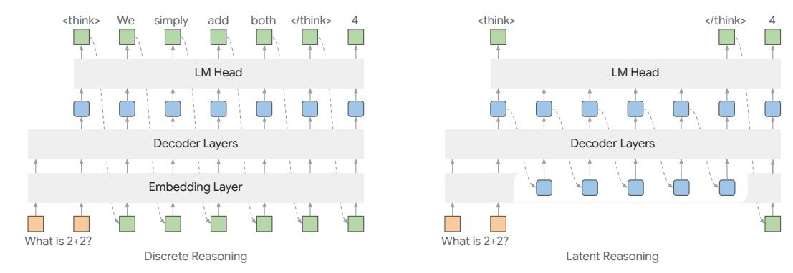

# 1 Introduction

Latent reasoning has emerged as a compelling alternative to traditional autoregressive reasoning methods in large language models (LLMs) [\[8,](#page-9-0) [35,](#page-11-0) [39\]](#page-11-1). In contrast to the conventional chain-of-thought (CoT) [\[43,](#page-12-0) [17,](#page-10-0) [10\]](#page-9-1), which relies on the discrete decoding and sampling process, latent reasoning enables LLMs to reason internally with continuous hidden representations from the previous steps. For instance, Coconut [\[11\]](#page-10-1) achieves latent reasoning by utilizing the model's last hidden state as 'continuous thought', feeding it back as input embeddings to the next reasoning step, thereby matching the performance of CoT on reasoning-intensive tasks. To show the difference between the autoregressive generation and latent reasoning, we compare both approaches in Figure [1.](#page-1-0)

Nevertheless, existing methods in latent reasoning utilize extensive CoT traces for training. That is, CoT trajectories are required to learn informative latent representations. An example is CODI [\[35\]](#page-11-0), which adopts self-distillation to train on discrete CoT tokens and transfers learnt features into continuous thoughts. Although recurrent latent reasoning removes the need for CoT data, it relies on training a multi-block LLM from scratch to reason internally [\[8\]](#page-9-0). Moreover, these methods employ tailored training paradigms for latent representation learning, incurring high training costs

> **[图片提取文字 (无描述)]:**
> <think> simply </think> <think> </think> We add both LM Head LM Head Decoder Layers Decoder Layers **Embedding Layer** What is 2+2? What is 2+2? Discrete Reasoning Latent Reasoning

Figure 1: Comparison between discrete reasoning (left) and latent reasoning (right). Unlike the autoregressive sampling process in discrete reasoning, latent reasoning incorporates hidden representations from previous steps to enhance reasoning performance (between <think> and </think>).

and overlooking the inherent reasoning capabilities of LLMs [\[11,](#page-10-1) [8,](#page-9-0) [34\]](#page-11-2). For example, Coconut [\[11\]](#page-10-1) requires multi-stage training on CoT steps, which not only increases training compute but also delays the model's acquisition of complete reasoning chains [\[35\]](#page-11-0). Furthermore, we find that latent reasoning is often incompatible with LLMs due to the discrepancy between output hidden states and input embeddings (as we show Section [4.3\)](#page-6-0). That is, feeding hidden states into the next decoding step degrades generation quality (e.g., repetition, incoherence), causing difficulties in adapting LLMs for latent reasoning. Therefore, an ideal latent reasoning method should capitalize on pretrained LLMs' generalizability by seamlessly integrating continuous representations, preserving LLMs' interpretability while mitigating CoT-dependent extensive training for broader applicability.

To this end, we introduce hybrid reasoning policy optimization (HRPO), a novel hybrid latent reasoning optimization framework based on reinforcement learning (RL). HRPO unifies policy learning with latent reasoning, thereby utilizing the LLMs' intrinsic reasoning patterns without relying on CoT trajectories. To preserve the generative capabilities while encouraging the model to reason in the continuous space, HRPO introduces a gating mechanism to gradually incorporate hidden state representations from previous steps into sampled token embeddings. The gating mechanism is initially configured in a way that the inputs come predominantly from the sampled tokens. As training progresses, the gate learns to incorporate richer, more informative features from previous hidden states for improved internal reasoning. Since the sampling operation introduces stochasticity, HRPO rollouts can be performed like standard RL methods, with hybrid outputs (tokens and latent representations) stored in the rollout buffer for policy updates. For optimization, HRPO leverages a simple outcome-based reward and employs the hybrid rollout buffer to calculate log probabilities, enabling policy gradient updates that adaptively integrate both token-level and latent representations. By bridging discrete and continuous reasoning, HRPO provides a scalable and training-efficient solution that unlocks latent reasoning in existing LLMs. As a result, HRPO enhances the adaptability of latent reasoning and leads to superior performance on both knowledge- and reasoning-intensive tasks. We highlight our contributions in the following[1](#page-1-1) :

- We introduce HRPO, the first reinforcement learning-based approach for hybrid reasoning, empowering LLMs to autonomously develop latent reasoning capabilities.
- We design a gating mechanism to preserve LLMs' generative abilities, which starts by prioritizing sampled token embeddings and, through RL-driven updates, progressively incorporates the continuous representations.
- By leveraging the LLMs' inherent reasoning patterns through HRPO, we mitigate the need for chain-of-thought annotations and expensive multi-stage training, offering an efficient and scalable alternative to existing latent reasoning methods.
- To show the efficacy of the proposed hybrid latent reasoning, we evaluate on multiple knowledge and reasoning benchmarks and show that it outperforms existing models and latent reasoning baselines, demonstrating consistent performance gains across diverse scenarios.

1Our implementation is available at https://github.com/Yueeeeeeee/HRPO.

In addition, we provide insights into RL-based training of latent reasoning models and present intriguing reasoning patterns emerging from HRPO.

