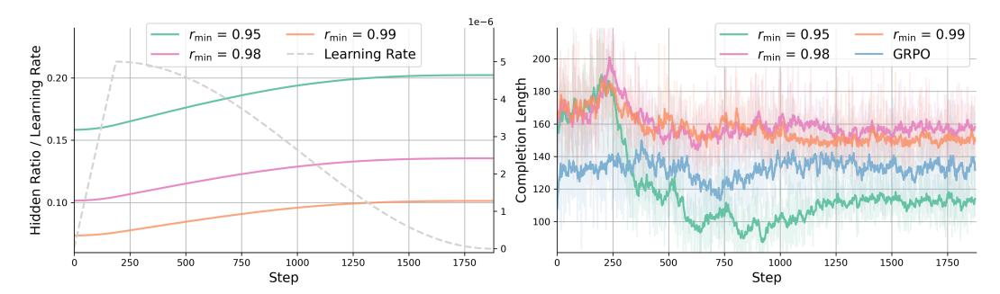
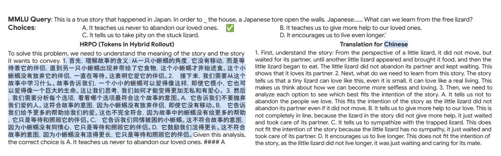

# 4 Experiments

We evaluate HRPO on both knowledge- and reasoning-intensive tasks: (1) open-domain & multi-hop knowledge-intensive question answering (Knowledge); and (2) science, technology, engineering or mathematics (STEM) benchmarks. The experimental results are reported as follows.

Table 1: Evaluation performance of various larger LLMs and trained models on open-domain and multi-hop QA benchmarks. The table reports exact match scores based on top-3 retrieved documents on five datasets: NQ, TriviaQA, HotpotQA, 2WikiMQA and Bamboogle. The upper block reports results for several RAG baselines using the larger Qwen 2.5 7B LLM, while the lower two blocks evaluate smaller Qwen models (1.5B and 3B) trained with different strategies.

|             | NQ    | TriviaQA | HotpotQA              | 2WikiMQA | Bamboogle | Average |
|-------------|-------|----------|-----------------------|----------|-----------|---------|
|             |       |          | Qwen2.5-7B-Instruct   |          |           |         |
| QA          | 0.134 | 0.408    | 0.183                 | 0.250    | 0.120     | 0.219   |
| CoT         | 0.048 | 0.185    | 0.092                 | 0.111    | 0.232     | 0.134   |
| IRCoT       | 0.224 | 0.478    | 0.133                 | 0.149    | 0.224     | 0.242   |
| Search-o1   | 0.151 | 0.443    | 0.187                 | 0.176    | 0.296     | 0.251   |
| RAG         | 0.349 | 0.585    | 0.299                 | 0.235    | 0.208     | 0.335   |
|             |       |          | Qwen2.5-1.5B-Instruct |          |           |         |
| SFT         | 0.094 | 0.193    | 0.129                 | 0.210    | 0.024     | 0.130   |
| RAG         | 0.288 | 0.477    | 0.228                 | 0.203    | 0.072     | 0.254   |
| PPO         | 0.327 | 0.527    | 0.256                 | 0.242    | 0.184     | 0.307   |
| GRPO        | 0.293 | 0.480    | 0.202                 | 0.213    | 0.120     | 0.261   |
| HRPO (Ours) | 0.364 | 0.553    | 0.273                 | 0.276    | 0.216     | 0.337   |
|             |       |          | Qwen2.5-3B-Instruct   |          |           |         |
| SFT         | 0.249 | 0.292    | 0.186                 | 0.248    | 0.112     | 0.217   |
| RAG         | 0.348 | 0.544    | 0.255                 | 0.226    | 0.080     | 0.291   |
| PPO         | 0.356 | 0.563    | 0.304                 | 0.293    | 0.240     | 0.351   |
| GRPO        | 0.381 | 0.570    | 0.308                 | 0.303    | 0.272     | 0.367   |
| HRPO (Ours) | 0.378 | 0.593    | 0.316                 | 0.318    | 0.296     | 0.380   |

#### 4.1 Evaluation on Knowledge Benchmarks

We first evaluate HRPO on five open-domain and multi-hop question answering (QA) datasets: Natural Questions (NQ), TriviaQA, HotpotQA, 2WikiMultiHopQA (2WikiMQA) and Bamboogle [\[14,](#page-10-5) [19,](#page-10-6) [21,](#page-10-7) [30,](#page-11-13) [48\]](#page-12-5). For each query, we use the E5 embedding model [\[42\]](#page-11-14) to retrieve the top-3 Wikipedia documents as context (details presented in Section [A\)](#page-13-0). Following [\[18\]](#page-10-8), we merge the NQ and HotpotQA training sets to train HRPO models, and evaluate it on each dataset's evaluation split. The exact match results of HRPO and baselines (including supervised fine-tuning (SFT), retrieval augmented generation (RAG) [\[22\]](#page-10-9) and RL-based PPO [\[32\]](#page-11-9) and GRPO [\[33\]](#page-11-11)) for the 1.5B and 3B Qwen2.5 Instruct models [\[46\]](#page-12-6) are presented in Table [1.](#page-5-0) We also include comparisons to several QA and RAG baselines using the larger Qwen2.5-7B-Instruct as backbone, including: direct inference (QA), chain-of-thought (CoT) [\[43\]](#page-12-0), interleaving retrieval with CoT (IRCoT) [\[41\]](#page-11-15), Search-o1 [\[23\]](#page-10-10) and RAG [\[22\]](#page-10-9). For each block in Table [1,](#page-5-0) we mark the best performance in bold for clarity.

Across all knowledge benchmarks, HRPO delivers the strongest exact match (EM) scores with smaller Qwen models and rivals the much larger 7B baselines. In particular, we observe: (1) HRPO reaches 0.380 EM with Qwen2.5-3B, outperforming the strongest 7B RAG baseline by 4.5%. Similarly, HRPO with the smaller 1.5B backbone scores an average of 0.337, achieving consistent gains and surpassing PPO by 3.0%. (2) HRPO consistently outperforms other RL-based methods. For example, HRPO with both the 1.5B and 3B backbones surpasses the strongest RL baseline by 3.0% and 1.3% respectively; the only dataset both models perform similarly is NQ. (3) Interestingly, GRPO underperforms PPO by 4.6% on the 1.5B backbone but outperforms it by 1.6% on the 3B model, likely a consequence of sparser rewards and limited sampled trajectories with a smaller model. (4) RLbased methods perform on par with the best-performing RAG baseline, with HRPO delivering the largest performance gains—particularly on terse, incomplete queries (NQ) and multi-hop questions (2WikiMQA)—while yielding modest improvements on one-hop datasets like TriviaQA. Overall, these results demonstrate that combining retrieval augmentation with hybrid latent reasoning yields state-of-the-art knowledge performance under computation constraints, establishing HRPO as a competitive alternative to both RL-based learning methods and larger retrieval augmented LLMs.

Table 2: Evaluation performance of various larger LLMs and trained models on STEM benchmarks. The table presents accuracy scores on five datasets: GSM8k, MATH, MATH500, MMLU-ST and ARC-C. The upper block reports results for several few-shot baseline LLMs ≥ 7B, while the lower two blocks evaluate smaller Qwen models (1.5B and 3B) trained with different strategies.

|                 | GSM8k | MATH  | MATH500                 | MMLU-ST | ARC-C | Average |
|-----------------|-------|-------|-------------------------|---------|-------|---------|
|                 |       |       | Larger LLMs (Size ≥ 7B) |         |       |         |
| DeepSeekMath-7B | 0.642 | 0.362 | 0.346                   | 0.565   | 0.678 | 0.519   |
| Gemma-2-9B      | 0.707 | 0.377 | 0.364                   | 0.651   | 0.682 | 0.556   |
| Qwen2.5-7B      | 0.854 | 0.498 | 0.464                   | 0.723   | 0.637 | 0.635   |
| MAmmoTH2-7B     | 0.684 | 0.367 | 0.396                   | 0.624   | 0.817 | 0.578   |
| MAmmoTH2-8B     | 0.704 | 0.358 | 0.732                   | 0.642   | 0.822 | 0.652   |
|                 |       |       | Qwen2.5-1.5B-Instruct   |         |       |         |
| SFT             | 0.560 | 0.300 | 0.302                   | 0.403   | 0.602 | 0.433   |
| Distilled CoT   | 0.706 | 0.503 | -                       | -       | -     | -       |
| PPO             | 0.694 | 0.507 | 0.518                   | 0.566   | 0.715 | 0.600   |
| GRPO            | 0.711 | 0.502 | 0.524                   | 0.562   | 0.737 | 0.607   |
| HRPO (Ours)     | 0.720 | 0.518 | 0.536                   | 0.569   | 0.742 | 0.617   |
|                 |       |       | Qwen2.5-3B-Instruct     |         |       |         |
| SFT             | 0.670 | 0.348 | 0.360                   | 0.454   | 0.474 | 0.461   |
| Distilled CoT   | 0.799 | 0.575 | -                       | -       | -     | -       |
| PPO             | 0.819 | 0.597 | 0.604                   | 0.582   | 0.811 | 0.682   |
| GRPO            | 0.834 | 0.602 | 0.604                   | 0.601   | 0.814 | 0.691   |
| HRPO (Ours)     | 0.845 | 0.613 | 0.630                   | 0.590   | 0.820 | 0.700   |

### 4.2 Evaluation on STEM Benchmarks

We also evaluate the performance of the proposed HRPO on the reasoning-intensive STEM datasets: GSM8k, MATH, MATH500, MMLU-STEM (MMLU-ST) and ARC-Challenge (ARC-C) [\[4,](#page-9-8) [13,](#page-10-11) [24,](#page-10-12) [12,](#page-10-13) [3\]](#page-9-9). Table [2](#page-6-1) reports the performance of HRPO alongside fine-tuned baselines (SFT, SFT with distilled CoT from QwQ [\[40\]](#page-11-16)) and RL baselines (PPO [\[32\]](#page-11-9) and GRPO [\[33\]](#page-11-11)) on the Qwen 2.5 1.5B and 3B Instruct models [\[46\]](#page-12-6). In addition, we select several larger LLMs (≥ 7B in size) using few-shot CoT for comparison [\[46,](#page-12-6) [33,](#page-11-11) [49\]](#page-12-7). For GSM8k, we train on the training split, and for MATH and MATH500, we train on the MATH training split. For MMLU-ST and ARC-C, we train on the merged auxiliary MMLU and ARC-C training sets. Distilled CoT is only available for GSM8k and MATH due to dataset size constraints. We also highlight the best scores in each block in bold.

Across the five STEM benchmarks, HRPO delivers the strongest results with compact Qwen backbones and could match the performance of much larger LLMs. Our key observations are: (1) SFT underperforms compared to distilled CoT and RL-based methods, suggesting the efficacy of RL with verifiable rewards on reasoning-intensive tasks. (2) With the 3B backbone, HRPO achieves an average accuracy of 0.700, matching the best 7B baseline on four of the datasets. Even the 1.5B HRPO averages at 0.617, outperforming the 7B leader on MATH by 2.0%. (3) At 1.5B, HRPO improves on the strongest alternative GRPO with notable boosts on MATH and MATH500 (1.6% and 1.2%), whereas the average gain narrows at 3B, implying that HRPO is more beneficial for smaller models. (4) HRPO registers the highest accuracies recorded for sub-7B models on MATH (0.613) and MATH500 (0.630), demonstrating the value of RL-based hybrid reasoning on challenging benchmarks. Taken together, these results show that hybrid latent reasoning unlocks the power of much larger LLMs in compact backbones, proving the effectiveness of the proposed HRPO.

#### 4.3 Analysis of HRPO

Different Strategies for Latent Reasoning. We compare different strategies to compute latent representations. Specifically, we use three methods to integrate hidden states into RL and train the 1.5B Qwen model on the MATH dataset. These variants are: (1) hidden states, which use the final layer hidden states as the next input; (2) interpolation, which employs interpolated embeddings as defined in Equation (3); and (3) HRPO, our hybrid latent reasoning in Equation (4). We visualize the exponential moving average (EMA) of rewards along with the GRPO baseline in Figure 3. Due to the mismatch between hidden states and embeddings, using hidden states degrades generation and yields nonsensical rollouts with zero reward. Although interpolation performs similar to HRPO for the first few hundred steps, the rewards eventually collapse and only slowly recover, likely because interpolation introduces excessive noise. We also provide a direct comparison between HRPO and latent reasoning methods in Section B. Overall, our

> **[图片提取文字 (无描述)]:**
> **HRPO** Interpolation Hidden States **GRPO** 8.0 0.6 Reward FO 0.2 0.0 800 200 400 600 Step

Figure 3: Reward on MATH for Qwen-2.5-1.5B using different latent reasoning strategies.

approach achieves superior training dynamics with faster convergence while maintaining stability comparable to GRPO, highlighting the efficacy of our hybrid design choice in HRPO.

> **[图片提取文字 (无描述)]:**
> 1e-6  $r_{\min} = 0.99$  $r_{\min} = 0.95$  $r_{\min} = 0.99$  $r_{\min} = 0.95$ Hidden Ratio / Learning Rate  $r_{\min} = 0.98$  $r_{\min} = 0.98$ Learning Rate **GRPO** 200 ength 160 Completion 140 100 250 500 750 1000 1250 1500 1750 250 500 750 1000 1250 1500 1750 Step Step

Figure 4: Hidden ratio with varying  $r_{\min}$  in  $\exp(-c \cdot \text{softplus}(\Lambda))$  and learning rate. We visualize the hidden ratio and completion length for training runs with  $r_{\min}$  from [0.95, 0.98, 0.99].

Ratio of Latent Representations. We track how the balance between discrete tokens and continuous latent representations shifts as LLMs learn to reason hybridly. Here, we train Qwen 1.5B on the knowledge task and visualize both the mean hidden ratios (i.e.,  $\sqrt{1-a_t^2}$ ) and completion lengths (along with GRPO) in Figure 4. Across all runs, the hidden ratio increases steadily, even as the learning rate tapers off toward the end of training under a cosine schedule. In addition, completion lengths increase during the initial phase and later decline across all methods, with the drops most significant in HRPO. Furthermore, setting  $r_{\min} = 0.95$  leads to an interesting behavior where completion lengths substantially decrease—an effect not seen in the other variants2. This may be because the hidden representations effectively capture historical context, thereby shortening completions while maintaining or even improving performance (see Table 3). As such, hybrid latent reasoning could be particularly effective when leveraging contextual information for reasoning.

Table 3: Impact of  $\Lambda$ -initialization on HRPO's performance across knowledge and STEM tasks.

| Init Range     |       |          | Knov     | wledge   |           |         |  |  |
|----------------|-------|----------|----------|----------|-----------|---------|--|--|
|                | NQ    | TriviaQA | HotpotQA | 2WikiMQA | Bamboogle | Average |  |  |
| [0.95 - 0.999] | 0.364 | 0.553    | 0.273    | 0.264    | 0.184     | 0.328   |  |  |
| [0.98 - 0.999] | 0.336 | 0.553    | 0.263    | 0.276    | 0.216     | 0.329   |  |  |
| [0.99 - 0.999] | 0.336 | 0.534    | 0.258    | 0.275    | 0.216     | 0.324   |  |  |
| Init Range     | STEM  |          |          |          |           |         |  |  |
|                | GSM8k | MATH     | MATH500  | MMLU-ST  | ARC-C     | Average |  |  |
| [0.95 - 0.999] | 0.705 | 0.516    | 0.536    | 0.569    | 0.735     | 0.612   |  |  |
| [0.98 - 0.999] | 0.703 | 0.509    | 0.532    | 0.563    | 0.732     | 0.608   |  |  |
| [0.99 - 0.999] | 0.720 | 0.518    | 0.526    | 0.567    | 0.742     | 0.614   |  |  |

 $^2r_{\min}$  is used to initialize  $\Lambda$  such that  $\exp(-c \cdot \text{softplus}(\Lambda))$  is drawn uniformly from  $[r_{\min}, 0.999]$ .

> **[图片提取文字 (无描述)]:**
> $\tau = 0.3$  $\tau = 0.7$  $\tau = 0.3$  $\tau = 0.7$  $\tau = 0.5$  $\tau = 0.5$  $\tau = 0.9$  $\tau = 0.9$ 0.8 300 Length Reward FO Pool Completion 800 150 -0.2 400 400 600 1200 200 600 1000 1200 1400 0 200 800 1000 1400 800 Step Step

Figure 5: Sensitivity analysis for temperature τ in Equation [\(3\)](#page-3-0). We visualize the reward and completion length for training runs with different temperature selected from [0.3, 0.5, 0.7, 0.9].

Initialization of Λ for Gating. Beyond hidden ratio, we examine how the initialization of Λ—which control the balance between latent features and token embeddings—affects HRPO performance. Specifically, we initialize exp(−c · softplus(Λ)) from [rmin, 0.999] and report the results on Qwen 1.5B in Table [3,](#page-7-3) where lowering rmin yields a higher initial hidden ratio. For the knowledge domain, performance improves as rmin decreases: the best average performance occurs at rmin = 0.98, and most individual datasets peak at rmin = 0.95. In contrast, the STEM benchmarks display a bimodal trend: performance rises when rmin is either lower or higher, but drops for the intermediate range [0.98, 0.999]. This pattern implies that the model profits from emphasizing either explicit token trajectories or latent representations, whereas a mid-level mix is sub-optimal. In summary, our results show that knowledge tasks benefit from lower rmin, whereas optimal performance for STEM tasks arises from leaning toward either explicit token trajectories or latent representations.

Sensitivity of τ on Hybrid Reasoning. We further investigate the impact of temperature τ on HRPO: lower τ values reduce noise but overemphasize top tokens, whereas larger τ spreads probability mass across more tokens. We explore τ ∈ {0.3, 0.5, 0.7, 0.9} and present the rewards and completion lengths of the 1.5B Qwen model on MMLU in Figure [5.](#page-8-0) The left panel indicates that τ = 0.3 and τ = 0.5 converge faster and reach the highest reward plateau, outperforming higher values (τ ≥ 0.7) and showing the benefits of a smaller τ . Interestingly, the right panel reveals that both smaller and larger τ values shorten completion lengths, while τ = 0.5 and τ = 0.7 maintain longer generations. This may be because lower τ sharpens token distribution, yielding a confident latent vector that lets HRPO finish quickly. In contrast, higher τ flattens the distribution and enhances informativeness, prompting the policy to extract answers in shorter rollouts. Overall, we find HRPO to be robust across varuing τ selections, only completion length varies noticeably. Further analysis is in Section [B.](#page-15-0) Confdential - Google DeepMind

> **[图片提取文字 (无描述)]:**
> MMLU Query: This is a true story that happened in Japan. In order to the house, a Japanese tore open the walls. Japanese...... What can we learn from the free lizard? Choices: A. It teaches us never to abandon our loved ones. B. It teaches us to give more help to our loved ones. C. It tells us to take pity on the stuck lizard. D. It encourages us to live even longer.' HRPO (Tokens in Hybrid Rollout) Translation for Chinese 1. First, understand the story: From the perspective of a little lizard, it did not move, but To solve this problem, we need to understand the meaning of the story and the story waited for its partner, until another little lizard appeared and brought it food, and then the it wants to convey. 1. 首先, 理解故事的含义:从一只小蜥蜴的角度, 它没有移动, 而是等 little lizard began to eat. The little lizard did not abandon its partner and kept waiting. This 待着它的伴侣, 直到另一只小蜥蜴出现并带给了它食物, 这个小蜥蜴才开始进食。这个小 shows that it loves its partner. 2. Next, what do we need to learn from this story. The story 蜥蜴没有放弃它的伴侣,一直在等待。这表明它爱它的伴侣。2. 接下来,我们需要从这个 tells us that a tiny lizard can love like this, even it is small, it can love like a real living. This 故事中学习什么。故事告诉我们,一个小小的蜥蜴可以爱得像这样,即使它很小,它也可 makes us think about how we can become more selfless and loving. 3. Then, we need to 以爱得像一个巨大的生命。这让我们思考, 我们如何才能变得更加无私和有爱心。 3. 然后 analyze each option to see which best fits the intention of the story. A. It tells us not to 我们需要分析每个选项, 看看哪个选项最符合这个故事的意图。A. 它告诉我们不要抛弃 abandon the people we love. This fits the intention of the story as the little lizard did not 我们爱的人。这符合故事的意图, 因为小蜥蜴没有放弃伴侣, 即使它没有移动。B. 它告诉 abandon its partner even if it did not move. B. It tells us to give more help to our love. This is 我们给予更多的帮助给我们的爱。这也不完全符合, 因为故事中的蜥蜴没有给更多的帮助 not completely in line, because the lizard in the story did not give more help, it just waited 它只是等待和照顾它的伴侣。C. 它告诉我们同情被困的小蜥蜴。这不符合故事的意图. and took care of its partner. C. It tells us to sympathize with the trapped lizard. This does 因为小蜥蜴没有同情心, 它只是等待和照顾它的伴侣。D. 它鼓励我们活得更长。这不符合 not fit the intention of the story because the little lizard has no sympathy, it just waited and 故事的意图, 因为小蜥蜴没有活得更长, 它只是等待和照顾它的伴侣。Given this analysis, took care of its partner. D. It encourages us to live longer. This does not fit the intention of the correct choice is A. It teaches us never to abandon our loved ones. #### A the story, as the little lizard did not live longer, it was just waiting and caring for its mate.

Figure 6: Example cross-lingual reasoning (English-Chinese) and its translation for HRPO.

Hybrid Latent Reasoning Patterns. Finally, we highlight several intriguing reasoning patterns that emerge from HRPO. First, the hybrid outputs show readable trajectories by interpreting the tokens even without any CoT supervision. Second, HRPO exhibits cross-lingual patterns in some completions, fluidly integrating tokens from different languages, suggesting that latent representations can generalize across linguistic boundaries (see Figure [6\)](#page-8-1). Moreover, the hybrid reasoning process often delivers compact yet accurate responses to simple or factual queries, where the model requires fewer decoding steps thanks to the richer context encoded in the hidden representations. These

emergent patterns indicate that hybrid latent reasoning can improve both interpretability and efficiency over existing latent reasoning approaches. Further qualitative examples can be found in Section [C.](#page-18-0)

