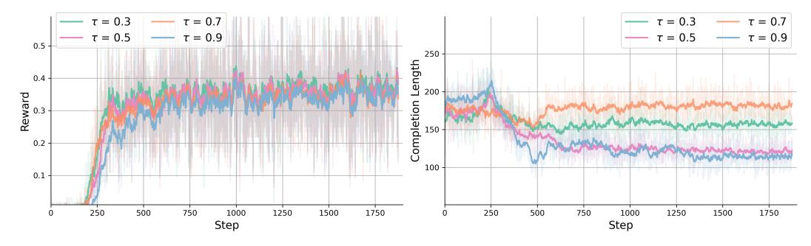
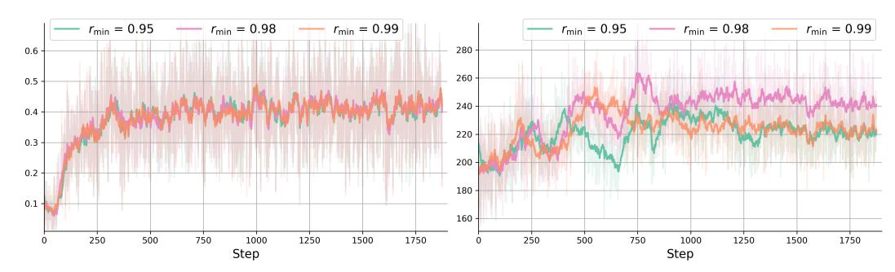

# B Additional Results

Comparison to Latent Reasoning Methods. In addition to strong RL methods such as PPO and GRPO in our main experiments, we also benchmark the proposed HRPO against additional latent reasoning baselines. Specifically, we evaluate HRPO, Coconut and CODI on the GSM8K and MATH reasoning datasets, all using the 1.5B Qwen backbone. For Coconut, we train with its augmented CoT data (no MATH split is available), whereas for CODI we adopt the original datasets' CoT trajectories. The results are reported in Table [6.](#page-15-2) We observe: (1) HRPO achieves the best accuracy on both datasets, with 9.42% and 23.63% respective gains over the best performing latent reasoning baseline CODI. (2) Even compared to distilled CoT from a significantly larger model QwQ, HRPO still scores consistent improvements on both datasets, showing the effectiveness of our hybrid latent reasoning. (3) Coconut lags behind on GSM8k, indicating limitations of latent reasoning by compressing CoT tokens, whereas CODI improves substantially with CoT SFT but still trails Distilled CoT and HRPO. Overall, HRPO achieves the best performance against all baselines, demonstrating its consistent advantages over CoT distillation and prior latent reasoning methods.

Table 6: Performance comparison of HRPO against alternative latent reasoning methods and distilled CoT baseline.

|          | Coconut |      | CODI  |       | Distilled CoT |       | HRPO  |       |
|----------|---------|------|-------|-------|---------------|-------|-------|-------|
|          | GSM8k   | MATH | GSM8k | MATH  | GSM8k         | MATH  | GSM8k | MATH  |
| Accuracy | 0.315   | -    | 0.658 | 0.419 | 0.706         | 0.503 | 0.720 | 0.518 |

Sensitivity Analysis for Λ and τ . In addition to the results reported in Table [3,](#page-7-3) we further present the performance of various Λ initializations on the Qwen 3B model, as shown in Table [7.](#page-16-0) Our observations echo the same trends on the 1.5B backbone: a smaller initial rmin consistently benefits both knowledge and STEM tasks. Moreover, performance peaks when rmin is selected either lower or higher, and drops slightly within the intermediate range of [0.98, 0.999]. We also examine the sensitivity of the τ hyperparameter used to construct the interpolated embeddings and present the corresponding results for both backbone models in Table [8.](#page-16-1) The training rewards and completion lengths for GSM8k, MATH and the knowledge tasks are shown in Figure [10,](#page-16-2) Figure [11](#page-17-0) and Figure [12.](#page-17-1) We note that choosing τ in the range of 0.5 – 0.7 offers a reliable balance of efficiency and accuracy, as the performance often peaks around this interval for both backbone models. Overall, we find that

Table 7: Impact of Λ-initialization on HRPO's performance for the Qwen 3B backbone.

| Init Range     |       |          |          | Knowledge |           |         |  |  |
|----------------|-------|----------|----------|-----------|-----------|---------|--|--|
|                | NQ    | TriviaQA | HotpotQA | 2WikiMQA  | Bamboogle | Average |  |  |
| [0.95 - 0.999] | 0.845 | 0.613    | 0.622    | 0.576     | 0.820     | 0.695   |  |  |
| [0.98 - 0.999] | 0.842 | 0.600    | 0.614    | 0.585     | 0.813     | 0.691   |  |  |
| [0.99 - 0.999] | 0.838 | 0.606    | 0.630    | 0.590     | 0.817     | 0.696   |  |  |
| Init Range     | STEM  |          |          |           |           |         |  |  |
|                | GSM8k | MATH     | MATH500  | MMLU-ST   | ARC-C     | Average |  |  |
| [0.95 - 0.999] | 0.367 | 0.593    | 0.316    | 0.311     | 0.296     | 0.377   |  |  |
| [0.98 - 0.999] | 0.378 | 0.588    | 0.311    | 0.298     | 0.296     | 0.374   |  |  |
| [0.99 - 0.999] | 0.375 | 0.584    | 0.309    | 0.318     | 0.288     | 0.375   |  |  |

HRPO benefits from a smaller initial rmin, which outperforms larger rmin settings and highlights the value of latent representations for complex reasoning. Moreover, HRPO is robust to the choice of τ , where the performance scores remain stable with only minor fluctuations at the extremes.

Table 8: Impact of τ on HRPO's performance for both backbone models.

| Model     |       | Qwen2.5-1.5B |       |       |       | Qwen2.5-3B |       |       |
|-----------|-------|--------------|-------|-------|-------|------------|-------|-------|
| τ         | 0.3   | 0.5          | 0.7   | 0.9   | 0.3   | 0.5        | 0.7   | 0.9   |
| GSM8k     | 0.717 | 0.720        | 0.705 | 0.694 | 0.842 | 0.841      | 0.845 | 0.833 |
| MATH      | 0.518 | 0.516        | 0.507 | 0.514 | 0.597 | 0.606      | 0.613 | 0.599 |
| MATH500   | 0.522 | 0.536        | 0.532 | 0.524 | 0.622 | 0.614      | 0.622 | 0.630 |
| MMLUST    | 0.561 | 0.569        | 0.559 | 0.567 | 0.577 | 0.590      | 0.574 | 0.580 |
| ARC-C     | 0.735 | 0.741        | 0.742 | 0.724 | 0.820 | 0.817      | 0.809 | 0.808 |
| NQ        | 0.320 | 0.336        | 0.317 | 0.364 | 0.378 | 0.375      | 0.373 | 0.363 |
| TQ        | 0.524 | 0.534        | 0.553 | 0.553 | 0.588 | 0.593      | 0.578 | 0.578 |
| HotpotQA  | 0.263 | 0.260        | 0.252 | 0.273 | 0.311 | 0.316      | 0.309 | 0.306 |
| 2Wiki     | 0.276 | 0.272        | 0.264 | 0.244 | 0.318 | 0.311      | 0.297 | 0.293 |
| Bamboogle | 0.216 | 0.216        | 0.216 | 0.176 | 0.296 | 0.288      | 0.296 | 0.280 |

> **[图片提取文字 (无描述)]:**
> ---  $\tau = 0.7$  $\tau = 0.3$  $\tau = 0.7$ 1.0 - $\tau = 0.5$  —  $\tau = 0.9$  $\tau = 0.5$ ---  $\tau = 0.9$ 325 - 275 -0.8 Reward 9.0 Completion 250 - 250 - 200 - 200 - 200 - 200 - 200 - 200 - 200 - 200 - 200 - 200 - 200 - 200 - 200 - 200 - 200 - 200 - 200 - 200 - 200 - 200 - 200 - 200 - 200 - 200 - 200 - 200 - 200 - 200 - 200 - 200 - 200 - 200 - 200 - 200 - 200 - 200 - 200 - 200 - 200 - 200 - 200 - 200 - 200 - 200 - 200 - 200 - 200 - 200 - 200 - 200 - 200 - 200 - 200 - 200 - 200 - 200 - 200 - 200 - 200 - 200 - 200 - 200 - 200 - 200 - 200 - 200 - 200 - 200 - 200 - 200 - 200 - 200 - 200 - 200 - 200 - 200 - 200 - 200 - 200 - 200 - 200 - 200 - 200 - 200 - 200 - 200 - 200 - 200 - 200 - 200 - 200 - 200 - 200 - 200 - 200 - 200 - 200 - 200 - 200 - 200 - 200 - 200 - 200 - 200 - 200 - 200 - 200 - 200 - 200 - 200 - 200 - 200 - 200 - 200 - 200 - 200 - 200 - 200 - 200 - 200 - 200 - 200 - 200 - 200 - 200 - 200 - 200 - 200 - 200 - 200 - 200 - 200 - 200 - 200 - 200 - 200 - 200 - 200 - 200 - 200 - 200 - 200 - 200 - 200 - 200 - 200 - 200 - 200 - 200 - 200 - 200 - 200 - 200 - 200 - 200 - 200 - 200 - 200 - 200 - 200 - 200 - 200 - 200 - 200 - 200 - 200 - 200 - 200 - 200 - 200 - 200 - 200 - 200 - 200 - 200 - 200 - 200 - 200 - 200 - 200 - 200 - 200 - 200 - 200 - 200 - 200 - 200 - 200 - 200 - 200 - 200 - 200 - 200 - 200 - 200 - 200 - 200 - 200 - 200 - 200 - 200 - 200 - 200 - 200 - 200 - 200 - 200 - 200 - 200 - 200 - 200 - 200 - 200 - 200 - 200 - 200 - 200 - 200 - 200 - 200 - 200 - 200 - 200 - 200 - 200 - 200 - 200 - 200 - 200 - 200 - 200 - 200 - 200 - 200 - 200 - 200 - 200 - 200 - 200 - 200 - 200 - 200 - 200 - 200 - 200 - 200 - 200 - 200 - 200 - 200 - 200 - 200 - 200 - 200 - 200 - 200 - 200 - 200 - 200 - 200 - 200 - 200 - 200 - 200 - 200 - 200 - 200 - 200 - 200 - 200 - 200 - 200 - 200 - 200 - 200 - 200 - 200 - 200 - 200 - 200 - 200 - 200 - 200 - 200 - 200 - 200 - 200 - 200 - 200 - 200 - 200 - 200 - 200 - 200 - 200 - 200 - 200 - 200 - 200 - 200 - 200 - 200 - 200 - 200 - 200 - 200 - 200 - 200 - 200 - 200 - 200 - 200 - 200 - 200 - 200 - 200 - 200 - 200 - 200 - 200 - 200 - 200 - 200 - 200 - 200 - 200 - 200 - 200 - 200 - 200 - 200 - 200 - 200 - 200 - 200 - 200 - 200 - 2 0.4 0.2 175 200 400 600 800 200 400 600 800 Step Step

Figure 10: Reward and completion length for training runs with different temperature values on GSM8k using the Qwen 1.5B backbone.

Additional Analysis for Λ Initialization. We further provide an expanded analysis of how varying rmin in the initialization of Λ affects training dynamics with the larger Qwen 3B backbone. Figures Figure [13,](#page-18-1) Figure [14,](#page-18-2) Figure [15](#page-19-0) and Figure [16](#page-19-1) plot the reward and completion length curves for the knowledge tasks, GSM8k, MATH and MMLU-ST / ARC-C respectively. Overall, our findings here echo the observations in Section [4.3:](#page-6-0) different rmin values exhibit similarly high training stability and preserve the LLM's generative capabilities, but selecting a smaller rmin (i.e., a larger initial hidden ratio) generally accelerates convergence and shortens generated completions. Nevertheless, these benefits are less pronounced for the 3B backbone than for the 1.5B counterpart, which we attribute to the fewer update steps and trainable parameters in HRPO. In summary, our analysis shows

> **[图片提取文字 (无描述)]:**
> ---  $\tau = 0.3$ ---  $\tau = 0.7$  $\tau = 0.3$  $\tau = 0.7$  $\tau = 0.5$  —  $\tau = 0.9$  $--- \tau = 0.5$ ---  $\tau = 0.9$ 0.7 600 0.6 ength 0.5 Peward 8.0 8.0 Completion 450 0.2 400 -0.1 200 200 400 600 800 400 600 800 Step Step

Figure 11: Reward and completion length for training runs with different temperature values on MATH using the Qwen 1.5B backbone.

> **[图片提取文字 (无描述)]:**
> $\tau = 0.3$  $\tau = 0.7$  $\tau = 0.3$  $\tau = 0.7$  $\tau = 0.5$  $\tau = 0.5$ ---  $\tau = 0.9$ ---  $\tau = 0.9$ 0.5 250 -Length 0.4 200 -Reward 8.0 Completion 0.2 100 -0.1 750 1750 0 250 500 1000 1250 1500 250 500 750 1000 1250 1500 1750 Step Step

Figure 12: Reward and completion length for training runs with different temperature values on knowledge tasks using the Qwen 1.5B backbone.

that HRPO preserves stable training dynamics and effectively leverages LLMs' intrinsic reasoning patterns across rmin values; moreover, choosing a smaller rmin further enhances convergence and yields shorter generated sequences, which can be especially beneficial for smaller-scale LLMs.

Statistical Significance Analysis on the Improvements of HRPO. In our main experiments, we follow the standard practice of using greedy decoding for pass@1 evaluation, ensuring our results are easy to evaluate and reproducible. To evaluate the significance of the performance gains of HRPO, we conduct additional sampling-based evaluations on the STEM tasks, which exhibit greater variance compared to greedy decoding. Averaged results are presented in Table [9,](#page-17-2) with statistically significant outcomes (paired t-test, p < 0.05) highlighted in bold. These results show that HRPO consistently outperforms PPO and GRPO across both backbones on all benchmark datasets. For the 1.5B backbone, t-tests confirm these gains are statistically significant in three out of five tasks. The improvements are even more pronounced with the 3B model, which achieves an average gain of +1.4% and shows statistical significance in four out of five comparisons. These findings demonstrate that our hybrid-RL framework, HRPO, not only delivers reliable performance gains over established baselines but also does so with high statistical confidence across the majority of STEM tasks.

Table 9: Significance test on HRPO's performance improvements.

|      | Qwen2.5-1.5B |       |            |         |       |  |  |  |  |  |
|------|--------------|-------|------------|---------|-------|--|--|--|--|--|
|      | GSM8k        | MATH  | MATH500    | MMLU-ST | ARC-C |  |  |  |  |  |
| PPO  | 0.701        | 0.505 | 0.511      | 0.551   | 0.716 |  |  |  |  |  |
| GRPO | 0.710        | 0.510 | 0.512      | 0.554   | 0.722 |  |  |  |  |  |
| HRPO | 0.712        | 0.515 | 0.517      | 0.565   | 0.731 |  |  |  |  |  |
|      |              |       | Qwen2.5-3B |         |       |  |  |  |  |  |
|      | GSM8k        | MATH  | MATH500    | MMLU-ST | ARC-C |  |  |  |  |  |
| PPO  | 0.825        | 0.597 | 0.600      | 0.574   | 0.802 |  |  |  |  |  |
| GRPO | 0.827        | 0.595 | 0.599      | 0.577   | 0.808 |  |  |  |  |  |
| HRPO | 0.838        | 0.606 | 0.609      | 0.585   | 0.815 |  |  |  |  |  |

> **[图片提取文字 (无描述)]:**
> $r_{\min} = 0.95$  $r_{\min} = 0.95$  $r_{\min} = 0.99$  $r_{\min} = 0.98$  $r_{\min} = 0.99$  $---r_{\min} = 0.98$ 0.6 280 -260 0.5 240 -0.4 220 0.3 200 -0.2 -180 -0.1 -160 -250 500 750 1000 1250 1500 1750 250 500 750 1000 1250 1500 1750 Step Step

Figure 13: Reward and completion length for training runs with varying initial rmin on knowledge tasks using the Qwen 3B backbone.

> **[图片提取文字 (无描述)]:**
> $r_{\min} = 0.95$  $r_{\min} = 0.95$  $--- r_{\min} = 0.98$  $r_{\min} = 0.99$  $---r_{min} = 0.98$  $r_{\min} = 0.99$ 1.0 300 0.8 250 0.6 200 0.4 150 0.2 200 600 200 400 800 400 800 600 Step Step

Figure 14: Reward and completion length for training runs with varying initial rmin on GSM8k using the Qwen 3B backbone.

