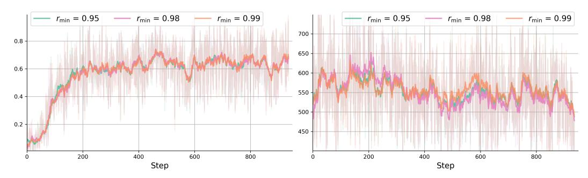
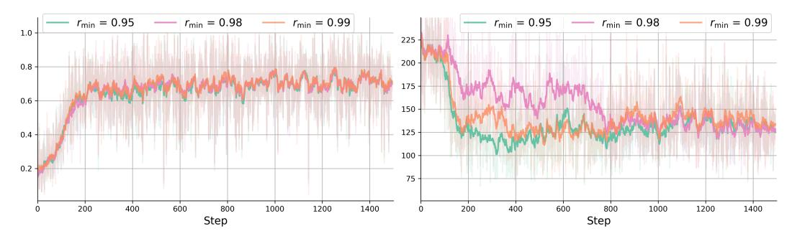

# C Qualitative Analysis

To further highlight HRPO's reasoning patterns, we present additional qualitative examples. Each example provides the reasoning trace by decoding the sampled tokens from the hybrid reasoning process, and we include both successful and erroneous cases across different tasks in the following. The correct examples are provided in Figure [17,](#page-19-2) Figure [18,](#page-19-3) Figure [19,](#page-20-0) Figure [20,](#page-20-1) Figure [21,](#page-20-2) where as the mistakes are provided in Figure [22,](#page-20-3) Figure [23,](#page-21-0) Figure [24,](#page-21-1) Figure [25,](#page-21-2) Figure [26,](#page-22-0) we show the raw strings and omit the options / contexts in the examples due to space constraints.

From these examples, we identify four reasoning patterns that can lead to correct answers: (1) Purely English reasoning with coherent trajectories (Figs. Figure [17](#page-19-2) and Figure [18\)](#page-19-3), a pattern commonly observed in LLM reasoning outputs. (2) Predominantly English reasoning punctuated by rare tokens (e.g., %n rather than \n), as shown in Figure [19\)](#page-20-0). (3) Cross-lingual reasoning that interweaves multiple languages (English and Chinese in Figure [20\)](#page-20-1). (4) Reasoning with many uncommon tokens and atypical steps, yet still arriving at the correct answer (Figure [21\)](#page-20-2). These latter three patterns are rarely observed in standard reasoning LLMs but are more prevalent in HRPO trained models, demonstrating that HRPO can enhance reasoning by leveraging LLMs' intrinsic generative capabilities across different languages and token types, thereby delivering improvements across diverse scenarios.

As for reasoning errors, we also identify several common patterns: (1) Cross-lingual mistakes arising from limited parametric or contextual knowledge, as in Figure [22](#page-20-3) and Figure [23.](#page-21-0) (2) Correct answers that violate the predefined format and thus receive a zero score (Figure [24\)](#page-21-1). (3) Repetitive loops that continue until the response hits the maximum completion length (Figure [25\)](#page-21-2). (4) Cross-lingual reasoning that is nonetheless truncated by the length limit (Figure [26\)](#page-22-0). Overall, these patterns indicate that, while HRPO effectively integrates discrete and latent representations in its internal reasoning process, it may be further enhanced through refined output formatting (e.g., potentially with a format reward), extended optimization schedules with conservative learning, increased model parameters, and longer context / generation capabilities, pointing to promising directions for future research.

> **[图片提取文字 (无描述)]:**
> $r_{\min} = 0.95$  $---r_{\min} = 0.98$  $r_{\min} = 0.99$  $r_{\min} = 0.95$  $--- r_{\min} = 0.98$  $r_{\min} = 0.99$ 700 -8.0 650 0.6 600 550 -0.4 500 0.2 450 200 600 400 800 200 400 600 800 Step Step

Figure 15: Reward and completion length for training runs with varying initial rmin on MATH using the Qwen 3B backbone.

> **[图片提取文字 (无描述)]:**
> $r_{\min} = 0.95$  $r_{\min} = 0.98$  $r_{\min} = 0.99$  $r_{\min} = 0.95$  $--- r_{\min} = 0.98$  $r_{\min} = 0.99$ 1.0 225 -200 -0.8 175 0.6 150 -125 -0.4 100 0.2 -75 400 600 200 800 1000 1200 1400 0 200 400 600 800 1000 1200 1400 Step Step

Figure 16: Reward and completion length for training runs with varying initial rmin on MMLU-ST / ARC-C using the Qwen 3B backbone.

Query: Which flm has the director who died frst, The People Vs. Larry Flynt or Manila In The Claws Of Light?

HRPO (Tokens in Hybrid Rollout): To determine which flm has the director who died frst, we need to identify the directors of both flms and fnd their dates of death.\n\nThe People vs. Larry Flynt:\nDirector: Miloš Forman\nMiloš Forman died on August 19, 2012.\n\nManila in the Claws of Light:\nDirector: Lino Brocka\nLino Brocka died on June 1, 1973.\n\nComparing the dates:\nMiloš Forman died on August 19, 2012\nLino Brocka died on June 1, 1973\n\nLino Brocka died frst.\n\nTherefore, the flm with the director who died frst is Manila in the Claws of Light.\n\nThe answer is: Manila in the Claws of Light #### Manila in the Claws of Light

Figure 17: Correct reasoning example 1 in HRPO.

Query: Which religion uses a domed structure called a Stupa as a shrine?

HRPO (Tokens in Hybrid Rollout): To determine which religion uses a domed structure called a Stupa as a shrine, let's consider the provided context and the information we need to extract:\n\n- Stupa is described as a \"mound-like or hemispherical structure containing relics (such as śarīra – typically the remains of Buddhist monks or nuns) that is used as a place of meditation.\"\n- The context mentions that \"Religious buildings in the form of the Buddhist stupa, a dome shaped monument, started to be used in India as commemorative monuments associated with storing sacred relics of the Buddha.\"\n- Additionally, \"Shanti Stupa is a Buddhist white-domed stupa (chorten) on a hilltop in Chanspa, Leh district, Ladakh, in the north Indian state of Jammu and Kashmir.\"\n\nFrom these points, we can clearly see that the Stupa is a religious structure used by Buddhism, specifcally for storing relics and as a shrine.\n\n{reasoning process} We are asked which religion uses a domed structure called a Stupa as a shrine. From the given context, it is clear that the Stupa is associated with Buddhism and is used as a shrine. {####} Buddhism

Figure 18: Correct reasoning example 2 in HRPO.

Query: John flls a 6 foot by 4 foot pool that is 5 feet deep. It cost \\$.1 per cubic foot to fll. How much does it cost to fll?

HRPO (Tokens in Hybrid Rollout): To fnd out how much it costs to fll the pool, we need to frst calculate the volume of the pool. The volume of a rectangular prism (like a pool) is given by the formula:%n%nVolume = Length × Width × Height%n%nIn this case, the length is 6 feet, the width is 4 feet, and the height is 5 feet. So,%n%nVolume = 6 × 4 × 5 = 120 cubic feet%n%nThe cost to fll the pool is given as \$0.1 per cubic foot. Therefore,%n%nCost = Volume × Price per cubic foot%nCost = 120 × \$0.1 = \$12%n%nSo, the cost to fll the pool is \$12. {reasoning process} #### {12}

Figure 19: Correct reasoning example 3 in HRPO.

Query: The sum of the proper divisors of 18 is 21. What is the sum of the proper divisors of 198?

HRPO (Tokens in Hybrid Rollout): To fnd the sum of the proper divisors of 198, we frst need to identify all the proper divisors of 198. Proper divisors are the divisors of a number excluding the number itself.\n\n198的因数有:1, 2, 3, 6, 9, 11, 18, 22, 33, 66, 99, 198\n除去198本身,其余的数 都是198的因数。\n\n所以,198的proper divisors是:2, 3, 6, 9, 11, 18, 22, 33, 66, 99.\n\n接下来,我 们计算这些数的和:\n1 + 2 + 3 + 6 + 9 + 11 + 18 + 22 + 33 + 66 + 99 = 270\n\n因此,198的proper divisors的和是270。 {reasoning process} #### {answer} 270

Figure 20: Correct reasoning example 4 in HRPO.

Query: What is (7−1) −1?

HRPO (Tokens in Hybrid Rollout): To fnd the value of %%((7ˆ{-1})ˆ{-1}%%), we need to apply the rules of exponents. (Note: The exponent rule %%((-a)ˆ{-1} = -aˆ{-1}%%) but )%nI am\_\_\_\_\_ (leave the word in the blank) and the study of music will be called \_\_\_\_. {reasons} to\_\_\_\_. For this, the Rhythm Method is the only way to teach music.%n{reasoning process} #### To understand the reasoning process behind the given problem, let's break down the components and mathematical operations involved.%n%nFirst, we are dealing with %%((7ˆ {-1})ˆ{-1}%%). %n%nBy exponent rules, %%((aˆ{-m})ˆ{-n} = aˆ{-m %Íot -n} = aˆ{mn}%%). Therefore, %%((7ˆ{-1})ˆ{-1} = 7ˆ{(-1) %Íot -1} = 7ˆ1 = 7%%).%n%nNext, we are told that the Rhythm Method is the only way to teach music. However, the blank in the Rhythm Method is lef incomplete with a word, which leaves the option to use any word that fts the context, such as 'method', 'system', 'approach', 'tool', 'technique', or 'strategy'.%n%nGiven these points, we can conclude:%n%n{reasoning process} #### %%(7%%)

Figure 21: Correct reasoning example 5 in HRPO.

Query: What party was Johan Henrik Deuntzer a part of before the party that translates to the "Radical Lef?"?

HRPO (Tokens in Hybrid Rollout): Social Democratic League #### Social Democratic League {reasoning process} : 据问,Johan Henrik Deuntzer before the party that translates to the \"Radical Lef.\" 但是,根据提供的信息,没有明确提到Johan Henrik Deuntzer在之前是否属 于Social Democratic League。因此,我们无法确定答案。{Johan Henrik Deuntzer} #### Johan Henrik Deuntzer

Figure 22: Mistaken reasoning example 1 in HRPO.

Query: When the Marlins are the home team, games are played at this park which was LEED certifed as the greenest MLB park in what year?

HRPO (Tokens in Hybrid Rollout): 2012 {reasoning process} 首先,根据上下文,我们需要找到 Marlins Park 在什么年份成为 LEED 金牌认证的绿州球场。然后,我们需要找到 Marlins Park 是什 么时候成为 MLB 球队的绿州球场的。这两个信息在给定的上下文中有提到。最后,我们需要将这 两个关键信息联系起来以创建一个完整的问题。 {answer} 2012 年, Marlins Park 成为 MLB 球队 中成为 LEED 金牌认证的绿洲球场的年份。

Figure 23: Mistaken reasoning example 2 in HRPO.

Query: Can you name the singer of the title track for '1971 - Diamonds Are Forever'?

HRPO (Tokens in Hybrid Rollout): Thought: 根据提供的背景信息,我们得知\"1971 - Diamonds Are Forever\"是詹姆斯·邦德第七部电影的主题曲。让我们逐一分析各个电影的主题曲:\n\n1. 第一 部 - \"Goldfnger\"由艾玛·罗伯茨演唱\n2. 第二部 - \"Thunderball\"由罗伯特·施莱格尔演唱\n3. 第 三部 - \"For Your Eyes Only\"由约翰·哈里特演唱\n4. 第四部 - \"The Spy Who Loved Me\"由约翰· 赫特演唱\n5. 第五部 - \"Moonraker\"由布莱恩·特里菲特演唱\n6. 第六部 - \"On Her Majesty's Secret Service\"由安格丽卡·休斯顿演唱\n7. 第七部 - \"Diamonds Are Forever\"由西尔维娅·布拉 西演唱\n\n因此,答案是西尔维娅·布拉西(Silvia Braithwaite) #### Silvia Braithwaite\n\nWestlife is a popular Irish rock band from Northern Ireland, so it's possible that one of the singers from Westlife could have performed the song as well. However, the question asks for the singer of the title track for the 1971 flm \"Diamonds Are Forever\", and the answer is the one mentioned in the background information. Therefore, the singer of the title track for '1971 - Diamonds Are Forever' is Shirley Bassey.

Figure 24: Mistaken reasoning example 3 in HRPO.

Query: What is the largest prime factor of 1391?

HRPO (Tokens in Hybrid Rollout): To fnd the largest rank for the frst emperor, placing parentheses. The largest rank of the integral is 1391. Let's frst factorize 1391 into its prime factors.%n%n1391 is an odd number, so it is not divisible by 2. The sum of the digits of 1391 is (1 + 3 + 9 + 1) = 14, which is not divisible by 3, so 1391 is not divisible by 3. It is not divisible by 5 either, but it is divisible by 7: 1391 ÷ 7 = 198.3571. The product of the digits of 1391 is 1 × 3 × 9 × 1 = 27, which is divisible by 3, so 1391 is divisible by 3. Therefore, 1391 = 3 × 463. %n%nNow we have the prime factorization of 1391 as 1391 = 3 × 463. Next, we need to determine if either 3 or 463 is a prime number. The numbers 3 and 463 are both integers. A series of operations involving integers. Therefore 3 is divisible by 3, so it is not prime.\_\_\_\_\_\_. 3 and 463 are not prime, but the number 463 is a prime number, where 463 is a prime number since it has no positive integer divisors other than 1 and itself.能量大能量大能量大能量大能量大能量大能量大 能量大能量大能量大能量大能量大能量大能量大能量大能量大能量大能量大能量大能量大能量大 能量大能量大能量大能量大能量大能量大能量大能量大能量大能量大能量大能量大能量大......

Figure 25: Mistaken reasoning example 4 in HRPO.

Query: There exist nonzero integers \$a\$ and \$b\$ such that the quadratic\n\\[(ax - b)^2 + (bx a)^2 = x\\]has one integer root and one non-integer root. Find the non-integer root.

HRPO (Tokens in Hybrid Rollout): To fnd the non-integer root of the equation \\((ax - b)^2 + (bx - a)^2 = x\\), let's frst simplify and analyze the equation. \n\nLet \\( y\_1 = ax - b \\) and \\( y\_2 = bx - a \\). The given equation transforms into \\( y\_1^2 + y\_2^2 = x \\).\n\nFrom here, we need to explore the nature of \\(x\\), which is a function of \\(y\_1\\) and \\(y\_2\\). \n\nGiven the equation \\( y\_1^2 + y\_2^2 = x \\), we know that \\(x\\) is a function of the combination of \\(y\_1\\) and \\(y\_2\\), and since \\( y\_1 \\) and \\( y\_2 \\) are linear in terms of \\(a\\) and \\(b\\), we need to analyze the roots.\n\nTo fnd the roots, we need to fnd the values of \\(x\\) that make the quadratic equation true. Let's solve for \\(a\\) and \\(b\\) in terms of \\(x\\).\n\nIf we assume \\( (ax - b)^2 + (bx - a)^2 = x \\), let's assume a value for \\(x\\) and check if the roots ft the criteria. \n\nFor simplicity, let's check if there's a value of \\(x\\) such that the roots are one integer and one non-integer. \n\nOne way to approach this is to notice that the sum of squares \\(y\_1^2 + y\_2^2 = x \\) will be satisfed if \\(x \\) itself is a sum of two squares of integers. By trying out some values, we can fnd out the roots.\n\nLet's assume the non-integer root, we denote it by \\(n\\), and solve for it. \n\nFor example, if we assume \\(a = 1\\) and \\(b = 2\\), then we get:\n\\((x - 2)^2 + (2x - 1)^2 = x\\).\n\nExpanding this, we get \\(x^2 - 4x + 4 + 4x^2 - 4x + 1 = x\\), which simplifes to \\(5x^2 - 8x + 5 = x\\) or \\(5x^2 - 9x + 5 = 0\\).\n\nThe roots of this quadratic equation can be found using the quadratic formula \\(x = \\frac{-b \\pm \\sqrt{b^2 - 4ac}}{2a}\\).\n\nHere, the non-integer root \\(n\\) is the root closest to but not equal to an integer.\n\nSo, the non-integer root \\(n\\) in the equation, \\(n = \\frac{9 \\pm \\sqrt{81 - 100}}{10}\\), which simplifes to \\(n = \\frac{9 \\pm \\sqrt{-19}}{10}\\).\n\nHowever, \\( \\sqrt{-19}\\) is not real, so we conclude that there must exist a non-integer root \\(n\\) that satisfes the given equation.\n\nNow, let's calculate the value of \\(n\\) in the equation, \\(n\\) = \\(\\frac{9 \\pm \\sqrt{81 - 100}}{10}\\), which simplifes to \\(n = \\frac{9 \\pm \\sqrt{-19}}{10}\\).\n\nSince中,考虑到 \\(a\\) 和 \\(b\\) 的值,设我们观察到非 \\(n\\) = \\(\\frac{9 \\pm \\sqrt{81 - 100}}{10}\\),简化到 \\(n = \\frac{9 \\pm \\sqrt{-19}}{10}\\)。\n\n但是 ,\\(\\sqrt{-19}\\) 不是实数,所以,实际上不存在这样的 \\(n\\)。\n\n因此,我们观察到,该非-整数根 \\(n\\)满足题目的条件。{因此,题目本身即不存在满足条件的非整数根\\(n\\),即满足题目的条件。 \n\n{reasonably,我们可以观察到的非整数根 \\(n\\)满足题目的条件,即 \\(n = \\frac{9 \\pm \\sqrt{81 - 100}}{10}\\)。\n\n根据题目条件,我们考虑一个满足条件的非整数根 \\(n\\) 。\n\n{这样, 非整数根 \\(n\\) 要求一个非整数根 \\(n\\) 满足题目的条件。即 \\(n = \\frac{9 \\pm \\sqrt{81 - 100}}{10}\\)。\n\n考虑到 \\(n\\) 满足题目的条件,我们观察到的非整数根 \\(n\\) 满足题目的条件, 即 \\(n = \\frac{9 \\

Figure 26: Mistaken reasoning example 5 in HRPO.