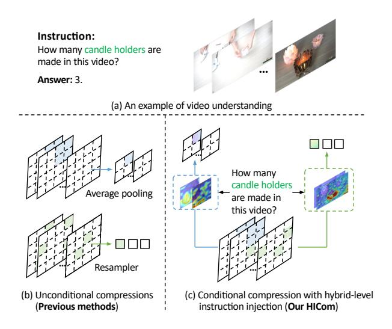

# 1. Introduction

Multi-modal Large Language Models [\[2,](#page-8-0) [14,](#page-8-1) [22,](#page-8-2) [31,](#page-9-0) [32,](#page-9-1) [74\]](#page-10-0) (MLLMs) have gained significant improvements in multi-

> **[图片提取文字 (无描述)]:**
> Instruction: How many candle holders are made in this video? Answer: 3. (a) An example of video understanding How many candle holders Average pooling are made in this video? Resampler (b) Unconditional compressions (c) Conditional compression with hybrid-level (Previous methods) instruction injection (Our HICom)

Figure 1. An example of the video understanding task, and the comparison between the unconditional compression and our proposed conditional compression with hybrid-level instruction injection. We inject instruction at both local and global levels, guiding the compression to retain the maximum amount of user-focused information and minimize the computational burden.

modal understanding by integrating visual information into the LLMs, beating various expert methods on downstream tasks [\[12,](#page-8-3) [13,](#page-8-4) [25,](#page-9-2) [26,](#page-9-3) [47,](#page-9-4) [61,](#page-10-1) [65,](#page-10-2) [70\]](#page-10-3). While initially focused on image understanding, more research [\[30,](#page-9-5) [34,](#page-9-6) [36,](#page-9-7) [40,](#page-9-8) [56,](#page-10-4) [57\]](#page-10-5) has shifted towards challenging video tasks. Most MLLMs handle videos by treating them as sequences of images, sampling frames, and concatenating visual tokens from these frames [\[6,](#page-8-5) [20,](#page-8-6) [42,](#page-9-9) [52,](#page-9-10) [66\]](#page-10-6).

Compared to images, videos comprise multiple frames, resulting in more visual tokens and thus higher computational costs. To make the computation affordable, early methods [\[23,](#page-8-7) [30,](#page-9-5) [34\]](#page-9-6) often employ sparse temporal sampling strategies, leading to significant loss of temporal information. Consequently, current MLLMs focus on compress-

\*Interns at Alibaba Group

†Corresponding author

ing visual tokens to achieve a trade-off between computational costs and video understanding ability. Mainstream MLLMs [\[20,](#page-8-6) [59,](#page-10-7) [71\]](#page-10-8) use a spatial pooling strategy within each frame, leveraging capabilities gained from image data. Some approaches [\[19,](#page-8-8) [43,](#page-9-11) [67\]](#page-10-9) use Q-Former [\[22\]](#page-8-2) or Resampler [\[1\]](#page-8-9) to compress the spatial-temporal information into a fixed number of visual tokens. Other methods employ convolution [\[7\]](#page-8-10), clustering [\[17\]](#page-8-11), or memory mechanisms [\[16,](#page-8-12) [46,](#page-9-12) [68\]](#page-10-10) to compress visual tokens in both spatial and temporal dimensions. However, these compression methods are unconditional, lacking explicit guidance, as illustrated in Fig. [1](#page-0-0) (b), making it challenging to achieve high compression ratios with minimal information loss. Consequently, user-relevant visual content may be overlooked during such unconditional compression.

Therefore, we focus on introducing the instruction information as a condition to perform targeted compression, as it is rarely explored in previous work. As shown in Fig. [1](#page-0-0) (c), conditional compression uses explicit instructional guidance to select user-focused information for retention, thereby enhancing efficiency. To thoroughly explore the conditional compression, we propose Hybridlevel Instruction Injection Strategy for Conditional Token Compression in MLLMs (HICom). Observing how humans process complex visual information, they usually adopt a coarse-to-fine approach, first considering the relative parts in the global coarse impression and then seeking detailed information locally in the video. Motivated by this human perception process, HICom conducts the compression at both local and global levels, retaining the maximum amount of instruction-relevant information while preserving the temporal-spatial structure with fewer tokens, thus achieving a better balance between the computational burden and video comprehension.

Specifically, at the local level, we divide the sampled frame features into several groups and compress the tokens of each group into one token based on the attention with the injected instruction condition. Different from Q-Former [\[22\]](#page-8-2) and Resampler [\[1\]](#page-8-9), the grouped local attention can explicitly maintain the spatial-temporal structural characteristics of the video while highlighting the relevant parts within each group. At the global level, we inject the instruction condition into a small number of learnable tokens and then conduct the attention with the flattened frame features without grouping. The global compression focuses more on searching instruction-relevant information in the whole video and thus can be expressed by a small number of tokens as an auxiliary. To further unleash the potential of HICom, we introduce a new conditional pre-training stage between the alignment and instruction tuning and construct a new dataset HICom-248K of 248K video clips with high-quality instruction-followed descriptions. The proposed new stage continues to pre-train the parameters of condition injection, further improving the performance. Experiments show that our HICom can achieve state-of-the-art performance on 5 benchmarks with significantly fewer tokens. (*e.g*., increasing by 2.43% average on three multiplechoice QA benchmarks and saving 78.8% tokens compared with LLaVA-Video-7B [\[72\]](#page-10-11)).

Our main contributions are listed as follows:

- We propose a conditional compression method HICom for MLLMs, achieving effective video understanding while significantly reducing the computational burden.
- We conduct hybrid-level instruction injection to achieve the conditional compression, and introduce a new conditional pre-training stage with our constructed HICom-248K dataset to further unleash the potential of the conditional compressing.
- Experiments on various benchmarks show the proposed HICom can achieve better performance with fewer visual tokens, providing valuable insights for MLLMs.

