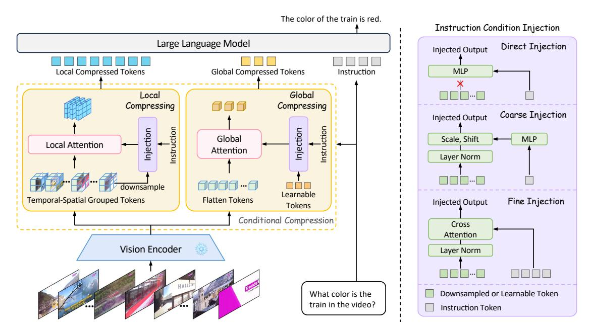
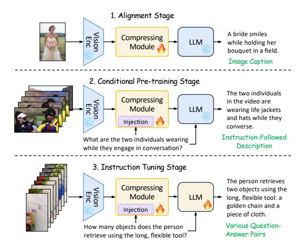
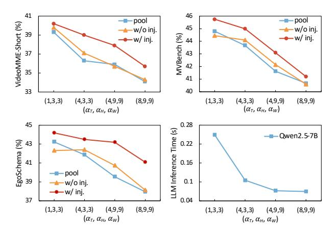
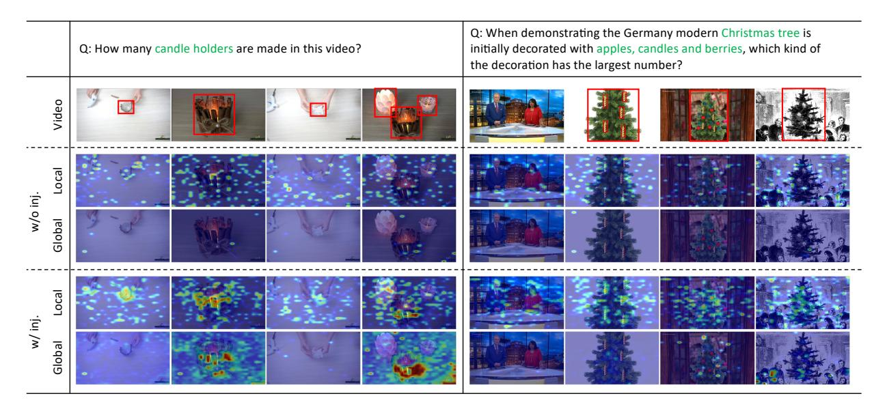

# 2. Related Work

Multi-modal large language models. Based on the powerful capabilities of LLMs among various linguistic tasks, many works try to extend the understanding abilities to the computer vision area. Flamingo [\[1\]](#page-8-9) and BLIP series [\[8,](#page-8-13) [22\]](#page-8-2) successfully explore the usage of Resampler and Q-Former to bridge the visual tokens to language models. LLaVA series [\[31–](#page-9-0)[33\]](#page-9-13) use a simple MLP as the visual projector to translate visual tokens to the LLM's embedding space, achieving huge success. Recently, more researchers have focused on extending image tasks to video tasks. The biggest challenge for video tasks is to design an effective method to achieve the trade-off between computational costs and video understanding ability. Early methods [\[23,](#page-8-7) [30,](#page-9-5) [34\]](#page-9-6) sparsely sample frames, lossing too much temporal information. Mainstream methods [\[20,](#page-8-6) [59,](#page-10-7) [71\]](#page-10-8) use a simple spatial pooling strategy to reduce the number of visual tokens and get a huge success. [\[19,](#page-8-8) [67\]](#page-10-9) employ Q-Former to compress the spatial-temporal tokens into a fixed number. Chat-Univi [\[17\]](#page-8-11) uses DPC-KNN algorithm to cluster dynamic visual tokens. VideoLLaMA2 [\[7\]](#page-8-10) utilizes convolution both in temporal and spatial dimensions to downsample tokens. Flash-VStream [\[68\]](#page-10-10) introduces a learnable memory mechanism to compress online video streaming. All of them try their best to observe more visual information. However, their unconditional compression without explicit guidance inherently leads to the loss of instructionrelevant information. Different from them, we conduct conditional compression by injecting instruction at hybrid levels, only emphasizing the visual parts related to the instruction and allowing the irrelevant parts to be discarded, thus getting a better representation for each question.

Text-based visual representation for video LLMs. There are some methods using instruction information during the

> **[图片提取文字 (无描述)]:**
> The color of the train is red. Instruction Condition Injection Large Language Model Direct Injection Injected Output Local Compressed Tokens Global Compressed Tokens Instruction MLP Global Local Compressing Compressing Coarse Injection Injected Output Instruction Injection Instruction Injection Global Scale, Shift MLP Local Attention Attention Layer Norm Learnable Temporal-Spatial Grouped Tokens Flatten Tokens Fine Injection Injected Output Tokens Conditional Compression Cross Attention Vision Encoder Layer Norm Downsampled or Learnable Token What color is the train in the video? Instruction Token

Figure 2. The framework of our proposed HICom. We propose the hybrid-level instruction injection to conditionally compress video tokens in MLLMs. We extract instruction-relevant information within each grouped sub-region at the local level, and extract it to a fixed number of tokens at the global level. The instruction condition is injected into the attention process to guide the compression.

visual encoding. [53, 63] sample the frames based on the CLIP [41] similarity or a localization model using the instruction, [29, 50] make the frame selection strategy trainable. However, these methods only focus on how to select the correct frames in a rough manner, failing to guide the token compression with the key instruction information. LLaMA-VID [28] follows a similar instruction-guided idea, as it introduces the instruction to interact with visual features. However, it roughly simplifies the interacted but uncompressed result into a single token only as auxiliary information for each frame, destroying the spatial structure and failing to discuss the guiding role of the instruction for conditional compression. Therefore, it is only designed for long videos and the performance is limited. To fully explore conditional compression, we propose to inject the instruction at hybrid levels, exploring a better way for conditional compression to alleviate the information loss while maintaining the performance.

#### 3. Method

#### 3.1. Instruction-Guided Conditional Compression

Fig. 2 shows the framework of our proposed HICom, which focuses on the design between the vision encoder and the LLM to conduct the conditional compression. We inject the instruction condition into the compression process at both local and global levels for better information extraction with spatial-temporal structure maintained.

Local-Level Compression. Previous works have demon-

strated the importance of the spatial inductive bias when processing visual representations for image MLLMs [27, 49]. Inspired by them, we divide the tokens into several groups and perform conditional compression within each group to preserve the temporal-spatial structure of video features. Specifically, given the encoded video frame features  $\boldsymbol{V} \in \mathbb{R}^{T \times H \times W \times D}$ , and the downsampling ratio  $(\alpha_T, \alpha_H, \alpha_W)$ , we divide  $\boldsymbol{V}$  into  $N_T \cdot N_H \cdot N_W$  groups, where  $N_i = \lceil i/\alpha_i \rceil$ ,  $i \in \{T, H, W\}$ . Therefore, there are  $\alpha_T \cdot \alpha_H \cdot \alpha_W$  tokens in each group, which can be formulated as  $\boldsymbol{V}^{t,h,w} \in \mathbb{R}^{\alpha_T \times \alpha_H \times \alpha_W \times D}$ , where  $0 \leq \{t,h,w\} \leq \{N_T,N_H,N_W\}$ . We first pool  $\boldsymbol{V}^{t,h,w}$  into one token  $\boldsymbol{V}_p^{t,h,w} \in \mathbb{R}^{1 \times D}$  and inject the instruction condition  $\boldsymbol{C}$  (i.e., the text feature of instructions) into  $\boldsymbol{V}_p^{t,h,w}$ . Then the local attention within each group can be calculated by:

$$\boldsymbol{Z}_{l}^{t,h,w} = \operatorname{Attn}\left[\operatorname{Inj}(\boldsymbol{V}_{p}^{t,h,w},\boldsymbol{C}),\boldsymbol{V}^{t,h,w},\boldsymbol{V}^{t,h,w}\right], \quad (1)$$

where  $\operatorname{Inj}(\cdot)$  represents the condition injection,  $\operatorname{Attn}(\cdot)$  donates the attention mechanism [9] and the inputs of  $\operatorname{Attn}(\cdot)$  are *query*, *key*, and *value*, respectively. Therefore, the visual features within each group are compressed into only one token, preserving the temporal-spatial structure while conditionally highlighting the instruction-relevant parts. Finally, we concatenate  $\boldsymbol{Z}_l^{t,h,w}$  as the local compressed results  $\boldsymbol{Z}_l \in \mathbb{R}^{N_T \times N_H \times N_W \times D}$ , and use an MLP layer to project  $\boldsymbol{Z}_l$  into the LLM's embedding space.

Global-Level Compression. Though the temporal-spatial structure can be maintained at the local level, the attention

> **[图片提取文字 (无描述)]:**
> Alignment Stage A bride smiles Visior Compressing LLM while holding her Module bouquet in a field. Image Caption 2. Conditional Pre-training Stage The two individuals Compressing in the video are Visior Module LLM wearing life jackets and hats while they Injection converse. Instruction-Followed What are the two individuals wearing Description while they engage in conversation? 3. Instruction Tuning Stage The person retrieves Compressing two objects using the Vision Module LLM long, flexible tool: a golden chain and a Injection piece of cloth. Various Question-How many objects does the person Answer Pairs retrieve using the long, flexible tool?

Figure 3. We introduce a new guidance pre-training stage and implement three-stage training for conditional compression.

is forced to focus on small sub-regions. However, each sub-region may contain information that is not equally valid for the question, and some sub-regions are even quite irrelevant. Therefore, we also implement conditional compression at the global level to highlight the most relevant parts within the whole video. Specifically, we initialize a small set of learnable tokens  $\boldsymbol{L} \in \mathbb{R}^{N_L \times D}$ , where  $N_L$  donates the number of tokens, and then inject the instruction condition into them. Instead of grouping the video frame features, we apply 3D position embedding  $\operatorname{Pos}(\cdot)$  for them and directly flatten them at global-level compression. Then the global compressed tokens  $\boldsymbol{Z}_q \in \mathbb{R}^{N_L \times D}$  can be calculated by:

$$Z_g = \text{Attn}\left[\text{Inj}(L, C), V + \text{Pos}(V), V\right].$$
 (2)

An MLP layer is also utilized to project  $Z_g$  into the LLM's embedding space. And we finally concatenate  $Z_l$  and  $Z_g$  together for further understanding of LLM.

**Instruction Condition Injection.** In order to fulfill the guiding role of the instruction condition, we explore three different types of injection modules, and define them direct injection, coarse injection, and fine injection, respectively. Note the text encoder can obtain both pooled tokens  $C_p \in \mathbb{R}^{1 \times D}$  (i.e., global text embedding) and finegrained tokens  $C_f \in \mathbb{R}^{L \times D}$  (i.e., token-level text embedding). Given the pooled token  $C_p$ , the direct injection uses an MLP to translate the single token into the injected output without any interaction with  $V_p^{t,h,w}$  or L. We employ coarse injection by the adaptive layer norm [39]. Specifically, we use an MLP to regress the scale and shift from  $C_p$ , then add to the visual input  $V_p^{t,h,w}$  or learnable tokens L, which we represent them as A, after the layer norm. The process can be formulated as:

$$Inj(\mathbf{A}, \mathbf{C}) = LN(\mathbf{A}) \cdot scale(\mathbf{C}_p) + shift(\mathbf{C}_p), \quad (3)$$

Table 1. The statistical information of our constructed HICom-248K dataset.

| # Videos          | Sources                      | Avg Length          | # QA Pairs       |
|-------------------|------------------------------|---------------------|------------------|
| 248K              | Panda70M: 238K Ego4D: 10K | 25.67s              | 739K             |
| Data Sou 4.05% | 20K - 15K - 10K -      | Histogram of Vi     | deo Length       |
| Panda-70M         | 5K 0K 0                      | 30 60 Video Leng | 90 120 th (s) |

Figure 4. The visualization of data source (left) and video length (right) of our constructed HICom-248K dataset.

where  $LN(\cdot)$  is the layer norm. Given the fine-grained tokens  $C_f$  as condition C, we conduct the fine injection via the cross attention, which can be formulated as:

$$\operatorname{Inj}(\boldsymbol{A}, \boldsymbol{C}) = \operatorname{Attn}\left(\operatorname{LN}(\boldsymbol{A}), \boldsymbol{C}_f, \boldsymbol{C}_f\right). \tag{4}$$

As the direct injection directly translates the condition to the *query* of the attention in Eq. (1) and Eq. (2), the token length limits that it is only suitable for local compression as the local branch compresses each group into only one token. On the contrary, the coarse and fine injections are more flexible to fit various situations as the condition is added into A. We conduct the experiments on the three types of injection and finally choose direct injection for local compression and coarse injection for global compression.

Conditional Pre-training Stage. The existing mainstream methods follow the pipeline of alignment first and then instruction tuning [7, 31, 32, 68], and previous text-based methods [28, 53] also follow this pipeline. However, the image-caption pairs cannot provide valid instruction information in the alignment stage, direct instruction tuning with modules that are not adequately aligned will confuse the guiding process, thus harming the performance. Therefore, we propose a new conditional pre-training stage between the alignment and the instruction tuning to make the training process easier, as shown in Fig. 3. In this stage, we use our constructed instruction-followed descriptions to pre-train the compression module with condition injection, fulfilling the guiding role of the instruction.

#### 3.2. Dataset Construction

To pre-train the condition injection in the compression module, we construct a new instruction-followed description dataset HICom-248K. Different from common instruction tuning datasets, HICom-248K focuses on providing only one data type, *i.e.*, the description of the visual content re-

Table 2. Performance comparison between our HICom and other SOTA methods on multiple-choice QA video benchmarks. † means we use the result reproduced by VideoLLaMA2 [7], \* indicates we reproduce the results ourselves using the official checkpoint and inference code provided by authors. § donates we inference with a new length of frames trained by sampling 32 frames.

| Methods                   | IIM Ciae      | # Frames | # Tokona | Vic           | leoMM       | E w/o s     | sub.             | Vi            | deoMN | IE w/s      | ub.         | MV-               | Ego-              |
|---------------------------|---------------|----------|----------|---------------|-------------|-------------|------------------|---------------|-------|-------------|-------------|-------------------|-------------------|
| Methods                   | LLWI Size     | # Frames | # Tokens | short         | mid         | long        | all              | short         | mid   | long        | all         | Bench             | Schema            |
| Video-LLaVA [30]          | 7B            | 8        | 2048     | 45.3          | 38.0        | 36.2        | 39.9             | 46.1          | 40.7  | 38.1        | 41.6        | 43.0              | -                 |
| VideoChat2-Mistral [24]   | 7B            | 16       | 1536     | 48.3          | 36.3        | 35.0        | 39.5             | 52.8          | 39.4  | 39.2        | 43.8        | 60.4              | -                 |
| LLaMA-VID [28]            | 7B            | 1fps     | 2tps     | -             | -           | -           | $25.9^{\dagger}$ | -             | -     | -           | -           | 41.9 † | 38.5 † |
| Chat-Univi-1.5 [17]       | 7B            | 64       | 448      | 45.7          | 40.3        | 35.8        | 40.6             | 51.2          | 44.6  | 41.8        | 45.9        | 45.9              | -                 |
| PLLaVA [59]               | 7B            | 16       | 2304     | -             | -           | -           | -                | -             | -     | -           | -           | 46.6              | -                 |
| LLaVA-Next-Video [71]     | 7B            | 32       | 4608     | 49.9*         | 41.4*       | 37.0*       | 42.8*            | -             | -     | -           | -           | 46.5 † | 43.9 † |
| LongVA [69]               | 7B            | 128      | 18432    | 61.1          | 50.4        | 46.2        | 52.6             | 61.6          | 53.6  | 47.6        | 54.3        | -                 | -                 |
| VideoLLaMA2 [7]           | 7B            | 16       | 1152     | 56.0          | 45.4        | 42.1        | 47.9             | -             | -     | -           | -           | 54.6              | 51.7              |
| Tarsier [51]              | 7B            | 16       | 2304     | -             | -           | -           | -                | -             | -     | -           | -           | 62.6              | 56.0              |
| VITA [11]                 | $8 \times 7B$ | 16       | 4096     | 65.9          | 52.9        | 48.6        | 55.8             | 70.4          | 56.2  | 50.9        | 59.2        | -                 | -                 |
| LLaVA-OneVision [20]      | 7B            | 32       | 6272     | <u>70.1</u> * | 56.4*       | 48.9*       | 58.5*            | <u>75.8</u> * | 58.4* | 51.6*       | 61.9*       | 56.7              | 60.1              |
| LLaVA-Video [72]          | 7B            | 32       | 6272     | 73.9*         | 57.3*       | 50.4*       | 60.6*            | 76.6*         | 60.3* | 51.7*       | 62.9*       | 58.6              | 57.3              |
| HICom (Ours)              | 1.5B          | 32       | 680      | 61.7          | 51.3        | 43.9        | 52.3             | 65.1          | 54.7  | 47.3        | 55.7        | 56.4              | 50.1              |
| HICom (Ours)              | 7B            | 32       | 680      | 65.7          | 57.1        | <u>51.4</u> | 58.1             | 68.4          | 58.9  | 53.1        | 60.1        | <u>64.1</u>       | 60.5              |
| HICom (Ours) § | 7B            | 64       | 1328     | 67.6          | <u>58.0</u> | 51.2        | 58.9             | 71.8          | 63.7  | <u>54.5</u> | <u>63.3</u> | 64.7              | 62.2              |
| HICom (Ours)§             | 7B            | 128      | 2624     | 69.0          | 60.2        | 51.5        | <u>60.3</u>      | 72.7          | 64.6  | 57.3        | 64.8        | 64.0              | 62.3              |

lated to the instruction, and does not include other rich types of instruction data (*e.g.*, reasoning, counting, *etc*).

**Data Collection.** To ensure the diversity and quality of our videos, we collect videos from public datasets Panda-70M [5] and Ego4D [15]. Panda-70M contains various open-domain videos from YouTube, and Ego4D collects many high-resolution ego-centric human activity videos. Notably, we use the original untrimmed videos to cut clips ourselves since the provided split clips of both datasets are too short, greatly decreasing the content complexity. To balance the number of different types of videos, we pre-define 29 categories [10, 72] using natural language (*e.g. A video about cooking activity.*) and use InternVideo2 [54] to extract both the video features and the pre-defined sentence features. Based on the similarities between them, we select 1,500 videos for each category and then randomly select additional 10,000 videos from the others to ensure diversity.

Video Processing. The untrimmed videos are too long for our pre-training, and also severely affect the quality of captions and annotations by existing SOTA models. Therefore, we use PySceneDetect to split each video into shorter ones with a much looser threshold than Panda-70M. As the split clips can sometimes be redundant with repeat semantics, we further extract keyframes for each video and only select the split clips containing the keyframes as our final results. Specifically, inspired by ShareGPT4Video [4], we calculate the CLIP score for densely sampled frames within a video, and select the less similar frames as keyframes. Finally, we further filter out the video clips shorter than 5 seconds and longer than 120 seconds.

**Instruction-Followed Description Generation.** For the processed video clips, we use Qwen2-VL-72B-Instruct [52] to systematically generate the instruction-followed descrip-

tion with the CoT technique [55]. Specifically, we first generate the detailed caption of each input video, then take both the video content and caption as input to generate the three instruction-answer pairs for each video. Different from the normal instruction datasets, we require Qwen2-VL-72B-Instruct to meet the following two rules: 1) The instructions should refer to the specific visual information, such as the people or the objects in the video; 2) The instructions should lead to a descriptive response and the answers should describe the object mentioned in the instruction in detail. Finally, we filter the generated results by discarding answers containing invalid information, such as the phrase "not provide", or "not describe".

**Dataset Statistics.** Tab. 1 and Fig. 4 shows some statistics about our constructed dataset. We collect 248K video clips in total from Panda-70M and Ego4D, the average of the video lengths is 25.67 seconds and the distribution is shown in Fig. 4. With the help of Qwen2-VL-72B-Instruct, we generate 739K instruction-followed descriptions, providing sufficient data for our guidance pre-training.

#### 4. Experiments

#### 4.1. Experimental Setup

Implementation Details. We use SigLIP [64] (so400m-patch14-384) as our vision encoder and text encoder, choose Qwen2.5 series [48] as our LLMs, and randomly initialize the compressor. The vision encoder keeps frozen at all stages, the LLM is frozen at the two pre-train stages, and is fine-tuned at the instruction tuning stage. We follow LLaVA-OneVision [20] to choose our training configurations, the global batch size is set to 512 at the alignment stage, 256 at the conditional pre-train and instruction tun-

Table 3. Performance of our HICom and other SOTA methods on open-ended QA video benchmarks. All the compared models are 7B. †, \*, and § keep the same meaning with Tab. 2. # F., # T. are short for # Frames, # Tokens, ANet is short for ActivityNet, LLaVA-NV, LLaVA-OV are short for LLaVA-Next-Video, and LLaVA-OneVision. The format we report ANet is Acc/Score.

| M-4b-1-          | # TD | # TF  | A NT-4            |       | Video | Chat  | GPT I | Bench |       |
|------------------|------|-------|-------------------|-------|-------|-------|-------|-------|-------|
| Methods          | # F. | # T.  | ANet              | CI    | DO    | CU    | TU    | CO    | Avg   |
| Video-LLaVA [30] | 8    | 2048  | 45.3/3.3          | -     | -     | -     | -     | -     | -     |
| VideoChat2 [24]  | 16   | 1536  | 49.1/3.3          | 3.02  | 2.88  | 3.51  | 2.66  | 2.81  | 2.98  |
| Chat-Univi [17]  | 64   | 448   | 45.8/3.2          | 2.89  | 2.91  | 3.46  | 2.89  | 2.81  | 2.99  |
| LLaMA-VID [28]   | 1fps | 2tps  | 47.4/3.3          | 2.96  | 3.00  | 3.53  | 2.46  | 2.51  | 2.89  |
| LongVLM [58]     | 100  | 305   | 47.6/3.3          | 2.76  | 2.86  | 3.34  | 2.39  | 3.11  | 2.89  |
| ST-LLM [35]      | 16   | 512   | 50.9/3.3          | 3.23  | 3.05  | 3.74  | 2.93  | 2.81  | 3.15  |
| PLLaVA [59]      | 16   | 2304  | 56.3/3.5          | 3.21  | 2.86  | 3.62  | 2.33  | 2.93  | 2.99  |
| LLaVA-NV [71]    | 32   | 4608  | 53.5/3.2          | 3.39  | 3.29  | 3.92  | 2.6   | 3.12  | 3.26  |
| LongVA [69]      | 128  | 18432 | -/2.8             | 3.05  | 3.09  | 3.77  | 2.44  | 3.64  | 3.20  |
| VideoLLaMA2 [7]  | 16   | 1152  | 50.2/3.3          | 3.16  | 3.08  | 3.69  | 2.56  | 3.14  | 3.13  |
| Tarsier [51]     | 16   | 2304  | <b>59.5</b> /3.6  | -     | -     | -     | -     | -     | -     |
| SF-LLaVA [60]    | 50   | 3680  | 56.3/3.4          | 3.09  | 2.70  | 3.57  | 2.52  | 3.35  | 3.04  |
| LLaVA-OV [20]    | 32   | 6272  | 56.6/ <u>3.6*</u> | 3.45* | 3.00* | 3.71* | 2.68* | 3.14* | 3.20* |
| HICom(Ours)-1.5B | 32   | 680   | 53.0/3.5          | 3.09  | 2.67  | 3.40  | 2.41  | 2.98  | 2.91  |
| HICom(Ours)-7B   | 32   | 680   | 58.3/ <b>3.7</b>  | 3.29  | 2.85  | 3.59  | 2.67  | 3.22  | 3.12  |
| HICom(Ours)-7B§  | 64   | 1328  | 59.4/ <b>3.7</b>  | 3.32  | 2.92  | 3.65  | 2.74  | 3.35  | 3.20  |
| HICom(Ours)-7B§  | 128  | 2624  | 59.5/3.7          | 3.33  | 2.86  | 3.65  | 2.74  | 3.32  | 3.18  |

ing stage. We use the learning rate of 1e-3 at the alignment stage, 1e-5 at the instruction tuning stage. At our proposed conditional pre-training stage, we use 1e-3 for the condition injection sub-module and 1e-4 for other parameters in the compressing module. We train 1 epoch for all stages. More implementation details can be found in Appendix A. **Datasets.** We use LLaVA-558K [32] image-caption pairs for our alignment stage, the constructed 248K HICom-Pretrain instruction-followed descriptions for conditional pre-train stage. Inspired by [51, 72], we collect 2.68M video instruction data for instruction tuning, including 1.6M from LLaVA-Video [72], 292K from VideoChat2-IT [23] subset, 255K from M4-Instruct-Data [21], 11K from Charades [45], 114K from NTU RGB+D [44], 122K from TVQA [18], and 290K from MiT [38]. We evaluate our model on 5 video benchmarks, including 3 multiplechoice benchmarks VideoMME [10], MVBench [24], EgoSchema [37], and 2 open-ended benchmarks ActivityNet [3], VideoChatGPT Bench [36].

#### 4.2. Main Results

**Multiple-choice benchmarks.** In Tab. 2, we compare the performance of our HICom with different SOTA models on three multiple-choice video benchmarks. We sample 32 frames with 680 tokens to train all our models and sample different frames for inference. Our HICom-7B with 2624 tokens inference achieves the best performance on all three benchmarks. Compared to LLaVA-Video with 6272 tokens, our HICom with only 1328 tokens can obtain better performance, increasing the performance by 2.43% average and

Table 4. The ablation study on our proposed HICom,  $\alpha_{(T,H,W)}$  donates the downsampling ratio of each dimension, #Tok. donates the number of tokens input to LLMs. 8f means we sample 8 frames for training. The conditional compression combining both local and global achieves the best.

| Methods      | $\alpha_{(T,H,W)}$ | # Tok.  | Video short | MM] mid l | E w/o long | sub. all | MV- Bench | Ego- Schema |
|--------------|--------------------|---------|----------------|--------------|---------------|-------------|--------------|----------------|
| Unconditi    | onal Compi         | ression |                |              |               |             |              |                |
| avg pool     | (1,3,3)            | 2592    | 39.3           | 34.9         | 33.0          | 35.7        | 44.8         | 43.2           |
| 8f, avg pool | (1,3,3)            | 648     | 36.3           | 34.4         | 32.0          | 34.3        | 43.6         | 42.7           |
| avg pool     | (4,3,3)            | 648     | 36.3           | 33.3         | 32.2          | 34.0        | 43.7         | 41.9           |
| local        | (4,3,3)            | 648     | 36.7           | 34.4         | 32.0          | 34.4        | 43.7         | 42.7           |
| global       | None               | 32      | 30.0           | 31.6         | 28.9          | 30.1        | 34.6         | 33.6           |
| local+global | (4,3,3)            | 680     | 37.1           | 34.8         | 32.3          | 34.7        | 44.1         | 42.4           |
| Condition    | al Compres         | sion    |                |              |               |             |              |                |
| local        | (4,3,3)            | 648     | 38.8           | 36.1         | 33.1          | 36.0        | 44.0         | 43.2           |
| global       | None               | 32      | 30.8           | 30.3         | 29.8          | 30.3        | 35.5         | 34.0           |
| local+global | (4,3,3)            | 680     | 39.0           | 36.7         | 34.2          | 36.6        | 45.0         | 43.5           |

> **[图片提取文字 (无描述)]:**
> 41 46 ----pool ---- pool VideoMME-Short (%) 45 w/o inj. w/o inj. 39 MVBench (%) w/ inj. w/inj. 44 37 43 42 35 41 40 33 (1,3,3)(8,9,9)(1,3,3)(8,9,9)(4,3,3)(4,9,9)(4,3,3)(4,9,9) $(\alpha_T, \alpha_H, \alpha_W)$  $(\alpha_T, \alpha_H, \alpha_W)$ 45 0.28 LLM Inference Time (s) Qwen2.5-7B EgoSchema (%) 43 0.22 0.16 41 pool 0.1 39 -w/o inj. w/ inj. 0.04 37 (1,3,3)(4,3,3)(4,9,9)(8,9,9)(1,3,3)(4,3,3)(4,9,9)(8,9,9) $(\alpha_T, \alpha_H, \alpha_W)$  $(\alpha_T, \alpha_H, \alpha_W)$

Figure 5. The ablation study on different compressing ratios. The figures show the performance on VideoMME-Short (upper left), MVBench (upper right), EgoSchema (lower left), and the inference time of 7B LLM (lower right).

saving 78.8% tokens, HICom with 2624 tokens gains 3% averagely when saving 58.2% tokens, significantly lowering the computational burden. Notably, LLaVA-Video uses numerous additional image data, and it also unfreezes the vision encoder during training, which can both increase performance. It is also noteworthy that though our HICom performs a little worse than LLaVA-Video on VideoMME short videos (less than 2 minutes), we beat LLaVA-Video on both VideoMME medium (4-15 minutes) and long videos (30-60 minutes). We argue that conditional compression is more helpful for long videos. For short videos, the sampled frames are dense enough for unconditional compression, baselines with enough information would naturally perform powerfully. But for long videos, the sampled frames are more sparse with less redundant, our HICom can preserve

Table 5. The ablation study on the conditional pre-training stage with the constructed HICom-248K dataset.

| Methods  | Conditional | Video | oMMI | MV-  | Ego- |       |        |
|----------|-------------|-------|------|------|------|-------|--------|
| Methous  | Pre-trained | short | mid  | long | all  | Bench | Schema |
| avg pool | ×           | 36.6  | 32.4 | 33.2 | 34.1 | 42.7  | 40.6   |
|          | 1           | 36.3  | 33.3 | 32.2 | 34.0 | 43.7  | 41.9   |
| w/o inj. | ×           | 39.4  | 33.7 | 33.1 | 35.4 | 42.8  | 41.64  |
|          | 1           | 37.1  | 34.8 | 32.3 | 34.7 | 44.1  | 42.4   |
| w/ inj.  | ×           | 38.8  | 35.1 | 34.1 | 36.0 | 44.0  | 41.6   |
|          | 1           | 39.0  | 36.7 | 34.2 | 36.6 | 45.0  | 43.5   |

the maximum amount of instruct-relevant information while it is easily suppressed in LLaVA-Video.

**Open-ended benchmarks.** We also compare the performance of different models on two open-ended video benchmarks, as shown in Tab. 3. We evaluate all our results via GPT-3.5-Turbo-0125. Our HICom also achieves comparable results on both benchmarks, as arriving the SOTA on ActivityNet and getting the second best on the VideoChat-GPT Bench. Our HICom with 1328 tokens is on par with Tarsier with much more training data, and performs similarly to LLaVA-OneVision with much more training data and much more visual tokens, demonstrating the effectiveness of our compression.

Generalization Ability on Video Length. Due to the design of the local-level compression, we can easily extend the lengths of sampled frames at the inference stage for our trained model with 32 frames, rather than re-training it. As we increase the number of sampled frames, the metrics of our HICom also improve across all these benchmarks. For example, the performance on short and medium videos of VideoMME grows fast from 32 frames to 128 frames at our high compressing ratio, as more useful frames are sampled. The performance on long videos of VideoMME without subtitles changes slightly, and we argue this may caused by the extremely long videos (30-60 minutes). Both 32 frames and 128 frames are too sparse for them. Our HICom can pay attention to the most relevant parts based on the sparsely sampled frames, thus changing slightly.

### 4.3. Ablation Studies

To save time costs, we choose VideoChat2-IT [23] 896K video data as our instruction tuning data and Qwen2.5-0.5B [48] as our LLM to conduct ablation studies, and extract 32 frames for training unless otherwise specified. This requires less than 28 hours training on 8 A800 GPUs.

**Component Analysis.** The key components of our HICom are local- and global- level compression. Tab. 4 shows the results of them in the status of both unconditional (*i.e.*, without condition injection) and conditional compression (*i.e.*, with condition injection). Note we use  $V_p^{t,h,w}$  as query of Eq. (1) in unconditional compression for direct injection. With the same number of input tokens, the un-

Table 6. The ablation study on different types of injection.

| Local  | Global | VideoMME w/o sub. short mid long all |      | MV- Bench | Ego- Schema |      |      |
|--------|--------|-----------------------------------------|------|--------------|----------------|------|------|
| direct | coarse | 39.0                                    | 36.7 | 34.2         | 36.6           | 45.0 | 43.5 |
| direct | fine   | 39.3                                    | 35.3 | 34.3         | 36.3           | 44.1 | 43.5 |
| coarse | coarse | 39.8                                    | 34.8 | 35.0         | 36.5           | 44.1 | 42.7 |
| coarse | fine   | 38.4                                    | 36.7 | 34.2         | 36.4           | 44.3 | 43.5 |
| fine   | coarse | 39.1                                    | 34.7 | 34.2         | 36.0           | 44.2 | 42.7 |
| fine   | fine   | 38.8                                    | 34.9 | 34.2         | 36.0           | 43.6 | 42.0 |

conditional local compression can achieve comparable performance with both spatial pooling (line 2) and temporalspatial pooling (line 3). Due to the lack of temporal-spatial inductive bias and too few tokens, the global compression significantly harms the performance, and local+global performs only slightly better than local as the additional information of the global branch is limited without explicit guidance. Compared with unconditional compression, the local and global conditional compression increase by 0.8% and 0.5%, respectively. The local+global achieves the best, increasing by 1.9% on VideoMME and 1.3% average on three benchmarks, also increasing by 0.63% compared with local conditional compression. As the global branch can provide instruction-relevant information from a global sight, combining both is better. It is noteworthy that our conditional compression with 680 tokens can beat the average pooling with 2592 tokens on all benchmarks, reducing 73.8% visual tokens and increasing by 0.47% on the performance.

**Compressing Ratio.** We explore the effectiveness of the compressing ratio on both unconditional and conditional compression in Fig. 5. Our unconditional compression performs similarly with average pooling on three benchmarks at different compressing ratios, and the conditional compression performs much better than them. It is noteworthy that the speed of performance decreasing of the conditional compression is also lower than the unconditional compression as the compressing ratio becomes higher. This shows instruction-relevant information remains with the guidance, demonstrating the superiority. In the lower right sub-figure of Fig. 5, the compressing ratio of (4,3,3) saves 57.68% inference time on Qwen2.5-7B than (1,3,3) with only 2.06% performance loss on Qwen2.5-0.5B. Higher compressing ratios (4,9,9) and (8,9,9) can only save a little more time with much higher performance loss. Therefore, we choose (4,3,3) as our final compressing ratio.

Conditional Pre-training Stage. To evaluate the effectiveness of our proposed conditional pre-training stage, we conduct experiments on whether to use this stage or not on both unconditional and conditional compression in Tab. 5. For average pooling and our unconditional compression, the conditional pre-training stage is also effective on MVBench and EgoSchema since more data is trained, but is hard to be effective on VideoMME. For the conditional compression,

> **[图片提取文字 (无描述)]:**
> Q: When demonstrating the Germany modern Christmas tree is Q: How many candle holders are made in this video? initially decorated with apples, candles and berries, which kind of the decoration has the largest number? Video Local w/o inj. Global w/ inj. Global

Figure 6. The visualization of the attention map at both the local and global level in the situation of unconditional (w/o inj.) and conditional (w/ inj.) compression. We indicate the instruction-relevant parts with the red bounding box for easier reading.

the conditional pre-training stage is effective on all benchmarks, increasing by 1.17% averagely, demonstrating the effectiveness of not only the constructed data, but also the newly proposed stage.

Types of Injection. We propose three types of instruction condition injection in Sec. [3.1,](#page-2-2) direct injection is designed for local compression only, while coarse and fine injection fit both. We conduct the ablation study on them in Tab. [6.](#page-6-1) Coarse injection performs better than fine injection on all three benchmarks, and both of them perform better than unconditional compression. We argue the reason may be that the pooled instruction feature is more in line with the CLIP training, and the attention of fine injection is harder to converge than the MLP of coarse injection.

#### 4.4. Qualitative Analysis

To qualitatively figure out how our HICom realizes the conditional compression, we visualize the attention map of the compression module in Fig. [6.](#page-7-0) It clearly shows where the model pays attention to based on the instructions. Since we conduct the local-level compression within the subregion of each group, the attention map of the local level is more evenly distributed throughout the video than the global level. Compared to unconditional compression, the attention map of conditional compression is more related to the instruction-relevant visual parts. As shown in Fig. [6,](#page-7-0) the attention maps at both levels successfully focus on the candle holders in the first example, and successfully on the Christmas tree, the apples, candles, and berries in the second example, which means the model will give more weights of these parts during compressing. We also notice that the global-level compression tends to forget some detailed visual information (*e.g*., the candle holders in the first and third frame of the first example, the Christmas tree in the second frame of the second example), while the locallevel compression is better to capture these details due to group-limited attention. This shows that hybrid-level compression provides different sights, thus helping the model better understand the videos.

