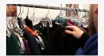
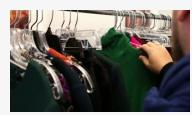
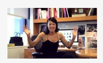
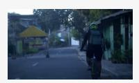
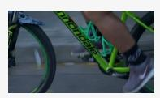
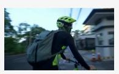
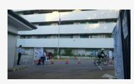

# B. New Dataset and Training Stage

### B.1. Conditional Pre-training Stage

LLaVA [\[31\]](#page-9-0) introduces a two-stage training pipeline for MLLMs, which first pre-trains for feature alignment and then conducts end-to-end instruction tuning. Mainstream methods typically adopt this two-stage training pipeline. During the alignment stage, image-caption pairs are commonly used to pre-train the visual projector, aligning visual features with the LLM's embedding space. At the instruction tuning stage, various types of question-answer pair data are utilized to fine-tune the model, including general QA, Table A1. Detailed training configurations for each stage. We follow LLaVA-OneVision [\[20\]](#page-8-6) to choose our configurations. At the conditional pre-training stage and instruction tuning stage, we use a global batch size of 512 for the 0.5B model, and 256 for the 7B and 72B models. Comp. denotes our compressing module, which plays the role of compressing the visual tokens and projecting them into the LLM's embedding space.

|                     | Alignment | Conditional Pre-train | Instruction Tuning |
|---------------------|-----------|--------------------------|-----------------------|
| Data                | Image     | Video                    | Video                 |
| # Tokens            | 81+32     | 648+32                   | 648+32                |
| # Samples           | 558K      | 248K                     | 2.6M                  |
| Trainable           | Comp.     | Comp.                    | Comp., LLM            |
| 7B LLM              | 63M       | 63M                      | 7.7B                  |
| Batch size          | 512       | 256/512                  | 256/512               |
| lr: Vision Enc.     | -         | -                        | -                     |
| lr: inj. In Comp.   | -         | 1 × 10−3                 | 1 × 10−5              |
| lr: others in Comp. | 1 × 10−3  | 1 × 10−4                 | 1 × 10−5              |
| lr: LLM             | -         | -                        | 1 × 10−5              |
| Epoch               | 1         | 1                        | 1                     |

multiple-choice QA, OCR, documents/charts/screens, math reasoning, attribute perception, counting, temporal reasoning, information synthesis, *etc* [\[33\]](#page-9-13), equipping the model with instruction-following capabilities. Recently, LLaVA-OneVision [\[20\]](#page-8-6) proposes a three-stage training paradigm. Between *Language-Image Alignment* and *Visual Instruction Tuning*, it introduces a new *stage1.5*, named *High-Quality Knowledge Learning*, using re-captioned detailed description data, OCR data, and Chinese and language data, maintaining a training strategy similar to the instruction tuning stage to inject new knowledge into MLLMs.

In our work, we propose a new training stage between alignment and instruction tuning. Unlike LLaVA-OneVision, our conditional pre-training stage is designed to pre-train the parameters for instruction injection. In the existing alignment stage, instructions typically prompt the model to describe visual content globally (e.g., "Please summarize the visual content of the image."), which is insufficient for selectively retaining information during token compression. Pre-training the instruction injection at this stage does not effectively teach the model to retain userimportant information. By using conditional captions with appropriate instructions, we can pre-train the compression module to perform conditional alignment first, simplifying the instruction tuning for conditional compression. Thus,

Instruc(on: What are the two individuals doing in front of the clothing rack?

Descrip(on: The two individuals are examining various garments hanging on the clothing rack, possibly selec(ng or organizing clothes.

Instruc(on: How does the person seated at the desk interact with their surroundings?

Descrip(on: The person seated at the desk is gesturing with their hands while speaking, indica(ng they are engaged in

some form of communica(on or explana(on.

Instruc(on: What can be seen on the desk in the office-like seOng?

Descrip(on: The desk in the office-like seOng is cluHered with various items, including books, papers, and a computer

monitor displaying images.

Instruc(on: What is the person riding?

Descrip(on: The person in the video is riding a bicycle.

Instruc(on: What is the person wearing while riding the bicycle?

Descrip(on: The person riding the bicycle is wearing a helmet and carrying a backpack.

Instruc(on: Where does the scene transi(on to a?er the person rides the bicycle along the street?

Descrip(on: The scene transi(ons from the outdoor street to an indoor or semi-enclosed space where the cyclist

con(nues to ride.

Instruc(on: What is the purpose of the login screen shown in the video?

Descrip(on: The login screen displayed in the video is used for accessing NeClix, where users can enter their email address and password to sign in.

Instruc(on: What informa(on is included on the eBay checkout page shown in the video?

Descrip(on: The eBay checkout page in the video contains payment details such as the card number, expira(on date,

and security code for comple(ng a transac(on.

Instruc(on: What does the dashboard interface in the video display?

Descrip(on: The dashboard interface in the video displays various icons represen(ng different services like TwiHer,

LinkedIn, and PayPal, along with a security alert no(fica(on.

Figure A1. Some examples of our constructed HICom-248K instruction-following descriptions.

we introduce a new conditional pre-training stage utilizing our HICom-248K dataset, which implements conditional pre-training for conditional compression.

#### B.2. HICom-248K

HICom-248K dataset is designed for the conditional pretraining, which consists of video question-answer pairs. Since the goal of the conditional pre-training stage is to achieve conditional alignment based on the instruction, HICom-248K focuses on providing one type of data, *i.e*., the instruction-followed descriptions, which meets the following requests:

- The instruction should refer to the specific information in the video, providing the guidance role of conditional compression.
- The answer should be the caption of the specific visual

Table A2. The pre-defined 29 categories during the collection of videos in HICom-248K.

| Categories defined with natural language |  |
|------------------------------------------|--|
| A video about cooking activity.          |  |
| A video about writing activity.          |  |
| A video about travel.                    |  |
| A video about sight-seeing activity.     |  |
| A life record video about exercise.      |  |
| A life record video about daily life.    |  |
| A life record video about handcraft.     |  |
| A life record video about food.          |  |
| A TV news report video.                  |  |
| A video about computer games.            |  |

A video about sports.

A video about football.

A video about basketball.

A video about pets and animals.

A video about action movie scene.

A video about comedy movie scene.

A video about sci-fi movie scene.

A video about crime movie scene.

A video about horror movie scene.

A video about magic show.

A video about acrobatics.

A documentary or TV show about humanity and history.

A documentary or TV show about biography.

A documentary or TV show about geography.

A documentary or TV show about finance and commerce.

A documentary or TV show about literature and art.

A documentary or TV show about biology and medicine knowledge.

A documentary or TV show about finance and commerce knowledge.

A documentary or TV show about technology knowledge.

Table A3. The ablation study on the group strategy for the locallevel compression.

| Methods       | w/ group | Video | oMM  | E w/o | MV-  | Ego-         |        |
|---------------|----------|-------|------|-------|------|--------------|--------|
| Methous       | w/ group | short | mid  | long  | all  | Bench        | Schema |
| Unconditional | 1        | 36.7  | 34.4 | 32    | 34.4 | 43.7         | 42.7   |
|               | X        | 34.7  | 31.9 | 31    | 32.5 | 43.7 42.9 | 39.9   |
| Conditional   | 1        | 38.8  | 36.1 | 33.1  | 36.0 | 44.0         | 43.2   |
|               | ×        | 36.6  | 33.7 | 31.2  | 33.8 | 44.0 43.6 | 41.6   |

content of the video mentioned in the instruction.

We collect the videos from Panda-70M [5] and Ego4D [15]. To ensure the diversity of the video sources, we pre-define 29 categories [10, 72] using natural language, select 1,500 videos for each category based on the similarity score calculated by InternVideo2 [54], and randomly select additional 10,000 videos from the whole Panda-70M and Ego4D datasets. The 29 categories are shown in Tab. A2. Fig. A1 shows some examples of our constructed HICom-248K. We use the open-soured Qwen2-VL-72B-Instruct [52] to generate around three instruction-description pairs for each video. The generated descriptions follow the instructions well and also accurately capture the visual content, which is suitable for conditional pre-training.

Table A4. The ablation study on valid and invalid instruction on VideoMME without subtitles. We manually select 326 samples with invalid instructions and 2374 samples with valid instructions.

| Method  | S         | Short | Medium | Long | All  |
|---------|-----------|-------|--------|------|------|
|         | # Samples | 808   | 816    | 750  | 2374 |
| Valid   | w/o inj.  | 34.1  | 33.5   | 31.1 | 32.9 |
|         | w/ inj.   | 36.3  | 35.5   | 33.2 | 35.0 |
|         | # Samples | 92    | 84     | 150  | 326  |
| Invalid | w/o inj.  | 63.0  | 47.6   | 38.7 | 47.9 |
|         | w/ inj.   | 63.0  | 47.6   | 39.3 | 48.1 |

Table A5. Ablation study about the Conditional Pre-training stage (CP for short) and HICom-248K data with different training strategies. We keep the projector of LLaVA-OV/LLaVA-Video (i.e., two layers of MLP, 2×2 spatial pooling) to train a baseline with our ablation data. We report the result on Video-MME without subtitles and EgoSchema.

| Traning Strategy                   | Methods  | VideoMME    | EgoSchema   |
|------------------------------------|----------|-------------|-------------|
| 2 Stage w/o CP                     | Baseline | 36.1        | 42.5        |
|                                    | HICom    | 36.0        | 41.6        |
| 2 Stage mix HICom-248K for SFT     | Baseline | 36.4        | 43.3        |
|                                    | HICom    | 36.2        | 42.4        |
| 3 Stage w/ HICom-248K for CP       | Baseline | 36.2        | 43.2        |
|                                    | HICom    | <b>36.6</b> | <b>43.5</b> |
| 3 Stage w/ random 248K MCQA for CP | HICom    | 34.6        | 40.8        |

