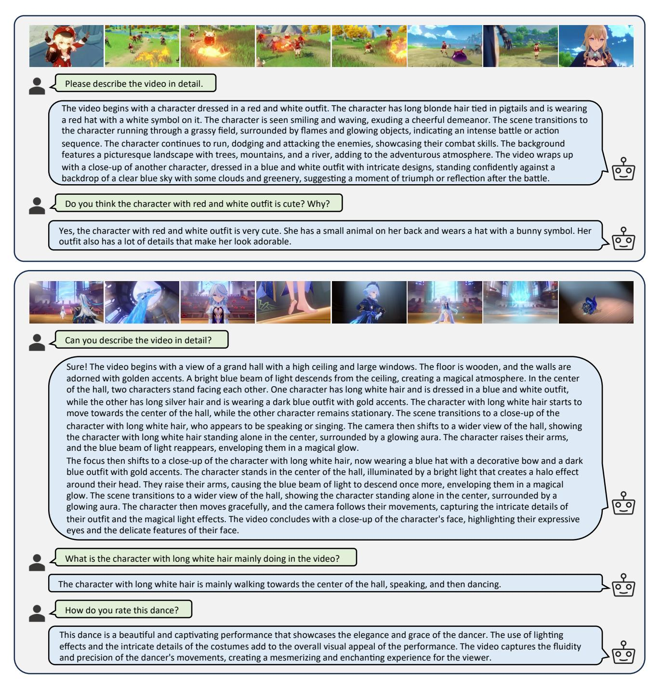
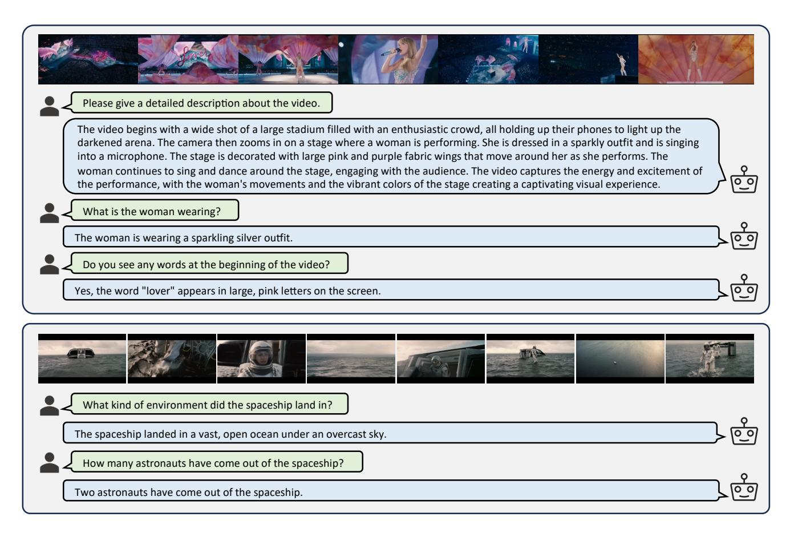

# C. More Experiments

#### C.1. More Ablation Studies

We implement more ablation studies here to demonstrate the superiority and generalization ability of our HICom.

The group strategy at the local level. We introduce the temporal-spatial inductive bias, group the visual tokens, and conduct the local-level conditional compression within each group, preserving the temporal-spatial structure while highlighting the instruction-relevant visual content. We evaluate this grouping strategy for the local-level compression in Tab. A3. Without the grouping strategy, the performance drops significantly, especially on VideoMME and EgoSchema benchmarks, showing the significance of explicitly maintaining the temporal-spatial structure.

Valid and invalid instruction. We notice that not all instructions can provide effective guidance information for capturing visual information, e.g., the instruction of the caption task. We call them the invalid instruction. To evaluate the performance of our HICom in this situation, we manually select out 326 samples with invalid instructions in the VideoMME benchmark. We list some examples of our selected invalid instruction as follows:

- What is this video mainly about?
- What can be learned from this video?
- Which element doesn't show up in the video?

> **[图片提取文字 (无描述)]:**
> Please describe the video in detail. The video begins with a character dressed in a red and white outfit. The character has long blonde hair tied in pigtails and is wearing a red hat with a white symbol on it. The character is seen smiling and waving, exuding a cheerful demeanor. The scene transitions to the character running through a grassy field, surrounded by flames and glowing objects, indicating an intense battle or action sequence. The character continues to run, dodging and attacking the enemies, showcasing their combat skills. The background features a picturesque landscape with trees, mountains, and a river, adding to the adventurous atmosphere. The video wraps up with a close-up of another character, dressed in a blue and white outfit with intricate designs, standing confidently against a backdrop of a clear blue sky with some clouds and greenery, suggesting a moment of triumph or reflection after the battle. Do you think the character with red and white outfit is cute? Why? Yes, the character with red and white outfit is very cute. She has a small animal on her back and wears a hat with a bunny symbol. Her outfit also has a lot of details that make her look adorable. Can you describe the video in detail? Sure! The video begins with a view of a grand hall with a high ceiling and large windows. The floor is wooden, and the walls are adorned with golden accents. A bright blue beam of light descends from the ceiling, creating a magical atmosphere. In the center of the hall, two characters stand facing each other. One character has long white hair and is dressed in a blue and white outfit, while the other has long silver hair and is wearing a dark blue outfit with gold accents. The character with long white hair starts to move towards the center of the hall, while the other character remains stationary. The scene transitions to a close-up of the character with long white hair, who appears to be speaking or singing. The camera then shifts to a wider view of the hall, showing the character with long white hair standing alone in the center, surrounded by a glowing aura. The character raises their arms, and the blue beam of light reappears, enveloping them in a magical glow. The focus then shifts to a close-up of the character with long white hair, now wearing a blue hat with a decorative bow and a dark blue outfit with gold accents. The character stands in the center of the hall, illuminated by a bright light that creates a halo effect around their head. They raise their arms, causing the blue beam of light to descend once more, enveloping them in a magical glow. The scene transitions to a wider view of the hall, showing the character standing alone in the center, surrounded by a 0\_0 glowing aura. The character then moves gracefully, and the camera follows their movements, capturing the intricate details of their outfit and the magical light effects. The video concludes with a close-up of the character's face, highlighting their expressive eves and the delicate features of their face. What is the character with long white hair mainly doing in the video? The character with long white hair is mainly walking towards the center of the hall, speaking, and then dancing. How do you rate this dance? This dance is a beautiful and captivating performance that showcases the elegance and grace of the dancer. The use of lighting effects and the intricate details of the costumes add to the overall visual appeal of the performance. The video captures the fluidity 00 and precision of the dancer's movements, creating a mesmerizing and enchanting experience for the viewer.

Figure A2. Some video dialogue examples of HICom in the scene of the animated style.

- In what order were the following mentioned in the video?
- According to the video, which of the following statements is true?
- Which of the following accurately describes the content of the video?

As shown in Tab. [A4,](#page-13-3) we test both the unconditional and

conditional compression on 326 invalid instructions and the other 2374 valid instructions of VideoMME without subtitles separately. For valid instructions, the conditional compression (w/ inj.) gains 2.1% compared with unconditional compression (w/o inj.). When it comes to invalid instructions, the conditional compression keeps the same results

> **[图片提取文字 (无描述)]:**
> Please give a detailed description about the video. The video begins with a wide shot of a large stadium filled with an enthusiastic crowd, all holding up their phones to light up the darkened arena. The camera then zooms in on a stage where a woman is performing. She is dressed in a sparkly outfit and is singing into a microphone. The stage is decorated with large pink and purple fabric wings that move around her as she performs. The woman continues to sing and dance around the stage, engaging with the audience. The video captures the energy and excitement of the performance, with the woman's movements and the vibrant colors of the stage creating a captivating visual experience. What is the woman wearing? The woman is wearing a sparkling silver outfit. Do you see any words at the beginning of the video? Yes, the word "lover" appears in large, pink letters on the screen. What kind of environment did the spaceship land in? The spaceship landed in a vast, open ocean under an overcast sky. How many astronauts have come out of the spaceship? Two astronauts have come out of the spaceship.

Figure A3. Some video dialogue examples of HICom in the scene of the realistic style.

Table A6. Inference efficiency comparison between LLaVA-OneVision-7B and our HICom-7B. We report the number of parameters, the inference time of each component, and the final throughput.

|            | Methods     | Frames | Vision Encoder | Compressor | LLM   | All   |
|------------|-------------|--------|----------------|------------|-------|-------|
| Params     | LLaVA-OV-7B | 32     | 413M           | 16M        | 7.6B  | 8.0B  |
| Params     | HICom-7B    | 32     | 428M           | 450M+63M   | 7.6B  | 8.5B  |
| Time       | LLaVA-OV-7B | 32     | 11.1           | 2.3        | 553.7 | 567.1 |
| (ms)       | HICom-7B    | 32     | 11.1           | 23.9       | 102.7 | 137.7 |
|            | LLaVA-OV-7B | 32     | -              | -          | -     | 4.25  |
| Throughput | HICom-7B    | 32     | -              | -          | -     | 1.51  |
| (s/video)  | HICom-7B    | 64     | -              | -          | -     | 1.89  |
|            | HICom-7B    | 128    | -              | -          | -     | 2.68  |

as unconditional compression on short and medium videos, and even gains slightly on long videos. We also find the performance of this situation might be easier than valid instruction, as both models perform much better. Thanks to our design of the local-level compression and the group strategy, we argue that the conditional compression will also focus on the global content of the video within each group, and degrade to the situation of unconditional compression, as there also exists this kind of data during training. The conditional

Table A7. The comparison of SOTA methods and HICom on MLVUdev benchmark. \* indicates we reproduce the results ourselves using the official checkpoint and inference code provided by authors.  $\S$  donates we inference with a new length of frames trained by sampling 32 frames.

| Methods              | LLM Size | Frames | Tokens | $MLVU_{dev}$  |
|----------------------|----------|--------|--------|---------------|
| Video-LLaVA [30]     | 7B       | 8      | 2048   | 47.3          |
| LLaMA-VID [28]       | 7B       | 1fps   | 2tps   | 33.2          |
| LongVA [69]          | 7B       | 128    | 18432  | 56.3          |
| VideoLLaMA2 [7]      | 7B       | 16     | 1152   | 48.5          |
| LLaVA-OneVision [20] | 7B       | 32     | 6272   | 65.3*         |
| LLaVA-Video [72]     | 7B       | 32     | 6272   | <u>66.7</u> * |
| HICom (Ours)         | 7B       | 32     | 680    | 62.8          |
| HICom (Ours)§        | 7B       | 64     | 1328   | 65.1          |
| HICom (Ours)§        | 7B       | 128    | 2624   | 67.2          |

compression will not perform lower than the unconditional compression.

Conditional pre-training stage and HICom-248K data. We further conduct ablation studies on our proposed conditional pre-training stage and HICom-248K data. We use four different training strategy settings, and report their re-

sults of both baseline and our HICom, as shown inTab. [A5.](#page-13-4) We keep the projector of LLaVA-OV/LLaVA-Video (*i.e*., two layers of MLP, 2×2 spatial pooling) to train a baseline with our ablation data. We find the increase from constructed data for baseline (*i.e*., the comparison between the first strategy and the third strategy) is not as significant as HICom (averagely 0.4% vs 1.25%). We also find that for HICom, mixing SFT (the second strategy) gains slightly (0.5%) on 2-stage training (the first strategy), but our 3 stage training (the third strategy) outperforms 2-stage training (the first strategy) obviously (1.25%). These two findings demonstrate that our improvement comes more from the additional pre-training strategy, rather than the constructed data themselves. The fourth strategy demonstrates the significance of the data type of the conditional stage, as the performance significantly drops when we change our instruction-followed descriptions to multi-choice QA data, which may confuse the alignment of instruction injection.

Inference efficiency. Apart from the number of visual tokens that are sent into LLM, we also report the throughput to further demonstrate the inference efficiency. The comparison between LLaVA-OneVision-7B and HICom-7B is shown in Tab. [A6.](#page-15-0) We report the time using the same sample, and we only report the LLM time of the first generated token for fair comparison. We report the average time-consuming result of inferring 100 samples as throughput, the time in throughput is larger than our reported time because the throughput counts the time of video loading, the prepare inputs labels for multimodal process, and the LLM generates more than one token. Compared with LLaVA-OneVision, our vision encoder includes an additional projector and therefore contains additional 16M parameters, and the compressor includes an additional 450M text encoder. This leads to our 23.9ms consumption of the compressor with the text encoding process, 21.6ms more than LLaVA-OneVision. However, our compressor significantly reduces the visual tokens, resulting much shorter time consumption of LLM (102.7ms *vs* 553.7ms), as the LLM inference time usually occupies the main part. Therefore, the number of visual tokens can also effectively and accurately reflect the inference efficiency. Thanks to our compression, our final throughput is much faster than LLaVA-OneVision, as our HICom with 128 frames still infers 1.6x faster than LLaVA-OneVision with only 32 frames.

