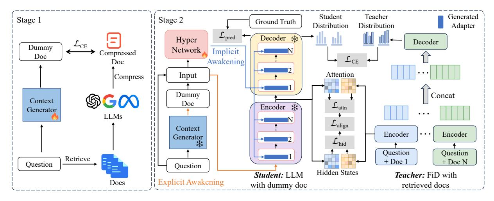

# 3.1 Formulation

The formulation of our task follows RAG for QA [\(Guu et al.,](#page-9-4) [2020\)](#page-9-4). Let V ∗ denote the infinite set, encompassing all potential strings over the tokens in vocabulary V, and this includes the empty string. An instance within a QA dataset is defined as a

> **[图片提取文字 (无描述)]:**
> Teacher Student Generated Stage 2 Stage 1 Ground Truth Distribution Distribution Adapter  $\mathcal{L}_{\text{pred}}$ Decoder \* Hyper Decoder  $\mathcal{L}_{CE}$ Dummy Network Implicit Compressed Doc  $\mathcal{L}_{\text{CE}}$ Awakening Doc Attention Input Compress Dummy Concat \$ G € € € € € € € € € € € € € € € € € € Context Doc  $\mathcal{L}_{\mathrm{attn}}$ Encoder \* Generator LLMs  $\mathcal{L}_{align}$ Context Encoder Encoder . . . Generator  $\mathcal{L}_{\mathrm{hid}}$ Question Question Retrieve + Doc + Doc N Question Question Hidden States Student: LLM Teacher: FiD with Explicit Awakening Docs with dummy doc retrieved docs

Figure 2: Overview of AAG method. In the inference phase, for each question, the explicit awakening (context generator) generates a short dummy document and the implicit awakening (hypernetwork) generates a specific LoRA module. During training, there are two stages: the first stage is the **pre-training** of the **context generator** (§ 3.2), aiming at its ability to imagine a short dummy document based on the question, and the second stage is the **hypernetwork fine-tuning** (§ 3.3) using long context distillation (§ 3.4) to obtain a question-specific LoRA module.

triplet (q, a, c) comprising question q, answer a, and context c, where  $q, a, c \in \mathcal{V}^*$ . Conventionally, the context c is drawn from the knowledge corpus  $\mathcal{Z}$ , like Wikipedia, whereby  $\mathcal{Z} \subset \mathcal{V}^*$ . Additional background details are available in B.1.

