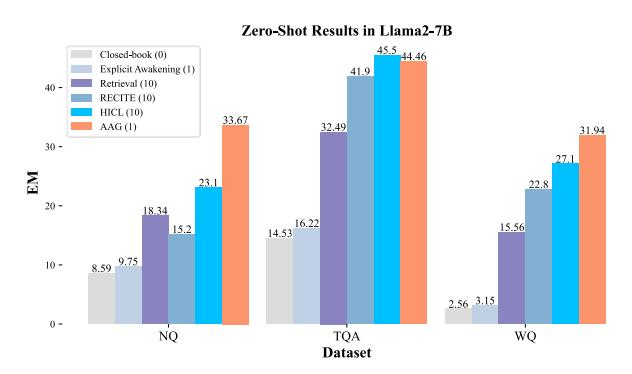

# 4.4.1 Supervised Setting

Table [1](#page-6-1) presents the performance results, with full results including T5-Base detailed in [C.1.](#page-14-1) Compared to closed-book models, as well as RAG and GAG methods, our proposed AAG method, achieves state-of-the-art (SOTA) performance using an equivalent number of documents.

In the closed-book setting (upper part of the table), our method surpasses the baseline by an average of +2% EM score, demonstrating its superior ability to leverage internal knowledge through awakening. Notably, as the model size increases, the performance gains from the awakening approach become even more pronounced.

The following sections present the experimental results in the open domain setting[4](#page-5-1) . Notably, proposed AAG using just one short dummy document, matches or exceeds the performance of RAG and GAG methods, which process 10 documents. These results demonstrate that AAG effectively balances efficiency and overhead by leveraging imagined compressed text.

AAG outperforms baselines when documentsmatched. When AAG utilizes 10 retrieved documents under RAG setting, it surpasses RFiD performance by 1.6% in NQ, 4.4% in TQA, and 2.7% in WQ. When AAG utilizes 10 generated documents under the GAG setting, it surpasses strong baseline GENREAD (clustering) performance by 4.5% in NQ, 0.7% in TQA, and 1.1% in WQ.

4Due to memory constraints, AAG under the RAG setting

| Models                                    | # Docs         | NQ           |                   | TriviaQA     |                   | Web(         | WebQ              |  |
|-------------------------------------------|----------------|--------------|-------------------|--------------|-------------------|--------------|-------------------|--|
|                                           | 2005           | Large (800M) | XL (3B)           | Large (800M) | XL (3B)           | Large (800M) | XL (3B)           |  |
| # Closed-book Setting                     |                |              |                   |              |                   |              |                   |  |
| T5 (Roberts et al., 2020a)                | 0              | 28.5*        | 28.30             | 28.7*        | 33.92             | 30.6*        | 34.43             |  |
| LoRA (Hu et al., 2021)                    | 0              | 17.70        | 23.15             | 23.87        | 32.16             | 29.13        | 35.24             |  |
| AAG (Ours)                                | 0              | 29.32        | 29.59             | 30.11        | 35.71             | 32.68        | 37.40             |  |
| # Retrieval Augmented Setting (compared s | with RAG)      |              |                   |              |                   |              |                   |  |
| DPR* (Karpukhin et al., 2020) (110M)      | 100            | 41.5         | -                 | 56.8         | -                 | 41.1         | -                 |  |
| RAG* (Lewis et al., 2020)                 | 10             | 44.5         | -                 | 56.1         | -                 | 45.2         | -                 |  |
| FiD* (Izacard and Grave, 2021)            | 10             | 46.7         | 50.1              | 61.9         | 66.3              | 48.1         | 50.8              |  |
| FiD (Izacard and Grave, 2021)             | 100            | 51.4*        | 55.2 ‡ | 67.6*        | 72.9 ‡ | 50.5         | 52.9 ‡ |  |
| EAR (Chuang et al., 2023)                 | 10             | 39.6         | 42.3*             | 60.0         | 64.6*             | -            | -                 |  |
| RFiD (Wang et al., 2023a)                 | 10             | 48.3         | 50.5              | 63.4         | 67.8              | -            | -                 |  |
| FILCO* (Wang et al., 2023d)               | 1              | -            | 44.7              | -            | 59.0              | -            | -                 |  |
| AAG (Ours)                                | 10             | 49.9         | 50.9 ‡ | 69.7         | $70.3^{\ddagger}$ | 51.5         | $52.8^{\ddagger}$ |  |
| AAG (Ours)                                | 30             | 53.1         | -                 | 70.5         | -                 | 52.0         | -                 |  |
| # Generation Augmented Setting (compare   | d with GA      | <i>G</i> )   |                   |              |                   |              |                   |  |
| GENREAD (sampling)* (Yu et al., 2023)     | $10^{\dagger}$ | 40.3         | 42.6              | 67.8         | 69.6              | 51.5         | 52.6              |  |
| GENREAD (clustering)* (Yu et al., 2023)   | $10^{\dagger}$ | 43.5         | 45.6              | 70.2         | 71.6              | 53.5         | 54.4              |  |
| AAG (Ours)                                | $10^{\dagger}$ | 48.8         | 49.2 ‡ | 70.9         | $72.2^{\ddagger}$ | 54.5         | 55.6 ‡ |  |
| # Awakening Augmented Setting             |                |              |                   |              |                   |              |                   |  |
| LoRA (Hu et al., 2021)                    | $1^{\dagger}$  | 40.1         | 44.2              | 62.8         | 66.9              | 43.7         | 48.2              |  |
| AAG (Ours)                                | $1^{\dagger}$  | 42.3         | 46.5              | 65.5         | 68.4              | 45.3         | 50.5              |  |

Table 1: OA performances of different methods with different settings. The first part (closed-book setting) indicates that only utilize questions; The latter three parts utilize explicit documents. The best results are in bold, while the second-best are underlined. \* means that those results are from existing papers, † denotes that the documents were generated († indicates that the number of documents is reduced due to insufficient memory for distillation).

> **[图片提取文字 (无描述)]:**
> Zero-Shot Results in Llama2-7B 45.5 44.46 Closed-book (0) Explicit Awakening (1) 41.9 40 -Retrieval (10) RECITE (10) HICL (10) 33.67 31.94 AAG(1) 32.49 30 -27.1 23.1 22.8 20 -18.34 16.22 15.56 15.2 14.53 8.59 9.75 10 -2.56 3.15 0 -NQ TQA WQ Dataset

Figure 4: Zero-Shot results (EM, %) of Llama2-7B on three open-domain QA datasets. The number in parentheses indicates the number of documents used. More zero-shot setting results can be seen in C.3.

#### 4.4.2 Zero-shot Setting

Figure 4 illustrates the zero-shot results for LLMs implementing AAG with a frozen Llama2-7B and -13B. This research seeks to explore the possibility of enhancing LLMs via AAG. Due to the high computational demands of training, we only finetuned the hypernetwork on a mixed dataset without LCD in this experiment and evaluated performance in a zero-shot setting. Detailed prompt information can be found in the B.2.

We discerned that Llama2's performance can be

using 30 documents.

enhanced by imagining knowledge autonomously. While leveraging explicit imagined context could amplify the average EM +1%, this is not as significant as the improvement achieved by retrieving 10 documents, indicating the limitations of relying solely on prompt cues for triggering corresponding knowledge. AAG can enhance knowledge via two main awakening processes, escalating EM by +15.33% for NQ, +11.97% for TQA, and +16.38% for WQ. Compared to two other advanced RAG methods, AAG using a single document performs only 1 EM lower than the HICL method (Wang et al., 2024) on the TQA but achieves +10% EM on the NQ and +5% EM on the WQ. With AAG, Llama2-7B demonstrated an average improvement of +14% across the three datasets. This trend is also observed in Llama2-13B's results (Figure 5). This implies that even in zero-shot settings, our method can still offer substantial benefits to LLMs.

#### **Out-Of-Distribution (OOD) Performance** 4.5

To further demonstrate the generalizations of the AAG method and the importance of hypernetwork, we also evaluate its performance in OOD generalizations. Table 2 shows the IID and OOD performance of FiD, and AAG methods with different document settings when training on NQ (From NQ

| Models    | # Docs        | Ba    | se (220) | M)    | Large (800M) |       |       |  |
|-----------|---------------|-------|----------|-------|--------------|-------|-------|--|
| 1,1000015 | 2005          | NQ    | TQA      | WQ    | NQ           | TQA   | WQ    |  |
| T5        | 0             | 22.16 | 3.18     | 4.12  | 28.5*        | 3.18  | 4.12  |  |
| AAG       | 0             | 23.89 | 6.21     | 10.94 | 29.32        | 10.17 | 14.06 |  |
| FiD       | 10            | 46.81 | 53.93    | 24.02 | 46.7*        | 57.93 | 25.12 |  |
| AAG       | 10            | 47.01 | 55.74    | 24.13 | 49.92        | 60.03 | 25.79 |  |
| LoRA      | $1^{\dagger}$ | 37.17 | 45.20    | 15.62 | 37.61        | 48.50 | 20.71 |  |
| AAG       | $1^{\dagger}$ | 40.14 | 46.61    | 18.92 | 42.32        | 54.80 | 22.05 |  |

Table 2: **IID** and **OOD** results. The performance on three open-domain datasets for the model trained on NQ is reported, with underlined values indicating IID performance. Full OOD results and details of the three datasets are provided in the C.2.

| Models | Training Params | # Docs | # Avg Tokens | Inference Time | Training Time |
|--------|--------------------|--------|-----------------|-------------------|------------------|
| T5     | 220M               | 0      | 19.8            | 79.8s             | 0.9h             |
| AAG    | 139.3M             | 0      | 19.8            | 82.3s             | 1.2h             |
| AAG    | 139.3M             | 1      | 522.1           | 214.6s            | 1.7h             |
| FiD    | 220M               | 10     | 1748.3          | 683.3s            | 2.3h             |
| GEN.   | 220M               | 10     | 1912.5          | 704.8s            | -                |
| FiD    | 220M               | 100    | 16625.7         | 1293.2s           | 5.8h             |

Table 3: Training and inference cost on the NQ.

generalization to the other two datasets).

It is patently clear that an increment in document provision leads to better OOD performance, likely due to the presence of answer-oriented content within these documents. Remarkably, AAG can come within a relatively narrow 5% gap of FiD, even when utilizing a single imagined document as opposed to 10 retrieved documents.

Simultaneously, AAG generally showcases superior performance in OOD when provided with 10 retrieved documents. This superiority can be traced back to the pivotal role played by hypernetwork in generating LoRA adapters' weights based on questions. This equips models with the capability to invoke and access internal knowledge based on context-specific discourse rather than confining to resolving distinct questions.

#### 4.6 Training Cost and Inference Speed-up

We proceeded to measure the inference speed documented in GPU time and training time for 5000 steps on the NQ dataset using T5-Base. The experiments were conducted on a single RTX 3090 GPU, maintaining a standard batch size of 8 during training and 1 during inference. A detailed inference case is shown in the Appendix D.

As evident from Table 3, the proposed method's advantage lies in its diminished requirement for parameter updates, which can be attributed to the shared hypernetwork's utilization that generates LoRA adapters, thereby negating the necessity

| Methods                   | # Docs (↓)     | NQ (†)               | TQA (↑)              | WQ (†)           |
|---------------------------|----------------|----------------------|----------------------|------------------|
| AAG                       | 1 † | 40.14                | 60.75                | 41.73            |
| w/o EA                    | 0              | 23.89 (\( \psi 40\%) | 22.69 (\\$\ 63\%)    | 30.31 (\psi 27%) |
| In. w/o EA                | 1              | 38.85 (\psi 3\%)     | 59.62 (\psi 2\%)     | 40.65 (\psi 3\%) |
| w/o IA                    | 1              | 33.48 (\ 17%)        | 51.19 (\( \psi 16\%) | 34.72 (\ 17%)    |
| w/o LCD                   | 1              | 33.96 (\ 15%)        | 53.27 (\ 12%)        | 29.39 (\pm 29%)  |
| w/o $\mathcal{L}_s$       | 1              | 34.24 (\ 14\%)       | 54.90 (\ 10\%)       | 31.67 (\psi 24%) |
| w/o $\mathcal{L}_{align}$ | 1              | 37.41 (\psi 7%)      | 56.38 (\psi 7\%)     | 39.26 (\psi 6\%) |

Table 4: Ablation studies on three open-domain QA datasets. The backbone model is the T5-base. "In." means the input of the hypernetwork § 3.3.

of individual LoRA adapters' setup. Despite the lack of a training advantage due to distillation constraints, AAG achieves efficient reasoning through an extremely lightweight design, saving more than half the training time compared to methods using a large number of documents  $(0.3\times)$ . Compared to the other two methods, the processed tokens are significantly decreased, while either outperforming them or showing negligible differences in performance. This represents an optimal trade-off between efficiency and computational demand. Moreover, unlike GAG, our approach incurs no financial costs associated with API calls, and the reduced model size facilitates faster generation.

#### 4.7 Ablation Study

This study introduces two key awakening processes to stimulate LLMs' internal knowledge: explicit awakening (EA) and implicit awakening (IA). We particularly examined the influence of different awakening types on performance.

Table 4 demonstrates that both EA and IA are important for AAG. Omitting either one results in a considerable reduction in performance, with a drop exceeding 30% observed when EA is neglected. This is harmonious with the initial observation that performance improvement becomes more noticeable when relevant documents are available, thus underscoring EA's superiority.

The outcomes of Long Context Distillation (LCD) including  $\mathcal{L}_s$  and  $\mathcal{L}_{align}$  also make marginal contributions to the overall results. This validates the previous assertion that a more extensive context tends to optimize performance, although with limited gains. The impact of EA on the application of hypernetworks is minimal (<3%), indicating that hypernetworks in IA primarily serve to awaken parameter knowledge rather than to utilize the generated context. The experiments and analysis above demonstrate the importance of each component and the effectiveness of our AAG method.

