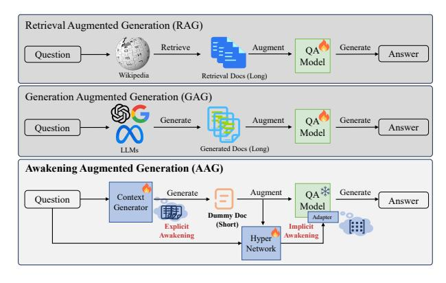

# Awakening Augmented Generation: Learning to Awaken Internal Knowledge of Large Language Models for Question Answering

Huanxuan Liao1,2, Shizhu He1,2\*, Yao Xu1,2, Yuanzhe Zhang1, Shengping Liu3, Kang Liu1,2, Jun Zhao1,2

The Key Laboratory of Cognition and Decision Intelligence for Complex Systems,
 Institute of Automation, Chinese Academy of Sciences, Beijing, China
 School of Artificial Intelligence, University of Chinese Academy of Sciences, Beijing, China
 Unisound, Beijing, China

liaohuanxuan2023@ia.ac.cn {yao.xu, shizhu.he, kliu, jzhao}@nlpr.ia.ac.cn

#### **Abstract**

Retrieval-Augmented-Generation and Generation-Augmented-Generation have been proposed to enhance the knowledge required for question answering with Large Language Models (LLMs) by leveraging richer con-However, the former relies on external resources, and both require incorporating explicit documents into the context, which increases execution costs and susceptibility to noise data during inference. Recent works indicate that LLMs model rich knowledge, but it is often not effectively activated and awakened. Inspired by this, we propose a novel knowledge-augmented framework, Awakening-Augmented-Generation (AAG), which mimics the human ability to answer questions using only thinking and recalling to compensate for knowledge gaps, thereby awaking relevant knowledge in LLMs without relying on external resources. AAG consists of two key components for awakening richer context. Explicit awakening fine-tunes a context generator to create a synthetic, compressed document that functions as symbolic context. Implicit awakening utilizes a hypernetwork to generate adapters based on the question and synthetic document, which are inserted into LLMs to serve as parameter context. Experimental results on three datasets demonstrate that AAG exhibits significant advantages in both open-domain and closed-book settings, as well as in out-of-distribution generalization. Our code will be available at https: //github.com/Xnhyacinth/IAG.

#### 1 Introduction

We can know more than we can tell. — Michael Polanyi

Knowledge-intensive tasks like question answering (QA) necessitate utilizing extensive world and domain knowledge (Berant et al., 2013; Joshi

> **[图片提取文字 (无描述)]:**
> Retrieval Augmented Generation (RAG) Retrieve Augment Generate Question Answer Model Wikipedia Retrieval Docs (Long) Generation Augmented Generation (GAG) Generate Augment Generate QA Question Answer Model Generated Docs (Long) LLMs Awakening Augmented Generation (AAG) Augment Generate Generate Context Question Answer Model Generator **Dummy Doc** Adapter (Short) Explicit Implicit Awakening Awakening Hyper Network

Figure 1: Compared with RAG and GAG, the proposed AAG eschews external resources, generates a dummy document (explicit awakening) and creates flexible adapters (implicit awakening) for each question.

et al., 2017; Kwiatkowski et al., 2019). Nowadays, Large Language Models (LLMs) have displayed notable competencies in almost every task and industry (Liu et al., 2023b). However, LLMs lack the sufficient capability to independently handle knowledge-intensive tasks (Frisoni et al., 2024) and usually generate hallucinations (Zhao et al., 2023).

In recent years, to address hallucinations in LLMs and enhance performance in question answering, researchers have developed several knowledge-augmented methods for LLMs. These methods primarily fall into two categories: Retrieval-Augmented Generation (RAG) (Guu et al., 2020) which retrieves documents from external resources (e.g., Wikipedia) and incorporates both the retrieved documents and the question into LLMs (Izacard and Grave, 2021) (top part of Figure 1). Generation-Augmented Generation (GAG) (Kim et al., 2024) which utilizes LLMs such as ChatGPT (Ouyang et al., 2022) to generate more relevant documents, which are then used to enhance the answer generation (middle part of Figure 1).

However, these methods have the following

\*Corresponding author

disadvantages[1](#page-1-0) : 1) Dependence on external resources, RAG relies on external domain knowledge resources [\(Ke et al.,](#page-9-7) [2024\)](#page-9-7), while GAG depends on a more powerful external LLM as a knowledge generator. This reliance limits their broader application. 2) Increased execution costs, the computing resources and inference time required increase significantly with the number of documents. For example, the typical RAG method FiD [\(Izacard and](#page-9-5) [Grave,](#page-9-5) [2021\)](#page-9-5) must handle over 12,000 tokens to retrieve 100 documents, resulting in more than a 100-fold increase in prompt length and over 1002 fold increase in inference time [\(Liu et al.,](#page-9-8) [2023a\)](#page-9-8). Similarly, the GAG method [\(Yu et al.,](#page-11-1) [2023\)](#page-11-1) incurs additional financial costs, such as API calls. 3) Specific retraining, these approaches often require retraining for different domains, tasks and datasets [\(Li et al.,](#page-9-9) [2024\)](#page-9-9). This heightens the challenge of reusing models across different scenarios, resulting in resource inefficiency due to low parameter effectiveness and the need for extensive data.

In fact, LLMs inherently possess rich knowledge and significant potential for tackling knowledgeintensive tasks [\(Bhagavatula et al.,](#page-8-1) [2020\)](#page-8-1). Performance on specific tasks can be improved by more effectively activating and awakening relevant knowledge without external resources. For instance, strategies such as repeating the question twice [\(Xu et al.,](#page-11-2) [2023\)](#page-11-2), consolidating knowledge with prompts like "*As far as I know*" [\(Yao et al.,](#page-11-3) [2023\)](#page-11-3), and employing visual-language models to imagine images [\(Tang et al.,](#page-10-1) [2023\)](#page-10-1) can all enhance the performance of LLMs on downstream tasks. That is, LLMs model rich knowledge, but it is often not effectively activated and awakened.

Inspired by the above findings and to alleviate the challenges in RAG and GAG, we propose a novel knowledge-augmented framework called Awakening-Augmented Generation (AAG) which emulates the human ability to compensate for knowledge deficits through thinking and recalling in QA. AAG utilizes the context generator to generate a compressed dummy document as symbolic context while reducing computational demands. For instance, AAG uses "*official language ... Jamaica*" (just 20 tokens) as knowledge instead of "*Jamaica is regarded... official language is English...*" (>200 tokens) in RAG or GAG for the question "*what does jamaican people speak?*" in WebQ [\(Berant et al.,](#page-8-0) [2013\)](#page-8-0). Additionally, AAG

uses the hypernetwork to generate adapters as parameter context for each question, which integrates the advantages of instruction-based learning with parameter-efficient modules to awaken a richer context in LLMs (bottom part of Figure [1\)](#page-0-0).

Specifically, to sufficiently awaken the inherent knowledge of LLMs, we design two main modules to obtain different types of contexts and improve the utilization of relevant knowledge in LLM. The explicit awakening module first employs symbol distillation to compress context, followed by finetuning the context generator to generate a concise dummy document, effectively reducing the length of text processing. Next, within the knowledge distillation framework, the implicit awakening module utilizes a hypernetwork to convert questions and other task data (e.g., documents) into adapters inserted into LLMs. This dynamic generation allows for more adaptable and contextually relevant module generation, enhancing the model's ability to handle diverse and complex tasks effectively. The core idea of AAG is to enable student models that lack rich contextual information to mimic teacher models that possess such information.

We evaluate the proposed AAG on various LLMs, including T5 [\(Roberts et al.,](#page-10-2) [2020a\)](#page-10-2) and Llama2 [\(Touvron et al.,](#page-10-3) [2023\)](#page-10-3). The experimental results across NQ [\(Kwiatkowski et al.,](#page-9-1) [2019\)](#page-9-1), TriviaQA [\(Joshi et al.,](#page-9-0) [2017\)](#page-9-0) and WebQ datasets indicate that the proposed AAG yields performance gains while reducing computational expenses and time during inference. Notably, it outperforms baselines that retrieve and generate knowledge 2% under the same document settings and can achieve similar performance while reducing inference cost (tokens processed) by up to 4×. In conclusion, the contributions of this paper are summarized as follows:

- We propose a new knowledge augmentation framework AAG to awaken richer context (symbolic and parameter context) more efficiently without relying on external resources.
- We make use of a text-conditioned hypernetwork to generate parameter-efficient modules as parameter context based on the question and a dummy compressed document.
- Experimental results indicate that AAG effectively awakens the relevant knowledge of LLMs which demonstrates significant advantages in both open-domain and closed-book settings while reducing inference cost.

1A more intuitive comparison can be seen in [A.1.](#page-11-4)

