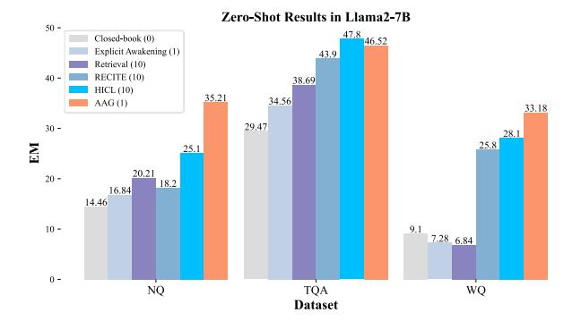

# B.4 Downstream Evaluation Datasets

We use the following three Open-Domain QA for the experiments (§ [4.1\)](#page-5-2).

- NaturalQuestions [\(Kwiatkowski et al.,](#page-9-1) [2019\)](#page-9-1) contains questions corresponding to Google search queries. The open-domain version of this dataset is obtained by discarding answers with more than 5 tokens, each accompanied by a Wikipedia article containing the answer.
- TriviaQA [\(Joshi et al.,](#page-9-0) [2017\)](#page-9-0) contains questions gathered from trivia and quiz-league websites. The unfiltered version of TriviaQA is used for open-domain question answering, each question is accompanied by pages from web and Wikipedia searches that may contain the answer.
- WebQuestions [\(Berant et al.,](#page-8-0) [2013\)](#page-8-0) contains questions from web queries matched to corresponding entries in FreeBase [\(Bollacker et al.,](#page-8-5) [2008\)](#page-8-5).

> **[图片提取文字 (无描述)]:**
> Zero-Shot Results in Llama2-7B 50 -47.8 46.52 Closed-book (0) Explicit Awakening (1) 43.9 Retrieval (10) 40 -RECITE (10) 38.69 HICL (10) 35.21 34.56 AAG (1) 33.18 30 -29.47 28.1 25.8 25.1 20.21 20 -18.2 16.84 14.46 9.1 10 -7.28 6.84 0 -NQ TQA WQ Dataset

Figure 5: Zero-Shot results (EM, %) of Llama2-13B on three open-domain QA datasets. The number in parentheses indicates the number of documents used.

Table [8](#page-14-3) presents detailed statistics of the dataset sizes, including the training, development, and test sets. We note that all our models are trained exclusively on the training data, and we did not include the development data in our training process. Therefore, the performance numbers reported in the paper for the dev and test data are independent of the training data.

