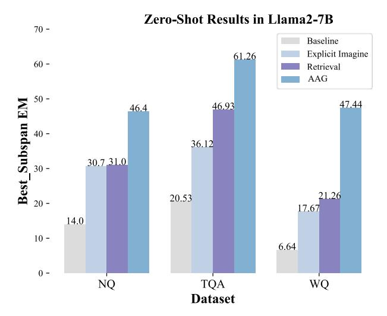
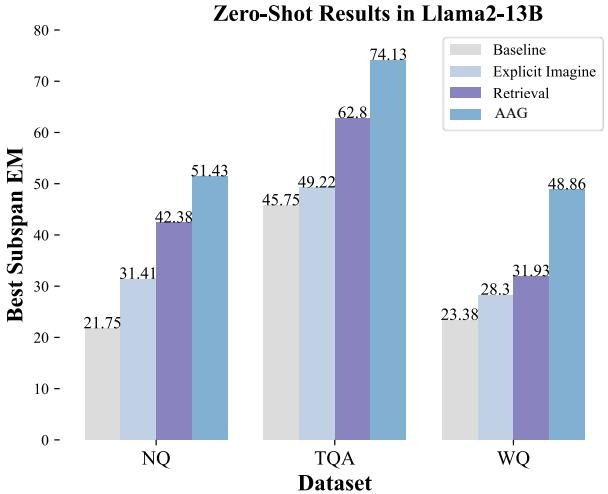

# C.1 Supervised Performance

As shown in Table [15,](#page-19-0) our initial observations indicate that regardless of the method implemented, supplying a certain quantity of related documents can expedite improvement and enhance performance in QA. FiD [\(Izacard and Grave,](#page-9-5) [2021\)](#page-9-5)

> **[图片提取文字 (无描述)]:**
> Zero-Shot Results in Llama2-7B 70 -Baseline Explicit Imagine 61.26 60 -Retrieval AAG **Best\_Supspan** EM - 00 - 00 - 00 - 00 - 00 - 00 - 00 -50 -47.44 46.93 46.4 36.12 30.7 31.0 21.26 20.53 20 -17.6714.0 10 -6.64 0 -NQ WQ TQA Dataset

Figure 6: Zero-Shot results (Best\_Subspan EM, %) of Llama2-7B on three open-domain QA datasets.

model outclasses all baseline models in performance. Notably, utilizing FiD-xl with a mere 10 documents yields performance on par with that attained through the use of FiD-l with 100 documents. Larger models not only encapsulate more knowledge but also demonstrate a superior ability to activate and apply this knowledge efficiently.

Additionally, in comparison with LoRA (Hu et al., 2021) methods, AAG enhances EM scores by an average of +2.2%. In the closed-book setting, the LoRA method manifests a substantial decrease in performance, likely attributable to the inadequacy of learning sufficient knowledge via questions for storage in the LoRA module. On the other hand, AAG harnesses both explicit and implicit awakenings to exploit knowledge for improved outcomes. These results indicate that the knowledge stored in the LLMs' parameters can still be further exploited.

#### C.2 OOD Results

Table 7 shows the full OOD results in QA. It can be observed that our method has the best OOD generalization ability on all three benchmarks. Although LoRA performs well on the in-distribution part, its performance is generally poor on OOD, with some even showing negative performance. This highlights the importance of the domain adaptability of the implicit awakening Hypernetwork in our method, which generates LoRA adapter weights based on input.

> **[图片提取文字 (无描述)]:**
> Zero-Shot Results in Llama2-13B 80 -Baseline 74.13 Explicit Imagine 70 -Retrieval 62.8 AAG 60 -Best Subspan EM 51.43 50 -49.22 48.86 45.75 42.38 31.93 31.41 30 -28.3 23.38 21.75 20 -10 -0 -WQ NQ **TQA Dataset**

Figure 7: Zero-Shot results (Best\_Subspan EM, %) of Llama2-13B on three open-domain QA datasets.

#### C.3 Zero-Shot Results

LLMs have limited capacity to utilize extensive context effectively and are prone to generating illusions and redundant content. Best\_subspan EM assesses whether the answer is included in the output. Previous studies have corroborated that LLMs encapsulate a considerable volume of knowledge and exhibit robust performance in QA.

Here, we report the Best\_Subspan\_EM values of Llama2-7B and Llama2-13B on three QA datasets. From Figure 6 and Figure 7, it can be observed that Best\_Subspan\_EM significantly improves, but the EM values are relatively small. This indicates that LLMs may not effectively utilize retrieval documents and are prone to outputting a lot of irrelevant information. Therefore, there is an urgent need to explore efficient techniques that leverage external information and internal knowledge.

However, the model did exhibit a weak adherence to instructions, often failing to output the exact answer. Remarkably, Llama2-13B displayed a decline in EM with increased document length on the WQ dataset, whereas the Best\_Subspan\_EM value augmented. Contrarily, our method excelled in extracting key information by using text awakening during the compression phase.

| Model                           | NQ      | TriviaQA | WebQ |
|---------------------------------|---------|----------|------|
| # LLaN                          | 1A-2-7B |          |      |
| Zero-shot                       | 8.6     | 14.5     | 2.6  |
| DPR + ICL                       | 18.3    | 32.5     | 15.6 |
| DPR + RECITE (Sun et al., 2023) | 16.8    | 43.9     | 24.8 |
| DPR + HICL (Wang et al., 2024)  | 25.1    | 47.5     | 28.1 |
| DPR + AAG (Ours)                | 33.7    | 44.5     | 31.9 |

Table 9: Zero-shot results of Llama2-7B

