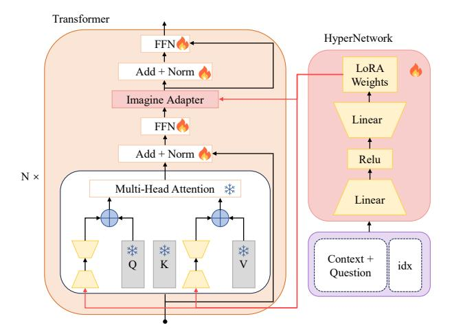

# 3.2 Explicit Awakening with Context Generator

To obtain the short dummy document *d*, we finetune a context generator 2 to utilize its knowledge in generating a compressed dummy document as symbolic context, thereby reducing input length. Simultaneously, we avoid dependence on a fixed knowledge base and minimize *knowledge corpus errors* by incorporating potentially useful context (Lee et al., 2023). Employing a knowledge distillation framework, the student model learns to generate the compressed text that the teacher model produces based on extensive context.

Specifically, for each data point  $\mathcal{D}_{\text{train}} = \{(q_i, a_i, c_i)\}_{i=1}^n$ , we apply the long-context compression method LongLLMLingua (Jiang et al., 2023) to the retrieved text  $c_i$ , resulting in the compressed text  $c'_i$ . As shown in the left part of Figure 2, subsequently, we fine-tune the context generator  $p_\theta$  with trainable parameters  $\theta$  to fully leverage its inherent knowledge for generating  $c'_i$ , which guides the model to think about its knowledge and generate a short dummy document. Our objective is to minimize the negative log-likelihood of the compressed text  $c'_i$  sequence given the specific

> **[图片提取文字 (无描述)]:**
> Transformer HyperNetwork FFN 6 LoRA Add + Norm Weights Imagine Adapter Linear FFN 6 Add + Norm 6 Relu N× Multi-Head Attention \*\* Linear \* \* Context + K Q idx Question

Figure 3: The Architecture of hypernetwork. Hypernetwork generates LoRA adapter weights for each question. During training, only Hypernetwork, FFN, and Norm weights are updated.

prompt p (B.2) and the question  $q_i$ .

$$\mathcal{L}_{ce} = -\frac{1}{n} \sum_{i=1}^{n} \log p_{\theta}(\boldsymbol{c'}_{i} \mid \boldsymbol{p}, \boldsymbol{q}_{i})$$
 (1)

This process enables LLMs to conceive compressed document that robustly parallels the question's knowledge requirements.

#### 3.3 Implicit Awakening with Hypernetwork

Generally speaking, richer context can help LLM better answer questions. That is, the representation of questions and the internal state of LLM when utilizing rich context are the better states. Therefore, in the absence of context, we should focus

&lt;sup>2We discuss the role of context generator in the A.2.

on building models to awaken LLM to achieve this better state and as a better QA model.

We utilize the hypernetwork3 to convert the question q and short dummy document d into a specific parameter-efficient LoRA module inserted into the LLM, serving as the parameter context for the question. This is akin to repeating the question in the prompt (Xu et al., 2023) and incorporating certain topical cues to stimulate the model's recall of relevant questions (Wang et al., 2023c). However, the distinction lies in the fact that they serve as wake-up features, whereas we are generating model parameters as knowledge awakening.

The hypernetwork architecture for generating LoRA weights is detailed in Figure 3. Specifically,  $D_k^q$  and  $U_k^q$  represent the low-rank down and up projections of layer k associated with the Query matrix  $W_Q$  in the attention module, while  $D_k^v$  and  $U_k^v$  correspond to those associated with the Value matrix  $W_{\mathcal{V}}$ . The hypernetwork, denoted as  $g_D$  and  $g_U$ , takes  $concat(f, i_k^{\{q,v\}})$  as input, where f is the feature vector obtained using the model's encoder and reduced in dimensionality via a whitening algorithm (Su, 2021). To achieve this whitening transformation, we first compute the mean of the vector  $\mu = \frac{1}{N} \sum_{i=1}^N x_i$  and center the data by subtracting  $\mu$  from each vector  $x_i$ . Next, we calculate the covariance matrix C of the centered vectors  $\tilde{x}_i = x_i - \mu$ , which is given by  $C = \frac{1}{N} \sum_{i=1}^{N} \tilde{x}_i \tilde{x}_i^T$ . We then perform Singular Value Decomposition (SVD) on the covariance matrix:  $C = U\Lambda U^T$ , where U contains the eigenvectors and  $\Lambda$  is a diagonal matrix of eigenvalues. The transformation matrix W is derived from the eigenvalue decomposition as  $W = U\Lambda^{-1/2}$ , where  $\Lambda^{-1/2}$  scales the eigenvectors by the inverse square root of their corresponding eigenvalues. Thus, applying the transformation  $\tilde{x}_i = (\tilde{x}_i)W$  not only centers the data around zero but also results in a covariance matrix that is equivalent to the identity matrix, ensuring that the transformed vectors are uncorrelated and have unit variance. The term  $idx_{k}^{\{q,v\}} \in \{0,\ldots,2\times\#\text{blocks}\}\ \text{signifies the po-}$ sitional embedding, differentiating between layers and  $\mathcal{QV}$ . Each hypernetwork is characterized by weights  $W_d$  and  $W_u$ , representing the down and up projections, respectively. The hypernetwork equations for  $D^{\{q,v\}}$  is expressed as follows:

$$f_i = \text{whitening}(\text{Encoder}(q_i; d_i))$$
 (2)

$$g(x) = W_u \cdot \text{ReLU}(W_d \cdot x) \tag{3}$$

$$D^{\{q,v\}} = g_D((f_i; idx_k^{\{q,v\}}))$$
 (4)

where Encoder represents the encoder of the model, whitening is a dimensionality reduction algorithm, ReLU is an activation function, and  $idx_k^q = 2k, idx_k^v = 2k+1$ .  $g_D$  and  $g_U$  represent the dimension reduction and dimension increase functions of the hypernetwork, respectively.

