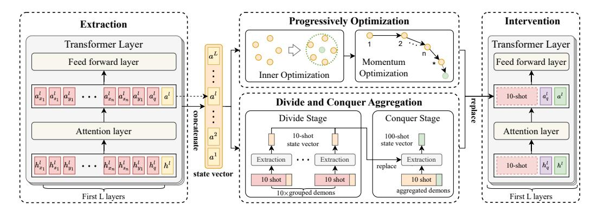
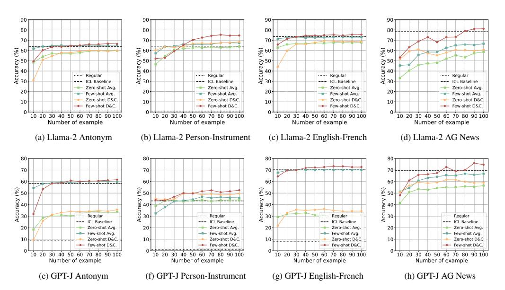
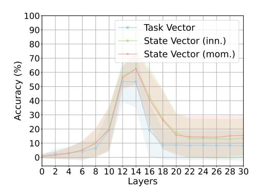
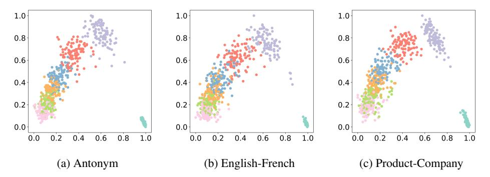
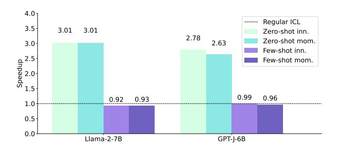

# 2 Related Work

Mechanistic Interpretability. Recent works have focused on the working mechanisms of ICL [\[Chan et al., 2022,](#page-9-4) [Xie et al., 2022,](#page-11-3) [Wang et al., 2023\]](#page-11-4). [Olsson et al.](#page-10-6) [\[2022\]](#page-10-6) argue that induction heads may be the mechanistic source of general ICL in transformers. [Akyürek et al.](#page-9-5) [\[2022\]](#page-9-5) show that transformer-based in-context learners can implicitly implement standard optimization algorithms on linear models. A mainstream assumption posits that ICL has a similarity with the gradient descent. [von Oswald et al.](#page-11-5) [\[2023\]](#page-11-5) demonstrate how a linear attention-only transformer model can perform a gradient descent-like procedure implicitly. [Dai et al.](#page-9-2) [\[2023\]](#page-9-2) compare standard gradient descent based fine-tuning and ICL, and figure out that the transformer attention of ICL exhibits a dual form of gradient descent-based optimization. Moreover, some works revisit and modify this theory on the layer causality dependence [\[Natan et al., 2023\]](#page-10-7) or training batch size [\[Shen et al., 2023\]](#page-10-8). In contrast, we focus on the application of the dual form of gradient descent and ICL and present optimization methods with inspiration from the dual form.

Task Representation. Numerous studies have extensively explored the concept of compressing various tasks into task representations as a means of effectively manipulating tasks within ICL ability. Notably, [Shao et al.](#page-10-9) [\[2023\]](#page-10-9) and [Mu et al.](#page-10-10) [\[2023\]](#page-10-10) have successfully yielded compositional task representations by training a composition model. In a slightly different vein, some researchers have delved into the art of devising methodologies to compose minor parameter adjustments acquired through task fine-tuning [\[Ilharco et al., 2022,](#page-9-6) [Panigrahi et al., 2023,](#page-10-11) [Yu et al., 2023,](#page-11-6) [Hu et al., 2024,](#page-9-7) [Merullo et al., 2023\]](#page-10-12). An alternative line of research finds that the task representation could be extracted in ICL [\[Liu et al., 2023b,](#page-10-1) [Hendel et al., 2023,](#page-9-3) [Todd et al., 2023,](#page-10-2) [Yang et al., 2023\]](#page-11-7). Different

from these approaches, our work avoids the need for additional training and focuses more on analysing why these compressed vectors work and how to improve their performance.

#### 3 Formalization

In this section, we first provide a detailed examination of attention activation which is found to contain the compressed ICL function by previous works [Hendel et al., 2023, Todd et al., 2023]. Then, we highlight its inherent similarities with parameters trained through gradient descent. Finally, we introduce the concept of the state vector drawing inspiration from these observations.

A classic template of ICL has the following necessary components: (1) N examples that are used to form the demonstrations and each example contains an input query  $\mathcal{X}$  and its corresponding label  $\mathcal{Y}$ . (2) Separate tokens  $\mathcal{S}$  that separate the input query and the label for each example (e.g.,  $\rightarrow$ ). (3) A query  $\mathcal{X}_q$  for prediction. With the above components, the contextual model input of ICL could be written as follows:

$$\mathcal{X}_1, \mathcal{S}, \mathcal{Y}_1, \mathcal{X}_2, \mathcal{S}, \mathcal{Y}_2, \cdots, \mathcal{X}_N, \mathcal{S}, \mathcal{Y}_N, \mathcal{X}_q, \mathcal{S}.$$

Here we analyse the attention activation of the last separate token. In the l-th transformer layer, the output activation  $\mathbf{a}^l$  of the attention heads of the last separate token is:

$$\mathbf{a}^{l} = W_{V}[X'; X] \operatorname{softmax} \left( \frac{(W_{K}[X'; X])^{T} \mathbf{q}}{\sqrt{d}} \right), \tag{1}$$

where X' denotes the hidden state of demonstrations, X denotes the hidden state of the query and the last separate token (called zero-shot input), q denotes the attention query vector of the last separate token, [X';X] denotes the matrix concatenation,  $\sqrt{d}$  is the scaling factor,  $W_K$  and  $W_V$  are parameter weight matrix.

Consistent with previous works [Dai et al., 2023, Natan et al., 2023], we omit the softmax operation and the scaling factor to approximate standard attention as relaxed linear attention for qualitative analysis. Consequently, the activation can be simplified as follows:

$$\mathbf{a}^{l} \approx W_{V}[X';X] \left(W_{K}[X';X]\right)^{T} \mathbf{q}$$

$$= \left(W_{V}X \left(W_{K}X\right)^{T} + W_{V}X' \left(W_{K}X'\right)^{T}\right) \mathbf{q}$$

$$= \left(W_{ZSL} + \sum_{i} \left(\left(W_{V}\mathbf{x}'_{i}\right) \otimes \left(W_{K}\mathbf{x}'_{i}\right)\right)\right) \mathbf{q}.$$
(2)

We define  $W_{\text{ZSL}} = W_V X \left(W_K X\right)^T$  as the initialized parameters since it is the attention result in the Zero-Shot Learning (ZSL) setting.

To draw a meaningful comparison between attention activation and parameters trained through gradient descent, we now shift our focus towards analyzing a simple linear transformation represented by  $\mathbf{y}_i = W\mathbf{x}_i$ . Given a loss function  $\mathcal{L}$  and the learning rate  $\eta$ , the gradient of linear weight is:

$$\nabla_{W} \mathcal{L}(\mathbf{y}_{i}) = \frac{\partial \mathcal{L}(\mathbf{y}_{i})}{\partial \mathbf{y}_{i}} \frac{\partial \mathbf{y}_{i}}{\partial W} = \nabla_{\mathbf{y}_{i}} \mathcal{L}(\mathbf{y}_{i}) \mathbf{x}_{i}^{T}.$$
(3)

Denoting the back-propagated errors as  $\mathbf{e}_i = -\eta \nabla_{\mathbf{y}_i} \mathcal{L}$ , we can get the full batch gradient with training examples:

$$\Delta W_{GD} = \sum_{i} \mathbf{e}_{i} \otimes \mathbf{x}_{i}', \tag{4}$$

where  $\mathbf{x}_i'$  is the input training examples. Hence, in the previous Eqn. 2, if we substitute  $W_K \mathbf{x}_i'$  as training examples, and take  $W_V \mathbf{x}_i' \approx \mathbf{e}_i$  corresponding to some meta gradients [Dai et al., 2023, Natan et al., 2023]. The activation can be written as:

$$\mathbf{a}^{l} = \left( W_{ZSL} + \sum_{i} \mathbf{e}_{i} \otimes W_{K} \mathbf{x}_{i}^{\prime} \right) \mathbf{q} = \left( W_{ZSL} + \Delta W_{GD} \right) \mathbf{q}. \tag{5}$$

Hence, it can be inferred that the output activation  $\mathbf{a}^l$  can be regarded as parameters trained via gradient descent which utilizes the demonstrations as training instances.

With the above dual form between activation and trained parameters, and in light of observations that transformers tend to learn the ICL function primarily in their first L layers [Wang et al., 2023], we have the following hypothesis: During the process of ICL, the first L layers progressively update the flow of information using each example in the demonstration through forward computation. The processing state of ICL is then stored within the activation of the attention head. The subsequent layers access and utilize the processing state to reinstate the ICL function, which is used implicitly for predicting the queries. Therefore we concatenate the activation in the initial L layers and introduce the notation of the state vector:

$$\mathcal{V}_N^L = \prod_{l=1}^L \mathbf{a}^l, \tag{6}$$

where L is the number of layers and N is the number of examples in the demonstration.  $\parallel$  denotes the concatenation operation. Note that we have a completely different construction strategy and usage compared to the function vector [Todd et al., 2023]. Although the task vector [Hendel et al., 2023] may be functionally equivalent in the forward process, the proposed state vector differs significantly in its integration into the model, making it easier and more effective to analyse and interpret.

#### 4 Method

> **[图片提取文字 (无描述)]:**
> **Progressively Optimization** Intervention Extraction Transformer Layer Transformer Layer Feed forward layer Feed forward layer Momentum Optimization Inner Optimization  $\left|a_{x_n}^l\right|a_{s_n}^l\left|a_{y_1}^l\right|\left|a_q^l\right|\left|a^l\right|$ 10-shot Divide and Conquer Aggregation Divide Stage Conquer Stage Attention layer Attention layer 10-shot 100-shot state vector state vector Extraction Extraction Extraction ...  $\left|h_{x_n}^l\right|\left|h_{s_n}^l\right|\left|h_{y_1}^l\right|\left|h_q^l\right|\left|h^l\right|$ 10-shot replace state vector 10 shot 10 shot 10 shot aggregated demons 10×grouped demons First L layers First L layers

Figure 1: The overall framework of the proposed state vector. The state vectors are extracted from the output activations of attention heads. These state vectors are progressively optimized by *inner optimization* and *momentum optimization*, or be aggregated through a *divide-and-conquer (D&C) aggregation*. Finally, the processed state vector is utilized to intervene the inference forward pass.

#### 4.1 Overview

As illustrated in Figure 1, our approach initially extracts the state vector from the attention head that corresponds to the final separate token in the first L layers using a demonstration and a dummy query. Then, with the view of treating the state vector as trained parameters, coupled with drawing inspiration from the model soup and the momentum-based gradient optimization algorithm, we introduce two methods that progressively optimize the state vector as test-time adaptation [Liang et al., 2023]: (1) inner optimization (§4.2) and (2) momentum optimization (§4.3). Moreover, we propose a divide-and-conquer (D&C) state vector aggregation method for efficiently compressing the ICL function in the multiple example setting (§4.4).

After the state vector optimization or aggregation, we utilize the processed state vector to intervene the model during the forward inference pass. In particular, we first input a test query in the zero-shot setting or with the demonstration in the few-shot setting. During the forward pass in the first L layers, we replace the attention activation of the last separate token with the corresponding activation in the state vector. In other words, the state vector is leveraged to intervene in the output of the first L transformer layers, blocking the attention of the last separate token to the previous context. With state vector intervention, the transformer learns the ICL function from the processing state stored in the state vector, and continues to make the prediction on the test query.

#### 4.2 Inner Optimization

Inspired by the works on the model soup [Wortsman et al., 2022, Chronopoulou et al., 2023] which show that weight-space averaging not only yields performance improvement but also often enhances robustness, we thus ask the following research question (**RQ1**): Is it possible to optimize our state vector using the model soup approach? To explore this question, we propose an inner optimization method to improve the effectiveness and robustness of state vector. Specifically, we not only extract the state vector in each separate token of the dummy query but also extract the state vector from each example. Formally, with a forward pass in an N shot ICL setting, we extract the N state vector  $\mathcal{V}_i^L$  ( $1 \le i \le N$ ) from last N separate token. Subsequently, we apply a uniform averaging process to these state vectors as follows:

$$\overline{\mathcal{V}}_{N}^{L} = \frac{1}{N} \sum_{i=1}^{N} \mathcal{V}_{i}^{L},\tag{7}$$

where  $\overline{\mathcal{V}}_N^L$  is the inner optimized state vector, which can be directly utilized for inference intervention or serves as the initial state vector for later momentum optimization.

#### 4.3 Momentum Optimization

Since we view the state vector as parameters trained gradually through demonstration examples, the difference between two state vectors with adjacent corresponding separate tokens can also be regarded as the influence of the middle example, akin to the gradient. Motivated by this understanding, coupled with extensive studies of the gradient optimization algorithm [Sutskever et al., 2013, Duchi et al., 2010, Loshchilov and Hutter, 2019], we direct our focus toward a simple momentum-based gradient optimization algorithm, seeking to answer the following research question (**RQ2**): *Can our state vector be optimized using momentum-based optimization algorithm?* To answer this question, we propose a momentum optimization. Formally, we first extract the influence of each example by subtracting two adjacent state vectors:

$$E_i^L = \mathcal{V}_i^L - \mathcal{V}_{i-1}^L,\tag{8}$$

where  $E_i^L$  is the influence of i-th  $(1 < i \le N)$  example in the early L layer. Then, we apply the momentum gradient optimization algorithm to obtain optimized influence  $\widetilde{E}_i^L$ , and add it to the last state vector:

$$\widehat{\mathcal{V}}_{N}^{L} = \overline{\mathcal{V}}_{N}^{L} + \widetilde{E}^{L} = \overline{\mathcal{V}}_{N}^{L} + \operatorname{opt}([E_{i}^{L}]_{i=1}^{N}), \tag{9}$$

where  $\widehat{\mathcal{V}}_N^L$  is the momentum optimized state vector and  $\overline{\mathcal{V}}_N^L$  is the inner optimized state vector.  $\mathtt{opt}(\cdot)$  denotes the momentum gradient optimization algorithm. We also explore various other gradient optimization algorithms in §6.1.

#### 4.4 Divide-and-Conquer Aggregation

In addition to optimizing the state vector to more effectively represent the ICL function from a small number of examples, we also explore its capacity to encapsulate multiple examples within a single vector. However, regular ICL can not be directly used on multiple examples due to the context length limitation of current LLMs. This leads us to investigate the following question (**RQ3**): Can we use the state vector to represent multiple examples that are unmanageable for regular ICL? To address this question, we propose a divide-and-conquer method for state vector aggregation. As depicted in Figure 1, our approach involves distinct aggregation processes (i.e. the divide stage and the conquer stage). In the divide stage, examples are randomly divided into groups, termed grouped demonstrations. Within each group, a random example is selected to serve as a dummy query, which allows us to extract a group-specific state vector. In the conquer stage, these dummy queries are paired with their corresponding labels to form input-label pairs. From these input-label pairs, we form an aggregated demonstration, add an additional dummy query, and subsequently extract the aggregated state vector. It is worth noting that during the forward pass of aggregated state vector extraction, we utilise the group-specific state vector to intervene the attention activation of the separate tokens of their corresponding examples. The divide and conquer approach allows us to aggregate the ICL function of each grouped demonstration into its respective group-specific state vector, and subsequently aggregate the ICL function of each group-specific state vector into a single, comprehensive aggregated state vector. This aggregated vector is then utilized for interventions during inference, similarly to the optimized state vector discussed in §4.2 and §4.3. Moreover, in the few-shot setting, the aggregated demonstrations are treated as inference demonstrations. The divide-and-conquer approach effectively circumvents the context-length constraints inherent in LLMs, thereby enabling a more effective and efficient aggregation of information across multiple examples.

### 5 Experiment

#### 5.1 Setup

We conduct the evaluation across 12 datasets that encompass different domains.

- Linguistics includes Antonym [\[Nguyen et al., 2017\]](#page-10-15), Capitalize, Present-Past, and Singular-Plural [\[Todd et al., 2023\]](#page-10-2), focusing on transformations in the form or meaning of words.
- Translation is represented by the English-French [\[Lample et al., 2018\]](#page-10-16) dataset, which involves translating English words into their French counterparts.
- Knowledge comprises Country-Capital [\[Todd et al., 2023\]](#page-10-2), AG News [\[Zhang et al., 2015\]](#page-11-8), Person-Sport, Person-Instrument, Person-Occupation, Product-Company, and Landmark-Country [\[Hernandez et al., 2023\]](#page-9-10), which are centred around question-to-answer mappings for commonsense knowledge queries.

We employ *Llama-2-7B* and *GPT-J-6B* as our LLMs, chosen for their moderate model sizes, opensource and capability for ICL. We also provide the results with larger models (i.e., Llama-2-13B) in the Appendix [H.](#page-15-0) We use Llama-2-7B as the default model unless otherwise specified. Our method is orthogonal to the choice of transformer-based decoder-only autoregressive LLMs.

For simplicity evaluation, we restrict to single-token output and use first output token accuracy as the evaluation metric as in previous work [\[Hendel et al., 2023,](#page-9-3) [Todd et al., 2023\]](#page-10-2).

#### 5.2 Baseline

In the paper, we compare with the following methods:

- Regular is the baseline for the zero-shot setting that uses only the given query as input, while ICL baseline [\[Wei et al., 2022\]](#page-11-0) makes predictions on the label by taking both the demonstrations and the given query.
- Function vector [\[Todd et al., 2023\]](#page-10-2) is extracted from attention activation using the causal mediation method and is then added to the hidden state of certain transformer layers during inference.
- Task vector [\[Hendel et al., 2023\]](#page-9-3) is extracted from the hidden state of the separate token and is leveraged for blocking the layer when inference.

### 5.3 Inner Optimization(RQ1)

As shown in Table [1,](#page-6-0) the performance of our inner optimized state vector has a significant improvement comparing the task vector and function vector in both zero-shot and few-shot settings. Our state vector with inner optimization. In the zero-shot setting, the inner optimization shows an average improvement of 10.2% on Llama-2 and 5.9% on GPT-J across six datasets. In the few-shot setting, the inner optimization also achieves a 1.2% improvement on Llama-2 and 1.7% on GPT-J. The improvement demonstrates the effectiveness of inner optimization. However, although state vector (inn.) outperforms task vector, its few-shot performance on some datasets is inferior to the ICL baseline. We attribute this primarily to the introduction of query information from examples. While inner optimization enhances task-relevant information for the state vector, it also introduces noise of other dummy queries, hindering the model's ability to focus on the current predictive query, thereby reducing performance. In addition to the performance improvements, our inner optimization approach also effectively alleviates the phenomenon of high variance in the original task vector in the zero-shot setting. In practical use, the performance of the task vector is influenced by demonstrations and dummy queries, leading to weaker robustness. Our proposed inner optimization approach effectively

| Model     | Method    |                     | Anym             | Eng-Fr           | Pers-Inst        | Pers-Occ         | Prod-Comp             | Land-Cout        | Average |
|-----------|-----------|---------------------|------------------|------------------|------------------|------------------|-----------------------|------------------|---------|
|           |           | Regular             | $1.0 \pm 0.2$    | $0.1 \pm 0.1$    | $0.0 \pm 0.0$    | $0.0\pm0.0$      | 0.4±0.2               | $0.0\pm0.0$      | 0.3     |
|           |           | Function vector     | 45.1±2.0         | $21.6 \pm 2.0$   | $11.3 \pm 10.7$  | $0.1 \pm 0.1$    | $25.6 \pm 4.3$        | $32.9 \pm 21.6$  | 22.8    |
|           | Zero-shot | Task vector         | 56.2±2.8         | $63.2 \pm 3.6$   | $61.8 \pm 8.4$   | $27.9 \pm 15.2$  | $55.5 \pm 20.1$       | $57.8 \pm 26.3$  | 53.7    |
|           |           | State vector (inn.) | $61.0 \pm 1.0$   | $66.5 \pm 2.2$   | $67.4 \pm 2.6$   | $42.7 \pm 4.2$   | $64.5 \pm 10.6$       | $81.0 \pm 1.7$   | 63.9    |
| Llama-2   |           | State vector (mom.) | 60.4±0.7         | $67.5 \pm 1.8$   | $68.7 \pm 1.6$   | $45.6 \pm 5.9$   | $71.3 \pm 3.6$        | $77.7 \pm 1.8$   | 65.2    |
| Liailia-2 |           | ICL baseline        | 64.8±4.8         | $74.3 \pm 0.8$   | $71.7 \pm 3.7$   | $56.1 \pm 2.7$   | $80.8 \pm 0.8$        | $87.0\pm0.3$     | 72.5    |
|           | Few-shot  | Function vector     | 54.5±0.9         | $65.2 \pm 1.4$   | $60.8 \pm 5.6$   | $54.2 \pm 2.2$   | $76.0\pm1.3$          | $84.2 \pm 2.9$   | 65.8    |
|           |           | Task vector         | 65.7±1.8         | $73.8 \pm 0.9$   | $66.6 \pm 5.2$   | $56.4 \pm 2.3$   | $81.9 \pm 1.8$        | $86.7 \pm 0.9$   | 71.8    |
|           |           | State vector (inn.) | <b>66.2</b> ±1.6 | <b>74.6</b> ±0.9 | $70.1 \pm 4.3$   | $57.0 \pm 2.2$   | <b>82.8</b> ±1.6      | $87.5 \pm 0.9$   | 73.0    |
|           |           | State vector (mom.) | 65.8±3.7         | $74.3 \pm 1.1$   | <b>74.9</b> ±2.9 | $58.2 \pm 0.4$   | $82.0 \pm 1.0$        | $87.6 \pm 0.3$   | 73.8    |
|           | Zero-shot | Regular             | $8.1 \pm 0.6$    | $7.2 \pm 0.6$    | $0.0 \pm 0.0$    | $0.0 \pm 0.0$    | $1.9\pm0.5$           | $0.9\pm0.2$      | 3.0     |
|           |           | Function vector     | 33.1±1.8         | $29.1 \pm 8.5$   | $4.1 \pm 5.8$    | $11.1 \pm 2.3$   | $46.3 \pm 5.7$        | $22.5 \pm 10.2$  | 24.4    |
|           |           | Task vector         | 23.6±3.8         | $32.2 \pm 5.1$   | $44.4 \pm 5.0$   | $28.3 \pm 18.6$  | $43.8 \pm 5.7$        | $41.3 \pm 12.3$  | 35.6    |
|           |           | State vector (inn.) | $33.4 \pm 1.9$   | $31.7 \pm 3.8$   | $49.3 \pm 2.0$   | $30.0 \pm 6.2$   | $42.8 \pm 4.3$        | $61.9 \pm 1.6$   | 41.5    |
| GPT-J     |           | State vector (mom.) | 31.1±1.0         | $35.1 \pm 2.4$   | $50.3 \pm 3.0$   | $42.4 \pm 1.5$   | $44.2 \pm 1.5$        | $60.3 \pm 0.9$   | 43.9    |
| GF 1-J    |           | ICL baseline        | 59.2±1.4         | 69.9±2.0         | 44.7±6.7         | 29.3±1.0         | $62.5\pm1.0$          | <b>69.3</b> ±0.5 | 55.8    |
|           | Few-shot  | Function vector     | 56.4±1.9         | $65.8 \pm 1.9$   | $49.1 \pm 2.2$   | $30.3 \pm 1.9$   | $58.5 \pm 3.3$        | $69.2 \pm 0.6$   | 54.9    |
|           |           | Task vector         | 58.5±1.6         | $70.6 \pm 1.2$   | $42.3 \pm 6.4$   | $27.8 \pm 3.3$   | $66.0 \pm 2.6$        | $63.1 \pm 5.3$   | 54.7    |
|           |           | State vector (inn.) | 58.7±2.2         | <b>70.9</b> ±1.3 | $46.5 \pm 4.9$   | $29.4 \pm 1.7$   | <b>66.3</b> $\pm$ 2.1 | $66.4 \pm 2.8$   | 56.4    |
|           |           | State vector (mom.) | <b>59.6</b> ±1.4 | $70.1 \pm 2.2$   | <b>51.9</b> ±2.4 | <b>30.4</b> ±1.1 | $63.8 \pm 0.8$        | $68.6 \pm 0.3$   | 57.4    |

Table 1: Performance of state vector optimization. The best results in the zero shot setting are in <u>underline</u> and the best results in the few shot setting are in **bold**. The result of basic state vector is mathematically <u>equivalent</u> to task vector. Note that we only present the results across six tasks here and leave the rest in the Appendix. We also report standard deviation and the results are passed with significance test (p < .05).

> **[图片提取文字 (无描述)]:**
> 90 90 80 80 80 80 70 70 70 Accuracy (%) 05 05 05 06 06 06 06 06 06 06 06 06 06 06 06 06 € 60 € 60 § 60 Accuracy ( Accuracy 05 05 05 05 Accuracy 05 06 07 ····· Regular Regular ····· Regular ····· Regular ICL Baseline ICL Baseline ICL Baseline ICL Baseline Zero-shot Avg Zero-shot Avg. Zero-shot Ava. Zero-shot Avg. 20 20 20 20 Few-shot Avg. Few-shot Avg Few-shot Avg. Few-shot Avg Zero-shot D&C. Zero-shot D&C. Zero-shot D&C Zero-shot D&C. 10 10 10 10 Few-shot D&C. Few-shot D&C. Few-shot D&C. Few-shot D&C. 10 20 30 40 50 60 70 80 90 100 10 20 30 40 50 60 70 80 90 100 10 20 30 40 50 60 70 80 90 100 10 20 30 40 50 60 70 80 90 100 Number of example Number of example Number of example Number of example (a) Llama-2 Antonym (b) Llama-2 Person-Instrument (c) Llama-2 English-French (d) Llama-2 AG News 80 70 70 60 60 60 60 Accuracy (%) € 50 € 50 € 50 Accuracy ( Accuracy ( Accuracy ( Regular Regular ICL Baseline ICL Baseline ICL Baseline ICL Baseline 20 20 20 20 Zero-shot Ava. Zero-shot Ava. Zero-shot Ava. Zero-shot Avq Few-shot Avg. Few-shot Avg - Few-shot Avg Few-shot Avg 10 Zero-shot D&C. Zero-shot D&C 10 Zero-shot D&C Zero-shot D&C Few-shot D&C. Few-shot D&C. Few-shot D&C. Few-shot D&C. 30 40 50 60 70 80 90 100 10 20 30 40 50 60 70 80 90 100 10 20 30 40 50 60 70 80 90 100 30 40 50 60 70 80 90 100 Number of example Number of example Number of example Number of example (e) GPT-J Antonym (f) GPT-J Person-Instrument (g) GPT-J English-French (h) GPT-J AG News

Figure 2: Performance of aggregation across number of examples. Avg. denotes the average aggregation baseline and D&C. denotes the divide-and-conquer aggregation. The  $\mathbf{X}$  axis represents the number of examples, and the  $\mathbf{Y}$  axis represents the accuracy.

mitigates this issue, similarly motivated as the model averaging method, thereby enhancing the robustness of the state vector.

#### 5.4 Momentum Optimization (RQ2)

As depicted in Table 1, building upon the inner optimized state vector, our proposed momentum optimization algorithm further enhances the effectiveness of the state vector, achieving the best performance on average in all settings. In the zero-shot setting, the momentum optimization boosts the performance of the inner-optimized state vector with an average increase of 1.3% on Llama-2 and 2.4% on GPT-J. In the few-shot setting, state vector with momentum optimization achieves a 0.8% average increase on Llama-2 and 1.0% on GPT-J. This reveals the effectiveness of our momentum optimization. With the combination of inner optimization and momentum optimization, our state

| Method               | Zero-shot                     | Few-shot                       |
|----------------------|-------------------------------|--------------------------------|
| ICL baseline         | $0.2 \pm 0.4$                 | $71.0 \pm 10.8$                |
| Task vector          | $52.9 {\scriptstyle\pm 9.4}$  | $68.5 \pm {\scriptstyle 10.5}$ |
| State vector (mom.)  | $65.2 \scriptstyle{\pm}~10.2$ | $72.2 \scriptstyle{\pm 10.6}$  |
| State vector (adag.) | $11.7 \pm$ 12.0               | $16.1 \pm {\scriptstyle 10.2}$ |
| State vector (rms.)  | $0.8 \pm 0.9$                 | $1.5 \pm 1.0$                  |
| State vector (adam.) | $6.7 \pm 6.1$                 | $10.6 \pm 8.5$                 |
|                      |                               |                                |

Table 2: Performance comparison of gradient optimization algorithms. The method means the optimization algorithm applied to the opt( $\cdot$ ) in Eqn. 9.

> **[图片提取文字 (无描述)]:**
> Task Vector State Vector (inn.) State Vector (mom.) Accuracy (%) 10 12 14 16 18 20 22 24 26 28 30 Layers

Figure 3: Average zero-shot performance across six datasets for each choice of the intermediate layer L. The solid line means the average value, while the shaded area indicates the standard deviation.

vector (mom.) surpasses the original variant, showcasing a remarkable improvement of 11.5% for Llama-2 and 8.3% for GPT-J in the zero-shot setting. In the few-shot setting, our state vector (mom.) still outperforms the task vector with a 2.0% improvement for Llama-2 and 2.7% for GPT-J. Furthermore, without inputting demonstration during inference, the state vector (mom.) achieves an impressive 90% ICL performance on Llama-2 and 78% ICL performance on GPT-J. When compared to ICL with the same examples as the demonstration, state vector (mom.) outperforms ICL in both Llama-2 and GPT-J. These improvements verify the effectiveness of our progressive optimization strategy. Note that applying momentum optimization directly to task vectors does not yield average improvements across tasks in our preliminary experiment. We speculate that this inconsistency stems from the poor robustness of the task vectors, which hinders the stable optimization by momentum optimization and leads to poor performance in some tasks.

#### 5.5 Divide-and-Conquer Aggregation (RQ3)

In this experiment, we explore the performance of D&C state vector aggregation across varying numbers of examples. Besides the regular and ICL baseline mentioned, we introduce average aggregation as a strong baseline. This approach first extracts state vectors from the example group and subsequently employs their mathematical average for aggregation. We compare our D&C aggregation method with the baseline ranging from 10 to 100 examples across two models. Due to limited computational resources, we were not able to do an exhaustive search over all datasets. Thus, we only present the results for four tasks.

As illustrated in the Figure 2, both the D&C aggregation and average aggregation exhibit similar trends in both few-shot and zero-shot settings. The performance of both aggregation methods initially falls short of the ICL baseline. However, their performance boosts when examples increase. The initial poor performance can be attributed to the limited number of state vectors. Additionally, although the performance of the D&C aggregation initially falls behind that of the average aggregation, it exhibits a more substantial performance improvement when examples increase, ultimately outperforming average aggregation in the multiple example setting, highlighting the efficiency of D&C aggregation.

### 6 Analysis

#### 6.1 Ablation with Other Optimization Methods

We present an ablation study to investigate various classical gradient optimization algorithms, aiming to delve deeper into the inner state vector optimization. We compare the momentum-based gradient optimization algorithm with following additional first-order gradient optimization algorithms: Adagrad (adag.) [Duchi et al., 2010], RMSprop (rms.) [Graves, 2013] and Adam(adam.) [Kingma and Ba, 2015]. As shown in Table 2, we observe a significant decrease in state vector performance with first-order gradient optimization algorithms, unlike with momentum-based optimization. This outcome indicates a discrepancy between the state vector and updated parameters with gradient

> **[图片提取文字 (无描述)]:**
> 1.0 1.0 1.0 8.0 0.8 8.0 0.6 0.6 0.6 0.4 0.4 0.4 0.2 0.2 0.2 0.0 0.0 0.0 0.2 0.4 0.6 0.8 1.0 0.0 0.4 0.6 0.8 1.0 0.0 0.2 0.4 0.6 0.8 1.0 (b) English-French (c) Product-Company (a) Antonym

Figure 4: The 2D PCA visualization of the state vector in the Antonym ,English-French and Product-Company task, where each color represents the state vector corresponding to examples occupying specific positions in the demonstration and the outlier is the first order.

descent. It suggests that the current first-order gradient optimization algorithms may not be optimally effective for state vector optimization. Due to computational constraints, we were not able to do an exhaustive search over all hyper-parameters.

#### 6.2 Layer Selection

We investigate the impact of layer selection on the extraction of state vectors in transformer models. We evaluate the average performance across different datasets in the zero-shot setting, as illustrated in Figure [3.](#page-7-1) Our results reveal a dual-phase trend: initially, increasing the number of layers for state vector extraction improves performance, but this improvement reverses beyond the 14th layer. We correlate this with the dynamics of ICL function processing in transformers in line with previous works [\[Voita et al., 2019,](#page-11-9) [Wang et al., 2023\]](#page-11-4). In the initial layers, transformers are primarily engaged in learning and encapsulating the ICL function within state vector, where additional layers enhance the richness of the functional information in the state vector. In contrast, the later layers prioritize applying this learned information for prediction tasks. Here, additional layers tend to introduce noise, especially from predicted labels of dummy queries, which may negatively impact performance.

#### 6.3 Qualitative Study

We provide the visualization by Principal Component Analysis (PCA) of the original state vector in the Antonym, English-French and Product-Company task. As depicted in Figure [4,](#page-8-0) we have three observations: (1) State vectors corresponding to the examples occupying the same position tend to form distinct clusters. This clustering pattern suggests a high degree of similarity among state vectors within each example position, despite different contexts. (2) A notable separation is evident between the state vectors originating from the first example and other position examples. This demarcation implies that ICL may begin to effectively function with a few examples. (3) An interesting trend is observable in the movement of these clusters as the example position increases. This trend may be indicative of an accumulation of task-specific information, where each additional example contributes to a more nuanced understanding of the model. These findings suggest a progressive enhancement in the ability of model to internalize and reflect the subtleties of the task at hand. Moreover, these observations reflect the efficacy of momentum optimization to leverage the observed clustering trend.

### 7 Conclusion

In this paper, we reveal that ICL compressed vector can be viewed as parameters trained through gradient descent on the demonstrations. Then, we introduce the concept of state vector coupled with two optimization methods to enhance the capability of ICL and conduct comprehensive experiments across two popular LLMs and multiple tasks to support our claim. Furthermore, our approach demonstrates the ability to compress context while maintaining lower variance. In the future, we aim to extend our methods to more complex ICL scenarios and apply them to larger LLMs and call for more nuanced and realistic studies of ICL.

### References

- Ekin Akyürek, Dale Schuurmans, Jacob Andreas, Tengyu Ma, and Denny Zhou. What learning algorithm is in-context learning? investigations with linear models. *ArXiv preprint*, abs/2211.15661, 2022.
- Tom B. Brown, Benjamin Mann, Nick Ryder, Melanie Subbiah, Jared Kaplan, Prafulla Dhariwal, Arvind Neelakantan, Pranav Shyam, Girish Sastry, Amanda Askell, Sandhini Agarwal, Ariel Herbert-Voss, Gretchen Krueger, Tom Henighan, Rewon Child, Aditya Ramesh, Daniel M. Ziegler, Jeffrey Wu, Clemens Winter, Christopher Hesse, Mark Chen, Eric Sigler, Mateusz Litwin, Scott Gray, Benjamin Chess, Jack Clark, Christopher Berner, Sam McCandlish, Alec Radford, Ilya Sutskever, and Dario Amodei. Language models are few-shot learners. In *Advances in Neural Information Processing Systems 33: Annual Conference on Neural Information Processing Systems 2020, NeurIPS 2020, December 6-12, 2020, virtual*, 2020.
- Stephanie Chan, Adam Santoro, Andrew K. Lampinen, Jane Wang, Aaditya Singh, Pierre H. Richemond, James L. McClelland, and Felix Hill. Data distributional properties drive emergent in-context learning in transformers. In *Advances in Neural Information Processing Systems 35: Annual Conference on Neural Information Processing Systems 2022, NeurIPS 2022*, 2022.
- Alexandra Chronopoulou, Matthew Peters, Alexander Fraser, and Jesse Dodge. AdapterSoup: Weight averaging to improve generalization of pretrained language models. In *Findings of the Association for Computational Linguistics: EACL 2023*, pages 2054–2063, 2023.
- Damai Dai, Yutao Sun, Li Dong, Yaru Hao, Shuming Ma, Zhifang Sui, and Furu Wei. Why can GPT learn in-context? language models secretly perform gradient descent as meta-optimizers. In *Findings of the Association for Computational Linguistics: ACL 2023*, pages 4005–4019, 2023.
- Tri Dao, Daniel Y. Fu, Stefano Ermon, Atri Rudra, and Christopher Ré. Flashattention: Fast and memory-efficient exact attention with io-awareness. In Sanmi Koyejo, S. Mohamed, A. Agarwal, Danielle Belgrave, K. Cho, and A. Oh, editors, *Advances in Neural Information Processing Systems 35: Annual Conference on Neural Information Processing Systems 2022, NeurIPS 2022, New Orleans, LA, USA, November 28 - December 9, 2022*, 2022.
- Qingxiu Dong, Lei Li, Damai Dai, Ce Zheng, Zhiyong Wu, Baobao Chang, Xu Sun, Jingjing Xu, and Zhifang Sui. A survey for in-context learning. *ArXiv preprint*, abs/2301.00234, 2023.
- John C. Duchi, Elad Hazan, and Yoram Singer. Adaptive subgradient methods for online learning and stochastic optimization. In *COLT 2010 - The 23rd Conference on Learning Theory, Haifa, Israel, June 27-29, 2010*, pages 257–269, 2010.
- Alex Graves. Generating sequences with recurrent neural networks. *ArXiv*, abs/1308.0850, 2013.
- Roee Hendel, Mor Geva, and Amir Globerson. In-context learning creates task vectors. *ArXiv preprint*, abs/2310.15916, 2023.
- Evan Hernandez, Arnab Sharma, Tal Haklay, Kevin Meng, Martin Wattenberg, Jacob Andreas, Yonatan Belinkov, and David Bau. Linearity of relation decoding in transformer language models. *ArXiv preprint*, abs/2308.09124, 2023.
- Xinshuo Hu, Dongfang Li, Zihao Zheng, Zhenyu Liu, Baotian Hu, and Min Zhang. Separate the wheat from the chaff: Model deficiency unlearning via parameter-efficient module operation. In *Proc. of AAAI*, 2024.
- Gabriel Ilharco, Marco Tulio Ribeiro, Mitchell Wortsman, Suchin Gururangan, Ludwig Schmidt, Hannaneh Hajishirzi, and Ali Farhadi. Editing models with task arithmetic. *ArXiv preprint*, abs/2212.04089, 2022.
- Diederik P. Kingma and Jimmy Ba. Adam: A method for stochastic optimization. In *International Conference on Machine Learning*, 2015.

- Woosuk Kwon, Zhuohan Li, Siyuan Zhuang, Ying Sheng, Lianmin Zheng, Cody Hao Yu, Joseph Gonzalez, Hao Zhang, and Ion Stoica. Efficient memory management for large language model serving with pagedattention. In Jason Flinn, Margo I. Seltzer, Peter Druschel, Antoine Kaufmann, and Jonathan Mace, editors, *Proceedings of the 29th Symposium on Operating Systems Principles, SOSP 2023, Koblenz, Germany, October 23-26, 2023*, pages 611–626. ACM, 2023. doi: 10.1145/ 3600006.3613165.
- Guillaume Lample, Alexis Conneau, Marc'Aurelio Ranzato, Ludovic Denoyer, and Hervé Jégou. Word translation without parallel data. In *International Conference on Machine Learning*, 2018.
- Jian Liang, Ran He, and Tieniu Tan. A comprehensive survey on test-time adaptation under distribution shifts. *ArXiv preprint*, abs/2303.15361, 2023.
- Pengfei Liu, Weizhe Yuan, Jinlan Fu, Zhengbao Jiang, Hiroaki Hayashi, and Graham Neubig. Pre-train, prompt, and predict: A systematic survey of prompting methods in natural language processing. *ACM Computing Surveys*, 55(9):1–35, 2023a.
- Sheng Liu, Lei Xing, and James Zou. In-context vectors: Making in context learning more effective and controllable through latent space steering. *ArXiv preprint*, abs/2311.06668, 2023b.
- Ilya Loshchilov and Frank Hutter. Decoupled weight decay regularization. In *International Conference on Machine Learning*, 2019.
- Jack Merullo, Carsten Eickhoff, and Ellie Pavlick. Language models implement simple word2vecstyle vector arithmetic. *ArXiv preprint*, abs/2305.16130, 2023.
- Jesse Mu, Xiang Lisa Li, and Noah D. Goodman. Learning to compress prompts with gist tokens. *ArXiv preprint*, abs/2304.08467, 2023.
- Tomer Bar Natan, Gilad Deutch, Nadav Magar, and Guy Dar. In-context learning and gradient descent revisited. *ArXiv preprint*, abs/2311.07772, 2023.
- Kim Anh Nguyen, Sabine Schulte im Walde, and Ngoc Thang Vu. Distinguishing antonyms and synonyms in a pattern-based neural network. In *Proceedings of the 15th Conference of the European Chapter of the Association for Computational Linguistics: Volume 1, Long Papers*, pages 76–85, 2017.
- Catherine Olsson, Nelson Elhage, Neel Nanda, Nicholas Joseph, Nova DasSarma, Tom Henighan, Ben Mann, Amanda Askell, Yuntao Bai, Anna Chen, Tom Conerly, Dawn Drain, Deep Ganguli, Zac Hatfield-Dodds, Danny Hernandez, Scott Johnston, Andy Jones, Jackson Kernion, Liane Lovitt, Kamal Ndousse, Dario Amodei, Tom Brown, Jack Clark, Jared Kaplan, Sam McCandlish, and Chris Olah. In-context learning and induction heads. *ArXiv preprint*, abs/2209.11895, 2022.
- Abhishek Panigrahi, Nikunj Saunshi, Haoyu Zhao, and Sanjeev Arora. Task-specific skill localization in fine-tuned language models. In *International Conference on Machine Learning*, 2023.
- Ning Qian. On the momentum term in gradient descent learning algorithms. *Neural Networks*, 12(1): 145–151, 1999.
- Nan Shao, Zefan Cai, Hanwei Xu, Chonghua Liao, Yanan Zheng, and Zhilin Yang. Compositional task representations for large language models. In *International Conference on Learning Representations*, 2023.
- Lingfeng Shen, Aayush Mishra, and Daniel Khashabi. Do pretrained transformers really learn in-context by gradient descent? *ArXiv preprint*, abs/2310.08540, 2023.
- Ilya Sutskever, James Martens, George E. Dahl, and Geoffrey E. Hinton. On the importance of initialization and momentum in deep learning. In *Proc. of ICML*, volume 28 of *JMLR Workshop and Conference Proceedings*, pages 1139–1147, 2013.
- Eric Todd, Millicent Li, Arnab Sen Sharma, Aaron Mueller, Byron C. Wallace, and David Bau. Function vectors in large language models. *ArXiv preprint*, abs/2310.15213, 2023.
- Hugo Touvron, Louis Martin, and Kevin R. Stone et al. Llama 2: Open foundation and fine-tuned chat models. *ArXiv preprint*, abs/2307.09288, 2023.

- Elena Voita, Rico Sennrich, and Ivan Titov. The bottom-up evolution of representations in the transformer: A study with machine translation and language modeling objectives. In *Proc. of EMNLP*, pages 4396–4406, 2019.
- Johannes von Oswald, Eyvind Niklasson, E. Randazzo, João Sacramento, Alexander Mordvintsev, Andrey Zhmoginov, and Max Vladymyrov. Transformers learn in-context by gradient descent. In *International Conference on Machine Learning*, 2023.
- Ben Wang and Aran Komatsuzaki. GPT-J-6B: A 6 Billion Parameter Autoregressive Language Model. <https://github.com/kingoflolz/mesh-transformer-jax>, 2021.
- Lean Wang, Lei Li, Damai Dai, Deli Chen, Hao Zhou, Fandong Meng, Jie Zhou, and Xu Sun. Label words are anchors: An information flow perspective for understanding in-context learning. In *Proceedings of the 2023 Conference on Empirical Methods in Natural Language Processing, EMNLP 2023, Singapore, December 6-10, 2023*, pages 9840–9855, 2023.
- Jason Wei, Yi Tay, Rishi Bommasani, Colin Raffel, Barret Zoph, Sebastian Borgeaud, Dani Yogatama, Maarten Bosma, Denny Zhou, Donald Metzler, Ed H. Chi, Tatsunori Hashimoto, Oriol Vinyals, Percy Liang, Jeff Dean, and William Fedus. Emergent abilities of large language models. *Trans. Mach. Learn. Res.*, 2022, 2022.
- Mitchell Wortsman, Gabriel Ilharco, Samir Yitzhak Gadre, Rebecca Roelofs, Raphael Gontijo Lopes, Ari S. Morcos, Hongseok Namkoong, Ali Farhadi, Yair Carmon, Simon Kornblith, and Ludwig Schmidt. Model soups: averaging weights of multiple fine-tuned models improves accuracy without increasing inference time. In *International Conference on Machine Learning, ICML 2022, 17-23 July 2022, Baltimore, Maryland, USA*, volume 162 of *Proceedings of Machine Learning Research*, pages 23965–23998, 2022.
- Sang Michael Xie, Aditi Raghunathan, Percy Liang, and Tengyu Ma. An explanation of in-context learning as implicit bayesian inference. In *International Conference on Machine Learning*, 2022.
- Jiaxi Yang, Binyuan Hui, Min Yang, Binhua Li, Fei Huang, and Yongbin Li. Iterative forward tuning boosts in-context learning in language models. *ArXiv preprint*, abs/2305.13016, 2023.
- Le Yu, Yu Bowen, Haiyang Yu, Fei Huang, and Yongbin Li. Language models are super mario: Absorbing abilities from homologous models as a free lunch. *ArXiv preprint*, abs/2311.03099, 2023.
- Xiang Zhang, Junbo Jake Zhao, and Yann LeCun. Character-level convolutional networks for text classification. In Corinna Cortes, Neil D. Lawrence, Daniel D. Lee, Masashi Sugiyama, and Roman Garnett, editors, *Advances in Neural Information Processing Systems 28: Annual Conference on Neural Information Processing Systems 2015, December 7-12, 2015, Montreal, Quebec, Canada*, pages 649–657, 2015.

## A Implementation Details

In this paper, we use random sampling to create subsets for each dataset. Each subset consists of 10 instances for demonstrations and one instance for a dummy query since we employ a 10-shot as the default ICL setting. The remaining instances are split into test and development sets with a 7:3 ratio. For experiments with multiple examples, we sample 100 instances instead of 10. We use "→" as the separate token similar to previous works. We tried other tokens but no significant difference. All the experiments are reported over 5 random seeds. The inference mechanism with state vector we describe in [§4.1](#page-3-1) has a key hyper-parameter (i.e.the layer L). Previous studies [\[Hendel et al., 2023\]](#page-9-3) have shown that the choice of L has an influence on performance. We find the best layer for different tasks via the accuracy of the development set. For the inner optimization in [§4.2,](#page-4-0) we choose the last seven state vectors to optimize. This is because the early state vectors yield subpar performance, primarily due to limitations in the available examples. For the momentum optimization, we choose 0.5 as the retention rate for historical momentum from the options of 0.25, 0.5 and 0.75. We run all the experiments on a single NVIDIA A100 80G GPUs. Each of our experiments consumes between 10 minutes to 8 hours of GPU time, depending on the dataset.

### B More Details about Baseline

In this section, we present an in-depth and comprehensive analysis of two baselines (i.e. task vector [\[Hendel et al., 2023\]](#page-9-3) and function vector [\[Todd et al., 2023\]](#page-10-2)). Furthermore, we offer a more nuanced comparison with our proposed state vector, highlighting the distinct differences and advantages of our approach.

The task vector is designed to extract the ICL function from a specific layer's hidden state within the transformer model. This is achieved by directly replacing the corresponding hidden state during inference for intervention. On the other hand, [Todd et al.](#page-10-2) [\[2023\]](#page-10-2) first extracts the ICL function from the output activations across all attention heads in all transformer layers. These activations are then prioritized based on their causal effect, quantified by the variance in the model's output space with or without individual activation interventions. The mathematical average of the top 10 causal effect activations is the function vector, which is subsequently added to the hidden state of a specific layer during the inference stage.

In contrast to these methods, our approach for state vector extraction focuses on procuring the ICL procession state from the output activations of the attention heads within the first L layers. During inference, we replace the corresponding activations with optimized ones. While functionally equivalent to the forward process of the task vector when disregarding state vector optimization (i.e., the vanilla state vector), our approach offers enhanced mechanical explainability. This is attributable to its motivation from the dual form of in-context learning and gradient decay, as explicated in previous work [\[Dai et al., 2023,](#page-9-2) [Natan et al., 2023\]](#page-10-7). Furthermore, inspired by the dual form, we focus on the further optimization process. On the other hand, unlike the function vector which extracts activations based on the causal effects resulting from individual interventions, our method is rooted in the underlying mechanisms of ICL. This strategy not only improves mechanical explainability but also demonstrates greater performance as evidenced by extensive experiments. Experiments also show notably poor performance of the function vector on certain knowledge-based datasets, such as Person-Occupation.

### C More Details about Datasets

Here, we describe in detail the tasks that we use to evaluate the state vectors.

- Antonym [\[Nguyen et al., 2017\]](#page-10-15) contains 2398 word pairs that are antonyms of each other (e.g. "massive" → "tiny"). We apply the dataset processed version from the function vector [\[Todd et al., 2023\]](#page-10-2). They filter the word pairs where both words can be tokenized as a single token.
- Capitalize [\[Todd et al., 2023\]](#page-10-2) contains 813 word pairs that capitalize the first letter of the given input word (e.g. "plan" → "Plan").
- Present-Past [\[Todd et al., 2023\]](#page-10-2) contains 293 word pairs, where simple past tense verbs are output when given simple present tense verbs (e.g. "adapt" → "adapted").

> **[图片提取文字 (无描述)]:**
> 4.01 Regular ICL 3.5 3.01 3.01 Zero-shot inn. 2.78 Zero-shot mom. 3.0 2.63 Few-shot inn. 2.5 2.0 2.0 1.5 Few-shot mom. 0.99 0.96 0.92 0.93 1.0 0.5 0.0 Llama-2-7B GPT-J-6B

Figure 5: Time efficiency analysis of Llama-2-7B and GPT-J-6B. Inn denotes our state vector with inner optimization. Mom denotes our state vector with momentum optimization

- **Singular-Plural** [Todd et al., 2023] contains 205 word pairs, where the plural form of a given singular word (e.g., "wallet" → "wallets").
- English-French [Lample et al., 2018] contains 4698 pairs of words, which consists of a word in English and its translation into French (e.g., "circle" → "cercle"). We apply the processed version from the function vector[Todd et al., 2023].
- Country-Capital [Todd et al., 2023] contains 197 instances, which output the name of the capital city of the given country (e.g. "Luanda"  $\rightarrow$  "Angola").
- AG News [Zhang et al., 2015] contains 7600 instances. Each instance contains the news headlines and the first few sentences of an article as input, and output corresponding labels include Business, Science, Sports, and World.
- **Person-Sport** [Hernandez et al., 2023] contains 318 instances. Each instance contains the name of a professional athlete and the sport that they play (e.g. "Hank Aaron" → "basketball").
- Person-Instrument [Hernandez et al., 2023] contains 510 instances. Each instance contains
  the name of a professional musician and the instrument they play (e.g. "Tom Fletcher" →
  "guitar").
- Person-Occupation [Hernandez et al., 2023] contains 821 instances. Each instance contains
  the name of a well-known individual and their occupation (e.g. "Tom Fletcher" → "guitar").
- **Product-Company** [Hernandez et al., 2023] contains 522 instances. Each instance contains the name of a commercial product and the company that sells the product (e.g. "Tom Fletcher" → "guitar").
- Landmark-Country [Hernandez et al., 2023] contains 836 instances. Each instance contains the name of a landmark and the country in which it is located.

### D Efficiency Analysis

In this section, we present an efficiency analysis of two proposed optimization methods. We evaluate the average inference time using 1000 test data on a single NVIDIA A100 (80G) GPU, covering six main datasets and 10 random seeds per dataset. The results are illustrated in Figure 5. In the zero-shot setting, we compress the ICL function into the state vector which eliminates the need to concatenate demonstrations during inference. As shown in the Figure 5, the proposed inner optimization and momentum optimization, which, while tripling the inference speed, achieve 89% of the regular ICL performance on Llama-2-7B and 78% on GPT-J-6B (see Table 1 in the paper). In the few-shot setting, the proposed inner optimization and momentum optimization achieve better results than standard ICL at the cost of a minimal loss in inference speed (e.g., 99% and 96%). Moreover, our method is orthogonal to attention speedup techniques, such as flash attention [Dao et al., 2022] and page attention [Kwon et al., 2023]. Therefore, our approach can also benefit from the achievements of these works and achieve further efficiency improvement. We leave the exploration of alternative enhancement as future work.

| Prompt                                                      | Llama-2   | +SV       |
|-------------------------------------------------------------|-----------|-----------|
| What instrument did X play?                                 | 8.7± 0.7  | 67.3± 2.8 |
| Can you tell me which musical instrument was played by X?   | 25.1± 0.7 | 69.0± 4.3 |
| What was the primary instrument of X in their music career? | 17.3± 1.4 | 70.3± 2.9 |

Table 3: Text portability of momentum optimized state vector. The templates are provided with "X" replaced by a query word. "+SV" denotes adding momentum optimized state vector

| English-French |                                               |
|----------------|-----------------------------------------------|
| Prompt         | What is the meaning of biography?             |
| Llama-2        | A written account of someone's life.          |
| + state vector | It is biographie.                             |
| Antonym        |                                               |
| Prompt         | When I think of upright, I think of           |
| Llama-2        | I think of a person who is standing up        |
| + state vector | for what they believe in. I think of down. |

Table 4: Natural prompt cases with momentum optimized state vector on Antonym task and English-French task.

