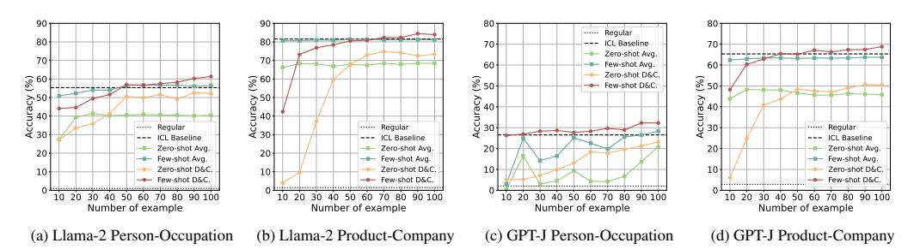
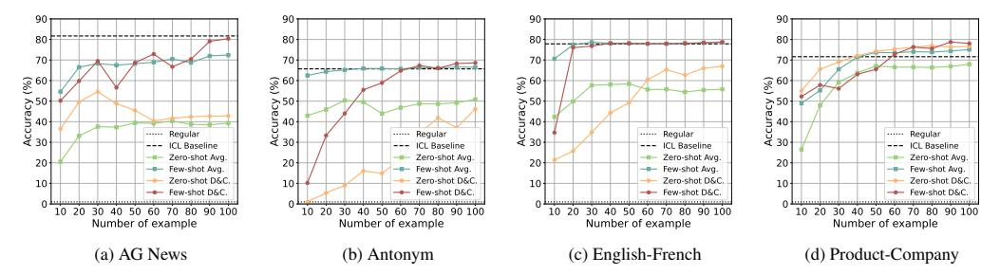
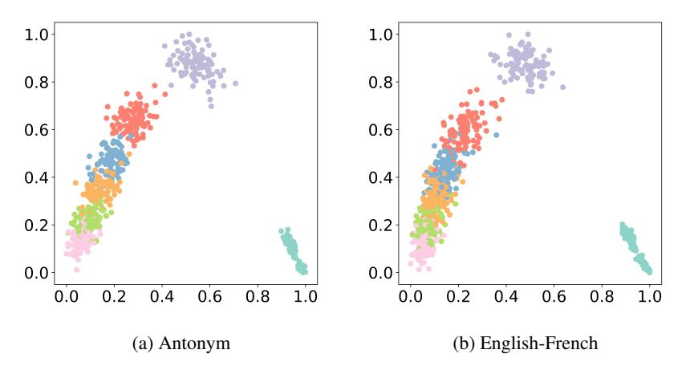
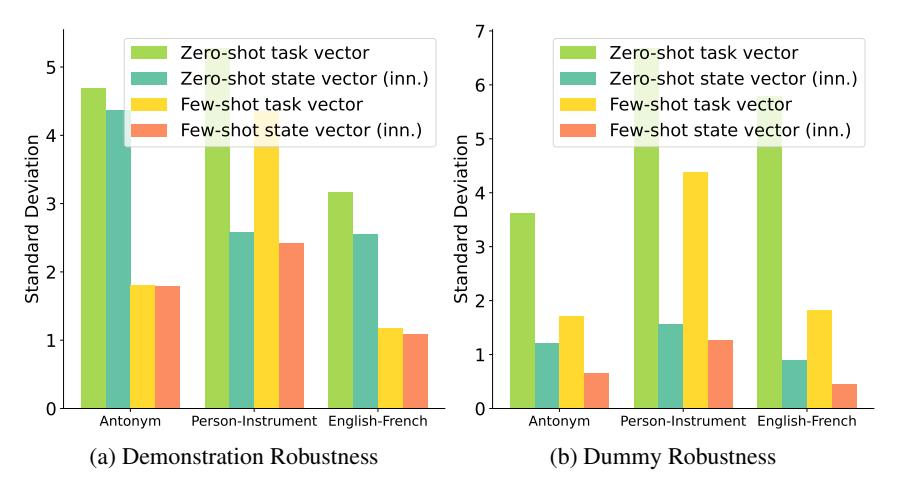

# G Full Result

In this section, we provide the additional result with llama-2-7B GPT-J model. We first present the main result of optimization on the other six tasks except the main result, and the average performance across all tasks. As shown in Table [5,](#page-15-1) our inner optimization and momentum optimization effectively enhance the state vector.

Moreover, we provide the result of state vector aggregation on two additional datasets. As shown in Figure [6,](#page-15-2) the trends of both D\$C and average aggregation follow a similar pattern to the main result shown in Figure [2](#page-6-1) as the number of examples increases, illustrating the effectiveness of our aggregation methods.

| Model   | Method    |                     | Capitalize       | Country-Capital  | Present-Past     | Singular-Plural  | Person-Sport   | AG News               | Average (All) |
|---------|-----------|---------------------|------------------|------------------|------------------|------------------|----------------|-----------------------|---------------|
| Llama-2 |           | Regular             | $0.0 \pm 0.0$    | $0.0 \pm 0.0$    | $0.0 \pm 0.0$    | $0.0 \pm 0.0$    | $0.0 \pm 0.0$  | $0.0 \pm 0.0$         | 0.2           |
|         |           | Function vector     | $98.6 \pm 0.4$   | $67.4 \pm 20.7$  | $80.2 \pm 4.5$   | $94.2 \pm 0.6$   | $1.4 \pm 0.5$  | $57.7 \pm 0.9$        | 44.7          |
|         | Zero-shot | Task vector         | 92.9±6.5         | $92.8 \pm 2.8$   | $95.2 \pm 1.7$   | $95.3\pm1.9$     | $86.9 \pm 4.5$ | $47.8 \pm 1.3$        | 69.4          |
|         |           | State vector (inn.) | $99.6 \pm 0.4$   | $94.0\pm1.3$     | $96.5 \pm 1.2$   | $97.1 \pm 1.0$   | $89.7 \pm 3.2$ | $52.0 \pm 5.5$        | 76.0          |
|         |           | State vector (mom.) | 99.1±0.3         | $94.5 \pm 0.7$   | $96.5 \pm 0.7$   | $96.6 \pm 1.0$   | $88.1 \pm 2.6$ | $50.0 \pm 8.3$        | 76.3          |
|         |           | ICL baseline        | <b>99.9</b> ±0.1 | 95.2±1.0         | 98.3±0.6         | 98.5±0.1         | 94.8±0.2       | 76.0±5.7              | 83.1          |
|         |           | Function vector     | $99.7 \pm 0.1$   | $82.2 \pm 3.8$   | $94.6 \pm 1.7$   | $97.3 \pm 0.7$   | $88.4 \pm 1.9$ | <b>80.7</b> $\pm$ 4.6 | 78.1          |
|         | Few-shot  | Task vector         | 98.0±1.0         | $92.9 \pm 3.4$   | $98.2 \pm 0.5$   | $98.5 \pm 1.3$   | $95.4 \pm 0.4$ | $64.3 \pm 8.4$        | 81.5          |
|         |           | State vector (inn.) | 99.7±0.1         | $94.4 \pm 1.3$   | $98.3 \pm 0.6$   | $98.5 \pm 0.4$   | $95.2 \pm 0.2$ | $76.0 \pm 8.5$        | 83.3          |
|         |           | State vector (mom.) | 99.3±0.1         | $94.9 \pm 0.7$   | <b>98.3</b> ±0.6 | <b>98.8</b> ±0.3 | $95.7 \pm 0.2$ | $76.3 \pm 5.9$        | 83.8          |
|         | Zero-shot | Regular             | $0.3 \pm 0.1$    | 1.8± 1.7         | $19.4 \pm 2.1$   | $22.7 \pm 2.9$   | $0.0 \pm 0.0$  | $0.0 \pm 0.0$         | 5.2           |
|         |           | Function vector     | $66.3 \pm 8.4$   | $57.0 \pm 9.9$   | $63.1 \pm 2.1$   | $69.3 \pm 2.1$   | $0.8 \pm 1.1$  | $46.4 \pm 4.5$        | 37.4          |
| GPT-J   |           | Task vector         | 51.0±4.7         | $31.6 \pm 4.8$   | $37.0\pm5.3$     | $61.6 \pm 1.2$   | $46.4 \pm 4.0$ | $55.0 \pm 3.7$        | 41.4          |
|         |           | State vector (inn.) | 58.2±1.3         | $45.5 \pm 8.3$   | $47.3\pm2.0$     | $61.9 \pm 0.7$   | $51.7 \pm 1.8$ | $59.7 \pm 5.4$        | 47.8          |
|         |           | State vector (mom.) | 58.6±0.8         | $52.9 \pm 6.1$   | $45.9 \pm 0.2$   | $62.5 \pm 0.7$   | $51.4 \pm 1.4$ | $61.3 \pm 4.8$        | 49.7          |
|         |           | ICL regular         | 99.3±0.3         | 88.2±3.4         | 96.9±0.9         | 99.3±0.5         | 82.4±3.5       | 76.3±1.7              | 73.1          |
|         | Few-shot  | Function vector     | $98.6 \pm 0.6$   | $78.6 \pm 5.1$   | $90.8 \pm 1.3$   | $95.9 \pm 0.9$   | $81.6 \pm 1.4$ | $72.7 \pm 3.2$        | 70.6          |
|         |           | Task vector         | 99.3±0.3         | $89.8 \pm 2.8$   | $97.3 \pm 1.0$   | $99.3 \pm 0.5$   | $83.3 \pm 3.6$ | $63.3 \pm 8.7$        | 71.7          |
|         |           | State vector (inn.) | <b>99.4</b> ±0.3 | $89.2 \pm 3.6$   | $97.3 \pm 0.8$   | $99.3 \pm 0.5$   | $83.8 \pm 3.5$ | $75.7 \pm 1.2$        | 73.6          |
|         |           | State vector (mom.) | <b>99.4</b> ±0.2 | <b>90.1</b> ±3.5 | <b>97.6</b> ±0.9 | <b>99.4</b> ±0.3 | 83.7±3.0       | <b>78.0</b> ±2.2      | 74.4          |

Table 5: Performance of state vector optimization across other six tasks and average performance of all task. The best results in the zero shot setting are in <u>underline</u> and the best results in the few shot setting are in **bold**. The result of basic state vector is mathematically equivalent to task vector.

> **[图片提取文字 (无描述)]:**
> Regular 80 --- ICL Baseline 701 70 Zero-shot Ava. 70 Few-shot Avq. 60+ 60 Zero-shot D&C. € 60 € 60 £ 50 - Few-shot D&C. Accuracy 30 Accuracy 80 80 80 ---- Regular Regular ····· Regular \*\*\*\*\*\* --- ICL Baseline ICL Baseline --- ICL Baseline Zero-shot Avq. Zero-shot Avq. Zero-shot Avg. 20 20 - Few-shot Avg. -- Few-shot Ava. -- Few-shot Avg. Zero-shot D&C. Zero-shot D&C. 10 10 Zero-shot D&C. 10 Few-shot D&C. - Few-shot D&C. -- Few-shot D&C. 10 20 30 40 50 60 70 80 90 100 30 40 50 60 70 80 90 100 10 20 30 40 50 60 70 80 90 100 10 20 30 40 50 60 70 80 90 100 Number of example Number of example Number of example Number of example (a) Llama-2 Person-Occupation (c) GPT-J Person-Occupation (d) GPT-J Product-Company (b) Llama-2 Product-Company

Figure 6: Performance of aggregation across number of examples. Avg. denotes the average aggregation baseline and D&C. denotes the divide-and-conquer aggregation. The **X** axis represents the number of examples, and the **Y** axis represents the accuracy.

#### **H** Result on Larger Model

In this section, we provide the optimization and aggregation results on the larger model. Here we choose Llama-2-13B as its memory requirements suit our hardware conditions. We present the result of the optimization method on three representative datasets shown in Table 6, and the result of the aggregation method on four representative datasets shown in Figure 7. The result shows that our inner and momentum optimization and D&C aggregation method could also benefit the state vector on the larger model setting.

#### I Qualitative Study

In Figure 8, we present a Principal Component Analysis (PCA) visualization of the original state vector in GPT-J, applied to both the Antonym task and the English-French translation task. Note that the cluster distributions observed in GPT-J closely mirror those of Llama-2. This similarity indicates a consistent and progressive enhancement in the model capacity, as originally identified in Llama-2 in §6.3, which is also shown on GPT-J. Such findings demonstrate the broad applicability and generalizability of our momentum optimization approach across different models.

### J Robustness Analysis

In this appendix, we examine the robustness of the state vector with inner optimization. Specifically, we evaluate the task vector and the inner optimized state vector on the Llama-2 dataset, focusing on three tasks. We measure and report the performance standard deviation using 100

| Model         |           | Method              | Antonym        | English-French | Person-Instrument                    | Average     |
|---------------|-----------|---------------------|----------------|----------------|--------------------------------------|-------------|
|               |           | Regular             | $1.2 \pm 0.7$  | $0.2 \pm 0.2$  | $0.0 \pm 0.0$                        | 0.5         |
|               | Zero-shot | Function vector     | $47.1 \pm 1.6$ | $23.2 \pm 4.3$ | $0.1 \pm 0.1$                        | 23.5        |
|               |           | Task vector         | $46.0 \pm 2.4$ | $43.1 \pm 7.2$ | $58.2 \pm 6.3$                       | 49.1        |
|               |           | State vector (inn.) | $47.0 \pm 1.2$ | $50.5 \pm 1.9$ | $66.6 \pm 3.1$                       | 54.7        |
| Llama-2-13B   |           | State vector (mom.) | $47.9 \pm 1.1$ | $55.9 \pm 3.4$ | $68.5 \pm 2.0$                       | <u>57.4</u> |
| Liailia-2-13B | Few-shot  | ICL baseline        | $67.0\pm0.1$   | $74.5 \pm 1.3$ | $75.0 \pm 0.2$                       | 72.2        |
|               |           | Function vector     | $65.7 \pm 1.7$ | $75.2 \pm 2.6$ | $72.2 \pm 0.4$                       | 71.3        |
|               |           | Task vector         | $64.8 \pm 1.2$ | $70.5 \pm 3.5$ | $70.6 \pm 3.1$                       | 68.6        |
|               |           | State vector (inn.) | $65.5 \pm 0.8$ | $75.8 \pm 1.6$ | $77.0 \pm 1.3$                       | 72.8        |
|               |           | State vector (mom.) | $65.9 \pm 0.7$ | $75.6 \pm 0.4$ | $\textbf{78.6} \!\pm\! \textbf{1.1}$ | 73.4        |

Table 6: Performance of state vector optimization across three tasks on llama-2-13B. The best results in the zero shot setting are in <u>underline</u> and the best results in the few shot setting are in **bold**. The result of basic state vector is mathematically equivalent to task vector.

> **[图片提取文字 (无描述)]:**
> 80 80 80 70 70 70 € 60 € 60 § 60 § 60 40 Accuracy 30 Accuracy 00 00 00 00 50 Aug 40 50 40 AC 30 A 30 ---- Regular ---- Regular ····· Regular ····· Regular --- ICL Baseline --- ICL Baseline --- ICL Baseline --- ICL Baseline Zero-shot Ava. Zero-shot Avg. -- Zero-shot Avq. Zero-shot Avq. 20 20 20 20 -- Few-shot Avg. Few-shot Avq. -- Few-shot Avg. -- Few-shot Avg. Zero-shot D&C. Zero-shot D&C. Zero-shot D&C. Zero-shot D&C. 10 10 10 10 - Few-shot D&C. - Few-shot D&C. Few-shot D&C. - Few-shot D&C. 10 20 30 40 50 60 70 80 90 100 10 20 30 40 50 60 70 80 90 100 10 20 30 40 50 60 70 80 90 100 10 20 30 40 50 60 70 80 90 100 Number of example Number of example Number of example Number of example (c) English-French (d) Product-Company (a) AG News (b) Antonym

Figure 7: Performance of aggregation on Llama-2-13B across number of examples. Avg. denotes the average aggregation baseline and D&C. denotes the divide-and-conquer aggregation. The **X** axis represents the number of examples, and the **Y** axis represents the accuracy.

diverse demonstrations or dummy queries. As illustrated in Figure 9, our analysis yields three key observations:

- The task vector and state vector exhibit greater sensitivity to dummy queries than to demonstrations. This finding suggests that dummy queries have a greater impact on performance compared to demonstrations, underscoring the importance of reducing the noise from dummy queries to enhance state vector performance.
- In the few-shot setting, both the task vector and the state vector (inn.) indicate significantly greater robustness compared to their performance in the zero-shot setting. There is a noticeable reduction in the standard deviation across diverse demonstrations or dummy queries when applying demonstrations during ICL inference. This improvement may be attributed to the richer ICL function information provided by demonstrations, which in turn bolsters performance stability.
- Compared to the task vector, our inner optimized state vector shows markedly enhanced robustness to the variations in demonstrations and dummy queries, in both zero-shot and few-shot settings. This highlights the effectiveness of our proposed inner optimization in improving the robustness of the state vector.

#### **K** Limitation

The definition of state vectors is contingent upon specific assumptions and lacks a rigorous theoretical foundation, which may impact its generalizability and reliability across different NLP tasks. Additionally, the experiments were conducted on a limited scale with moderate-sized models and datasets. These constraints may affect the applicability of the results to larger models or more complex datasets. Further research will explore these aspects to establish a more robust validation of the proposed methods.

> **[图片提取文字 (无描述)]:**
> 1.0 1.0 0.8 8.0 0.6 0.6 0.4 0.4 0.2 0.2 0.0 0.0 1.0 8.0 0.0 0.2 0.4 0.6 0.0 0.2 0.4 0.6 8.0 1.0 (b) English-French (a) Antonym

Figure 8: The 2D PCA visualization of the state vector in the Antonym task and English-French task of **GPT-J**, where each color represents the state vector corresponding to examples occupying specific positions in the demonstration and the outlier is of the first order.

> **[图片提取文字 (无描述)]:**
> Zero-shot task vector Zero-shot task vector 5 Zero-shot state vector (inn.) Zero-shot state vector (inn.) 6 Few-shot task vector Few-shot task vector Few-shot state vector (inn.) Few-shot state vector (inn.) Standard Deviation Standard Deviation Person-Instrument English-French Person-Instrument English-French Antonym Antonym (a) Demonstration Robustness (b) Dummy Robustness

Figure 9: Standard deviation of performance on Llama-2 across three datasets.