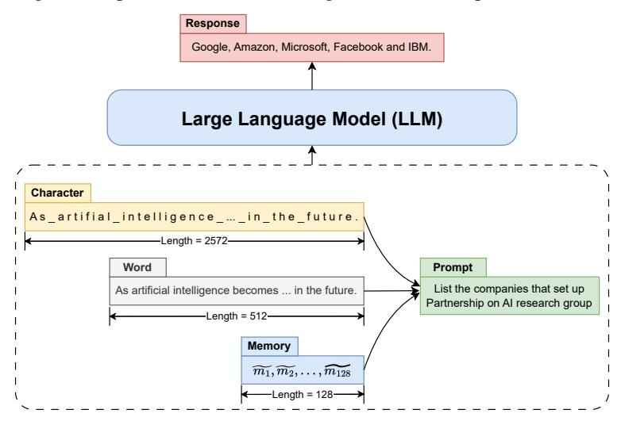
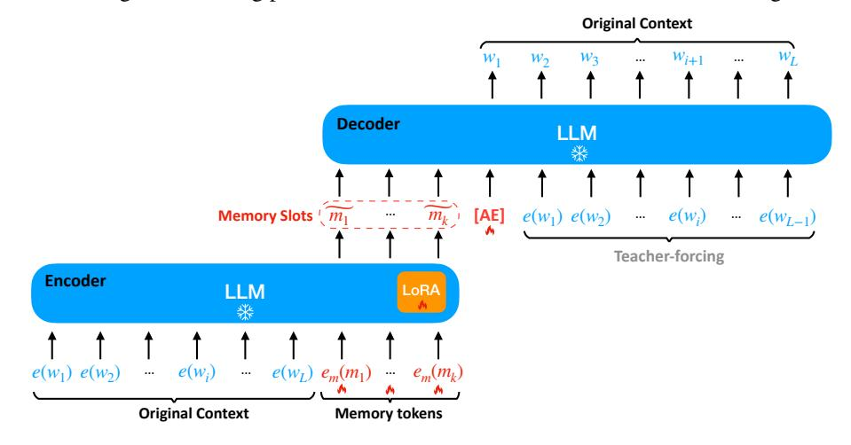

# 1 INTRODUCTION

Long context modeling is a fundamental challenge for Transformer-based [\(Vaswani et al.,](#page-11-0) [2017\)](#page-11-0) LLMs due to their inherent self-attention mechanism. Much previous research [\(Child et al.,](#page-9-0) [2019;](#page-9-0) [Beltagy et al.,](#page-9-1) [2020;](#page-9-1) [Rae et al.,](#page-10-0) [2019;](#page-10-0) [Choromanski et al.,](#page-9-2) [2020;](#page-9-2) [Bulatov et al.,](#page-9-3) [2022;](#page-9-3) [Zheng et al.,](#page-11-1) [2022;](#page-11-1) [Wu et al.,](#page-11-2) [2022;](#page-11-2) [Bulatov et al.,](#page-9-4) [2023;](#page-9-4) [Ding et al.,](#page-9-5) [2023\)](#page-9-5) attempts to tackle the long context issue through architectural innovations of an LLM. While they approach long context with a significant reduction in computation and memory complexity, they often struggle to overcome the notable decline

∗Correspondence to Tao Ge [\(sggetao@gmail.com\)](mailto:sggetao@gmail.com)

† Internship at Microsoft Research

in performance on long contexts, as highlighted by [Liu et al.](#page-10-1) [\(2023\)](#page-10-1). In contrast to these efforts, we approach the long context problem from a novel angle – context compression.

> **[图片提取文字 (无描述)]:**
> Response Google, Amazon, Microsoft, Facebook and IBM. Large Language Model (LLM) Character As artifial intelligence ... in the future. -Length = 2572-Prompt Word List the companies that set up As artificial intelligence becomes ... in the future. Partnership on Al research group -Length = 512-Memory  $\widetilde{m_1},\widetilde{m_2},\ldots,\widetilde{m_{128}}$ -Length = 128-

Figure 2: Various context lengths (e.g., 2572 chars, 512 words, 128 memory slots) serve the same function when conditioned on by an LLM for responding to the given prompt.

Context compression is motivated by the fact that a text can be represented in different lengths in an LLM while conveying the same information. As shown in Figure [2,](#page-1-0) if we use characters to represent the text, it will have a length of 2,572; if we represent it using (sub-)words, we only need a context length of 512 without affecting the response accuracy. So, is there a more compact representation allowing us to achieve the same goal with a shorter context?

We explore this problem and propose the ICAE which leverages the power of an LLM to achieve high compression of contexts. The ICAE consists of 2 modules: a learnable encoder adapted from the LLM with LoRA [\(Hu et al.,](#page-10-2) [2021\)](#page-10-2) for encoding a long context into a small number of memory slots, and a fixed decoder, which is the LLM itself where the memory slots representing the original context are conditioned on to interact with prompts to accomplish various goals, as illustrated in Figure [1.](#page-0-0)

We first pretrain the ICAE using both autoencoding (AE) and language modeling (LM) objectives so that it can learn to generate memory slots from which the decoder (i.e., the LLM) can recover the original context or perform continuation. The pretraining with massive text data enables the ICAE to be well generalized, allowing the resulting memory slots to represent the original context more accurately and comprehensively. Then, we fine-tune the pretrained ICAE on instruction data for practical scenarios by enhancing its generated memory slots' interaction with various prompts. We show the ICAE (based on Llama) learned with our pretraining and fine-tuning method can effectively produce memory slots with 4× context compression. We highlight our contributions as follows:

- We propose In-context Autoencoder (ICAE) a novel approach to context compression by leveraging the power of an LLM. The ICAE either enables an LLM to express more information with the same context length or allows it to represent the same content with a shorter context, thereby enhancing the model's ability to handle long contexts with improved latency and memory cost during inference. Its promising results and its scalability may suggest further research efforts in context management for an LLM, which is orthogonal to other long context modeling studies and can be combined with them to further improve the handling of long contexts in an LLM.
- In addition to context compression, ICAE provides an access to probe how an LLM performs memorization. We observe that extensive self-supervised learning (e.g., autoencoding) in the pretraining phase is very helpful to enhance the ICAE's capability to encode the original context into compressed memory slots. This pretraining process may share some analogies with humans enhancing their memory capacity through extensive memory training, which improves the brain's memory encoding capabilities [\(Ericsson et al.,](#page-9-6) [1980;](#page-9-6) [Engle et al.,](#page-9-7) [1999;](#page-9-7) [Maguire et al.,](#page-10-3) [2003\)](#page-10-3). We also show that an LLM's memorization pattern is highly similar to humans (see Table [2](#page-5-0) and Table [3\)](#page-5-1). All these results imply a novel perspective on the connection between working memory in cognitive science [\(Baddeley,](#page-9-8) [1992\)](#page-9-8) and representation learning in LLMs (i.e., context window).

### 2 In-context Autoencoder

#### 2.1 Model Architecture

Like a typical autoencoder (Kramer, 1991), ICAE consists of an encoder and a decoder. Similar to the design of Gisting (Mu et al., 2023) and AutoCompressor (Chevalier et al., 2023), the ICAE performs both the encoding and decoding processes in an in-context manner, as illustrated in Figure 3.

> **[图片提取文字 (无描述)]:**
> **Original Context**  $W_{i+1}$ W3 Decoder LLM \*  $\widetilde{m_k}$ Memory Slots  $(m_1)$  $w e(w_{L-1})$  $e(w_1) \ e(w_2)$ [AE]  $e(w_i)$ ••• Teacher-forcing **Encoder** LLM LoRA  $e(w_i)$  $\cdots$   $e(w_L)$   $e_m(m_1)$   $\cdots$   $e_m(m_k)$  $e(w_1) \ e(w_2)$ **Original Context** Memory tokens

Figure 3: The encoder of the ICAE is a LoRA-adapted LLM, which is used for encoding the original context  $c = (w_1, w_2, \ldots, w_L)$  into a few memory slots  $(\widetilde{m_1}, \ldots, \widetilde{m_k})$ . The decoder of the ICAE is the target LLM itself that can condition on the memory slots produced by the encoder for various purposes (e.g., the autoencoding task as in this figure).  $e(\cdot)$  denotes the word embedding lookup in the target LLM and  $e_m(\cdot)$  denotes the learnable embedding lookup of memory tokens that are used for producing memory slots. "[AE]" is a special token to indicate the autoencoding pretraining task.

Given the intuition, we propose to use a LoRA-adapted LLM as the encoder of the ICAE, as illustrated in Figure 3. When encoding a context  $c = (w_1, \ldots, w_L)$  with the length L, we first append k (k << L) memory tokens  $(m_1, \ldots, m_k)$  to the context c to obtain their outputs  $(\widetilde{m_1}, \ldots, \widetilde{m_k})$  as the memory slots for the context c. Therefore, the ICAE encoder is very lightweight – it only adds a LoRA adapter and an embedding lookup for memory tokens compared with the target LLM.

As introduced above, we expect the memory slots  $(\widetilde{m_1}, \ldots, \widetilde{m_k})$  to be conditioned on by the target LLM on behalf of the original context c. Therefore, we use the untouched target LLM as the decoder of the ICAE to ensure the compatibility of memory slots within the target LLM.

### 2.2 Pretraining

#### 2.2.1 Autoencoding

Like a typical autoencoder, one of the ICAE's pretraining objectives is to restore the original input text c of the length L from its produced memory slots  $(\widetilde{m_1}, \ldots, \widetilde{m_k})$  of the length k:

$$\mathcal{L}_{\text{AE}} = \max_{\widetilde{m_1}, \dots, \widetilde{m_k}} P(\boldsymbol{c} | \widetilde{m_1}, \dots, \widetilde{m_k}; \Theta_{LLM}) = \max_{\Theta_{LORA}, e_m} P(\boldsymbol{c} | m_1 \dots m_k; \Theta_{LLM}, \Theta_{LORA}, e_m)$$

To indicate the autoencoding task, we append a special token "[AE]" to  $(\widetilde{m_1}, \ldots, \widetilde{m_k})$  in the decoder, as Figure 3 shows. As this pretraining objective does not need any extra annotation, we can use massive text data to train the In-context Autoencoder.

### 2.2.2 Text Continuation

While autoencoding pretraining offers a straightforward learning objective to encode a context, its inherent simplicity and exclusive focus on the single objective may lead to suboptimal generalization. To address this issue, we incorporate an additional objective during the pretraining phase: text continuation, as illustrated in Figure 7 in Appendix A. This self-supervised task is widely acknowledged to facilitate the learning of more generalizable representations in language models:

$$\mathcal{L}_{\text{LM}} = \max_{\widetilde{m_1}, \dots, \widetilde{m_k}} P(\boldsymbol{o} | \widetilde{m_1}, \dots, \widetilde{m_k}; \Theta_{LLM}) = \max_{\Theta_{LoRA}, e_m} P(\boldsymbol{o} | m_1 \dots m_k; \Theta_{LLM}, \Theta_{LoRA}, e_m)$$

where o = (wL+1, . . . , wL+N ) denotes the continuation of context c. This objective helps improve generalization and circumvent excessive reliance on, and overfitting to, the autoencoding task.

