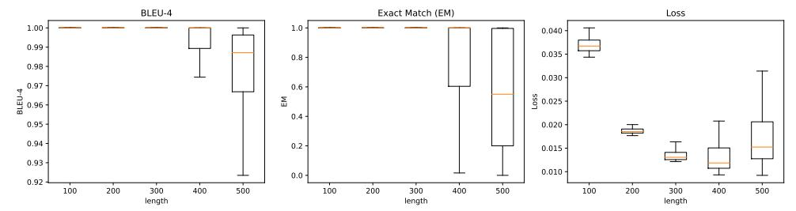
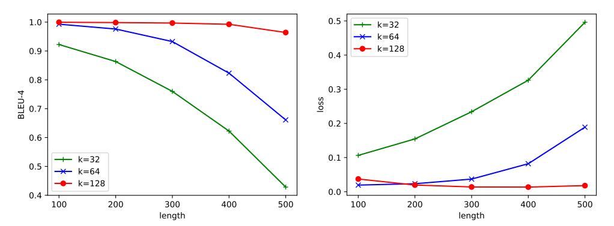

# 3 EXPERIMENTS

### 3.1 EXPERIMENTAL SETTING

Data We pretrain the ICAE with the Pile [\(Gao et al.,](#page-9-10) [2020\)](#page-9-10). For instruction fine-tuning, we use the PWC dataset, as introduced in Section [2.3,](#page-3-1) which contains 240k (context, prompt, response) samples for training and 18k samples for testing. The context length distribution of test samples is shown in Figure [10.](#page-14-0) By default, the maximal token length (excluding memory slots) we set during training is 512 in both the ICAE's encoder and decoder in our experiments.

Model Configuration We use the LlaMa [\(Touvron et al.,](#page-10-7) [2023a](#page-10-7)[;b\)](#page-11-5) as the target LLM to test the ICAE's performance in context compression. For the encoder of the ICAE, LoRA is applied to the query and value projections of the LLM's multi-head attention. In our default setting, the memory slot length k is set to 128, and the LoRA rank r is set to 128 unless otherwise specified. The resulting ICAE only adds about 1% learnable parameters on top of the target LLM.

### 3.2 RESULTS

### 3.2.1 PRETRAINED ICAE

We first evaluate the autoencoding performance of the pretrained ICAE (without instruction finetuning) using the following three metrics to understand how well it restores the original context from its produced memory slots: BLEU [\(Papineni et al.,](#page-10-8) [2002\)](#page-10-8), Exact-Match (EM)[2](#page-3-2) and cross entropy loss.

Figure [4](#page-4-0) presents the autoencoding results of the ICAE based on the Llama-7b. The ICAE demonstrates a very low overall loss, below 0.05, indicating that the produced memory slots retain almost all the information of the original context. When the context length is within 300, the ICAE can almost perfectly reconstruct the original context, achieving nearly 100% BLEU and EM scores. As the context length increases beyond 400, both BLEU and EM scores start to decline, indicating insufficient capacity of the 128-length memory slots. However, even at a context length of 500, the median BLEU remains over 0.98, and the median EM approaches 0.6 (e.g., perfectly reconstructing about the first 300 words of a 512-token context), showing remarkable performance of ICAE.

We then analyze the effect of the memory size k on the result. According to Figure [5,](#page-4-1) as the memory slot length k decreases, the ICAE's ability to memorize longer samples significantly deteriorates.

1Despite some (prompt, response) datasets such as Self-Instruct [\(Wang et al.,](#page-11-6) [2022\)](#page-11-6), most of their samples either have no context or very short contexts, which are not suitable for evaluation in our setting. Therefore, we establish the PWC dataset with the help of the GPT-4 [\(OpenAI,](#page-10-9) [2023\)](#page-10-9). We include the details in Appendix [C.](#page-12-2)

2EM denotes the proportion of the exact matching prefix length to the total length. For a context of 512 tokens, if its first 256 tokens are perfectly restored but its 257th token is not, the EM score is 256/512 = 0.5.

> **[图片提取文字 (无描述)]:**
> BLEU-4 Loss Exact Match (EM) 1.00 0.040 -0.99 0.035 0.8 -0.98 -0.030 0.97 -0.6 0.96 -S 0.025 M 0.4 0.95 -0.020 0.94 0.2 -0.015 -0.93 -0.010 0.0 0.92 500 100 200 300 400 500 100 200 300 400 500 100 200 300 400 length length length

Figure 4: Autoencoding results of the ICAE based on the Llama-7b with memory length k=128. The horizontal axis represents the original context length of test examples. For example, the horizontal axis value of 100 refers to the test examples with context lengths ranging from 95 to 105.

> **[图片提取文字 (无描述)]:**
> 0.5 -1.0 -+- k=32 → k=64 → k=128 0.9 -0.4 0.8 -0.3 -BLEU-4 loss 0.7 -0.2 0.6 -0.1 k=32 0.5 k=64 ◆ k=128 0.0 -0.4 200 300 400 300 400 500 100 500 100 200 length length

Figure 5: BLEU and loss at different memory slot lengths k.

Compared to k=128 where the BLEU score can still reach over 95% at a context length of 500, the BLEU scores become much less satisfactory for k values of 64 and 32, indicating an inability to losslessly retain the original context. This observation is also evident from the loss curve, suggesting that achieving over  $4\times$  compression is rather challenging.

Table 1: Text continuation evaluation for the pretrained ICAE. Similar to the autoencoding evaluation, a higher compression ratio tends to result in more pronounced losses in language modeling.

| Context length                     | Text Continuation         |                           |       |  |  |
|------------------------------------|---------------------------|---------------------------|-------|--|--|
| Context length                     | PPL (w/ original context) | PPL (w/ 128 memory slots) | Δ     |  |  |
| 128→128 (1×)                       | 9.99                      | 10.15                     | +0.16 |  |  |
| $256 \rightarrow 128 \ (2 \times)$ | 9.45                      | 9.77                      | +0.32 |  |  |
| 512→128 (4×)                       | 9.01                      | 9.50                      | +0.49 |  |  |

Similarly, the text continuation evaluation presented in Table 1 also illustrates that a higher compression ratio tends to result in more pronounced losses in language modeling.

Table 2 presents 1 specific example of the ICAE performing text restoration, demonstrating an interesting behavior: "large pretrained language model" is restored as "large pretrained model" and "The results prove" is restored as "The experimental evidence proves". These restoration errors resemble mistakes humans would make when memorizing the same text. This suggests that, like humans, the model selectively emphasizes or neglects certain parts of the information during the memorization based on its own understanding. It is also consistent with Peng et al. (2023): the stronger the LLM, the fewer it needs to memorize, and thus the smaller the memorization effort. This is similar to human learning: knowledgeable individuals tend to learn more effortlessly, while those with limited knowledge often rely on rote memorization to acquire new information.

To further look into the memorization insight, we test restoration performance for different types of 512-token texts with 128 memory slots produced by ICAE to investigate whether its memorization capability is consistent across different content types. According to Table 3, in contrast to compressing normal texts which can be well restored, compressing and restoring less common texts (i.e., random texts) becomes very challenging, reflected by much worse loss and BLEU scores. All these results strongly support our intuition that an LLM's memorization pattern is highly similar to humans.

Table 2: 1 example showing how the pretrained ICAE (k = 128) restores the original context.

#### **Origin Context**

#### Restoration

Large pretrained language models have shown surprising In-Context Learning (ICL) ability. With a few demonstration input-label pairs, they can predict the label for an unseen input without additional parameter updates. Despite the great success in performance, the working mechanism of ICL still remains an open problem. In order to better understand how ICL works, this paper explains language models as metaoptimizers and understands ICL as a kind of implicit finetuning. Theoretically, we figure out that the Transformer attention has a dual form of gradient descent based optimization. On top of it, we understand ICL as follows: GPT first produces metagradients according to the demonstration examples, and then these meta-gradients are applied to the original GPT to build an ICL model. Experimentally, we comprehensively compare the behavior of ICL and explicit finetuning based on real tasks to provide empirical evidence that supports our understanding. The results prove that ICL behaves similarly to explicit finetuning at the prediction level, the representation level, and the attention behavior level. Further, inspired by our understanding of meta-optimization, we design a momentumbased attention by analogy with the momentum-based gradient descent algorithm. Its consistently better performance over vanilla attention supports our understanding again from another aspect, and more importantly, it shows the potential to utilize our understanding for future model designing.

Large pretrained models have shown surprising In-Context Learning (ICL) ability. With a few demonstration input-label pairs, they can predict the label for an unseen input without additional parameter updates. Despite the great success in performance, the working mechanism of ICL still remains an open problem. In order to better understand how ICL works, this paper explains how language models as meta-optimizers and understands ICL as a kind of implicit finetuning. Theoretically, we figure out that the Transformer attention has a dual form of gradient descent based on optimization. On top of it, we understand ICL as follows: GPT first produces metagradients according to the demonstration examples, and then these metagradients are applied to the original GPT to build an ICL model. Experimentally, we comprehensively compare the behavior of ICL and explicit finetuning based on real tasks to provide empirical evidence that supports our findings. The experimental evidence proves that ICL behaves like us to the same extent. Prediction at the explicit finetuning level, the representation level, and the attention behavior level. Further, inspired by our understanding of meta-optimization, we design a momentumbased attention by analogy with the gradient descent-based momentum gradient algorithm. Its consistently better performance against vanilla attention supports us again from another aspect, and more importantly, it shows the potential to use our understanding for future modeling tasks

Table 3: Restoration performance for different types of 512-token content with 128 memory slots. Patterned random text is obtained by adding 1 to each token id in a normal text.

| Content type           | Loss | BLEU |
|------------------------|------|------|
| Normal text            | 0.01 | 99.3 |
| Patterned random text  | 1.63 | 3.5  |
| Completely random text | 4.55 | 0.2  |

Based on this intuition, it is very likely that a more powerful LLM may support a higher compression ratio without significant forgetting. We will discuss it in Section 3.3.1.

### 3.2.2 FINE-TUNED ICAE

In order to evaluate the fine-tuned ICAE's performance, we evaluate on the PwC test set. We use the GPT-4 to compare the outputs of the two systems to determine which one performs better or if they are on par with each other, following Mu et al. (2023). Table 4 shows the comparison of results of the LLMs conditioned on memory slots and original contexts. For Llama-7b (fine-tuned ICAE), we compare with Alpaca and StableLM-tuned-alpha-7b since there is no official instruction-tuned Llama-1 model. The Llama-7b (ICAE) conditioned on 128 memory slots largely outperforms both Alpaca and StableLM which can access original contexts ( $\sim$ 512 tokens), with a win rate of 56.7% and 74.1% respectively and a win+tie rate of 73% $\sim$ 81%. However, when compared to the GPT-4 (we regard it as the gold standard), there is still a significant gap, with around 70% of the cases underperforming the GPT-4's results, and a win+tie ratio of about only 30%.

When we switch the base model to Llama-2-chat, we observe ICAE's performance becomes much better than its counterpart based on Llama-1: when k=128, its win+tie rate can reach around 75% againt the GPT-4 although it still lags behind its counterpart conditioning on the original context as the compression is lossy. As k increases, the win+tie rate further improves while the compression rate decreases. We perform the same comparative studies on Llama-2-13b-chat and observe better results of ICAE, supporting our assumption in Section 3.2.1 that the ICAE can benefit more on larger LLMs.

We investigate the impact of memory length on results. Table 5 shows pairwise comparisons between ICAE models with varying memory slot lengths. A higher compression ratio makes it harder to ensure response quality, but a larger ratio doesn't always lead to worse performance. Table 5 highlights that a pretrained ICAE with  $8 \times$  compression (k=64) can match a non-pretrained ICAE with  $4 \times$  compression (k=128). Under the same ratio, the pretrained ICAE performs much better than its

Table 4: Memory slots *VS* Original contexts (∼512 tokens) on the PWC test set

| System 1                       | System 2           |      | Judgement (%) |      |                  |  |
|--------------------------------|--------------------|------|---------------|------|------------------|--|
| (k memory slots)               | (original context) | win  | lose          | tie  | on par (win+tie) |  |
| Llama-7b (ICAE, k=128)         | Alpaca             | 56.7 | 26.9          | 16.4 | 73.1             |  |
|                                | StableLM-7b        | 74.1 | 18.8          | 7.2  | 81.3             |  |
|                                | GPT-4 (gold)       | 3.4  | 69.4          | 27.2 | 30.6             |  |
| Llama-2-7b-chat (ICAE, k=64)   | Llama-2-7b-chat    | 13.6 | 51.6          | 34.8 | 48.4             |  |
|                                | GPT-4 (gold)       | 1.9  | 44.7          | 53.4 | 55.3             |  |
| Llama-2-7b-chat (ICAE, k=128)  | Llama-2-7b-chat    | 19.6 | 45.4          | 35.0 | 54.6             |  |
|                                | GPT-4 (gold)       | 2.8  | 25.8          | 71.4 | 74.2             |  |
| Llama-2-7b-chat (ICAE, k=256)  | Llama-2-7b-chat    | 22.0 | 22.2          | 55.8 | 77.8             |  |
|                                | GPT-4 (gold)       | 3.8  | 20.5          | 75.7 | 79.5             |  |
| Llama-2-13b-chat (ICAE, k=256) | Llama-2-13b-chat   | 21.9 | 20.8          | 57.3 | 79.2             |  |
|                                | GPT-4 (gold)       | 4.0  | 19.2          | 76.8 | 80.8             |  |

Table 5: ICAE with different memory slot lengths and different pretraining setups. The last row is the comparison between 128-length ICAE's memory and 128-token summary produced by the GPT-4.

| ICAE (Llama-2-7b-chat)                                    | Judgement |          |         |          |
|-----------------------------------------------------------|-----------|----------|---------|----------|
|                                                           | win (%)   | lose (%) | tie (%) | win/lose |
| k = 128 (pretrained) VS k = 64 (pretrained)               | 57.6      | 19.5     | 22.9    | 3.0      |
| k = 64 (pretrained) VS k = 32 (pretrained)                | 44.7      | 21.8     | 33.5    | 2.1      |
| k = 64 (pretrained) VS k = 128 (no pretraining)           | 33.1      | 28.0     | 38.9    | 1.2      |
| k = 128 (pretrained) VS k = 128 (no pretraining)          | 60.4      | 9.5      | 30.1    | 6.4      |
| k = 128 (pretrained) VS k = 128 (pretrained only with AE) | 36.4      | 28.5     | 35.1    | 1.3      |
| k = 128 (pretrained) VS k = 128 (pretrained only with LM) | 35.1      | 24.9     | 40.0    | 1.4      |
| k = 128 (pretrained) VS 128-token summary (by GPT-4)      | 34.1      | 17.6     | 48.3    | 1.9      |

non-pretrained counterpart, emphasizing the importance of pretraining. By comparing the outputs generated via the pretrained and non-pretrained ICAE, we find the pretrained ICAE suffers less from hallucination than the non-pretrained counterpart (see the examples in Table [9](#page-16-0) in Appendix [D\)](#page-13-0). We assume the pretraining of ICAE improves the LLM's working memory as it shares some analogies with humans enhancing their memory capacity via extensive memory training which improves the brain's memory encoding capabilities. We also examine pretraining objectives and find combining[3](#page-6-3) AE and LM yields better results than using AE or LM individually (the 4th row in Table [5\)](#page-6-2).

The last row of Table [5](#page-6-2) compares ICAE's 128-length memory slots with a summary[4](#page-6-4) within 128 tokens (∼100 words). Memory slots significantly outperform summaries under the same context length, with ∼2× win/lose ratio, proving to be more compact and informative than natural language.

### 3.3 ANALYSIS

